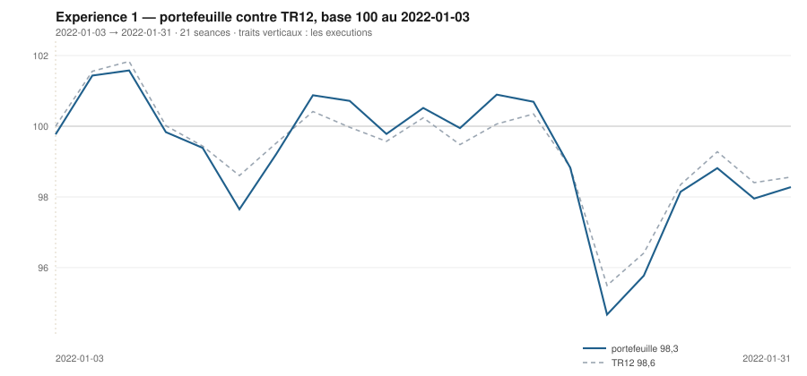

# Janvier 2022

> Journal de l'[expérience 1](../README.md) · **décision au 2021-12-31** · **exécution au 2022-01-03**
> Portefeuille au 2022-01-31 : **9 827,76 €** (base 98,28) · TR12 98,56 · alpha du mois **-0,28 pt** · depuis janvier **-0,28 pt**

---

## 1. Les actualités du mois précédent

**Décembre 2021.** Le CAC 40 clôt l'année à 7 153 points, en hausse de 28,85 % —
sa meilleure année depuis 1999. Le variant Omicron, identifié fin novembre, se
révèle plus contagieux mais moins sévère, et la crainte de reconfinements
généralisés reflue en fin de mois.

L'inflation de la zone euro atteint 5,0 % sur un an en décembre, un record depuis
la création de la monnaie unique. La Réserve fédérale accélère la réduction de
ses achats d'actifs et ses membres projettent désormais trois hausses de taux en
2022. La BCE, elle, maintient son taux de dépôt à −0,50 % et annonce la fin du
programme d'achats d'urgence pandémique pour mars, tout en écartant publiquement
une hausse de taux en 2022.

Les marchés abordent janvier avec des valorisations élevées et une politique
monétaire dont l'inflexion est annoncée mais pas encore engagée.

---

## 2. L'exposition héritée au 2021-12-31

*Aucune ligne : le portefeuille est intégralement en espèces.*

## 3. Le portefeuille depuis le 3 janvier 2022

| | |
|---|---|
| Dotation initiale | 10 000,00 € au 2022-01-03 |
| Titres au 2022-01-31 | 9 025,20 € |
| Espèces | 802,55 € |
| **Total** | **9 827,76 €** |
| Base 100 | **98,28** |
| TR12, même base | 98,56 |
| Écart depuis janvier | **-0,28 pt** |

## 4. L'étude chartiste au 2021-12-31

> Notes rédigées sans aucune séance postérieure au 2021-12-31, par l'agent `chartiste`. Cinq lignes au plus par société.

### 1. `MC.PA` — LVMH

- Tendance longue haussière et significative : +0,543 €/séance (+0,089 %/séance), R² = 0,33, p ≈ 10⁻¹¹, TEND_120 = +1.
- Tendance courte de même signe : +1,075 €/séance (+0,165 %/séance), p = 6,3·10⁻³, R² = 0,35.
- Support 605,29 € (pente +0,794, portée 40, 4 épisodes, dernier le 26/11) ; résistance 682,84 € (pente +0,324, portée 70, 3 épisodes : 12-13/08, 16-22/11, 25/11) — canal haussier légèrement convergent, τ = 165 séances.
- Position 74,0 %, largeur 77,55 € (11,7 %), résidu +0,63 σ, aucune sortie de canal ; dispersion des 20 dernières séances 1,62 % contre 5,05 % sur les 100 précédentes, soit un resserrement marqué.
- Observable ensuite : une clôture au-dessus du prolongement de la résistance (≈ 683 €) serait un franchissement datable ; sous 605 €, c'est un support à 4 épisodes qui tomberait.

### 2. `BNP.PA` — BNP Paribas

- Tendance longue la plus régulière du panier avec RI.PA : +0,065 €/séance (+0,164 %/séance), R² = 0,75, p ≈ 10⁻³⁸.
- Tendance courte de même signe : +0,170 €/séance (+0,404 %/séance), p = 1,1·10⁻⁴.
- Support 39,99 € (pente +0,063, portée 51, 3 épisodes, dernier le 20/12) ; résistance 43,85 € (pente −0,035, portée 33, 2 épisodes seulement : 15-16/11 et 23-31/12) — borne haute non confirmée, canal convergent τ = 39 séances.
- Position 97,7 %, largeur 3,86 € (8,8 %) : la clôture est sur la résistance, mais le volume du jour ne vaut que 0,16 fois sa moyenne 20 séances — le contact n'a aucune contrepartie de volume.
- Observable ensuite : au-dessus de 43,9 €, la droite à 2 points cesse d'encadrer ; le support, s'il tient sa pente, passerait à 41,3 € dans 20 séances.

### 3. `SU.PA` — Schneider Electric

- Tendance longue haussière : +0,180 €/séance (+0,129 %/séance), R² = 0,51, p ≈ 10⁻²⁰.
- Tendance courte plus rapide encore : +0,432 €/séance (+0,282 %/séance), R² = 0,64, p = 2,1·10⁻⁵.
- Support 145,28 € (pente +0,360, portée 33, 3 épisodes, dernier 26-30/11) ; résistance 159,17 € (pente +0,179, portée 94, 4 épisodes, dernier 23-31/12) — canal haussier convergent, τ = 77 séances.
- Position 87,5 %, largeur 13,89 € (8,8 %), résidu +1,26 σ : haut de canal, au plus haut de 120 séances (158,63 € le 28/12).
- Observable ensuite : le support monte de 0,36 €/séance, exigeant ; toute clôture sous ≈ 145,3 € l'invaliderait, toute clôture au-dessus de 159,2 € franchirait une résistance à 4 épisodes.

### 4. `TTE.PA` — TotalEnergies

- Tendance longue haussière et très explicative : +0,067 €/séance (+0,216 %/séance), R² = 0,79, p ≈ 10⁻⁴¹.
- Tendance courte de même signe : +0,055 €/séance (+0,161 %/séance), p = 1,1·10⁻³.
- Support 31,84 € (pente +0,056, portée 57, 5 épisodes, dernier 26-30/11) ; résistance 34,72 € quasi horizontale (pente +0,006, portée 50, 6 épisodes, dernier 22-31/12) : onze épisodes au total, structure installée des deux côtés.
- Position 75,3 %, largeur 2,88 € (8,5 %), canal convergent τ = 57 séances ; dispersion 1,38 % sur 20 séances contre 8,26 % sur les 100 précédentes.
- Observable ensuite : la résistance étant plate à ≈ 34,7 €, une clôture au-dessus tenue plus d'une séance serait le premier franchissement depuis octobre ; sous 31,8 €, un support à 5 épisodes cède.

### 5. `CAP.PA` — Capgemini

- Tendance longue haussière et bien établie : +0,261 €/séance (+0,149 %/séance), R² = 0,60, p ≈ 10⁻²⁵.
- Tendance courte de même signe : +0,655 €/séance (+0,349 %/séance), R² = 0,67, p = 9,4·10⁻⁶.
- Support 184,72 € (pente +0,517, portée 49, 4 épisodes, dernier 17-21/12) ; résistance 206,95 € (pente +0,323, portée 76, 3 épisodes, dernier 15-22/11) — canal haussier convergent, τ = 114 séances.
- Position 41,8 %, largeur 22,23 € (11,5 %) : milieu de canal, bien que le plus haut de 120 séances (197,26 €) date du 28/12.
- Observable ensuite : le support progresse de 0,52 €/séance, soit ≈ 195 € dans 20 séances ; c'est le passage sous cette droite qui invaliderait un support à 4 épisodes.

### 6. `RI.PA` — Pernod Ricard

- Tendance longue la plus linéaire du panier : +0,264 €/séance (+0,162 %/séance), R² = 0,875, p ≈ 10⁻⁵⁵, σ des résidus 2,1 % du niveau.
- Tendance courte haussière mais fragile : +0,094 €/séance, p = 0,029, IC₉₅ [+0,011 ; +0,178] frôle zéro.
- Support 173,94 € (pente +0,325, portée 86, 7 épisodes, dont 20-21/12, 27/12 et 31/12) ; résistance 186,12 € (pente +0,271, portée 78, 2 épisodes seulement) : support installé, résistance non confirmée.
- Position 21,2 %, largeur 12,18 € (6,9 %) : le cours clôture sur son support, dont il forme le septième épisode le jour même.
- Observable ensuite : le support monte de 0,32 €/séance ; une clôture sous ≈ 174 € romprait la seule droite réellement documentée de la valeur.

### 7. `OR.PA` — L'Oréal

- Tendance longue haussière : +0,264 €/séance (+0,072 %/séance), R² = 0,27, p = 1,5·10⁻⁹, TEND_120 = +1.
- Tendance courte indiscernable du bruit : +0,114 €/séance, p = 0,43, IC₉₅ [−0,184 ; +0,412] change de signe, TEND_20 = 0.
- Support 377,28 € (pente +0,931, portée 48, 3 épisodes : 11-13/10, 20/10, 20/12) ; résistance 406,86 € (pente +0,319, portée 70, 4 épisodes, dernier le 08/12) : canal fortement convergent, τ = 48 séances.
- Position 24,5 %, largeur 29,59 € (7,7 %) : tiers bas d'un canal qui se referme ; dispersion 0,92 % sur 20 séances contre 4,56 % sur les 100 précédentes.
- Observable ensuite : une clôture sous 377 € retirerait le support de 3 épisodes ; à défaut, la convergence elle-même annule l'encadrement en une cinquantaine de séances.

### 8. `SAN.PA` — Sanofi

- Tendance longue nulle au sens du test : +0,005 €/séance, R² = 0,006, p = 0,39, IC₉₅ [−0,006 ; +0,015] contient zéro, TEND_120 = 0.
- Tendance courte franchement haussière : +0,201 €/séance (+0,286 %/séance), R² = 0,89, p = 5,9·10⁻¹⁰.
- Support 68,16 € (pente +0,053, portée 33, 3 épisodes, dernier 03-10/12) ; résistance 72,24 € (pente −0,035, portée 31, 3 épisodes, dernier 28-31/12) — canal convergent, τ = 46 séances.
- Position 81,7 % d'un canal étroit de 4,08 € (5,7 %) : la clôture de décision est elle-même le troisième contact de la borne haute.
- Observable ensuite : une clôture au-dessus de 72,2 € invaliderait une résistance devenue crédible (3 épisodes) ; sous 68,2 €, c'est le support qui cède.

### 9. `AI.PA` — Air Liquide

- Tendance longue significative mais peu explicative : +0,022 €/séance (+0,022 %/séance), R² = 0,06, p = 5,4·10⁻³.
- Tendance courte muette : −0,056 €/séance, p = 0,32, IC₉₅ [−0,170 ; +0,059] à cheval sur zéro, TEND_20 = 0.
- Support 102,46 € (pente +0,155, portée 51, 4 épisodes, dernier le 22/12) ; résistance 108,49 € (pente +0,041, portée 69, 5 épisodes, dernier 14-16/12) : neuf épisodes, encadrement installé mais très serré.
- Position 42,1 %, largeur 6,04 € (5,7 %) — le canal le plus étroit du panier — et convergent, τ = 53 séances.
- Observable ensuite : le support gagne 0,155 €/séance et rejoindrait le cours actuel en une dizaine de séances sans hausse ; les deux niveaux à surveiller sont 102,5 € et 108,5 €.

### 10. `DG.PA` — Vinci

- Tendance longue rigoureusement absente : −0,0007 €/séance, R² = 0,000, p = 0,90, TEND_120 = 0.
- Tendance courte nettement haussière : +0,304 €/séance (+0,414 %/séance), R² = 0,64, p = 2,6·10⁻⁵, soit +8,9 % en 20 séances.
- Support 68,85 € (pente −0,012, portée 51, 3 épisodes, dernier le 30/11) ; résistance 77,43 € (pente −0,060, portée 32, 4 épisodes : 05-08/11, 11/11, 17/11 et 31/12).
- Position 100,0 % : la clôture du 31/12 est exactement sur la résistance descendante, dont elle constitue le quatrième épisode ; largeur 8,58 € (11,1 %), résidu +1,41 σ.
- Observable ensuite : la résistance perd 0,06 €/séance ; une clôture au-dessus de 77,4 € la ferait tomber, un repli la reconduirait en butée pour la cinquième fois.

### 11. `AIR.PA` — Airbus

- Tendance longue baissière et significative : pente −0,063 €/séance (−0,061 %/séance), R² = 0,27, p = 1,8·10⁻⁹, TEND_120 = −1 sur la fenêtre 19/07→31/12.
- Tendance courte inverse : +0,522 €/séance (+0,530 %/séance), R² = 0,57, p = 1,3·10⁻⁴, soit +14,0 % en 20 séances — les deux échelles sont de signes opposés.
- Encadrement convexe (120 séances) : support 86,02 € (pente −0,072, portée 94 séances, 2 épisodes : 19-20/07 et 26/11) ; résistance 104,34 € (pente −0,097, portée 35, 2 épisodes : 09-11/11 et 28-31/12).
- Position 93,1 % d'un canal large de 18,32 € (17,8 %) : le cours revient buter sur la borne haute, mais 2 épisodes seulement de chaque côté — encadrement non confirmé ; volume du 31/12 à 0,24 fois sa moyenne 20 séances.
- Observable ensuite : une clôture au-dessus de 104,3 €, tenue, retirerait la résistance descendante ; un retour sous VAL_120 = 98,74 € replacerait le cours du côté baissier de la droite longue.

### 12. `ORA.PA` — Orange

- Tendance longue non distinguable du bruit : +0,0006 €/séance, R² = 0,02, p = 0,096, IC₉₅ [−0,0001 ; +0,0012] contient zéro, TEND_120 = 0.
- Tendance courte haussière et très linéaire : +0,024 €/séance (+0,340 %/séance), R² = 0,87, p = 2,1·10⁻⁹.
- Support 6,64 € (pente −0,0005, portée 91, 3 épisodes : 29/07, 03/12, 10/12) ; résistance 7,33 € (pente +0,0012, portée 67, 2 épisodes) : canal quasi horizontal et divergent (τ = ∞), largeur 0,69 € (9,7 %).
- Position 66,8 % ; le cours sort d'un creux à 6,65 € le 03/12, marqué à −2,4 σ du canal de régression, sans persistance.
- Observable ensuite : la borne haute ne repose que sur 2 points, donc non confirmée ; seule une clôture au-dessus de 7,33 € ou sous 6,64 € trancherait l'alternative.

## 5. Le classement au 2021-12-31

> De la valeur la plus intéressante à détenir à celle qu'il faut fuir. Le détail des cinq composantes est dans le [protocole](../README.md#le-score-en-cinq-composantes).

| Rang | Valeur | `s1` | `s2` | `s3` | `s4` | `s5` | Score | Position | Momentum 12-1 |
|---|---|---|---|---|---|---|---|---|---|
| 1 | `MC.PA` LVMH | +2 | +1 | +1 | +2 | +0 | **+6** | 74,0 % | +32,9 % |
| 2 | `BNP.PA` BNP Paribas | +2 | +1 | +1 | +2 | +0 | **+6** | 97,7 % | +31,6 % |
| 3 | `SU.PA` Schneider Electric | +2 | +1 | +1 | +2 | +0 | **+6** | 87,5 % | +29,6 % |
| 4 | `TTE.PA` TotalEnergies | +2 | +1 | +1 | +2 | +0 | **+6** | 75,3 % | +19,8 % |
| 5 | `CAP.PA` Capgemini | +2 | +1 | +0 | +2 | +0 | **+5** | 41,8 % | +67,9 % |
| 6 | `RI.PA` Pernod Ricard | +2 | +1 | +0 | +2 | +0 | **+5** | 21,2 % | +31,7 % |
| 7 | `OR.PA` L'Oréal | +2 | +0 | +0 | +2 | +0 | **+4** | 24,5 % | +32,0 % |
| 8 | `SAN.PA` Sanofi | +0 | +1 | +1 | +2 | +0 | **+4** | 81,7 % | +10,3 % |
| 9 | `AI.PA` Air Liquide | +2 | +0 | +0 | +1 | +0 | **+3** | 42,1 % | +9,2 % |
| 10 | `DG.PA` Vinci | +0 | +1 | +1 | +1 | +0 | **+3** | 100,0 % | +8,3 % |
| 11 | `AIR.PA` Airbus | -2 | +1 | +1 | +2 | +0 | **+2** | 93,1 % | +12,6 % |
| 12 | `ORA.PA` Orange | +0 | +1 | +1 | -1 | +0 | **+1** | 66,8 % | -2,9 % |

## 6. Les ordres exécutés au 2022-01-03

> À l'**ouverture** de la séance, jamais à la clôture du 2021-12-31.

| Sens | Valeur | Quantité | Prix d'exécution | Brut | Frais | Motif |
|---|---|---|---|---|---|---|
| **Achat** | `MC.PA` LVMH | 2 | 669,09 € | 1 338,19 € | 5,55 € | rang 1, score +6 |
| **Achat** | `BNP.PA` BNP Paribas | 45 | 44,01 € | 1 980,23 € | 8,22 € | rang 2, score +6 |
| **Achat** | `SU.PA` Schneider Electric | 12 | 159,04 € | 1 908,44 € | 7,92 € | rang 3, score +6 |
| **Achat** | `TTE.PA` TotalEnergies | 58 | 34,32 € | 1 990,57 € | 8,26 € | rang 4, score +6 |
| **Achat** | `CAP.PA` Capgemini | 10 | 194,20 € | 1 942,01 € | 8,06 € | rang 5, score +5 |

## 7. La lecture du mois

Sur le mois, la meilleure contribution vient de `TTE.PA` (TotalEnergies) pour **+261,94 €**, la moins bonne de `SU.PA` (Schneider Electric) pour **-272,32 €**. Les 5 ordres du mois ont coûté **38,01 €** de frais, soit 0,380 % de la dotation initiale. Le portefeuille termine le mois **derrière TR12** de 0,28 point.

---

[Protocole](../README.md) · [Février →](2022-02.md)
