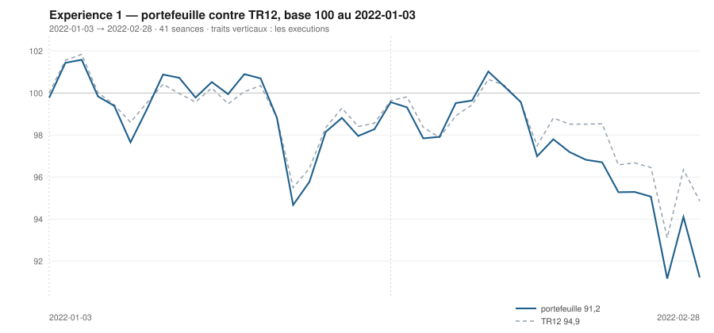

# Février 2022

> Journal de l'[expérience 1](../README.md) · **décision au 2022-01-31** · **exécution au 2022-02-01**
> Portefeuille au 2022-02-28 : **9 122,22 €** (base 91,22) · TR12 94,86 · alpha du mois **-3,43 pt** · depuis janvier **-3,64 pt**

---

## 1. Les actualités du mois précédent

**Janvier 2022.** Correction brutale sur les anticipations de resserrement
monétaire. Le rendement du Trésor américain à dix ans passe de 1,5 % à près de
1,8 %, et les valeurs de croissance — les plus sensibles à l'actualisation des
flux lointains — subissent la plus forte dérive de valorisation. Le Nasdaq entre
en correction.

Sur la frontière ukrainienne, le renforcement des troupes russes devient
préoccupant, sans qu'une invasion soit alors le scénario central des marchés.
Les prix du gaz européen sont déjà tendus, et le pétrole franchit les 90 dollars.

En Europe, les valeurs financières résistent nettement mieux que la technologie :
une pentification de la courbe des taux améliore mécaniquement les marges
d'intermédiation.

---

## 2. L'exposition héritée au 2022-01-31

| Valeur | Achetée le | Prix d'achat | +/− value | Alpha du mois | Alpha global |
|---|---|---|---|---|---|
| `BNP.PA` BNP Paribas | 2022-01-03 | 44,01 € | **+3,09 %** | +4,53 pt *(partiel)* | +4,53 pt |
| `CAP.PA` Capgemini | 2022-01-03 | 194,20 € | **-8,46 %** | -7,02 pt *(partiel)* | -7,02 pt |
| `MC.PA` LVMH | 2022-01-03 | 669,09 € | **-1,55 %** | -0,11 pt *(partiel)* | -0,11 pt |
| `SU.PA` Schneider Electric | 2022-01-03 | 159,04 € | **-14,27 %** | -12,83 pt *(partiel)* | -12,83 pt |
| `TTE.PA` TotalEnergies | 2022-01-03 | 34,32 € | **+13,16 %** | +14,60 pt *(partiel)* | +14,60 pt |

## 3. Le portefeuille depuis le 3 janvier 2022

| | |
|---|---|
| Dotation initiale | 10 000,00 € au 2022-01-03 |
| Titres au 2022-02-28 | 9 058,85 € |
| Espèces | 63,37 € |
| **Total** | **9 122,22 €** |
| Base 100 | **91,22** |
| TR12, même base | 94,86 |
| Écart depuis janvier | **-3,64 pt** |

## 4. L'étude chartiste au 2022-01-31

> Notes rédigées sans aucune séance postérieure au 2022-01-31, par l'agent `chartiste`. Cinq lignes au plus par société.

### 1. `TTE.PA` — TotalEnergies

- Tendance longue haussière et très explicative : +0,082 €/séance (+0,251 %/séance), R² = 0,80, p ≈ 10⁻⁴³.
- Tendance courte de même signe et plus rapide : +0,220 €/séance (+0,581 %/séance), R² = 0,71, p = 3,7·10⁻⁶, soit +11,6 % en 20 séances.
- Support 33,02 € (pente +0,056, portée 57, 4 épisodes, dernier 26/11-02/12) ; résistance 40,76 € (pente +0,087, portée 72, 3 épisodes, dernier 26-28/01) : canal divergent, largeur 7,75 € (19,9 %) contre 8,5 % au 31/12.
- Position 75,1 % : le cours est 17,6 % au-dessus de son support et 4,7 % sous sa résistance, avec un plus haut de 120 séances à 40,59 € le 27/01.
- Observable ensuite : l'élargissement rend le support inopérant à court terme ; le seul niveau testable est la résistance à ≈ 40,8 €, appuyée sur 3 épisodes dont deux de janvier.

### 2. `SAN.PA` — Sanofi

- Tendance longue redevenue haussière : +0,037 €/séance (+0,052 %/séance), R² = 0,25, p = 5,1·10⁻⁹, TEND_120 = +1.
- Tendance courte de même signe : +0,223 €/séance (+0,305 %/séance), R² = 0,62, p = 4,2·10⁻⁵.
- Support 71,77 € (pente +0,114, portée 37, 5 épisodes, dernier 24-25/01) ; résistance 76,83 € (pente +0,029, portée 114, 2 épisodes seulement : 19-23/08 et 27-28/01) — borne haute non confirmée.
- Position 61,0 %, largeur 5,06 € (6,8 %), canal convergent τ = 59 séances ; plus haut de 120 séances à 76,80 € le 28/01, c'est-à-dire sur la résistance.
- Observable ensuite : une clôture au-dessus de 76,8 € retirerait une droite qui ne tient qu'à deux points distants de cinq mois ; sous 71,8 €, c'est un support à 5 épisodes qui tombe.

### 3. `BNP.PA` — BNP Paribas

- Tendance longue haussière et très explicative : +0,076 €/séance (+0,183 %/séance), R² = 0,77, p ≈ 10⁻³⁹.
- Tendance courte éteinte sans se retourner : −0,062 €/séance, p = 0,19, IC₉₅ [−0,156 ; +0,033] contient zéro, TEND_20 = 0.
- Support 41,31 € (pente +0,063, portée 51, 3 épisodes, dernier 17-20/12) ; résistance 49,10 € (pente +0,074, portée 43, 2 épisodes : 15-16/11 et 13-18/01), canal divergent.
- Position 52,0 %, largeur 7,79 € soit 17,2 % du cours contre 8,8 % un mois plus tôt : la largeur a doublé, milieu de canal par élargissement plus que par mouvement.
- Observable ensuite : la butée réelle est le plus haut du 17/01 à 48,35 € ; côté bas, seule une clôture sous 41,3 € invaliderait le côté à 3 épisodes.

### 4. `DG.PA` — Vinci

- Tendance longue haussière modeste : +0,034 €/séance (+0,045 %/séance), R² = 0,17, p = 3,3·10⁻⁶.
- Tendance courte de même signe mais imprécise : +0,131 €/séance (+0,163 %/séance), p = 9,9·10⁻³, IC₉₅ [+0,036 ; +0,227].
- Support 79,54 € (pente +0,325, portée 30, 2 épisodes seulement : 20/12 et 25-31/01) ; résistance 83,09 € (pente +0,050, portée 98, 3 épisodes, dernier 14-20/01).
- Position 28,4 %, mais largeur réduite à 3,54 € (4,4 %) et canal convergent en τ = 12,9 séances : un support à +0,32 €/séance sous une résistance à +0,05 €/séance ne peut pas durer.
- Observable ensuite : l'encadrement s'annule de lui-même en une quinzaine de séances ; les deux issues datables sont le franchissement de 83,1 € ou la perte d'un support qui n'a que 2 épisodes.

### 5. `ORA.PA` — Orange

- Tendance longue devenue significative : +0,0040 €/séance (+0,056 %/séance), R² = 0,33, p ≈ 10⁻¹², TEND_120 = +1.
- Tendance courte très linéaire : +0,038 €/séance (+0,512 %/séance), R² = 0,91, p = 7,6·10⁻¹¹, soit +10,6 % en 20 séances.
- Support 6,60 € (pente −0,0013, portée 53, 5 épisodes, dernier 09-10/12) ; résistance 7,95 € (pente +0,0064, portée 115, 2 épisodes : 20-23/08 et 27-31/01) — borne haute non confirmée.
- Position 93,3 % : sortie par le haut du canal de régression à +2,90 σ, persistante sur 3 séances (27, 28 et 31/01), avec un plus haut de 120 séances à 7,95 € le jour même — mais un volume à 1,00 fois seulement sa moyenne 20 séances.
- Observable ensuite : rupture haussière persistante et sans volume ; un retour sous ≈ 7,8 €, borne haute du canal de régression, la refermerait.

### 6. `MC.PA` — LVMH

- Tendance longue haussière et solide : +0,794 €/séance (+0,129 %/séance), R² = 0,62, p ≈ 10⁻²⁶.
- Tendance courte baissière : −1,922 €/séance (−0,300 %/séance), R² = 0,26, p = 0,023 — les deux échelles divergent.
- Support 605,60 € (pente +0,604, portée 82, 6 épisodes, dernier 24-27/01) ; résistance 701,42 € (pente +0,555, portée 33, 4 épisodes, dernier 05/01) : canal quasi parallèle, τ = 1 958 séances.
- Position 55,4 %, largeur 95,81 € (14,5 %) ; repli des 24-25/01 jusqu'à −2,6 σ du canal de régression, volume 1,45 fois la moyenne, mais rebond immédiat et zéro séance dehors à la date.
- Observable ensuite : le cours est revenu au milieu du canal ; une clôture sous 606 € romprait le support le mieux documenté du panier ce mois-ci (6 épisodes).

### 7. `CAP.PA` — Capgemini

- Tendance longue haussière : +0,170 €/séance (+0,095 %/séance), R² = 0,34, p ≈ 10⁻¹².
- Tendance courte baissière : −0,709 €/séance (−0,393 %/séance), R² = 0,43, p = 1,8·10⁻³, soit −7,5 % en 20 séances.
- Support 169,32 € (pente +0,185, portée 77, 3 épisodes, dernier 24-28/01) ; résistance 198,84 € (pente +0,031, portée 32, 3 épisodes, dernier 04/01).
- Position 28,6 %, largeur 29,52 € (16,6 %) contre 11,5 % un mois plus tôt ; un seul dépassement au-delà de 2 σ (25/01, −2,16 σ), non persistant.
- Observable ensuite : le support, à 169,3 € et montant de 0,18 €/séance, est le niveau dont la rupture serait datable ; le plus haut du 04/01 à 198,25 € borne le haut de la fenêtre.

### 8. `SU.PA` — Schneider Electric

- Tendance longue encore positive : +0,146 €/séance (+0,103 %/séance), R² = 0,34, p ≈ 10⁻¹².
- Tendance courte très marquée en sens inverse : −1,338 €/séance (−0,910 %/séance), R² = 0,89, p = 6,5·10⁻¹⁰, soit −14,7 % en 20 séances.
- Support 132,30 € (pente +0,100, portée 78, 2 épisodes : 11-13/10 et 27-28/01, donc non confirmé) ; résistance 167,30 € (pente +0,216, portée 99, 3 épisodes, dernier 03-05/01).
- Position 11,6 %, largeur 35,00 € soit 25,7 % contre 8,8 % un mois plus tôt ; sortie du canal de régression à −2,04 σ, 2 séances consécutives dehors (28 et 31/01), volume 1,18 fois la moyenne.
- Observable ensuite : deux séances dehors à peine au-delà de 2 σ, sans volume marquant, ne qualifient pas une rupture ; une troisième clôture consécutive dehors, ou une clôture sous 132,3 €, la qualifierait.

### 9. `OR.PA` — L'Oréal

- Tendance longue encore positive mais portée par le début de fenêtre : +0,158 €/séance, R² = 0,08, p = 1,5·10⁻³.
- Tendance courte très marquée : −2,714 €/séance (−0,758 %/séance), R² = 0,80, p = 1,0·10⁻⁷, soit −11,5 % en 20 séances.
- Support 333,59 € (pente +0,123, portée 77, 3 épisodes, dernier 24-28/01) ; résistance 418,45 € (pente +0,413, portée 66, 4 épisodes, dernier 08/12) : canal divergent, τ = ∞.
- Position 16,4 %, largeur 84,86 € soit 24,4 % du cours contre 7,7 % un mois plus tôt — élargissement d'un facteur trois ; résidu −1,45 σ, volume 1,82 fois la moyenne 20 séances.
- Observable ensuite : un canal à 24 % de largeur n'encadre plus rien ; le seul événement datable serait une clôture sous 334 €, qui retirerait le support à 3 épisodes.

### 10. `RI.PA` — Pernod Ricard

- Tendance longue encore haussière mais dégradée : +0,195 €/séance (+0,118 %/séance), R² = 0,54 contre 0,875 un mois plus tôt, p ≈ 10⁻²¹.
- Tendance courte très baissière : −0,978 €/séance (−0,587 %/séance), R² = 0,84, p = 1,2·10⁻⁸, soit −10,1 % en 20 séances.
- Support 157,29 € (pente +0,122, portée 115, 3 épisodes, dernier 25-31/01) ; résistance 196,78 € (pente +0,363, portée 64, 3 épisodes, dernier 25/11) : canal divergent, largeur 39,49 € (25,0 %) contre 6,9 % au 31/12.
- Rupture qualifiée : le résidu atteint −3,00 σ, avec 6 séances consécutives au-delà de −2 σ (24/01→31/01) et un volume à 1,62 fois la moyenne 20 séances — la sortie la mieux documentée du panier à cette date ; position 1,2 %.
- Observable ensuite : le canal de régression 120 est rompu par le bas ; ce qui reste vérifiable séance par séance, c'est le maintien ou non de la clôture au-dessus de 157,3 €.

### 11. `AI.PA` — Air Liquide

- Tendance longue haussière : +0,054 €/séance (+0,053 %/séance), R² = 0,28, p = 8,0·10⁻¹⁰.
- Tendance courte baissière et nette : −0,249 €/séance (−0,235 %/séance), R² = 0,69, p = 5,3·10⁻⁶.
- Support 102,61 € (pente +0,116, portée 78, 3 épisodes, dernier 28-31/01) ; résistance 110,54 € (pente +0,052, portée 89, 4 épisodes, dernier 05-06/01) ; canal convergent, τ = 124 séances.
- Position 13,4 %, largeur 7,93 € (7,7 %) : la clôture est à 1,0 % au-dessus du support, dont elle forme le troisième épisode — la droite vient d'atteindre le seuil de crédibilité.
- Observable ensuite : le contact est frais ; une clôture sous 102,6 € invaliderait un support à peine confirmé et laisserait la valeur sans borne basse sur la fenêtre.

### 12. `AIR.PA` — Airbus

- Tendance longue baissière mais marginale : −0,025 €/séance (−0,024 %/séance), R² = 0,04, p = 0,034, IC₉₅ [−0,047 ; −0,002] frôle zéro.
- Tendance courte franchement baissière : −0,447 €/séance (−0,422 %/séance), R² = 0,67, p = 1,1·10⁻⁵, soit −3,5 % en 20 séances après le plus haut du 05/01 à 111,10 €.
- Support 98,35 € (pente +0,229, portée 42, 5 épisodes, dernier 24-25/01) ; résistance 111,61 € (pente +0,028, portée 72, 4 épisodes, dernier 05-06/01).
- Position 34,0 %, largeur 13,26 € (12,9 %), canal convergent τ = 66 séances ; volume du jour 1,09 fois sa moyenne 20 séances, aucune sortie de canal.
- Observable ensuite : le support monte de 0,23 €/séance quand la pente courte vaut −0,45 €/séance ; au rythme constaté les deux se croisent en quelques séances, et une clôture sous ≈ 98,5 € invaliderait un support à 5 épisodes.

## 5. Le classement au 2022-01-31

> De la valeur la plus intéressante à détenir à celle qu'il faut fuir. Le détail des cinq composantes est dans le [protocole](../README.md#le-score-en-cinq-composantes).

| Rang | Valeur | `s1` | `s2` | `s3` | `s4` | `s5` | Score | Position | Momentum 12-1 |
|---|---|---|---|---|---|---|---|---|---|
| 1 | `TTE.PA` TotalEnergies | +2 | +1 | +1 | +2 | +0 | **+6** | 75,1 % | +35,9 % |
| 2 | `SAN.PA` Sanofi | +2 | +1 | +1 | +2 | +0 | **+6** | 61,0 % | +14,2 % |
| 3 | `BNP.PA` BNP Paribas | +2 | +0 | +1 | +2 | +0 | **+5** | 52,0 % | +45,1 % |
| 4 | `DG.PA` Vinci | +2 | +1 | +0 | +2 | +0 | **+5** | 28,4 % | +11,4 % |
| 5 | `ORA.PA` Orange | +2 | +1 | +1 | +1 | +0 | **+5** | 93,3 % | +5,0 % |
| 6 | `MC.PA` LVMH | +2 | -1 | +1 | +2 | +0 | **+4** | 55,4 % | +36,8 % |
| 7 | `CAP.PA` Capgemini | +2 | -1 | +0 | +2 | +0 | **+3** | 28,6 % | +64,2 % |
| 8 | `SU.PA` Schneider Electric | +2 | -1 | -1 | +2 | +0 | **+2** | 11,6 % | +42,8 % |
| 9 | `OR.PA` L'Oréal | +2 | -1 | -1 | +2 | +0 | **+2** | 16,4 % | +34,9 % |
| 10 | `RI.PA` Pernod Ricard | +2 | -1 | -1 | +2 | +0 | **+2** | 1,2 % | +31,2 % |
| 11 | `AI.PA` Air Liquide | +2 | -1 | -1 | +2 | +0 | **+2** | 13,4 % | +13,7 % |
| 12 | `AIR.PA` Airbus | -2 | -1 | +0 | +2 | +0 | **-1** | 34,0 % | +21,5 % |

## 6. Les ordres exécutés au 2022-02-01

> À l'**ouverture** de la séance, jamais à la clôture du 2022-01-31.

| Sens | Valeur | Quantité | Prix d'exécution | Brut | Frais | Motif |
|---|---|---|---|---|---|---|
| **Vente** | `SU.PA` Schneider Electric | 12 | 138,30 € | 1 659,56 € | 1,91 € | rang 8 au-dela de 7 |
| **Achat** | `SAN.PA` Sanofi | 32 | 74,59 € | 2 386,92 € | 9,91 € | rang 2, score +6 |

## 7. La lecture du mois

Sur le mois, la meilleure contribution vient de `SAN.PA` (Sanofi) pour **+27,12 €**, la moins bonne de `BNP.PA` (BNP Paribas) pour **-339,92 €**. Les 2 ordres du mois ont coûté **11,81 €** de frais, soit 0,118 % de la dotation initiale. Le portefeuille termine le mois **derrière TR12** de 3,43 point.

---

[← Janvier](2022-01.md) · [Protocole](../README.md) · [Mars →](2022-03.md)
