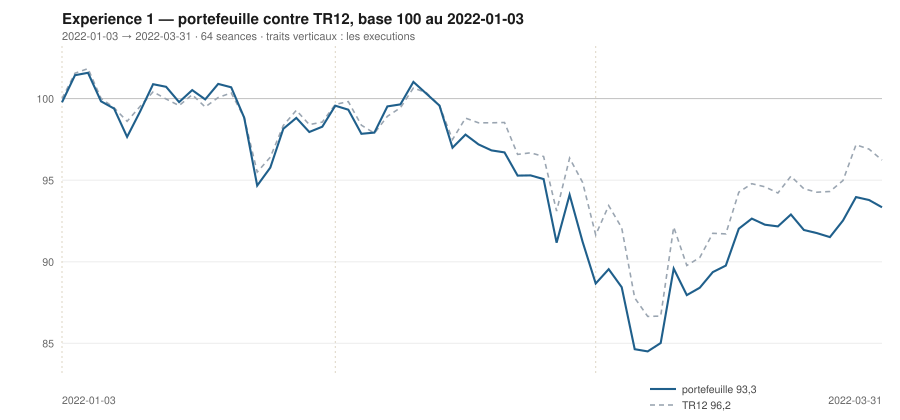

# Mars 2022

> Journal de l'[expérience 1](../README.md) · **décision au 2022-02-28** · **exécution au 2022-03-01**
> Portefeuille au 2022-03-31 : **9 333,94 €** (base 93,34) · TR12 96,23 · alpha du mois **+0,88 pt** · depuis janvier **-2,89 pt**

---

## 1. Les actualités du mois précédent

**Février 2022.** Le 3 février, Christine Lagarde refuse pour la première fois
d'exclure une hausse de taux en 2022 : le marché lit un pivot, et les rendements
souverains européens bondissent.

Le 24 février, la Russie envahit l'Ukraine. Les places européennes décrochent
lourdement, le CAC 40 perd plus de 4 % sur la séance. Le gaz et le pétrole
s'envolent, l'euro se déprécie, et les valeurs les plus exposées au continent
— banques, automobile, distribution — sont les plus touchées. Les sanctions
occidentales, dont l'exclusion de banques russes du réseau SWIFT, sont annoncées
dans les jours qui suivent.

Le mois se termine dans une incertitude que rien de quantitatif ne permet de
réduire : la question posée n'est plus celle du cycle, mais celle de
l'approvisionnement énergétique de l'Europe.

---

## 2. L'exposition héritée au 2022-02-28

| Valeur | Achetée le | Prix d'achat | +/− value | Alpha du mois | Alpha global |
|---|---|---|---|---|---|
| `BNP.PA` BNP Paribas | 2022-01-03 | 44,01 € | **-14,07 %** | -12,90 pt | -8,93 pt |
| `CAP.PA` Capgemini | 2022-01-03 | 194,20 € | **-12,70 %** | -0,88 pt | -7,56 pt |
| `MC.PA` LVMH | 2022-01-03 | 669,09 € | **-10,10 %** | -4,92 pt | -4,96 pt |
| `SAN.PA` Sanofi | 2022-02-01 | 74,59 € | **+1,14 %** | +5,93 pt *(partiel)* | +5,93 pt |
| `TTE.PA` TotalEnergies | 2022-01-03 | 34,32 € | **+2,73 %** | -5,47 pt | +7,87 pt |

## 3. Le portefeuille depuis le 3 janvier 2022

| | |
|---|---|
| Dotation initiale | 10 000,00 € au 2022-01-03 |
| Titres au 2022-03-31 | 9 222,61 € |
| Espèces | 111,33 € |
| **Total** | **9 333,94 €** |
| Base 100 | **93,34** |
| TR12, même base | 96,23 |
| Écart depuis janvier | **-2,89 pt** |

## 4. L'étude chartiste au 2022-02-28

> Notes rédigées sans aucune séance postérieure au 2022-02-28, par l'agent `chartiste`. Cinq lignes au plus par société.

### 1. `ORA.PA` — Orange

- Tendance longue haussière et explicative : +0,0113 €/séance (+0,156 %/séance), R² = 0,70, p ≈ 10⁻³².
- Tendance courte de même signe : +0,021 €/séance (+0,262 %/séance), R² = 0,57, p = 1,1·10⁻⁴ — seule valeur du panier dont les deux échelles restent haussières à cette date.
- Support 6,57 € (pente −0,0013, portée 53, 4 épisodes, dernier 02-13/12) ; résistance 8,50 € (pente +0,0135, portée 113, 5 épisodes, dernier 17-23/02) : neuf épisodes, encadrement installé mais divergent (τ = ∞), largeur 1,93 € (23,7 %).
- Position 82,3 %, plus haut de 120 séances à 8,42 € le 18/02, volume du jour à 0,98 fois sa moyenne 20 séances ; aucune clôture hors canal sur les 45 dernières séances.
- Observable ensuite : la résistance monte de 0,0135 €/séance et a été testée deux fois en février ; une clôture au-dessus de ≈ 8,50 € serait le premier franchissement de la fenêtre.

### 2. `SAN.PA` — Sanofi

- Tendance longue haussière et très propre : +0,075 €/séance (+0,105 %/séance), R² = 0,75, p ≈ 10⁻³⁷, σ des résidus 2,1 % du niveau.
- Tendance courte indéterminée : +0,036 €/séance, p = 0,32, IC₉₅ [−0,039 ; +0,111] contient zéro, TEND_20 = 0.
- Support 71,71 € (pente +0,076, portée 45, 6 épisodes, dernier 24/02) ; résistance 77,96 € (pente +0,055, portée 61, 4 épisodes, dernier 09/02) : dix épisodes, l'encadrement le mieux installé du panier.
- Position 59,7 %, largeur 6,25 € (8,3 %), canal presque parallèle (τ = 303 séances) ; résidu +0,11 σ et aucune clôture hors canal sur les 120 séances.
- Observable ensuite : c'est la seule valeur dont les deux droites sont confirmées et de pentes voisines ; une clôture hors de l'intervalle 71,7 €–78,0 € serait un événement inédit sur la fenêtre.

### 3. `SU.PA` — Schneider Electric

- Tendance longue devenue marginale : +0,054 €/séance, R² = 0,04, p = 0,031, IC₉₅ [+0,005 ; +0,104] presque au contact de zéro.
- Tendance courte baissière et nette : −0,695 €/séance (−0,524 %/séance), R² = 0,76, p = 5,5·10⁻⁷.
- Support 118,72 € (pente −0,058, portée 97, 3 épisodes, dernier 22-24/02) ; résistance 130,57 € (pente −0,858 soit −0,672 %/séance, portée 31, 3 épisodes, dernier 16-21/02) : canal convergent, τ = 14,8 séances.
- Position 74,9 %, largeur 11,85 € (9,3 %) après 25,7 % un mois plus tôt : le canal s'est refermé de plus de moitié ; plus bas de 120 séances à 118,83 € le 24/02.
- Observable ensuite : avec une résistance qui perd 0,86 € par séance, l'encadrement s'annule en une quinzaine de séances ; le franchissement de 130,6 € ou la perte de 118,7 € trancherait avant.

### 4. `AI.PA` — Air Liquide

- Tendance longue haussière : +0,056 €/séance (+0,055 %/séance), R² = 0,28, p = 3,6·10⁻¹⁰.
- Tendance courte indéterminée : −0,093 €/séance, p = 0,25, IC₉₅ [−0,256 ; +0,071] contient zéro, TEND_20 = 0.
- Support 95,33 € (pente +0,019, portée 89, 4 épisodes, dernier 14/02) ; résistance 112,87 € (pente +0,086, portée 81, 3 épisodes, dernier 05-06/01) ; la clôture du 05/01 a effleuré la borne haute (position 100,0 %), unique sortie des 45 dernières séances.
- Position 37,1 %, largeur 17,55 € (17,2 %) contre 5,7 % au 31/12 : le canal a triplé de largeur en deux mois.
- Observable ensuite : entre 95,3 € et 112,9 €, l'encadrement est trop large pour contraindre quoi que ce soit ; un nouveau test du support donnerait un cinquième épisode et le rendrait de nouveau lisible.

### 5. `CAP.PA` — Capgemini

- Tendance longue réduite à presque rien : +0,059 €/séance, R² = 0,04, p = 0,030, IC₉₅ [+0,006 ; +0,112].
- Tendance courte baissière : −0,855 €/séance (−0,496 %/séance), R² = 0,65, p = 1,7·10⁻⁵.
- Support 158,62 € (pente +0,039, portée 96, 4 épisodes, dernier 22-24/02) ; résistance 199,46 € (pente +0,031, portée 32, 3 épisodes, dernier 04/01) : canal quasi parallèle, largeur 40,84 € (24,1 %) contre 11,5 % au 31/12.
- Position 26,7 %, résidu −1,23 σ, aucune sortie au-delà de 2 σ sur les 45 dernières séances malgré −4,6 % en 20 séances.
- Observable ensuite : l'écart entre pente de régression (+0,06 €/séance) et pente courte (−0,86 €/séance) signale un canal mal défini ; le support à 158,6 €, 6,9 % sous le cours, est le seul niveau réellement testable.

### 6. `MC.PA` — LVMH

- Tendance longue encore haussière : +0,515 €/séance (+0,082 %/séance), R² = 0,31, p ≈ 10⁻¹¹.
- Tendance courte fortement baissière : −3,573 €/séance (−0,568 %/séance), R² = 0,84, p = 1,5·10⁻⁸, soit −8,7 % en 20 séances.
- Support 570,09 € (pente +0,179, portée 113, 4 épisodes, dernier 24/02) ; résistance 712,52 € (pente +0,555, portée 33, 3 épisodes, dernier 05/01) : canal divergent, largeur 142,43 € (23,7 %) contre 14,5 % un mois plus tôt.
- Position 22,1 % ; sortie du canal de régression le 24/02 à −2,82 σ puis le 28/02 à −2,04 σ, volume 1,46 fois la moyenne, mais une seule séance consécutive dehors à la date.
- Observable ensuite : la persistance manque pour parler de rupture installée ; le maintien de la clôture au-dessus de 570 €, support à 4 épisodes, est ce qui se vérifie séance par séance.

### 7. `RI.PA` — Pernod Ricard

- Tendance longue disparue : +0,028 €/séance, R² = 0,02, p = 0,13, IC₉₅ [−0,009 ; +0,065] contient zéro, alors que R² valait 0,875 fin décembre.
- Tendance courte également muette : +0,114 €/séance, p = 0,16, IC₉₅ [−0,050 ; +0,278], TEND_20 = 0.
- Support 154,95 € (pente +0,038, portée 116, 3 épisodes, dernier 24/02) ; résistance 164,27 € (pente −0,448 soit −0,274 %/séance, portée 37, 2 épisodes : 04-06/01 et 18-28/02) : canal convergent, τ = 19,2 séances.
- Position 89,6 %, largeur 9,33 € (5,7 %) : la clôture est à 0,6 % sous une résistance descendante qu'elle longe depuis huit séances.
- Observable ensuite : cette résistance n'a que 2 épisodes ; ou bien elle est franchie au-dessus de ≈ 164 €, ou bien elle rejoint le support en une vingtaine de séances et l'encadrement cesse d'exister.

### 8. `DG.PA` — Vinci

- Tendance longue haussière : +0,078 €/séance (+0,101 %/séance), R² = 0,46, p ≈ 10⁻¹⁷.
- Tendance courte indéterminée : −0,142 €/séance, p = 0,13, IC₉₅ [−0,330 ; +0,047] contient zéro, TEND_20 = 0.
- Support 76,68 € (pente +0,137, portée 50, 2 épisodes : 20/12 et 24-28/02, donc non confirmé) ; résistance 87,61 € (pente +0,097, portée 98, 4 épisodes, dernier 16-18/02).
- Position 19,1 %, largeur 10,94 € (13,9 %) : le cours est à 2,7 % de son support, volume du jour à 1,61 fois sa moyenne 20 séances, aucune sortie au-delà de 2 σ sur la fenêtre.
- Observable ensuite : le support se documente en ce moment même ; une clôture sous 76,7 € l'invaliderait avant qu'il atteigne trois épisodes, la résistance à 87,6 € restant le seul côté crédible.

### 9. `AIR.PA` — Airbus

- Tendance longue éteinte : +0,013 €/séance, R² = 0,01, p = 0,26, IC₉₅ [−0,010 ; +0,037] à cheval sur zéro, TEND_120 = 0.
- Tendance courte muette également : −0,004 €/séance, p = 0,97, TEND_20 = 0 — aucune direction mesurable aux deux échelles.
- Support 97,28 € (pente +0,143, portée 64, 2 épisodes : 26-30/11 et 24/02) ; résistance 110,27 € (pente −0,022, portée 31, 2 épisodes : 05-06/01 et 16-17/02) : encadrement non confirmé des deux côtés.
- Position 62,6 %, largeur 12,99 € (12,3 %), résidu +0,39 σ, aucune sortie de canal ; volume du 28/02 à 2,03 fois sa moyenne 20 séances, le plus fort ratio du panier, sans rupture associée.
- Observable ensuite : le point bas du 24/02 est le premier contact du support depuis novembre ; une clôture sous 97,3 € ou au-dessus de 110,3 € retirerait l'une des deux droites à 2 points.

### 10. `TTE.PA` — TotalEnergies

- Tendance longue haussière et très explicative : +0,078 €/séance (+0,226 %/séance), R² = 0,76, p ≈ 10⁻³⁹.
- Tendance courte baissière : −0,140 €/séance (−0,359 %/séance), R² = 0,42, p = 2,0·10⁻³, soit −9,2 % en 20 séances.
- Support 34,61 € (pente +0,064, portée 64, 3 épisodes, dernier 28/02) ; résistance 42,50 € (pente +0,087, portée 72, 3 épisodes, dernier 27-28/01) : canal divergent, largeur 7,89 € (22,4 %) contre 8,5 % fin décembre.
- Position 8,2 % ; sortie du canal de régression le 28/02 à −2,62 σ, une seule séance, mais sur le plus gros volume relatif du panier (2,20 fois la moyenne 20 séances).
- Observable ensuite : une séance isolée ne fait pas une rupture ; c'est une deuxième clôture consécutive sous la borne basse de régression, ou sous 34,6 €, qui la qualifierait.

### 11. `BNP.PA` — BNP Paribas

- Tendance longue encore mesurée haussière : +0,059 €/séance (+0,137 %/séance), R² = 0,52, p ≈ 10⁻²⁰ — mais la fin de fenêtre la contredit frontalement.
- Tendance courte fortement baissière : −0,372 €/séance (−0,831 %/séance), R² = 0,65, p = 1,7·10⁻⁵, soit −16,7 % en 20 séances.
- Support 37,12 € (pente +0,016, portée 115, 2 épisodes : 20-21/09 et 28/02) ; résistance 50,58 € (pente +0,074, portée 43, 3 épisodes, dernier 10/02) : canal divergent, largeur 13,46 € (35,6 %).
- Rupture entièrement qualifiée : résidu −4,27 σ, 3 séances consécutives dehors (24, 25 et 28/02), volume à 1,90 fois la moyenne 20 séances ; position 5,1 %.
- Observable ensuite : la clôture du 28/02 constitue elle-même le deuxième point du support convexe ; une clôture sous 37,1 € priverait la valeur de toute borne basse sur la fenêtre.

### 12. `OR.PA` — L'Oréal

- Tendance longue disparue en un mois : −0,073 €/séance, R² = 0,01, p = 0,23, IC₉₅ [−0,193 ; +0,046] contient zéro, TEND_120 = 0.
- Tendance courte baissière et nette : −1,556 €/séance (−0,468 %/séance), R² = 0,80, p = 1,3·10⁻⁷.
- Support 302,84 € (pente −0,197, portée 104, 4 épisodes, dernier 24/02) ; résistance 328,69 € (pente −1,804 soit −0,551 %/séance, portée 38, 5 épisodes, dernier 25-28/02) : canal convergent, τ = 16,1 séances.
- Position 95,0 %, largeur 25,85 € (7,9 %) : le cours clôture collé sous une résistance qui perd 1,80 € par séance, après un plus bas de 120 séances à 303,23 € le 24/02.
- Observable ensuite : à cette pente la résistance recule d'environ 9 € par semaine ; ou bien elle est franchie dans les jours qui suivent, ou bien elle rejoint le support et l'encadrement cesse d'exister avant vingt séances.

## 5. Le classement au 2022-02-28

> De la valeur la plus intéressante à détenir à celle qu'il faut fuir. Le détail des cinq composantes est dans le [protocole](../README.md#le-score-en-cinq-composantes).

| Rang | Valeur | `s1` | `s2` | `s3` | `s4` | `s5` | Score | Position | Momentum 12-1 |
|---|---|---|---|---|---|---|---|---|---|
| 1 | `ORA.PA` Orange | +2 | +1 | +1 | +2 | +0 | **+6** | 82,3 % | +14,6 % |
| 2 | `SAN.PA` Sanofi | +2 | +0 | +1 | +2 | +0 | **+5** | 59,7 % | +23,2 % |
| 3 | `SU.PA` Schneider Electric | +2 | -1 | +1 | +2 | +0 | **+4** | 74,9 % | +20,1 % |
| 4 | `AI.PA` Air Liquide | +2 | +0 | +0 | +2 | +0 | **+4** | 37,1 % | +18,1 % |
| 5 | `CAP.PA` Capgemini | +2 | -1 | +0 | +2 | +0 | **+3** | 26,7 % | +35,9 % |
| 6 | `MC.PA` LVMH | +2 | -1 | +0 | +2 | +0 | **+3** | 22,1 % | +33,9 % |
| 7 | `RI.PA` Pernod Ricard | +0 | +0 | +1 | +2 | +0 | **+3** | 89,6 % | +23,3 % |
| 8 | `DG.PA` Vinci | +2 | +0 | -1 | +2 | +0 | **+3** | 19,1 % | +11,3 % |
| 9 | `AIR.PA` Airbus | +0 | +0 | +1 | +2 | +0 | **+3** | 62,6 % | +11,1 % |
| 10 | `TTE.PA` TotalEnergies | +2 | -1 | -1 | +2 | +0 | **+2** | 8,2 % | +34,6 % |
| 11 | `BNP.PA` BNP Paribas | +2 | -1 | -1 | +2 | +0 | **+2** | 5,1 % | +25,2 % |
| 12 | `OR.PA` L'Oréal | +0 | -1 | +1 | +2 | +0 | **+2** | 95,0 % | +19,7 % |

## 6. Les ordres exécutés au 2022-03-01

> À l'**ouverture** de la séance, jamais à la clôture du 2022-02-28.

| Sens | Valeur | Quantité | Prix d'exécution | Brut | Frais | Motif |
|---|---|---|---|---|---|---|
| **Vente** | `BNP.PA` BNP Paribas | 45 | 37,83 € | 1 702,20 € | 1,96 € | rang 11 au-dela de 7 |
| **Vente** | `TTE.PA` TotalEnergies | 58 | 35,46 € | 2 056,95 € | 2,37 € | rang 10 au-dela de 7 |
| **Achat** | `ORA.PA` Orange | 233 | 8,15 € | 1 898,54 € | 7,88 € | rang 1, score +6 |
| **Achat** | `SU.PA` Schneider Electric | 14 | 128,07 € | 1 793,02 € | 7,44 € | rang 3, score +4 |

## 7. La lecture du mois

Sur le mois, la meilleure contribution vient de `SU.PA` (Schneider Electric) pour **+151,57 €**, la moins bonne de `SAN.PA` (Sanofi) pour **-24,79 €**. Les 4 ordres du mois ont coûté **19,64 €** de frais, soit 0,196 % de la dotation initiale. Le portefeuille termine le mois **devant TR12** de 0,88 point.

---

[← Février](2022-02.md) · [Protocole](../README.md) · [Avril →](2022-04.md)
