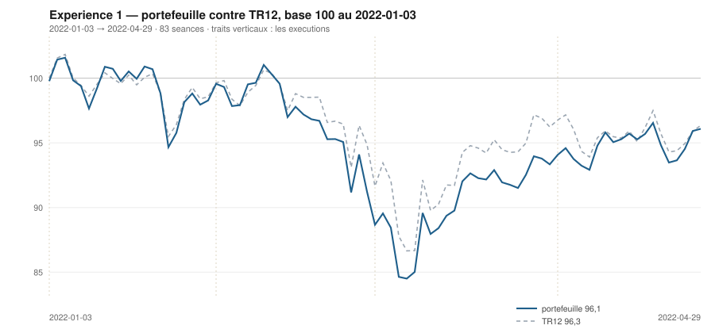

# Avril 2022

> Journal de l'[expérience 1](../README.md) · **décision au 2022-03-31** · **exécution au 2022-04-01**
> Portefeuille au 2022-04-29 : **9 608,15 €** (base 96,08) · TR12 96,35 · alpha du mois **+2,82 pt** · depuis janvier **-0,27 pt**

---

## 1. Les actualités du mois précédent

**Mars 2022.** Le baril de Brent dépasse brièvement 130 dollars, le gaz européen
atteint des sommets historiques. Le 16 mars, la Réserve fédérale relève son taux
directeur de 25 points de base — sa première hausse depuis 2018 — et annonce une
trajectoire nettement plus rapide.

Après trois semaines de baisse, les marchés européens rebondissent vigoureusement
dans la seconde quinzaine, sur des espoirs de négociation entre Kiev et Moscou.
Le CAC 40 efface une large part de son décrochage de février.

L'inflation de la zone euro atteint 7,5 % sur un an. Le débat se déplace : il ne
s'agit plus de savoir si la BCE resserrera, mais de combien et à quelle vitesse.

---

## 2. L'exposition héritée au 2022-03-31

| Valeur | Achetée le | Prix d'achat | +/− value | Alpha du mois | Alpha global |
|---|---|---|---|---|---|
| `CAP.PA` Capgemini | 2022-01-03 | 194,20 € | **-6,12 %** | +6,10 pt | -2,35 pt |
| `MC.PA` LVMH | 2022-01-03 | 669,09 € | **-11,53 %** | -3,04 pt | -7,76 pt |
| `ORA.PA` Orange | 2022-03-01 | 8,15 € | **-0,89 %** | -5,89 pt *(partiel)* | -5,89 pt |
| `SAN.PA` Sanofi | 2022-02-01 | 74,59 € | **+0,10 %** | -2,47 pt | +3,52 pt |
| `SU.PA` Schneider Electric | 2022-03-01 | 128,07 € | **+8,45 %** | +3,45 pt *(partiel)* | +3,45 pt |

## 3. Le portefeuille depuis le 3 janvier 2022

| | |
|---|---|
| Dotation initiale | 10 000,00 € au 2022-01-03 |
| Titres au 2022-04-29 | 9 570,14 € |
| Espèces | 38,01 € |
| **Total** | **9 608,15 €** |
| Base 100 | **96,08** |
| TR12, même base | 96,35 |
| Écart depuis janvier | **-0,27 pt** |

## 4. L'étude chartiste au 2022-03-31

> Notes rédigées sans aucune séance postérieure au 2022-03-31, par l'agent `chartiste`. Cinq lignes au plus par société.

### 1. `TTE.PA` — TotalEnergies

- Les deux horizons haussiers et significatifs : 120 séances +0,047 €/séance (+0,133 %/séance), p < 10⁻⁴, R² = 0,42 ; 20 séances +0,101 €/séance (+0,281 %/séance), p < 10⁻⁴, R² = 0,65.
- Encadrement 120 séances le plus resserré du panier : support 34,55 (+0,046, portée 69, 4 épisodes : 26/11, 01/03, 04/03, 15/03), résistance 37,69 (−0,086, portée 31, 2 épisodes) ; largeur 3,14 € soit 8,7 %.
- Position exactement au milieu (50,0 %), mais le canal court est très étroit (1,66 € soit 4,6 %) et le cours en occupe le bas (1,3 %).
- Le canal long converge en 24 séances : support montant contre résistance descendante, l'encadrement cessera géométriquement d'exister d'ici un mois.
- Observable ensuite : la sortie du biseau se datera à la première clôture hors de [34,6 ; 37,7], indépendamment du sens.

### 2. `ORA.PA` — Orange

- La tendance longue la plus régulière du panier : +0,0129 €/séance (+0,173 %/séance), p < 10⁻⁴, R² = 0,77, IC₉₅ [0,0116 ; 0,0142], jackknife pratiquement invariant.
- Tendance courte de même sens : +0,0179 €/séance (+0,22 %/séance), p < 10⁻⁴, R² = 0,77, mais le cours est en bas de son canal court (11,7 % de la hauteur, z = −1,71).
- Encadrement 120 séances : support 7,70 (+0,0132, portée 61, 2 épisodes), résistance 8,87 (+0,0154, portée 85, 3 épisodes : 15/10, 10/11, 08/02) ; canal montant légèrement divergent, largeur 1,16 € soit 14,4 %.
- Position 32,2 % : le titre est revenu dans le tiers bas de son canal alors que la pente reste positive — l'écart entre les deux horizons vient du repli des 20 dernières séances (−0,2 %).
- Observable ensuite : une clôture sous 7,70 romprait le support ascendant ; le maintien au-dessus laisserait le cours dans un canal dont la géométrie n'a pas changé depuis octobre.

### 3. `SAN.PA` — Sanofi

- Hausse longue régulière et la mieux ajustée du panier avec ORA : +0,0596 €/séance (+0,082 %/séance), p < 10⁻⁴, R² = 0,63, IC₉₅ [0,051 ; 0,068], σ_e = 1,57 € (2,2 %).
- Tendance courte non significative : +0,103 €/séance, p = 0,061 — TEND_20 = 0, la borne basse de l'IC₉₅ passe sous zéro.
- Encadrement 120 séances : support 69,1 (+0,033, portée 99), résistance 78,1 (+0,030, portée 30, 3 épisodes : 27/01, 09/02, 10/03) ; largeur 9,00 € soit 12,1 %, position 61,4 %.
- Canal quasi parallèle (pentes à 0,003 €/séance l'une de l'autre) : aucune convergence à horizon utile.
- Observable ensuite : le plus haut des 120 séances est 77,71 (11/03) ; au-dessus, la résistance à 3 contacts serait franchie. Sous 69, la pente longue serait démentie.

### 4. `AIR.PA` — Airbus

- Tendance longue nulle : pente 120 séances de −0,011 €/séance (−0,01 %/séance), p = 0,43, R² = 0,005 — aucune direction distinguable du bruit (TEND_120 = 0).
- Tendance courte franchement haussière : +0,73 €/séance (+0,76 %/séance), p < 10⁻⁴, R² = 0,80, IC₉₅ [0,55 ; 0,91], depuis le creux du 7 mars (82,79).
- Encadrement convexe sur 120 séances : support 81,5 (pente −0,071, portée 71 séances, ancres 26/11/2021 et 07/03/2022), résistance 109,8 (−0,022, portée 31) ; largeur 28,2 € soit 27,9 %, cours à 69,9 % de la hauteur.
- Contacts : 3 épisodes en résistance (04/01, 12/01, 16/02) — crédible ; 2 seulement au support — non confirmé. Le canal court (support +1,06 €/séance sur 17 séances) passe à 101,1, le cours est 0,2 % dessus.
- Observable ensuite : une clôture sous 101 invaliderait la droite de rebond ; au-dessus de 109,8, la résistance de 120 séances cesserait d'encadrer.

### 5. `DG.PA` — Vinci

- Hausse longue faible mais significative : +0,0375 €/séance (+0,049 %/séance), p = 0,0002, R² = 0,11, IC₉₅ [0,018 ; 0,057].
- Hausse courte : +0,369 €/séance (+0,49 %/séance), p = 0,0001, R² = 0,60.
- Encadrement 120 séances : support 66,8 (−0,027, portée 69, 2 épisodes), résistance 89,9 (+0,100, portée 69, 3 épisodes : 05/11, 09/02, 16/02) ; canal divergent, largeur 23,1 € soit 29,9 % — le plus large du panier.
- Position 46,2 % : le cours est au milieu, à 12,4 € sous la résistance et 10,7 € au-dessus du support. Aucun bord n'est en contact.
- Observable ensuite : un encadrement aussi large n'impose rien à court terme ; seule une clôture hors de [66,8 ; 89,9] serait qualifiable, et rien n'en approche.

### 6. `AI.PA` — Air Liquide

- Tendance longue non significative : +0,0163 €/séance, p = 0,057, R² = 0,03, IC₉₅ [−0,0005 ; 0,033] — la borne basse contient zéro, aucune affirmation directionnelle possible.
- Tendance courte la mieux ajustée du panier : +0,746 €/séance (+0,72 %/séance), p < 10⁻⁴, R² = 0,91.
- Encadrement 120 séances : support 93,1 (−0,036, portée 100, 3 épisodes), résistance 110,5 (+0,015, portée 59, 3 épisodes : 05/01, 13/01, 25/03) ; largeur 17,4 € soit 16,0 %, les deux côtés crédibles.
- Position 90,4 %, résidu de +1,53 σ_e sur la droite longue ; le plus haut des 120 séances (110,48) date du 29/03, deux séances plus tôt.
- Observable ensuite : une clôture au-dessus de 110,5 sortirait de l'encadrement par le haut ; le retour sous 108 ramènerait le cours dans le corps du canal.

### 7. `CAP.PA` — Capgemini

- Baisse longue significative : −0,152 €/séance (−0,085 %/séance), p < 10⁻⁴, R² = 0,26, IC₉₅ [−0,199 ; −0,105].
- Le rebond court le plus vif du panier : +1,570 €/séance (+0,94 %/séance), p < 10⁻⁴, R² = 0,88, soit +10,1 % en 20 séances.
- Encadrement 120 séances : support 144,8 (−0,171, portée 97, 2 épisodes), résistance 184,3 (−0,225, portée 62, 3 épisodes : 28/12, 04/01, 29/03) ; largeur 39,5 € soit 21,7 %.
- Position 95,0 % — au contact de la résistance, touchée le 29/03 ; résidu +1,41 σ_e sur la droite longue.
- Observable ensuite : une clôture au-dessus de 184,3 (droite qui recule de 0,23 €/séance) romprait le plafond de janvier ; un repli sous 176 ramènerait le cours au corps du canal.

### 8. `RI.PA` — Pernod Ricard

- Baisse longue significative : −0,148 €/séance (−0,089 %/séance), p < 10⁻⁴, R² = 0,41 ; σ_e = 6,16 € (3,7 %).
- Rebond court : +0,837 €/séance (+0,54 %/séance), p < 10⁻⁴, R² = 0,73 ; le cours occupe 81 % de son canal court.
- Encadrement 120 séances : support 141,1 (−0,158, portée 101), résistance 168,8 (−0,205, portée 61) ; largeur 27,7 € soit 16,7 %, position 91,3 %.
- Les deux droites n'ont que 2 épisodes de contact : encadrement géométriquement valide mais non confirmé ; la séance du 31/03 est elle-même une ancre de la résistance.
- Observable ensuite : le cours est au contact du plafond qu'il vient de définir ; une clôture au-dessus de 168,8 le romprait, faute de quoi la droite reste une contrainte à deux points.

### 9. `MC.PA` — LVMH

- Baisse longue significative mais peu explicative : −0,507 €/séance (−0,081 %/séance), p < 10⁻⁴, R² = 0,22, IC₉₅ [−0,68 ; −0,33].
- Rebond court net : +4,35 €/séance (+0,77 %/séance), p < 10⁻⁴, R² = 0,79 ; les deux horizons sont de signes opposés.
- Encadrement 120 séances : support 480,8 (−0,83 €/séance, portée 100), résistance 612,5 (−1,48, portée 39) ; largeur 131,7 € soit 22,3 %, position 84,4 % — haut de canal.
- Contacts : 3 épisodes en résistance (28/01, 08/02, 29/03), 2 au support ; canal faiblement convergent (croisement théorique à 204 séances).
- Observable ensuite : le plafond recule de 1,5 €/séance ; le cours doit progresser d'autant pour se maintenir en haut de canal, et une clôture au-dessus de 612 romprait un plafond en place depuis fin janvier.

### 10. `SU.PA` — Schneider Electric

- Baisse longue significative mais très peu explicative : −0,084 €/séance (−0,060 %/séance), p = 0,0012, R² = 0,085 ; σ_e = 9,54 € (6,8 %).
- Rebond court vif : +0,937 €/séance (+0,70 %/séance), p < 10⁻⁴, R² = 0,63, soit +11,8 % en 20 séances.
- Encadrement 120 séances : support 107,9 (−0,173, portée 97, 2 épisodes), résistance 141,5 (−0,355, portée 59, 3 épisodes : 03/01, 17/03, 29/03) ; largeur 33,6 € soit 24,2 %.
- Position 92,2 % — le cours est à 1,9 % sous une résistance à 3 contacts, au sommet de son encadrement ; le support n'est pas confirmé.
- Observable ensuite : la résistance recule de 0,36 €/séance ; une clôture au-dessus romprait un plafond installé depuis le 3 janvier.

### 11. `OR.PA` — L'Oréal

- Baisse longue nette : −0,528 €/séance (−0,148 %/séance), p < 10⁻⁴, R² = 0,49, IC₉₅ [−0,63 ; −0,43], jackknife stable [−0,551 ; −0,522].
- Rebond court : +1,33 €/séance (+0,41 %/séance), p = 0,0002, R² = 0,55.
- Encadrement 120 séances : support 291,1 (−0,354, portée 99, 3 épisodes : 15/10, 24/02, 07/03), résistance 345,1 (−0,859, portée 60, 2 épisodes : 03/01, 29/03) ; largeur 54,1 € soit 16,1 %, position 82,3 %.
- Le canal se referme (croisement à 107 séances) ; le support est confirmé, la résistance non.
- Observable ensuite : le plafond descend de 0,86 €/séance depuis le 3 janvier ; une clôture au-dessus le romprait, une clôture sous 291 casserait un support à 3 épisodes.

### 12. `BNP.PA` — BNP Paribas

- Baisse longue significative mais faible : −0,0275 €/séance (−0,065 %/séance), p = 0,0025, R² = 0,075 seulement ; σ_e = 3,35 € (7,9 %), canal de régression large de 35,4 % — le plus lâche du panier.
- Rebond court : +0,202 €/séance (+0,55 %/séance), p = 0,0017, R² = 0,43.
- Encadrement 120 séances : support 29,2 (−0,101, portée 101, 4 épisodes : 15/10, 28/10, 30/11, 07/03 — structure installée), résistance 38,98 (−0,287, portée 33, 2 épisodes).
- Largeur 9,78 € soit 26,1 %, position 83,8 %, convergence à 53 séances.
- Observable ensuite : le cours est 1,6 € sous une résistance qui recule de 0,29 €/séance ; le support, seul côté confirmé, est 8,2 € plus bas — une clôture sous 29,2 romprait quatre épisodes de contact.

## 5. Le classement au 2022-03-31

> De la valeur la plus intéressante à détenir à celle qu'il faut fuir. Le détail des cinq composantes est dans le [protocole](../README.md#le-score-en-cinq-composantes).

| Rang | Valeur | `s1` | `s2` | `s3` | `s4` | `s5` | Score | Position | Momentum 12-1 |
|---|---|---|---|---|---|---|---|---|---|
| 1 | `TTE.PA` TotalEnergies | +2 | +1 | +1 | +2 | +0 | **+6** | 50,0 % | +33,0 % |
| 2 | `ORA.PA` Orange | +2 | +1 | +0 | +2 | +0 | **+5** | 32,2 % | +14,6 % |
| 3 | `SAN.PA` Sanofi | +2 | +0 | +1 | +2 | +0 | **+5** | 61,4 % | +12,9 % |
| 4 | `AIR.PA` Airbus | +0 | +1 | +1 | +2 | +0 | **+4** | 69,9 % | +11,5 % |
| 5 | `DG.PA` Vinci | +2 | +1 | +0 | +1 | +0 | **+4** | 46,2 % | +5,5 % |
| 6 | `AI.PA` Air Liquide | +0 | +1 | +1 | +1 | +0 | **+3** | 90,4 % | +7,2 % |
| 7 | `CAP.PA` Capgemini | -2 | +1 | +1 | +2 | +0 | **+2** | 95,0 % | +21,8 % |
| 8 | `RI.PA` Pernod Ricard | -2 | +1 | +1 | +2 | +0 | **+2** | 91,3 % | +14,8 % |
| 9 | `MC.PA` LVMH | -2 | +1 | +1 | +1 | +0 | **+1** | 84,4 % | +8,4 % |
| 10 | `SU.PA` Schneider Electric | -2 | +1 | +1 | +1 | +0 | **+1** | 92,2 % | +4,9 % |
| 11 | `OR.PA` L'Oréal | -2 | +1 | +1 | +1 | +0 | **+1** | 82,3 % | +3,7 % |
| 12 | `BNP.PA` BNP Paribas | -2 | +1 | +1 | +1 | +0 | **+1** | 83,8 % | +1,5 % |

## 6. Les ordres exécutés au 2022-04-01

> À l'**ouverture** de la séance, jamais à la clôture du 2022-03-31.

| Sens | Valeur | Quantité | Prix d'exécution | Brut | Frais | Motif |
|---|---|---|---|---|---|---|
| **Vente** | `MC.PA` LVMH | 2 | 592,70 € | 1 185,41 € | 1,36 € | rang 9 au-dela de 7 |
| **Vente** | `SU.PA` Schneider Electric | 14 | 139,72 € | 1 956,09 € | 2,25 € | rang 10 au-dela de 7 |
| **Achat** | `TTE.PA` TotalEnergies | 44 | 36,07 € | 1 586,90 € | 6,59 € | rang 1, score +6 |
| **Achat** | `AIR.PA` Airbus | 16 | 100,99 € | 1 615,86 € | 1,86 € | rang 4, score +4 |

## 7. La lecture du mois

Sur le mois, la meilleure contribution vient de `SAN.PA` (Sanofi) pour **+223,92 €**, la moins bonne de `CAP.PA` (Capgemini) pour **-57,62 €**. Les 4 ordres du mois ont coûté **12,06 €** de frais, soit 0,121 % de la dotation initiale. Le portefeuille termine le mois **devant TR12** de 2,82 point.

---

[← Mars](2022-03.md) · [Protocole](../README.md) · [Mai →](2022-05.md)
