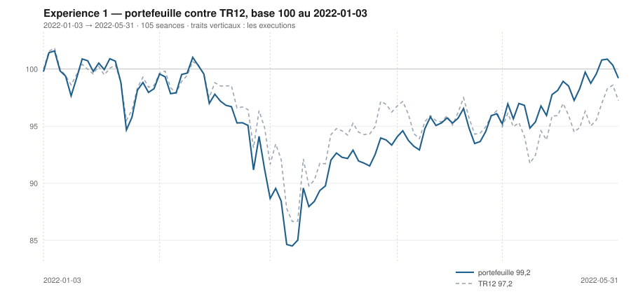

# Mai 2022

> Journal de l'[expérience 1](../README.md) · **décision au 2022-04-29** · **exécution au 2022-05-02**
> Portefeuille au 2022-05-31 : **9 919,66 €** (base 99,20) · TR12 97,24 · alpha du mois **+2,31 pt** · depuis janvier **+1,96 pt**

---

## 1. Les actualités du mois précédent

**Avril 2022.** Nouveau repli, mené cette fois par la crainte d'un resserrement
monétaire plus agressif que prévu — le marché anticipe désormais une hausse de
50 points de base de la Fed en mai.

En Chine, la politique zéro-Covid impose un confinement de Shanghai qui s'étend
sur tout le mois. Les chaînes logistiques se grippent et la demande domestique
s'effondre — deux effets qui frappent particulièrement le luxe européen, dont le
marché chinois représente une part déterminante.

Le 24 avril, Emmanuel Macron est réélu à la présidence de la République, ce qui
lève une incertitude politique sur les actifs français. L'euro poursuit sa
dépréciation contre le dollar, sous 1,06.

---

## 2. L'exposition héritée au 2022-04-29

| Valeur | Achetée le | Prix d'achat | +/− value | Alpha du mois | Alpha global |
|---|---|---|---|---|---|
| `AIR.PA` Airbus | 2022-04-01 | 100,99 € | **-2,75 %** | -2,32 pt *(partiel)* | -2,32 pt |
| `CAP.PA` Capgemini | 2022-01-03 | 194,20 € | **-9,09 %** | -3,28 pt | -5,43 pt |
| `ORA.PA` Orange | 2022-03-01 | 8,15 € | **+4,80 %** | +5,62 pt | -0,34 pt |
| `SAN.PA` Sanofi | 2022-02-01 | 74,59 € | **+9,48 %** | +9,25 pt | +12,79 pt |
| `TTE.PA` TotalEnergies | 2022-04-01 | 36,07 € | **+2,74 %** | +3,17 pt *(partiel)* | +3,17 pt |

## 3. Le portefeuille depuis le 3 janvier 2022

| | |
|---|---|
| Dotation initiale | 10 000,00 € au 2022-01-03 |
| Titres au 2022-05-31 | 9 881,65 € |
| Espèces | 38,01 € |
| **Total** | **9 919,66 €** |
| Base 100 | **99,20** |
| TR12, même base | 97,24 |
| Écart depuis janvier | **+1,96 pt** |

## 4. L'étude chartiste au 2022-04-29

> Notes rédigées sans aucune séance postérieure au 2022-04-29, par l'agent `chartiste`. Cinq lignes au plus par société.

### 1. `AI.PA` — Air Liquide

- Hausse longue significative mais peu explicative : +0,0381 €/séance (+0,036 %/séance), p = 0,0001, R² = 0,12.
- Hausse courte : +0,094 €/séance (+0,085 %/séance), p = 0,028, R² = 0,24 ; le cours est au résidu maximal de la fenêtre 120 (z = +1,71, position 100 %).
- Encadrement 120 séances : support 109,7 (+0,442, portée 32), résistance 113,76 (+0,052, portée 80, 4 épisodes : 08/12, 05/01, 11/04, 29/04) ; largeur 4,09 € soit 3,6 % — le canal le plus étroit du panier.
- Convergence en 10 séances ; le 29/04 établit le plus haut des 120 séances (113,76) et touche la résistance.
- Observable ensuite : un biseau de 3,6 % ne survit pas dix séances ; une clôture au-dessus de 113,8 sortirait par le haut d'un plafond à 4 contacts.

### 2. `ORA.PA` — Orange

- Les deux horizons alignés et très ajustés : 120 séances +0,0144 €/séance (+0,188 %/séance), p < 10⁻⁴, R² = 0,83 ; 20 séances +0,0245 €/séance (+0,294 %/séance), p < 10⁻⁴, R² = 0,83.
- Encadrement 120 séances : support 8,39 (+0,025, portée 33, 4 épisodes : 07/03, 30/03, 12/04, 21/04 — installé), résistance 8,60 (+0,004, portée 47, 3 épisodes).
- Largeur 0,20 € soit 2,4 % : inférieure à un seul σ_e de la droite longue (3,0 %) — l'encadrement est plus étroit que la dispersion normale du titre.
- Convergence en 10 séances, position 71,5 % ; plus haut des 120 séances à 8,59 le 28/04.
- Observable ensuite : un canal de 2,4 % ne contient pas la volatilité mesurée ; la sortie se lira au premier écart de 0,20 € et devra être qualifiée par sa persistance, pas par la seule séance de franchissement.

### 3. `TTE.PA` — TotalEnergies

- Hausse longue significative : +0,0338 €/séance (+0,094 %/séance), p < 10⁻⁴, R² = 0,24, mais en retrait sur le mois (+0,047 fin mars).
- Tendance courte plate : −0,008 €/séance, p = 0,78 ; le cours occupe pourtant 98,9 % de la hauteur de son canal court.
- Encadrement 120 séances : support 34,64 (+0,039, portée 103, 3 épisodes : 26/11, 07/03, 25/04), résistance 37,50 (−0,059, portée 45, 3 épisodes : 08/02, 19/04, 29/04) — les deux côtés crédibles ; largeur 2,85 € soit 7,7 %.
- Convergence en 29 séances, position 84,5 %, et le 29/04 touche la résistance.
- Observable ensuite : une clôture au-dessus de 37,5 romprait un plafond à 3 contacts ; le plus haut des 120 séances reste 40,60 (11/02).

### 4. `SAN.PA` — Sanofi

- Hausse longue qui s'accélère : +0,0986 €/séance (+0,133 %/séance), p < 10⁻⁴, R² = 0,71, IC₉₅ [0,087 ; 0,110], contre +0,060 un mois plus tôt.
- Hausse courte : +0,298 €/séance (+0,37 %/séance), p = 0,0046, R² = 0,37, mais le cours est en bas du canal court (14,8 %).
- Encadrement 120 séances : support 69,4 (+0,022, portée 66), résistance 87,6 (+0,123, portée 104) — canal montant divergent, largeur 18,2 € soit 22,3 %, position 67,6 %. Deux épisodes de chaque côté : géométriquement valide, non confirmé.
- Épisode de sortie haute du 08 au 13/04, maximum +3,11 σ_e le 11/04 (plus haut 120 séances à 86,08), résorbé depuis : trois séances, non persistant.
- Observable ensuite : un retour sous 80 replacerait le cours au milieu du canal ; sous 69,4, la pente longue et son support seraient contredits ensemble.

### 5. `DG.PA` — Vinci

- Hausse longue faible et fragile : +0,0242 €/séance (+0,031 %/séance), p = 0,021, R² = 0,044, IC₉₅ [0,004 ; 0,045] — la borne basse est très proche de zéro.
- Hausse courte : +0,234 €/séance (+0,31 %/séance), p = 0,0064, R² = 0,35.
- Encadrement 120 séances : support 66,30 (−0,027, portée 69, 2 épisodes), résistance 80,49 (−0,123, portée 47, 3 épisodes : 10/02, 16/02, 26/04) ; largeur 14,2 € soit 17,9 %, position 91,4 %.
- Le cours est 1,2 € sous une résistance qui descend de 0,12 €/séance ; le support est 13 € plus bas, hors de portée utile.
- Observable ensuite : franchir 80,5 romprait le plafond de février ; à défaut, le repli vers le corps du canal reste sans contrainte basse identifiable.

### 6. `AIR.PA` — Airbus

- Tendance longue à la limite de la significativité : −0,0288 €/séance (−0,03 %/séance), p = 0,047, R² = 0,033, IC₉₅ [−0,057 ; −0,0004] — la borne haute frôle zéro ; TEND_120 bascule à −1 sur un test dont l'autocorrélation gonfle le taux de rejet.
- Tendance courte nulle : −0,122 €/séance, p = 0,199, R² = 0,09.
- Encadrement 120 séances resserré en un mois : support 94,2 (+0,311 €/séance, portée 34, ancres 07/03 et 27/04), résistance 100,9 (−0,193, portée 43, 3 épisodes) ; largeur 6,74 € soit 6,9 %, contre 27,9 % au 31 mars.
- Le biseau converge en 13 séances ; position 59,5 %, mais le support n'a que 2 épisodes de contact.
- Observable ensuite : les deux droites se croisent avant la mi-mai ; la première clôture hors de [94,2 ; 100,9] datera la sortie.

### 7. `CAP.PA` — Capgemini

- Baisse longue confirmée : −0,199 €/séance (−0,112 %/séance), p < 10⁻⁴, R² = 0,47, IC₉₅ [−0,238 ; −0,160].
- Baisse courte : −0,449 €/séance (−0,258 %/séance), p = 0,016, R² = 0,28 ; le cours est néanmoins à 94 % du canal court (z = +1,70).
- Encadrement 120 séances : support 164,8 (+0,459, portée 35, 2 épisodes), résistance 182,6 (−0,193, portée 64, 4 épisodes : 28/12, 04/01, 31/03, 29/04) — plafond installé ; largeur 17,8 € soit 10,1 %, contre 21,7 % fin mars.
- Convergence en 27 séances, position 65,8 % ; la séance du 29/04 est le 4ᵉ épisode de contact haut.
- Observable ensuite : sortie par le haut au-dessus de 182,6 (droite en recul de 0,19 €/séance), par le bas sous 164,8 (droite en hausse de 0,46 €/séance) — les deux se rejoignent d'ici début juin.

### 8. `RI.PA` — Pernod Ricard

- Baisse longue nette : −0,162 €/séance (−0,098 %/séance), p < 10⁻⁴, R² = 0,49.
- Baisse courte : −0,299 €/séance (−0,182 %/séance), p = 0,0014, R² = 0,44 ; le cours est pourtant au sommet de son canal court (100 %).
- Encadrement 120 séances : support 159,8 (+0,446, portée 32, 3 épisodes), résistance 167,2 (−0,176, portée 65, 3 épisodes : 04/01, 31/03, 28/04) ; largeur 7,43 € soit 4,5 %, convergence en 12 séances, position 69,8 %.
- Rupture antérieure documentée : 6 séances consécutives sous −2 σ_e du 07 au 15/03, jusqu'à −3,05 σ_e — persistante à l'époque, entièrement résorbée depuis.
- Observable ensuite : le biseau se referme sous quinze séances ; une clôture hors de [159,8 ; 167,2] départagera support et résistance, tous deux à 3 contacts.

### 9. `BNP.PA` — BNP Paribas

- Baisse longue confirmée et renforcée : −0,070 €/séance (−0,170 %/séance), p < 10⁻⁴, R² = 0,33, contre −0,0275 fin mars.
- Tendance courte nulle : +0,026 €/séance, p = 0,574, R² = 0,018 — le rebond de mars s'est éteint.
- Encadrement 120 séances : support 26,98 (−0,109, portée 69, 2 épisodes), résistance 36,78 (−0,227, portée 48, 2 épisodes) ; largeur 9,79 € soit 27,4 %, position 90,0 %.
- Le support qui comptait 4 épisodes fin mars n'en a plus que 2 : la fenêtre a glissé et l'encadrement s'est dé-confirmé des deux côtés.
- Observable ensuite : le cours est 1 € sous une résistance qui recule de 0,23 €/séance et n'a pas été franchie depuis le 10/02 ; une clôture au-dessus la romprait.

### 10. `SU.PA` — Schneider Electric

- Baisse longue nette : −0,209 €/séance (−0,149 %/séance), p < 10⁻⁴, R² = 0,48.
- Baisse courte franche : −0,772 €/séance (−0,588 %/séance), p < 10⁻⁴, R² = 0,72, soit −9,8 % en 20 séances — le rebond de mars est effacé.
- Encadrement 120 séances : support 120,5 (+0,256, portée 35, 2 épisodes), résistance 137,8 (−0,317, portée 64, 3 épisodes : 03/01, 29/03, 01/04) ; largeur 17,4 € soit 13,8 %, convergence en 30 séances.
- Position 30,2 % : le cours est descendu dans le tiers bas de son encadrement, à 0,8 % au-dessus du support ascendant.
- Observable ensuite : une clôture sous 120,5 romprait ce support (2 épisodes seulement, donc non confirmé) ; le plus bas de référence en dessous est 111,00 (07/03).

### 11. `OR.PA` — L'Oréal

- Baisse longue franche : −0,666 €/séance (−0,190 %/séance), p < 10⁻⁴, R² = 0,73, IC₉₅ [−0,74 ; −0,59].
- Baisse courte confirmée : −1,262 €/séance (−0,381 %/séance), p < 10⁻⁴, R² = 0,69 ; le cours est pourtant au sommet de son canal court (100 %).
- Encadrement 120 séances : support 312,0 (+0,393, portée 34, 3 épisodes), résistance 334,5 (−0,789, portée 65, 4 épisodes : 03/01, 29/03, 21/04, 28/04) — plafond installé ; largeur 22,5 € soit 6,9 %.
- Convergence en 19 séances, position 64,2 % ; le canal s'est refermé de 16,1 % à 6,9 % de largeur en un mois.
- Observable ensuite : la résistance recule de 0,79 €/séance ; une clôture au-dessus romprait quatre mois de plafond, une clôture sous 312 romprait un support à 3 contacts.

### 12. `MC.PA` — LVMH

- Les deux horizons baissiers et significatifs : 120 séances −0,895 €/séance (−0,145 %/séance), p < 10⁻⁴, R² = 0,60 ; 20 séances −1,288 €/séance (−0,222 %/séance), p = 0,0065, R² = 0,35.
- La pente longue s'est aggravée depuis fin mars (−0,507 → −0,895 €/séance).
- Encadrement 120 séances : support 559,5 (+1,72, portée 35), résistance 592,3 (−1,35, portée 54, 6 épisodes : 05/01, 28/01, 08/02, 29/03, 21/04, 29/04) — plafond très installé ; largeur 32,7 € soit 5,7 % seulement.
- Convergence en 11 séances ; position 35,7 % ; le 29/04 est lui-même une touche de la résistance en séance.
- Observable ensuite : biseau presque fermé — une clôture sous 559 ou au-dessus de 592 tranchera dans les deux semaines.

## 5. Le classement au 2022-04-29

> De la valeur la plus intéressante à détenir à celle qu'il faut fuir. Le détail des cinq composantes est dans le [protocole](../README.md#le-score-en-cinq-composantes).

| Rang | Valeur | `s1` | `s2` | `s3` | `s4` | `s5` | Score | Position | Momentum 12-1 |
|---|---|---|---|---|---|---|---|---|---|
| 1 | `AI.PA` Air Liquide | +2 | +1 | +1 | +2 | +0 | **+6** | 87,0 % | +13,1 % |
| 2 | `ORA.PA` Orange | +2 | +1 | +1 | +2 | +0 | **+6** | 71,5 % | +10,3 % |
| 3 | `TTE.PA` TotalEnergies | +2 | +0 | +1 | +2 | +0 | **+5** | 84,5 % | +24,1 % |
| 4 | `SAN.PA` Sanofi | +2 | +1 | +1 | +1 | +0 | **+5** | 67,6 % | +6,5 % |
| 5 | `DG.PA` Vinci | +2 | +1 | +1 | +1 | +0 | **+5** | 91,4 % | +1,3 % |
| 6 | `AIR.PA` Airbus | -2 | +0 | +1 | +2 | +0 | **+1** | 59,5 % | +15,4 % |
| 7 | `CAP.PA` Capgemini | -2 | -1 | +1 | +2 | +0 | **+0** | 65,8 % | +31,9 % |
| 8 | `RI.PA` Pernod Ricard | -2 | -1 | +1 | +2 | +0 | **+0** | 69,8 % | +12,6 % |
| 9 | `BNP.PA` BNP Paribas | -2 | +0 | +1 | +1 | +0 | **+0** | 90,0 % | +2,1 % |
| 10 | `SU.PA` Schneider Electric | -2 | -1 | +0 | +2 | +0 | **-1** | 30,2 % | +18,2 % |
| 11 | `OR.PA` L'Oréal | -2 | -1 | +1 | +1 | +0 | **-1** | 64,2 % | +4,8 % |
| 12 | `MC.PA` LVMH | -2 | -1 | +0 | +1 | +0 | **-2** | 35,7 % | +8,0 % |

## 6. Les ordres exécutés au 2022-05-02

> À l'**ouverture** de la séance, jamais à la clôture du 2022-04-29.

*Aucun ordre : le classement ne déclenche ni entrée ni sortie.*

## 7. La lecture du mois

Sur le mois, la meilleure contribution vient de `TTE.PA` (TotalEnergies) pour **+288,79 €**, la moins bonne de `CAP.PA` (Capgemini) pour **-140,45 €**. Aucun ordre, donc aucun frais : l'hystérésis a retenu le portefeuille en l'état. Le portefeuille termine le mois **devant TR12** de 2,31 point.

---

[← Avril](2022-04.md) · [Protocole](../README.md) · [Juin →](2022-06.md)
