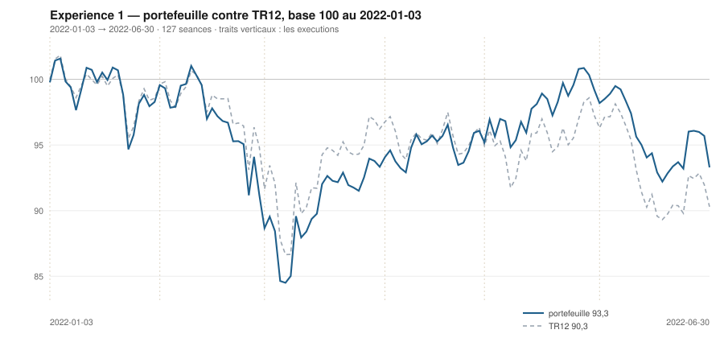

# Juin 2022

> Journal de l'[expérience 1](../README.md) · **décision au 2022-05-31** · **exécution au 2022-06-01**
> Portefeuille au 2022-06-30 : **9 329,31 €** (base 93,29) · TR12 90,30 · alpha du mois **+1,19 pt** · depuis janvier **+3,00 pt**

---

## 1. Les actualités du mois précédent

**Mai 2022.** L'inflation de la zone euro atteint 8,1 % sur un an. La BCE prépare
explicitement le terrain à une sortie des taux négatifs en juillet ; Christine
Lagarde évoque une sortie du territoire négatif « d'ici la fin du troisième
trimestre ».

Shanghai amorce sa réouverture en fin de mois, ce qui soulage les valeurs
exposées à la Chine après deux mois de contraction.

Les marchés européens terminent le mois quasiment inchangés, mais avec une
dispersion sectorielle marquée : l'énergie continue de surperformer largement,
la consommation discrétionnaire et la technologie restent sous pression.

---

## 2. L'exposition héritée au 2022-05-31

| Valeur | Achetée le | Prix d'achat | +/− value | Alpha du mois | Alpha global |
|---|---|---|---|---|---|
| `AIR.PA` Airbus | 2022-04-01 | 100,99 € | **+0,24 %** | +2,14 pt | -0,26 pt |
| `CAP.PA` Capgemini | 2022-01-03 | 194,20 € | **-16,32 %** | -8,88 pt | -13,56 pt |
| `ORA.PA` Orange | 2022-03-01 | 8,15 € | **+7,85 %** | +1,99 pt | +1,74 pt |
| `SAN.PA` Sanofi | 2022-02-01 | 74,59 € | **+11,86 %** | +1,25 pt | +14,27 pt |
| `TTE.PA` TotalEnergies | 2022-04-01 | 36,07 € | **+20,94 %** | +16,79 pt | +20,45 pt |

## 3. Le portefeuille depuis le 3 janvier 2022

| | |
|---|---|
| Dotation initiale | 10 000,00 € au 2022-01-03 |
| Titres au 2022-06-30 | 9 261,26 € |
| Espèces | 68,05 € |
| **Total** | **9 329,31 €** |
| Base 100 | **93,29** |
| TR12, même base | 90,30 |
| Écart depuis janvier | **+3,00 pt** |

## 4. L'étude chartiste au 2022-05-31

> Notes rédigées sans aucune séance postérieure au 2022-05-31, par l'agent `chartiste`. Cinq lignes au plus par société.

### 1. `TTE.PA` — TotalEnergies

- Hausse longue significative : +0,0341 €/séance (+0,091 %/séance), p < 10⁻⁴, R² = 0,23 ; hausse courte très marquée : +0,291 €/séance (+0,715 %/séance), p < 10⁻⁴, R² = 0,87, soit +13,9 % en 20 séances.
- Encadrement 120 séances confirmé des deux côtés : support 35,17 (+0,026, portée 89, 5 épisodes), résistance 43,92 (+0,039, portée 86, 4 épisodes dont le 26/05) ; canal montant légèrement divergent, largeur 8,75 € soit 20,1 %, position 96,5 %.
- Sortie en cours par le haut : clôture du 31/05 à +2,00 σ_e au-dessus de la droite ajustée 120, première séance dehors, volume 1,8 fois la moyenne 20 séances.
- Une séance à 2,0 σ_e n'est pas une rupture : ampleur juste au seuil, persistance de 1, volume ordinaire pour un 31 mai. Le plus haut des 120 séances (43,92) est posé le jour même.
- Observable ensuite : c'est le maintien au-dessus de 43,9 sur plusieurs séances consécutives, et non le franchissement du jour, qui distinguerait la sortie du bruit.

### 2. `AI.PA` — Air Liquide

- Hausse longue qui se raffermit : +0,0778 €/séance (+0,073 %/séance), p < 10⁻⁴, R² = 0,34 — progression mensuelle 0,016 → 0,038 → 0,078.
- Hausse courte : +0,264 €/séance (+0,24 %/séance), p = 0,0009, R² = 0,46.
- Encadrement 120 séances : support 110,2 (+0,283, portée 45, 2 épisodes), résistance 115,99 (+0,063, portée 101, 6 épisodes : 05/01, 13/01, 11/04, 29/04, 05/05, 27/05) — plafond parmi les mieux établis du panier ; largeur 5,80 € soit 5,1 %, convergence en 26 séances.
- Position 57,8 % ; plus haut des 120 séances 115,93 le 30/05, volume du jour 2,9 fois la moyenne.
- Observable ensuite : le titre bute depuis janvier dans une bande de 5 % ; une clôture au-dessus de 116 romprait six épisodes de contact, une clôture sous 110,2 un support qui n'en a que deux.

### 3. `ORA.PA` — Orange

- La tendance longue la plus régulière du panier : +0,0156 €/séance (+0,195 %/séance), p < 10⁻⁴, R² = 0,89, IC₉₅ [0,0146 ; 0,0166], soit +30,5 % sur 120 séances.
- La hausse courte s'est arrêtée : +0,0041 €/séance, p = 0,082, R² = 0,16, +1,7 % seulement en 20 séances.
- Encadrement 120 séances : support 8,04 (+0,011, portée 98, 5 épisodes : 13/12, 20/12, 07/01, 07/03, 02/05), résistance 9,04 (+0,0089, portée 66, 3 épisodes : 09/02, 04/05, 24/05) ; canal montant quasi parallèle, largeur 1,00 € soit 11,4 %, position 74,5 %.
- Les deux côtés sont installés, sur des portées de 98 et 66 séances : c'est l'encadrement le mieux confirmé des douze valeurs. Plus haut des 120 séances 9,01 le 25/05, volume du jour 2,4 fois la moyenne.
- Observable ensuite : le support monte de 0,011 €/séance ; une clôture sous 8,04 romprait cinq épisodes de contact étalés sur six mois, et c'est le seul événement qui invaliderait la figure.

### 4. `SAN.PA` — Sanofi

- Hausse longue qui s'accélère encore : +0,128 €/séance (+0,167 %/séance), p < 10⁻⁴, R² = 0,83, IC₉₅ [0,118 ; 0,139] — progression mensuelle 0,060 → 0,099 → 0,128.
- Hausse courte significative : +0,307 €/séance (+0,37 %/séance), p < 10⁻⁴, R² = 0,66, mais le cours est au résidu minimal de la fenêtre (z = −2,65, position 0 %).
- Encadrement 120 séances : support 82,47 (+0,236, portée 59, 4 épisodes : 07/03, 14/03, 12/05, 30/05 — installé), résistance 87,85 (+0,052, portée 30, 2 épisodes) ; largeur 5,38 € soit 6,4 %, position 18,1 %.
- La séance du 31/05 est elle-même l'ancre droite du support : le cours est posé dessus, volume 2,7 fois la moyenne.
- Observable ensuite : une clôture sous 82,5 romprait un support ascendant à 4 épisodes, seul élément confirmé de la figure.

### 5. `SU.PA` — Schneider Electric

- Baisse longue la plus forte du panier : −0,318 €/séance (−0,235 %/séance), p < 10⁻⁴, R² = 0,73, IC₉₅ [−0,353 ; −0,282].
- Hausse courte marginale : +0,206 €/séance (+0,18 %/séance), p = 0,036, R² = 0,22, IC₉₅ [0,015 ; 0,397] — borne basse quasi nulle, conclusion directionnelle non tenable.
- Encadrement 120 séances : support 111,2 strictement plat (+0,003 €/séance, portée 43, 3 épisodes : 07/03, 09/05, 25/05), résistance 123,3 (−0,516, portée 36, 3 épisodes dont le 30/05) ; largeur 12,15 € soit 10,1 %, position 77,0 %.
- Convergence en 23 séances : l'encadrement cessera d'exister à cet horizon, quelle que soit l'évolution du cours.
- Observable ensuite : une clôture au-dessus de 123,3 ou sous 111,0 romprait l'un des deux côtés, tous deux à 3 contacts.

### 6. `CAP.PA` — Capgemini

- Baisse longue confirmée : −0,188 €/séance (−0,108 %/séance), p < 10⁻⁴, R² = 0,44.
- Tendance courte nulle : −0,034 €/séance, p = 0,806, malgré −7,0 % en 20 séances — la droite courte ne capte pas un mouvement en dents de scie (σ_e court 3,32 €).
- Encadrement 120 séances : support 158,2 (+0,176, portée 51, 3 épisodes : 07/03, 12/05, 19/05), résistance 178,4 (−0,193, portée 64, 4 épisodes : 28/12, 04/01, 31/03, 29/04) ; largeur 20,2 € soit 12,4 %, convergence en 55 séances.
- Position 21,3 % — bas d'encadrement ; le cours est au contact de la droite basse de son canal court (162,51, position 0 %).
- Observable ensuite : une clôture sous 158,2 romprait un support à 3 contacts ; le plafond à 178,4 n'a plus été approché depuis le 29/04.

### 7. `RI.PA` — Pernod Ricard

- Baisse longue significative : −0,164 €/séance (−0,101 %/séance), p < 10⁻⁴, R² = 0,47, IC₉₅ [−0,195 ; −0,132].
- Tendance courte non significative : −0,324 €/séance, p = 0,066, R² = 0,18, malgré −8,0 % sur les 20 séances — l'IC₉₅ [−0,672 ; 0,024] change de signe.
- Encadrement 120 séances confirmé des deux côtés : support 145,97 quasi plat (+0,039, portée 54, 4 épisodes : 07/03, 11/03, 09/05, 19/05), résistance 164,99 (−0,160, portée 82, 4 épisodes : 04/01, 06/04, 28/04, 03/05) ; largeur 19,0 € soit 12,5 %.
- Convergence lente (96 séances), position 33,4 % : le cours redescend vers la base plate après avoir été rejeté du plafond début mai.
- Observable ensuite : une clôture sous 146 romprait la seule structure installée du titre ; le plus bas des 120 séances est 143,73 (08/03).

### 8. `DG.PA` — Vinci

- Aucun des deux horizons ne se distingue du bruit : 120 séances −0,0047 €/séance, p = 0,615, R² = 0,002 ; 20 séances +0,013 €/séance, p = 0,770, R² = 0,005 — TEND_120 et TEND_20 tous deux à 0.
- Encadrement 120 séances : support 74,66 (+0,125, portée 53, 2 épisodes), résistance 79,17 (−0,103, portée 68, 4 épisodes : 10/02, 16/02, 17/05, 26/05) ; largeur 4,51 € soit 5,9 %, convergence en 20 séances, position 42,3 %.
- Le canal de régression sur la même fenêtre est presque quatre fois plus large (17,4 € soit 22,3 %) : l'encadrement convexe ne décrit que les deux derniers mois, pas les six.
- Volume du jour 3,5 fois la moyenne 20 séances, sans mouvement de prix associé (−3,3 % sur 20 séances).
- Observable ensuite : le biseau se referme en 20 séances ; la sortie sera datable, mais aucune tendance mesurée ne l'oriente.

### 9. `AIR.PA` — Airbus

- Baisse longue significative mais faible : −0,052 €/séance (−0,05 %/séance), p = 0,0001, R² = 0,13.
- Hausse courte fragile : +0,207 €/séance (+0,21 %/séance), p = 0,029, R² = 0,24, IC₉₅ [0,024 ; 0,389] — la borne basse est presque nulle.
- Encadrement 120 séances : support 96,64 (+0,235, portée 54, 2 épisodes : 07/03, 24/05), résistance 105,23 (−0,073, portée 70, 2 épisodes : 16/02, 27/05) ; largeur 8,59 € soit 8,5 %, convergence en 28 séances.
- Position 53,4 % — milieu de canal ; aucun côté n'a plus de 2 épisodes de contact : encadrement non confirmé, à traiter comme une contrainte géométrique.
- Observable ensuite : seule une clôture hors de [96,6 ; 105,2] serait qualifiable ; un cours au milieu d'un canal à deux points ne dit rien.

### 10. `MC.PA` — LVMH

- Baisse longue qui se renforce de mois en mois : −1,204 €/séance (−0,202 %/séance), p < 10⁻⁴, R² = 0,73, IC₉₅ [−1,34 ; −1,07], contre −0,51 fin mars et −0,89 fin avril.
- Tendance courte nulle : +0,79 €/séance, p = 0,224, R² = 0,08.
- Encadrement 120 séances : support 495,6 quasi horizontal (−0,004 €/séance, portée 55, 3 épisodes : 07/03, 09/05, 23/05), résistance 567,3 (−1,29, portée 81, 6 épisodes dont le 30/05) ; largeur 71,7 € soit 13,0 %.
- Configuration en triangle descendant au sens strict : base plate mesurée à −0,001 %/séance, plafond en recul de 0,24 %/séance, convergence en 56 séances ; position 76,8 %. Plus bas des 120 séances : 495,60 le 25/05.
- Observable ensuite : une clôture sous 495,6 romprait un support à 3 contacts ; au-dessus de 567, un plafond à 6 contacts installé depuis janvier.

### 11. `OR.PA` — L'Oréal

- Baisse longue la plus marquée en pourcentage : −0,708 €/séance (−0,211 %/séance), p < 10⁻⁴, R² = 0,75, IC₉₅ [−0,78 ; −0,63].
- Tendance courte plate : −0,116 €/séance, p = 0,751 ; le canal court est large (27,3 € soit 9,1 %) et le cours en occupe 89,6 %.
- Encadrement 120 séances confirmé des deux côtés : support 279,2 (−0,309, portée 43, 4 épisodes : 24/02, 07/03, 09/05, 19/05), résistance 315,8 (−0,823, portée 37, 4 épisodes dont le 30/05) ; largeur 36,6 € soit 11,9 %, convergence en 71 séances, position 77,0 %.
- Volume du jour à 3,3 fois sa moyenne 20 séances — effet de fin de mois visible sur l'ensemble du panier, pas un signal propre au titre.
- Observable ensuite : plafond descendant touché le 30/05 ; une clôture au-dessus le romprait, une clôture sous 279,2 romprait un support à 4 contacts.

### 12. `BNP.PA` — BNP Paribas

- Baisse longue nette : −0,082 €/séance (−0,202 %/séance), p < 10⁻⁴, R² = 0,43.
- La droite courte la mieux ajustée du panier : +0,301 €/séance (+0,78 %/séance), p < 10⁻⁴, R² = 0,92, σ_e = 0,51 €, soit +11,1 % en 20 séances — horizons de signes opposés.
- Encadrement 120 séances : support 36,68 (+0,096, portée 38, 4 épisodes : 07/03, 06/04, 28/04, 09/05 — installé), résistance 42,23 (−0,089, portée 75, 2 épisodes : 09/02, 27/05) ; largeur 5,54 € soit 13,5 %, convergence en 30 séances, position 78,7 %.
- Le cours est 1,18 € (2,9 %) sous une résistance qui recule de 0,09 €/séance ; résidu long de +1,63 σ_e.
- Observable ensuite : franchir 42,2 romprait un plafond en place depuis février ; le canal court (largeur 4,5 %) est trop étroit pour encadrer 20 séances de plus.

## 5. Le classement au 2022-05-31

> De la valeur la plus intéressante à détenir à celle qu'il faut fuir. Le détail des cinq composantes est dans le [protocole](../README.md#le-score-en-cinq-composantes).

| Rang | Valeur | `s1` | `s2` | `s3` | `s4` | `s5` | Score | Position | Momentum 12-1 |
|---|---|---|---|---|---|---|---|---|---|
| 1 | `TTE.PA` TotalEnergies | +2 | +1 | +1 | +2 | +0 | **+6** | 96,5 % | +25,1 % |
| 2 | `AI.PA` Air Liquide | +2 | +1 | +1 | +2 | +0 | **+6** | 57,8 % | +14,8 % |
| 3 | `ORA.PA` Orange | +2 | +0 | +1 | +2 | +0 | **+5** | 74,5 % | +15,5 % |
| 4 | `SAN.PA` Sanofi | +2 | +1 | -1 | +2 | +0 | **+4** | 18,1 % | +16,8 % |
| 5 | `SU.PA` Schneider Electric | -2 | +1 | +1 | +1 | +0 | **+1** | 77,0 % | +0,9 % |
| 6 | `CAP.PA` Capgemini | -2 | +0 | +0 | +2 | +0 | **+0** | 21,3 % | +27,3 % |
| 7 | `RI.PA` Pernod Ricard | -2 | +0 | +0 | +2 | +0 | **+0** | 33,4 % | +10,6 % |
| 8 | `DG.PA` Vinci | +0 | +0 | +0 | -1 | +0 | **-1** | 42,3 % | -1,8 % |
| 9 | `AIR.PA` Airbus | -2 | +1 | +1 | -1 | +0 | **-1** | 53,4 % | -4,6 % |
| 10 | `MC.PA` LVMH | -2 | +0 | +1 | -1 | +0 | **-2** | 76,8 % | -7,0 % |
| 11 | `OR.PA` L'Oréal | -2 | +0 | +1 | -1 | +0 | **-2** | 77,0 % | -9,7 % |
| 12 | `BNP.PA` BNP Paribas | -2 | +1 | +1 | -2 | +0 | **-2** | 78,7 % | -10,8 % |

## 6. Les ordres exécutés au 2022-06-01

> À l'**ouverture** de la séance, jamais à la clôture du 2022-05-31.

| Sens | Valeur | Quantité | Prix d'exécution | Brut | Frais | Motif |
|---|---|---|---|---|---|---|
| **Vente** | `AIR.PA` Airbus | 16 | 101,99 € | 1 631,88 € | 1,88 € | rang 9 au-dela de 7 |
| **Achat** | `AI.PA` Air Liquide | 14 | 113,81 € | 1 593,35 € | 6,61 € | rang 2, score +6 |

## 7. La lecture du mois

Sur le mois, la meilleure contribution vient de `ORA.PA` (Orange) pour **-4,07 €**, la moins bonne de `AI.PA` (Air Liquide) pour **-217,58 €**. Les 2 ordres du mois ont coûté **8,49 €** de frais, soit 0,085 % de la dotation initiale. Le portefeuille termine le mois **devant TR12** de 1,19 point.

---

[← Mai](2022-05.md) · [Protocole](../README.md) · [Juillet →](2022-07.md)
