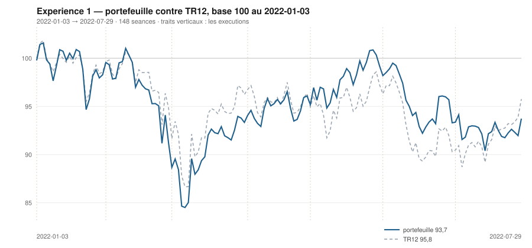

# Juillet 2022

> Journal de l'[expérience 1](../README.md) · **décision au 2022-06-30** · **exécution au 2022-07-01**
> Portefeuille au 2022-07-29 : **9 372,85 €** (base 93,73) · TR12 95,76 · alpha du mois **-5,58 pt** · depuis janvier **-2,03 pt**

---

## 1. Les actualités du mois précédent

**Juin 2022.** Mois de rupture. Le 10 juin, l'inflation américaine ressort bien
au-dessus des attentes ; le 15 juin, la Réserve fédérale relève ses taux de
75 points de base, sa plus forte hausse depuis 1994. Le même jour, la BCE tient
une réunion d'urgence sur la fragmentation des dettes souveraines de la zone
euro, l'écart entre les rendements italien et allemand s'étant fortement écarté.

La crainte bascule de l'inflation vers la récession. Les cycliques, les
matériaux et les valeurs industrielles décrochent nettement ; le CAC 40 perd plus
de 8 % sur le mois et inscrit son point bas annuel provisoire.

Gazprom réduit les livraisons par Nord Stream 1, officiellement pour des raisons
techniques. Le prix du gaz européen repart violemment à la hausse.

---

## 2. L'exposition héritée au 2022-06-30

| Valeur | Achetée le | Prix d'achat | +/− value | Alpha du mois | Alpha global |
|---|---|---|---|---|---|
| `AI.PA` Air Liquide | 2022-06-01 | 113,81 € | **-13,66 %** | -7,42 pt *(partiel)* | -7,42 pt |
| `CAP.PA` Capgemini | 2022-01-03 | 194,20 € | **-23,20 %** | -1,09 pt | -13,50 pt |
| `ORA.PA` Orange | 2022-03-01 | 8,15 € | **+7,64 %** | +6,94 pt | +9,11 pt |
| `SAN.PA` Sanofi | 2022-02-01 | 74,59 € | **+8,44 %** | +4,08 pt | +17,82 pt |
| `TTE.PA` TotalEnergies | 2022-04-01 | 36,07 € | **+11,04 %** | -1,04 pt | +17,72 pt |

## 3. Le portefeuille depuis le 3 janvier 2022

| | |
|---|---|
| Dotation initiale | 10 000,00 € au 2022-01-03 |
| Titres au 2022-07-29 | 9 304,80 € |
| Espèces | 68,05 € |
| **Total** | **9 372,85 €** |
| Base 100 | **93,73** |
| TR12, même base | 95,76 |
| Écart depuis janvier | **-2,03 pt** |

## 4. L'étude chartiste au 2022-06-30

> Notes rédigées sans aucune séance postérieure au 2022-06-30, par l'agent `chartiste`. Cinq lignes au plus par société.

### 1. `ORA.PA` — Orange

- La hausse longue la plus régulière de l'univers : 120 s = +0,0101 €/s (+0,113 %/s), p = 9,3·10⁻³⁹, R² = 0,76, IC₉₅ [+0,0090 ; +0,0111] ; 20 s = +0,0106 €/s (+0,122 %/s), p = 0,013.
- Canal de régression 120 s le plus étroit : 0,68 €, soit 8,2 % du niveau moyen ; cours à 32 % de hauteur, **aucune sortie au-delà de 2 σ_e sur les 120 séances**.
- Support convexe ascendant +0,0092 €/s (+0,112 %/s), niveau 8,21 €, mais 2 touches seulement (07/03 et 02/05) : droite non confirmée.
- Résistance +0,0089 €/s (+0,096 %/s), portée 66 séances (18/02 → 25/05), 14 touches, niveau 9,24 € : borne haute solide, cours 5,1 % dessous.
- Une clôture hors de la bande 8,21-9,24 €, dans un sens ou dans l'autre, trancherait un encadrement respecté depuis six mois.

### 2. `TTE.PA` — TotalEnergies

- Signes opposés : 120 s = +0,030 €/s (+0,075 %/s), p = 1,6·10⁻⁶ mais R² = 0,18 seulement ; 20 s = −0,258 €/s (−0,667 %/s), p = 1,5·10⁻⁵, R² = 0,66.
- Cours à 46 % du canal 120 s (largeur 8,83 €, 22,9 %) : milieu de canal ; à 95 % du canal 20 s, descendant.
- Support convexe ascendant +0,075 €/s (+0,198 %/s), portée 43 séances (26/04 → 24/06), 5 touches dont 23 et 24/06, niveau 38,07 € : cours 5,2 % dessus.
- Résistance +0,048 €/s, portée 93 séances (27/01 → 09/06), 10 touches, niveau 45,76 € : cours 12,5 % dessous ; le plus-haut 120 s (45,05 €) date du 09/06.
- Un retour sous 38,1 € casserait le support ascendant et alignerait l'horizon court sur le long ; σ_e(20) × 1,49.

### 3. `SAN.PA` — Sanofi

- Une des deux seules hausses longues nettes de l'univers : 120 s = +0,103 €/s (+0,121 %/s), p = 1,5·10⁻²⁹, R² = 0,66, IC₉₅ [+0,090 ; +0,117] ; à 20 s la pente est nulle (−0,026 €/s, p = 0,76).
- Cours à 13 % du canal 120 s (largeur 12,18 €, 15,5 %), z = −1,55 : bord bas d'un canal haussier.
- Support convexe ascendant +0,132 €/s (+0,166 %/s), portée 71 séances (07/03 → 16/06), 8 touches dont 15, 16, 17, 20 et 21/06, niveau 79,21 € : cours 2,1 % dessus, appui travaillé toute la seconde quinzaine de juin.
- Résistance convexe +0,052 €/s, 6 touches, niveau 88,98 € : cours 9,1 % dessous ; canal large et régulier, aucune sortie au-delà de 2 σ_e depuis le 16/06.
- Une clôture sous 79,2 € romprait un support ascendant à 8 touches et contredirait la pente longue.

### 4. `AI.PA` — Air Liquide

- Configuration contradictoire : 120 s = +0,054 €/s (+0,049 %/s), p = 3,8·10⁻⁵ mais R² = 0,14 — pente longue faible ; 20 s = −0,716 €/s (−0,734 %/s), p = 5,9·10⁻⁶, R² = 0,69.
- **Rupture par le bas du canal ±2 σ_e (120 s)** : z = −2,34 ce jour, après −2,0 le 17/06, −2,4 le 20/06 et −2,0 le 23/06 — quatre sorties en dix séances, volume du jour 1,67 fois la moyenne 20 s ; persistance encore d'une séance consécutive seulement.
- Cours à 1 % du canal de régression 120 s : plancher de l'encadrement.
- Support convexe ascendant +0,050 €/s, portée 72 séances (08/03 → 20/06), 6 touches dont 20, 22, 23 et 30/06, niveau 97,73 € : le cours clôture 0,6 % dessus, collé à la droite.
- Deux clôtures consécutives sous 97,7 € rompraient ce support ; le +1 de la tendance longue deviendrait alors intenable.

### 5. `RI.PA` — Pernod Ricard

- Baisse longue confirmée et qui s'intensifie : 120 s = −0,135 €/s (−0,091 %/s), p = 3,9·10⁻¹⁵, R² = 0,41 ; sur 60 s, −0,396 €/s (−0,279 %/s) avec R² = 0,76 ; à 20 s, p = 0,24, non significatif.
- Cours à 47 % du canal 120 s (largeur 27,28 €, 17,4 %) : milieu de canal, z = −0,43.
- Support convexe −0,063 €/s, portée 74 séances (08/03 → 22/06), 7 touches dont 16, 17, 20 et 21/06, niveau 138,67 € : cours 5,5 % dessus.
- Résistance −0,424 €/s (−0,282 %/s), portée 40 séances (03/05 → 28/06), 5 touches dont 24, 27, 28 et 29/06, niveau 150,39 € : le cours bute dessous depuis quatre séances.
- Un franchissement de 150,4 € casserait une résistance testée cette semaine même ; une clôture sous 139,05 € (plus-bas du 22/06) validerait la continuation.

### 6. `BNP.PA` — BNP Paribas

- Baisse aux deux horizons : 120 s = −0,074 €/s (−0,210 %/s), p = 1,6·10⁻¹³, R² = 0,37 ; 20 s = −0,227 €/s (−0,639 %/s), p = 6,0·10⁻⁵, R² = 0,60.
- Canal de régression 120 s le plus large de l'univers : 14,09 €, soit 35,6 % du niveau moyen — un encadrement de cette amplitude ne contraint presque rien ; cours à 60 % de hauteur, z = −0,03, plein milieu.
- Le support convexe ne repose que sur 2 points (07/03 et 30/06), niveau 34,25 € : droite géométriquement valide mais **non confirmée**.
- Résistance −0,089 €/s (−0,222 %/s), portée 75 séances, 11 touches, niveau 40,26 € : cours 12,9 % dessous. σ_e(20) a doublé (× 2,00) : élargissement net de la dispersion.
- Une clôture sous 31,01 € (plus-bas du 07/03) ferait disparaître le seul appui de la fenêtre ; volume du jour 1,96 fois la moyenne 20 séances.

### 7. `CAP.PA` — Capgemini

- Baisse longue significative : 120 s = −0,157 €/s (−0,099 %/s), p = 2,0·10⁻¹⁴, R² = 0,39 ; à 20 s la pente (−0,315 €/s) a p = 0,12 et un IC₉₅ [−0,72 ; +0,09] qui change de signe — aucune direction courte affirmable.
- Cours à 31 % du canal 120 s (largeur 37,96 €, 22,5 %) et à 10 % du canal 20 s : bord bas de l'encadrement court.
- Support convexe quasi horizontal +0,008 €/s, portée 81 séances (07/03 → 30/06), 4 touches (07/03, 08/03, 16/06, 30/06), niveau 148,50 € : cours 0,4 % dessus.
- Résistance −0,333 €/s (−0,201 %/s), 5 touches, niveau 166,21 € : cours 10,3 % dessous ; σ_e(20) × 1,78, volume du jour 1,68 fois la moyenne.
- Une clôture sous 147,83 € (plus-bas du 07/03) invaliderait ce palier horizontal, seul appui identifié de la fenêtre.

### 8. `DG.PA` — Vinci

- Baisse modérée aux deux horizons : 120 s = −0,062 €/s (−0,084 %/s), p = 1,1·10⁻¹³, R² = 0,38 ; 20 s = −0,223 €/s (−0,308 %/s), p = 0,0035, R² = 0,39.
- Cours à 56 % du canal 120 s (largeur 16,34 €, 21,0 %), z = −0,54 : milieu.
- Support convexe légèrement ascendant +0,045 €/s, portée 75 séances (07/03 → 22/06), 4 touches (07/03, 08/03, 22/06, 30/06), niveau 70,94 € : cours 2,3 % dessus.
- Résistance −0,103 €/s (−0,134 %/s), portée 77 séances, 14 touches, niveau 76,91 € : cours 5,7 % dessous — les deux droites convergent, l'encadrement se referme.
- Une clôture sous 70,9 € romprait le support à 4 touches ; au-dessus de 76,9 €, c'est la résistance à 14 touches qui cède. La convergence impose une sortie par l'un des deux bords.

### 9. `MC.PA` — LVMH

- Baisse longue nette et bien ajustée : 120 s = −1,050 €/s (−0,206 %/s), p = 3,4·10⁻²⁹, R² = 0,66 ; mais la pente 20 s (−1,07 €/s) a p = 0,24 avec IC₉₅ [−2,91 ; +0,77] — plus aucune direction courte affirmable.
- Cours à 85 % du canal de régression 120 s (largeur 139,8 €, soit 24,4 %), c'est-à-dire près du bord haut d'un canal descendant.
- Résistance convexe −1,161 €/s (−0,210 %/s), portée 101 séances (02/02 → 27/06), 16 touches, niveau 552,42 € : le cours clôture 2,9 % dessous.
- Support convexe quasi plat (−0,035 €/s), portée 71 s (07/03 → 16/06), 15 touches dont 09, 10, 12 et 24/05, niveau 492,95 € — appui de 493 € éprouvé.
- Une clôture au-dessus de 552 € romprait une résistance de cinq mois ; un retour vers 493 € remettrait à l'épreuve le plancher du 16/06.

### 10. `OR.PA` — L'Oréal

- Longue baisse significative : 120 s = −0,449 €/s (−0,153 %/s), p = 4,0·10⁻²⁸, R² = 0,64 ; à 20 s la pente redevient positive (+0,361 €/s) mais p = 0,39, IC₉₅ [−0,50 ; +1,22] — stabilisation, pas retournement.
- Cours à 80 % du canal 120 s (largeur 51,58 €, 16,1 %), z = +1,22 : partie haute du canal descendant.
- Résistance convexe −0,444 €/s (−0,139 %/s), portée 57 séances (05/04 → 27/06), 11 touches, niveau 320,44 € : cours 3,9 % dessous.
- Le support convexe 120 s est lointain (272,36 €, +13,1 %) ; l'appui utile est le support quasi horizontal de la fenêtre 60 s, 280,81 €, 7 touches dont 14, 15 et 16/06.
- Un franchissement de 320 € invaliderait la résistance descendante ; une clôture sous 281 € confirmerait au contraire le canal baissier long.

### 11. `SU.PA` — Schneider Electric

- La baisse longue la mieux ajustée de l'univers : 120 s = −0,276 €/s (−0,249 %/s), p = 4,6·10⁻³³, R² = 0,71, IC₉₅ [−0,308 ; −0,243] ; 20 s = −0,844 €/s (−0,814 %/s), p = 1,6·10⁻⁶.
- Cours à 32 % du canal 120 s (largeur 30,13 €, 23,7 %), z = −0,85 : moitié basse.
- Support convexe descendant −0,110 €/s (−0,108 %/s), portée 75 séances (07/03 → 22/06), 5 touches : 07/03, 20/06, 22/06, 23/06 et 30/06 — appui touché le jour même.
- Résistance −0,462 €/s (−0,401 %/s), 13 touches, niveau 115,19 € : cours 8,5 % dessous ; le plus-bas 120 s (102,77 €) est du 22/06, à 2,5 % du cours.
- Une clôture sous 102,77 € prolongerait le canal descendant sans figure d'appui restante dans la fenêtre.

### 12. `AIR.PA` — Airbus

- Tendance longue baissière et significative : pente 120 s = −0,108 €/séance (−0,117 %/s), p = 2,6·10⁻¹⁴, R² = 0,39, IC₉₅ [−0,133 ; −0,084] ; tendance courte plus raide, 20 s = −0,932 €/s (−1,13 %/s), p = 4,3·10⁻⁷, R² = 0,77.
- Canal de régression 120 s : largeur 24,77 € (25,1 % du niveau moyen), cours à 35 % de hauteur, z = −1,34 ; dans le canal 20 s il est à 92 %, mais d'un canal fortement descendant.
- Support par enveloppe convexe quasi horizontal, +0,014 €/s, portée 81 séances (07/03 → 30/06), 5 touches : 07/03, 08/03, 23/06, 24/06 et 30/06 — palier 83-84 € retesté le jour même.
- Résistance oblique −0,073 €/s, portée 70 s, 7 touches, niveau 103,62 € : cours 17,0 % en dessous. Dispersion en hausse, σ_e(20) × 1,56 par rapport aux 20 séances précédentes.
- Une clôture sous 82,74 € (plus-bas du 07/03) invaliderait le palier à 5 touches ; un retour au-dessus de 103,6 € casserait la résistance descendante.

## 5. Le classement au 2022-06-30

> De la valeur la plus intéressante à détenir à celle qu'il faut fuir. Le détail des cinq composantes est dans le [protocole](../README.md#le-score-en-cinq-composantes).

| Rang | Valeur | `s1` | `s2` | `s3` | `s4` | `s5` | Score | Position | Momentum 12-1 |
|---|---|---|---|---|---|---|---|---|---|
| 1 | `ORA.PA` Orange | +2 | +1 | +1 | +2 | +0 | **+6** | 54,6 % | +26,7 % |
| 2 | `TTE.PA` TotalEnergies | +2 | -1 | +0 | +2 | +0 | **+3** | 25,7 % | +51,5 % |
| 3 | `SAN.PA` Sanofi | +2 | +0 | -1 | +2 | +0 | **+3** | 17,1 % | +18,6 % |
| 4 | `AI.PA` Air Liquide | +2 | -1 | -1 | +1 | +0 | **+1** | 2,5 % | +9,9 % |
| 5 | `RI.PA` Pernod Ricard | -2 | +0 | +1 | +1 | +0 | **+0** | 65,2 % | +0,4 % |
| 6 | `BNP.PA` BNP Paribas | -2 | -1 | -1 | +2 | +0 | **-2** | 13,6 % | +14,5 % |
| 7 | `CAP.PA` Capgemini | -2 | +0 | -1 | +1 | +0 | **-2** | 3,6 % | +6,8 % |
| 8 | `DG.PA` Vinci | -2 | -1 | +0 | +1 | +0 | **-2** | 26,8 % | +0,4 % |
| 9 | `MC.PA` LVMH | -2 | +0 | +1 | -1 | +0 | **-2** | 73,0 % | -8,3 % |
| 10 | `OR.PA` L'Oréal | -2 | +0 | +1 | -2 | +0 | **-3** | 74,3 % | -12,2 % |
| 11 | `SU.PA` Schneider Electric | -2 | -1 | +0 | -1 | +0 | **-4** | 25,6 % | -4,7 % |
| 12 | `AIR.PA` Airbus | -2 | -1 | -1 | -1 | +0 | **-5** | 10,8 % | -2,6 % |

## 6. Les ordres exécutés au 2022-07-01

> À l'**ouverture** de la séance, jamais à la clôture du 2022-06-30.

*Aucun ordre : le classement ne déclenche ni entrée ni sortie.*

## 7. La lecture du mois

Sur le mois, la meilleure contribution vient de `CAP.PA` (Capgemini) pour **+199,83 €**, la moins bonne de `ORA.PA` (Orange) pour **-222,75 €**. Aucun ordre, donc aucun frais : l'hystérésis a retenu le portefeuille en l'état. Le portefeuille termine le mois **derrière TR12** de 5,58 point.

---

[← Juin](2022-06.md) · [Protocole](../README.md) · [Août →](2022-08.md)
