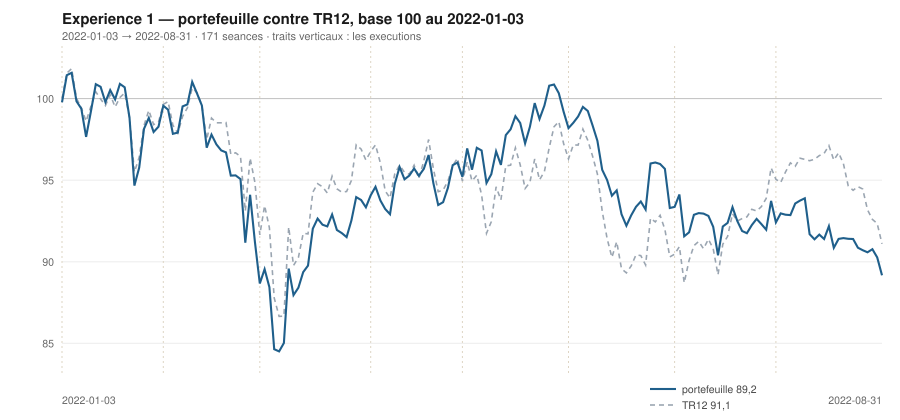

# Août 2022

> Journal de l'[expérience 1](../README.md) · **décision au 2022-07-29** · **exécution au 2022-08-01**
> Portefeuille au 2022-08-31 : **8 916,77 €** (base 89,17) · TR12 91,10 · alpha du mois **-0,01 pt** · depuis janvier **-1,93 pt**

---

## 1. Les actualités du mois précédent

**Juillet 2022.** Le 21 juillet, la BCE relève ses taux de 50 points de base —
sa première hausse en onze ans, et la fin de huit années de taux négatifs. Le
mouvement est plus ample qu'annoncé.

Les marchés rebondissent pourtant nettement sur l'hypothèse d'un pic
d'inflation : les rendements obligataires refluent, et les actions européennes
signent leur meilleur mois de l'année. En Italie, la démission de Mario Draghi
ouvre une crise politique et fait remonter la prime de risque transalpine.

Nord Stream 1 redémarre après sa maintenance, mais à 20 % de sa capacité. La
reconstitution des stocks de gaz européens avant l'hiver devient le sujet
dominant.

---

## 2. L'exposition héritée au 2022-07-29

| Valeur | Achetée le | Prix d'achat | +/− value | Alpha du mois | Alpha global |
|---|---|---|---|---|---|
| `AI.PA` Air Liquide | 2022-06-01 | 113,81 € | **-9,61 %** | -1,36 pt | -9,05 pt |
| `CAP.PA` Capgemini | 2022-01-03 | 194,20 € | **-12,91 %** | +7,35 pt | -8,67 pt |
| `ORA.PA` Orange | 2022-03-01 | 8,15 € | **-4,10 %** | -16,95 pt | -8,58 pt |
| `SAN.PA` Sanofi | 2022-02-01 | 74,59 € | **+9,42 %** | -5,14 pt | +13,32 pt |
| `TTE.PA` TotalEnergies | 2022-04-01 | 36,07 € | **+9,70 %** | -7,26 pt | +10,74 pt |

## 3. Le portefeuille depuis le 3 janvier 2022

| | |
|---|---|
| Dotation initiale | 10 000,00 € au 2022-01-03 |
| Titres au 2022-08-31 | 7 164,88 € |
| Espèces | 1 751,88 € |
| **Total** | **8 916,77 €** |
| Base 100 | **89,17** |
| TR12, même base | 91,10 |
| Écart depuis janvier | **-1,93 pt** |

## 4. L'étude chartiste au 2022-07-29

> Notes rédigées sans aucune séance postérieure au 2022-07-29, par l'agent `chartiste`. Cinq lignes au plus par société.

### 1. `TTE.PA` — TotalEnergies

- Hausse longue significative mais peu explicative : 120 s = +0,036 €/s (+0,088 %/s), p = 8,3·10⁻⁹, R² = 0,25 ; 20 s = −0,019 €/s, p = 0,63 — court terme plat.
- Cours à 30 % du canal 120 s (largeur 8,66 €, 22,5 %) : tiers bas ; 64 % du canal 20 s.
- Résistance convexe −0,148 €/s (−0,372 %/s), portée 36 séances (09/06 → 29/07), touches les 26, 27, 28 **et** 29/07 : quatre séances consécutives de butée sur 39,73 €.
- Support convexe ascendant +0,033 €/s (+0,090 %/s), portée 57 séances (26/04 → 14/07), 6 touches, niveau 36,79 € : cours 7,5 % dessus.
- Une clôture au-dessus de 39,73 € romprait un plafond testé quatre jours de suite ; sous 36,8 €, c'est le support d'avril-juillet qui céderait.

### 2. `SAN.PA` — Sanofi

- Hausse longue toujours significative mais qui s'érode : 120 s = +0,086 €/s (+0,100 %/s), p = 6,0·10⁻²², R² revenu de 0,66 à 0,55 ; 20 s = −0,019 €/s, p = 0,62, strictement plat.
- Cours à 15 % du canal 120 s et à 12 % du canal 20 s : bord bas des deux encadrements.
- Support convexe ascendant +0,127 €/s (+0,156 %/s), portée 102 séances (07/03 → 29/07), 11 touches, niveau 81,52 € : le cours clôture 0,1 % dessus, à même la droite.
- Résistance convexe descendante −0,065 €/s, portée 45 séances (26/05 → 28/07), 12 touches, niveau 84,63 € : les deux bords convergent, largeur ramenée à 3,1 €.
- Une clôture sous 81,5 € romprait un support à 11 touches ; la convergence des deux droites impose de toute façon une sortie à brève échéance.

### 3. `ORA.PA` — Orange

- Hausse longue très affaiblie : 120 s = +0,0033 €/s (+0,039 %/s), p = 2,8·10⁻⁵ mais R² effondré de 0,76 à 0,14 en un mois ; 20 s = −0,0455 €/s (−0,583 %/s), p = 3,0·10⁻¹⁰, R² = 0,90.
- **Rupture basse qualifiée** : trois clôtures consécutives sous −2 σ_e (27/07 z = −2,2 ; 28/07 z = −2,8 ; 29/07 z = −2,7), quatre depuis le 22/07 ; volume 1,29 fois la moyenne — persistance réelle, ampleur modérée.
- Cours à 4 % du canal 120 s : plancher de l'encadrement, dont la largeur a doublé (0,68 € en juin, 1,31 € aujourd'hui, soit 15,6 %).
- Support convexe à 2 touches seulement (07/03 et 28/07), niveau 7,61 € : droite non confirmée ; résistance courte descendante à 7,88 €, 10 touches, mais portée 18 séances.
- Une clôture sous 7,61 € supprimerait le dernier appui de la fenêtre ; au-dessus de 7,88 €, la pente courte de −0,58 %/séance serait invalidée.

### 4. `AI.PA` — Air Liquide

- Pente longue devenue indistinguable du bruit : 120 s = −0,018 €/s, p = 0,24, IC₉₅ [−0,049 ; +0,012], TEND_120 = 0 ; 20 s = +0,234 €/s (+0,233 %/s), p = 4,9·10⁻⁴, R² = 0,50.
- Cours à 47 % du canal 120 s (largeur 22,30 €, 21,2 %) : milieu exact ; 100 % du canal 20 s. Plus aucune sortie au-delà de 2 σ_e — la rupture basse du 30/06 a été résorbée.
- Résistance convexe −0,361 €/s (−0,349 %/s), portée 39 séances (06/06 → 29/07), 3 touches (06/06, 28/07, 29/07), niveau 103,58 € : contact du jour, droite tout juste crédible.
- Support convexe plat (+0,002 €/s), portée 83 séances, 6 touches, niveau 93,93 € : cours 9,5 % dessus.
- Une clôture au-dessus de 103,6 € romprait la résistance de juin ; entre 94 et 104 €, aucune direction longue n'est lisible.

### 5. `DG.PA` — Vinci

- Redressement court net : 20 s = +0,303 €/s (+0,388 %/s), p = 5,4·10⁻⁷, R² = 0,76 ; la pente longue reste négative, 120 s = −0,041 €/s (−0,056 %/s), p = 2,7·10⁻⁷, R² = 0,20.
- Cours à 94 % du canal 120 s (z = +1,95, juste sous le bord haut sans le franchir) et à 97 % du canal 20 s.
- Résistance convexe de très longue portée, 113 séances (18/02 → 29/07), pente −0,055 €/s, 5 touches dont celle du jour, niveau 80,24 € : le cours clôture 0,6 % dessous.
- Support convexe ascendant +0,042 €/s, portée 84 séances (07/03 → 05/07), 5 touches, niveau 71,53 € ; σ_e(20) ramené à 0,60 fois celui du mois précédent.
- Une clôture au-dessus de 80,2 € casserait un plafond de cinq mois et demi, ce que quatre contacts n'ont pas fait depuis février.

### 6. `RI.PA` — Pernod Ricard

- Droite courte la mieux ajustée de l'univers : 20 s = +0,711 €/s (+0,444 %/s), p = 1,7·10⁻¹¹, R² = 0,92 ; pente longue encore négative, 120 s = −0,099 €/s, p = 1,7·10⁻⁸, R² = 0,24.
- Cours à 100 % du canal 120 s sans le franchir (z = +1,95) ; σ_e(20) divisé par trois (× 0,33) : baisse de dispersion très marquée.
- Résistance convexe −0,083 €/s, portée 80 séances (06/04 → 29/07), 8 touches, niveau 163,20 € : cours 1,2 % dessous.
- Support ascendant du rebond +0,556 €/s, 10 touches depuis le 22/06, mais **portée 17 séances seulement** sur une fenêtre de 60 : pente locale, non extrapolable ; l'appui robuste reste 137,35 € (7 touches, portée 74 s).
- Une clôture au-dessus de 163,2 € casserait le plafond d'avril, testé huit fois.

### 7. `BNP.PA` — BNP Paribas

- Baisse longue modeste : 120 s = −0,043 €/s (−0,124 %/s), p = 4,5·10⁻⁸, R² = 0,23 ; à 20 s, +0,030 €/s avec p = 0,43 et IC₉₅ [−0,048 ; +0,108] qui change de signe — aucune direction courte affirmable.
- Canal 120 s large de 14,57 €, soit 39,0 % du niveau moyen : le plus lâche de l'univers, il ne contraint rien ; cours à 50 % de hauteur, mais à 99 % du canal 20 s.
- Support convexe presque plat (+0,005 €/s), portée 92 séances, 3 touches (07/03, 14/07, 15/07), niveau 31,48 € : crédible mais très en retrait, 13,0 % sous le cours.
- Résistance −0,144 €/s (−0,400 %/s), portée 39 séances (06/06 → 29/07), 8 touches, niveau 36,01 € : cours 1,3 % dessous, butée du jour.
- Une clôture au-dessus de 36,0 € casserait la résistance de juin-juillet ; sous 31,4 € (plus-bas du 15/07), le support à 3 touches tomberait.

### 8. `CAP.PA` — Capgemini

- Rebond court marqué : 20 s = +0,791 €/s (+0,496 %/s), p = 1,9·10⁻⁵, R² = 0,65 ; pente longue toujours nette, 120 s = −0,170 €/s (−0,110 %/s), p = 1,3·10⁻¹⁴, R² = 0,40.
- **Sortie par le haut**, le même jour, des deux canaux : z = +2,13 (120 s) et +2,92 (20 s), première séance dehors, volume 2,05 fois la moyenne 20 s — le plus élevé de l'univers ce jour.
- Cours à 95 % du canal 120 s et 100 % du canal 20 s.
- Résistance convexe −0,200 €/s (−0,118 %/s), portée 82 séances (04/04 → 29/07), 5 touches, niveau 169,54 € : contact exact du jour.
- Une seconde clôture au-dessus de 169,5 € confirmerait la rupture ; une séance isolée, fût-elle sur volume double, n'en est pas une.

### 9. `MC.PA` — LVMH

- Sursaut court très significatif : 20 s = +3,460 €/s (+0,573 %/s), p = 1,3·10⁻⁸, R² = 0,84 ; la pente longue reste négative (−0,394 €/s) mais son R² a chuté de 0,66 à 0,16 en un mois.
- **Sortie par le haut du canal ±2 σ_e (120 s)** : z = +2,74 ce jour après +2,4 le 28/07 — deux séances consécutives dehors, volume 1,68 fois la moyenne 20 s. Ampleur et persistance suffisantes pour être qualifiées.
- Cours à 100 % des canaux de régression 20 s et 120 s.
- La dernière arête haute de l'enveloppe convexe passe par le cours du jour mais ne repose que sur 2 points (10/02 et 29/07), niveau 627,09 € : **droite non confirmée**, à ne pas tenir pour une résistance établie.
- Une troisième clôture au-dessus de 627 € confirmerait la sortie ; un retour sous 566 € (support convexe 60 s, 7 touches) la ramènerait au rang de dépassement passager.

### 10. `OR.PA` — L'Oréal

- Reprise courte nette : 20 s = +1,379 €/s (+0,411 %/s), p = 4,4·10⁻⁶, R² = 0,70 ; la pente longue reste −0,161 €/s (p = 6,3·10⁻⁵) mais avec R² = 0,13 seulement — elle n'explique presque plus rien.
- **Sortie par le haut du canal 120 s** : z = +2,60, première séance dehors, volume 1,84 fois la moyenne — une seule séance, donc pas encore une rupture qualifiée.
- Cours à 100 % du canal 120 s, 79 % du canal 20 s ; plus-haut des 120 séances inscrit ce jour en séance, 348,95 €.
- Résistance convexe quasi horizontale +0,023 €/s, portée 81 séances (05/04 → 29/07), 6 touches, niveau 348,95 € : atteinte exactement aujourd'hui.
- Une clôture au-dessus de 349 € casserait le plafond d'avril-juillet ; le support ascendant de la fenêtre 60 s est à 319,63 € (8 touches).

### 11. `AIR.PA` — Airbus

- Retournement court franc : 20 s = +0,727 €/s (+0,721 %/s), p = 2,6·10⁻⁷, R² = 0,78 ; la pente longue reste négative mais s'affaiblit, 120 s = −0,080 €/s (−0,087 %/s), p = 3,1·10⁻⁸, R² tombé de 0,39 à 0,23.
- Cours à 84 % du canal 120 s et à 16 % du canal 20 s (ascendant) ; σ_e(20) ramené à 0,68 fois celui des 20 séances antérieures : resserrement.
- Le support convexe est devenu strictement plat (−0,0006 €/s), portée 84 séances (07/03 → 05/07), 6 touches, niveau 82,73 € : le rebond part du double appui du 07/03 et du 05/07.
- Résistance descendante −0,139 €/s (−0,140 %/s), portée 39 séances (30/05 → 22/07), 13 touches, niveau 99,20 € : cours 1,6 % dessous.
- Une clôture au-dessus de 99,2 € casserait une résistance à 13 touches ; en deçà, le rebond reste borné par elle.

### 12. `SU.PA` — Schneider Electric

- Contradiction franche entre horizons : 120 s = −0,230 €/s (−0,212 %/s), p = 3,0·10⁻²⁴, R² = 0,58 ; 20 s = +0,958 €/s (+0,788 %/s), p = 3,0·10⁻⁸, R² = 0,83.
- **Sortie par le haut du canal 120 s** : z = +2,58 ce jour après +2,6 le 28/07 — deux séances consécutives dehors, volume 1,44 fois la moyenne 20 s.
- Cours à 100 % du canal 120 s et 89 % du canal 20 s ; il a repris 22,3 % depuis le plus-bas du 22/06 (102,77 €).
- Résistance convexe descendante −0,195 €/s (−0,153 %/s), portée 81 séances (05/04 → 29/07), 9 touches, niveau 127,13 € : cours 1,1 % dessous.
- Une clôture au-dessus de 127,1 € casserait la résistance d'avril-juillet ; à défaut, la sortie de canal reste un simple contact de bord.

## 5. Le classement au 2022-07-29

> De la valeur la plus intéressante à détenir à celle qu'il faut fuir. Le détail des cinq composantes est dans le [protocole](../README.md#le-score-en-cinq-composantes).

| Rang | Valeur | `s1` | `s2` | `s3` | `s4` | `s5` | Score | Position | Momentum 12-1 |
|---|---|---|---|---|---|---|---|---|---|
| 1 | `TTE.PA` TotalEnergies | +2 | +0 | +1 | +2 | +0 | **+5** | 94,5 % | +41,5 % |
| 2 | `SAN.PA` Sanofi | +2 | +0 | -1 | +2 | +0 | **+3** | 3,2 % | +15,1 % |
| 3 | `ORA.PA` Orange | +2 | -1 | -1 | +2 | +0 | **+2** | 11,4 % | +26,0 % |
| 4 | `AI.PA` Air Liquide | +0 | +1 | +1 | -1 | +0 | **+1** | 92,7 % | -2,5 % |
| 5 | `DG.PA` Vinci | -2 | +1 | +1 | -1 | +0 | **-1** | 94,1 % | -2,1 % |
| 6 | `RI.PA` Pernod Ricard | -2 | +1 | +1 | -1 | +0 | **-1** | 92,5 % | -5,4 % |
| 7 | `BNP.PA` BNP Paribas | -2 | +0 | +1 | -1 | +0 | **-2** | 90,0 % | -7,7 % |
| 8 | `CAP.PA` Capgemini | -2 | +1 | +1 | -2 | +0 | **-2** | 98,7 % | -12,9 % |
| 9 | `MC.PA` LVMH | -2 | +1 | +1 | -2 | +0 | **-2** | 96,5 % | -15,3 % |
| 10 | `OR.PA` L'Oréal | -2 | +1 | +1 | -2 | +0 | **-2** | 94,5 % | -16,3 % |
| 11 | `AIR.PA` Airbus | -2 | +1 | +1 | -2 | +0 | **-2** | 90,3 % | -18,3 % |
| 12 | `SU.PA` Schneider Electric | -2 | +1 | +1 | -2 | +0 | **-2** | 94,7 % | -21,8 % |

## 6. Les ordres exécutés au 2022-08-01

> À l'**ouverture** de la séance, jamais à la clôture du 2022-07-29.

| Sens | Valeur | Quantité | Prix d'exécution | Brut | Frais | Motif |
|---|---|---|---|---|---|---|
| **Vente** | `CAP.PA` Capgemini | 10 | 168,58 € | 1 685,78 € | 1,94 € | rang 8 au-dela de 7 |

## 7. La lecture du mois

Sur le mois, la meilleure contribution vient de `TTE.PA` (TotalEnergies) pour **+32,53 €**, la moins bonne de `SAN.PA` (Sanofi) pour **-403,82 €**. Les 1 ordres du mois ont coûté **1,94 €** de frais, soit 0,019 % de la dotation initiale. Le portefeuille termine le mois **derrière TR12** de 0,01 point.

---

[← Juillet](2022-07.md) · [Protocole](../README.md) · [Septembre →](2022-09.md)
