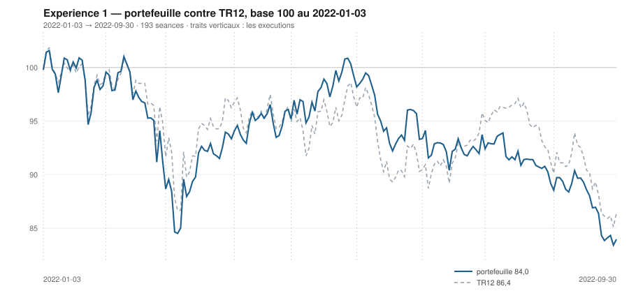

# Septembre 2022

> Journal de l'[expérience 1](../README.md) · **décision au 2022-08-31** · **exécution au 2022-09-01**
> Portefeuille au 2022-09-30 : **8 395,04 €** (base 83,95) · TR12 86,39 · alpha du mois **-0,68 pt** · depuis janvier **-2,44 pt**

---

## 1. Les actualités du mois précédent

**Août 2022.** Le prix du gaz européen atteint son sommet historique, près de
340 €/MWh fin août, sur fond d'arrêt complet de Nord Stream 1. L'électricité
française à terme suit, aggravée par l'indisponibilité d'une large part du parc
nucléaire.

Le 26 août, à Jackson Hole, Jerome Powell prononce un discours de huit minutes
d'une fermeté inhabituelle : la lutte contre l'inflation infligera « une certaine
douleur » aux ménages et aux entreprises. Le rebond estival s'interrompt net.

L'euro passe durablement sous la parité avec le dollar. Le mois se termine sur
une accélération baissière qui touche l'ensemble des secteurs.

---

## 2. L'exposition héritée au 2022-08-31

| Valeur | Achetée le | Prix d'achat | +/− value | Alpha du mois | Alpha global |
|---|---|---|---|---|---|
| `AI.PA` Air Liquide | 2022-06-01 | 113,81 € | **-15,62 %** | -1,79 pt | -10,23 pt |
| `ORA.PA` Orange | 2022-03-01 | 8,15 € | **-3,13 %** | +5,87 pt | -2,54 pt |
| `SAN.PA` Sanofi | 2022-02-01 | 74,59 € | **-7,50 %** | -10,60 pt | +1,07 pt |
| `TTE.PA` TotalEnergies | 2022-04-01 | 36,07 € | **+11,75 %** | +6,73 pt | +17,60 pt |

## 3. Le portefeuille depuis le 3 janvier 2022

| | |
|---|---|
| Dotation initiale | 10 000,00 € au 2022-01-03 |
| Titres au 2022-09-30 | 7 978,59 € |
| Espèces | 416,45 € |
| **Total** | **8 395,04 €** |
| Base 100 | **83,95** |
| TR12, même base | 86,39 |
| Écart depuis janvier | **-2,44 pt** |

## 4. L'étude chartiste au 2022-08-31

> Notes rédigées sans aucune séance postérieure au 2022-08-31, par l'agent `chartiste`. Cinq lignes au plus par société.

### 1. `TTE.PA` — TotalEnergies

- Seule valeur de l'univers dont les deux horizons montent : 120 s = +0,042 €/s (+0,101 %/s), p = 1,1·10⁻¹², R² = 0,35 ; 20 s = +0,178 €/s (+0,414 %/s), p = 1,4·10⁻⁴, R² = 0,56.
- Le cours sort par le bas du canal 20 s ce jour même (z = −2,96, volume 1,66 fois la moyenne), mais **une seule séance sans persistance : ce n'est pas une rupture**, c'est un écart à noter.
- Cours à 25 % du canal 120 s (largeur 8,80 €, 22,4 %) et 0 % du canal 20 s.
- Support convexe court +0,108 €/s, portée 18 séances seulement sur 60 : sous le seuil du quart de fenêtre, non extrapolable ; l'appui robuste est celui de la fenêtre 120 s, +0,033 €/s, 5 touches, niveau 37,55 €.
- Une deuxième clôture sous 39,81 € changerait le statut de la séance du jour ; résistance à 43,56 €, 7 touches dont 23-29/08.

### 2. `ORA.PA` — Orange

- Retournement long confirmé : 120 s = −0,0032 €/s (−0,039 %/s), p = 3,5·10⁻⁴, R² = 0,10, TEND_120 passé à −1 — la pente était +0,0101 €/s avec R² = 0,76 fin juin ; 20 s = +0,0043 €/s, p = 0,24, plat.
- Cours à 27 % du canal 120 s (largeur 1,11 €, 13,3 %) et 16 % du canal 20 s ; **aucune sortie au-delà de 2 σ_e** sur la fenêtre : la rupture basse de fin juillet est résorbée.
- Résistance convexe descendante −0,0223 €/s (−0,279 %/s), portée 42 séances (04/07 → 31/08), 10 touches dont 17 au 23/08, niveau 8,00 € : cours 1,4 % dessous.
- Support convexe −0,0032 €/s, portée 95 séances (15/03 → 28/07), 8 touches, niveau 7,53 € : cours 4,9 % dessus ; plus-bas 120 s le 28/07 à 7,61 €.
- Une clôture au-dessus de 8,00 € casserait la résistance de juillet-août ; l'encadrement se resserre entre 7,53 et 8,00 €.

### 3. `DG.PA` — Vinci

- Aucune direction affirmable à l'un ou l'autre bout : 120 s = +0,011 €/s, p = 0,087, IC₉₅ [−0,002 ; +0,024] qui change de signe ; 20 s = −0,056 €/s, p = 0,096 ; seul le 60 s tranche, +0,144 €/s (+0,179 %/s), R² = 0,73.
- Canal 120 s le plus étroit après ORA : 10,18 €, soit 13,3 % du niveau moyen ; cours à 74 % de hauteur, 40 % du canal 20 s.
- Support convexe ascendant +0,162 €/s (+0,209 %/s), portée 39 séances (05/07 → 29/08), 3 touches, niveau 77,42 € : cours 1,7 % dessus.
- Résistance quasi horizontale +0,013 €/s, portée 79 séances (28/04 → 17/08), 5 touches, niveau 81,75 € ; plus-haut 120 s le 17/08 à 81,62 €.
- Une sortie de la bande 77,4-81,8 €, dans un sens ou dans l'autre, serait le premier fait graphique lisible ; à l'intérieur, l'encadrement ne dit rien.

### 4. `MC.PA` — LVMH

- TEND_120 est repassé à +1 : 120 s = +0,462 €/s (+0,077 %/s), p = 8,3·10⁻⁶, R² = 0,16 ; 60 s = +2,562 €/s (+0,391 %/s), R² = 0,85 ; mais 20 s = −1,394 €/s (−0,225 %/s), p = 0,0060 — l'été monte, le mois d'août rend.
- Cours à 53 % du canal 120 s (largeur 140,45 €, 24,7 %) et à 0 % du canal 20 s : bord bas exact de l'encadrement court.
- Support convexe ascendant +1,995 €/s (+0,334 %/s), portée 50 séances (22/06 → 31/08), 10 touches, niveau 597,03 € : le cours clôture exactement dessus.
- Résistance +0,377 €/s, portée 100 séances (29/03 → 18/08), 14 touches, niveau 656,58 € : cours 9,1 % dessous ; plus-haut 120 s le 18/08 à 653,18 €.
- Une clôture sous 597 € romprait un support à 10 touches, seul appui de la fenêtre depuis le 22/06.

### 5. `SAN.PA` — Sanofi

- Inversion complète : la hausse longue de juin-juillet est éteinte, 120 s = −0,040 €/s (−0,051 %/s), p = 0,0022, R² = 0,077, TEND_120 passé de +1 à −1 ; 20 s = −0,691 €/s (−1,055 %/s), p = 6,0·10⁻⁶, R² = 0,69.
- **Élargissement majeur** : σ_e(20) triplé, de 0,90 € à 2,68 € (× 2,99) ; le plus-bas des 120 séances a été inscrit le 11/08 à 64,19 €, contre 87,64 € le 25/05.
- Le support ascendant du 29/07 (81,52 €, 11 touches) a été cassé ; la chaîne inférieure donne désormais une droite descendante −0,091 €/s, portée 105 séances, niveau 62,92 €.
- Cours à 10 % du canal 120 s, mais à 93 % du canal 20 s — rebond technique à l'intérieur d'un canal court fortement baissier.
- Une clôture au-dessus de 70,17 € invaliderait la résistance descendante à 7 touches formée depuis le 04/08.

### 6. `RI.PA` — Pernod Ricard

- Pente longue redevenue nulle : 120 s = −0,020 €/s, p = 0,29, IC₉₅ [−0,058 ; +0,017], TEND_120 = 0 ; 60 s = +0,384 €/s (+0,232 %/s), R² = 0,77 ; 20 s = −0,367 €/s (−0,232 %/s), p = 5,1·10⁻⁴.
- Cours à 55 % du canal 120 s (largeur 27,08 €, 17,4 %) et à 0 % du canal 20 s ; σ_e(20) presque doublé (× 1,76).
- Support convexe ascendant +0,310 €/s (+0,201 %/s), portée 50 séances (22/06 → 31/08), 5 touches dont 29, 30 et 31/08, niveau 154,57 € : le cours clôture exactement dessus, troisième contact consécutif.
- Résistance quasi plate −0,046 €/s, portée 89 séances (06/04 → 11/08), 17 touches — le plus grand nombre de contacts de l'univers —, niveau 165,08 € : cours 6,4 % dessous.
- Une clôture sous 154,6 € romprait le support ascendant de l'été ; au-dessus de 165,1 €, c'est un plafond à 17 touches qui céderait.

### 7. `OR.PA` — L'Oréal

- Pente longue redevenue nulle : 120 s = +0,059 €/s, p = 0,198, IC₉₅ [−0,031 ; +0,149], TEND_120 = 0 ; 60 s = +0,856 €/s (R² = 0,72) ; 20 s = −0,748 €/s (−0,228 %/s), p = 7,2·10⁻⁴.
- Cours à 54 % du canal 120 s (largeur 66,01 €, 20,7 %) et à 10 % du canal 20 s.
- Support convexe ascendant +0,668 €/s (+0,211 %/s), portée 54 séances (16/06 → 31/08), 7 touches dont le 30/08, niveau 317,14 € : cours 1,3 % dessus, appui testé hier.
- Résistance quasi horizontale +0,023 €/s, portée 81 séances, 11 touches, niveau 349,48 € : cours 8,1 % dessous, le plus-haut 120 s (348,95 €) reste celui du 29/07.
- Une clôture sous 317 € romprait le support de l'été ; volume du jour 2,19 fois la moyenne 20 séances.

### 8. `BNP.PA` — BNP Paribas

- Aucune direction lisible : 120 s = −0,012 €/s, p = 0,025, R² = 0,042, IC₉₅ [−0,023 ; −0,002] — significative mais sans portée pratique ; 60 s = +0,006 €/s, p = 0,68 ; 20 s = −0,151 €/s (−0,423 %/s), p = 1,7·10⁻⁴.
- Canal 120 s large de 9,79 €, soit 26,6 % du niveau moyen ; cours à 47 % de hauteur, z = −0,07 : milieu, encadrement peu contraignant.
- Support convexe ascendant +0,108 €/s (+0,308 %/s), portée 31 séances (15/07 → 29/08), 3 touches : crédible mais jeune, niveau 34,98 €.
- Résistance −0,054 €/s (−0,140 %/s), portée 57 séances (30/05 → 17/08), 7 touches dont 12, 15, 16 et 17/08, niveau 38,69 €.
- Une clôture sous 34,98 € ou au-dessus de 38,69 € trancherait un encadrement aujourd'hui indécis ; entre les deux, rien n'est décidable.

### 9. `CAP.PA` — Capgemini

- La meilleure droite courte de l'univers, orientée à la baisse : 20 s = −0,775 €/s (−0,482 %/s), p = 5,4·10⁻⁸, R² = 0,81 ; 120 s = −0,120 €/s (−0,076 %/s), p = 2,8·10⁻⁷, R² = 0,20 ; 60 s = +0,310 €/s.
- σ_e(20) divisé par deux (4,37 € → 2,14 €) : repli ordonné, peu dispersé ; cours à 59 % du canal 120 s mais 3 % du canal 20 s.
- Support convexe ascendant +0,427 €/s (+0,271 %/s), portée 41 séances (05/07 → 31/08), 7 touches dont 29 et 30/08, niveau 157,86 € : le cours clôture dessus au centime près, troisième contact en trois séances.
- Résistance −0,108 €/s, portée 86 séances (04/04 → 04/08), 11 touches, niveau 174,61 € : cours 9,6 % dessous.
- Une clôture sous 157,9 € romprait le support de l'été au moment même où il est testé trois jours de suite.

### 10. `AI.PA` — Air Liquide

- La pente longue, nulle fin juillet, est redevenue nettement négative : 120 s = −0,102 €/s (−0,103 %/s), p = 1,2·10⁻¹⁴, R² = 0,40 ; 20 s = −0,303 €/s (−0,305 %/s), p = 5,5·10⁻⁴ ; 60 s = +0,001 €/s, p = 0,97 — trois mois strictement plats.
- Cours à 35 % du canal 120 s (largeur 19,34 €, 18,3 %) et à 0 % du canal 20 s.
- Support convexe ascendant +0,052 €/s, portée 41 séances (05/07 → 31/08), 8 touches (05, 06, 13, 14, 15, 19/07 puis 31/08), niveau 96,03 € : le cours clôture exactement sur la droite.
- Résistance −0,228 €/s (−0,220 %/s), portée 54 séances (06/06 → 19/08), 7 touches dont 15 au 19/08, niveau 103,53 € : cours 7,2 % dessous.
- Une clôture sous 96,0 € romprait un support à 8 touches ; l'encadrement se referme entre 96 et 103,5 €.

### 11. `AIR.PA` — Airbus

- Les trois horizons ne concordent pas : 120 s = −0,029 €/s, p = 0,020 mais R² = 0,045 et IC₉₅ [−0,054 ; −0,005] — pente longue à peine distincte de zéro ; 60 s = +0,196 €/s (R² = 0,44) ; 20 s = −0,341 €/s (−0,361 %/s), p = 0,0020.
- Cours à 44 % du canal 120 s (largeur 20,76 €, 21,6 %) et à 10 % du canal 20 s.
- Support convexe ascendant +0,203 €/s (+0,223 %/s), portée 41 séances (05/07 → 31/08), mais **2 touches seulement** : droite non confirmée, niveau 91,05 €, le cours clôture 0,1 % dessus.
- Résistance −0,035 €/s, portée 56 séances, 5 touches (27, 30/05, 06/06, 16 et 17/08), niveau 102,95 € : cours 11,5 % dessous. Volume du jour 2,26 fois la moyenne 20 s.
- Une clôture sous 91,0 € laisserait la fenêtre sans support constitué jusqu'au plus-bas du 05/07 (82,74 €).

### 12. `SU.PA` — Schneider Electric

- Le rebond de juillet est effacé : 120 s = −0,158 €/s (−0,141 %/s), p = 8,3·10⁻¹¹, R² = 0,30 ; 60 s = +0,299 €/s ; 20 s = −0,635 €/s (−0,547 %/s), p = 1,1·10⁻⁴, R² = 0,57.
- Cours à 48 % du canal 120 s (largeur 29,49 €, 24,4 %) mais à 0 % du canal 20 s : bord bas exact de l'encadrement court ; aucune sortie au-delà de 2 σ_e sur la fenêtre longue.
- Support convexe ascendant +0,195 €/s (+0,176 %/s), portée 34 séances (14/07 → 31/08), 11 touches, niveau 110,74 € : le cours clôture 0,2 % dessus.
- Résistance −0,150 €/s (−0,118 %/s), portée 95 séances (05/04 → 18/08), 13 touches, niveau 127,27 € : cours 12,8 % dessous. Volume du jour 2,68 fois la moyenne, le plus élevé de l'univers.
- Une clôture sous 110,7 € romprait un support à 11 touches, sans autre appui identifié dans la fenêtre avant le plus-bas du 22/06 (102,77 €).

## 5. Le classement au 2022-08-31

> De la valeur la plus intéressante à détenir à celle qu'il faut fuir. Le détail des cinq composantes est dans le [protocole](../README.md#le-score-en-cinq-composantes).

| Rang | Valeur | `s1` | `s2` | `s3` | `s4` | `s5` | Score | Position | Momentum 12-1 |
|---|---|---|---|---|---|---|---|---|---|
| 1 | `TTE.PA` TotalEnergies | +2 | +1 | +0 | +2 | +0 | **+5** | 45,8 % | +38,7 % |
| 2 | `ORA.PA` Orange | -2 | +0 | +1 | +2 | +0 | **+1** | 76,7 % | +14,0 % |
| 3 | `DG.PA` Vinci | +0 | +0 | +0 | +1 | +0 | **+1** | 31,0 % | +4,8 % |
| 4 | `MC.PA` LVMH | +2 | -1 | -1 | +1 | +0 | **+1** | 0,0 % | +4,8 % |
| 5 | `SAN.PA` Sanofi | -2 | -1 | +0 | +2 | +0 | **-1** | 30,1 % | +21,1 % |
| 6 | `RI.PA` Pernod Ricard | +0 | -1 | -1 | +1 | +0 | **-1** | 0,0 % | +2,8 % |
| 7 | `OR.PA` L'Oréal | +0 | -1 | -1 | -1 | +0 | **-3** | 12,3 % | -7,2 % |
| 8 | `BNP.PA` BNP Paribas | -2 | -1 | +0 | -1 | +0 | **-4** | 25,5 % | -4,7 % |
| 9 | `CAP.PA` Capgemini | -2 | -1 | -1 | -1 | +0 | **-5** | 0,0 % | -0,8 % |
| 10 | `AI.PA` Air Liquide | -2 | -1 | -1 | -1 | +0 | **-5** | 0,0 % | -1,6 % |
| 11 | `AIR.PA` Airbus | -2 | -1 | -1 | -1 | +0 | **-5** | 0,4 % | -9,5 % |
| 12 | `SU.PA` Schneider Electric | -2 | -1 | -1 | -2 | +0 | **-6** | 1,2 % | -11,2 % |

## 6. Les ordres exécutés au 2022-09-01

> À l'**ouverture** de la séance, jamais à la clôture du 2022-08-31.

| Sens | Valeur | Quantité | Prix d'exécution | Brut | Frais | Motif |
|---|---|---|---|---|---|---|
| **Vente** | `AI.PA` Air Liquide | 14 | 95,77 € | 1 340,77 € | 1,54 € | rang 10 au-dela de 7 |
| **Achat** | `DG.PA` Vinci | 19 | 78,54 € | 1 492,23 € | 6,19 € | rang 3, score +1 |
| **Achat** | `MC.PA` LVMH | 2 | 585,69 € | 1 171,38 € | 4,86 € | rang 4, score +1 |

## 7. La lecture du mois

Sur le mois, la meilleure contribution vient de `MC.PA` (LVMH) pour **-45,73 €**, la moins bonne de `ORA.PA` (Orange) pour **-154,81 €**. Les 3 ordres du mois ont coûté **12,60 €** de frais, soit 0,126 % de la dotation initiale. Le portefeuille termine le mois **derrière TR12** de 0,68 point.

---

[← Août](2022-08.md) · [Protocole](../README.md) · [Octobre →](2022-10.md)
