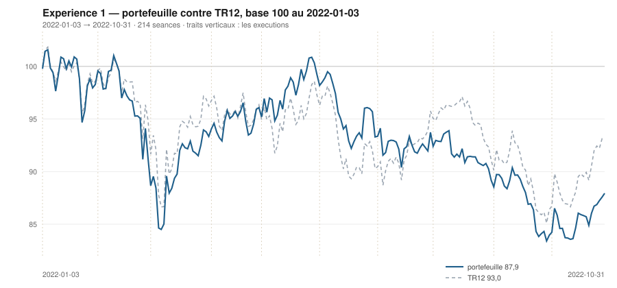

# Octobre 2022

> Journal de l'[expérience 1](../README.md) · **décision au 2022-09-30** · **exécution au 2022-10-03**
> Portefeuille au 2022-10-31 : **8 793,93 €** (base 87,94) · TR12 93,04 · alpha du mois **-2,94 pt** · depuis janvier **-5,10 pt**

---

## 1. Les actualités du mois précédent

**Septembre 2022.** Le pire mois de l'année. Le 8 septembre, la BCE relève ses
taux de 75 points de base ; le 21, la Fed fait de même pour la troisième fois
consécutive.

Le 23 septembre, le budget britannique non financé provoque une crise
obligataire : les rendements des gilts s'envolent, la Banque d'Angleterre doit
intervenir en urgence pour éviter la défaillance des fonds de pension. La
contagion touche l'ensemble des dettes souveraines européennes.

Le CAC 40 inscrit son point bas annuel le 29 septembre. Aucun secteur n'échappe
au mouvement ; les valeurs défensives elles-mêmes cèdent, ce qui signale un repli
généralisé plutôt qu'une rotation.

---

## 2. L'exposition héritée au 2022-09-30

| Valeur | Achetée le | Prix d'achat | +/− value | Alpha du mois | Alpha global |
|---|---|---|---|---|---|
| `DG.PA` Vinci | 2022-09-01 | 78,54 € | **-9,59 %** | -5,45 pt *(partiel)* | -5,45 pt |
| `MC.PA` LVMH | 2022-09-01 | 585,69 € | **-3,90 %** | +0,23 pt *(partiel)* | +0,23 pt |
| `ORA.PA` Orange | 2022-03-01 | 8,15 € | **-11,28 %** | -3,25 pt | -5,55 pt |
| `SAN.PA` Sanofi | 2022-02-01 | 74,59 € | **-11,75 %** | +0,57 pt | +1,54 pt |
| `TTE.PA` TotalEnergies | 2022-04-01 | 36,07 € | **+7,95 %** | +1,77 pt | +18,66 pt |

## 3. Le portefeuille depuis le 3 janvier 2022

| | |
|---|---|
| Dotation initiale | 10 000,00 € au 2022-01-03 |
| Titres au 2022-10-31 | 8 643,85 € |
| Espèces | 150,08 € |
| **Total** | **8 793,93 €** |
| Base 100 | **87,94** |
| TR12, même base | 93,04 |
| Écart depuis janvier | **-5,10 pt** |

## 4. L'étude chartiste au 2022-09-30

> Notes rédigées sans aucune séance postérieure au 2022-09-30, par l'agent `chartiste`. Cinq lignes au plus par société.

### 1. `RI.PA` — Pernod Ricard

- Tendance longue haussière mais tout juste significative : +0,039 €/séance (+0,025 %/séance), p = 0,020, R² = 0,045, IC₉₅ [+0,006 ; +0,073] dont la borne basse frôle zéro ; tendance courte non significative, p = 0,171, IC₉₅ [−0,245 ; +0,047] à cheval sur zéro.
- Canal convergent, refermeture théorique en 51 séances : support +0,193 €/séance à 152,93 € (deux épisodes), résistance −0,034 €/séance à 164,50 € (trois épisodes) ; largeur 11,56 €, soit 7,3 % — le canal le plus étroit du panier après SAN.PA.
- Clôture 159,03 €, position 52,7 % : milieu de canal exact, après un rebond depuis 21 % le 29/09.
- Aucune des deux tendances ne permet d'affirmation directionnelle ; seule la géométrie du pincement est lisible.
- Une clôture sous 152,9 € ou au-dessus de 164,5 € trancherait une figure que le test de Student ne tranche pas.

### 2. `TTE.PA` — TotalEnergies

- Tendance longue indiscernable du bruit : pente +0,009 €/séance, p = 0,094, R² = 0,024, IC₉₅ [−0,0015 ; +0,0196] qui contient zéro — aucune affirmation directionnelle n'est possible sur 120 séances.
- Tendance courte baissière et nette : −0,150 €/séance (−0,38 %/séance), R² = 0,606.
- Encadrement légèrement convergent : support +0,024 €/séance à 37,28 € (portée 109, trois épisodes : 25-27/04, 14/07, 23-29/09), résistance −0,025 €/séance à 43,01 € (deux épisodes) ; largeur 5,72 € soit 14,3 %.
- Clôture 38,93 €, position 28,8 %, remontée de 6 % le 23/09 à 29 % le 30/09.
- Une clôture sous 37,3 € romprait le seul côté crédible de l'encadrement, celui à trois épisodes.

### 3. `MC.PA` — LVMH

- Divergence des deux horizons : pente 120 séances de +0,669 €/séance (+0,117 %/séance), p = 1,2 × 10⁻¹¹, R² = 0,324, contre une pente 20 séances de −2,198 €/séance (−0,38 %/séance), R² = 0,600 — les critères 1 et 2 sont de signes opposés.
- Encadrement ascendant : support de pente +0,756 €/séance ancré au 16/06/2022 (portée 74 séances), à 550,78 € ; résistance de pente +0,622 ancrée au 21/04, à 672,45 € ; largeur 121,67 €, soit 19,9 %.
- Clôture 562,82 €, position 9,9 % : le cours est venu au contact du support après avoir été à 80 % le 22/08.
- Le support ne compte que deux épisodes (14-23/06 et 23-30/09) : droite non confirmée, à traiter comme une contrainte géométrique et non comme une figure ; la résistance en a trois.
- Un retour sous 550,8 € romprait un support qui ne tient qu'à deux points de contact.

### 4. `OR.PA` — L'Oréal

- Pente longue positive mais peu explicative : +0,183 €/séance (+0,058 %/séance), p = 6,7 × 10⁻⁶, R² = 0,158 ; pente courte franchement négative, −1,161 €/séance (−0,37 %/séance), R² = 0,715.
- Canal convergent : support +0,243 €/séance à 299,57 € (portée 74, deux épisodes seulement), résistance −0,330 €/séance à 334,08 € (portée 32, trois épisodes) ; largeur 34,51 € soit 10,9 %, refermeture théorique en 60 séances.
- Clôture 308,96 €, position 27,2 %, dans le tiers bas après un contact du support les 28-30/09.
- La convergence des deux droites, et non le cours, est le fait dominant : le canal perd 0,57 € de hauteur par séance.
- Une clôture sous 299,6 €, ou au-dessus de 334,1 €, résoudrait un encadrement qui se referme de lui-même d'ici deux à trois mois.

### 5. `DG.PA` — Vinci

- La tendance longue est nulle au sens du test : pente +0,007 €/séance, p = 0,358, IC₉₅ [−0,008 ; +0,022] — rien à affirmer sur 120 séances ; en revanche la pente courte est franche, −0,606 €/séance (−0,79 %/séance), R² = 0,778.
- Encadrement large et quasi horizontal : support −0,017 €/séance à 69,45 €, avec cinq épisodes de contact (14/06, 22/06, 05/07, 26/09, 29/09) ; résistance +0,023 €/séance à 83,16 €, deux épisodes ; largeur 13,71 €, soit 18,0 %.
- Clôture 71,01 €, position 11,4 %, effondrée depuis 96 % le 12/09 — l'amplitude complète du canal parcourue en treize séances.
- Débordement bas du canal de régression : trois séances consécutives au-delà de −2 σ_e (26, 29 et 30/09, jusqu'à −2,4 σ), avec un volume à 1,24 fois la moyenne 20 séances — persistance réelle, mais ampleur modeste.
- Une clôture sous 69,45 € invaliderait le support à cinq épisodes, la seule structure installée de la figure.

### 6. `ORA.PA` — Orange

- Baisse longue parmi les plus nettes du panier : −0,0104 €/séance (−0,125 %/séance), p = 1,1 × 10⁻³⁴, R² = 0,723 ; baisse courte encore plus raide, −0,0377 €/séance (−0,49 %/séance), R² = 0,820.
- Le cours clôture à 7,229 €, exactement au plus bas des 120 séances, à −1,97 σ_e de la droite ajustée, position 2,5 % dans un canal de 0,64 € (8,5 %).
- Support à 7,21 € de pente −0,0055 €/séance, mais deux épisodes seulement (02/05 et 29-30/09) : la ligne basse n'est pas confirmée ; résistance à 7,85 €, deux épisodes également.
- Le volume de la séance vaut 1,73 fois la moyenne 20 séances — le plus élevé du panier ce jour, sur un point bas.
- Une clôture sous 7,21 € ferait sortir le cours par le bas d'un encadrement déjà orienté à la baisse des deux côtés.

### 7. `AI.PA` — Air Liquide

- Baisse longue très nette : −0,176 €/séance (−0,171 %/séance), p = 1,4 × 10⁻³⁴, R² = 0,722 — la droite explique près des trois quarts du mouvement sur 120 séances ; la pente courte, −0,296 €/séance (−0,32 %/séance), va dans le même sens.
- Canal descendant des deux côtés : support −0,096 €/séance à 87,87 € (trois épisodes : 05-06/07, 14/07, 21-30/09), résistance −0,228 €/séance à 98,52 € (deux épisodes seulement) ; largeur 10,66 €, soit 11,4 %.
- Clôture 90,17 €, position 21,6 %, à 1,4 € du plus bas des 120 séances (88,74 €).
- Le contact bas est en cours depuis le 21/09, sans écart supérieur à 2 σ_e sur les dix dernières séances : pas de rupture, une pression.
- Une clôture sous 87,9 € romprait le support ; la pente de celui-ci étant négative, le canal accompagne la baisse plutôt qu'il ne la freine.

### 8. `SAN.PA` — Sanofi

- La droite longue est la plus nette du panier : −0,164 €/séance (−0,210 %/séance), p = 3,7 × 10⁻³⁰, R² = 0,670 ; la pente courte confirme, −0,169 €/séance (−0,25 %/séance).
- L'encadrement convexe est ici sans contenu : largeur 1,72 €, soit 2,6 % du niveau, avec une résistance en pente −0,400 €/séance contre un support à +0,015 — refermeture en 4,1 séances.
- La position affichée de 64,4 % dans un canal de 2,6 % ne distingue rien ; c'est le pincement qu'il faut lire, pas la position.
- Le cours clôture à 65,83 €, au plus bas des 120 séances (65,02 € atteint), après −21,1 % en 60 séances.
- La configuration impose une sortie mécanique du canal en moins d'une semaine de bourse, par le haut ou par le bas.

### 9. `CAP.PA` — Capgemini

- Baisse longue significative, explication faible : −0,101 €/séance (−0,063 %/séance), p = 1,2 × 10⁻⁵, R² = 0,151 ; baisse courte marquée, −1,121 €/séance (−0,73 %/séance), R² = 0,662, mais sensible — retirer la seule séance du 30/09 la porte à −1,267.
- Encadrement : support −0,024 €/séance à 138,85 € (deux épisodes : 04-05/07 et 23-28/09), résistance −0,061 €/séance à 174,14 € (trois épisodes) ; largeur 35,29 €, soit 22,6 % — le canal est trop large pour contraindre quoi que ce soit à court terme.
- Clôture 151,01 €, position 34,5 %, remontée de 7 % le 23/09.
- Les deux droites sont quasi parallèles, la refermeture théorique est hors de portée (938 séances).
- Une clôture sous 138,9 € invaliderait un support qui ne repose que sur deux épisodes de contact.

### 10. `SU.PA` — Schneider Electric

- Baisse longue significative mais marginale en explication : −0,061 €/séance (−0,052 %/séance), p = 0,0011, R² = 0,086 ; baisse courte plus marquée, −0,489 €/séance (−0,44 %/séance), R² = 0,406.
- Le support est la droite la mieux installée du dossier : pente +0,015 €/séance, à 103,84 €, quatre épisodes de contact (22-23/06, 30/06-05/07, 14/07, 21-29/09).
- La résistance, à 125,84 € et de pente −0,090, n'a que deux épisodes (21/04, 15-19/08) : elle n'est pas confirmée.
- Clôture 109,23 €, position 24,5 %, largeur du canal 21,99 € soit 19,2 % — le cours évolue dans le quart bas depuis le 16/09.
- Une clôture sous 103,8 € invaliderait un support à quatre épisodes, seul élément structurant de la figure.

### 11. `BNP.PA` — BNP Paribas

- Baisse longue significative mais très faiblement explicative : −0,014 €/séance (−0,039 %/séance), p = 0,010, R² = 0,055 — la droite n'explique que 5 % du mouvement ; pente courte −0,170 €/séance (−0,46 %/séance), R² = 0,291, IC₉₅ [−0,301 ; −0,039] qui frôle zéro.
- Encadrement : support +0,020 €/séance à 32,53 €, résistance −0,038 €/séance à 38,96 € (portée 76, trois épisodes) ; largeur 6,43 €, soit 18,0 %.
- Clôture 33,70 €, position 18,2 %, après avoir touché 94 % le 12/09 : l'aller-retour d'un bord à l'autre a pris treize séances.
- Le support n'a que deux épisodes de contact (14-15/07 et 29-30/09) : il n'est pas confirmé.
- Une clôture sous 32,5 € invaliderait cette ligne basse ; à ce stade la largeur du canal, 18 %, rend toute lecture de position peu contraignante.

### 12. `AIR.PA` — Airbus

- Tendance longue baissière et significative : pente 120 séances de −0,079 €/séance (−0,084 %/séance), p = 4,3 × 10⁻⁸, R² = 0,225, IC₉₅ [−0,105 ; −0,052] ; tendance courte baissière et beaucoup plus raide, −0,463 €/séance (−0,53 %/séance), R² = 0,826.
- Encadrement convexe sur 120 séances : support ancré au 05/07/2022 de pente −0,032 €/séance, à 80,71 € ce jour ; résistance ancrée au 30/05/2022, pente −0,035 €/séance, à 102,17 € ; largeur 21,46 € soit 23,5 % du niveau moyen.
- Le cours clôture à 82,72 €, position 9,4 % de la hauteur du canal, contre le support — descente continue depuis 70 % le 25/08.
- Le support est confirmé, quatre épisodes de contact : 23/06, 30/06, 05/07 et 28-30/09, ce dernier en cours ; la résistance en compte trois (27-30/05, 06-08/06, 16-17/08).
- Configuration à surveiller : une clôture sous 80,7 € invaliderait ce support à quatre épisodes, le plus bas des 120 séances (81,98 €) étant déjà entamé.

## 5. Le classement au 2022-09-30

> De la valeur la plus intéressante à détenir à celle qu'il faut fuir. Le détail des cinq composantes est dans le [protocole](../README.md#le-score-en-cinq-composantes).

| Rang | Valeur | `s1` | `s2` | `s3` | `s4` | `s5` | Score | Position | Momentum 12-1 |
|---|---|---|---|---|---|---|---|---|---|
| 1 | `RI.PA` Pernod Ricard | +2 | +0 | +1 | -1 | +0 | **+2** | 52,7 % | -5,1 % |
| 2 | `TTE.PA` TotalEnergies | +0 | -1 | +0 | +2 | +0 | **+1** | 28,8 % | +18,5 % |
| 3 | `MC.PA` LVMH | +2 | -1 | -1 | +1 | +0 | **+1** | 9,9 % | +1,8 % |
| 4 | `OR.PA` L'Oréal | +2 | -1 | +0 | -1 | +0 | **+0** | 27,2 % | -3,6 % |
| 5 | `DG.PA` Vinci | +0 | -1 | -1 | +1 | +0 | **-1** | 11,4 % | +4,3 % |
| 6 | `ORA.PA` Orange | -2 | -1 | -1 | +2 | +0 | **-2** | 2,5 % | +14,9 % |
| 7 | `AI.PA` Air Liquide | -2 | -1 | +0 | +1 | +0 | **-2** | 21,6 % | +0,0 % |
| 8 | `SAN.PA` Sanofi | -2 | -1 | +1 | -1 | +0 | **-3** | 64,4 % | -0,3 % |
| 9 | `CAP.PA` Capgemini | -2 | -1 | +0 | -1 | +0 | **-4** | 34,5 % | -1,6 % |
| 10 | `SU.PA` Schneider Electric | -2 | -1 | +0 | -2 | +0 | **-5** | 24,5 % | -13,0 % |
| 11 | `BNP.PA` BNP Paribas | -2 | -1 | -1 | -2 | +0 | **-6** | 18,2 % | -13,9 % |
| 12 | `AIR.PA` Airbus | -2 | -1 | -1 | -2 | +0 | **-6** | 9,4 % | -15,4 % |

## 6. Les ordres exécutés au 2022-10-03

> À l'**ouverture** de la séance, jamais à la clôture du 2022-09-30.

| Sens | Valeur | Quantité | Prix d'exécution | Brut | Frais | Motif |
|---|---|---|---|---|---|---|
| **Vente** | `SAN.PA` Sanofi | 32 | 65,18 € | 2 085,72 € | 2,40 € | rang 8 au-dela de 7 |
| **Achat** | `RI.PA` Pernod Ricard | 15 | 156,00 € | 2 339,98 € | 9,71 € | rang 1, score +2 |

## 7. La lecture du mois

Sur le mois, la meilleure contribution vient de `TTE.PA` (TotalEnergies) pour **+242,18 €**, la moins bonne de `RI.PA` (Pernod Ricard) pour **-95,37 €**. Les 2 ordres du mois ont coûté **12,11 €** de frais, soit 0,121 % de la dotation initiale. Le portefeuille termine le mois **derrière TR12** de 2,94 point.

---

[← Septembre](2022-09.md) · [Protocole](../README.md) · [Novembre →](2022-11.md)
