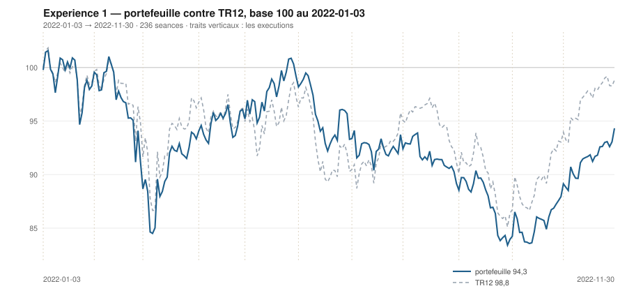

# Novembre 2022

> Journal de l'[expérience 1](../README.md) · **décision au 2022-10-31** · **exécution au 2022-11-01**
> Portefeuille au 2022-11-30 : **9 432,07 €** (base 94,32) · TR12 98,82 · alpha du mois **+1,04 pt** · depuis janvier **-4,50 pt**

---

## 1. Les actualités du mois précédent

**Octobre 2022.** Rebond marqué, aussi net que la chute précédente. Les
résultats du troisième trimestre ressortent globalement meilleurs que redouté, et
la révision à la baisse des bénéfices que le marché anticipait ne se matérialise
pas.

Le 27 octobre, la BCE relève encore ses taux de 75 points de base. Au
Royaume-Uni, le retrait du budget contesté et le changement de gouvernement
apaisent le marché obligataire.

Les stocks de gaz européens sont remplis au-delà des objectifs avant l'hiver, et
le prix du gaz s'effondre depuis son sommet d'août. Le secteur de l'énergie
publie des résultats records, conséquence directe des prix pratiqués depuis le
début de l'année.

---

## 2. L'exposition héritée au 2022-10-31

| Valeur | Achetée le | Prix d'achat | +/− value | Alpha du mois | Alpha global |
|---|---|---|---|---|---|
| `DG.PA` Vinci | 2022-09-01 | 78,54 € | **+1,29 %** | +4,34 pt | -1,94 pt |
| `MC.PA` LVMH | 2022-09-01 | 585,69 € | **+0,60 %** | -3,01 pt | -2,64 pt |
| `ORA.PA` Orange | 2022-03-01 | 8,15 € | **-7,61 %** | -3,55 pt | -9,13 pt |
| `RI.PA` Pernod Ricard | 2022-10-03 | 156,00 € | **-4,08 %** | -11,35 pt *(partiel)* | -11,35 pt |
| `TTE.PA` TotalEnergies | 2022-04-01 | 36,07 € | **+23,21 %** | +6,44 pt | +27,06 pt |

## 3. Le portefeuille depuis le 3 janvier 2022

| | |
|---|---|
| Dotation initiale | 10 000,00 € au 2022-01-03 |
| Titres au 2022-11-30 | 9 282,00 € |
| Espèces | 150,08 € |
| **Total** | **9 432,07 €** |
| Base 100 | **94,32** |
| TR12, même base | 98,82 |
| Écart depuis janvier | **-4,50 pt** |

## 4. L'étude chartiste au 2022-10-31

> Notes rédigées sans aucune séance postérieure au 2022-10-31, par l'agent `chartiste`. Cinq lignes au plus par société.

### 1. `TTE.PA` — TotalEnergies

- Tendance longue strictement nulle au sens du test : pente +0,002 €/séance, p = 0,689, R² = 0,001, IC₉₅ [−0,008 ; +0,011] — sur 120 séances, aucune direction n'est établie.
- Tendance courte haussière et nette : +0,151 €/séance (+0,36 %/séance), R² = 0,659.
- La clôture, 44,44 €, est le plus haut des 120 séances ; position 92,5 %, résidu +2,00 σ_e, exactement à la limite du canal de déviation standard.
- La résistance, à 44,99 €, est quasi horizontale (−0,0005 €/séance) et de portée 102 séances, mais ne compte que deux épisodes (09/06 et 28-31/10) : droite non confirmée, à ne pas lire comme une figure.
- Une clôture au-dessus de 45,0 € porterait le cours au-delà d'une borne qui n'a été testée que deux fois en six mois.

### 2. `MC.PA` — LVMH

- Les deux pentes sont positives : +0,607 €/séance sur 120 séances (+0,105 %/séance), p = 1,7 × 10⁻¹⁰, R² = 0,293 ; +1,277 €/séance sur 20 (+0,218 %/séance), mais p = 0,013 et R² = 0,299 seulement, IC₉₅ [+0,31 ; +2,24] très large.
- Le fait dominant est le resserrement de l'encadrement : la largeur passe de 121,67 € au 30/09 à 53,26 € au 31/10, soit 9,1 % du niveau, la résistance ayant basculé sur une arête descendante (−0,841 €/séance, ancrée au 19/08, portée 49) face à un support ascendant (+0,654).
- La refermeture théorique intervient dans 35,6 séances : le canal est convergent, sa lecture a une date de péremption.
- Clôture 589,19 €, position 60,9 %, après un contact de la résistance les 25-27/10 ; le support compte trois épisodes, la résistance deux.
- Une clôture au-dessus de 610 € sortirait par le haut avant la refermeture ; sinon la convergence tranchera d'elle-même d'ici mi-décembre.

### 3. `ORA.PA` — Orange

- Tendance longue baissière, la plus significative de l'univers : −0,0139 €/séance (−0,172 %/séance), p = 7,0 × 10⁻⁵⁷, R² = 0,883 ; tendance courte haussière, +0,0118 €/séance (+0,16 %/séance), R² = 0,489.
- Clôture 7,528 €, position 95,1 %, sur une résistance à 7,56 € de pente −0,016 €/séance et de portée 85 séances, dont c'est le troisième épisode (29/06-05/07, 12-16/09, 28-31/10).
- Le support, à 6,94 € et de pente −0,010 €/séance, compte trois épisodes également : les deux côtés sont confirmés, et tous deux descendent.
- Le résidu vaut +1,69 σ_e : rebond marqué à l'intérieur d'un canal descendant, sans débordement.
- Une clôture au-dessus de 7,56 € franchirait une résistance à trois épisodes, en contradiction avec une droite longue à R² = 0,88.

### 4. `DG.PA` — Vinci

- Tendance longue nulle : pente −0,005 €/séance, p = 0,573, IC₉₅ [−0,022 ; +0,012] ; tendance courte haussière et très ajustée, +0,498 €/séance (+0,67 %/séance), R² = 0,818.
- Clôture 79,55 €, position 97,4 %, contre une résistance à 79,84 € de pente −0,089 €/séance — mais deux épisodes seulement (12-13/09 et 27-31/10) : la borne haute n'est pas confirmée.
- Le support, à 68,68 €, en compte six (14/06, 22/06, 05/07, 26/09, 03/10, 06-10/10) : la dissymétrie entre les deux côtés est complète.
- Largeur 11,17 €, soit 15,0 % ; le cours a parcouru 2 % à 97 % de la hauteur en dix-sept séances.
- Une clôture au-dessus de 79,8 € franchirait la résistance ; le passage de 2 % à 97 % du canal en trois semaines dit surtout que la largeur retenue est peu contraignante.

### 5. `RI.PA` — Pernod Ricard

- Tendance longue haussière et faible : +0,052 €/séance (+0,034 %/séance), p = 9,7 × 10⁻⁴, R² = 0,088 ; tendance courte baissière et nette, −0,412 €/séance (−0,27 %/séance), R² = 0,480 — signes opposés.
- Encadrement ascendant et divergent : support +0,057 €/séance à 144,34 €, quatre épisodes (16-22/06, 13/10, 21-24/10, 28/10) ; résistance +0,077 €/séance à 170,10 €, trois épisodes ; largeur 25,76 €, soit 16,4 %.
- Clôture 149,64 €, position 20,6 %, avec trois contacts du support en trois semaines — la partie basse du canal est activement testée.
- Le canal ne se referme pas : les deux pentes divergent légèrement, aucune date de péremption.
- Une clôture sous 144,3 € invaliderait un support à quatre épisodes, le seul élément confirmé de la figure.

### 6. `SU.PA` — Schneider Electric

- Tendance longue nulle : pente +0,006 €/séance, p = 0,738 — la droite 120 séances n'apporte rien ; tendance courte haussière, +0,526 €/séance (+0,45 %/séance), R² = 0,636.
- Le support, à 104,17 €, compte six épisodes de contact (22-23/06, 30/06-05/07, 14/07, 21-23/09, 28/09, 03/10) : c'est la structure la mieux installée du panier ce jour.
- La résistance, à 124,62 € et de pente −0,077 €/séance, n'a que deux épisodes (16-19/08, 25-26/10) et n'est pas confirmée.
- Clôture 119,80 €, position 76,5 %, après un pic à 95 % le 26/10 ; largeur 20,45 €, soit 17,9 %.
- Une clôture au-dessus de 124,6 € sortirait par le haut, un retour sous 104,2 € invaliderait un support à six épisodes.

### 7. `SAN.PA` — Sanofi

- Tendance longue baissière, la mieux ajustée du panier : −0,188 €/séance (−0,248 %/séance), p = 3,6 × 10⁻³⁹, R² = 0,767 ; tendance courte haussière, +0,231 €/séance (+0,34 %/séance), R² = 0,675 — signes opposés.
- Le rebond de +9,4 % en vingt séances porte la clôture à 73,32 €, soit +2,46 σ_e au-dessus de la droite ajustée, l'écart le plus grand du panier.
- Position 93,1 % : le cours est sur la résistance, 73,94 €, de pente −0,161 €/séance, dont il constitue le quatrième épisode de contact (18-20/07, 26-29/07, 03-08/08, 28-31/10).
- Deux séances consécutives au-dessus de +2 σ_e (28/10 : +2,1 σ ; 31/10 : +2,5 σ), volume à 1,15 fois la moyenne : débordement naissant du canal de régression, encore trop court pour être qualifié de rupture.
- Une clôture au-dessus de 73,9 € franchirait une résistance à quatre épisodes en contradiction directe avec une droite longue à R² = 0,77.

### 8. `AI.PA` — Air Liquide

- Tendance longue toujours baissière et bien ajustée : −0,153 €/séance (−0,153 %/séance), p = 2,7 × 10⁻²⁴, R² = 0,585 ; tendance courte haussière, +0,595 €/séance (+0,63 %/séance) — signes opposés.
- Clôture 101,48 €, position 92,0 %, sur une résistance à 102,83 € de pente −0,141 €/séance, mais qui ne compte que deux épisodes (06/06 et 25-31/10).
- Débordement le plus net du panier : cinq séances consécutives au-dessus de +2 σ_e, du 25 au 31/10, de +2,2 à +2,6 σ — la persistance est là, mais le volume de la dernière séance ne vaut que 0,82 fois la moyenne 20 séances.
- Le support, à 85,85 €, compte quatre épisodes et reste la seule droite confirmée.
- Une clôture au-dessus de 102,8 € porterait le cours au-dessus d'un encadrement dont les deux droites descendent encore.

### 9. `BNP.PA` — BNP Paribas

- Tendance longue baissière, mieux marquée qu'un mois plus tôt : −0,029 €/séance (−0,078 %/séance), p = 4,4 × 10⁻⁷, R² = 0,195 ; tendance courte haussière et nette, +0,187 €/séance (+0,53 %/séance), R² = 0,687.
- Clôture 36,71 €, position 96,1 % : le cours est sur la résistance à 36,89 €, de pente −0,075 €/séance et de portée 34 séances, dont il forme le troisième épisode (12-15/09, 20/09, 25-31/10).
- Le support, à 32,23 €, compte trois épisodes également ; largeur du canal 4,66 €, soit 13,5 %, en réduction depuis 18,0 % au 30/09.
- Le canal est convergent, refermeture théorique en 54 séances.
- Une clôture au-dessus de 36,9 € franchirait la résistance ; à défaut, le cours reste dans un canal qui se resserre à 0,086 € par séance.

### 10. `AIR.PA` — Airbus

- Les deux horizons s'opposent : pente 120 séances toujours négative, −0,056 €/séance (−0,060 %/séance), p = 2,8 × 10⁻⁴, R² = 0,106 ; pente 20 séances fortement positive, +0,858 €/séance (+0,93 %/séance), R² = 0,919, p = 2,8 × 10⁻¹¹, soit +22,8 % en vingt séances.
- Clôture 101,97 €, position 98,3 % : le cours est collé à la résistance, à 102,35 €, de pente −0,027 €/séance et de portée 110 séances.
- Cette résistance est désormais une structure installée, quatre épisodes : 27-30/05, 06-08/06, 16-17/08 et 28-31/10.
- Le canal de régression déborde par le haut : deux séances au-dessus de +2 σ_e (28/10 à +2,2 σ, 31/10 à +2,1 σ), volume à 1,02 fois la moyenne — débordement court et sans volume, à ne pas compter comme une rupture.
- Une clôture au-dessus de 102,4 € constituerait un franchissement d'une droite à quatre points de contact ; en deçà, le 31/10 reste un contact de plus.

### 11. `OR.PA` — L'Oréal

- La tendance longue est repassée à zéro au sens du test : pente +0,080 €/séance, p = 0,056, IC₉₅ [−0,002 ; +0,162] qui contient zéro — un mois plus tôt elle était déclarée haussière, l'inversion tient à peu.
- Tendance courte baissière et nette : −0,948 €/séance (−0,31 %/séance), R² = 0,635.
- Encadrement convergent (refermeture théorique en 116 séances) : support quasi horizontal à 284,59 €, quatre épisodes (19/05, 25/05, 14-17/06, 25/10) ; résistance −0,330 €/séance à 327,15 €, trois épisodes.
- Clôture 297,59 €, position 30,5 %, dans le tiers bas d'un canal large de 42,56 € (13,9 %).
- Une clôture sous 284,6 € invaliderait un support désormais confirmé par quatre épisodes.

### 12. `CAP.PA` — Capgemini

- Tendance longue baissière et faible : −0,073 €/séance (−0,046 %/séance), p = 9,0 × 10⁻⁴, R² = 0,090 ; tendance courte non significative, p = 0,397, IC₉₅ [−0,211 ; +0,509] à cheval sur zéro — aucune direction courte affirmable.
- Encadrement convergent (refermeture en 78 séances) : support −0,024 €/séance à 138,35 € (trois épisodes), résistance −0,290 €/séance à 159,18 € (quatre épisodes, dont 25-31/10) ; largeur 20,82 €, soit 14,0 %, contre 22,6 % un mois plus tôt.
- Clôture 151,70 €, position 64,1 %, en repli depuis 94 % le 26/10.
- La résistance, à quatre épisodes, est la droite la mieux établie ; elle descend de 0,29 € par séance.
- Une clôture au-dessus de 159,2 € franchirait cette droite ; en deçà, le canal continue de se pincer de 0,27 € par séance.

## 5. Le classement au 2022-10-31

> De la valeur la plus intéressante à détenir à celle qu'il faut fuir. Le détail des cinq composantes est dans le [protocole](../README.md#le-score-en-cinq-composantes).

| Rang | Valeur | `s1` | `s2` | `s3` | `s4` | `s5` | Score | Position | Momentum 12-1 |
|---|---|---|---|---|---|---|---|---|---|
| 1 | `TTE.PA` TotalEnergies | +0 | +1 | +1 | +2 | +0 | **+4** | 92,5 % | +17,4 % |
| 2 | `MC.PA` LVMH | +2 | +1 | +1 | -2 | +0 | **+2** | 60,9 % | -12,3 % |
| 3 | `ORA.PA` Orange | -2 | +1 | +1 | +1 | +0 | **+1** | 95,1 % | +2,6 % |
| 4 | `DG.PA` Vinci | +0 | +1 | +1 | -1 | +0 | **+1** | 97,4 % | -9,2 % |
| 5 | `RI.PA` Pernod Ricard | +2 | -1 | +0 | -1 | +0 | **+0** | 20,6 % | -6,4 % |
| 6 | `SU.PA` Schneider Electric | +0 | +1 | +1 | -2 | +0 | **+0** | 76,5 % | -22,4 % |
| 7 | `SAN.PA` Sanofi | -2 | +1 | +1 | -1 | +0 | **-1** | 93,1 % | -8,0 % |
| 8 | `AI.PA` Air Liquide | -2 | +1 | +1 | -2 | +0 | **-2** | 92,0 % | -12,8 % |
| 9 | `BNP.PA` BNP Paribas | -2 | +1 | +1 | -2 | +0 | **-2** | 96,1 % | -20,5 % |
| 10 | `AIR.PA` Airbus | -2 | +1 | +1 | -2 | +0 | **-2** | 98,3 % | -22,5 % |
| 11 | `OR.PA` L'Oréal | +0 | -1 | +0 | -2 | +0 | **-3** | 30,5 % | -19,2 % |
| 12 | `CAP.PA` Capgemini | -2 | +0 | +1 | -2 | +0 | **-3** | 64,1 % | -21,0 % |

## 6. Les ordres exécutés au 2022-11-01

> À l'**ouverture** de la séance, jamais à la clôture du 2022-10-31.

*Aucun ordre : le classement ne déclenche ni entrée ni sortie.*

## 7. La lecture du mois

Sur le mois, la meilleure contribution vient de `TTE.PA` (TotalEnergies) pour **+184,87 €**, la moins bonne de `ORA.PA` (Orange) pour **+24,95 €**. Aucun ordre, donc aucun frais : l'hystérésis a retenu le portefeuille en l'état. Le portefeuille termine le mois **devant TR12** de 1,04 point.

---

[← Octobre](2022-10.md) · [Protocole](../README.md) · [Décembre →](2022-12.md)
