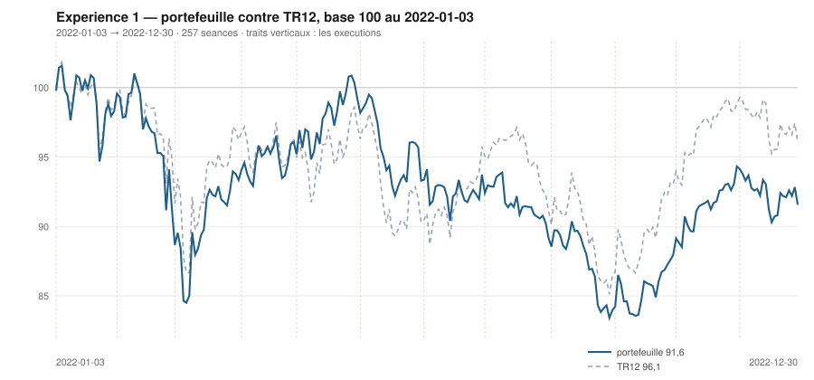

# Décembre 2022

> Journal de l'[expérience 1](../README.md) · **décision au 2022-11-30** · **exécution au 2022-12-01**
> Portefeuille au 2022-12-30 : **9 156,26 €** (base 91,56) · TR12 96,06 · alpha du mois **-0,13 pt** · depuis janvier **-4,50 pt**

---

## 1. Les actualités du mois précédent

**Novembre 2022.** Le 10 novembre, l'inflation américaine ressort nettement
sous les attentes. La séance qui suit est l'une des plus fortes de l'année sur
les indices occidentaux, et le mouvement se prolonge : les marchés européens
signent un deuxième mois de hausse consécutif.

En Chine, les premières inflexions de la politique zéro-Covid apparaissent après
des manifestations inhabituelles, ce qui soutient nettement les valeurs exposées
à la consommation chinoise — le luxe au premier chef.

L'euro repasse au-dessus de la parité. Le débat porte désormais sur le rythme du
ralentissement des hausses de taux, plus que sur leur poursuite.

---

## 2. L'exposition héritée au 2022-11-30

| Valeur | Achetée le | Prix d'achat | +/− value | Alpha du mois | Alpha global |
|---|---|---|---|---|---|
| `DG.PA` Vinci | 2022-09-01 | 78,54 € | **+6,15 %** | -1,42 pt | -3,50 pt |
| `MC.PA` LVMH | 2022-09-01 | 585,69 € | **+16,07 %** | +9,17 pt | +6,42 pt |
| `ORA.PA` Orange | 2022-03-01 | 8,15 € | **-6,29 %** | -4,79 pt | -14,12 pt |
| `RI.PA` Pernod Ricard | 2022-10-03 | 156,00 € | **+3,39 %** | +1,57 pt | -10,56 pt |
| `TTE.PA` TotalEnergies | 2022-04-01 | 36,07 € | **+34,86 %** | +3,24 pt | +32,73 pt |

## 3. Le portefeuille depuis le 3 janvier 2022

| | |
|---|---|
| Dotation initiale | 10 000,00 € au 2022-01-03 |
| Titres au 2022-12-30 | 9 006,18 € |
| Espèces | 150,08 € |
| **Total** | **9 156,26 €** |
| Base 100 | **91,56** |
| TR12, même base | 96,06 |
| Écart depuis janvier | **-4,50 pt** |

## 4. L'étude chartiste au 2022-11-30

> Notes rédigées sans aucune séance postérieure au 2022-11-30, par l'agent `chartiste`. Cinq lignes au plus par société.

### 1. `TTE.PA` — TotalEnergies

- Tendance longue haussière et solide : +0,063 €/séance (+0,153 %/séance), p = 4,2 × 10⁻²⁵, R² = 0,598 ; tendance courte haussière mais fragile, +0,071 €/séance, p = 0,017, R² = 0,280, et le retrait de la seule séance du 30/11 la ramène à +0,045 — conclusion courte suspendue à un point.
- La clôture, 48,64 €, est le plus haut des 120 séances et se pose sur la résistance (48,74 €, pente +0,055, portée 119, quatre épisodes) ; position 95,9 %.
- Le support, +0,199 €/séance à 46,16 €, monte plus vite que la résistance : canal convergent, refermeture en 17,9 séances, largeur réduite à 2,58 €, soit 5,4 %.
- Volume à 1,85 fois la moyenne 20 séances, résidu +1,92 σ_e — juste sous le seuil de débordement.
- Une clôture au-dessus de 48,7 € franchirait la résistance ; sinon le pincement résoudra la figure avant fin décembre.

### 2. `DG.PA` — Vinci

- Les deux horizons sont haussiers et confirmés : +0,047 €/séance sur 120 séances (+0,061 %/séance), p = 1,9 × 10⁻⁶, R² = 0,175 ; +0,181 €/séance sur 20 (+0,22 %/séance), R² = 0,822.
- C'est le seul dossier du panier dont les deux bornes sont installées : support à 68,21 € avec cinq épisodes, résistance à 84,08 € (pente +0,022) avec cinq épisodes également, dont un contact long du 21 au 30/11.
- Clôture 83,37 €, position 95,5 %, contre la borne haute depuis le 21/11 ; largeur 15,88 €, soit 20,9 %, canal légèrement divergent, sans date de péremption.
- Volume à 1,96 fois la moyenne 20 séances, résidu +0,97 σ_e : aucune sortie du canal de régression.
- Une clôture au-dessus de 84,1 € franchirait une résistance à cinq épisodes, la mieux documentée de l'univers ce jour.

### 3. `MC.PA` — LVMH

- Les deux horizons concordent à la hausse : +0,611 €/séance sur 120 séances (+0,103 %/séance), p = 1,2 × 10⁻¹⁰, R² = 0,298 ; +3,037 €/séance sur 20 (+0,48 %/séance), R² = 0,645.
- La clôture, 679,83 €, est le plus haut des 120 séances et se pose exactement sur la résistance (679,83 €), droite ascendante de +0,360 €/séance et de portée 74 séances, dont c'est le troisième épisode (04-08/08, 11-19/08, 30/11) — position 100,0 %.
- Le support, +0,654 €/séance à 571,14 €, compte trois épisodes ; largeur 108,69 €, soit 17,4 %.
- Le volume du 30/11 vaut 3,85 fois la moyenne 20 séances, le plus élevé du panier ce jour ; le résidu est de +1,54 σ_e, donc encore à l'intérieur du canal de régression.
- Une clôture au-dessus de 679,8 € constituerait un franchissement d'une résistance à trois épisodes ; en deçà, le 30/11 n'est qu'un contact de plus.

### 4. `ORA.PA` — Orange

- Tendance longue baissière et fortement ajustée : −0,0098 €/séance (−0,125 %/séance), p = 6,3 × 10⁻²⁹, R² = 0,654 ; tendance courte haussière, +0,0071 €/séance (+0,09 %/séance), R² = 0,499 — signes opposés.
- Clôture 7,636 €, position 86,4 %, contre une résistance à 7,78 € de pente −0,011 €/séance et de portée 104 séances, mais qui ne compte que deux épisodes (29/06-04/07 et 21-30/11) : droite non confirmée.
- Le support, à 6,72 € et de pente −0,010 €/séance, compte quatre épisodes ; les deux droites descendent presque parallèlement, largeur 1,06 € soit 14,6 %.
- Volume à 2,46 fois la moyenne 20 séances, le plus élevé du panier ce jour ; résidu +1,42 σ_e, sans débordement.
- Une clôture au-dessus de 7,78 € porterait le cours au-dessus d'une borne testée seulement deux fois en six mois, dans une tendance longue qui reste baissière à R² = 0,65.

### 5. `AIR.PA` — Airbus

- Retournement du verdict long : la pente 120 séances passe à +0,093 €/séance (+0,099 %/séance), p = 1,7 × 10⁻⁷, R² = 0,207, après deux mois de verdict baissier ; la pente courte n'est plus significative, p = 0,053, IC₉₅ [−0,276 ; +0,002].
- L'encadrement s'est effondré en largeur : 8,23 €, soit 7,8 % du niveau, contre 24,7 % au 31/10, avec un support ascendant de +0,482 €/séance (portée 40, deux épisodes) et une résistance de +0,074 (trois épisodes).
- Refermeture théorique en 20,2 séances : la figure a une date de péremption courte.
- Clôture 101,62 €, position 10,7 %, après un décrochage brutal — de 78 % le 22/11 à 1 % le 28/11, soit toute la hauteur du canal en trois séances.
- Une clôture sous 100,7 € romprait un support qui ne repose que sur deux épisodes ; à défaut, la convergence tranchera avant fin décembre.

### 6. `RI.PA` — Pernod Ricard

- Tendance longue haussière mais à la limite du bruit : +0,032 €/séance (+0,021 %/séance), p = 0,035, R² = 0,037, IC₉₅ [+0,002 ; +0,062] dont la borne basse frôle zéro ; tendance courte nette, +0,510 €/séance (+0,33 %/séance), R² = 0,753.
- Clôture 161,28 €, position 99,2 %, sur une résistance à 161,41 € de pente −0,055 €/séance, dont c'est le troisième épisode (08-22/08, 13/09, 24-30/11).
- Le support, +0,057 €/séance à 145,59 €, compte quatre épisodes : canal convergent, refermeture théorique en 142 séances, largeur 15,82 € soit 10,3 %.
- Volume à 2,02 fois la moyenne 20 séances, résidu +0,79 σ_e — le cours est sur sa borne haute sans excès par rapport à la droite ajustée.
- Une clôture au-dessus de 161,4 € franchirait une résistance à trois épisodes, jamais dépassée depuis août.

### 7. `SU.PA` — Schneider Electric

- Les deux horizons sont haussiers : +0,138 €/séance sur 120 séances (+0,118 %/séance), p = 5,8 × 10⁻¹², R² = 0,332 ; +0,461 €/séance sur 20 (+0,36 %/séance), R² = 0,485.
- Encadrement légèrement divergent, sans date de péremption : support +0,015 €/séance à 104,50 € (quatre épisodes), résistance +0,081 €/séance à 134,77 € (quatre épisodes) ; largeur 30,27 €, soit 25,3 % — le canal le plus large du panier.
- Clôture 129,76 €, position 83,4 % : le cours longe la résistance depuis le 10/11 sans la franchir, épisode de contact de treize séances.
- Volume à 1,99 fois la moyenne 20 séances ; aucun débordement au-delà de 2 σ_e sur les 120 séances.
- Une clôture au-dessus de 134,8 € franchirait une résistance à quatre épisodes, longée sans succès depuis trois semaines.

### 8. `BNP.PA` — BNP Paribas

- Retournement du verdict long : la pente 120 séances passe à +0,032 €/séance (+0,087 %/séance), p = 3,4 × 10⁻⁸, R² = 0,228 ; la pente courte est nette, +0,147 €/séance (+0,37 %/séance), R² = 0,846.
- L'encadrement n'a plus de contenu : largeur 0,85 €, soit 2,1 % du niveau, avec un support de +0,256 €/séance contre une résistance de +0,028 — refermeture théorique en 3,7 séances.
- La position affichée, 43,6 %, ne distingue rien dans un canal de 2,1 % : la lire comme un milieu de canal serait une erreur de mesure.
- La résistance compte quatre épisodes (21-23/06, 12-17/08, 18-21/11, 24-30/11), le support deux seulement.
- La configuration impose une sortie mécanique de l'encadrement sous quatre séances, dans un sens ou dans l'autre.

### 9. `SAN.PA` — Sanofi

- Tendance longue toujours baissière et bien ajustée, mais moins pentue qu'au 31/10 : −0,121 €/séance (−0,165 %/séance) contre −0,188, p = 1,2 × 10⁻¹⁶, R² = 0,443 ; tendance courte non significative, p = 0,383.
- Clôture 72,61 €, position 77,0 %, sous une résistance à 74,77 € de pente −0,112 €/séance qui compte six épisodes de contact — la droite la plus confirmée du dossier, dont le dernier épisode court du 25 au 30/11.
- Le support, à 65,35 €, en compte trois ; largeur 9,42 €, soit 13,5 %, canal convergent avec refermeture théorique en 74,7 séances.
- Volume à 2,24 fois la moyenne 20 séances, résidu +1,31 σ_e : pas de débordement du canal de régression.
- Une clôture au-dessus de 74,8 € franchirait une résistance à six épisodes, ce que quatre mois de séances n'ont pas fait.

### 10. `CAP.PA` — Capgemini

- Tendance longue non significative : pente −0,013 €/séance, p = 0,573, IC₉₅ [−0,057 ; +0,032] ; tendance courte haussière mais fragile, +0,707 €/séance (+0,44 %/séance), p = 0,006, R² = 0,350, et +0,876 si l'on retire la dernière séance.
- Encadrement : support −0,024 €/séance à 137,84 € (trois épisodes), résistance −0,131 €/séance à 165,68 € (trois épisodes, dont 11-17/11 et 24-28/11) ; largeur 27,85 €, soit 18,3 %, refermeture théorique lointaine (260 séances).
- Clôture 156,03 €, position 65,3 %, en repli depuis 96 % le 15/11 — deux contacts hauts manqués en trois semaines.
- Volume à 2,34 fois la moyenne 20 séances ; aucun débordement au-delà de 2 σ_e sur la fenêtre.
- Une clôture au-dessus de 165,7 € franchirait une résistance descendante testée trois fois ; un retour sous 137,8 € invaliderait le support.

### 11. `OR.PA` — L'Oréal

- Tendance longue non significative : pente −0,061 €/séance, p = 0,119, IC₉₅ [−0,137 ; +0,016] ; tendance courte haussière et nette, +1,805 €/séance (+0,57 %/séance), R² = 0,704, soit +15,2 % en vingt séances.
- Clôture 331,92 €, position 96,9 %, sur une résistance à 333,53 € de pente −0,175 €/séance, dont c'est le quatrième épisode (29/07-02/08, 05/08, 19/08, 28-30/11) : structure installée.
- Le support, quasi horizontal à 281,36 €, compte trois épisodes ; largeur 52,17 €, soit 17,0 %.
- Volume à 1,65 fois la moyenne 20 séances ; résidu +1,26 σ_e, sans débordement du canal de régression.
- Une clôture au-dessus de 333,5 € franchirait une résistance testée quatre fois en quatre mois.

### 12. `AI.PA` — Air Liquide

- Tendance longue non significative : pente +0,009 €/séance, p = 0,491, IC₉₅ [−0,017 ; +0,036] ; tendance courte haussière et bien ajustée, +0,312 €/séance (+0,30 %/séance), R² = 0,719.
- L'encadrement est en fermeture rapide : largeur 3,11 €, soit 2,9 % du niveau, support de +0,537 €/séance contre une résistance de +0,039 — refermeture théorique en 6,2 séances.
- Clôture 106,02 €, position 0,0 % : le cours est exactement sur le support ascendant, deux séances après un contact de la résistance (24-29/11).
- Les deux droites comptent quatre épisodes chacune, mais un canal de 2,9 % de largeur ne discrimine plus grand-chose.
- La convergence force une résolution en une semaine et demie de bourse ; une clôture sous 106,0 € la produirait par le bas.

## 5. Le classement au 2022-11-30

> De la valeur la plus intéressante à détenir à celle qu'il faut fuir. Le détail des cinq composantes est dans le [protocole](../README.md#le-score-en-cinq-composantes).

| Rang | Valeur | `s1` | `s2` | `s3` | `s4` | `s5` | Score | Position | Momentum 12-1 |
|---|---|---|---|---|---|---|---|---|---|
| 1 | `TTE.PA` TotalEnergies | +2 | +1 | +1 | +2 | +0 | **+6** | 95,9 % | +36,1 % |
| 2 | `DG.PA` Vinci | +2 | +1 | +1 | +2 | +0 | **+6** | 95,5 % | +11,9 % |
| 3 | `MC.PA` LVMH | +2 | +1 | +1 | -1 | +0 | **+3** | 100,0 % | -7,9 % |
| 4 | `ORA.PA` Orange | -2 | +1 | +1 | +2 | +0 | **+2** | 86,4 % | +13,3 % |
| 5 | `AIR.PA` Airbus | +2 | +0 | -1 | +1 | +0 | **+2** | 10,7 % | +8,2 % |
| 6 | `RI.PA` Pernod Ricard | +2 | +1 | +1 | -2 | +0 | **+2** | 99,2 % | -14,0 % |
| 7 | `SU.PA` Schneider Electric | +2 | +1 | +1 | -2 | +0 | **+2** | 83,4 % | -20,9 % |
| 8 | `BNP.PA` BNP Paribas | +2 | +1 | +0 | -2 | +0 | **+1** | 43,6 % | -10,6 % |
| 9 | `SAN.PA` Sanofi | -2 | +0 | +1 | +1 | +0 | **+0** | 77,0 % | +7,4 % |
| 10 | `CAP.PA` Capgemini | +0 | +1 | +1 | -2 | +0 | **+0** | 65,3 % | -18,4 % |
| 11 | `OR.PA` L'Oréal | +0 | +1 | +1 | -2 | +0 | **+0** | 96,9 % | -23,1 % |
| 12 | `AI.PA` Air Liquide | +0 | +1 | -1 | -1 | +0 | **-1** | 0,0 % | -4,7 % |

## 6. Les ordres exécutés au 2022-12-01

> À l'**ouverture** de la séance, jamais à la clôture du 2022-11-30.

*Aucun ordre : le classement ne déclenche ni entrée ni sortie.*

## 7. La lecture du mois

Sur le mois, la meilleure contribution vient de `TTE.PA` (TotalEnergies) pour **-22,87 €**, la moins bonne de `MC.PA` (LVMH) pour **-97,29 €**. Aucun ordre, donc aucun frais : l'hystérésis a retenu le portefeuille en l'état. Le portefeuille termine le mois **derrière TR12** de 0,13 point.

---

L'expérience s'arrête ici. Le compte complet de l'année — mois par mois, position par position, avec ce que la rotation a coûté — est dans le **[bilan de l'année](../bilan-2022.md)**.

---

[← Novembre](2022-11.md) · [Protocole](../README.md)
