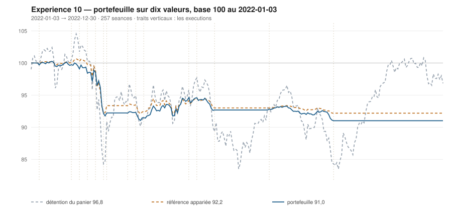

# 2022

> Journal de l'[expérience 10](../README.md) · 257 séances · **18 ordres** sur dix valeurs
> Portefeuille au 2022-12-30 : **9 101,42 €** (base 91,01) · appariée 92,19 · détention du panier 96,85

---

## Le portefeuille depuis le 2022-01-03

| | |
|---|---|
| Valeur au 1er jour de l'année | 10 000,00 € |
| Valeur au 2022-12-30 | **9 101,42 €** |
| Variation de l'année | **-8,99 %** |
| Espèces · titres | 9 101,42 € · 0,00 € |
| Part investie moyenne de l'année | 11,22 % |
| Lignes ouvertes au 2022-12-30 | 0 sur 10 |
| Coupes de la règle 7 dans l'année | **4** |

## Les ordres

| Exécution | Décision | Valeur | Sens | Rang | Quantité | Prix réel | Frais | Motif |
|---|---|---|---|---|---|---|---|---|
| 2022-01-10 | 2022-01-07 | `CAP.PA` | **ACHAT** | 1 | 5 | 180,43 € | 3,74 € | CAP.PA : clôture 180,16 sous le bord bas 183,51 (-1,46 s), TAUX_20 +0,181 %/séance |
| 2022-02-07 | 2022-02-04 | `MC.PA` | **ACHAT** | 1 | 1 | 647,22 € | 2,69 € | MC.PA : clôture 643,66 sous le bord bas 645,75 (-1,10 s), TAUX_20 +0,180 %/séance |
| 2022-02-14 | 2022-02-11 | `MC.PA` | **RENFORT** | 1 | 3 | 613,30 € | 7,64 € | MC.PA : renforcement, clôture 624,43 encore sous le bord bas (-1,92 s), TAUX_20 +0,226 %/séance |
| 2022-02-21 | 2022-02-18 | `CAP.PA` | **REGLE-4** | 1 | 5 | 168,59 € | 3,50 € | CAP.PA : clôture 167,42 sous le seuil de la règle 4 (-1,85 s dans la bande) |
| 2022-02-28 | 2022-02-25 | `MC.PA` | **REGLE-4** | 1 | 1 | 593,16 € | 2,46 € | MC.PA : clôture 607,65 sous le seuil de la règle 4 (-1,87 s dans la bande) |
| 2022-03-07 | 2022-03-04 | `MC.PA` | **REGLE-7** | 0 | 5 | 505,01 € | 2,90 € | MC.PA : clôture 526,71 sous le seuil de repli 550,13, soit −15 % du prix de la première tranche |
| 2022-03-09 | 2022-03-08 | `CAP.PA` | **REGLE-7** | 0 | 10 | 154,77 € | 1,78 € | CAP.PA : clôture 149,95 sous le seuil de repli 153,36, soit −15 % du prix de la première tranche |
| 2022-03-28 | 2022-03-25 | `ENGI.PA` | **ACHAT** | 1 | 115 | 7,97 € | 3,81 € | ENGI.PA : clôture 7,97 sous le bord bas 8,22 (-1,38 s), TAUX_20 +0,017 %/séance |
| 2022-04-04 | 2022-04-01 | `PUB.PA` | **ACHAT** | 1 | 20 | 44,71 € | 3,71 € | PUB.PA : clôture 44,62 sous le bord bas 45,02 (-1,18 s), TAUX_20 +0,427 %/séance |
| 2022-04-04 | 2022-04-01 | `SGO.PA` | **ACHAT** | 2 | 19 | 47,05 € | 3,71 € | SGO.PA : clôture 46,76 sous le bord bas 46,86 (-1,04 s), TAUX_20 +0,299 %/séance |
| 2022-04-11 | 2022-04-08 | `TTE.PA` | **ACHAT** | 1 | 25 | 35,81 € | 3,72 € | TTE.PA : clôture 35,83 sous le bord bas 36,20 (-1,19 s), TAUX_20 +0,108 %/séance |
| 2022-05-23 | 2022-05-20 | `ENGI.PA` | **VENTE** | 1 | 115 | 9,33 € | 1,23 € | ENGI.PA : clôture 9,19 au-dessus du bord haut 8,68 (+1,86 s) |
| 2022-05-23 | 2022-05-20 | `TTE.PA` | **VENTE** | 2 | 25 | 41,19 € | 1,18 € | TTE.PA : clôture 40,57 au-dessus du bord haut 40,49 (+1,04 s) |
| 2022-05-30 | 2022-05-27 | `SGO.PA` | **VENTE** | 1 | 19 | 47,97 € | 1,05 € | SGO.PA : clôture 47,74 au-dessus du bord haut 47,28 (+1,18 s) |
| 2022-05-30 | 2022-05-27 | `PUB.PA` | **REGLE-4** | 1 | 22 | 42,14 € | 3,85 € | PUB.PA : clôture 41,93 sous le seuil de la règle 4 (-0,94 s dans la bande) |
| 2022-06-14 | 2022-06-13 | `PUB.PA` | **REGLE-7** | 0 | 42 | 37,72 € | 1,82 € | PUB.PA : clôture 37,51 sous le seuil de repli 38,01, soit −15 % du prix de la première tranche |
| 2022-08-01 | 2022-07-29 | `AC.PA` | **ACHAT** | 1 | 41 | 22,37 € | 3,81 € | AC.PA : clôture 22,44 sous le bord bas 22,64 (-1,12 s), TAUX_20 +0,267 %/séance |
| 2022-09-26 | 2022-09-23 | `AC.PA` | **REGLE-7** | 0 | 41 | 18,40 € | 0,87 € | AC.PA : clôture 18,61 sous le seuil de repli 19,02, soit −15 % du prix de la première tranche |

## Ce que la règle 7 a coupé cette année

| Valeur | Achat | Coupée le | Réalisé | Le même achat, sans la règle 7 |
|---|---|---|---|---|
| `CAP.PA` | 2022-01-10 | 2022-03-09 | -11,31 % | vente au 2022-04-04, **+3,86 %** |
| `MC.PA` | 2022-02-07 | 2022-03-07 | -18,03 % | vente au 2022-06-06, **-8,15 %** |
| `PUB.PA` | 2022-04-04 | 2022-06-14 | -13,01 % | vente au 2022-07-25, **-1,21 %** |
| `AC.PA` | 2022-08-01 | 2022-09-26 | -17,78 % | vente au 2022-10-31, **+5,79 %** |

## Les positions touchant l'année

| Valeur | Achat | Sortie | Motif | Tr. | Titres | Prix moyen | Sortie | +/− value | Repli / 1re | Contribution | Séances |
|---|---|---|---|---|---|---|---|---|---|---|---|
| `CAP.PA` | 2022-01-10 | 2022-03-09 | REGLE-7 | 2 | 10 | 174,51 € | 154,77 € | **-11,31 %** | -16,89 % | -206,42 € | 43 |
| `MC.PA` | 2022-02-07 | 2022-03-07 | REGLE-7 | 3 | 5 | 616,06 € | 505,01 € | **-18,03 %** | -20,03 % | -570,92 € | 21 |
| `ENGI.PA` | 2022-03-28 | 2022-05-23 | VENTE | 1 | 115 | 7,97 € | 9,33 € | **+16,96 %** | -2,98 % | +150,49 € | 39 |
| `PUB.PA` | 2022-04-04 | 2022-06-14 | REGLE-7 | 2 | 42 | 43,37 € | 37,72 € | **-13,01 %** | -16,50 % | -246,32 € | 50 |
| `SGO.PA` | 2022-04-04 | 2022-05-30 | VENTE | 1 | 19 | 47,05 € | 47,97 € | **+1,95 %** | -8,12 % | +12,67 € | 39 |
| `TTE.PA` | 2022-04-11 | 2022-05-23 | VENTE | 1 | 25 | 35,81 € | 41,19 € | **+15,03 %** | -3,53 % | +129,67 € | 29 |
| `AC.PA` | 2022-08-01 | 2022-09-26 | REGLE-7 | 1 | 41 | 22,37 € | 18,40 € | **-17,78 %** | -16,83 % | -167,74 € | 41 |

## Les décisions de l'année

| Mesure | Valeur |
|---|---|
| Décisions hebdomadaires | 52 |
| Évaluations, dix valeurs | 520 |
| Sous le bord bas | 91 |
| … dont `TAUX_20 ≥ 0`, donc achetables | **9** |
| Au-dessus du bord haut | 124 |

## La lecture de l'année

Le portefeuille termine l'année à 9 101,42 €, soit -8,99 % sur l'année. Les 18 ordres ont porté sur 7 valeurs — AC.PA, CAP.PA, ENGI.PA, MC.PA, PUB.PA, SGO.PA, TTE.PA — pour 53,46 € de frais. La règle 7 a coupé 4 lignes, dont 0 l'a été à bon escient. Depuis le début, le portefeuille est derrière sa référence à exposition appariée de 1,17 point.

---

[Protocole](../README.md) · [2023 →](2023.md)
