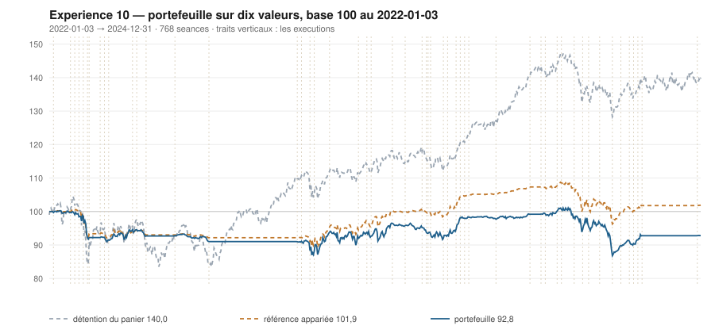

# 2024

> Journal de l'[expérience 10](../README.md) · 256 séances · **28 ordres** sur dix valeurs
> Portefeuille au 2024-12-31 : **9 281,78 €** (base 92,82) · appariée 101,90 · détention du panier 139,99

---

## Le portefeuille depuis le 2022-01-03

| | |
|---|---|
| Valeur au 1er jour de l'année | 9 832,05 € |
| Valeur au 2024-12-31 | **9 281,78 €** |
| Variation de l'année | **-5,60 %** |
| Espèces · titres | 8 387,02 € · 894,76 € |
| Part investie moyenne de l'année | 35,08 % |
| Lignes ouvertes au 2024-12-31 | 1 sur 10 |
| Coupes de la règle 7 dans l'année | **2** |

## Les ordres

| Exécution | Décision | Valeur | Sens | Rang | Quantité | Prix réel | Frais | Motif |
|---|---|---|---|---|---|---|---|---|
| 2024-01-22 | 2024-01-19 | `TTE.PA` | **REGLE-4** | 1 | 19 | 50,98 € | 4,02 € | TTE.PA : clôture 50,89 sous le seuil de la règle 4 (-2,18 s dans la bande) |
| 2024-03-18 | 2024-03-15 | `TTE.PA` | **VENTE** | 1 | 37 | 54,56 € | 2,32 € | TTE.PA : clôture 54,56 au-dessus du bord haut 52,94 (+2,73 s) |
| 2024-04-08 | 2024-04-05 | `PUB.PA` | **ACHAT** | 1 | 11 | 88,96 € | 4,06 € | PUB.PA : clôture 89,14 sous le bord bas 89,72 (-1,29 s), TAUX_20 +0,285 %/séance |
| 2024-04-15 | 2024-04-12 | `AIR.PA` | **ACHAT** | 1 | 6 | 154,96 € | 1,07 € | AIR.PA : clôture 153,75 sous le bord bas 154,21 (-1,14 s), TAUX_20 +0,007 %/séance |
| 2024-04-15 | 2024-04-12 | `SGO.PA` | **ACHAT** | 2 | 14 | 66,78 € | 3,88 € | SGO.PA : clôture 66,45 sous le bord bas 66,54 (-1,05 s), TAUX_20 +0,295 %/séance |
| 2024-05-06 | 2024-05-03 | `SGO.PA` | **VENTE** | 1 | 14 | 71,97 € | 1,16 € | SGO.PA : clôture 71,81 au-dessus du bord haut 70,67 (+1,63 s) |
| 2024-05-06 | 2024-05-03 | `AIR.PA` | **REGLE-4** | 1 | 6 | 148,48 € | 1,02 € | AIR.PA : clôture 148,21 sous le seuil de la règle 4 (-2,58 s dans la bande) |
| 2024-05-06 | 2024-05-03 | `AC.PA` | **ACHAT** | 2 | 26 | 37,79 € | 4,08 € | AC.PA : clôture 37,65 sous le bord bas 38,54 (-1,79 s), TAUX_20 +0,031 %/séance |
| 2024-05-06 | 2024-05-03 | `SAF.PA` | **ACHAT** | 3 | 4 | 199,99 € | 3,32 € | SAF.PA : clôture 199,80 sous le bord bas 200,83 (-1,19 s), TAUX_20 +0,004 %/séance |
| 2024-05-13 | 2024-05-10 | `AC.PA` | **RENFORT** | 1 | 52 | 38,10 € | 8,22 € | AC.PA : renforcement, clôture 38,02 encore sous le bord bas (-1,45 s), TAUX_20 +0,248 %/séance |
| 2024-05-13 | 2024-05-10 | `CAP.PA` | **ACHAT** | 2 | 5 | 191,93 € | 3,98 € | CAP.PA : clôture 191,37 sous le bord bas 194,04 (-1,27 s), TAUX_20 +0,010 %/séance |
| 2024-06-03 | 2024-05-31 | `CAP.PA` | **REGLE-4** | 1 | 5 | 177,28 € | 3,68 € | CAP.PA : clôture 175,77 sous le seuil de la règle 4 (-2,41 s dans la bande) |
| 2024-06-17 | 2024-06-14 | `PUB.PA` | **REGLE-4** | 1 | 10 | 87,67 € | 3,64 € | PUB.PA : clôture 86,92 sous le seuil de la règle 4 (-3,72 s dans la bande) |
| 2024-06-17 | 2024-06-14 | `SAF.PA` | **REGLE-4** | 2 | 3 | 193,66 € | 2,41 € | SAF.PA : clôture 192,30 sous le seuil de la règle 4 (-3,64 s dans la bande) |
| 2024-06-17 | 2024-06-14 | `AC.PA` | **REGLE-4** | 3 | 2 | 35,26 € | 0,29 € | AC.PA : clôture 35,00 sous le seuil de la règle 4 (-2,59 s dans la bande) |
| 2024-06-26 | 2024-06-25 | `AIR.PA` | **REGLE-7** | 0 | 12 | 129,77 € | 1,79 € | AIR.PA : clôture 129,43 sous le seuil de repli 131,72, soit −15 % du prix de la première tranche |
| 2024-07-15 | 2024-07-12 | `ENGI.PA` | **ACHAT** | 1 | 78 | 12,25 € | 3,96 € | ENGI.PA : clôture 12,31 sous le bord bas 12,37 (-1,08 s), TAUX_20 +0,371 %/séance |
| 2024-07-15 | 2024-07-12 | `TTE.PA` | **ACHAT** | 2 | 10 | 56,78 € | 2,36 € | TTE.PA : clôture 56,81 sous le bord bas 56,91 (-1,04 s), TAUX_20 +0,222 %/séance |
| 2024-08-05 | 2024-08-02 | `AC.PA` | **REGLE-7** | 0 | 80 | 30,35 € | 2,79 € | AC.PA : clôture 31,24 sous le seuil de repli 32,12, soit −15 % du prix de la première tranche |
| 2024-08-19 | 2024-08-16 | `ENGI.PA` | **VENTE** | 1 | 78 | 13,67 € | 1,23 € | ENGI.PA : clôture 13,64 au-dessus du bord haut 13,54 (+1,16 s) |
| 2024-09-02 | 2024-08-30 | `CAP.PA` | **VENTE** | 1 | 10 | 177,66 € | 2,04 € | CAP.PA : clôture 177,57 au-dessus du bord haut 174,22 (+1,62 s) |
| 2024-09-09 | 2024-09-06 | `SGO.PA` | **ACHAT** | 1 | 12 | 71,49 € | 3,56 € | SGO.PA : clôture 71,22 sous le bord bas 71,56 (-1,12 s), TAUX_20 +0,243 %/séance |
| 2024-09-09 | 2024-09-06 | `TTE.PA` | **REGLE-4** | 2 | 16 | 53,94 € | 3,58 € | TTE.PA : clôture 53,55 sous le seuil de la règle 4 (-0,79 s dans la bande) |
| 2024-09-16 | 2024-09-13 | `SAF.PA` | **VENTE** | 1 | 7 | 198,02 € | 1,59 € | SAF.PA : clôture 198,80 au-dessus du bord haut 195,92 (+1,62 s) |
| 2024-09-23 | 2024-09-20 | `TTE.PA` | **VENTE** | 1 | 26 | 55,98 € | 1,67 € | TTE.PA : clôture 55,46 au-dessus du bord haut 54,94 (+1,48 s) |
| 2024-09-23 | 2024-09-20 | `PUB.PA` | **VENTE** | 2 | 21 | 91,49 € | 2,21 € | PUB.PA : clôture 91,36 au-dessus du bord haut 90,10 (+1,52 s) |
| 2024-09-23 | 2024-09-20 | `SGO.PA` | **VENTE** | 3 | 12 | 78,68 € | 1,09 € | SGO.PA : clôture 79,14 au-dessus du bord haut 77,57 (+1,56 s) |
| 2024-12-23 | 2024-12-20 | `SGO.PA` | **ACHAT** | 1 | 11 | 80,62 € | 3,68 € | SGO.PA : clôture 80,92 sous le bord bas 82,14 (-1,57 s), TAUX_20 +0,081 %/séance |

## Ce que la règle 7 a coupé cette année

| Valeur | Achat | Coupée le | Réalisé | Le même achat, sans la règle 7 |
|---|---|---|---|---|
| `AIR.PA` | 2024-04-15 | 2024-06-26 | -14,47 % | vente au 2024-08-26, **-10,85 %** |
| `AC.PA` | 2024-05-06 | 2024-08-05 | -19,99 % | vente au 2024-09-02, **-3,35 %** |

## Les positions touchant l'année

| Valeur | Achat | Sortie | Motif | Tr. | Titres | Prix moyen | Sortie | +/− value | Repli / 1re | Contribution | Séances |
|---|---|---|---|---|---|---|---|---|---|---|---|
| `TTE.PA` | 2023-12-04 | 2024-03-18 | VENTE | 2 | 37 | 51,97 € | 54,56 € | **+4,98 %** | -4,88 % | +85,51 € | 73 |
| `PUB.PA` | 2024-04-08 | 2024-09-23 | VENTE | 2 | 21 | 88,34 € | 91,49 € | **+3,56 %** | -7,93 % | +56,21 € | 120 |
| `AIR.PA` | 2024-04-15 | 2024-06-26 | REGLE-7 | 2 | 12 | 151,72 € | 129,77 € | **-14,47 %** | -18,83 % | -267,25 € | 52 |
| `SGO.PA` | 2024-04-15 | 2024-05-06 | VENTE | 1 | 14 | 66,78 € | 71,97 € | **+7,78 %** | -2,77 % | +67,67 € | 15 |
| `AC.PA` | 2024-05-06 | 2024-08-05 | REGLE-7 | 3 | 80 | 37,93 € | 30,35 € | **-19,99 %** | -18,79 % | -621,78 € | 66 |
| `SAF.PA` | 2024-05-06 | 2024-09-16 | VENTE | 2 | 7 | 197,28 € | 198,02 € | **+0,37 %** | -7,69 % | -2,18 € | 96 |
| `CAP.PA` | 2024-05-13 | 2024-09-02 | VENTE | 2 | 10 | 184,60 € | 177,66 € | **-3,76 %** | -13,65 % | -79,15 € | 81 |
| `ENGI.PA` | 2024-07-15 | 2024-08-19 | VENTE | 1 | 78 | 12,25 € | 13,67 € | **+11,63 %** | -0,50 % | +105,92 € | 26 |
| `TTE.PA` | 2024-07-15 | 2024-09-23 | VENTE | 2 | 26 | 55,03 € | 55,98 € | **+1,73 %** | -6,68 % | +17,20 € | 51 |
| `SGO.PA` | 2024-09-09 | 2024-09-23 | VENTE | 1 | 12 | 71,49 € | 78,68 € | **+10,06 %** | +2,02 % | +81,69 € | 11 |
| `SGO.PA` | 2024-12-23 | 2025-02-10 | VENTE | 1 | 11 | 80,62 € | 88,76 € | **+10,10 %** | -1,46 % | +84,78 € | 33 |

## Les décisions de l'année

| Mesure | Valeur |
|---|---|
| Décisions hebdomadaires | 52 |
| Évaluations, dix valeurs | 520 |
| Sous le bord bas | 149 |
| … dont `TAUX_20 ≥ 0`, donc achetables | **24** |
| Au-dessus du bord haut | 145 |

## La lecture de l'année

Le portefeuille termine l'année à 9 281,78 €, soit -5,60 % sur l'année. Les 28 ordres ont porté sur 8 valeurs — AC.PA, AIR.PA, CAP.PA, ENGI.PA, PUB.PA, SAF.PA, SGO.PA, TTE.PA — pour 78,71 € de frais. La règle 7 a coupé 2 lignes, dont 0 l'a été à bon escient. Depuis le début, le portefeuille est derrière sa référence à exposition appariée de 9,09 point.

---

[← 2023](2023.md) · [Protocole](../README.md) · [2025 →](2025.md)
