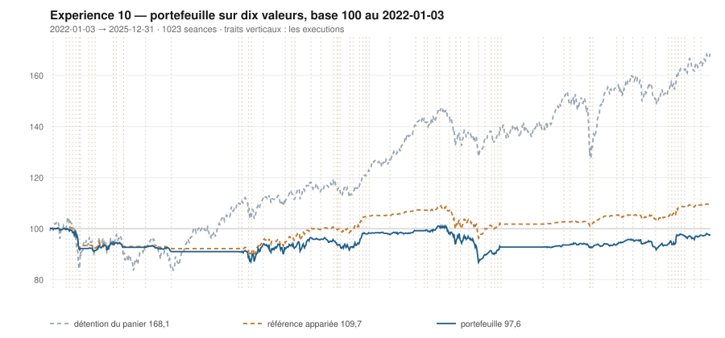

# 2025

> Journal de l'[expérience 10](../README.md) · 255 séances · **23 ordres** sur dix valeurs
> Portefeuille au 2025-12-31 : **9 757,62 €** (base 97,58) · appariée 109,70 · détention du panier 168,09

---

## Le portefeuille depuis le 2022-01-03

| | |
|---|---|
| Valeur au 1er jour de l'année | 9 281,78 € |
| Valeur au 2025-12-31 | **9 757,62 €** |
| Variation de l'année | **+5,13 %** |
| Espèces · titres | 7 993,05 € · 1 764,57 € |
| Part investie moyenne de l'année | 25,36 % |
| Lignes ouvertes au 2025-12-31 | 1 sur 10 |
| Coupes de la règle 7 dans l'année | **1** |

## Les ordres

| Exécution | Décision | Valeur | Sens | Rang | Quantité | Prix réel | Frais | Motif |
|---|---|---|---|---|---|---|---|---|
| 2025-02-10 | 2025-02-07 | `SGO.PA` | **VENTE** | 1 | 11 | 88,76 € | 1,12 € | SGO.PA : clôture 88,82 au-dessus du bord haut 87,73 (+1,51 s) |
| 2025-02-24 | 2025-02-21 | `AIR.PA` | **ACHAT** | 1 | 6 | 154,85 € | 1,07 € | AIR.PA : clôture 153,64 sous le bord bas 159,65 (-2,49 s), TAUX_20 +0,035 %/séance |
| 2025-04-07 | 2025-04-04 | `AIR.PA` | **REGLE-4** | 1 | 7 | 126,97 € | 1,02 € | AIR.PA : clôture 141,06 sous le seuil de la règle 4 (-4,72 s dans la bande) |
| 2025-04-07 | 2025-04-04 | `TTE.PA` | **ACHAT** | 2 | 20 | 46,20 € | 3,83 € | TTE.PA : clôture 49,46 sous le bord bas 50,91 (-1,67 s), TAUX_20 +0,202 %/séance |
| 2025-04-08 | 2025-04-07 | `AIR.PA` | **REGLE-7** | 0 | 13 | 133,86 € | 2,00 € | AIR.PA : clôture 131,37 sous le seuil de repli 131,63, soit −15 % du prix de la première tranche |
| 2025-04-14 | 2025-04-11 | `TTE.PA` | **REGLE-4** | 1 | 19 | 46,27 € | 3,65 € | TTE.PA : clôture 45,36 sous le seuil de la règle 4 (-2,84 s dans la bande) |
| 2025-06-09 | 2025-06-06 | `EN.PA` | **ACHAT** | 1 | 25 | 36,57 € | 3,79 € | EN.PA : clôture 36,53 sous le bord bas 37,17 (-1,79 s), TAUX_20 +0,015 %/séance |
| 2025-06-23 | 2025-06-20 | `TTE.PA` | **VENTE** | 1 | 39 | 52,16 € | 2,34 € | TTE.PA : clôture 51,75 au-dessus du bord haut 51,21 (+1,23 s) |
| 2025-06-23 | 2025-06-20 | `EN.PA` | **REGLE-4** | 1 | 26 | 35,25 € | 3,80 € | EN.PA : clôture 35,53 sous le seuil de la règle 4 (-2,92 s dans la bande) |
| 2025-07-14 | 2025-07-11 | `ENGI.PA` | **ACHAT** | 1 | 50 | 18,81 € | 3,90 € | ENGI.PA : clôture 18,73 sous le bord bas 19,09 (-2,16 s), TAUX_20 +0,015 %/séance |
| 2025-08-04 | 2025-08-01 | `ENGI.PA` | **REGLE-4** | 1 | 51 | 18,22 € | 3,86 € | ENGI.PA : clôture 18,22 sous le seuil de la règle 4 (-3,11 s dans la bande) |
| 2025-09-01 | 2025-08-29 | `CAP.PA` | **ACHAT** | 1 | 7 | 117,86 € | 3,42 € | CAP.PA : clôture 117,67 sous le bord bas 118,94 (-1,14 s), TAUX_20 +0,021 %/séance |
| 2025-09-29 | 2025-09-26 | `SGO.PA` | **ACHAT** | 1 | 10 | 89,03 € | 3,69 € | SGO.PA : clôture 88,58 sous le bord bas 89,29 (-1,15 s), TAUX_20 +0,044 %/séance |
| 2025-10-06 | 2025-10-03 | `TTE.PA` | **ACHAT** | 1 | 19 | 49,32 € | 3,89 € | TTE.PA : clôture 49,15 sous le bord bas 49,42 (-1,29 s), TAUX_20 +0,023 %/séance |
| 2025-10-13 | 2025-10-10 | `TTE.PA` | **REGLE-4** | 1 | 19 | 48,36 € | 3,81 € | TTE.PA : clôture 48,13 sous le seuil de la règle 4 (-2,06 s dans la bande) |
| 2025-10-20 | 2025-10-17 | `ENGI.PA` | **VENTE** | 1 | 101 | 18,66 € | 2,17 € | ENGI.PA : clôture 18,71 au-dessus du bord haut 18,28 (+1,66 s) |
| 2025-10-20 | 2025-10-17 | `EN.PA` | **VENTE** | 2 | 51 | 39,59 € | 2,32 € | EN.PA : clôture 39,59 au-dessus du bord haut 37,33 (+3,24 s) |
| 2025-10-20 | 2025-10-17 | `CAP.PA` | **VENTE** | 3 | 7 | 119,12 € | 0,96 € | CAP.PA : clôture 117,91 au-dessus du bord haut 117,80 (+1,02 s) |
| 2025-10-20 | 2025-10-17 | `SAF.PA` | **ACHAT** | 1 | 3 | 299,34 € | 3,73 € | SAF.PA : clôture 293,60 sous le bord bas 293,75 (-1,03 s), TAUX_20 +0,116 %/séance |
| 2025-10-27 | 2025-10-24 | `TTE.PA` | **VENTE** | 1 | 38 | 51,79 € | 2,26 € | TTE.PA : clôture 51,89 au-dessus du bord haut 51,10 (+1,82 s) |
| 2025-11-03 | 2025-10-31 | `SGO.PA` | **REGLE-4** | 1 | 11 | 81,40 € | 3,72 € | SGO.PA : clôture 81,56 sous le seuil de la règle 4 (-2,24 s dans la bande) |
| 2025-11-24 | 2025-11-21 | `SAF.PA` | **REGLE-4** | 1 | 3 | 286,18 € | 3,56 € | SAF.PA : clôture 286,18 sous le seuil de la règle 4 (-3,29 s dans la bande) |
| 2025-12-08 | 2025-12-05 | `SGO.PA` | **VENTE** | 1 | 21 | 83,81 € | 2,02 € | SGO.PA : clôture 84,16 au-dessus du bord haut 82,99 (+1,44 s) |

## Ce que la règle 7 a coupé cette année

| Valeur | Achat | Coupée le | Réalisé | Le même achat, sans la règle 7 |
|---|---|---|---|---|
| `AIR.PA` | 2025-02-24 | 2025-04-08 | -4,27 % | vente au 2025-06-23, **+16,80 %** |

## Les positions touchant l'année

| Valeur | Achat | Sortie | Motif | Tr. | Titres | Prix moyen | Sortie | +/− value | Repli / 1re | Contribution | Séances |
|---|---|---|---|---|---|---|---|---|---|---|---|
| `SGO.PA` | 2024-12-23 | 2025-02-10 | VENTE | 1 | 11 | 80,62 € | 88,76 € | **+10,10 %** | -1,46 % | +84,78 € | 33 |
| `AIR.PA` | 2025-02-24 | 2025-04-08 | REGLE-7 | 2 | 13 | 139,84 € | 133,86 € | **-4,27 %** | -15,17 % | -81,78 € | 32 |
| `TTE.PA` | 2025-04-07 | 2025-06-23 | VENTE | 2 | 39 | 46,23 € | 52,16 € | **+12,82 %** | -2,64 % | +221,26 € | 53 |
| `EN.PA` | 2025-06-09 | 2025-10-20 | VENTE | 2 | 51 | 35,89 € | 39,59 € | **+10,30 %** | -6,53 % | +178,62 € | 96 |
| `ENGI.PA` | 2025-07-14 | 2025-10-20 | VENTE | 2 | 101 | 18,51 € | 18,66 € | **+0,81 %** | -12,17 % | +5,27 € | 71 |
| `CAP.PA` | 2025-09-01 | 2025-10-20 | VENTE | 1 | 7 | 117,86 € | 119,12 € | **+1,07 %** | -2,92 % | +4,43 € | 36 |
| `SGO.PA` | 2025-09-29 | 2025-12-08 | VENTE | 2 | 21 | 85,03 € | 83,81 € | **-1,44 %** | -13,06 % | -35,17 € | 51 |
| `TTE.PA` | 2025-10-06 | 2025-10-27 | VENTE | 2 | 38 | 48,84 € | 51,79 € | **+6,03 %** | -2,72 % | +101,96 € | 16 |
| `SAF.PA` | 2025-10-20 | 2026-01-12 | VENTE | 2 | 6 | 292,76 € | 313,08 € | **+6,94 %** | -6,67 % | +112,48 € | 58 |

## Les décisions de l'année

| Mesure | Valeur |
|---|---|
| Décisions hebdomadaires | 52 |
| Évaluations, dix valeurs | 520 |
| Sous le bord bas | 120 |
| … dont `TAUX_20 ≥ 0`, donc achetables | **15** |
| Au-dessus du bord haut | 157 |

## La lecture de l'année

Le portefeuille termine l'année à 9 757,62 €, soit +5,13 % sur l'année. Les 23 ordres ont porté sur 7 valeurs — AIR.PA, CAP.PA, EN.PA, ENGI.PA, SAF.PA, SGO.PA, TTE.PA — pour 65,96 € de frais. La règle 7 a coupé 1 ligne, dont 0 l'a été à bon escient. Depuis le début, le portefeuille est derrière sa référence à exposition appariée de 12,13 point.

---

[← 2024](2024.md) · [Protocole](../README.md) · [2026 →](2026.md)
