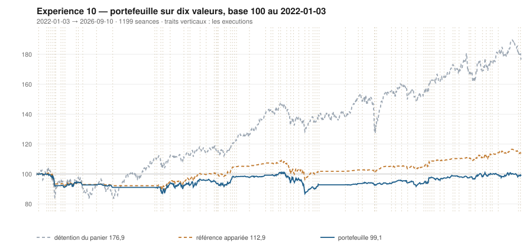

# 2026

> Journal de l'[expérience 10](../README.md) · 176 séances · **15 ordres** sur dix valeurs
> Portefeuille au 2026-09-10 : **9 913,90 €** (base 99,14) · appariée 112,90 · détention du panier 176,91

---

## Le portefeuille depuis le 2022-01-03

| | |
|---|---|
| Valeur au 1er jour de l'année | 9 757,62 € |
| Valeur au 2026-09-10 | **9 913,90 €** |
| Variation de l'année | **+1,60 %** |
| Espèces · titres | 3 992,39 € · 5 921,51 € |
| Part investie moyenne de l'année | 32,82 % |
| Lignes ouvertes au 2026-09-10 | 3 sur 10 |
| Coupes de la règle 7 dans l'année | **1** |

## Les ordres

| Exécution | Décision | Valeur | Sens | Rang | Quantité | Prix réel | Frais | Motif |
|---|---|---|---|---|---|---|---|---|
| 2026-01-12 | 2026-01-09 | `SAF.PA` | **VENTE** | 1 | 6 | 313,08 € | 2,16 € | SAF.PA : clôture 313,77 au-dessus du bord haut 309,73 (+1,53 s) |
| 2026-01-19 | 2026-01-16 | `MC.PA` | **ACHAT** | 1 | 1 | 575,61 € | 2,39 € | MC.PA : clôture 599,43 sous le bord bas 640,27 (-2,89 s), TAUX_20 +0,010 %/séance |
| 2026-02-02 | 2026-01-30 | `MC.PA` | **REGLE-4** | 1 | 1 | 538,22 € | 2,23 € | MC.PA : clôture 538,13 sous le seuil de la règle 4 (-3,13 s dans la bande) |
| 2026-03-09 | 2026-03-06 | `EN.PA` | **ACHAT** | 1 | 21 | 45,62 € | 3,98 € | EN.PA : clôture 46,91 sous le bord bas 47,23 (-1,29 s), TAUX_20 +0,191 %/séance |
| 2026-03-09 | 2026-03-06 | `ENGI.PA` | **ACHAT** | 2 | 39 | 24,49 € | 3,96 € | ENGI.PA : clôture 25,08 sous le bord bas 25,24 (-1,25 s), TAUX_20 +0,295 %/séance |
| 2026-03-09 | 2026-03-06 | `CAP.PA` | **ACHAT** | 3 | 9 | 105,60 € | 3,94 € | CAP.PA : clôture 106,33 sous le bord bas 106,72 (-1,03 s), TAUX_20 +0,005 %/séance |
| 2026-03-13 | 2026-03-12 | `MC.PA` | **REGLE-7** | 0 | 2 | 481,35 € | 1,11 € | MC.PA : clôture 487,06 sous le seuil de repli 489,27, soit −15 % du prix de la première tranche |
| 2026-03-30 | 2026-03-27 | `CAP.PA` | **REGLE-4** | 1 | 10 | 93,03 € | 3,86 € | CAP.PA : clôture 93,20 sous le seuil de la règle 4 (-1,04 s dans la bande) |
| 2026-04-27 | 2026-04-24 | `SAF.PA` | **ACHAT** | 1 | 3 | 268,88 € | 3,35 € | SAF.PA : clôture 267,00 sous le bord bas 287,26 (-2,20 s), TAUX_20 +0,070 %/séance |
| 2026-05-11 | 2026-05-08 | `TTE.PA` | **ACHAT** | 1 | 13 | 75,56 € | 4,08 € | TTE.PA : clôture 74,87 sous le bord bas 75,89 (-1,34 s), TAUX_20 +0,015 %/séance |
| 2026-05-25 | 2026-05-22 | `CAP.PA` | **VENTE** | 1 | 19 | 100,95 € | 2,21 € | CAP.PA : clôture 99,89 au-dessus du bord haut 96,14 (+1,41 s) |
| 2026-06-01 | 2026-05-29 | `SAF.PA` | **VENTE** | 1 | 3 | 302,50 € | 1,04 € | SAF.PA : clôture 305,70 au-dessus du bord haut 304,95 (+1,04 s) |
| 2026-06-22 | 2026-06-19 | `TTE.PA` | **REGLE-4** | 1 | 14 | 70,50 € | 4,10 € | TTE.PA : clôture 70,19 sous le seuil de la règle 4 (-2,77 s dans la bande) |
| 2026-08-31 | 2026-08-28 | `EN.PA` | **REGLE-4** | 1 | 22 | 44,10 € | 4,03 € | EN.PA : clôture 44,08 sous le seuil de la règle 4 (-2,39 s dans la bande) |
| 2026-09-08 | 2026-09-04 | `ENGI.PA` | **REGLE-4** | 1 | 40 | 24,18 € | 4,01 € | ENGI.PA : clôture 24,01 sous le seuil de la règle 4 (-2,37 s dans la bande) |

## Ce que la règle 7 a coupé cette année

| Valeur | Achat | Coupée le | Réalisé | Le même achat, sans la règle 7 |
|---|---|---|---|---|
| `MC.PA` | 2026-01-19 | 2026-03-13 | -13,57 % | vente au 2026-05-11, **-15,54 %** — *bonne coupe* |

## Les positions touchant l'année

| Valeur | Achat | Sortie | Motif | Tr. | Titres | Prix moyen | Sortie | +/− value | Repli / 1re | Contribution | Séances |
|---|---|---|---|---|---|---|---|---|---|---|---|
| `SAF.PA` | 2025-10-20 | 2026-01-12 | VENTE | 2 | 6 | 292,76 € | 313,08 € | **+6,94 %** | -6,67 % | +112,48 € | 58 |
| `MC.PA` | 2026-01-19 | 2026-03-13 | REGLE-7 | 2 | 2 | 556,92 € | 481,35 € | **-13,57 %** | -19,03 % | -156,87 € | 40 |
| `EN.PA` | 2026-03-09 | 2026-09-10 *(ouverte)* | ouverte | 2 | 43 | 44,84 € | 43,85 € | **-2,21 %** | -3,87 % | -50,58 € | 130 |
| `ENGI.PA` | 2026-03-09 | 2026-09-10 *(ouverte)* | ouverte | 2 | 79 | 24,33 € | 24,30 € | **-0,14 %** | -2,87 % | -10,74 € | 130 |
| `CAP.PA` | 2026-03-09 | 2026-05-25 | VENTE | 2 | 19 | 98,98 € | 100,95 € | **+1,99 %** | -11,74 % | +27,39 € | 53 |
| `SAF.PA` | 2026-04-27 | 2026-06-01 | VENTE | 1 | 3 | 268,88 € | 302,50 € | **+12,50 %** | -2,46 % | +96,47 € | 25 |
| `TTE.PA` | 2026-05-11 | 2026-09-10 *(ouverte)* | ouverte | 2 | 27 | 72,94 € | 78,38 € | **+7,47 %** | -12,76 % | +138,84 € | 88 |

## Les décisions de l'année

| Mesure | Valeur |
|---|---|
| Décisions hebdomadaires | 37 |
| Évaluations, dix valeurs | 370 |
| Sous le bord bas | 115 |
| … dont `TAUX_20 ≥ 0`, donc achetables | **19** |
| Au-dessus du bord haut | 99 |

## La lecture de l'année

Le portefeuille termine l'année à 9 913,90 €, soit +1,60 % sur l'année. Les 15 ordres ont porté sur 6 valeurs — CAP.PA, EN.PA, ENGI.PA, MC.PA, SAF.PA, TTE.PA — pour 46,44 € de frais. La règle 7 a coupé 1 ligne, dont 1 l'a été à bon escient. 3 positions restent ouvertes : EN.PA (-2,21 %), ENGI.PA (-0,14 %), TTE.PA (+7,47 %). Depuis le début, le portefeuille est derrière sa référence à exposition appariée de 13,77 point.

---

[← 2025](2025.md) · [Protocole](../README.md)
