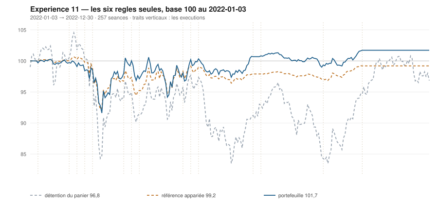

# 2022

> Journal de l'[expérience 11](../README.md) · 257 séances · **19 ordres** sur dix valeurs
> Portefeuille au 2022-12-30 : **10 171,73 €** (base 101,72) · appariée 99,21 · détention du panier 96,85

---

## Le portefeuille depuis le 2022-01-03

| | |
|---|---|
| Valeur au 1er jour de l'année | 10 000,00 € |
| Valeur au 2022-12-30 | **10 171,73 €** |
| Variation de l'année | **+1,72 %** |
| Espèces · titres | 10 171,73 € · 0,00 € |
| Part investie moyenne de l'année | 23,30 % |
| Lignes ouvertes au 2022-12-30 | 0 sur 10 |

## Les ordres

| Exécution | Décision | Valeur | Sens | Rang | Quantité | Prix réel | Frais | Motif |
|---|---|---|---|---|---|---|---|---|
| 2022-01-10 | 2022-01-07 | `CAP.PA` | **ACHAT** | 1 | 5 | 180,43 € | 3,74 € | CAP.PA : clôture 180,16 sous le bord bas 183,51 (-1,46 s), TAUX_20 +0,181 %/séance |
| 2022-02-07 | 2022-02-04 | `MC.PA` | **ACHAT** | 1 | 1 | 647,22 € | 2,69 € | MC.PA : clôture 643,66 sous le bord bas 645,75 (-1,10 s), TAUX_20 +0,180 %/séance |
| 2022-02-14 | 2022-02-11 | `MC.PA` | **RENFORT** | 1 | 3 | 613,30 € | 7,64 € | MC.PA : renforcement, clôture 624,43 encore sous le bord bas (-1,92 s), TAUX_20 +0,226 %/séance |
| 2022-02-21 | 2022-02-18 | `CAP.PA` | **REGLE-4** | 1 | 5 | 168,59 € | 3,50 € | CAP.PA : clôture 167,42 sous le seuil de la règle 4 (-1,85 s dans la bande) |
| 2022-02-28 | 2022-02-25 | `MC.PA` | **REGLE-4** | 1 | 1 | 593,16 € | 2,46 € | MC.PA : clôture 607,65 sous le seuil de la règle 4 (-1,87 s dans la bande) |
| 2022-03-28 | 2022-03-25 | `ENGI.PA` | **ACHAT** | 1 | 121 | 7,97 € | 4,00 € | ENGI.PA : clôture 7,97 sous le bord bas 8,22 (-1,38 s), TAUX_20 +0,017 %/séance |
| 2022-04-04 | 2022-04-01 | `CAP.PA` | **VENTE** | 1 | 10 | 181,24 € | 2,08 € | CAP.PA : clôture 179,93 au-dessus du bord haut 178,49 (+1,16 s) |
| 2022-04-04 | 2022-04-01 | `PUB.PA` | **ACHAT** | 1 | 22 | 44,71 € | 4,08 € | PUB.PA : clôture 44,62 sous le bord bas 45,02 (-1,18 s), TAUX_20 +0,427 %/séance |
| 2022-04-04 | 2022-04-01 | `SGO.PA` | **ACHAT** | 2 | 20 | 47,05 € | 3,91 € | SGO.PA : clôture 46,76 sous le bord bas 46,86 (-1,04 s), TAUX_20 +0,299 %/séance |
| 2022-04-11 | 2022-04-08 | `TTE.PA` | **ACHAT** | 1 | 27 | 35,81 € | 4,01 € | TTE.PA : clôture 35,83 sous le bord bas 36,20 (-1,19 s), TAUX_20 +0,108 %/séance |
| 2022-05-23 | 2022-05-20 | `ENGI.PA` | **VENTE** | 1 | 121 | 9,33 € | 1,30 € | ENGI.PA : clôture 9,19 au-dessus du bord haut 8,68 (+1,86 s) |
| 2022-05-23 | 2022-05-20 | `TTE.PA` | **VENTE** | 2 | 27 | 41,19 € | 1,28 € | TTE.PA : clôture 40,57 au-dessus du bord haut 40,49 (+1,04 s) |
| 2022-05-30 | 2022-05-27 | `SGO.PA` | **VENTE** | 1 | 20 | 47,97 € | 1,10 € | SGO.PA : clôture 47,74 au-dessus du bord haut 47,28 (+1,18 s) |
| 2022-05-30 | 2022-05-27 | `PUB.PA` | **REGLE-4** | 1 | 23 | 42,14 € | 4,02 € | PUB.PA : clôture 41,93 sous le seuil de la règle 4 (-0,94 s dans la bande) |
| 2022-06-06 | 2022-06-03 | `MC.PA` | **VENTE** | 1 | 5 | 565,87 € | 3,25 € | MC.PA : clôture 561,62 au-dessus du bord haut 548,40 (+1,51 s) |
| 2022-07-25 | 2022-07-22 | `PUB.PA` | **VENTE** | 1 | 45 | 42,87 € | 2,22 € | PUB.PA : clôture 42,92 au-dessus du bord haut 39,39 (+2,54 s) |
| 2022-08-01 | 2022-07-29 | `AC.PA` | **ACHAT** | 1 | 44 | 22,37 € | 4,09 € | AC.PA : clôture 22,44 sous le bord bas 22,64 (-1,12 s), TAUX_20 +0,267 %/séance |
| 2022-09-26 | 2022-09-23 | `AC.PA` | **REGLE-4** | 1 | 53 | 18,40 € | 4,05 € | AC.PA : clôture 18,61 sous le seuil de la règle 4 (-2,15 s dans la bande) |
| 2022-10-31 | 2022-10-28 | `AC.PA` | **VENTE** | 1 | 97 | 21,37 € | 2,38 € | AC.PA : clôture 21,25 au-dessus du bord haut 19,87 (+2,43 s) |

## Les positions touchant l'année

| Valeur | Achat | Sortie | Motif | Tr. | Titres | Prix moyen | Sortie | +/− value | Repli / 1re | Contribution | Séances |
|---|---|---|---|---|---|---|---|---|---|---|---|
| `CAP.PA` | 2022-01-10 | 2022-04-04 | VENTE | 2 | 10 | 174,51 € | 181,24 € | **+3,86 %** | -16,89 % | +57,97 € | 61 |
| `MC.PA` | 2022-02-07 | 2022-06-06 | VENTE | 3 | 5 | 616,06 € | 565,87 € | **-8,15 %** | -22,70 % | -267,00 € | 84 |
| `ENGI.PA` | 2022-03-28 | 2022-05-23 | VENTE | 1 | 121 | 7,97 € | 9,33 € | **+16,96 %** | -2,98 % | +158,34 € | 39 |
| `PUB.PA` | 2022-04-04 | 2022-07-25 | VENTE | 2 | 45 | 43,40 € | 42,87 € | **-1,21 %** | -20,70 % | -33,93 € | 79 |
| `SGO.PA` | 2022-04-04 | 2022-05-30 | VENTE | 1 | 20 | 47,05 € | 47,97 € | **+1,95 %** | -8,12 % | +13,34 € | 39 |
| `TTE.PA` | 2022-04-11 | 2022-05-23 | VENTE | 1 | 27 | 35,81 € | 41,19 € | **+15,03 %** | -3,53 % | +140,04 € | 29 |
| `AC.PA` | 2022-08-01 | 2022-10-31 | VENTE | 2 | 97 | 20,20 € | 21,37 € | **+5,79 %** | -16,83 % | +102,97 € | 66 |

## Les décisions de l'année

| Mesure | Valeur |
|---|---|
| Décisions hebdomadaires | 52 |
| Évaluations, dix valeurs | 520 |
| Sous le bord bas | 91 |
| … dont `TAUX_20 ≥ 0`, donc achetables | **9** |
| Au-dessus du bord haut | 124 |

## La lecture de l'année

Le portefeuille termine l'année à 10 171,73 €, soit +1,72 % sur l'année. Les 19 ordres ont porté sur 7 valeurs — AC.PA, CAP.PA, ENGI.PA, MC.PA, PUB.PA, SGO.PA, TTE.PA — pour 61,80 € de frais. Depuis le début, le portefeuille est devant sa référence à exposition appariée de 2,51 point.

---

[Protocole](../README.md) · [2023 →](2023.md)
