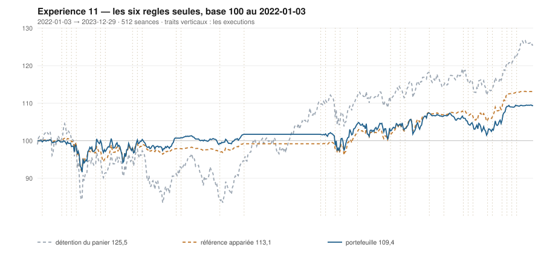

# 2023

> Journal de l'[expérience 11](../README.md) · 255 séances · **32 ordres** sur dix valeurs
> Portefeuille au 2023-12-29 : **10 937,65 €** (base 109,38) · appariée 113,06 · détention du panier 125,50

---

## Le portefeuille depuis le 2022-01-03

| | |
|---|---|
| Valeur au 1er jour de l'année | 10 171,73 € |
| Valeur au 2023-12-29 | **10 937,65 €** |
| Variation de l'année | **+7,53 %** |
| Espèces · titres | 9 874,81 € · 1 062,84 € |
| Part investie moyenne de l'année | 47,96 % |
| Lignes ouvertes au 2023-12-29 | 1 sur 10 |

## Les ordres

| Exécution | Décision | Valeur | Sens | Rang | Quantité | Prix réel | Frais | Motif |
|---|---|---|---|---|---|---|---|---|
| 2023-02-20 | 2023-02-17 | `TTE.PA` | **ACHAT** | 1 | 20 | 48,97 € | 4,06 € | TTE.PA : clôture 48,70 sous le bord bas 49,09 (-1,24 s), TAUX_20 +0,119 %/séance |
| 2023-02-27 | 2023-02-24 | `MC.PA` | **ACHAT** | 1 | 1 | 731,82 € | 3,04 € | MC.PA : clôture 721,61 sous le bord bas 734,95 (-1,58 s), TAUX_20 +0,005 %/séance |
| 2023-02-27 | 2023-02-24 | `TTE.PA` | **RENFORT** | 2 | 41 | 48,76 € | 8,30 € | TTE.PA : renforcement, clôture 48,31 encore sous le bord bas (-1,55 s), TAUX_20 +0,284 %/séance |
| 2023-03-13 | 2023-03-10 | `SAF.PA` | **ACHAT** | 1 | 7 | 128,13 € | 3,72 € | SAF.PA : clôture 127,92 sous le bord bas 129,80 (-1,62 s), TAUX_20 +0,090 %/séance |
| 2023-03-13 | 2023-03-10 | `SGO.PA` | **ACHAT** | 2 | 20 | 49,58 € | 4,11 € | SGO.PA : clôture 49,57 sous le bord bas 49,99 (-1,33 s), TAUX_20 +0,477 %/séance |
| 2023-03-20 | 2023-03-17 | `SGO.PA` | **REGLE-4** | 1 | 21 | 45,43 € | 3,96 € | SGO.PA : clôture 45,54 sous le seuil de la règle 4 (-3,46 s dans la bande) |
| 2023-03-20 | 2023-03-17 | `TTE.PA` | **REGLE-4** | 2 | 22 | 43,24 € | 3,95 € | TTE.PA : clôture 44,12 sous le seuil de la règle 4 (-3,19 s dans la bande) |
| 2023-03-20 | 2023-03-17 | `SAF.PA` | **REGLE-4** | 3 | 7 | 122,51 € | 3,56 € | SAF.PA : clôture 123,07 sous le seuil de la règle 4 (-2,92 s dans la bande) |
| 2023-04-17 | 2023-04-14 | `MC.PA` | **VENTE** | 1 | 1 | 829,48 € | 0,95 € | MC.PA : clôture 828,83 au-dessus du bord haut 819,37 (+1,41 s) |
| 2023-06-05 | 2023-06-02 | `PUB.PA` | **ACHAT** | 1 | 16 | 60,59 € | 4,02 € | PUB.PA : clôture 60,47 sous le bord bas 60,75 (-1,07 s), TAUX_20 +0,026 %/séance |
| 2023-06-19 | 2023-06-16 | `SGO.PA` | **VENTE** | 1 | 41 | 51,69 € | 2,44 € | SGO.PA : clôture 51,93 au-dessus du bord haut 50,56 (+1,64 s) |
| 2023-06-26 | 2023-06-23 | `ENGI.PA` | **ACHAT** | 1 | 90 | 11,36 € | 4,24 € | ENGI.PA : clôture 11,28 sous le bord bas 11,51 (-1,67 s), TAUX_20 +0,089 %/séance |
| 2023-06-26 | 2023-06-23 | `MC.PA` | **ACHAT** | 2 | 1 | 783,20 € | 3,25 € | MC.PA : clôture 776,65 sous le bord bas 788,04 (-1,44 s), TAUX_20 +0,179 %/séance |
| 2023-07-31 | 2023-07-28 | `TTE.PA` | **VENTE** | 1 | 83 | 46,47 € | 4,44 € | TTE.PA : clôture 46,41 au-dessus du bord haut 46,08 (+1,24 s) |
| 2023-07-31 | 2023-07-28 | `SAF.PA` | **VENTE** | 2 | 14 | 145,80 € | 2,35 € | SAF.PA : clôture 145,65 au-dessus du bord haut 140,56 (+2,85 s) |
| 2023-07-31 | 2023-07-28 | `PUB.PA` | **VENTE** | 3 | 16 | 65,21 € | 1,20 € | PUB.PA : clôture 65,44 au-dessus du bord haut 64,09 (+1,70 s) |
| 2023-08-21 | 2023-08-18 | `MC.PA` | **REGLE-4** | 1 | 1 | 727,16 € | 3,02 € | MC.PA : clôture 726,88 sous le seuil de la règle 4 (-2,13 s dans la bande) |
| 2023-09-18 | 2023-09-15 | `AIR.PA` | **ACHAT** | 1 | 8 | 124,02 € | 1,14 € | AIR.PA : clôture 123,94 sous le bord bas 124,34 (-1,17 s), TAUX_20 +0,115 %/séance |
| 2023-09-25 | 2023-09-22 | `AIR.PA` | **REGLE-4** | 1 | 8 | 116,85 € | 1,07 € | AIR.PA : clôture 116,92 sous le seuil de la règle 4 (-3,41 s dans la bande) |
| 2023-09-25 | 2023-09-22 | `AC.PA` | **ACHAT** | 2 | 34 | 30,10 € | 4,25 € | AC.PA : clôture 30,25 sous le bord bas 30,93 (-1,93 s), TAUX_20 +0,149 %/séance |
| 2023-10-02 | 2023-09-29 | `AC.PA` | **REGLE-4** | 1 | 35 | 29,38 € | 4,27 € | AC.PA : clôture 29,29 sous le seuil de la règle 4 (-2,64 s dans la bande) |
| 2023-10-23 | 2023-10-20 | `SAF.PA` | **ACHAT** | 1 | 7 | 140,69 € | 4,09 € | SAF.PA : clôture 140,31 sous le bord bas 142,97 (-1,94 s), TAUX_20 +0,086 %/séance |
| 2023-10-23 | 2023-10-20 | `PUB.PA` | **ACHAT** | 2 | 15 | 63,61 € | 3,96 € | PUB.PA : clôture 63,91 sous le bord bas 64,39 (-1,36 s), TAUX_20 +0,361 %/séance |
| 2023-10-30 | 2023-10-27 | `SAF.PA` | **RENFORT** | 1 | 14 | 143,38 € | 8,33 € | SAF.PA : renforcement, clôture 141,97 encore sous le bord bas (-1,36 s), TAUX_20 +0,094 %/séance |
| 2023-11-13 | 2023-11-10 | `PUB.PA` | **REGLE-4** | 1 | 2 | 62,65 € | 0,52 € | PUB.PA : clôture 62,56 sous le seuil de la règle 4 (-1,94 s dans la bande) |
| 2023-11-20 | 2023-11-17 | `ENGI.PA` | **VENTE** | 1 | 90 | 12,44 € | 1,29 € | ENGI.PA : clôture 12,47 au-dessus du bord haut 12,31 (+1,55 s) |
| 2023-11-20 | 2023-11-17 | `SAF.PA` | **VENTE** | 2 | 21 | 155,15 € | 3,75 € | SAF.PA : clôture 155,43 au-dessus du bord haut 151,45 (+2,34 s) |
| 2023-11-20 | 2023-11-17 | `AIR.PA` | **VENTE** | 3 | 16 | 125,25 € | 2,30 € | AIR.PA : clôture 124,83 au-dessus du bord haut 123,00 (+1,60 s) |
| 2023-11-20 | 2023-11-17 | `MC.PA` | **VENTE** | 4 | 2 | 666,90 € | 1,53 € | MC.PA : clôture 665,78 au-dessus du bord haut 650,78 (+1,58 s) |
| 2023-11-27 | 2023-11-24 | `PUB.PA` | **VENTE** | 1 | 17 | 66,28 € | 1,30 € | PUB.PA : clôture 66,47 au-dessus du bord haut 66,27 (+1,16 s) |
| 2023-12-04 | 2023-12-01 | `AC.PA` | **VENTE** | 1 | 69 | 29,70 € | 2,36 € | AC.PA : clôture 29,77 au-dessus du bord haut 29,05 (+1,81 s) |
| 2023-12-04 | 2023-12-01 | `TTE.PA` | **ACHAT** | 1 | 20 | 53,01 € | 4,40 € | TTE.PA : clôture 53,80 sous le bord bas 54,89 (-1,77 s), TAUX_20 +0,080 %/séance |

## Les positions touchant l'année

| Valeur | Achat | Sortie | Motif | Tr. | Titres | Prix moyen | Sortie | +/− value | Repli / 1re | Contribution | Séances |
|---|---|---|---|---|---|---|---|---|---|---|---|
| `TTE.PA` | 2023-02-20 | 2023-07-31 | VENTE | 3 | 83 | 47,35 € | 46,47 € | **-1,84 %** | -11,95 % | -93,16 € | 113 |
| `MC.PA` | 2023-02-27 | 2023-04-17 | VENTE | 1 | 1 | 731,82 € | 829,48 € | **+13,35 %** | -1,73 % | +93,67 € | 34 |
| `SAF.PA` | 2023-03-13 | 2023-07-31 | VENTE | 2 | 14 | 125,32 € | 145,80 € | **+16,34 %** | -4,88 % | +277,11 € | 98 |
| `SGO.PA` | 2023-03-13 | 2023-06-19 | VENTE | 2 | 41 | 47,45 € | 51,69 € | **+8,92 %** | -11,84 % | +163,02 € | 68 |
| `PUB.PA` | 2023-06-05 | 2023-07-31 | VENTE | 1 | 16 | 60,59 € | 65,21 € | **+7,63 %** | -1,44 % | +68,74 € | 41 |
| `ENGI.PA` | 2023-06-26 | 2023-11-20 | VENTE | 1 | 90 | 11,36 € | 12,44 € | **+9,56 %** | -1,42 % | +92,20 € | 106 |
| `MC.PA` | 2023-06-26 | 2023-11-20 | VENTE | 2 | 2 | 755,18 € | 666,90 € | **-11,69 %** | -21,08 % | -184,35 € | 106 |
| `AIR.PA` | 2023-09-18 | 2023-11-20 | VENTE | 2 | 16 | 120,43 € | 125,25 € | **+4,00 %** | -7,72 % | +72,50 € | 46 |
| `AC.PA` | 2023-09-25 | 2023-12-04 | VENTE | 2 | 69 | 29,73 € | 29,70 € | **-0,12 %** | -10,05 % | -13,36 € | 51 |
| `SAF.PA` | 2023-10-23 | 2023-11-20 | VENTE | 2 | 21 | 142,49 € | 155,15 € | **+8,89 %** | +0,91 % | +249,87 € | 21 |
| `PUB.PA` | 2023-10-23 | 2023-11-27 | VENTE | 2 | 17 | 63,50 € | 66,28 € | **+4,38 %** | -2,46 % | +41,49 € | 26 |
| `TTE.PA` | 2023-12-04 | 2024-03-18 | VENTE | 2 | 41 | 51,97 € | 54,56 € | **+4,98 %** | -4,88 % | +94,65 € | 73 |

## Les décisions de l'année

| Mesure | Valeur |
|---|---|
| Décisions hebdomadaires | 52 |
| Évaluations, dix valeurs | 520 |
| Sous le bord bas | 134 |
| … dont `TAUX_20 ≥ 0`, donc achetables | **21** |
| Au-dessus du bord haut | 128 |

## La lecture de l'année

Le portefeuille termine l'année à 10 937,65 €, soit +7,53 % sur l'année. Les 32 ordres ont porté sur 8 valeurs — AC.PA, AIR.PA, ENGI.PA, MC.PA, PUB.PA, SAF.PA, SGO.PA, TTE.PA — pour 105,16 € de frais. Depuis le début, le portefeuille est derrière sa référence à exposition appariée de 3,68 point.

---

[← 2022](2022.md) · [Protocole](../README.md) · [2024 →](2024.md)
