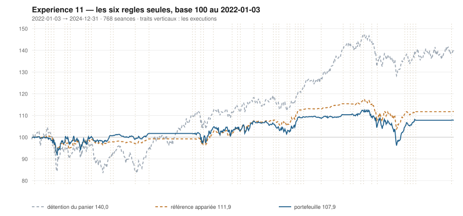

# 2024

> Journal de l'[expérience 11](../README.md) · 256 séances · **23 ordres** sur dix valeurs
> Portefeuille au 2024-12-31 : **10 786,12 €** (base 107,86) · appariée 111,88 · détention du panier 139,99

---

## Le portefeuille depuis le 2022-01-03

| | |
|---|---|
| Valeur au 1er jour de l'année | 10 937,65 € |
| Valeur au 2024-12-31 | **10 786,12 €** |
| Variation de l'année | **-1,39 %** |
| Espèces · titres | 9 728,67 € · 1 057,45 € |
| Part investie moyenne de l'année | 37,73 % |
| Lignes ouvertes au 2024-12-31 | 1 sur 10 |

## Les ordres

| Exécution | Décision | Valeur | Sens | Rang | Quantité | Prix réel | Frais | Motif |
|---|---|---|---|---|---|---|---|---|
| 2024-01-22 | 2024-01-19 | `TTE.PA` | **REGLE-4** | 1 | 21 | 50,98 € | 4,44 € | TTE.PA : clôture 50,89 sous le seuil de la règle 4 (-2,18 s dans la bande) |
| 2024-03-18 | 2024-03-15 | `TTE.PA` | **VENTE** | 1 | 41 | 54,56 € | 2,57 € | TTE.PA : clôture 54,56 au-dessus du bord haut 52,94 (+2,73 s) |
| 2024-04-08 | 2024-04-05 | `PUB.PA` | **ACHAT** | 1 | 12 | 88,96 € | 4,43 € | PUB.PA : clôture 89,14 sous le bord bas 89,72 (-1,29 s), TAUX_20 +0,285 %/séance |
| 2024-04-15 | 2024-04-12 | `AIR.PA` | **ACHAT** | 1 | 7 | 154,96 € | 1,25 € | AIR.PA : clôture 153,75 sous le bord bas 154,21 (-1,14 s), TAUX_20 +0,007 %/séance |
| 2024-04-15 | 2024-04-12 | `SGO.PA` | **ACHAT** | 2 | 16 | 66,78 € | 4,43 € | SGO.PA : clôture 66,45 sous le bord bas 66,54 (-1,05 s), TAUX_20 +0,295 %/séance |
| 2024-05-06 | 2024-05-03 | `SGO.PA` | **VENTE** | 1 | 16 | 71,97 € | 1,32 € | SGO.PA : clôture 71,81 au-dessus du bord haut 70,67 (+1,63 s) |
| 2024-05-06 | 2024-05-03 | `AIR.PA` | **REGLE-4** | 1 | 7 | 148,48 € | 1,20 € | AIR.PA : clôture 148,21 sous le seuil de la règle 4 (-2,58 s dans la bande) |
| 2024-05-06 | 2024-05-03 | `AC.PA` | **ACHAT** | 2 | 29 | 37,79 € | 4,55 € | AC.PA : clôture 37,65 sous le bord bas 38,54 (-1,79 s), TAUX_20 +0,031 %/séance |
| 2024-05-06 | 2024-05-03 | `SAF.PA` | **ACHAT** | 3 | 5 | 199,99 € | 4,15 € | SAF.PA : clôture 199,80 sous le bord bas 200,83 (-1,19 s), TAUX_20 +0,004 %/séance |
| 2024-05-13 | 2024-05-10 | `AC.PA` | **RENFORT** | 1 | 58 | 38,10 € | 9,17 € | AC.PA : renforcement, clôture 38,02 encore sous le bord bas (-1,45 s), TAUX_20 +0,248 %/séance |
| 2024-05-13 | 2024-05-10 | `CAP.PA` | **ACHAT** | 2 | 5 | 191,93 € | 3,98 € | CAP.PA : clôture 191,37 sous le bord bas 194,04 (-1,27 s), TAUX_20 +0,010 %/séance |
| 2024-06-03 | 2024-05-31 | `CAP.PA` | **REGLE-4** | 1 | 6 | 177,28 € | 4,41 € | CAP.PA : clôture 175,77 sous le seuil de la règle 4 (-2,41 s dans la bande) |
| 2024-06-17 | 2024-06-14 | `PUB.PA` | **REGLE-4** | 1 | 11 | 87,67 € | 4,00 € | PUB.PA : clôture 86,92 sous le seuil de la règle 4 (-3,72 s dans la bande) |
| 2024-06-17 | 2024-06-14 | `SAF.PA` | **REGLE-4** | 2 | 3 | 193,66 € | 2,41 € | SAF.PA : clôture 192,30 sous le seuil de la règle 4 (-3,64 s dans la bande) |
| 2024-08-26 | 2024-08-23 | `AIR.PA` | **VENTE** | 1 | 14 | 135,26 € | 2,18 € | AIR.PA : clôture 135,21 au-dessus du bord haut 131,07 (+1,69 s) |
| 2024-08-26 | 2024-08-23 | `AC.PA` | **REGLE-4** | 1 | 29 | 35,00 € | 4,21 € | AC.PA : clôture 35,06 sous le seuil de la règle 4 (+0,98 s dans la bande) |
| 2024-09-02 | 2024-08-30 | `AC.PA` | **VENTE** | 1 | 116 | 36,00 € | 4,80 € | AC.PA : clôture 35,98 au-dessus du bord haut 34,92 (+1,83 s) |
| 2024-09-02 | 2024-08-30 | `CAP.PA` | **VENTE** | 2 | 11 | 177,66 € | 2,25 € | CAP.PA : clôture 177,57 au-dessus du bord haut 174,22 (+1,62 s) |
| 2024-09-09 | 2024-09-06 | `SGO.PA` | **ACHAT** | 1 | 14 | 71,49 € | 4,15 € | SGO.PA : clôture 71,22 sous le bord bas 71,56 (-1,12 s), TAUX_20 +0,243 %/séance |
| 2024-09-16 | 2024-09-13 | `SAF.PA` | **VENTE** | 1 | 8 | 198,02 € | 1,82 € | SAF.PA : clôture 198,80 au-dessus du bord haut 195,92 (+1,62 s) |
| 2024-09-23 | 2024-09-20 | `PUB.PA` | **VENTE** | 1 | 23 | 91,49 € | 2,42 € | PUB.PA : clôture 91,36 au-dessus du bord haut 90,10 (+1,52 s) |
| 2024-09-23 | 2024-09-20 | `SGO.PA` | **VENTE** | 2 | 14 | 78,68 € | 1,27 € | SGO.PA : clôture 79,14 au-dessus du bord haut 77,57 (+1,56 s) |
| 2024-12-23 | 2024-12-20 | `SGO.PA` | **ACHAT** | 1 | 13 | 80,62 € | 4,35 € | SGO.PA : clôture 80,92 sous le bord bas 82,14 (-1,57 s), TAUX_20 +0,081 %/séance |

## Les positions touchant l'année

| Valeur | Achat | Sortie | Motif | Tr. | Titres | Prix moyen | Sortie | +/− value | Repli / 1re | Contribution | Séances |
|---|---|---|---|---|---|---|---|---|---|---|---|
| `TTE.PA` | 2023-12-04 | 2024-03-18 | VENTE | 2 | 41 | 51,97 € | 54,56 € | **+4,98 %** | -4,88 % | +94,65 € | 73 |
| `PUB.PA` | 2024-04-08 | 2024-09-23 | VENTE | 2 | 23 | 88,34 € | 91,49 € | **+3,57 %** | -7,93 % | +61,62 € | 120 |
| `AIR.PA` | 2024-04-15 | 2024-08-26 | VENTE | 2 | 14 | 151,72 € | 135,26 € | **-10,85 %** | -20,52 % | -234,98 € | 95 |
| `SGO.PA` | 2024-04-15 | 2024-05-06 | VENTE | 1 | 16 | 66,78 € | 71,97 € | **+7,78 %** | -2,77 % | +77,34 € | 15 |
| `AC.PA` | 2024-05-06 | 2024-09-02 | VENTE | 3 | 116 | 37,25 € | 36,00 € | **-3,35 %** | -18,79 % | -167,37 € | 86 |
| `SAF.PA` | 2024-05-06 | 2024-09-16 | VENTE | 2 | 8 | 197,62 € | 198,02 € | **+0,20 %** | -7,69 % | -5,21 € | 96 |
| `CAP.PA` | 2024-05-13 | 2024-09-02 | VENTE | 2 | 11 | 183,94 € | 177,66 € | **-3,41 %** | -13,65 % | -79,71 € | 81 |
| `SGO.PA` | 2024-09-09 | 2024-09-23 | VENTE | 1 | 14 | 71,49 € | 78,68 € | **+10,06 %** | +2,02 % | +95,30 € | 11 |
| `SGO.PA` | 2024-12-23 | 2025-02-10 | VENTE | 1 | 13 | 80,62 € | 88,76 € | **+10,10 %** | -1,46 % | +100,19 € | 33 |

## Les décisions de l'année

| Mesure | Valeur |
|---|---|
| Décisions hebdomadaires | 52 |
| Évaluations, dix valeurs | 520 |
| Sous le bord bas | 149 |
| … dont `TAUX_20 ≥ 0`, donc achetables | **24** |
| Au-dessus du bord haut | 145 |

## La lecture de l'année

Le portefeuille termine l'année à 10 786,12 €, soit -1,39 % sur l'année. Les 23 ordres ont porté sur 7 valeurs — AC.PA, AIR.PA, CAP.PA, PUB.PA, SAF.PA, SGO.PA, TTE.PA — pour 79,78 € de frais. Depuis le début, le portefeuille est derrière sa référence à exposition appariée de 4,02 point.

---

[← 2023](2023.md) · [Protocole](../README.md) · [2025 →](2025.md)
