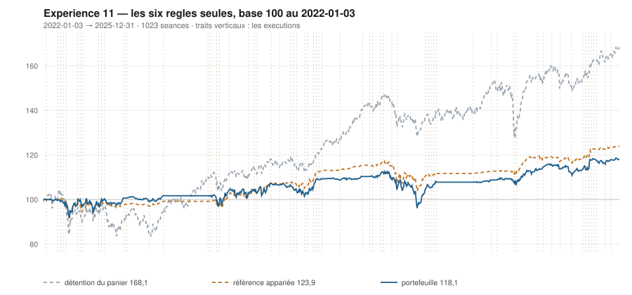

# 2025

> Journal de l'[expérience 11](../README.md) · 255 séances · **23 ordres** sur dix valeurs
> Portefeuille au 2025-12-31 : **11 809,72 €** (base 118,10) · appariée 123,90 · détention du panier 168,09

---

## Le portefeuille depuis le 2022-01-03

| | |
|---|---|
| Valeur au 1er jour de l'année | 10 786,12 € |
| Valeur au 2025-12-31 | **11 809,72 €** |
| Variation de l'année | **+9,49 %** |
| Espèces · titres | 9 751,05 € · 2 058,67 € |
| Part investie moyenne de l'année | 29,37 % |
| Lignes ouvertes au 2025-12-31 | 1 sur 10 |

## Les ordres

| Exécution | Décision | Valeur | Sens | Rang | Quantité | Prix réel | Frais | Motif |
|---|---|---|---|---|---|---|---|---|
| 2025-02-10 | 2025-02-07 | `SGO.PA` | **VENTE** | 1 | 13 | 88,76 € | 1,33 € | SGO.PA : clôture 88,82 au-dessus du bord haut 87,73 (+1,51 s) |
| 2025-02-24 | 2025-02-21 | `AIR.PA` | **ACHAT** | 1 | 7 | 154,85 € | 1,25 € | AIR.PA : clôture 153,64 sous le bord bas 159,65 (-2,49 s), TAUX_20 +0,035 %/séance |
| 2025-04-07 | 2025-04-04 | `AIR.PA` | **REGLE-4** | 1 | 8 | 126,97 € | 1,17 € | AIR.PA : clôture 141,06 sous le seuil de la règle 4 (-4,72 s dans la bande) |
| 2025-04-07 | 2025-04-04 | `TTE.PA` | **ACHAT** | 2 | 23 | 46,20 € | 4,41 € | TTE.PA : clôture 49,46 sous le bord bas 50,91 (-1,67 s), TAUX_20 +0,202 %/séance |
| 2025-04-14 | 2025-04-11 | `TTE.PA` | **REGLE-4** | 1 | 23 | 46,27 € | 4,42 € | TTE.PA : clôture 45,36 sous le seuil de la règle 4 (-2,84 s dans la bande) |
| 2025-06-09 | 2025-06-06 | `EN.PA` | **ACHAT** | 1 | 30 | 36,57 € | 4,55 € | EN.PA : clôture 36,53 sous le bord bas 37,17 (-1,79 s), TAUX_20 +0,015 %/séance |
| 2025-06-23 | 2025-06-20 | `TTE.PA` | **VENTE** | 1 | 46 | 52,16 € | 2,76 € | TTE.PA : clôture 51,75 au-dessus du bord haut 51,21 (+1,23 s) |
| 2025-06-23 | 2025-06-20 | `AIR.PA` | **VENTE** | 2 | 15 | 163,50 € | 2,82 € | AIR.PA : clôture 164,46 au-dessus du bord haut 163,88 (+1,06 s) |
| 2025-06-23 | 2025-06-20 | `EN.PA` | **REGLE-4** | 1 | 32 | 35,25 € | 4,68 € | EN.PA : clôture 35,53 sous le seuil de la règle 4 (-2,92 s dans la bande) |
| 2025-07-14 | 2025-07-11 | `ENGI.PA` | **ACHAT** | 1 | 61 | 18,81 € | 4,76 € | ENGI.PA : clôture 18,73 sous le bord bas 19,09 (-2,16 s), TAUX_20 +0,015 %/séance |
| 2025-08-04 | 2025-08-01 | `ENGI.PA` | **REGLE-4** | 1 | 62 | 18,22 € | 4,69 € | ENGI.PA : clôture 18,22 sous le seuil de la règle 4 (-3,11 s dans la bande) |
| 2025-09-01 | 2025-08-29 | `CAP.PA` | **ACHAT** | 1 | 9 | 117,86 € | 4,40 € | CAP.PA : clôture 117,67 sous le bord bas 118,94 (-1,14 s), TAUX_20 +0,021 %/séance |
| 2025-09-29 | 2025-09-26 | `SGO.PA` | **ACHAT** | 1 | 12 | 89,03 € | 4,43 € | SGO.PA : clôture 88,58 sous le bord bas 89,29 (-1,15 s), TAUX_20 +0,044 %/séance |
| 2025-10-06 | 2025-10-03 | `TTE.PA` | **ACHAT** | 1 | 23 | 49,32 € | 4,71 € | TTE.PA : clôture 49,15 sous le bord bas 49,42 (-1,29 s), TAUX_20 +0,023 %/séance |
| 2025-10-13 | 2025-10-10 | `TTE.PA` | **REGLE-4** | 1 | 23 | 48,36 € | 4,62 € | TTE.PA : clôture 48,13 sous le seuil de la règle 4 (-2,06 s dans la bande) |
| 2025-10-20 | 2025-10-17 | `ENGI.PA` | **VENTE** | 1 | 123 | 18,66 € | 2,64 € | ENGI.PA : clôture 18,71 au-dessus du bord haut 18,28 (+1,66 s) |
| 2025-10-20 | 2025-10-17 | `EN.PA` | **VENTE** | 2 | 62 | 39,59 € | 2,82 € | EN.PA : clôture 39,59 au-dessus du bord haut 37,33 (+3,24 s) |
| 2025-10-20 | 2025-10-17 | `CAP.PA` | **VENTE** | 3 | 9 | 119,12 € | 1,23 € | CAP.PA : clôture 117,91 au-dessus du bord haut 117,80 (+1,02 s) |
| 2025-10-20 | 2025-10-17 | `SAF.PA` | **ACHAT** | 1 | 3 | 299,34 € | 3,73 € | SAF.PA : clôture 293,60 sous le bord bas 293,75 (-1,03 s), TAUX_20 +0,116 %/séance |
| 2025-10-27 | 2025-10-24 | `TTE.PA` | **VENTE** | 1 | 46 | 51,79 € | 2,74 € | TTE.PA : clôture 51,89 au-dessus du bord haut 51,10 (+1,82 s) |
| 2025-11-03 | 2025-10-31 | `SGO.PA` | **REGLE-4** | 1 | 14 | 81,40 € | 4,73 € | SGO.PA : clôture 81,56 sous le seuil de la règle 4 (-2,24 s dans la bande) |
| 2025-11-24 | 2025-11-21 | `SAF.PA` | **REGLE-4** | 1 | 4 | 286,18 € | 4,75 € | SAF.PA : clôture 286,18 sous le seuil de la règle 4 (-3,29 s dans la bande) |
| 2025-12-08 | 2025-12-05 | `SGO.PA` | **VENTE** | 1 | 26 | 83,81 € | 2,51 € | SGO.PA : clôture 84,16 au-dessus du bord haut 82,99 (+1,44 s) |

## Les positions touchant l'année

| Valeur | Achat | Sortie | Motif | Tr. | Titres | Prix moyen | Sortie | +/− value | Repli / 1re | Contribution | Séances |
|---|---|---|---|---|---|---|---|---|---|---|---|
| `SGO.PA` | 2024-12-23 | 2025-02-10 | VENTE | 1 | 13 | 80,62 € | 88,76 € | **+10,10 %** | -1,46 % | +100,19 € | 33 |
| `AIR.PA` | 2025-02-24 | 2025-06-23 | VENTE | 2 | 15 | 139,98 € | 163,50 € | **+16,80 %** | -17,23 % | +347,54 € | 83 |
| `TTE.PA` | 2025-04-07 | 2025-06-23 | VENTE | 2 | 46 | 46,23 € | 52,16 € | **+12,81 %** | -2,64 % | +260,93 € | 53 |
| `EN.PA` | 2025-06-09 | 2025-10-20 | VENTE | 2 | 62 | 35,89 € | 39,59 € | **+10,32 %** | -6,53 % | +217,66 € | 96 |
| `ENGI.PA` | 2025-07-14 | 2025-10-20 | VENTE | 2 | 123 | 18,51 € | 18,66 € | **+0,81 %** | -12,17 % | +6,35 € | 71 |
| `CAP.PA` | 2025-09-01 | 2025-10-20 | VENTE | 1 | 9 | 117,86 € | 119,12 € | **+1,07 %** | -2,92 % | +5,70 € | 36 |
| `SGO.PA` | 2025-09-29 | 2025-12-08 | VENTE | 2 | 26 | 84,92 € | 83,81 € | **-1,31 %** | -13,06 % | -40,62 € | 51 |
| `TTE.PA` | 2025-10-06 | 2025-10-27 | VENTE | 2 | 46 | 48,84 € | 51,79 € | **+6,03 %** | -2,72 % | +123,43 € | 16 |
| `SAF.PA` | 2025-10-20 | 2026-01-12 | VENTE | 2 | 7 | 291,82 € | 313,08 € | **+7,29 %** | -6,67 % | +137,83 € | 58 |

## Les décisions de l'année

| Mesure | Valeur |
|---|---|
| Décisions hebdomadaires | 52 |
| Évaluations, dix valeurs | 520 |
| Sous le bord bas | 120 |
| … dont `TAUX_20 ≥ 0`, donc achetables | **15** |
| Au-dessus du bord haut | 157 |

## La lecture de l'année

Le portefeuille termine l'année à 11 809,72 €, soit +9,49 % sur l'année. Les 23 ordres ont porté sur 7 valeurs — AIR.PA, CAP.PA, EN.PA, ENGI.PA, SAF.PA, SGO.PA, TTE.PA — pour 80,14 € de frais. Depuis le début, le portefeuille est derrière sa référence à exposition appariée de 5,80 point.

---

[← 2024](2024.md) · [Protocole](../README.md) · [2026 →](2026.md)
