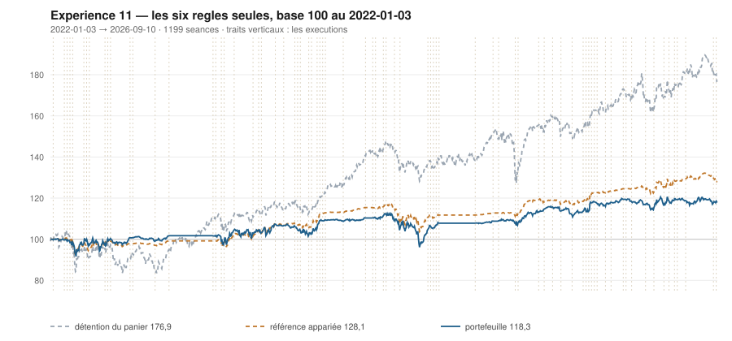

# 2026

> Journal de l'[expérience 11](../README.md) · 176 séances · **15 ordres** sur dix valeurs
> Portefeuille au 2026-09-10 : **11 828,82 €** (base 118,29) · appariée 128,06 · détention du panier 176,91

---

## Le portefeuille depuis le 2022-01-03

| | |
|---|---|
| Valeur au 1er jour de l'année | 11 809,72 € |
| Valeur au 2026-09-10 | **11 828,82 €** |
| Variation de l'année | **+0,16 %** |
| Espèces · titres | 4 854,19 € · 6 974,63 € |
| Part investie moyenne de l'année | 37,56 % |
| Lignes ouvertes au 2026-09-10 | 3 sur 10 |

## Les ordres

| Exécution | Décision | Valeur | Sens | Rang | Quantité | Prix réel | Frais | Motif |
|---|---|---|---|---|---|---|---|---|
| 2026-01-12 | 2026-01-09 | `SAF.PA` | **VENTE** | 1 | 7 | 313,08 € | 2,52 € | SAF.PA : clôture 313,77 au-dessus du bord haut 309,73 (+1,53 s) |
| 2026-01-19 | 2026-01-16 | `MC.PA` | **ACHAT** | 1 | 2 | 575,61 € | 4,78 € | MC.PA : clôture 599,43 sous le bord bas 640,27 (-2,89 s), TAUX_20 +0,010 %/séance |
| 2026-02-02 | 2026-01-30 | `MC.PA` | **REGLE-4** | 1 | 2 | 538,22 € | 4,47 € | MC.PA : clôture 538,13 sous le seuil de la règle 4 (-3,13 s dans la bande) |
| 2026-03-09 | 2026-03-06 | `EN.PA` | **ACHAT** | 1 | 25 | 45,62 € | 4,73 € | EN.PA : clôture 46,91 sous le bord bas 47,23 (-1,29 s), TAUX_20 +0,191 %/séance |
| 2026-03-09 | 2026-03-06 | `ENGI.PA` | **ACHAT** | 2 | 47 | 24,49 € | 4,78 € | ENGI.PA : clôture 25,08 sous le bord bas 25,24 (-1,25 s), TAUX_20 +0,295 %/séance |
| 2026-03-09 | 2026-03-06 | `CAP.PA` | **ACHAT** | 3 | 11 | 105,60 € | 4,82 € | CAP.PA : clôture 106,33 sous le bord bas 106,72 (-1,03 s), TAUX_20 +0,005 %/séance |
| 2026-03-30 | 2026-03-27 | `CAP.PA` | **REGLE-4** | 1 | 12 | 93,03 € | 4,63 € | CAP.PA : clôture 93,20 sous le seuil de la règle 4 (-1,04 s dans la bande) |
| 2026-04-27 | 2026-04-24 | `SAF.PA` | **ACHAT** | 1 | 4 | 268,88 € | 4,46 € | SAF.PA : clôture 267,00 sous le bord bas 287,26 (-2,20 s), TAUX_20 +0,070 %/séance |
| 2026-05-11 | 2026-05-08 | `MC.PA` | **VENTE** | 1 | 4 | 470,35 € | 2,16 € | MC.PA : clôture 472,70 au-dessus du bord haut 462,32 (+1,40 s) |
| 2026-05-11 | 2026-05-08 | `TTE.PA` | **ACHAT** | 1 | 15 | 75,56 € | 4,70 € | TTE.PA : clôture 74,87 sous le bord bas 75,89 (-1,34 s), TAUX_20 +0,015 %/séance |
| 2026-05-25 | 2026-05-22 | `CAP.PA` | **VENTE** | 1 | 23 | 100,95 € | 2,67 € | CAP.PA : clôture 99,89 au-dessus du bord haut 96,14 (+1,41 s) |
| 2026-06-01 | 2026-05-29 | `SAF.PA` | **VENTE** | 1 | 4 | 302,50 € | 1,39 € | SAF.PA : clôture 305,70 au-dessus du bord haut 304,95 (+1,04 s) |
| 2026-06-22 | 2026-06-19 | `TTE.PA` | **REGLE-4** | 1 | 16 | 70,50 € | 4,68 € | TTE.PA : clôture 70,19 sous le seuil de la règle 4 (-2,77 s dans la bande) |
| 2026-08-31 | 2026-08-28 | `EN.PA` | **REGLE-4** | 1 | 26 | 44,10 € | 4,76 € | EN.PA : clôture 44,08 sous le seuil de la règle 4 (-2,39 s dans la bande) |
| 2026-09-08 | 2026-09-04 | `ENGI.PA` | **REGLE-4** | 1 | 48 | 24,18 € | 4,82 € | ENGI.PA : clôture 24,01 sous le seuil de la règle 4 (-2,37 s dans la bande) |

## Les positions touchant l'année

| Valeur | Achat | Sortie | Motif | Tr. | Titres | Prix moyen | Sortie | +/− value | Repli / 1re | Contribution | Séances |
|---|---|---|---|---|---|---|---|---|---|---|---|
| `SAF.PA` | 2025-10-20 | 2026-01-12 | VENTE | 2 | 7 | 291,82 € | 313,08 € | **+7,29 %** | -6,67 % | +137,83 € | 58 |
| `MC.PA` | 2026-01-19 | 2026-05-11 | VENTE | 2 | 4 | 556,92 € | 470,35 € | **-15,54 %** | -22,70 % | -357,68 € | 78 |
| `EN.PA` | 2026-03-09 | 2026-09-10 *(ouverte)* | ouverte | 2 | 51 | 44,84 € | 43,85 € | **-2,21 %** | -3,87 % | -60,13 € | 130 |
| `ENGI.PA` | 2026-03-09 | 2026-09-10 *(ouverte)* | ouverte | 2 | 95 | 24,34 € | 24,30 € | **-0,14 %** | -2,87 % | -12,95 € | 130 |
| `CAP.PA` | 2026-03-09 | 2026-05-25 | VENTE | 2 | 23 | 99,04 € | 100,95 € | **+1,93 %** | -11,74 % | +31,82 € | 53 |
| `SAF.PA` | 2026-04-27 | 2026-06-01 | VENTE | 1 | 4 | 268,88 € | 302,50 € | **+12,50 %** | -2,46 % | +128,63 € | 25 |
| `TTE.PA` | 2026-05-11 | 2026-09-10 *(ouverte)* | ouverte | 2 | 31 | 72,95 € | 78,38 € | **+7,45 %** | -12,76 % | +159,03 € | 88 |

## Les décisions de l'année

| Mesure | Valeur |
|---|---|
| Décisions hebdomadaires | 37 |
| Évaluations, dix valeurs | 370 |
| Sous le bord bas | 115 |
| … dont `TAUX_20 ≥ 0`, donc achetables | **19** |
| Au-dessus du bord haut | 99 |

## La lecture de l'année

Le portefeuille termine l'année à 11 828,82 €, soit +0,16 % sur l'année. Les 15 ordres ont porté sur 6 valeurs — CAP.PA, EN.PA, ENGI.PA, MC.PA, SAF.PA, TTE.PA — pour 60,38 € de frais. 3 positions restent ouvertes : EN.PA (-2,21 %), ENGI.PA (-0,14 %), TTE.PA (+7,45 %). Depuis le début, le portefeuille est derrière sa référence à exposition appariée de 9,77 point.

---

[← 2025](2025.md) · [Protocole](../README.md)
