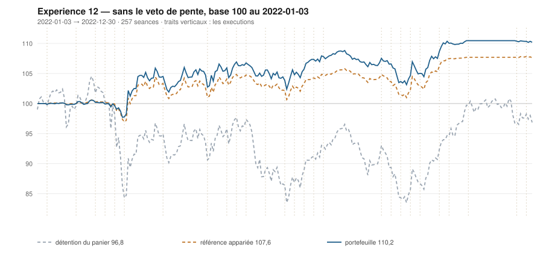

# 2022

> Journal de l'[expérience 12](../README.md) · 257 séances · **50 ordres** sur dix valeurs
> Portefeuille au 2022-12-30 : **11 019,17 €** (base 110,19) · appariée 107,60 · détention du panier 96,85

---

## Le portefeuille depuis le 2022-01-03

| | |
|---|---|
| Valeur au 1er jour de l'année | 10 000,00 € |
| Valeur au 2022-12-30 | **11 019,17 €** |
| Variation de l'année | **+10,19 %** |
| Espèces · titres | 9 549,53 € · 1 469,65 € |
| Part investie moyenne de l'année | 27,50 % |
| Lignes ouvertes au 2022-12-30 | 3 sur 10 |
| **Positions ouvertes que le veto aurait refusées** | **21** |

## Les ordres

| Exécution | Décision | Valeur | Sens | Rang | Quantité | Prix réel | Frais | Motif |
|---|---|---|---|---|---|---|---|---|
| 2022-01-10 | 2022-01-07 | `CAP.PA` | **ACHAT** | 1 | 2 | 180,43 € | 1,50 € | CAP.PA : clôture 180,16 sous le bord bas 183,51 (-1,46 s), TAUX_20 +0,181 %/séance — sans condition de pente |
| 2022-01-31 | 2022-01-28 | `SGO.PA` | **ACHAT** | 1 | 9 | 51,05 € | 1,91 € | SGO.PA : clôture 50,29 sous le bord bas 51,08 (-1,41 s), TAUX_20 -0,512 %/séance — sans condition de pente |
| 2022-01-31 | 2022-01-28 | `SAF.PA` | **ACHAT** | 2 | 4 | 100,80 € | 1,67 € | SAF.PA : clôture 99,14 sous le bord bas 99,24 (-1,02 s), TAUX_20 -0,243 %/séance — sans condition de pente |
| 2022-02-14 | 2022-02-11 | `SAF.PA` | **VENTE** | 1 | 4 | 107,31 € | 0,49 € | SAF.PA : clôture 109,71 au-dessus du bord haut 109,30 (+1,08 s) |
| 2022-02-21 | 2022-02-18 | `CAP.PA` | **REGLE-4** | 1 | 2 | 168,59 € | 1,40 € | CAP.PA : clôture 167,42 sous le seuil de la règle 4 (-1,85 s dans la bande) |
| 2022-02-28 | 2022-02-25 | `TTE.PA` | **ACHAT** | 2 | 13 | 36,42 € | 1,97 € | TTE.PA : clôture 37,33 sous le bord bas 37,80 (-1,32 s), TAUX_20 -0,205 %/séance — sans condition de pente |
| 2022-02-28 | 2022-02-25 | `PUB.PA` | **ACHAT** | 3 | 10 | 47,78 € | 1,98 € | PUB.PA : clôture 48,62 sous le bord bas 48,80 (-1,15 s), TAUX_20 -0,086 %/séance — sans condition de pente |
| 2022-03-07 | 2022-03-04 | `ENGI.PA` | **ACHAT** | 1 | 69 | 6,95 € | 1,99 € | ENGI.PA : clôture 7,25 sous le bord bas 9,13 (-5,78 s), TAUX_20 -0,987 %/séance — sans condition de pente |
| 2022-03-07 | 2022-03-04 | `PUB.PA` | **REGLE-4** | 2 | 12 | 39,47 € | 1,97 € | PUB.PA : clôture 40,91 sous le seuil de la règle 4 (-5,03 s dans la bande) |
| 2022-03-07 | 2022-03-04 | `SGO.PA` | **REGLE-4** | 3 | 11 | 40,97 € | 1,87 € | SGO.PA : clôture 43,46 sous le seuil de la règle 4 (-3,77 s dans la bande) |
| 2022-03-07 | 2022-03-04 | `AIR.PA` | **ACHAT** | 5 | 5 | 83,95 € | 0,48 € | AIR.PA : clôture 89,08 sous le bord bas 98,00 (-2,87 s), TAUX_20 -0,612 %/séance — sans condition de pente |
| 2022-03-07 | 2022-03-04 | `TTE.PA` | **REGLE-4** | 6 | 14 | 34,00 € | 1,98 € | TTE.PA : clôture 34,41 sous le seuil de la règle 4 (-2,71 s dans la bande) |
| 2022-03-07 | 2022-03-04 | `AC.PA` | **ACHAT** | 7 | 22 | 21,76 € | 1,99 € | AC.PA : clôture 23,18 sous le bord bas 25,47 (-2,21 s), TAUX_20 -0,954 %/séance — sans condition de pente |
| 2022-03-07 | 2022-03-04 | `SAF.PA` | **ACHAT** | 8 | 5 | 89,46 € | 1,86 € | SAF.PA : clôture 92,52 sous le bord bas 98,15 (-2,12 s), TAUX_20 -0,376 %/séance — sans condition de pente |
| 2022-04-04 | 2022-04-01 | `CAP.PA` | **VENTE** | 1 | 4 | 181,24 € | 0,83 € | CAP.PA : clôture 179,93 au-dessus du bord haut 178,49 (+1,16 s) |
| 2022-05-09 | 2022-05-06 | `MC.PA` | **ACHAT** | 1 | 1 | 510,27 € | 2,12 € | MC.PA : clôture 518,10 sous le bord bas 528,89 (-1,42 s), TAUX_20 -0,385 %/séance — sans condition de pente |
| 2022-05-23 | 2022-05-20 | `ENGI.PA` | **VENTE** | 1 | 69 | 9,33 € | 0,74 € | ENGI.PA : clôture 9,19 au-dessus du bord haut 8,68 (+1,86 s) |
| 2022-05-23 | 2022-05-20 | `TTE.PA` | **VENTE** | 2 | 27 | 41,19 € | 1,28 € | TTE.PA : clôture 40,57 au-dessus du bord haut 40,49 (+1,04 s) |
| 2022-05-30 | 2022-05-27 | `AIR.PA` | **VENTE** | 1 | 5 | 104,75 € | 0,60 € | AIR.PA : clôture 104,10 au-dessus du bord haut 102,18 (+1,40 s) |
| 2022-05-30 | 2022-05-27 | `SGO.PA` | **VENTE** | 2 | 20 | 47,97 € | 1,10 € | SGO.PA : clôture 47,74 au-dessus du bord haut 47,28 (+1,18 s) |
| 2022-06-06 | 2022-06-03 | `MC.PA` | **VENTE** | 1 | 1 | 565,87 € | 0,65 € | MC.PA : clôture 561,62 au-dessus du bord haut 548,40 (+1,51 s) |
| 2022-06-20 | 2022-06-17 | `AIR.PA` | **ACHAT** | 1 | 5 | 88,31 € | 0,51 € | AIR.PA : clôture 87,59 sous le bord bas 90,44 (-1,64 s), TAUX_20 -0,697 %/séance — sans condition de pente |
| 2022-06-20 | 2022-06-17 | `SGO.PA` | **ACHAT** | 2 | 13 | 40,01 € | 2,16 € | SGO.PA : clôture 40,82 sous le bord bas 41,30 (-1,18 s), TAUX_20 -0,467 %/séance — sans condition de pente |
| 2022-06-20 | 2022-06-17 | `SAF.PA` | **REGLE-4** | 3 | 5 | 87,46 € | 1,81 € | SAF.PA : clôture 87,37 sous le seuil de la règle 4 (-0,74 s dans la bande) |
| 2022-07-04 | 2022-07-01 | `EN.PA` | **ACHAT** | 1 | 22 | 23,52 € | 2,15 € | EN.PA : clôture 23,50 sous le bord bas 24,75 (-2,74 s), TAUX_20 -0,381 %/séance — sans condition de pente |
| 2022-07-04 | 2022-07-01 | `SGO.PA` | **REGLE-4** | 2 | 14 | 36,82 € | 2,14 € | SGO.PA : clôture 36,57 sous le seuil de la règle 4 (-1,75 s dans la bande) |
| 2022-07-04 | 2022-07-01 | `CAP.PA` | **ACHAT** | 3 | 3 | 148,50 € | 1,85 € | CAP.PA : clôture 147,59 sous le bord bas 151,85 (-1,62 s), TAUX_20 -0,232 %/séance — sans condition de pente |
| 2022-07-11 | 2022-07-08 | `SAF.PA` | **VENTE** | 1 | 10 | 93,87 € | 1,08 € | SAF.PA : clôture 95,31 au-dessus du bord haut 92,15 (+1,84 s) |
| 2022-07-18 | 2022-07-15 | `AIR.PA` | **VENTE** | 1 | 5 | 97,27 € | 0,56 € | AIR.PA : clôture 96,52 au-dessus du bord haut 95,55 (+1,20 s) |
| 2022-07-18 | 2022-07-15 | `TTE.PA` | **ACHAT** | 1 | 13 | 38,32 € | 2,07 € | TTE.PA : clôture 37,79 sous le bord bas 38,13 (-1,15 s), TAUX_20 -0,249 %/séance — sans condition de pente |
| 2022-07-25 | 2022-07-22 | `PUB.PA` | **VENTE** | 1 | 22 | 42,87 € | 1,08 € | PUB.PA : clôture 42,92 au-dessus du bord haut 39,39 (+2,54 s) |
| 2022-08-01 | 2022-07-29 | `CAP.PA` | **VENTE** | 1 | 3 | 168,58 € | 0,58 € | CAP.PA : clôture 169,13 au-dessus du bord haut 161,02 (+2,11 s) |
| 2022-09-12 | 2022-09-09 | `AC.PA` | **REGLE-4** | 1 | 24 | 21,40 € | 2,13 € | AC.PA : clôture 21,28 sous le seuil de la règle 4 (-0,62 s dans la bande) |
| 2022-09-19 | 2022-09-16 | `AIR.PA` | **ACHAT** | 1 | 6 | 85,14 € | 0,59 € | AIR.PA : clôture 85,37 sous le bord bas 87,79 (-1,50 s), TAUX_20 -0,500 %/séance — sans condition de pente |
| 2022-09-19 | 2022-09-16 | `SAF.PA` | **ACHAT** | 2 | 5 | 94,20 € | 1,95 € | SAF.PA : clôture 94,45 sous le bord bas 94,75 (-1,06 s), TAUX_20 -0,258 %/séance — sans condition de pente |
| 2022-09-26 | 2022-09-23 | `SAF.PA` | **REGLE-4** | 1 | 5 | 87,99 € | 1,83 € | SAF.PA : clôture 88,72 sous le seuil de la règle 4 (-2,11 s dans la bande) |
| 2022-09-26 | 2022-09-23 | `CAP.PA` | **ACHAT** | 2 | 3 | 140,34 € | 1,75 € | CAP.PA : clôture 141,39 sous le bord bas 148,44 (-1,87 s), TAUX_20 -0,472 %/séance — sans condition de pente |
| 2022-09-26 | 2022-09-23 | `EN.PA` | **REGLE-4** | 4 | 23 | 21,97 € | 2,10 € | EN.PA : clôture 22,18 sous le seuil de la règle 4 (-1,63 s dans la bande) |
| 2022-10-03 | 2022-09-30 | `ENGI.PA` | **ACHAT** | 2 | 59 | 8,65 € | 2,12 € | ENGI.PA : clôture 8,61 sous le bord bas 8,68 (-1,14 s), TAUX_20 -0,295 %/séance — sans condition de pente |
| 2022-10-10 | 2022-10-07 | `TTE.PA` | **VENTE** | 1 | 13 | 41,89 € | 0,63 € | TTE.PA : clôture 42,42 au-dessus du bord haut 42,35 (+1,04 s) |
| 2022-10-24 | 2022-10-21 | `AIR.PA` | **VENTE** | 1 | 6 | 94,90 € | 0,65 € | AIR.PA : clôture 93,92 au-dessus du bord haut 93,61 (+1,06 s) |
| 2022-10-31 | 2022-10-28 | `ENGI.PA` | **VENTE** | 1 | 59 | 9,49 € | 0,64 € | ENGI.PA : clôture 9,52 au-dessus du bord haut 9,52 (+1,01 s) |
| 2022-10-31 | 2022-10-28 | `AC.PA` | **VENTE** | 2 | 46 | 21,37 € | 1,13 € | AC.PA : clôture 21,25 au-dessus du bord haut 19,87 (+2,43 s) |
| 2022-10-31 | 2022-10-28 | `EN.PA` | **VENTE** | 3 | 45 | 23,44 € | 1,21 € | EN.PA : clôture 23,42 au-dessus du bord haut 23,02 (+1,44 s) |
| 2022-10-31 | 2022-10-28 | `SAF.PA` | **VENTE** | 4 | 10 | 107,37 € | 1,23 € | SAF.PA : clôture 109,00 au-dessus du bord haut 106,31 (+1,51 s) |
| 2022-10-31 | 2022-10-28 | `SGO.PA` | **VENTE** | 5 | 27 | 36,70 € | 1,14 € | SGO.PA : clôture 36,71 au-dessus du bord haut 35,59 (+1,41 s) |
| 2022-11-14 | 2022-11-11 | `CAP.PA` | **VENTE** | 1 | 3 | 166,07 € | 0,57 € | CAP.PA : clôture 165,98 au-dessus du bord haut 161,22 (+1,58 s) |
| 2022-12-19 | 2022-12-16 | `PUB.PA` | **ACHAT** | 1 | 10 | 50,71 € | 2,10 € | PUB.PA : clôture 50,77 sous le bord bas 51,54 (-1,37 s), TAUX_20 -0,274 %/séance — sans condition de pente |
| 2022-12-19 | 2022-12-16 | `CAP.PA` | **ACHAT** | 2 | 3 | 145,40 € | 1,81 € | CAP.PA : clôture 145,49 sous le bord bas 147,20 (-1,20 s), TAUX_20 -0,418 %/séance — sans condition de pente |
| 2022-12-27 | 2022-12-23 | `ENGI.PA` | **ACHAT** | 1 | 55 | 9,94 € | 2,27 € | ENGI.PA : clôture 9,87 sous le bord bas 9,90 (-1,06 s), TAUX_20 -0,356 %/séance — sans condition de pente |

## Les positions touchant l'année

| Valeur | Achat | Sortie | Tr. | Titres | Prix moyen | Sortie | +/− value | `TAUX_20` à l'achat | Contribution | Séances |
|---|---|---|---|---|---|---|---|---|---|---|
| `CAP.PA` | 2022-01-10 | 2022-04-04 | 2 | 4 | 174,51 € | 181,24 € | **+3,86 %** | +0,181 | +23,19 € | 61 |
| `SGO.PA` | 2022-01-31 | 2022-05-30 | 2 | 20 | 45,51 € | 47,97 € | **+5,41 %** | -0,512 ⚠️ | +44,36 € | 84 |
| `SAF.PA` | 2022-01-31 | 2022-02-14 | 1 | 4 | 100,80 € | 107,31 € | **+6,45 %** | -0,243 ⚠️ | +23,85 € | 11 |
| `TTE.PA` | 2022-02-28 | 2022-05-23 | 2 | 27 | 35,17 € | 41,19 € | **+17,14 %** | -0,205 ⚠️ | +157,51 € | 59 |
| `PUB.PA` | 2022-02-28 | 2022-07-25 | 2 | 22 | 43,24 € | 42,87 € | **-0,86 %** | -0,086 ⚠️ | -13,17 € | 104 |
| `ENGI.PA` | 2022-03-07 | 2022-05-23 | 1 | 69 | 6,95 € | 9,33 € | **+34,18 %** | -0,987 ⚠️ | +161,18 € | 54 |
| `AIR.PA` | 2022-03-07 | 2022-05-30 | 1 | 5 | 83,95 € | 104,75 € | **+24,78 %** | -0,612 ⚠️ | +102,92 € | 59 |
| `AC.PA` | 2022-03-07 | 2022-10-31 | 2 | 46 | 21,57 € | 21,37 € | **-0,93 %** | -0,954 ⚠️ | -14,48 € | 169 |
| `SAF.PA` | 2022-03-07 | 2022-07-11 | 2 | 10 | 88,46 € | 93,87 € | **+6,12 %** | -0,376 ⚠️ | +49,36 € | 89 |
| `MC.PA` | 2022-05-09 | 2022-06-06 | 1 | 1 | 510,27 € | 565,87 € | **+10,90 %** | -0,385 ⚠️ | +52,83 € | 21 |
| `AIR.PA` | 2022-06-20 | 2022-07-18 | 1 | 5 | 88,31 € | 97,27 € | **+10,14 %** | -0,697 ⚠️ | +43,69 € | 21 |
| `SGO.PA` | 2022-06-20 | 2022-10-31 | 2 | 27 | 38,35 € | 36,70 € | **-4,31 %** | -0,467 ⚠️ | -50,03 € | 96 |
| `EN.PA` | 2022-07-04 | 2022-10-31 | 2 | 45 | 22,73 € | 23,44 € | **+3,14 %** | -0,381 ⚠️ | +26,69 € | 86 |
| `CAP.PA` | 2022-07-04 | 2022-08-01 | 1 | 3 | 148,50 € | 168,58 € | **+13,52 %** | -0,232 ⚠️ | +57,79 € | 21 |
| `TTE.PA` | 2022-07-18 | 2022-10-10 | 1 | 13 | 38,32 € | 41,89 € | **+9,30 %** | -0,249 ⚠️ | +43,65 € | 61 |
| `AIR.PA` | 2022-09-19 | 2022-10-24 | 1 | 6 | 85,14 € | 94,90 € | **+11,47 %** | -0,500 ⚠️ | +57,33 € | 26 |
| `SAF.PA` | 2022-09-19 | 2022-10-31 | 2 | 10 | 91,09 € | 107,37 € | **+17,86 %** | -0,258 ⚠️ | +157,71 € | 31 |
| `CAP.PA` | 2022-09-26 | 2022-11-14 | 1 | 3 | 140,34 € | 166,07 € | **+18,34 %** | -0,472 ⚠️ | +74,87 € | 36 |
| `ENGI.PA` | 2022-10-03 | 2022-10-31 | 1 | 59 | 8,65 € | 9,49 € | **+9,68 %** | -0,295 ⚠️ | +46,65 € | 21 |
| `PUB.PA` | 2022-12-19 | 2023-02-06 | 1 | 10 | 50,71 € | 63,13 € | **+24,49 %** | -0,274 ⚠️ | +121,35 € | 35 |
| `CAP.PA` | 2022-12-19 | 2023-01-16 | 1 | 3 | 145,40 € | 156,99 € | **+7,97 %** | -0,418 ⚠️ | +32,41 € | 20 |
| `ENGI.PA` | 2022-12-27 | 2023-04-03 | 2 | 113 | 9,69 € | 10,61 € | **+9,58 %** | -0,356 ⚠️ | +98,91 € | 70 |

## Les décisions de l'année

| Mesure | Valeur |
|---|---|
| Décisions hebdomadaires | 52 |
| Évaluations, dix valeurs | 520 |
| **Sous le bord bas — toutes achetables** | **91** |
| … dont `TAUX_20 ≥ 0` — le veto les aurait seules gardées | 9 |
| Au-dessus du bord haut | 124 |

## La lecture de l'année

Le portefeuille termine l'année à 11 019,17 €, soit +10,19 % sur l'année. Les 50 ordres ont porté sur 10 valeurs — AC.PA, AIR.PA, CAP.PA, EN.PA, ENGI.PA, MC.PA, PUB.PA, SAF.PA, SGO.PA, TTE.PA — pour 72,22 € de frais. 21 positions ont été ouvertes sur une pente courte négative — le veto de l'expérience 11 les aurait refusées. Depuis le début, le portefeuille est devant sa référence à exposition appariée de 2,59 point.

---

[Protocole](../README.md) · [2023 →](2023.md)
