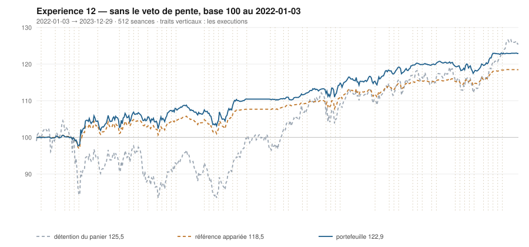

# 2023

> Journal de l'[expérience 12](../README.md) · 255 séances · **44 ordres** sur dix valeurs
> Portefeuille au 2023-12-29 : **12 291,50 €** (base 122,92) · appariée 118,47 · détention du panier 125,50

---

## Le portefeuille depuis le 2022-01-03

| | |
|---|---|
| Valeur au 1er jour de l'année | 11 019,17 € |
| Valeur au 2023-12-29 | **12 291,50 €** |
| Variation de l'année | **+11,55 %** |
| Espèces · titres | 11 706,94 € · 584,56 € |
| Part investie moyenne de l'année | 31,98 % |
| Lignes ouvertes au 2023-12-29 | 1 sur 10 |
| **Positions ouvertes que le veto aurait refusées** | **13** |

## Les ordres

| Exécution | Décision | Valeur | Sens | Rang | Quantité | Prix réel | Frais | Motif |
|---|---|---|---|---|---|---|---|---|
| 2023-01-09 | 2023-01-06 | `ENGI.PA` | **REGLE-4** | 1 | 58 | 9,44 € | 2,27 € | ENGI.PA : clôture 9,41 sous le seuil de la règle 4 (-1,81 s dans la bande) |
| 2023-01-16 | 2023-01-13 | `CAP.PA` | **VENTE** | 1 | 3 | 156,99 € | 0,54 € | CAP.PA : clôture 155,94 au-dessus du bord haut 155,06 (+1,12 s) |
| 2023-02-06 | 2023-02-03 | `PUB.PA` | **VENTE** | 1 | 10 | 63,13 € | 0,73 € | PUB.PA : clôture 64,07 au-dessus du bord haut 58,96 (+3,30 s) |
| 2023-02-06 | 2023-02-03 | `TTE.PA` | **ACHAT** | 1 | 11 | 46,78 € | 2,14 € | TTE.PA : clôture 46,78 sous le bord bas 48,25 (-1,86 s), TAUX_20 -0,265 %/séance — sans condition de pente |
| 2023-02-13 | 2023-02-10 | `AIR.PA` | **ACHAT** | 1 | 5 | 106,37 € | 0,61 € | AIR.PA : clôture 105,85 sous le bord bas 107,81 (-1,44 s), TAUX_20 -0,212 %/séance — sans condition de pente |
| 2023-03-13 | 2023-03-10 | `SAF.PA` | **ACHAT** | 1 | 4 | 128,13 € | 2,13 € | SAF.PA : clôture 127,92 sous le bord bas 129,80 (-1,62 s), TAUX_20 +0,090 %/séance — sans condition de pente |
| 2023-03-13 | 2023-03-10 | `SGO.PA` | **ACHAT** | 3 | 11 | 49,58 € | 2,26 € | SGO.PA : clôture 49,57 sous le bord bas 49,99 (-1,33 s), TAUX_20 +0,477 %/séance — sans condition de pente |
| 2023-03-20 | 2023-03-17 | `SGO.PA` | **REGLE-4** | 1 | 12 | 45,43 € | 2,26 € | SGO.PA : clôture 45,54 sous le seuil de la règle 4 (-3,46 s dans la bande) |
| 2023-03-20 | 2023-03-17 | `TTE.PA` | **REGLE-4** | 2 | 12 | 43,24 € | 2,15 € | TTE.PA : clôture 44,12 sous le seuil de la règle 4 (-3,19 s dans la bande) |
| 2023-03-20 | 2023-03-17 | `SAF.PA` | **REGLE-4** | 3 | 4 | 122,51 € | 2,03 € | SAF.PA : clôture 123,07 sous le seuil de la règle 4 (-2,92 s dans la bande) |
| 2023-03-20 | 2023-03-17 | `AC.PA` | **ACHAT** | 4 | 21 | 25,32 € | 2,21 € | AC.PA : clôture 25,37 sous le bord bas 26,74 (-2,19 s), TAUX_20 -0,260 %/séance — sans condition de pente |
| 2023-03-20 | 2023-03-17 | `PUB.PA` | **ACHAT** | 6 | 9 | 59,75 € | 2,23 € | PUB.PA : clôture 59,90 sous le bord bas 61,31 (-1,49 s), TAUX_20 -0,284 %/séance — sans condition de pente |
| 2023-03-20 | 2023-03-17 | `CAP.PA` | **ACHAT** | 7 | 3 | 151,42 € | 1,89 € | CAP.PA : clôture 152,52 sous le bord bas 155,30 (-1,39 s), TAUX_20 -0,407 %/séance — sans condition de pente |
| 2023-03-27 | 2023-03-24 | `EN.PA` | **ACHAT** | 1 | 22 | 24,98 € | 2,28 € | EN.PA : clôture 24,72 sous le bord bas 25,39 (-1,92 s), TAUX_20 -0,283 %/séance — sans condition de pente |
| 2023-04-03 | 2023-03-31 | `ENGI.PA` | **VENTE** | 1 | 113 | 10,61 € | 1,38 € | ENGI.PA : clôture 10,59 au-dessus du bord haut 10,47 (+1,28 s) |
| 2023-05-29 | 2023-05-26 | `CAP.PA` | **REGLE-4** | 2 | 3 | 144,21 € | 1,80 € | CAP.PA : clôture 143,26 sous le seuil de la règle 4 (-1,13 s dans la bande) |
| 2023-06-19 | 2023-06-16 | `SGO.PA` | **VENTE** | 1 | 23 | 51,69 € | 1,37 € | SGO.PA : clôture 51,93 au-dessus du bord haut 50,56 (+1,64 s) |
| 2023-06-19 | 2023-06-16 | `CAP.PA` | **VENTE** | 2 | 6 | 165,42 € | 1,14 € | CAP.PA : clôture 166,63 au-dessus du bord haut 159,67 (+1,92 s) |
| 2023-06-26 | 2023-06-23 | `ENGI.PA` | **ACHAT** | 1 | 51 | 11,36 € | 2,40 € | ENGI.PA : clôture 11,28 sous le bord bas 11,51 (-1,67 s), TAUX_20 +0,089 %/séance — sans condition de pente |
| 2023-07-03 | 2023-06-30 | `AC.PA` | **VENTE** | 1 | 21 | 31,32 € | 0,76 € | AC.PA : clôture 31,20 au-dessus du bord haut 30,86 (+1,38 s) |
| 2023-07-24 | 2023-07-21 | `EN.PA` | **VENTE** | 1 | 22 | 27,27 € | 0,69 € | EN.PA : clôture 27,32 au-dessus du bord haut 27,12 (+1,30 s) |
| 2023-07-31 | 2023-07-28 | `TTE.PA` | **VENTE** | 1 | 23 | 46,47 € | 1,23 € | TTE.PA : clôture 46,41 au-dessus du bord haut 46,08 (+1,24 s) |
| 2023-07-31 | 2023-07-28 | `SAF.PA` | **VENTE** | 2 | 8 | 145,80 € | 1,34 € | SAF.PA : clôture 145,65 au-dessus du bord haut 140,56 (+2,85 s) |
| 2023-07-31 | 2023-07-28 | `PUB.PA` | **VENTE** | 3 | 9 | 65,21 € | 0,67 € | PUB.PA : clôture 65,44 au-dessus du bord haut 64,09 (+1,70 s) |
| 2023-08-07 | 2023-08-04 | `AC.PA` | **ACHAT** | 2 | 19 | 30,18 € | 2,38 € | AC.PA : clôture 30,14 sous le bord bas 30,49 (-1,42 s), TAUX_20 -0,104 %/séance — sans condition de pente |
| 2023-08-21 | 2023-08-18 | `CAP.PA` | **ACHAT** | 2 | 3 | 149,54 € | 1,86 € | CAP.PA : clôture 149,30 sous le bord bas 150,32 (-1,16 s), TAUX_20 -0,469 %/séance — sans condition de pente |
| 2023-08-28 | 2023-08-25 | `SGO.PA` | **ACHAT** | 2 | 11 | 54,02 € | 2,47 € | SGO.PA : clôture 53,64 sous le bord bas 53,88 (-1,14 s), TAUX_20 -0,287 %/séance — sans condition de pente |
| 2023-09-25 | 2023-09-22 | `PUB.PA` | **ACHAT** | 2 | 9 | 63,09 € | 2,36 € | PUB.PA : clôture 63,27 sous le bord bas 63,28 (-1,01 s), TAUX_20 -0,026 %/séance — sans condition de pente |
| 2023-10-02 | 2023-09-29 | `AC.PA` | **REGLE-4** | 1 | 20 | 29,38 € | 2,44 € | AC.PA : clôture 29,29 sous le seuil de la règle 4 (-2,64 s dans la bande) |
| 2023-10-09 | 2023-10-06 | `SGO.PA` | **REGLE-4** | 1 | 11 | 50,02 € | 2,28 € | SGO.PA : clôture 50,34 sous le seuil de la règle 4 (-2,19 s dans la bande) |
| 2023-10-09 | 2023-10-06 | `SAF.PA` | **ACHAT** | 2 | 4 | 139,98 € | 2,32 € | SAF.PA : clôture 140,15 sous le bord bas 141,56 (-1,49 s), TAUX_20 -0,239 %/séance — sans condition de pente |
| 2023-10-16 | 2023-10-13 | `PUB.PA` | **VENTE** | 1 | 9 | 67,40 € | 0,70 € | PUB.PA : clôture 66,99 au-dessus du bord haut 66,78 (+1,15 s) |
| 2023-10-23 | 2023-10-20 | `EN.PA` | **ACHAT** | 1 | 21 | 26,84 € | 2,34 € | EN.PA : clôture 26,90 sous le bord bas 27,47 (-1,80 s), TAUX_20 -0,270 %/séance — sans condition de pente |
| 2023-10-23 | 2023-10-20 | `PUB.PA` | **ACHAT** | 3 | 9 | 63,61 € | 2,38 € | PUB.PA : clôture 63,91 sous le bord bas 64,39 (-1,36 s), TAUX_20 +0,361 %/séance — sans condition de pente |
| 2023-11-06 | 2023-11-03 | `CAP.PA` | **VENTE** | 1 | 3 | 161,42 € | 0,56 € | CAP.PA : clôture 161,69 au-dessus du bord haut 160,16 (+1,29 s) |
| 2023-11-13 | 2023-11-10 | `EN.PA` | **VENTE** | 1 | 21 | 29,30 € | 0,71 € | EN.PA : clôture 29,31 au-dessus du bord haut 29,31 (+1,01 s) |
| 2023-11-13 | 2023-11-10 | `PUB.PA` | **REGLE-4** | 1 | 9 | 62,65 € | 2,34 € | PUB.PA : clôture 62,56 sous le seuil de la règle 4 (-1,94 s dans la bande) |
| 2023-11-13 | 2023-11-10 | `TTE.PA` | **ACHAT** | 2 | 11 | 53,56 € | 2,45 € | TTE.PA : clôture 53,52 sous le bord bas 53,77 (-1,17 s), TAUX_20 -0,113 %/séance — sans condition de pente |
| 2023-11-20 | 2023-11-17 | `ENGI.PA` | **VENTE** | 1 | 51 | 12,44 € | 0,73 € | ENGI.PA : clôture 12,47 au-dessus du bord haut 12,31 (+1,55 s) |
| 2023-11-20 | 2023-11-17 | `SAF.PA` | **VENTE** | 2 | 4 | 155,15 € | 0,71 € | SAF.PA : clôture 155,43 au-dessus du bord haut 151,45 (+2,34 s) |
| 2023-11-20 | 2023-11-17 | `AIR.PA` | **VENTE** | 3 | 5 | 125,25 € | 0,72 € | AIR.PA : clôture 124,83 au-dessus du bord haut 123,00 (+1,60 s) |
| 2023-11-20 | 2023-11-17 | `SGO.PA` | **VENTE** | 4 | 22 | 54,11 € | 1,37 € | SGO.PA : clôture 53,94 au-dessus du bord haut 53,27 (+1,25 s) |
| 2023-11-27 | 2023-11-24 | `PUB.PA` | **VENTE** | 1 | 18 | 66,28 € | 1,37 € | PUB.PA : clôture 66,47 au-dessus du bord haut 66,27 (+1,16 s) |
| 2023-12-04 | 2023-12-01 | `AC.PA` | **VENTE** | 1 | 39 | 29,70 € | 1,33 € | AC.PA : clôture 29,77 au-dessus du bord haut 29,05 (+1,81 s) |

## Les positions touchant l'année

| Valeur | Achat | Sortie | Tr. | Titres | Prix moyen | Sortie | +/− value | `TAUX_20` à l'achat | Contribution | Séances |
|---|---|---|---|---|---|---|---|---|---|---|
| `PUB.PA` | 2022-12-19 | 2023-02-06 | 1 | 10 | 50,71 € | 63,13 € | **+24,49 %** | -0,274 ⚠️ | +121,35 € | 35 |
| `CAP.PA` | 2022-12-19 | 2023-01-16 | 1 | 3 | 145,40 € | 156,99 € | **+7,97 %** | -0,418 ⚠️ | +32,41 € | 20 |
| `ENGI.PA` | 2022-12-27 | 2023-04-03 | 2 | 113 | 9,69 € | 10,61 € | **+9,58 %** | -0,356 ⚠️ | +98,91 € | 70 |
| `TTE.PA` | 2023-02-06 | 2023-07-31 | 2 | 23 | 44,93 € | 46,47 € | **+3,43 %** | -0,265 ⚠️ | +29,94 € | 123 |
| `AIR.PA` | 2023-02-13 | 2023-11-20 | 1 | 5 | 106,37 € | 125,25 € | **+17,75 %** | -0,212 ⚠️ | +93,07 € | 198 |
| `SAF.PA` | 2023-03-13 | 2023-07-31 | 2 | 8 | 125,32 € | 145,80 € | **+16,34 %** | +0,090 | +158,35 € | 98 |
| `SGO.PA` | 2023-03-13 | 2023-06-19 | 2 | 23 | 47,41 € | 51,69 € | **+9,01 %** | +0,477 | +92,36 € | 68 |
| `AC.PA` | 2023-03-20 | 2023-07-03 | 1 | 21 | 25,32 € | 31,32 € | **+23,70 %** | -0,260 ⚠️ | +123,08 € | 73 |
| `PUB.PA` | 2023-03-20 | 2023-07-31 | 1 | 9 | 59,75 € | 65,21 € | **+9,14 %** | -0,284 ⚠️ | +46,23 € | 93 |
| `CAP.PA` | 2023-03-20 | 2023-06-19 | 2 | 6 | 147,82 € | 165,42 € | **+11,91 %** | -0,407 ⚠️ | +100,79 € | 63 |
| `EN.PA` | 2023-03-27 | 2023-07-24 | 1 | 22 | 24,98 € | 27,27 € | **+9,14 %** | -0,283 ⚠️ | +47,27 € | 83 |
| `ENGI.PA` | 2023-06-26 | 2023-11-20 | 1 | 51 | 11,36 € | 12,44 € | **+9,56 %** | +0,089 | +52,24 € | 106 |
| `AC.PA` | 2023-08-07 | 2023-12-04 | 2 | 39 | 29,77 € | 29,70 € | **-0,23 %** | -0,104 ⚠️ | -8,79 € | 86 |
| `CAP.PA` | 2023-08-21 | 2023-11-06 | 1 | 3 | 149,54 € | 161,42 € | **+7,94 %** | -0,469 ⚠️ | +33,22 € | 56 |
| `SGO.PA` | 2023-08-28 | 2023-11-20 | 2 | 22 | 52,02 € | 54,11 € | **+4,01 %** | -0,287 ⚠️ | +39,73 € | 61 |
| `PUB.PA` | 2023-09-25 | 2023-10-16 | 1 | 9 | 63,09 € | 67,40 € | **+6,82 %** | -0,026 ⚠️ | +35,68 € | 16 |
| `SAF.PA` | 2023-10-09 | 2023-11-20 | 1 | 4 | 139,98 € | 155,15 € | **+10,84 %** | -0,239 ⚠️ | +57,68 € | 31 |
| `EN.PA` | 2023-10-23 | 2023-11-13 | 1 | 21 | 26,84 € | 29,30 € | **+9,16 %** | -0,270 ⚠️ | +48,60 € | 16 |
| `PUB.PA` | 2023-10-23 | 2023-11-27 | 2 | 18 | 63,13 € | 66,28 € | **+4,99 %** | +0,361 | +50,57 € | 26 |
| `TTE.PA` | 2023-11-13 | 2024-03-18 | 2 | 22 | 52,27 € | 54,56 € | **+4,37 %** | -0,113 ⚠️ | +44,14 € | 88 |

## Les décisions de l'année

| Mesure | Valeur |
|---|---|
| Décisions hebdomadaires | 52 |
| Évaluations, dix valeurs | 520 |
| **Sous le bord bas — toutes achetables** | **134** |
| … dont `TAUX_20 ≥ 0` — le veto les aurait seules gardées | 21 |
| Au-dessus du bord haut | 128 |

## La lecture de l'année

Le portefeuille termine l'année à 12 291,50 €, soit +11,55 % sur l'année. Les 44 ordres ont porté sur 9 valeurs — AC.PA, AIR.PA, CAP.PA, EN.PA, ENGI.PA, PUB.PA, SAF.PA, SGO.PA, TTE.PA — pour 72,32 € de frais. 13 positions ont été ouvertes sur une pente courte négative — le veto de l'expérience 11 les aurait refusées. Depuis le début, le portefeuille est devant sa référence à exposition appariée de 4,44 point.

---

[← 2022](2022.md) · [Protocole](../README.md) · [2024 →](2024.md)
