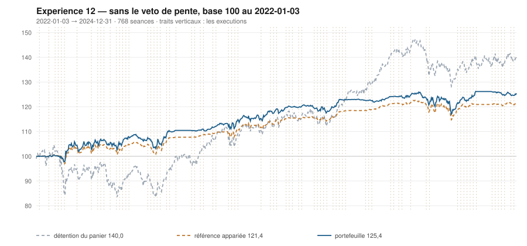

# 2024

> Journal de l'[expérience 12](../README.md) · 256 séances · **45 ordres** sur dix valeurs
> Portefeuille au 2024-12-31 : **12 544,85 €** (base 125,45) · appariée 121,40 · détention du panier 139,99

---

## Le portefeuille depuis le 2022-01-03

| | |
|---|---|
| Valeur au 1er jour de l'année | 12 291,50 € |
| Valeur au 2024-12-31 | **12 544,85 €** |
| Variation de l'année | **+2,06 %** |
| Espèces · titres | 7 828,11 € · 4 716,74 € |
| Part investie moyenne de l'année | 31,66 % |
| Lignes ouvertes au 2024-12-31 | 6 sur 10 |
| **Positions ouvertes que le veto aurait refusées** | **14** |

## Les ordres

| Exécution | Décision | Valeur | Sens | Rang | Quantité | Prix réel | Frais | Motif |
|---|---|---|---|---|---|---|---|---|
| 2024-01-22 | 2024-01-19 | `TTE.PA` | **REGLE-4** | 1 | 11 | 50,98 € | 2,33 € | TTE.PA : clôture 50,89 sous le seuil de la règle 4 (-2,18 s dans la bande) |
| 2024-01-22 | 2024-01-19 | `ENGI.PA` | **ACHAT** | 2 | 48 | 12,47 € | 2,48 € | ENGI.PA : clôture 12,44 sous le bord bas 12,67 (-1,83 s), TAUX_20 -0,134 %/séance — sans condition de pente |
| 2024-01-29 | 2024-01-26 | `ENGI.PA` | **REGLE-4** | 1 | 51 | 11,75 € | 2,49 € | ENGI.PA : clôture 11,72 sous le seuil de la règle 4 (-3,61 s dans la bande) |
| 2024-02-05 | 2024-02-02 | `EN.PA` | **ACHAT** | 1 | 20 | 29,22 € | 2,42 € | EN.PA : clôture 29,18 sous le bord bas 29,96 (-2,01 s), TAUX_20 -0,277 %/séance — sans condition de pente |
| 2024-03-18 | 2024-03-15 | `EN.PA` | **VENTE** | 1 | 20 | 32,15 € | 0,74 € | EN.PA : clôture 32,19 au-dessus du bord haut 32,03 (+1,17 s) |
| 2024-03-18 | 2024-03-15 | `TTE.PA` | **VENTE** | 2 | 22 | 54,56 € | 1,38 € | TTE.PA : clôture 54,56 au-dessus du bord haut 52,94 (+2,73 s) |
| 2024-03-25 | 2024-03-22 | `CAP.PA` | **ACHAT** | 1 | 3 | 200,31 € | 2,49 € | CAP.PA : clôture 200,97 sous le bord bas 206,97 (-2,24 s), TAUX_20 -0,117 %/séance — sans condition de pente |
| 2024-04-08 | 2024-04-05 | `PUB.PA` | **ACHAT** | 2 | 6 | 88,96 € | 2,22 € | PUB.PA : clôture 89,14 sous le bord bas 89,72 (-1,29 s), TAUX_20 +0,285 %/séance — sans condition de pente |
| 2024-04-15 | 2024-04-12 | `ENGI.PA` | **VENTE** | 1 | 99 | 12,68 € | 1,44 € | ENGI.PA : clôture 12,70 au-dessus du bord haut 12,60 (+1,21 s) |
| 2024-04-15 | 2024-04-12 | `AC.PA` | **ACHAT** | 1 | 16 | 36,95 € | 2,45 € | AC.PA : clôture 36,80 sous le bord bas 38,53 (-3,11 s), TAUX_20 -0,103 %/séance — sans condition de pente |
| 2024-04-15 | 2024-04-12 | `CAP.PA` | **REGLE-4** | 2 | 3 | 193,33 € | 2,41 € | CAP.PA : clôture 193,33 sous le seuil de la règle 4 (-2,59 s dans la bande) |
| 2024-04-15 | 2024-04-12 | `AIR.PA` | **ACHAT** | 4 | 4 | 154,96 € | 0,71 € | AIR.PA : clôture 153,75 sous le bord bas 154,21 (-1,14 s), TAUX_20 +0,007 %/séance — sans condition de pente |
| 2024-04-15 | 2024-04-12 | `SGO.PA` | **ACHAT** | 5 | 9 | 66,78 € | 2,49 € | SGO.PA : clôture 66,45 sous le bord bas 66,54 (-1,05 s), TAUX_20 +0,295 %/séance — sans condition de pente |
| 2024-05-06 | 2024-05-03 | `SGO.PA` | **VENTE** | 1 | 9 | 71,97 € | 0,74 € | SGO.PA : clôture 71,81 au-dessus du bord haut 70,67 (+1,63 s) |
| 2024-05-06 | 2024-05-03 | `AIR.PA` | **REGLE-4** | 1 | 4 | 148,48 € | 0,68 € | AIR.PA : clôture 148,21 sous le seuil de la règle 4 (-2,58 s dans la bande) |
| 2024-05-06 | 2024-05-03 | `SAF.PA` | **ACHAT** | 3 | 3 | 199,99 € | 2,49 € | SAF.PA : clôture 199,80 sous le bord bas 200,83 (-1,19 s), TAUX_20 +0,004 %/séance — sans condition de pente |
| 2024-06-10 | 2024-06-07 | `EN.PA` | **ACHAT** | 1 | 19 | 31,07 € | 2,45 € | EN.PA : clôture 31,53 sous le bord bas 31,95 (-1,50 s), TAUX_20 -0,096 %/séance — sans condition de pente |
| 2024-06-10 | 2024-06-07 | `TTE.PA` | **ACHAT** | 2 | 10 | 56,84 € | 2,36 € | TTE.PA : clôture 57,36 sous le bord bas 58,01 (-1,31 s), TAUX_20 -0,242 %/séance — sans condition de pente |
| 2024-06-17 | 2024-06-14 | `EN.PA` | **REGLE-4** | 1 | 21 | 28,03 € | 2,44 € | EN.PA : clôture 28,03 sous le seuil de la règle 4 (-3,92 s dans la bande) |
| 2024-06-17 | 2024-06-14 | `PUB.PA` | **REGLE-4** | 2 | 6 | 87,67 € | 2,18 € | PUB.PA : clôture 86,92 sous le seuil de la règle 4 (-3,72 s dans la bande) |
| 2024-06-17 | 2024-06-14 | `SAF.PA` | **REGLE-4** | 3 | 3 | 193,66 € | 2,41 € | SAF.PA : clôture 192,30 sous le seuil de la règle 4 (-3,64 s dans la bande) |
| 2024-06-17 | 2024-06-14 | `SGO.PA` | **ACHAT** | 4 | 8 | 69,19 € | 2,30 € | SGO.PA : clôture 68,62 sous le bord bas 72,78 (-2,95 s), TAUX_20 -0,271 %/séance — sans condition de pente |
| 2024-06-17 | 2024-06-14 | `TTE.PA` | **REGLE-4** | 5 | 11 | 54,09 € | 2,47 € | TTE.PA : clôture 54,26 sous le seuil de la règle 4 (-2,65 s dans la bande) |
| 2024-06-17 | 2024-06-14 | `AC.PA` | **REGLE-4** | 6 | 17 | 35,26 € | 2,49 € | AC.PA : clôture 35,00 sous le seuil de la règle 4 (-2,59 s dans la bande) |
| 2024-06-17 | 2024-06-14 | `ENGI.PA` | **ACHAT** | 7 | 51 | 11,62 € | 2,46 € | ENGI.PA : clôture 11,63 sous le bord bas 12,60 (-2,59 s), TAUX_20 -0,666 %/séance — sans condition de pente |
| 2024-08-19 | 2024-08-16 | `ENGI.PA` | **VENTE** | 1 | 51 | 13,67 € | 0,80 € | ENGI.PA : clôture 13,64 au-dessus du bord haut 13,54 (+1,16 s) |
| 2024-08-26 | 2024-08-23 | `AIR.PA` | **VENTE** | 1 | 8 | 135,26 € | 1,24 € | AIR.PA : clôture 135,21 au-dessus du bord haut 131,07 (+1,69 s) |
| 2024-09-02 | 2024-08-30 | `AC.PA` | **VENTE** | 1 | 33 | 36,00 € | 1,37 € | AC.PA : clôture 35,98 au-dessus du bord haut 34,92 (+1,83 s) |
| 2024-09-02 | 2024-08-30 | `EN.PA` | **VENTE** | 2 | 40 | 29,46 € | 1,36 € | EN.PA : clôture 29,50 au-dessus du bord haut 29,21 (+1,26 s) |
| 2024-09-02 | 2024-08-30 | `CAP.PA` | **VENTE** | 3 | 6 | 177,66 € | 1,23 € | CAP.PA : clôture 177,57 au-dessus du bord haut 174,22 (+1,62 s) |
| 2024-09-09 | 2024-09-06 | `MC.PA` | **ACHAT** | 1 | 1 | 582,62 € | 2,42 € | MC.PA : clôture 582,62 sous le bord bas 584,00 (-1,08 s), TAUX_20 -0,051 %/séance — sans condition de pente |
| 2024-09-16 | 2024-09-13 | `SAF.PA` | **VENTE** | 1 | 6 | 198,02 € | 1,37 € | SAF.PA : clôture 198,80 au-dessus du bord haut 195,92 (+1,62 s) |
| 2024-09-23 | 2024-09-20 | `TTE.PA` | **VENTE** | 1 | 21 | 55,98 € | 1,35 € | TTE.PA : clôture 55,46 au-dessus du bord haut 54,94 (+1,48 s) |
| 2024-09-23 | 2024-09-20 | `PUB.PA` | **VENTE** | 2 | 12 | 91,49 € | 1,26 € | PUB.PA : clôture 91,36 au-dessus du bord haut 90,10 (+1,52 s) |
| 2024-09-23 | 2024-09-20 | `SGO.PA` | **VENTE** | 3 | 8 | 78,68 € | 0,72 € | SGO.PA : clôture 79,14 au-dessus du bord haut 77,57 (+1,56 s) |
| 2024-09-23 | 2024-09-20 | `MC.PA` | **REGLE-4** | 1 | 1 | 561,67 € | 2,33 € | MC.PA : clôture 563,48 sous le seuil de la règle 4 (-1,03 s dans la bande) |
| 2024-09-30 | 2024-09-27 | `MC.PA` | **VENTE** | 1 | 2 | 665,82 € | 1,53 € | MC.PA : clôture 669,63 au-dessus du bord haut 599,28 (+4,38 s) |
| 2024-11-04 | 2024-11-01 | `CAP.PA` | **ACHAT** | 1 | 4 | 154,79 € | 2,57 € | CAP.PA : clôture 155,31 sous le bord bas 163,16 (-2,15 s), TAUX_20 -0,554 %/séance — sans condition de pente |
| 2024-11-04 | 2024-11-01 | `TTE.PA` | **ACHAT** | 2 | 11 | 52,55 € | 2,40 € | TTE.PA : clôture 52,46 sous le bord bas 52,85 (-1,35 s), TAUX_20 -0,378 %/séance — sans condition de pente |
| 2024-11-11 | 2024-11-08 | `ENGI.PA` | **ACHAT** | 1 | 46 | 13,39 € | 2,56 € | ENGI.PA : clôture 13,31 sous le bord bas 13,46 (-1,26 s), TAUX_20 -0,319 %/séance — sans condition de pente |
| 2024-11-18 | 2024-11-15 | `CAP.PA` | **REGLE-4** | 1 | 4 | 145,84 € | 2,42 € | CAP.PA : clôture 146,17 sous le seuil de la règle 4 (-2,51 s dans la bande) |
| 2024-11-25 | 2024-11-22 | `EN.PA` | **ACHAT** | 1 | 23 | 26,38 € | 2,52 € | EN.PA : clôture 26,21 sous le bord bas 26,22 (-1,02 s), TAUX_20 -0,126 %/séance — sans condition de pente |
| 2024-12-02 | 2024-11-29 | `TTE.PA` | **REGLE-4** | 1 | 12 | 49,11 € | 2,45 € | TTE.PA : clôture 49,80 sous le seuil de la règle 4 (-1,83 s dans la bande) |
| 2024-12-16 | 2024-12-13 | `SAF.PA` | **ACHAT** | 1 | 3 | 203,88 € | 2,54 € | SAF.PA : clôture 204,47 sous le bord bas 206,93 (-1,40 s), TAUX_20 -0,261 %/séance — sans condition de pente |
| 2024-12-23 | 2024-12-20 | `SGO.PA` | **ACHAT** | 1 | 7 | 80,62 € | 2,34 € | SGO.PA : clôture 80,92 sous le bord bas 82,14 (-1,57 s), TAUX_20 +0,081 %/séance — sans condition de pente |

## Les positions touchant l'année

| Valeur | Achat | Sortie | Tr. | Titres | Prix moyen | Sortie | +/− value | `TAUX_20` à l'achat | Contribution | Séances |
|---|---|---|---|---|---|---|---|---|---|---|
| `TTE.PA` | 2023-11-13 | 2024-03-18 | 2 | 22 | 52,27 € | 54,56 € | **+4,37 %** | -0,113 ⚠️ | +44,14 € | 88 |
| `ENGI.PA` | 2024-01-22 | 2024-04-15 | 2 | 99 | 12,10 € | 12,68 € | **+4,81 %** | -0,134 ⚠️ | +51,17 € | 59 |
| `EN.PA` | 2024-02-05 | 2024-03-18 | 1 | 20 | 29,22 € | 32,15 € | **+10,04 %** | -0,277 ⚠️ | +55,51 € | 31 |
| `CAP.PA` | 2024-03-25 | 2024-09-02 | 2 | 6 | 196,82 € | 177,66 € | **-9,73 %** | -0,117 ⚠️ | -121,08 € | 113 |
| `PUB.PA` | 2024-04-08 | 2024-09-23 | 2 | 12 | 88,31 € | 91,49 € | **+3,60 %** | +0,285 | +32,49 € | 120 |
| `AC.PA` | 2024-04-15 | 2024-09-02 | 2 | 33 | 36,08 € | 36,00 € | **-0,23 %** | -0,103 ⚠️ | -9,04 € | 100 |
| `AIR.PA` | 2024-04-15 | 2024-08-26 | 2 | 8 | 151,72 € | 135,26 € | **-10,85 %** | +0,007 | -134,27 € | 95 |
| `SGO.PA` | 2024-04-15 | 2024-05-06 | 1 | 9 | 66,78 € | 71,97 € | **+7,78 %** | +0,295 | +43,50 € | 15 |
| `SAF.PA` | 2024-05-06 | 2024-09-16 | 2 | 6 | 196,83 € | 198,02 € | **+0,60 %** | +0,004 | +0,86 € | 96 |
| `EN.PA` | 2024-06-10 | 2024-09-02 | 2 | 40 | 29,48 € | 29,46 € | **-0,05 %** | -0,096 ⚠️ | -6,85 € | 61 |
| `TTE.PA` | 2024-06-10 | 2024-09-23 | 2 | 21 | 55,40 € | 55,98 € | **+1,05 %** | -0,242 ⚠️ | +6,08 € | 76 |
| `SGO.PA` | 2024-06-17 | 2024-09-23 | 1 | 8 | 69,19 € | 78,68 € | **+13,72 %** | -0,271 ⚠️ | +72,91 € | 71 |
| `ENGI.PA` | 2024-06-17 | 2024-08-19 | 1 | 51 | 11,62 € | 13,67 € | **+17,70 %** | -0,666 ⚠️ | +101,58 € | 46 |
| `MC.PA` | 2024-09-09 | 2024-09-30 | 2 | 2 | 572,15 € | 665,82 € | **+16,37 %** | -0,051 ⚠️ | +181,07 € | 16 |
| `CAP.PA` | 2024-11-04 | 2025-01-27 | 2 | 8 | 150,31 € | 155,12 € | **+3,20 %** | -0,554 ⚠️ | +32,03 € | 58 |
| `TTE.PA` | 2024-11-04 | 2025-01-13 | 2 | 23 | 50,76 € | 51,24 € | **+0,95 %** | -0,378 ⚠️ | +4,94 € | 48 |
| `ENGI.PA` | 2024-11-11 | 2025-01-20 | 1 | 46 | 13,39 € | 14,07 € | **+5,04 %** | -0,319 ⚠️ | +27,75 € | 48 |
| `EN.PA` | 2024-11-25 | 2025-01-06 | 1 | 23 | 26,38 € | 26,37 € | **-0,03 %** | -0,126 ⚠️ | -3,42 € | 28 |
| `SAF.PA` | 2024-12-16 | 2025-01-27 | 1 | 3 | 203,88 € | 229,31 € | **+12,47 %** | -0,261 ⚠️ | +72,94 € | 28 |
| `SGO.PA` | 2024-12-23 | 2025-02-10 | 1 | 7 | 80,62 € | 88,76 € | **+10,10 %** | +0,081 | +53,95 € | 33 |

## Les décisions de l'année

| Mesure | Valeur |
|---|---|
| Décisions hebdomadaires | 52 |
| Évaluations, dix valeurs | 520 |
| **Sous le bord bas — toutes achetables** | **149** |
| … dont `TAUX_20 ≥ 0` — le veto les aurait seules gardées | 24 |
| Au-dessus du bord haut | 145 |

## La lecture de l'année

Le portefeuille termine l'année à 12 544,85 €, soit +2,06 % sur l'année. Les 45 ordres ont porté sur 10 valeurs — AC.PA, AIR.PA, CAP.PA, EN.PA, ENGI.PA, MC.PA, PUB.PA, SAF.PA, SGO.PA, TTE.PA — pour 88,31 € de frais. 14 positions ont été ouvertes sur une pente courte négative — le veto de l'expérience 11 les aurait refusées. Depuis le début, le portefeuille est devant sa référence à exposition appariée de 4,05 point.

---

[← 2023](2023.md) · [Protocole](../README.md) · [2025 →](2025.md)
