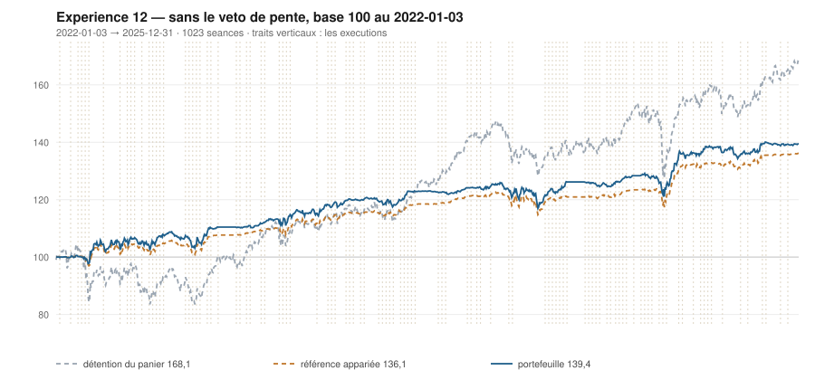

# 2025

> Journal de l'[expérience 12](../README.md) · 255 séances · **47 ordres** sur dix valeurs
> Portefeuille au 2025-12-31 : **13 943,11 €** (base 139,43) · appariée 136,11 · détention du panier 168,09

---

## Le portefeuille depuis le 2022-01-03

| | |
|---|---|
| Valeur au 1er jour de l'année | 12 544,85 € |
| Valeur au 2025-12-31 | **13 943,11 €** |
| Variation de l'année | **+11,15 %** |
| Espèces · titres | 12 186,11 € · 1 756,99 € |
| Part investie moyenne de l'année | 30,19 % |
| Lignes ouvertes au 2025-12-31 | 2 sur 10 |
| **Positions ouvertes que le veto aurait refusées** | **13** |

## Les ordres

| Exécution | Décision | Valeur | Sens | Rang | Quantité | Prix réel | Frais | Motif |
|---|---|---|---|---|---|---|---|---|
| 2025-01-06 | 2025-01-03 | `EN.PA` | **VENTE** | 1 | 23 | 26,37 € | 0,70 € | EN.PA : clôture 26,15 au-dessus du bord haut 26,14 (+1,02 s) |
| 2025-01-06 | 2025-01-03 | `PUB.PA` | **ACHAT** | 1 | 6 | 92,85 € | 2,31 € | PUB.PA : clôture 92,48 sous le bord bas 93,48 (-1,45 s), TAUX_20 -0,089 %/séance — sans condition de pente |
| 2025-01-13 | 2025-01-10 | `TTE.PA` | **VENTE** | 1 | 23 | 51,24 € | 1,36 € | TTE.PA : clôture 50,81 au-dessus du bord haut 50,42 (+1,24 s) |
| 2025-01-20 | 2025-01-17 | `ENGI.PA` | **VENTE** | 1 | 46 | 14,07 € | 0,74 € | ENGI.PA : clôture 14,10 au-dessus du bord haut 13,80 (+1,95 s) |
| 2025-01-27 | 2025-01-24 | `SAF.PA` | **VENTE** | 1 | 3 | 229,31 € | 0,79 € | SAF.PA : clôture 231,26 au-dessus du bord haut 225,62 (+1,96 s) |
| 2025-01-27 | 2025-01-24 | `CAP.PA` | **VENTE** | 2 | 8 | 155,12 € | 1,43 € | CAP.PA : clôture 158,62 au-dessus du bord haut 151,70 (+1,84 s) |
| 2025-02-10 | 2025-02-07 | `PUB.PA` | **VENTE** | 1 | 6 | 98,51 € | 0,68 € | PUB.PA : clôture 98,28 au-dessus du bord haut 97,49 (+1,36 s) |
| 2025-02-10 | 2025-02-07 | `SGO.PA` | **VENTE** | 2 | 7 | 88,76 € | 0,71 € | SGO.PA : clôture 88,82 au-dessus du bord haut 87,73 (+1,51 s) |
| 2025-02-24 | 2025-02-21 | `AC.PA` | **ACHAT** | 1 | 14 | 43,46 € | 2,52 € | AC.PA : clôture 43,88 sous le bord bas 46,91 (-4,59 s), TAUX_20 -0,122 %/séance — sans condition de pente |
| 2025-02-24 | 2025-02-21 | `AIR.PA` | **ACHAT** | 2 | 4 | 154,85 € | 0,71 € | AIR.PA : clôture 153,64 sous le bord bas 159,65 (-2,49 s), TAUX_20 +0,035 %/séance — sans condition de pente |
| 2025-03-03 | 2025-02-28 | `PUB.PA` | **ACHAT** | 1 | 7 | 88,09 € | 2,56 € | PUB.PA : clôture 87,92 sous le bord bas 93,27 (-3,28 s), TAUX_20 -0,365 %/séance — sans condition de pente |
| 2025-03-10 | 2025-03-07 | `MC.PA` | **ACHAT** | 1 | 1 | 611,33 € | 2,54 € | MC.PA : clôture 609,89 sous le bord bas 629,68 (-1,58 s), TAUX_20 -0,302 %/séance — sans condition de pente |
| 2025-03-17 | 2025-03-14 | `AC.PA` | **REGLE-4** | 1 | 15 | 42,24 € | 2,63 € | AC.PA : clôture 42,23 sous le seuil de la règle 4 (-3,05 s dans la bande) |
| 2025-03-17 | 2025-03-14 | `PUB.PA` | **REGLE-4** | 2 | 7 | 84,37 € | 2,45 € | PUB.PA : clôture 84,15 sous le seuil de la règle 4 (-2,47 s dans la bande) |
| 2025-03-31 | 2025-03-28 | `MC.PA` | **REGLE-4** | 1 | 1 | 557,33 € | 2,31 € | MC.PA : clôture 564,15 sous le seuil de la règle 4 (-2,06 s dans la bande) |
| 2025-04-07 | 2025-04-04 | `AIR.PA` | **REGLE-4** | 1 | 4 | 126,97 € | 0,58 € | AIR.PA : clôture 141,06 sous le seuil de la règle 4 (-4,72 s dans la bande) |
| 2025-04-07 | 2025-04-04 | `SGO.PA` | **ACHAT** | 2 | 8 | 68,81 € | 2,28 € | SGO.PA : clôture 77,62 sous le bord bas 89,21 (-4,24 s), TAUX_20 -0,667 %/séance — sans condition de pente |
| 2025-04-07 | 2025-04-04 | `SAF.PA` | **ACHAT** | 3 | 3 | 192,15 € | 2,39 € | SAF.PA : clôture 213,47 sous le bord bas 238,23 (-3,87 s), TAUX_20 -0,240 %/séance — sans condition de pente |
| 2025-04-07 | 2025-04-04 | `CAP.PA` | **ACHAT** | 4 | 5 | 106,63 € | 2,21 € | CAP.PA : clôture 121,55 sous le bord bas 132,72 (-2,09 s), TAUX_20 -0,497 %/séance — sans condition de pente |
| 2025-04-07 | 2025-04-04 | `TTE.PA` | **ACHAT** | 5 | 13 | 46,20 € | 2,49 € | TTE.PA : clôture 49,46 sous le bord bas 50,91 (-1,67 s), TAUX_20 +0,202 %/séance — sans condition de pente |
| 2025-04-14 | 2025-04-11 | `SAF.PA` | **REGLE-4** | 1 | 3 | 204,67 € | 2,55 € | SAF.PA : clôture 200,17 sous le seuil de la règle 4 (-3,37 s dans la bande) |
| 2025-04-14 | 2025-04-11 | `TTE.PA` | **REGLE-4** | 2 | 13 | 46,27 € | 2,50 € | TTE.PA : clôture 45,36 sous le seuil de la règle 4 (-2,84 s dans la bande) |
| 2025-05-12 | 2025-05-09 | `PUB.PA` | **VENTE** | 1 | 14 | 85,47 € | 1,38 € | PUB.PA : clôture 84,86 au-dessus du bord haut 84,73 (+1,03 s) |
| 2025-05-19 | 2025-05-16 | `AC.PA` | **VENTE** | 1 | 29 | 44,67 € | 1,49 € | AC.PA : clôture 44,75 au-dessus du bord haut 43,96 (+1,27 s) |
| 2025-06-09 | 2025-06-06 | `CAP.PA` | **VENTE** | 1 | 5 | 145,66 € | 0,84 € | CAP.PA : clôture 145,81 au-dessus du bord haut 144,14 (+1,14 s) |
| 2025-06-09 | 2025-06-06 | `EN.PA` | **ACHAT** | 1 | 18 | 36,57 € | 2,73 € | EN.PA : clôture 36,53 sous le bord bas 37,17 (-1,79 s), TAUX_20 +0,015 %/séance — sans condition de pente |
| 2025-06-23 | 2025-06-20 | `TTE.PA` | **VENTE** | 1 | 26 | 52,16 € | 1,56 € | TTE.PA : clôture 51,75 au-dessus du bord haut 51,21 (+1,23 s) |
| 2025-06-23 | 2025-06-20 | `AIR.PA` | **VENTE** | 2 | 8 | 163,50 € | 1,50 € | AIR.PA : clôture 164,46 au-dessus du bord haut 163,88 (+1,06 s) |
| 2025-06-23 | 2025-06-20 | `EN.PA` | **REGLE-4** | 1 | 19 | 35,25 € | 2,78 € | EN.PA : clôture 35,53 sous le seuil de la règle 4 (-2,92 s dans la bande) |
| 2025-06-30 | 2025-06-27 | `SAF.PA` | **VENTE** | 1 | 6 | 270,96 € | 1,87 € | SAF.PA : clôture 269,18 au-dessus du bord haut 268,04 (+1,08 s) |
| 2025-07-07 | 2025-07-04 | `MC.PA` | **VENTE** | 1 | 2 | 466,31 € | 1,07 € | MC.PA : clôture 465,67 au-dessus du bord haut 436,05 (+1,95 s) |
| 2025-07-14 | 2025-07-11 | `ENGI.PA` | **ACHAT** | 1 | 36 | 18,81 € | 2,81 € | ENGI.PA : clôture 18,73 sous le bord bas 19,09 (-2,16 s), TAUX_20 +0,015 %/séance — sans condition de pente |
| 2025-08-04 | 2025-08-01 | `ENGI.PA` | **REGLE-4** | 1 | 37 | 18,22 € | 2,80 € | ENGI.PA : clôture 18,22 sous le seuil de la règle 4 (-3,11 s dans la bande) |
| 2025-08-04 | 2025-08-01 | `PUB.PA` | **ACHAT** | 2 | 8 | 76,28 € | 2,53 € | PUB.PA : clôture 76,20 sous le bord bas 77,44 (-1,23 s), TAUX_20 -0,708 %/séance — sans condition de pente |
| 2025-08-04 | 2025-08-01 | `CAP.PA` | **ACHAT** | 3 | 5 | 121,25 € | 2,52 € | CAP.PA : clôture 120,57 sous le bord bas 122,40 (-1,17 s), TAUX_20 -0,494 %/séance — sans condition de pente |
| 2025-08-04 | 2025-08-01 | `AC.PA` | **ACHAT** | 4 | 16 | 41,25 € | 2,74 € | AC.PA : clôture 41,07 sous le bord bas 41,56 (-1,16 s), TAUX_20 -0,023 %/séance — sans condition de pente |
| 2025-09-08 | 2025-09-05 | `SAF.PA` | **ACHAT** | 1 | 2 | 276,99 € | 2,30 € | SAF.PA : clôture 275,11 sous le bord bas 281,87 (-1,56 s), TAUX_20 -0,217 %/séance — sans condition de pente |
| 2025-09-22 | 2025-09-19 | `TTE.PA` | **ACHAT** | 1 | 13 | 48,82 € | 2,63 € | TTE.PA : clôture 48,82 sous le bord bas 49,16 (-1,25 s), TAUX_20 -0,179 %/séance — sans condition de pente |
| 2025-10-20 | 2025-10-17 | `ENGI.PA` | **VENTE** | 1 | 73 | 18,66 € | 1,57 € | ENGI.PA : clôture 18,71 au-dessus du bord haut 18,28 (+1,66 s) |
| 2025-10-20 | 2025-10-17 | `EN.PA` | **VENTE** | 2 | 37 | 39,59 € | 1,68 € | EN.PA : clôture 39,59 au-dessus du bord haut 37,33 (+3,24 s) |
| 2025-10-20 | 2025-10-17 | `PUB.PA` | **VENTE** | 3 | 8 | 82,48 € | 0,76 € | PUB.PA : clôture 82,27 au-dessus du bord haut 78,59 (+2,05 s) |
| 2025-10-20 | 2025-10-17 | `CAP.PA` | **VENTE** | 4 | 5 | 119,12 € | 0,68 € | CAP.PA : clôture 117,91 au-dessus du bord haut 117,80 (+1,02 s) |
| 2025-10-27 | 2025-10-24 | `AC.PA` | **VENTE** | 1 | 16 | 43,69 € | 0,80 € | AC.PA : clôture 43,88 au-dessus du bord haut 41,84 (+2,05 s) |
| 2025-10-27 | 2025-10-24 | `TTE.PA` | **VENTE** | 2 | 13 | 51,79 € | 0,77 € | TTE.PA : clôture 51,89 au-dessus du bord haut 51,10 (+1,82 s) |
| 2025-11-24 | 2025-11-21 | `AIR.PA` | **ACHAT** | 1 | 3 | 199,56 € | 0,69 € | AIR.PA : clôture 199,07 sous le bord bas 203,28 (-1,85 s), TAUX_20 -0,181 %/séance — sans condition de pente |
| 2025-12-08 | 2025-12-05 | `SGO.PA` | **VENTE** | 1 | 8 | 83,81 € | 0,77 € | SGO.PA : clôture 84,16 au-dessus du bord haut 82,99 (+1,44 s) |
| 2025-12-08 | 2025-12-05 | `AIR.PA` | **REGLE-4** | 1 | 3 | 193,62 € | 0,67 € | AIR.PA : clôture 193,13 sous le seuil de la règle 4 (-2,25 s dans la bande) |

## Les positions touchant l'année

| Valeur | Achat | Sortie | Tr. | Titres | Prix moyen | Sortie | +/− value | `TAUX_20` à l'achat | Contribution | Séances |
|---|---|---|---|---|---|---|---|---|---|---|
| `CAP.PA` | 2024-11-04 | 2025-01-27 | 2 | 8 | 150,31 € | 155,12 € | **+3,20 %** | -0,554 ⚠️ | +32,03 € | 58 |
| `TTE.PA` | 2024-11-04 | 2025-01-13 | 2 | 23 | 50,76 € | 51,24 € | **+0,95 %** | -0,378 ⚠️ | +4,94 € | 48 |
| `ENGI.PA` | 2024-11-11 | 2025-01-20 | 1 | 46 | 13,39 € | 14,07 € | **+5,04 %** | -0,319 ⚠️ | +27,75 € | 48 |
| `EN.PA` | 2024-11-25 | 2025-01-06 | 1 | 23 | 26,38 € | 26,37 € | **-0,03 %** | -0,126 ⚠️ | -3,42 € | 28 |
| `SAF.PA` | 2024-12-16 | 2025-01-27 | 1 | 3 | 203,88 € | 229,31 € | **+12,47 %** | -0,261 ⚠️ | +72,94 € | 28 |
| `SGO.PA` | 2024-12-23 | 2025-02-10 | 1 | 7 | 80,62 € | 88,76 € | **+10,10 %** | +0,081 | +53,95 € | 33 |
| `PUB.PA` | 2025-01-06 | 2025-02-10 | 1 | 6 | 92,85 € | 98,51 € | **+6,10 %** | -0,089 ⚠️ | +30,98 € | 26 |
| `AC.PA` | 2025-02-24 | 2025-05-19 | 2 | 29 | 42,83 € | 44,67 € | **+4,30 %** | -0,122 ⚠️ | +46,73 € | 58 |
| `AIR.PA` | 2025-02-24 | 2025-06-23 | 2 | 8 | 140,91 € | 163,50 € | **+16,03 %** | +0,035 | +177,91 € | 83 |
| `PUB.PA` | 2025-03-03 | 2025-05-12 | 2 | 14 | 86,23 € | 85,47 € | **-0,88 %** | -0,365 ⚠️ | -16,95 € | 48 |
| `MC.PA` | 2025-03-10 | 2025-07-07 | 2 | 2 | 584,33 € | 466,31 € | **-20,20 %** | -0,302 ⚠️ | -241,97 € | 83 |
| `SGO.PA` | 2025-04-07 | 2025-12-08 | 1 | 8 | 68,81 € | 83,81 € | **+21,79 %** | -0,667 ⚠️ | +116,91 € | 173 |
| `SAF.PA` | 2025-04-07 | 2025-06-30 | 2 | 6 | 198,41 € | 270,96 € | **+36,57 %** | -0,240 ⚠️ | +428,48 € | 58 |
| `CAP.PA` | 2025-04-07 | 2025-06-09 | 1 | 5 | 106,63 € | 145,66 € | **+36,60 %** | -0,497 ⚠️ | +192,10 € | 43 |
| `TTE.PA` | 2025-04-07 | 2025-06-23 | 2 | 26 | 46,23 € | 52,16 € | **+12,81 %** | +0,202 | +147,48 € | 53 |
| `EN.PA` | 2025-06-09 | 2025-10-20 | 2 | 37 | 35,89 € | 39,59 € | **+10,31 %** | +0,015 | +129,77 € | 96 |
| `ENGI.PA` | 2025-07-14 | 2025-10-20 | 2 | 73 | 18,51 € | 18,66 € | **+0,82 %** | +0,015 | +3,89 € | 71 |
| `PUB.PA` | 2025-08-04 | 2025-10-20 | 1 | 8 | 76,28 € | 82,48 € | **+8,13 %** | -0,708 ⚠️ | +46,30 € | 56 |
| `CAP.PA` | 2025-08-04 | 2025-10-20 | 1 | 5 | 121,25 € | 119,12 € | **-1,76 %** | -0,494 ⚠️ | -13,86 € | 56 |
| `AC.PA` | 2025-08-04 | 2025-10-27 | 1 | 16 | 41,25 € | 43,69 € | **+5,91 %** | -0,023 ⚠️ | +35,46 € | 61 |
| `SAF.PA` | 2025-09-08 | 2026-01-12 | 1 | 2 | 276,99 € | 313,08 € | **+13,03 %** | -0,217 ⚠️ | +69,17 € | 88 |
| `TTE.PA` | 2025-09-22 | 2025-10-27 | 1 | 13 | 48,82 € | 51,79 € | **+6,09 %** | -0,179 ⚠️ | +35,22 € | 26 |
| `AIR.PA` | 2025-11-24 | 2026-04-20 | 2 | 6 | 196,59 € | 173,34 € | **-11,83 %** | -0,181 ⚠️ | -142,08 € | 101 |

## Les décisions de l'année

| Mesure | Valeur |
|---|---|
| Décisions hebdomadaires | 52 |
| Évaluations, dix valeurs | 520 |
| **Sous le bord bas — toutes achetables** | **120** |
| … dont `TAUX_20 ≥ 0` — le veto les aurait seules gardées | 15 |
| Au-dessus du bord haut | 157 |

## La lecture de l'année

Le portefeuille termine l'année à 13 943,11 €, soit +11,15 % sur l'année. Les 47 ordres ont porté sur 10 valeurs — AC.PA, AIR.PA, CAP.PA, EN.PA, ENGI.PA, MC.PA, PUB.PA, SAF.PA, SGO.PA, TTE.PA — pour 81,41 € de frais. 13 positions ont été ouvertes sur une pente courte négative — le veto de l'expérience 11 les aurait refusées. Depuis le début, le portefeuille est devant sa référence à exposition appariée de 3,32 point.

---

[← 2024](2024.md) · [Protocole](../README.md) · [2026 →](2026.md)
