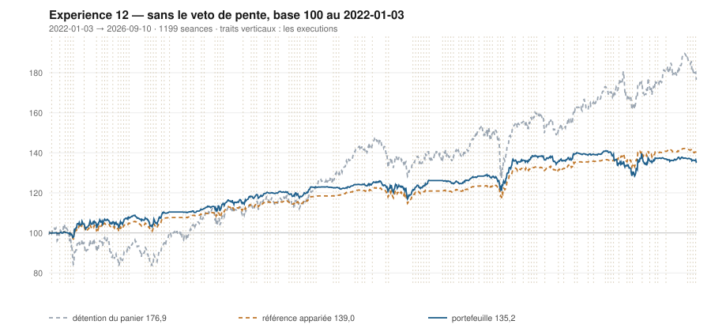

# 2026

> Journal de l'[expérience 12](../README.md) · 176 séances · **34 ordres** sur dix valeurs
> Portefeuille au 2026-09-10 : **13 517,28 €** (base 135,17) · appariée 139,02 · détention du panier 176,91

---

## Le portefeuille depuis le 2022-01-03

| | |
|---|---|
| Valeur au 1er jour de l'année | 13 943,11 € |
| Valeur au 2026-09-10 | **13 517,28 €** |
| Variation de l'année | **-3,05 %** |
| Espèces · titres | 6 249,25 € · 7 268,03 € |
| Part investie moyenne de l'année | 33,02 % |
| Lignes ouvertes au 2026-09-10 | 8 sur 10 |
| **Positions ouvertes que le veto aurait refusées** | **11** |

## Les ordres

| Exécution | Décision | Valeur | Sens | Rang | Quantité | Prix réel | Frais | Motif |
|---|---|---|---|---|---|---|---|---|
| 2026-01-12 | 2026-01-09 | `SAF.PA` | **VENTE** | 1 | 2 | 313,08 € | 0,72 € | SAF.PA : clôture 313,77 au-dessus du bord haut 309,73 (+1,53 s) |
| 2026-01-19 | 2026-01-16 | `MC.PA` | **ACHAT** | 1 | 1 | 575,61 € | 2,39 € | MC.PA : clôture 599,43 sous le bord bas 640,27 (-2,89 s), TAUX_20 +0,010 %/séance — sans condition de pente |
| 2026-01-19 | 2026-01-16 | `PUB.PA` | **ACHAT** | 2 | 8 | 81,77 € | 2,71 € | PUB.PA : clôture 82,54 sous le bord bas 83,31 (-1,44 s), TAUX_20 -0,148 %/séance — sans condition de pente |
| 2026-01-26 | 2026-01-23 | `CAP.PA` | **ACHAT** | 1 | 5 | 132,10 € | 2,74 € | CAP.PA : clôture 132,10 sous le bord bas 134,93 (-1,57 s), TAUX_20 -0,283 %/séance — sans condition de pente |
| 2026-02-02 | 2026-01-30 | `MC.PA` | **REGLE-4** | 1 | 1 | 538,22 € | 2,23 € | MC.PA : clôture 538,13 sous le seuil de la règle 4 (-3,13 s dans la bande) |
| 2026-02-02 | 2026-01-30 | `CAP.PA` | **REGLE-4** | 2 | 5 | 127,89 € | 2,65 € | CAP.PA : clôture 127,11 sous le seuil de la règle 4 (-2,26 s dans la bande) |
| 2026-02-02 | 2026-01-30 | `PUB.PA` | **REGLE-4** | 3 | 8 | 80,59 € | 2,68 € | PUB.PA : clôture 80,55 sous le seuil de la règle 4 (-2,10 s dans la bande) |
| 2026-02-02 | 2026-01-30 | `AC.PA` | **ACHAT** | 4 | 15 | 44,68 € | 2,78 € | AC.PA : clôture 44,54 sous le bord bas 44,72 (-1,10 s), TAUX_20 -0,253 %/séance — sans condition de pente |
| 2026-02-02 | 2026-01-30 | `SAF.PA` | **ACHAT** | 5 | 2 | 293,50 € | 2,44 € | SAF.PA : clôture 297,66 sous le bord bas 298,31 (-1,08 s), TAUX_20 -0,303 %/séance — sans condition de pente |
| 2026-02-16 | 2026-02-13 | `SAF.PA` | **VENTE** | 1 | 2 | 327,03 € | 0,75 € | SAF.PA : clôture 329,10 au-dessus du bord haut 316,88 (+2,43 s) |
| 2026-03-09 | 2026-03-06 | `AC.PA` | **REGLE-4** | 1 | 16 | 40,80 € | 2,71 € | AC.PA : clôture 42,09 sous le seuil de la règle 4 (-3,40 s dans la bande) |
| 2026-03-09 | 2026-03-06 | `SGO.PA` | **ACHAT** | 2 | 9 | 69,37 € | 2,59 € | SGO.PA : clôture 71,86 sous le bord bas 77,36 (-2,62 s), TAUX_20 -0,817 %/séance — sans condition de pente |
| 2026-03-09 | 2026-03-06 | `EN.PA` | **ACHAT** | 3 | 14 | 45,62 € | 2,65 € | EN.PA : clôture 46,91 sous le bord bas 47,23 (-1,29 s), TAUX_20 +0,191 %/séance — sans condition de pente |
| 2026-03-09 | 2026-03-06 | `ENGI.PA` | **ACHAT** | 4 | 27 | 24,49 € | 2,74 € | ENGI.PA : clôture 25,08 sous le bord bas 25,24 (-1,25 s), TAUX_20 +0,295 %/séance — sans condition de pente |
| 2026-03-16 | 2026-03-13 | `SAF.PA` | **ACHAT** | 1 | 2 | 300,62 € | 2,50 € | SAF.PA : clôture 301,02 sous le bord bas 307,59 (-1,57 s), TAUX_20 -0,647 %/séance — sans condition de pente |
| 2026-03-23 | 2026-03-20 | `SAF.PA` | **REGLE-4** | 1 | 2 | 273,43 € | 2,27 € | SAF.PA : clôture 278,47 sous le seuil de la règle 4 (-3,02 s dans la bande) |
| 2026-03-23 | 2026-03-20 | `SGO.PA` | **REGLE-4** | 2 | 9 | 65,01 € | 2,43 € | SGO.PA : clôture 66,05 sous le seuil de la règle 4 (-2,60 s dans la bande) |
| 2026-04-20 | 2026-04-17 | `AIR.PA` | **VENTE** | 1 | 6 | 173,34 € | 1,20 € | AIR.PA : clôture 176,22 au-dessus du bord haut 175,12 (+1,12 s) |
| 2026-04-20 | 2026-04-17 | `PUB.PA` | **VENTE** | 2 | 16 | 75,92 € | 1,40 € | PUB.PA : clôture 76,76 au-dessus du bord haut 72,85 (+2,01 s) |
| 2026-04-20 | 2026-04-17 | `SGO.PA` | **VENTE** | 3 | 18 | 76,96 € | 1,59 € | SGO.PA : clôture 79,02 au-dessus du bord haut 78,70 (+1,06 s) |
| 2026-05-11 | 2026-05-08 | `MC.PA` | **VENTE** | 1 | 2 | 470,35 € | 1,08 € | MC.PA : clôture 472,70 au-dessus du bord haut 462,32 (+1,40 s) |
| 2026-05-11 | 2026-05-08 | `TTE.PA` | **ACHAT** | 1 | 8 | 75,56 € | 2,51 € | TTE.PA : clôture 74,87 sous le bord bas 75,89 (-1,34 s), TAUX_20 +0,015 %/séance — sans condition de pente |
| 2026-05-25 | 2026-05-22 | `AC.PA` | **VENTE** | 1 | 31 | 44,39 € | 1,58 € | AC.PA : clôture 43,49 au-dessus du bord haut 43,47 (+1,01 s) |
| 2026-05-25 | 2026-05-22 | `CAP.PA` | **VENTE** | 2 | 10 | 100,95 € | 1,16 € | CAP.PA : clôture 99,89 au-dessus du bord haut 96,14 (+1,41 s) |
| 2026-06-01 | 2026-05-29 | `SAF.PA` | **VENTE** | 1 | 4 | 302,50 € | 1,39 € | SAF.PA : clôture 305,70 au-dessus du bord haut 304,95 (+1,04 s) |
| 2026-06-22 | 2026-06-19 | `TTE.PA` | **REGLE-4** | 1 | 9 | 70,50 € | 2,63 € | TTE.PA : clôture 70,19 sous le seuil de la règle 4 (-2,77 s dans la bande) |
| 2026-08-17 | 2026-08-14 | `MC.PA` | **ACHAT** | 1 | 1 | 456,00 € | 1,89 € | MC.PA : clôture 458,40 sous le bord bas 460,51 (-1,11 s), TAUX_20 -0,021 %/séance — sans condition de pente |
| 2026-08-24 | 2026-08-21 | `AC.PA` | **ACHAT** | 1 | 14 | 45,60 € | 2,65 € | AC.PA : clôture 45,53 sous le bord bas 46,77 (-1,59 s), TAUX_20 -0,093 %/séance — sans condition de pente |
| 2026-08-31 | 2026-08-28 | `EN.PA` | **REGLE-4** | 1 | 15 | 44,10 € | 2,75 € | EN.PA : clôture 44,08 sous le seuil de la règle 4 (-2,39 s dans la bande) |
| 2026-08-31 | 2026-08-28 | `AIR.PA` | **ACHAT** | 2 | 3 | 202,75 € | 0,70 € | AIR.PA : clôture 203,05 sous le bord bas 206,04 (-1,45 s), TAUX_20 -0,296 %/séance — sans condition de pente |
| 2026-09-08 | 2026-09-04 | `MC.PA` | **REGLE-4** | 1 | 1 | 429,15 € | 1,78 € | MC.PA : clôture 429,10 sous le seuil de la règle 4 (-2,37 s dans la bande) |
| 2026-09-08 | 2026-09-04 | `ENGI.PA` | **REGLE-4** | 2 | 28 | 24,18 € | 2,81 € | ENGI.PA : clôture 24,01 sous le seuil de la règle 4 (-2,37 s dans la bande) |
| 2026-09-08 | 2026-09-04 | `SGO.PA` | **ACHAT** | 3 | 9 | 73,98 € | 2,76 € | SGO.PA : clôture 75,78 sous le bord bas 78,43 (-1,88 s), TAUX_20 -0,594 %/séance — sans condition de pente |
| 2026-09-08 | 2026-09-04 | `SAF.PA` | **ACHAT** | 4 | 2 | 332,70 € | 2,76 € | SAF.PA : clôture 333,50 sous le bord bas 339,71 (-1,37 s), TAUX_20 -0,524 %/séance — sans condition de pente |

## Les positions touchant l'année

| Valeur | Achat | Sortie | Tr. | Titres | Prix moyen | Sortie | +/− value | `TAUX_20` à l'achat | Contribution | Séances |
|---|---|---|---|---|---|---|---|---|---|---|
| `SAF.PA` | 2025-09-08 | 2026-01-12 | 1 | 2 | 276,99 € | 313,08 € | **+13,03 %** | -0,217 ⚠️ | +69,17 € | 88 |
| `AIR.PA` | 2025-11-24 | 2026-04-20 | 2 | 6 | 196,59 € | 173,34 € | **-11,83 %** | -0,181 ⚠️ | -142,08 € | 101 |
| `MC.PA` | 2026-01-19 | 2026-05-11 | 2 | 2 | 556,92 € | 470,35 € | **-15,54 %** | +0,010 | -178,84 € | 78 |
| `PUB.PA` | 2026-01-19 | 2026-04-20 | 2 | 16 | 81,18 € | 75,92 € | **-6,48 %** | -0,148 ⚠️ | -90,97 € | 64 |
| `CAP.PA` | 2026-01-26 | 2026-05-25 | 2 | 10 | 129,99 € | 100,95 € | **-22,34 %** | -0,283 ⚠️ | -296,96 € | 83 |
| `AC.PA` | 2026-02-02 | 2026-05-25 | 2 | 31 | 42,68 € | 44,39 € | **+4,00 %** | -0,253 ⚠️ | +45,90 € | 78 |
| `SAF.PA` | 2026-02-02 | 2026-02-16 | 1 | 2 | 293,50 € | 327,03 € | **+11,42 %** | -0,303 ⚠️ | +63,86 € | 11 |
| `SGO.PA` | 2026-03-09 | 2026-04-20 | 2 | 18 | 67,19 € | 76,96 € | **+14,54 %** | -0,817 ⚠️ | +169,25 € | 29 |
| `EN.PA` | 2026-03-09 | 2026-09-10 *(ouverte)* | 2 | 29 | 44,83 € | 43,85 € | **-2,19 %** | +0,191 | -33,86 € | 130 |
| `ENGI.PA` | 2026-03-09 | 2026-09-10 *(ouverte)* | 2 | 55 | 24,33 € | 24,30 € | **-0,14 %** | +0,295 | -7,43 € | 130 |
| `SAF.PA` | 2026-03-16 | 2026-06-01 | 2 | 4 | 287,02 € | 302,50 € | **+5,39 %** | -0,647 ⚠️ | +55,74 € | 53 |
| `TTE.PA` | 2026-05-11 | 2026-09-10 *(ouverte)* | 2 | 17 | 72,88 € | 78,38 € | **+7,55 %** | +0,015 | +88,36 € | 88 |
| `MC.PA` | 2026-08-17 | 2026-09-10 *(ouverte)* | 2 | 2 | 442,57 € | 406,50 € | **-8,15 %** | -0,021 ⚠️ | -75,82 € | 18 |
| `AC.PA` | 2026-08-24 | 2026-09-10 *(ouverte)* | 1 | 14 | 45,60 € | 45,80 € | **+0,44 %** | -0,093 ⚠️ | +0,15 € | 13 |
| `AIR.PA` | 2026-08-31 | 2026-09-10 *(ouverte)* | 1 | 3 | 202,75 € | 195,78 € | **-3,44 %** | -0,296 ⚠️ | -21,61 € | 8 |
| `SGO.PA` | 2026-09-08 | 2026-09-10 *(ouverte)* | 1 | 9 | 73,98 € | 71,32 € | **-3,60 %** | -0,594 ⚠️ | -26,70 € | 3 |
| `SAF.PA` | 2026-09-08 | 2026-09-10 *(ouverte)* | 1 | 2 | 332,70 € | 322,00 € | **-3,22 %** | -0,524 ⚠️ | -24,16 € | 3 |

## Les décisions de l'année

| Mesure | Valeur |
|---|---|
| Décisions hebdomadaires | 37 |
| Évaluations, dix valeurs | 370 |
| **Sous le bord bas — toutes achetables** | **115** |
| … dont `TAUX_20 ≥ 0` — le veto les aurait seules gardées | 19 |
| Au-dessus du bord haut | 99 |

## La lecture de l'année

Le portefeuille termine l'année à 13 517,28 €, soit -3,05 % sur l'année. Les 34 ordres ont porté sur 10 valeurs — AC.PA, AIR.PA, CAP.PA, EN.PA, ENGI.PA, MC.PA, PUB.PA, SAF.PA, SGO.PA, TTE.PA — pour 72,63 € de frais. 11 positions ont été ouvertes sur une pente courte négative — le veto de l'expérience 11 les aurait refusées. 8 positions restent ouvertes : EN.PA (-2,19 %), ENGI.PA (-0,14 %), TTE.PA (+7,55 %), MC.PA (-8,15 %), AC.PA (+0,44 %), AIR.PA (-3,44 %), SGO.PA (-3,60 %), SAF.PA (-3,22 %). Depuis le début, le portefeuille est derrière sa référence à exposition appariée de 3,85 point.

---

[← 2025](2025.md) · [Protocole](../README.md)
