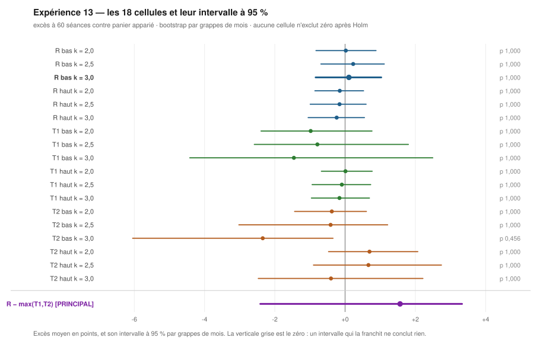
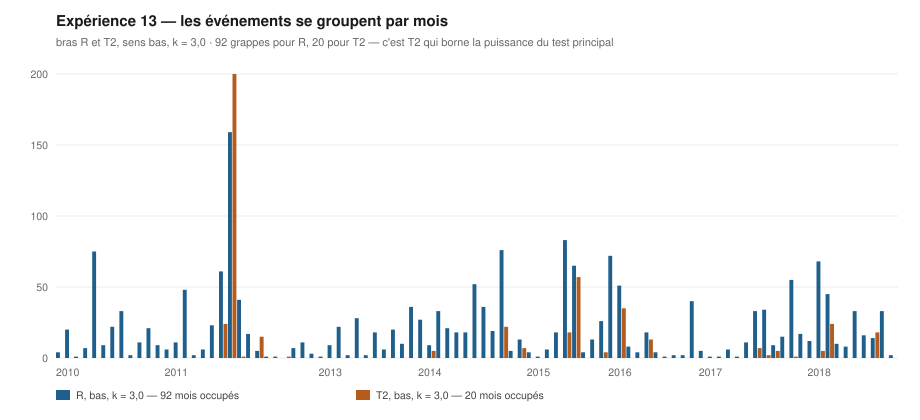

# Bilan de l'expérience 13

**La piste est réfutée.** L'écart réduit à une droite extrapolée est déclaré
**INUTILE** comme critère ordinal : les quatre conditions du
[protocole](README.md#le-critère-de-décision) échouent, et l'effet de
**+2,37 points** qui avait fait naître l'hypothèse est **exclu par l'intervalle**.

---

## Le verdict, condition par condition

Cellule de décision : bras **R**, sens **bas**, `k = 3`. 1 948 événements,
92 grappes de mois.

| | Condition | Mesuré | Tenue |
|---|---|---|---|
| 1 | excès moyen ≥ +1,00 point | **+0,11** | ❌ |
| 2 | IC₉₅ par grappes exclut zéro | borne basse **−0,84** | ❌ |
| 3 | **[PRINCIPAL]** `R − max(T1,T2)` > 0, IC₉₅ exclut zéro | **+1,57**, IC₉₅ [−2,41 ; +3,33] | ❌ |
| 4 | retrait de la meilleure année laisse ≥ +0,50 | **+0,04** | ❌ |

> 🔑 **L'expérience ne rend pas « non concluant » — elle réfute.** Le protocole
> annonçait « non concluant » comme issue la plus probable, faute de puissance.
> C'est plus net que cela : l'IC₉₅ de la cellule de décision est
> **[−0,84 ; +1,03]**, et **+2,37 n'y est pas**. L'effet mesuré sur 2019-2026 ne
> se reproduit pas sur les neuf années précédentes, et l'écart n'est pas
> imputable au bruit d'échantillonnage — il est trop grand pour cela.

**C'est le second échec de réplication d'une piste de catégorie B dans ce dépôt**,
après la coupe à −15 % de l'[expérience 10](../experience_10/README.md). Les deux
avaient été mesurées sur les données qui les avaient suggérées ; aucune n'a
survécu à un univers qu'elle n'avait pas servi à fabriquer.

## Les dix-huit cellules

28 911 événements retenus, sur 3 957 couples (ancrage, valeur) exploités.

| Bras | Sens | k | Évts | Mois | Excès | IC₉₅ | p | p Holm |
|---|---|---|---|---|---|---|---|---|
| **R** | bas | 2,0 | 2 358 | 99 | +0,02 | [−0,83 ; +0,88] | 0,9767 | 1,0000 |
| **R** | bas | 2,5 | 2 145 | 95 | +0,23 | [−0,69 ; +1,11] | 0,6487 | 1,0000 |
| **R** | **bas** | **3,0** | **1 948** | **92** | **+0,11** | **[−0,84 ; +1,03]** | 0,8427 | 1,0000 |
| R | haut | 2,0 | 2 235 | 99 | −0,15 | [−0,86 ; +0,53] | 0,6460 | 1,0000 |
| R | haut | 2,5 | 2 011 | 95 | −0,16 | [−0,99 ; +0,60] | 0,6847 | 1,0000 |
| R | haut | 3,0 | 1 785 | 89 | −0,24 | [−1,05 ; +0,55] | 0,5140 | 1,0000 |
| T1 | bas | 2,0 | 1 083 | 81 | −0,98 | [−2,39 ; +0,77] | 0,2520 | 1,0000 |
| T1 | bas | 2,5 | 832 | 65 | −0,79 | [−2,58 ; +1,80] | 0,5333 | 1,0000 |
| T1 | bas | 3,0 | 616 | 58 | −1,46 | [−4,42 ; +2,49] | 0,4467 | 1,0000 |
| T1 | haut | 2,0 | 2 619 | 101 | +0,01 | [−0,68 ; +0,77] | 0,9680 | 1,0000 |
| T1 | haut | 2,5 | 2 323 | 95 | −0,09 | [−0,94 ; +0,73] | 0,7900 | 1,0000 |
| T1 | haut | 3,0 | 2 008 | 93 | −0,16 | [−0,96 ; +0,69] | 0,6580 | 1,0000 |
| T2 | bas | 2,0 | 1 555 | 55 | −0,38 | [−1,44 ; +0,61] | 0,4200 | 1,0000 |
| T2 | bas | 2,5 | 831 | 36 | −0,41 | [−3,02 ; +1,21] | 0,5900 | 1,0000 |
| T2 | bas | 3,0 | 464 | **20** | −2,34 | [−6,05 ; −0,34] | 0,0253 | 0,4560 |
| T2 | haut | 2,0 | 2 188 | 81 | +0,70 | [−0,47 ; +2,07] | 0,2607 | 1,0000 |
| T2 | haut | 2,5 | 1 287 | 57 | +0,66 | [−0,90 ; +2,74] | 0,4647 | 1,0000 |
| T2 | haut | 3,0 | 623 | 36 | −0,40 | [−2,47 ; +2,21] | 0,7133 | 1,0000 |

> **Aucune cellule ne survit à Holm. Pas une seule sur dix-huit.** La seule dont
> l'intervalle brut exclut zéro — T2, bas, `k = 3` — repose sur **20 grappes de
> mois**, la cellule la moins peuplée du tableau, et sa `p` passe de 0,0253 à
> **0,4560** une fois la multiplicité corrigée. C'était le cas prévu par le
> protocole : la faiblesse de T2 avait été déclarée avant de jouer.



> **Le tableau ci-dessus, en une image.** Chaque trait est un intervalle à 95 % ;
> la verticale grise est le zéro. **Aucun trait ne la franchit sans la
> contenir** — et c'est vrai des dix-huit cellules comme du test principal, tracé
> en violet sous le filet. Le verdict se lit avant d'avoir lu un chiffre.

## Ce que le test principal dit, et ne dit pas

$$R - \max(T_1, T_2) = +1{,}57 \text{ points}, \quad \mathrm{IC}_{95} = [-2{,}41 ; +3{,}33], \quad p = 0{,}45$$

**La droite fait nominalement mieux que ses deux témoins**, de 1,57 point : R rend
+0,11 là où T1 rend −1,46 et T2 −2,34. Mais l'intervalle est large de près de six
points et contient zéro largement.

> ⚠️ **Cette largeur avait été annoncée, et elle mord exactement où on l'attendait.**
> Le protocole déclarait : « le test principal est apparié sur les mois, or T2 à
> `k = 3` n'occupe que 20 grappes : c'est lui qui borne la puissance de l'ensemble ».
> C'est ce qui s'est produit. **Le seul enseignement recevable du test principal
> est donc qu'il ne tranche pas**, et le protocole savait avant de jouer qu'il ne
> trancherait probablement pas.



> **Pourquoi l'unité indépendante est le mois, et pas l'événement.** Les
> franchissements arrivent par paquets : R occupe **92 mois** sur les 108 de la
> fenêtre, T2 seulement **20**. Un intervalle calculé sur le nombre d'événements —
> 1 948 et 464 — serait plusieurs fois trop étroit. Et l'on voit d'un coup d'œil
> que c'est la rareté des grappes de T2 qui borne la puissance du test principal.

## Le contrôle de validité

| Sens | k | Tirés | Excès | IC₉₅ | p | p Holm |
|---|---|---|---|---|---|---|
| bas | 2,0 | 2 358 | −0,07 | [−0,49 ; +0,37] | 0,7560 | 1,0000 |
| bas | 2,5 | 2 145 | +0,21 | [−0,27 ; +0,70] | 0,3993 | 1,0000 |
| bas | 3,0 | 1 948 | −0,45 | [−0,85 ; −0,04] | 0,0307 | **0,1840** |
| haut | 2,0 | 2 235 | +0,08 | [−0,34 ; +0,50] | 0,7207 | 1,0000 |
| haut | 2,5 | 2 011 | +0,01 | [−0,44 ; +0,43] | 0,9740 | 1,0000 |
| haut | 3,0 | 1 785 | −0,15 | [−0,61 ; +0,34] | 0,5440 | 1,0000 |

T0 est compatible avec zéro sur les six cellules : le dispositif est valide, et le
verdict peut se lire. La correction qui a rendu ce contrôle cohérent avec le reste
du moteur est **déclarée au [§ 5 du protocole](README.md#5-une-correction-déclarée-faite-après-un-premier-passage)** — elle a été faite après un premier
passage qui s'était arrêté sur une fausse alerte de multiplicité, et elle est sans
effet sur le verdict.

## Ce que ce bilan n'établit pas

- **Que la droite ne serve à rien en général.** Il établit qu'elle n'apporte rien
  de mesurable **comme critère ordinal à 60 séances**, sur cet univers et cette
  fenêtre. Un autre horizon, une autre issue, une autre cadence restent ouverts.
- **Que 3 s soit le mauvais seuil.** Les trois `k` rendent tous zéro : il n'y a
  pas de seuil à corriger, il n'y a rien à trouver le long de cet axe.
- **Un rendement absolu.** 13,9 % de l'univers n'a pas de série servie — faillites,
  fusions et rachats —, et ce trou n'est pas aléatoire. Seuls les **écarts entre
  bras**, mesurés sur les mêmes valeurs aux mêmes dates, sont à l'abri.
- **Une causalité.** Rien de ce qui précède n'est un mécanisme.

## Reproduction

```bash
python docs/done/experimentation/experience_13/mesure.py --dimensionner
python docs/done/experimentation/experience_13/mesure.py
```

Tous les nombres de ce bilan sont **recopiés de la sortie console**, sans
exception, et les 28 911 événements sont dans
[`evenements.csv`](evenements.csv), un par ligne, avec leur date, leur `z`, leur
excès brut et net et la taille du panier qui les apparie.

---

> Ce bilan ne rend aucun verdict d'achat ou de vente, ne dimensionne aucune
> position et ne prédit aucun cours. Il rend la sortie d'une règle écrite avant
> d'être appliquée à des données passées.
