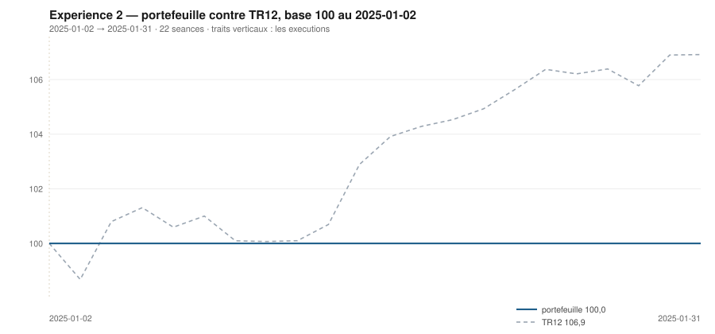

# Janvier 2025

> Journal de l'[expérience 2](../README.md) · **décision au 2024-12-31** · **exécution au 2025-01-02**
> Portefeuille au 2025-01-31 : **10 000,00 €** (base 100,00) · TR12 106,92 · alpha du mois **-6,92 pt** · depuis janvier **-6,92 pt**

---

## 1. Les actualités du mois précédent

**Décembre 2024** (`^FCHI` +2,01 %). La Banque centrale européenne abaisse son
taux de dépôt à 3,00 % le 12 décembre, quatrième baisse de l'année, et retire de
son communiqué la mention d'un maintien « suffisamment restrictif ». La Réserve
fédérale baisse elle aussi le 18, mais accompagne sa décision de projections
nettement moins accommodantes pour 2025 : les marchés reculent sur la séance.

En France, le gouvernement Barnier est censuré le 4 décembre, le premier renversé
par une motion depuis 1962 ; François Bayrou est nommé le 13. Moody's abaisse la
note souveraine le 14. L'écart entre les rendements français et allemand reste
au-dessus de 80 points de base.

Le CAC 40 termine 2024 en baisse de 2,15 %, seul grand indice européen à finir
l'année en repli — le luxe, très exposé à une demande chinoise atone, et la
prime politique française expliquent l'essentiel de l'écart.

---

## 2. Le dépouillement des thèses écrites au 2024-11-29

> Piste **S4**. Ces énoncés ont été écrits le mois dernier, avant de connaître ce mois-ci. Aucun n'a été retouché ; le verdict est calculé.

| Valeur | Thèse | Énoncé | Constaté | Verdict |
|---|---|---|---|---|
| `AIR.PA` | Canal | clôture entre 136,10 € et 141,59 € au 2024-12-31 | 148,63 € | démentie |
| `AIR.PA` | Reflexive | AUCUNE SEQUENCE : écart contre TR12 dans ± 5 points, au 2024-12-31 | 3,08 pt | **confirmée** |
| `MC.PA` | Canal | clôture entre 524,23 € et 525,06 € au 2024-12-31 | 610,66 € | démentie |
| `MC.PA` | Reflexive | AUCUNE SEQUENCE : écart contre TR12 dans ± 5 points, au 2024-12-31 | 6,45 pt | démentie |
| `OR.PA` | Canal | clôture entre 286,16 € et 285,83 € au 2024-12-31 | 329,30 € | démentie |
| `OR.PA` | Reflexive | AUCUNE SEQUENCE : écart contre TR12 dans ± 5 points, au 2024-12-31 | 2,20 pt | **confirmée** |
| `SAN.PA` | Canal | clôture entre 82,72 € et 116,50 € au 2024-12-31 | 85,03 € | **confirmée** |
| `SAN.PA` | Reflexive | AUCUNE SEQUENCE : écart contre TR12 dans ± 5 points, au 2024-12-31 | -0,02 pt | **confirmée** |
| `BNP.PA` | Canal | clôture entre 47,92 € et 60,17 € au 2024-12-31 | 52,26 € | **confirmée** |
| `BNP.PA` | Reflexive | AUCUNE SEQUENCE : écart contre TR12 dans ± 5 points, au 2024-12-31 | 2,74 pt | **confirmée** |
| `TTE.PA` | Canal | clôture entre 47,77 € et 56,24 € au 2024-12-31 | 48,35 € | **confirmée** |
| `TTE.PA` | Reflexive | RETOURNEMENT : écart contre TR12 négatif ou nul, au 2024-12-31 | -4,72 pt | **confirmée** |
| `SU.PA` | Canal | clôture entre 239,65 € et 253,68 € au 2024-12-31 | 233,00 € | démentie |
| `SU.PA` | Reflexive | AUCUNE SEQUENCE : écart contre TR12 dans ± 5 points, au 2024-12-31 | -2,88 pt | **confirmée** |
| `AI.PA` | Canal | clôture entre 134,95 € et 162,06 € au 2024-12-31 | 137,19 € | **confirmée** |
| `AI.PA` | Reflexive | AUCUNE SEQUENCE : écart contre TR12 dans ± 5 points, au 2024-12-31 | -2,04 pt | **confirmée** |
| `DG.PA` | Canal | clôture entre 89,74 € et 109,74 € au 2024-12-31 | 93,03 € | **confirmée** |
| `DG.PA` | Reflexive | AUCUNE SEQUENCE : écart contre TR12 dans ± 5 points, au 2024-12-31 | -1,93 pt | **confirmée** |
| `CAP.PA` | Canal | clôture entre 136,21 € et 190,58 € au 2024-12-31 | 149,77 € | **confirmée** |
| `CAP.PA` | Reflexive | RETOURNEMENT : écart contre TR12 négatif ou nul, au 2024-12-31 | 2,30 pt | démentie |
| `RI.PA` | Canal | clôture entre 90,42 € et 84,29 € au 2024-12-31 | 99,51 € | démentie |
| `RI.PA` | Reflexive | AUCUNE SEQUENCE : écart contre TR12 dans ± 5 points, au 2024-12-31 | 1,12 pt | **confirmée** |
| `ORA.PA` | Canal | clôture entre 8,77 € et 8,80 € au 2024-12-31 | 8,88 € | démentie |
| `ORA.PA` | Reflexive | AUCUNE SEQUENCE : écart contre TR12 dans ± 5 points, au 2024-12-31 | -3,39 pt | **confirmée** |

## 3. L'exposition héritée au 2024-12-31

*Aucune ligne : le portefeuille est intégralement en espèces.*

## 4. Le portefeuille depuis le 2025-01-02

| | |
|---|---|
| Dotation initiale | 10 000,00 € au 2025-01-02 |
| Titres au 2025-01-31 | 0,00 € |
| Espèces | 10 000,00 € |
| **Total** | **10 000,00 €** |
| Base 100 | **100,00** |
| TR12, même base | 106,92 |
| Écart depuis janvier | **-6,92 pt** |

## 5. L'étude chartiste au 2024-12-31

> Notes rédigées sans aucune séance postérieure au 2024-12-31, par l'agent `chartiste`. Cinq lignes au plus par société.

### 1. `SU.PA` — Schneider Electric

- Tendance longue positive, courte négative : veto 3, la règle refuse de conclure.
- Clôture à 233,00 €, à 13,4 % du canal — le bas, ce que la règle alignée valorise.
- Support à 230,82 €, très proche : quelques séances de repli suffiraient à sortir du canal.
- Momentum 12-1 de +40,3 %, de loin le plus fort de l'univers.
- Deux contacts en support : veto 1 également. Le meilleur score du jour, et deux vetos.

### 2. `AIR.PA` — Airbus

- Seule valeur de l'univers dont la tendance longue soit positive à cette date, la courte étant neutre.
- Clôture à 148,63 €, à 62,4 % d'un canal large de 136,10 à 156,19 € — la moitié haute, sans excès.
- Le canal est très ouvert : τ = 187 séances, il ne se refermera pas d'ici la décision suivante.
- Deux épisodes de contact seulement sur la résistance : la droite haute est ajustée, pas éprouvée.
- Momentum 12-1 de +5,7 %, le plus élevé de l'univers après Schneider.

### 3. `SAN.PA` — Sanofi

- Tendance longue négative, clôture exactement sur la résistance — position 100,0 %.
- Le canal est étroit, de 79,16 à 85,03 €, et se refermera dans 40 séances.
- Deux contacts seulement sur la résistance : veto 1, la figure n'est pas lisible d'un côté.
- Momentum 12-1 légèrement positif, +2,6 %, ce qui contraste avec la tendance longue.
- Configuration contradictoire, que le veto tranche en refusant de conclure.

### 4. `AI.PA` — Air Liquide

- Les deux tendances négatives, clôture à 68,4 % d'un canal très étroit, 134,00 à 138,67 €.
- Largeur inférieure à 5 €, et τ = 21,6 séances : le canal se referme presque à la cadence.
- Trois contacts en support, cinq en résistance : la figure est éprouvée mais éphémère.
- Momentum 12-1 de +2,5 %, à peine positif.
- Un canal qui vit le temps d'une décision est une figure qu'on lit une fois, jamais deux.

### 5. `TTE.PA` — TotalEnergies

- Les deux tendances négatives, ce qui écarte le veto 3 mais ferme toute entrée par le score.
- Clôture à 48,35 €, à 23,0 % d'un canal très large, de 45,54 à 57,80 €.
- Canal divergent, τ infini : il ne se refermera jamais de lui-même.
- Cinq contacts en résistance, trois en support : c'est l'encadrement le mieux éprouvé du jour.
- Momentum 12-1 de −10,0 %, juste au seuil qui fait basculer la composante de −1 à −2.

### 6. `ORA.PA` — Orange

- Tendance longue négative, courte neutre, clôture à 92,5 % d'un canal très étroit.
- Support 8,63 €, résistance 8,89 € : moins de 3 % de largeur, la figure est presque un trait.
- τ = 20,4 séances : le canal se referme avant la décision suivante, le veto 2 est à un cheveu.
- Quatre contacts de chaque côté, ce qui rend l'encadrement lisible malgré son étroitesse.
- Momentum 12-1 de −1,8 %, quasi nul.
- ---

### 7. `BNP.PA` — BNP Paribas

- Tendance longue négative, clôture à 96,5 % du canal, tout en haut.
- Canal serré, 47,92 à 52,42 €, se refermant dans 31 séances.
- Deux contacts de chaque côté : veto 1 des deux bords, l'encadrement n'est pas établi.
- Momentum 12-1 de −4,9 %, modeste au regard des autres financières européennes.
- La valeur est achetable dans deux mois si le canal se reconstruit, pas à cette date.

### 8. `DG.PA` — Vinci

- Tendance longue négative, courte neutre, clôture à 86,4 % du canal.
- Encadrement de 89,34 à 93,61 €, resserré, se refermant dans 35 séances.
- Six contacts en résistance : le plafond est solidement établi, le plancher moins.
- Momentum 12-1 de −9,4 %, tout près du seuil de −10 %.
- Position haute et tendance basse : la configuration que la règle alignée pénalise le plus.

### 9. `MC.PA` — LVMH

- Tendance longue négative, courte neutre : le repli de 2024 est installé, pas terminé.
- Clôture à 610,66 €, contre une résistance à 621,63 € — la valeur bute sous le haut du canal.
- Encadrement le plus durable de la liste, τ = 255 séances, et quatre contacts sur le support.
- Momentum 12-1 de −14,1 % : le luxe paie la demande chinoise, et cela se lit sur douze mois.
- Aucun veto : la figure est lisible, c'est le score qui la classe mal.

### 10. `CAP.PA` — Capgemini

- Tendance longue négative, clôture exactement sur la résistance — 100,0 % de la hauteur.
- Canal de 136,21 à 149,77 €, se refermant dans 37 séances.
- Trois contacts de chaque côté : la figure est lisible, aucun veto ne se déclenche.
- Momentum 12-1 de −16,5 %, l'un des plus mauvais de l'univers.
- Rien dans cette configuration ne va dans le sens d'une entrée.

### 11. `OR.PA` — L'Oréal

- Tendance longue négative, courte neutre, et une clôture à 98,8 % de la hauteur du canal.
- Support à 286,16 €, résistance à 329,84 € : la valeur est collée au plafond d'un canal descendant.
- Trois contacts en bas, quatre en haut — l'encadrement est correctement éprouvé des deux côtés.
- Momentum 12-1 de −23,1 %, le troisième plus mauvais de l'univers.
- Position haute dans un canal baissier : la règle alignée y voit un désavantage, pas un signal.

### 12. `RI.PA` — Pernod Ricard

- Tendance longue négative, courte neutre, clôture à 84,9 % d'un canal de 90,24 à 101,16 €.
- Six contacts en support : c'est le plancher le mieux éprouvé de la journée.
- τ = 48,6 séances, soit un peu plus de deux décisions.
- Momentum 12-1 de −24,6 %, le plus mauvais de l'univers.
- Les spiritueux cumulent tendance longue et momentum négatifs depuis plus d'un an.

## 6. Le classement au 2024-12-31

> De la valeur la plus intéressante à détenir à celle qu'il faut fuir. La colonne **τ** donne la date de péremption du canal en séances (piste C4), la colonne **Vetos** les numéros déclenchés (piste T3). Une valeur sous veto ne peut pas être achetée.

| Rang | Valeur | `s1` | `s2` | `s3` | `s4` | `s5` | Score | Position | Momentum | τ | Vetos |
|---|---|---|---|---|---|---|---|---|---|---|---|
| 1 | `SU.PA` Schneider Electric | +2 | -1 | +1 | +2 | +0 | **+4** | 13,4 % | +40,3 % | 48,5 | 1 3 |
| 2 | `AIR.PA` Airbus | +2 | +0 | +0 | +1 | +0 | **+3** | 62,4 % | +5,7 % | 187,3 | 1 |
| 3 | `SAN.PA` Sanofi | -2 | +0 | -1 | +1 | +0 | **-2** | 100,0 % | +2,6 % | 40,4 | 1 |
| 4 | `AI.PA` Air Liquide | -2 | -1 | -1 | +1 | +0 | **-3** | 68,4 % | +2,5 % | 21,6 | — |
| 5 | `TTE.PA` TotalEnergies | -2 | -1 | +1 | -1 | +0 | **-3** | 23,0 % | -10,0 % | ∞ | — |
| 6 | `ORA.PA` Orange | -2 | +0 | -1 | -1 | +0 | **-4** | 92,5 % | -1,8 % | 20,4 | — |
| 7 | `BNP.PA` BNP Paribas | -2 | +0 | -1 | -1 | +0 | **-4** | 96,5 % | -4,9 % | 31,5 | 1 |
| 8 | `DG.PA` Vinci | -2 | +0 | -1 | -1 | +0 | **-4** | 86,4 % | -9,3 % | 34,8 | — |
| 9 | `MC.PA` LVMH | -2 | +0 | -1 | -2 | +0 | **-5** | 88,7 % | -14,1 % | 255,2 | — |
| 10 | `CAP.PA` Capgemini | -2 | +0 | -1 | -2 | +0 | **-5** | 100,0 % | -16,4 % | 36,8 | — |
| 11 | `OR.PA` L'Oréal | -2 | +0 | -1 | -2 | +0 | **-5** | 98,8 % | -23,1 % | 129,8 | — |
| 12 | `RI.PA` Pernod Ricard | -2 | +0 | -1 | -2 | +0 | **-5** | 84,9 % | -24,6 % | 48,6 | — |

## 7. Les ordres exécutés au 2025-01-02

> À l'**ouverture** de la séance, jamais à la clôture du 2024-12-31.

*Aucun ordre : le classement ne déclenche ni entrée ni sortie.*

## 8. La lecture du mois

Aucune ligne détenue sur le mois. Aucun ordre, donc aucun frais : le classement, l'hystérésis ou les vetos ont retenu le portefeuille en l'état. Le portefeuille termine le mois **derrière TR12** de 6,92 point. Sur les 24 thèses du mois précédent qui ont pu être dépouillées, **16 sont confirmées** — 66,7 %.

## 9. Les thèses écrites au 2024-12-31

> Elles seront dépouillées à la prochaine date de décision, dans le fichier du mois suivant. Elles sont engendrées mécaniquement par les règles du [protocole](../README.md#le-registre-des-thèses-réfutables) — aucune n'est rédigée à la main.

| Valeur | Thèse | Énoncé, à dépouiller au mois suivant |
|---|---|---|
| `AIR.PA` | Canal | clôture entre 142,30 € et 160,03 € au 2025-01-31 |
| `AIR.PA` | Reflexive | AUCUNE SEQUENCE : écart contre TR12 dans ± 5 points, au 2025-01-31 |
| `MC.PA` | Canal | clôture entre 514,69 € et 603,69 € au 2025-01-31 |
| `MC.PA` | Reflexive | AUCUNE SEQUENCE : écart contre TR12 dans ± 5 points, au 2025-01-31 |
| `OR.PA` | Canal | clôture entre 270,48 € et 306,76 € au 2025-01-31 |
| `OR.PA` | Reflexive | AUCUNE SEQUENCE : écart contre TR12 dans ± 5 points, au 2025-01-31 |
| `SAN.PA` | Canal | clôture entre 78,57 € et 81,24 € au 2025-01-31 |
| `SAN.PA` | Reflexive | AUCUNE SEQUENCE : écart contre TR12 dans ± 5 points, au 2025-01-31 |
| `BNP.PA` | Canal | clôture entre 47,63 € et 48,99 € au 2025-01-31 |
| `BNP.PA` | Reflexive | AUCUNE SEQUENCE : écart contre TR12 dans ± 5 points, au 2025-01-31 |
| `TTE.PA` | Canal | clôture entre 44,20 € et 57,91 € au 2025-01-31 |
| `TTE.PA` | Reflexive | RETOURNEMENT : écart contre TR12 négatif ou nul, au 2025-01-31 |
| `SU.PA` | Canal | clôture entre 240,77 € et 249,67 € au 2025-01-31 |
| `SU.PA` | Reflexive | AUCUNE SEQUENCE : écart contre TR12 dans ± 5 points, au 2025-01-31 |
| `AI.PA` | Canal | clôture entre 132,91 € et 132,83 € au 2025-01-31 |
| `AI.PA` | Reflexive | AUCUNE SEQUENCE : écart contre TR12 dans ± 5 points, au 2025-01-31 |
| `DG.PA` | Canal | clôture entre 88,89 € et 90,46 € au 2025-01-31 |
| `DG.PA` | Reflexive | AUCUNE SEQUENCE : écart contre TR12 dans ± 5 points, au 2025-01-31 |
| `CAP.PA` | Canal | clôture entre 130,94 € et 136,39 € au 2025-01-31 |
| `CAP.PA` | Reflexive | AUCUNE SEQUENCE : écart contre TR12 dans ± 5 points, au 2025-01-31 |
| `RI.PA` | Canal | clôture entre 86,76 € et 92,74 € au 2025-01-31 |
| `RI.PA` | Reflexive | AUCUNE SEQUENCE : écart contre TR12 dans ± 5 points, au 2025-01-31 |
| `ORA.PA` | Canal | clôture entre 8,63 € et 8,61 € au 2025-01-31 |
| `ORA.PA` | Reflexive | AUCUNE SEQUENCE : écart contre TR12 dans ± 5 points, au 2025-01-31 |

---

[Protocole](../README.md) · [Février →](2025-02.md)
