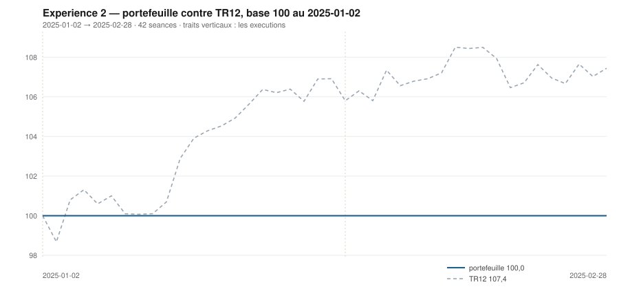

# Février 2025

> Journal de l'[expérience 2](../README.md) · **décision au 2025-01-31** · **exécution au 2025-02-03**
> Portefeuille au 2025-02-28 : **10 000,00 €** (base 100,00) · TR12 107,44 · alpha du mois **-0,49 pt** · depuis janvier **-7,44 pt**

---

## 1. Les actualités du mois précédent

**Janvier 2025** (`^FCHI` +7,72 %). Le meilleur mois de janvier des actions
européennes depuis des années. La rotation vers l'Europe, jugée bon marché après
deux ans de retard sur les États-Unis, profite d'abord aux financières et au
luxe, qui rebondit nettement.

Le 20 janvier, Donald Trump prête serment ; les premières annonces tarifaires
visent le Canada, le Mexique et la Chine, l'Europe étant nommée sans calendrier.
Le 27, la publication du modèle chinois DeepSeek provoque une correction violente
sur tout ce qui dépend de la dépense en centres de données — l'équipement
électrique en Europe est directement touché.

La BCE abaisse son taux de dépôt à 2,75 % le 30 janvier.

---

## 2. Le dépouillement des thèses écrites au 2024-12-31

> Piste **S4**. Ces énoncés ont été écrits le mois dernier, avant de connaître ce mois-ci. Aucun n'a été retouché ; le verdict est calculé.

| Valeur | Thèse | Énoncé | Constaté | Verdict |
|---|---|---|---|---|
| `AIR.PA` | Canal | clôture entre 142,30 € et 160,03 € au 2025-01-31 | 160,48 € | démentie |
| `AIR.PA` | Reflexive | AUCUNE SEQUENCE : écart contre TR12 dans ± 5 points, au 2025-01-31 | 0,60 pt | **confirmée** |
| `MC.PA` | Canal | clôture entre 514,69 € et 603,69 € au 2025-01-31 | 676,00 € | démentie |
| `MC.PA` | Reflexive | AUCUNE SEQUENCE : écart contre TR12 dans ± 5 points, au 2025-01-31 | 3,33 pt | **confirmée** |
| `OR.PA` | Canal | clôture entre 270,48 € et 306,76 € au 2025-01-31 | 345,34 € | démentie |
| `OR.PA` | Reflexive | AUCUNE SEQUENCE : écart contre TR12 dans ± 5 points, au 2025-01-31 | -2,50 pt | **confirmée** |
| `SAN.PA` | Canal | clôture entre 78,57 € et 81,24 € au 2025-01-31 | 94,70 € | démentie |
| `SAN.PA` | Reflexive | AUCUNE SEQUENCE : écart contre TR12 dans ± 5 points, au 2025-01-31 | 4,00 pt | **confirmée** |
| `BNP.PA` | Canal | clôture entre 47,63 € et 48,99 € au 2025-01-31 | 58,00 € | démentie |
| `BNP.PA` | Reflexive | AUCUNE SEQUENCE : écart contre TR12 dans ± 5 points, au 2025-01-31 | 3,60 pt | **confirmée** |
| `TTE.PA` | Canal | clôture entre 44,20 € et 57,91 € au 2025-01-31 | 51,86 € | **confirmée** |
| `TTE.PA` | Reflexive | RETOURNEMENT : écart contre TR12 négatif ou nul, au 2025-01-31 | -0,13 pt | **confirmée** |
| `SU.PA` | Canal | clôture entre 240,77 € et 249,67 € au 2025-01-31 | 237,31 € | démentie |
| `SU.PA` | Reflexive | AUCUNE SEQUENCE : écart contre TR12 dans ± 5 points, au 2025-01-31 | -5,53 pt | démentie |
| `AI.PA` | Canal | clôture entre 132,91 € et 132,83 € au 2025-01-31 | 147,40 € | démentie |
| `AI.PA` | Reflexive | AUCUNE SEQUENCE : écart contre TR12 dans ± 5 points, au 2025-01-31 | 0,07 pt | **confirmée** |
| `DG.PA` | Canal | clôture entre 88,89 € et 90,46 € au 2025-01-31 | 97,47 € | démentie |
| `DG.PA` | Reflexive | AUCUNE SEQUENCE : écart contre TR12 dans ± 5 points, au 2025-01-31 | -2,60 pt | **confirmée** |
| `CAP.PA` | Canal | clôture entre 130,94 € et 136,39 € au 2025-01-31 | 166,63 € | démentie |
| `CAP.PA` | Reflexive | AUCUNE SEQUENCE : écart contre TR12 dans ± 5 points, au 2025-01-31 | 3,88 pt | **confirmée** |
| `RI.PA` | Canal | clôture entre 86,76 € et 92,74 € au 2025-01-31 | 100,61 € | démentie |
| `RI.PA` | Reflexive | AUCUNE SEQUENCE : écart contre TR12 dans ± 5 points, au 2025-01-31 | -6,27 pt | démentie |
| `ORA.PA` | Canal | clôture entre 8,63 € et 8,61 € au 2025-01-31 | 9,56 € | démentie |
| `ORA.PA` | Reflexive | AUCUNE SEQUENCE : écart contre TR12 dans ± 5 points, au 2025-01-31 | 0,38 pt | **confirmée** |

## 3. L'exposition héritée au 2025-01-31

*Aucune ligne : le portefeuille est intégralement en espèces.*

## 4. Le portefeuille depuis le 2025-01-02

| | |
|---|---|
| Dotation initiale | 10 000,00 € au 2025-01-02 |
| Titres au 2025-02-28 | 0,00 € |
| Espèces | 10 000,00 € |
| **Total** | **10 000,00 €** |
| Base 100 | **100,00** |
| TR12, même base | 107,44 |
| Écart depuis janvier | **-7,44 pt** |

## 5. L'étude chartiste au 2025-01-31

> Notes rédigées sans aucune séance postérieure au 2025-01-31, par l'agent `chartiste`. Cinq lignes au plus par société.

### 1. `SU.PA` — Schneider Electric

- Tendance longue positive, courte neutre, clôture à 38,2 % d'un canal très large.
- Support 219,63 €, résistance 265,85 € : plus de 20 % de largeur, canal divergent.
- Deux contacts de chaque côté : veto 1, l'encadrement n'est pas éprouvé.
- Momentum 12-1 de +26,9 %, le plus fort de l'univers.
- Le meilleur momentum et une position basse — et un veto qui interdit l'entrée.

### 2. `AIR.PA` — Airbus

- Les deux tendances positives pour la première fois depuis le début de l'observation.
- Clôture à 160,48 €, à 74,2 % d'un canal étroit de 155,12 à 162,34 €.
- τ = 21,3 séances : le canal se referme presque exactement à la cadence de décision.
- Deux contacts en support : veto 1, l'encadrement n'est pas établi en bas.
- Momentum 12-1 de +7,4 %, en amélioration nette sur le mois.

### 3. `BNP.PA` — BNP Paribas

- Tendance longue négative, courte positive : veto 3, plus veto 1 faute de contacts en support.
- Clôture à 58,00 €, à 97,5 % du canal, tout en haut.
- Canal divergent, τ infini, de 45,74 à 58,30 € — très large.
- Momentum 12-1 de +14,8 %, le meilleur du jour après Schneider.
- La banque monte fort, la règle refuse de l'acheter en haut de canal : c'est le sens de `s3` aligné.

### 4. `SAN.PA` — Sanofi

- Tendance longue négative, courte positive : veto 3.
- Clôture à 94,70 €, à 98,4 % de la hauteur — la valeur est sur son plafond.
- Canal divergent, τ infini, trois contacts de chaque côté : la figure elle-même est lisible.
- Momentum 12-1 de +12,6 %, le deuxième meilleur du jour.
- Un momentum fort et une position haute : configuration que la règle alignée dégrade.

### 5. `MC.PA` — LVMH

- Les deux tendances passent positives, après une année de repli.
- Clôture à 676,00 €, à 73,2 % d'un canal très large, de 514,69 à 735,02 €.
- Canal divergent, τ infini, quatre contacts de chaque côté : la figure est la plus solide du jour.
- Momentum 12-1 encore à −16,9 %, la mémoire de 2024 pesant sur douze mois glissants.
- Aucun veto : la seule valeur du jour dont la lecture ne bute sur rien.

### 6. `AI.PA` — Air Liquide

- Tendance longue négative, courte positive : veto 3, auquel s'ajoute le veto 1.
- Clôture à 147,40 €, à 92,6 % d'un canal de 131,83 à 148,64 €.
- Deux contacts en résistance seulement : la droite haute n'est pas établie.
- Momentum 12-1 de +1,5 %, à peine positif.
- Configuration indécise sur tous les plans.

### 7. `ORA.PA` — Orange

- Tendance longue négative, courte positive : veto 3, plus veto 1 en résistance.
- Clôture à 9,56 €, à 92,7 % d'un canal très étroit, de 8,64 à 9,64 €.
- τ = 495 séances : le canal est quasi parallèle, il vivra longtemps.
- Cinq contacts en support : le plancher est le mieux éprouvé du jour.
- Momentum 12-1 de −3,7 %, en amélioration depuis décembre.
- ---

### 8. `TTE.PA` — TotalEnergies

- Tendance longue négative, courte neutre, clôture à 89,9 % d'un canal de 43,14 à 52,83 €.
- Canal divergent, τ infini, quatre contacts en support et trois en résistance.
- Aucun veto : la figure est lisible, et le score la classe sur ses seuls critères.
- Momentum 12-1 de −6,2 %, en léger recul.
- Position haute dans une tendance longue baissière : aucune entrée possible.

### 9. `DG.PA` — Vinci

- Tendance longue négative, courte positive : veto 3.
- Clôture à 97,47 €, à 93,1 % d'un canal de 86,79 à 98,27 €.
- Cinq contacts en support : le plancher est bien établi, la résistance moins avec trois.
- Canal divergent, τ infini.
- Momentum 12-1 de −12,6 %, sous le seuil qui fait basculer la composante à −2.

### 10. `CAP.PA` — Capgemini

- Tendance longue négative, courte positive : veto 3, plus veto 1 en résistance.
- Clôture à 166,63 €, à 96,1 % d'un canal très large, de 126,23 à 168,28 €.
- Quatre contacts en support, deux en résistance.
- Momentum 12-1 de −22,3 %, parmi les plus mauvais.
- La valeur rebondit fort sur un mois sans que la tendance longue ait bougé.

### 11. `OR.PA` — L'Oréal

- Tendance longue négative, courte positive : veto 3, les deux horizons se contredisent.
- Clôture à 345,34 €, à 79,7 % du canal, sous une résistance à 353,28 €.
- Deux contacts en résistance : veto 1 s'ajoute au veto 3.
- Momentum 12-1 de −24,4 %, le plus mauvais de l'univers à cette date.
- Deux vetos et un momentum au plancher : rien à en tirer.

### 12. `RI.PA` — Pernod Ricard

- Tendance longue négative, courte neutre, clôture à 80,7 % du canal.
- Encadrement de 93,73 à 102,26 €, se refermant dans 32 séances.
- Deux contacts en résistance : veto 1.
- Momentum 12-1 de −28,0 %, le pire de l'univers pour le deuxième mois consécutif.
- Rien n'indique une inflexion à cette date.

## 6. Le classement au 2025-01-31

> De la valeur la plus intéressante à détenir à celle qu'il faut fuir. La colonne **τ** donne la date de péremption du canal en séances (piste C4), la colonne **Vetos** les numéros déclenchés (piste T3). Une valeur sous veto ne peut pas être achetée.

| Rang | Valeur | `s1` | `s2` | `s3` | `s4` | `s5` | Score | Position | Momentum | τ | Vetos |
|---|---|---|---|---|---|---|---|---|---|---|---|
| 1 | `SU.PA` Schneider Electric | +2 | +0 | +0 | +2 | +0 | **+4** | 38,2 % | +26,9 % | ∞ | 1 |
| 2 | `AIR.PA` Airbus | +2 | +1 | -1 | +1 | +0 | **+3** | 74,2 % | +7,4 % | 21,3 | 1 |
| 3 | `BNP.PA` BNP Paribas | -2 | +1 | -1 | +2 | +0 | **+0** | 97,5 % | +14,8 % | ∞ | 1 3 |
| 4 | `SAN.PA` Sanofi | -2 | +1 | -1 | +2 | +0 | **+0** | 98,4 % | +12,6 % | ∞ | 3 |
| 5 | `MC.PA` LVMH | +2 | +1 | -1 | -2 | +0 | **+0** | 73,2 % | -16,9 % | ∞ | — |
| 6 | `AI.PA` Air Liquide | -2 | +1 | -1 | +1 | +0 | **-1** | 92,6 % | +1,5 % | ∞ | 1 3 |
| 7 | `ORA.PA` Orange | -2 | +1 | -1 | -1 | +0 | **-3** | 92,7 % | -3,7 % | 494,9 | 1 3 |
| 8 | `TTE.PA` TotalEnergies | -2 | +0 | -1 | -1 | +0 | **-4** | 89,9 % | -6,2 % | ∞ | — |
| 9 | `DG.PA` Vinci | -2 | +1 | -1 | -2 | +0 | **-4** | 93,1 % | -12,6 % | ∞ | 3 |
| 10 | `CAP.PA` Capgemini | -2 | +1 | -1 | -2 | +0 | **-4** | 96,1 % | -22,2 % | ∞ | 1 3 |
| 11 | `OR.PA` L'Oréal | -2 | +1 | -1 | -2 | +0 | **-4** | 79,7 % | -24,4 % | 54,9 | 1 3 |
| 12 | `RI.PA` Pernod Ricard | -2 | +0 | -1 | -2 | +0 | **-5** | 80,7 % | -28,0 % | 32,5 | 1 |

## 7. Les ordres exécutés au 2025-02-03

> À l'**ouverture** de la séance, jamais à la clôture du 2025-01-31.

*Aucun ordre : le classement ne déclenche ni entrée ni sortie.*

## 8. La lecture du mois

Aucune ligne détenue sur le mois. Aucun ordre, donc aucun frais : le classement, l'hystérésis ou les vetos ont retenu le portefeuille en l'état. Le portefeuille termine le mois **derrière TR12** de 0,49 point. Sur les 24 thèses du mois précédent qui ont pu être dépouillées, **11 sont confirmées** — 45,8 %.

## 9. Les thèses écrites au 2025-01-31

> Elles seront dépouillées à la prochaine date de décision, dans le fichier du mois suivant. Elles sont engendrées mécaniquement par les règles du [protocole](../README.md#le-registre-des-thèses-réfutables) — aucune n'est rédigée à la main.

| Valeur | Thèse | Énoncé, à dépouiller au mois suivant |
|---|---|---|
| `AIR.PA` | Canal | clôture entre 166,58 € et 167,02 € au 2025-02-28 |
| `AIR.PA` | Reflexive | AUTO-RENFORCEMENT : écart contre TR12 positif ou nul, au 2025-02-28 |
| `MC.PA` | Canal | clôture entre 506,02 € et 749,25 € au 2025-02-28 |
| `MC.PA` | Reflexive | AUTO-RENFORCEMENT : écart contre TR12 positif ou nul, au 2025-02-28 |
| `OR.PA` | Canal | clôture entre 318,15 € et 342,99 € au 2025-02-28 |
| `OR.PA` | Reflexive | AUCUNE SEQUENCE : écart contre TR12 dans ± 5 points, au 2025-02-28 |
| `SAN.PA` | Canal | clôture entre 74,92 € et 94,74 € au 2025-02-28 |
| `SAN.PA` | Reflexive | AUCUNE SEQUENCE : écart contre TR12 dans ± 5 points, au 2025-02-28 |
| `BNP.PA` | Canal | clôture entre 44,62 € et 58,05 € au 2025-02-28 |
| `BNP.PA` | Reflexive | AUCUNE SEQUENCE : écart contre TR12 dans ± 5 points, au 2025-02-28 |
| `TTE.PA` | Canal | clôture entre 41,22 € et 51,67 € au 2025-02-28 |
| `TTE.PA` | Reflexive | AUCUNE SEQUENCE : écart contre TR12 dans ± 5 points, au 2025-02-28 |
| `SU.PA` | Canal | clôture entre 222,05 € et 271,85 € au 2025-02-28 |
| `SU.PA` | Reflexive | AUCUNE SEQUENCE : écart contre TR12 dans ± 5 points, au 2025-02-28 |
| `AI.PA` | Canal | clôture entre 130,12 € et 147,24 € au 2025-02-28 |
| `AI.PA` | Reflexive | AUCUNE SEQUENCE : écart contre TR12 dans ± 5 points, au 2025-02-28 |
| `DG.PA` | Canal | clôture entre 85,43 € et 97,11 € au 2025-02-28 |
| `DG.PA` | Reflexive | AUCUNE SEQUENCE : écart contre TR12 dans ± 5 points, au 2025-02-28 |
| `CAP.PA` | Canal | clôture entre 119,30 € et 163,45 € au 2025-02-28 |
| `CAP.PA` | Reflexive | AUCUNE SEQUENCE : écart contre TR12 dans ± 5 points, au 2025-02-28 |
| `RI.PA` | Canal | clôture entre 93,53 € et 96,82 € au 2025-02-28 |
| `RI.PA` | Reflexive | AUCUNE SEQUENCE : écart contre TR12 dans ± 5 points, au 2025-02-28 |
| `ORA.PA` | Canal | clôture entre 8,64 € et 9,60 € au 2025-02-28 |
| `ORA.PA` | Reflexive | AUCUNE SEQUENCE : écart contre TR12 dans ± 5 points, au 2025-02-28 |

---

[← Janvier](2025-01.md) · [Protocole](../README.md) · [Mars →](2025-03.md)
