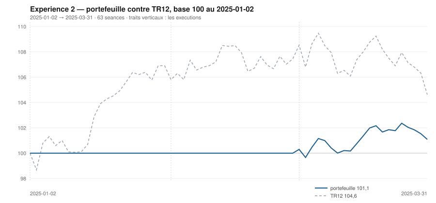

# Mars 2025

> Journal de l'[expérience 2](../README.md) · **décision au 2025-02-28** · **exécution au 2025-03-03**
> Portefeuille au 2025-03-31 : **10 108,57 €** (base 101,09) · TR12 104,63 · alpha du mois **+3,71 pt** · depuis janvier **-3,54 pt**

---

## 1. Les actualités du mois précédent

**Février 2025** (`^FCHI` +2,03 %). La hausse européenne se prolonge, portée par
une saison de résultats meilleure que redoutée et par l'anticipation d'un effort
budgétaire de défense à l'échelle du continent.

Les élections fédérales allemandes du 23 février donnent la CDU/CSU en tête ; la
perspective d'une coalition disposée à assouplir le frein à l'endettement
alimente le mouvement sur les valeurs industrielles et de défense.

Le CAC 40 inscrit ses plus hauts historiques dans les derniers jours du mois.
Les menaces tarifaires américaines sur l'acier, l'aluminium et l'automobile
restent présentes, sans être encore chiffrées pour l'Union.

---

## 2. Le dépouillement des thèses écrites au 2025-01-31

> Piste **S4**. Ces énoncés ont été écrits le mois dernier, avant de connaître ce mois-ci. Aucun n'a été retouché ; le verdict est calculé.

| Valeur | Thèse | Énoncé | Constaté | Verdict |
|---|---|---|---|---|
| `AIR.PA` | Canal | clôture entre 166,58 € et 167,02 € au 2025-02-28 | 159,12 € | démentie |
| `AIR.PA` | Reflexive | AUTO-RENFORCEMENT : écart contre TR12 positif ou nul, au 2025-02-28 | -1,34 pt | démentie |
| `MC.PA` | Canal | clôture entre 506,02 € et 749,25 € au 2025-02-28 | 667,74 € | **confirmée** |
| `MC.PA` | Reflexive | AUTO-RENFORCEMENT : écart contre TR12 positif ou nul, au 2025-02-28 | -1,72 pt | démentie |
| `OR.PA` | Canal | clôture entre 318,15 € et 342,99 € au 2025-02-28 | 340,04 € | **confirmée** |
| `OR.PA` | Reflexive | AUCUNE SEQUENCE : écart contre TR12 dans ± 5 points, au 2025-02-28 | -2,03 pt | **confirmée** |
| `SAN.PA` | Canal | clôture entre 74,92 € et 94,74 € au 2025-02-28 | 94,66 € | **confirmée** |
| `SAN.PA` | Reflexive | AUCUNE SEQUENCE : écart contre TR12 dans ± 5 points, au 2025-02-28 | -0,53 pt | **confirmée** |
| `BNP.PA` | Canal | clôture entre 44,62 € et 58,05 € au 2025-02-28 | 64,30 € | démentie |
| `BNP.PA` | Reflexive | AUCUNE SEQUENCE : écart contre TR12 dans ± 5 points, au 2025-02-28 | 10,37 pt | démentie |
| `TTE.PA` | Canal | clôture entre 41,22 € et 51,67 € au 2025-02-28 | 53,14 € | démentie |
| `TTE.PA` | Reflexive | AUCUNE SEQUENCE : écart contre TR12 dans ± 5 points, au 2025-02-28 | 1,97 pt | **confirmée** |
| `SU.PA` | Canal | clôture entre 222,05 € et 271,85 € au 2025-02-28 | 226,28 € | **confirmée** |
| `SU.PA` | Reflexive | AUCUNE SEQUENCE : écart contre TR12 dans ± 5 points, au 2025-02-28 | -5,14 pt | démentie |
| `AI.PA` | Canal | clôture entre 130,12 € et 147,24 € au 2025-02-28 | 154,41 € | démentie |
| `AI.PA` | Reflexive | AUCUNE SEQUENCE : écart contre TR12 dans ± 5 points, au 2025-02-28 | 4,26 pt | **confirmée** |
| `DG.PA` | Canal | clôture entre 85,43 € et 97,11 € au 2025-02-28 | 103,63 € | démentie |
| `DG.PA` | Reflexive | AUCUNE SEQUENCE : écart contre TR12 dans ± 5 points, au 2025-02-28 | 5,82 pt | démentie |
| `CAP.PA` | Canal | clôture entre 119,30 € et 163,45 € au 2025-02-28 | 141,25 € | **confirmée** |
| `CAP.PA` | Reflexive | AUCUNE SEQUENCE : écart contre TR12 dans ± 5 points, au 2025-02-28 | -15,73 pt | démentie |
| `RI.PA` | Canal | clôture entre 93,53 € et 96,82 € au 2025-02-28 | 94,26 € | **confirmée** |
| `RI.PA` | Reflexive | AUCUNE SEQUENCE : écart contre TR12 dans ± 5 points, au 2025-02-28 | -6,80 pt | démentie |
| `ORA.PA` | Canal | clôture entre 8,64 € et 9,60 € au 2025-02-28 | 10,64 € | démentie |
| `ORA.PA` | Reflexive | AUCUNE SEQUENCE : écart contre TR12 dans ± 5 points, au 2025-02-28 | 10,78 pt | démentie |

## 3. L'exposition héritée au 2025-02-28

*Aucune ligne : le portefeuille est intégralement en espèces.*

## 4. Le portefeuille depuis le 2025-01-02

| | |
|---|---|
| Dotation initiale | 10 000,00 € au 2025-01-02 |
| Titres au 2025-03-31 | 2 103,99 € |
| Espèces | 8 004,57 € |
| **Total** | **10 108,57 €** |
| Base 100 | **101,09** |
| TR12, même base | 104,63 |
| Écart depuis janvier | **-3,54 pt** |

## 5. L'étude chartiste au 2025-02-28

> Notes rédigées sans aucune séance postérieure au 2025-02-28, par l'agent `chartiste`. Cinq lignes au plus par société.

### 1. `SU.PA` — Schneider Electric

- Tendance longue positive, courte neutre, clôture à 9,7 % du canal — presque sur le support.
- Encadrement très large, de 221,37 à 271,86 €, canal divergent.
- Deux contacts en résistance : veto 1.
- Momentum 12-1 de +17,6 %, le troisième du jour.
- Position basse, tendance haute, momentum fort — et un veto, pour la troisième fois consécutive.

### 2. `BNP.PA` — BNP Paribas

- Les deux tendances positives, clôture à 97,3 % d'un canal très large, de 40,91 à 64,94 €.
- Canal divergent, τ infini, quatre contacts de chaque côté : la figure est solide.
- Aucun veto — la valeur est achetable si le classement la place assez haut.
- Momentum 12-1 de +22,4 %, le deuxième du jour.
- Position très haute : `s3` aligné la pénalise là où l'expérience 1 l'aurait récompensée.

### 3. `AIR.PA` — Airbus

- Tendance longue positive, courte neutre, clôture à 26,7 % du canal — le bas.
- Encadrement de 155,38 à 169,38 €, τ = 126 séances : durable.
- Deux contacts en support : veto 1, comme le mois précédent.
- Momentum 12-1 de +7,4 %, stable.
- Position basse et tendance longue haussière : exactement ce que la règle alignée cherche, et un veto le bloque.

### 4. `ORA.PA` — Orange

- Les deux tendances positives, clôture à 99,3 % du canal — sur la résistance.
- Encadrement de 8,64 à 10,66 €, canal divergent, τ infini.
- Six contacts en support, deux en résistance : veto 1.
- Momentum 12-1 de +5,0 %, positif pour la première fois depuis le début.
- La valeur sort par le haut d'un canal qu'elle a mis un an à remonter.
- ---

### 5. `SAN.PA` — Sanofi

- Tendance longue neutre, courte neutre, clôture au milieu exact du canal — 49,2 %.
- Canal extrêmement serré, 93,59 à 95,77 €, se refermant dans 7,6 séances : veto 2.
- Sept contacts en résistance : le plafond est le mieux éprouvé de tout l'univers.
- Momentum 12-1 de +23,2 %, le meilleur du jour.
- Un canal qui meurt dans huit séances ne dit rien de la décision suivante.

### 6. `MC.PA` — LVMH

- Tendance longue positive, courte neutre, clôture à 14,8 % d'un canal de 653,61 à 749,25 €.
- Cinq contacts en support : le plancher est solidement établi.
- Deux contacts en résistance : veto 1 malgré cela — un seul côté suffit à déclencher.
- Momentum 12-1 de −12,0 %, encore négatif mais en nette amélioration.
- La configuration se retourne, la lisibilité de la figure non.

### 7. `AI.PA` — Air Liquide

- Tendance longue neutre, courte positive, clôture à 45,9 % du canal.
- Encadrement de 151,95 à 157,31 €, se refermant dans 11,3 séances : veto 2.
- Deux contacts en résistance : veto 1.
- Momentum 12-1 de −0,1 %, nul.
- Un canal de onze séances est une figure sans lendemain.

### 8. `DG.PA` — Vinci

- La règle ne produit aucun critère à cette date : son contrôle de non-traversée échoue.
- Cent treize séances de la fenêtre active se trouvent du mauvais côté du support ajusté.
- `generer_graph_decision.py` sort en 2 et refuse de publier des chiffres qu'il sait faux.
- Le protocole traite l'évaluation comme un veto : la valeur ne peut pas être achetée.
- C'est le seul défaut de calcul de l'année narrée, et il est publié tel quel.

### 9. `TTE.PA` — TotalEnergies

- Tendance longue négative, courte neutre, clôture à 21,6 % du canal.
- Encadrement très serré, 52,71 à 54,67 €, se refermant dans 12 séances : veto 2.
- Deux contacts en résistance : veto 1 également.
- Momentum 12-1 nul à 0,0 %, exactement au seuil.
- Deux vetos et un momentum à zéro : la lecture ne conclut rien.

### 10. `CAP.PA` — Capgemini

- Les deux tendances négatives, clôture à 1,5 % du canal — sur le support.
- Encadrement très large, de 140,73 à 175,47 €, τ = 296 séances.
- Deux contacts en résistance : veto 1.
- Momentum 12-1 de −19,4 %.
- Une valeur au plancher d'un canal descendant : la position basse ne compense pas le reste.

### 11. `OR.PA` — L'Oréal

- Tendance longue négative, courte neutre, clôture à 88,1 % du canal.
- Encadrement de 318,15 à 342,99 €, se refermant dans 35 séances.
- Quatre contacts en support, trois en résistance : aucun veto.
- Momentum 12-1 de −15,8 %.
- Une figure lisible, et un score qui la classe mal : c'est le cas normal.

### 12. `RI.PA` — Pernod Ricard

- Les deux tendances négatives, clôture à 74,0 % du canal.
- Encadrement de 87,02 à 96,81 €, se refermant dans 59 séances.
- Deux contacts en résistance : veto 1.
- Momentum 12-1 de −25,3 %, toujours le plus mauvais de l'univers.
- Aucune inflexion depuis trois mois d'observation.

## 6. Le classement au 2025-02-28

> De la valeur la plus intéressante à détenir à celle qu'il faut fuir. La colonne **τ** donne la date de péremption du canal en séances (piste C4), la colonne **Vetos** les numéros déclenchés (piste T3). Une valeur sous veto ne peut pas être achetée.

| Rang | Valeur | `s1` | `s2` | `s3` | `s4` | `s5` | Score | Position | Momentum | τ | Vetos |
|---|---|---|---|---|---|---|---|---|---|---|---|
| 1 | `SU.PA` Schneider Electric | +2 | +0 | +1 | +2 | +0 | **+5** | 9,7 % | +17,6 % | ∞ | 1 |
| 2 | `BNP.PA` BNP Paribas | +2 | +1 | -1 | +2 | +0 | **+4** | 97,3 % | +22,4 % | ∞ | — |
| 3 | `AIR.PA` Airbus | +2 | +0 | +1 | +1 | +0 | **+4** | 26,7 % | +7,4 % | 126,2 | 1 |
| 4 | `ORA.PA` Orange | +2 | +1 | -1 | +1 | +0 | **+3** | 99,3 % | +5,0 % | ∞ | 1 |
| 5 | `SAN.PA` Sanofi | +0 | +0 | +0 | +2 | +0 | **+2** | 49,2 % | +23,2 % | 7,6 | 2 |
| 6 | `MC.PA` LVMH | +2 | +0 | +1 | -2 | +0 | **+1** | 14,8 % | -12,0 % | 97,2 | 1 |
| 7 | `AI.PA` Air Liquide | +0 | +1 | +0 | -1 | +0 | **+0** | 45,9 % | -0,1 % | 11,3 | 1 2 |
| 8 | `DG.PA` Vinci | . | . | . | . | . | **+0** | - % | - % | - | — |
| 9 | `TTE.PA` TotalEnergies | -2 | +0 | +1 | -1 | +0 | **-2** | 21,6 % | -0,0 % | 12,0 | 1 2 |
| 10 | `CAP.PA` Capgemini | -2 | -1 | +1 | -2 | +0 | **-4** | 1,5 % | -19,4 % | 295,6 | 1 |
| 11 | `OR.PA` L'Oréal | -2 | +0 | -1 | -2 | +0 | **-5** | 88,1 % | -15,8 % | 34,9 | — |
| 12 | `RI.PA` Pernod Ricard | -2 | -1 | -1 | -2 | -1 | **-7** | 74,0 % | -25,3 % | 59,3 | 1 |

## 7. Les ordres exécutés au 2025-03-03

> À l'**ouverture** de la séance, jamais à la clôture du 2025-02-28.

| Sens | Valeur | Quantité | Prix d'exécution | Brut | Frais | Motif |
|---|---|---|---|---|---|---|
| **Achat** | `BNP.PA` BNP Paribas | 31 | 64,10 € | 1 987,18 € | 8,25 € | rang 2, score +4, aucun veto |

## 8. La lecture du mois

Sur le mois, la meilleure contribution vient de `BNP.PA` (BNP Paribas) pour **+116,81 €**, la moins bonne de `BNP.PA` (BNP Paribas) pour **+116,81 €**. Les 1 ordres du mois ont coûté **8,25 €** de frais, soit 0,082 % de la dotation initiale. Le portefeuille termine le mois **devant TR12** de 3,71 point. Sur les 24 thèses du mois précédent qui ont pu être dépouillées, **10 sont confirmées** — 41,7 %.

## 9. Les thèses écrites au 2025-02-28

> Elles seront dépouillées à la prochaine date de décision, dans le fichier du mois suivant. Elles sont engendrées mécaniquement par les règles du [protocole](../README.md#le-registre-des-thèses-réfutables) — aucune n'est rédigée à la main.

| Valeur | Thèse | Énoncé, à dépouiller au mois suivant |
|---|---|---|
| `AIR.PA` | Canal | clôture entre 163,74 € et 175,41 € au 2025-03-31 |
| `AIR.PA` | Reflexive | AUCUNE SEQUENCE : écart contre TR12 dans ± 5 points, au 2025-03-31 |
| `MC.PA` | Canal | clôture entre 689,23 € et 764,20 € au 2025-03-31 |
| `MC.PA` | Reflexive | AUCUNE SEQUENCE : écart contre TR12 dans ± 5 points, au 2025-03-31 |
| `OR.PA` | Canal | clôture entre 322,31 € et 332,19 € au 2025-03-31 |
| `OR.PA` | Reflexive | AUCUNE SEQUENCE : écart contre TR12 dans ± 5 points, au 2025-03-31 |
| `SAN.PA` | Canal | clôture entre 99,56 € et 95,77 € au 2025-03-31 |
| `SAN.PA` | Reflexive | AUCUNE SEQUENCE : écart contre TR12 dans ± 5 points, au 2025-03-31 |
| `BNP.PA` | Canal | clôture entre 38,52 € et 66,26 € au 2025-03-31 |
| `BNP.PA` | Reflexive | AUTO-RENFORCEMENT : écart contre TR12 positif ou nul, au 2025-03-31 |
| `TTE.PA` | Canal | clôture entre 55,55 € et 54,08 € au 2025-03-31 |
| `TTE.PA` | Reflexive | AUCUNE SEQUENCE : écart contre TR12 dans ± 5 points, au 2025-03-31 |
| `SU.PA` | Canal | clôture entre 223,29 € et 278,16 € au 2025-03-31 |
| `SU.PA` | Reflexive | AUCUNE SEQUENCE : écart contre TR12 dans ± 5 points, au 2025-03-31 |
| `AI.PA` | Canal | clôture entre 162,42 € et 157,81 € au 2025-03-31 |
| `AI.PA` | Reflexive | AUCUNE SEQUENCE : écart contre TR12 dans ± 5 points, au 2025-03-31 |
| `DG.PA` | Canal | clôture entre - € et - € au 2025-03-31 |
| `DG.PA` | Reflexive | AUCUNE SEQUENCE : écart contre TR12 dans ± 5 points, au 2025-03-31 |
| `CAP.PA` | Canal | clôture entre 140,48 € et 172,75 € au 2025-03-31 |
| `CAP.PA` | Reflexive | RETOURNEMENT : écart contre TR12 négatif ou nul, au 2025-03-31 |
| `RI.PA` | Canal | clôture entre 84,77 € et 91,09 € au 2025-03-31 |
| `RI.PA` | Reflexive | AUCUNE SEQUENCE : écart contre TR12 dans ± 5 points, au 2025-03-31 |
| `ORA.PA` | Canal | clôture entre 8,64 € et 10,81 € au 2025-03-31 |
| `ORA.PA` | Reflexive | AUTO-RENFORCEMENT : écart contre TR12 positif ou nul, au 2025-03-31 |

---

[← Février](2025-02.md) · [Protocole](../README.md) · [Avril →](2025-04.md)
