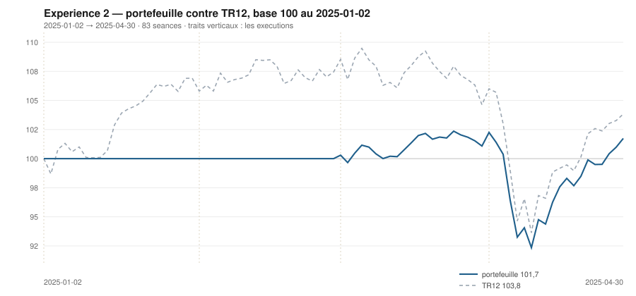

# Avril 2025

> Journal de l'[expérience 2](../README.md) · **décision au 2025-03-31** · **exécution au 2025-04-01**
> Portefeuille au 2025-04-30 : **10 173,98 €** (base 101,74) · TR12 103,83 · alpha du mois **+1,41 pt** · depuis janvier **-2,09 pt**

---

## 1. Les actualités du mois précédent

**Mars 2025** (`^FCHI` −3,96 %). Retournement. Le 5 mars, l'accord allemand sur
un fonds d'infrastructure et l'exemption des dépenses de défense du frein à
l'endettement provoque le plus fort mouvement de taux sur le Bund depuis 1990 ;
la hausse des rendements pèse sur les valorisations.

La BCE abaisse à 2,50 % le 6 mars. La fin du mois est dominée par l'attente du
2 avril, date annoncée pour les droits de douane américains dits
« réciproques » : les secteurs exportateurs — automobile, luxe, spiritueux —
décrochent.

Le mois efface une part de l'avance accumulée depuis janvier.

---

## 2. Le dépouillement des thèses écrites au 2025-02-28

> Piste **S4**. Ces énoncés ont été écrits le mois dernier, avant de connaître ce mois-ci. Aucun n'a été retouché ; le verdict est calculé.

| Valeur | Thèse | Énoncé | Constaté | Verdict |
|---|---|---|---|---|
| `AIR.PA` | Canal | clôture entre 163,74 € et 175,41 € au 2025-03-31 | 156,31 € | démentie |
| `AIR.PA` | Reflexive | AUCUNE SEQUENCE : écart contre TR12 dans ± 5 points, au 2025-03-31 | 0,86 pt | **confirmée** |
| `MC.PA` | Canal | clôture entre 689,23 € et 764,20 € au 2025-03-31 | 549,35 € | démentie |
| `MC.PA` | Reflexive | AUCUNE SEQUENCE : écart contre TR12 dans ± 5 points, au 2025-03-31 | -15,11 pt | démentie |
| `OR.PA` | Canal | clôture entre 322,31 € et 332,19 € au 2025-03-31 | 330,26 € | **confirmée** |
| `OR.PA` | Reflexive | AUCUNE SEQUENCE : écart contre TR12 dans ± 5 points, au 2025-03-31 | -0,25 pt | **confirmée** |
| `SAN.PA` | Canal | clôture entre 99,56 € et 95,77 € au 2025-03-31 | 92,45 € | démentie |
| `SAN.PA` | Reflexive | AUCUNE SEQUENCE : écart contre TR12 dans ± 5 points, au 2025-03-31 | 0,28 pt | **confirmée** |
| `BNP.PA` | Canal | clôture entre 38,52 € et 66,26 € au 2025-03-31 | 67,87 € | démentie |
| `BNP.PA` | Reflexive | AUTO-RENFORCEMENT : écart contre TR12 positif ou nul, au 2025-03-31 | 8,18 pt | **confirmée** |
| `TTE.PA` | Canal | clôture entre 55,55 € et 54,08 € au 2025-03-31 | 55,60 € | démentie |
| `TTE.PA` | Reflexive | AUCUNE SEQUENCE : écart contre TR12 dans ± 5 points, au 2025-03-31 | 7,27 pt | démentie |
| `SU.PA` | Canal | clôture entre 223,29 € et 278,16 € au 2025-03-31 | 203,84 € | démentie |
| `SU.PA` | Reflexive | AUCUNE SEQUENCE : écart contre TR12 dans ± 5 points, au 2025-03-31 | -7,30 pt | démentie |
| `AI.PA` | Canal | clôture entre 162,42 € et 157,81 € au 2025-03-31 | 153,12 € | démentie |
| `AI.PA` | Reflexive | AUCUNE SEQUENCE : écart contre TR12 dans ± 5 points, au 2025-03-31 | 1,78 pt | **confirmée** |
| `DG.PA` | Canal | clôture entre - € et - € au 2025-03-31 | 108,48 € | *non tranchée* |
| `DG.PA` | Reflexive | AUCUNE SEQUENCE : écart contre TR12 dans ± 5 points, au 2025-03-31 | 7,30 pt | démentie |
| `CAP.PA` | Canal | clôture entre 140,48 € et 172,75 € au 2025-03-31 | 130,74 € | démentie |
| `CAP.PA` | Reflexive | RETOURNEMENT : écart contre TR12 négatif ou nul, au 2025-03-31 | -4,82 pt | **confirmée** |
| `RI.PA` | Canal | clôture entre 84,77 € et 91,09 € au 2025-03-31 | 83,32 € | démentie |
| `RI.PA` | Reflexive | AUCUNE SEQUENCE : écart contre TR12 dans ± 5 points, au 2025-03-31 | -8,99 pt | démentie |
| `ORA.PA` | Canal | clôture entre 8,64 € et 10,81 € au 2025-03-31 | 11,06 € | démentie |
| `ORA.PA` | Reflexive | AUTO-RENFORCEMENT : écart contre TR12 positif ou nul, au 2025-03-31 | 6,52 pt | **confirmée** |

## 3. L'exposition héritée au 2025-03-31

| Valeur | Achetée le | Prix d'achat | +/− value | Alpha du mois | Alpha global |
|---|---|---|---|---|---|
| `BNP.PA` BNP Paribas | 2025-03-03 | 64,10 € | **+5,88 %** | +9,48 pt *(partiel)* | +9,48 pt |

## 4. Le portefeuille depuis le 2025-01-02

| | |
|---|---|
| Dotation initiale | 10 000,00 € au 2025-01-02 |
| Titres au 2025-04-30 | 8 011,43 € |
| Espèces | 2 162,55 € |
| **Total** | **10 173,98 €** |
| Base 100 | **101,74** |
| TR12, même base | 103,83 |
| Écart depuis janvier | **-2,09 pt** |

## 5. L'étude chartiste au 2025-03-31

> Notes rédigées sans aucune séance postérieure au 2025-03-31, par l'agent `chartiste`. Cinq lignes au plus par société.

### 1. `BNP.PA` — BNP Paribas

- Les deux tendances positives, clôture à 12,7 % du canal — bas.
- Encadrement serré, 67,20 à 72,47 €, se refermant dans 33 séances.
- Six contacts en support : le plancher est le mieux éprouvé du jour ; deux en résistance, veto 1.
- Momentum 12-1 de +16,9 %, le deuxième du jour.
- Toutes les composantes vont dans le même sens, et le veto 1 les annule.

### 2. `ORA.PA` — Orange

- Les deux tendances positives, clôture à 60,2 % d'un canal étroit, de 10,75 à 11,26 €.
- τ = 28,6 séances : le canal survit d'une décision à l'autre, de peu.
- Trois contacts en support, quatre en résistance : aucun veto.
- Momentum 12-1 de +15,6 %, en forte progression.
- Configuration favorable sur tous les critères sauf la position, à mi-canal.
- ---

### 3. `DG.PA` — Vinci

- Les deux tendances positives, clôture à 6,9 % du canal — juste au-dessus du support.
- Encadrement de 108,15 à 112,86 €, se refermant dans 21,8 séances, tout près du veto 2.
- Cinq contacts en support, trois en résistance : aucun veto.
- Momentum 12-1 de +1,1 %, légèrement positif.
- La seule valeur du jour qui réunisse tendances positives, position basse et figure lisible.

### 4. `SAN.PA` — Sanofi

- Tendance longue positive, courte négative : veto 3, plus veto 1 en support.
- Clôture à 92,45 €, à 9,2 % d'un canal de 91,51 à 101,76 €.
- τ = 111 séances : le canal tiendra cinq décisions.
- Momentum 12-1 de +24,5 %, le meilleur du jour.
- Le momentum le plus fort de l'univers, et deux vetos qui interdisent d'en faire quoi que ce soit.

### 5. `AIR.PA` — Airbus

- Tendance longue positive, courte neutre, clôture à 5,4 % du canal — presque sur le support.
- Encadrement de 155,18 à 176,22 €, canal divergent, τ infini.
- Trois contacts en support, quatre en résistance : aucun veto, la figure est établie des deux côtés.
- Momentum 12-1 de +0,3 %, réduit à presque rien par la correction de mars.
- Première fois depuis décembre que la valeur est lisible sans veto.

### 6. `AI.PA` — Air Liquide

- Tendance longue positive, courte négative : veto 3, plus veto 1 en résistance.
- Clôture à 153,12 €, à 6,8 % d'un canal de 152,33 à 163,85 €.
- τ = 57 séances.
- Momentum 12-1 de +5,4 %.
- Position basse dans un canal haussier, et deux vetos : la lecture s'arrête là.

### 7. `SU.PA` — Schneider Electric

- Tendance longue négative, courte neutre, clôture à 1,4 % du canal — sur le support.
- Encadrement immense, de 202,77 à 280,34 €, canal divergent.
- Deux contacts en résistance : veto 1.
- Momentum 12-1 de +14,4 %, encore fort malgré la chute du mois.
- La valeur a perdu trente points depuis janvier et reste positive sur douze mois.

### 8. `MC.PA` — LVMH

- Tendance longue positive, courte négative : veto 3.
- Clôture à 549,35 €, à 1,5 % d'un canal énorme, de 545,70 à 794,63 €.
- Deux contacts en résistance : veto 1 s'ajoute.
- Momentum 12-1 de −11,5 %.
- Un canal de 250 € de large ne mesure plus une position, il mesure une incertitude.

### 9. `TTE.PA` — TotalEnergies

- Tendance longue neutre, courte positive, clôture à 70,8 % du canal.
- Encadrement de 52,76 à 56,78 €, se refermant dans 42 séances.
- Deux contacts en résistance : veto 1.
- Momentum 12-1 de −10,0 %, exactement au seuil.
- Position haute et momentum au plancher : configuration défavorable sur les deux plans.

### 10. `OR.PA` — L'Oréal

- Tendance longue neutre, courte négative, clôture à 15,8 % du canal.
- Encadrement de 325,83 à 353,84 €, se refermant dans 58 séances.
- Quatre contacts en support, trois en résistance : aucun veto.
- Momentum 12-1 de −13,2 %.
- Position basse, mais rien dans les tendances ne va dans le sens d'une entrée.

### 11. `CAP.PA` — Capgemini

- Les deux tendances négatives, clôture à 1,0 % du canal — sur le support.
- Encadrement de 130,26 à 177,04 €, canal divergent.
- Deux contacts en résistance : veto 1.
- Momentum 12-1 de −28,3 %, le plus mauvais du jour.
- Un support touché dans une tendance baissière n'est pas un point d'entrée pour cette règle.

### 12. `RI.PA` — Pernod Ricard

- Les deux tendances négatives, clôture à 6,0 % du canal.
- Encadrement de 82,64 à 94,03 €, τ = 154 séances.
- Deux contacts en résistance : veto 1.
- Momentum 12-1 de −23,8 %.
- Quatrième mois consécutif au bas du classement, sans inflexion.

## 6. Le classement au 2025-03-31

> De la valeur la plus intéressante à détenir à celle qu'il faut fuir. La colonne **τ** donne la date de péremption du canal en séances (piste C4), la colonne **Vetos** les numéros déclenchés (piste T3). Une valeur sous veto ne peut pas être achetée.

| Rang | Valeur | `s1` | `s2` | `s3` | `s4` | `s5` | Score | Position | Momentum | τ | Vetos |
|---|---|---|---|---|---|---|---|---|---|---|---|
| 1 | `BNP.PA` BNP Paribas | +2 | +1 | +1 | +2 | +0 | **+6** | 12,7 % | +16,9 % | 33,4 | 1 |
| 2 | `ORA.PA` Orange | +2 | +1 | +0 | +2 | +0 | **+5** | 60,2 % | +15,6 % | 28,6 | — |
| 3 | `DG.PA` Vinci | +2 | +1 | +1 | +1 | +0 | **+5** | 6,9 % | +1,1 % | 21,8 | — |
| 4 | `SAN.PA` Sanofi | +2 | -1 | +1 | +2 | +0 | **+4** | 9,2 % | +24,4 % | 111,4 | 1 3 |
| 5 | `AIR.PA` Airbus | +2 | +0 | +1 | +1 | +0 | **+4** | 5,4 % | +0,3 % | ∞ | — |
| 6 | `AI.PA` Air Liquide | +2 | -1 | +1 | +1 | +0 | **+3** | 6,8 % | +5,4 % | 56,9 | 1 3 |
| 7 | `SU.PA` Schneider Electric | -2 | +0 | +1 | +2 | +0 | **+1** | 1,4 % | +14,3 % | ∞ | 1 |
| 8 | `MC.PA` LVMH | +2 | -1 | +1 | -2 | +0 | **+0** | 1,5 % | -11,5 % | ∞ | 1 3 |
| 9 | `TTE.PA` TotalEnergies | +0 | +1 | -1 | -1 | +0 | **-1** | 70,8 % | -9,9 % | 42,0 | 1 |
| 10 | `OR.PA` L'Oréal | +0 | -1 | +1 | -2 | +0 | **-2** | 15,8 % | -13,2 % | 57,5 | — |
| 11 | `CAP.PA` Capgemini | -2 | -1 | +1 | -2 | +0 | **-4** | 1,0 % | -28,3 % | ∞ | 1 |
| 12 | `RI.PA` Pernod Ricard | -2 | -1 | +1 | -2 | -1 | **-5** | 6,0 % | -23,8 % | 153,8 | 1 |

## 7. Les ordres exécutés au 2025-04-01

> À l'**ouverture** de la séance, jamais à la clôture du 2025-03-31.

| Sens | Valeur | Quantité | Prix d'exécution | Brut | Frais | Motif |
|---|---|---|---|---|---|---|
| **Achat** | `ORA.PA` Orange | 180 | 11,05 € | 1 989,49 € | 8,26 € | rang 2, score +5, aucun veto |
| **Achat** | `DG.PA` Vinci | 18 | 108,29 € | 1 949,28 € | 8,09 € | rang 3, score +5, aucun veto |
| **Achat** | `AIR.PA` Airbus | 12 | 157,06 € | 1 884,74 € | 2,17 € | rang 5, score +4, aucun veto |

## 8. La lecture du mois

Sur le mois, la meilleure contribution vient de `DG.PA` (Vinci) pour **+174,79 €**, la moins bonne de `AIR.PA` (Airbus) pour **-151,10 €**. Les 3 ordres du mois ont coûté **18,51 €** de frais, soit 0,185 % de la dotation initiale. Le portefeuille termine le mois **devant TR12** de 1,41 point. Sur les 23 thèses du mois précédent qui ont pu être dépouillées, **8 sont confirmées** — 34,8 %.

## 9. Les thèses écrites au 2025-03-31

> Elles seront dépouillées à la prochaine date de décision, dans le fichier du mois suivant. Elles sont engendrées mécaniquement par les règles du [protocole](../README.md#le-registre-des-thèses-réfutables) — aucune n'est rédigée à la main.

| Valeur | Thèse | Énoncé, à dépouiller au mois suivant |
|---|---|---|
| `AIR.PA` | Canal | clôture entre 161,13 € et 182,18 € au 2025-04-30 |
| `AIR.PA` | Reflexive | AUCUNE SEQUENCE : écart contre TR12 dans ± 5 points, au 2025-04-30 |
| `MC.PA` | Canal | clôture entre 547,28 € et 822,69 € au 2025-04-30 |
| `MC.PA` | Reflexive | AUCUNE SEQUENCE : écart contre TR12 dans ± 5 points, au 2025-04-30 |
| `OR.PA` | Canal | clôture entre 331,12 € et 349,39 € au 2025-04-30 |
| `OR.PA` | Reflexive | AUCUNE SEQUENCE : écart contre TR12 dans ± 5 points, au 2025-04-30 |
| `SAN.PA` | Canal | clôture entre 94,93 € et 103,34 € au 2025-04-30 |
| `SAN.PA` | Reflexive | AUCUNE SEQUENCE : écart contre TR12 dans ± 5 points, au 2025-04-30 |
| `BNP.PA` | Canal | clôture entre 72,77 € et 74,88 € au 2025-04-30 |
| `BNP.PA` | Reflexive | AUCUNE SEQUENCE : écart contre TR12 dans ± 5 points, au 2025-04-30 |
| `TTE.PA` | Canal | clôture entre 54,66 € et 56,76 € au 2025-04-30 |
| `TTE.PA` | Reflexive | AUCUNE SEQUENCE : écart contre TR12 dans ± 5 points, au 2025-04-30 |
| `SU.PA` | Canal | clôture entre 198,54 € et 287,27 € au 2025-04-30 |
| `SU.PA` | Reflexive | AUCUNE SEQUENCE : écart contre TR12 dans ± 5 points, au 2025-04-30 |
| `AI.PA` | Canal | clôture entre 158,42 € et 165,89 € au 2025-04-30 |
| `AI.PA` | Reflexive | AUCUNE SEQUENCE : écart contre TR12 dans ± 5 points, au 2025-04-30 |
| `DG.PA` | Canal | clôture entre 114,56 € et 114,95 € au 2025-04-30 |
| `DG.PA` | Reflexive | AUCUNE SEQUENCE : écart contre TR12 dans ± 5 points, au 2025-04-30 |
| `CAP.PA` | Canal | clôture entre 127,62 € et 177,22 € au 2025-04-30 |
| `CAP.PA` | Reflexive | RETOURNEMENT : écart contre TR12 négatif ou nul, au 2025-04-30 |
| `RI.PA` | Canal | clôture entre 80,01 € et 89,92 € au 2025-04-30 |
| `RI.PA` | Reflexive | RETOURNEMENT : écart contre TR12 négatif ou nul, au 2025-04-30 |
| `ORA.PA` | Canal | clôture entre 11,46 € et 11,61 € au 2025-04-30 |
| `ORA.PA` | Reflexive | AUCUNE SEQUENCE : écart contre TR12 dans ± 5 points, au 2025-04-30 |

---

[← Mars](2025-03.md) · [Protocole](../README.md) · [Mai →](2025-05.md)
