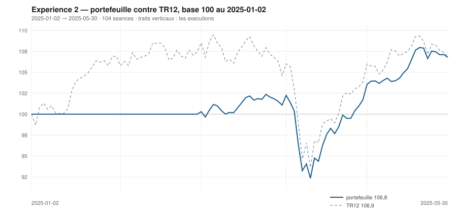

# Mai 2025

> Journal de l'[expérience 2](../README.md) · **décision au 2025-04-30** · **exécution au 2025-05-02**
> Portefeuille au 2025-05-30 : **10 677,86 €** (base 106,78) · TR12 106,86 · alpha du mois **+2,03 pt** · depuis janvier **-0,08 pt**

---

## 1. Les actualités du mois précédent

**Avril 2025** (`^FCHI` −2,53 %). Le mois le plus violent de l'année. Le 2 avril,
l'annonce de droits de douane généralisés déclenche une chute de plusieurs
séances consécutives sur toutes les places ; le 9 avril, la suspension de
quatre-vingt-dix jours provoque un rebond d'une ampleur symétrique.

L'euro s'apprécie fortement contre le dollar, ce qui pèse mécaniquement sur les
exportateurs européens au moment même où les tarifs les visent. La BCE abaisse à
2,25 % le 17 avril.

Le mois se termine près de son point de départ après un aller-retour de plus de
dix points, ce qu'aucune décision mensuelle ne peut capter.

---

## 2. Le dépouillement des thèses écrites au 2025-03-31

> Piste **S4**. Ces énoncés ont été écrits le mois dernier, avant de connaître ce mois-ci. Aucun n'a été retouché ; le verdict est calculé.

| Valeur | Thèse | Énoncé | Constaté | Verdict |
|---|---|---|---|---|
| `AIR.PA` | Canal | clôture entre 161,13 € et 182,18 € au 2025-04-30 | 144,47 € | démentie |
| `AIR.PA` | Reflexive | AUCUNE SEQUENCE : écart contre TR12 dans ± 5 points, au 2025-04-30 | -6,82 pt | démentie |
| `MC.PA` | Canal | clôture entre 547,28 € et 822,69 € au 2025-04-30 | 475,96 € | démentie |
| `MC.PA` | Reflexive | AUCUNE SEQUENCE : écart contre TR12 dans ± 5 points, au 2025-04-30 | -12,60 pt | démentie |
| `OR.PA` | Canal | clôture entre 331,12 € et 349,39 € au 2025-04-30 | 372,79 € | démentie |
| `OR.PA` | Reflexive | AUCUNE SEQUENCE : écart contre TR12 dans ± 5 points, au 2025-04-30 | 13,64 pt | démentie |
| `SAN.PA` | Canal | clôture entre 94,93 € et 103,34 € au 2025-04-30 | 86,99 € | démentie |
| `SAN.PA` | Reflexive | AUCUNE SEQUENCE : écart contre TR12 dans ± 5 points, au 2025-04-30 | -5,15 pt | démentie |
| `BNP.PA` | Canal | clôture entre 72,77 € et 74,88 € au 2025-04-30 | 65,56 € | démentie |
| `BNP.PA` | Reflexive | AUCUNE SEQUENCE : écart contre TR12 dans ± 5 points, au 2025-04-30 | -2,65 pt | **confirmée** |
| `TTE.PA` | Canal | clôture entre 54,66 € et 56,76 € au 2025-04-30 | 47,68 € | démentie |
| `TTE.PA` | Reflexive | AUCUNE SEQUENCE : écart contre TR12 dans ± 5 points, au 2025-04-30 | -13,49 pt | démentie |
| `SU.PA` | Canal | clôture entre 198,54 € et 287,27 € au 2025-04-30 | 197,51 € | démentie |
| `SU.PA` | Reflexive | AUCUNE SEQUENCE : écart contre TR12 dans ± 5 points, au 2025-04-30 | -2,35 pt | **confirmée** |
| `AI.PA` | Canal | clôture entre 158,42 € et 165,89 € au 2025-04-30 | 157,86 € | démentie |
| `AI.PA` | Reflexive | AUCUNE SEQUENCE : écart contre TR12 dans ± 5 points, au 2025-04-30 | 3,86 pt | **confirmée** |
| `DG.PA` | Canal | clôture entre 114,56 € et 114,95 € au 2025-04-30 | 118,00 € | démentie |
| `DG.PA` | Reflexive | AUCUNE SEQUENCE : écart contre TR12 dans ± 5 points, au 2025-04-30 | 9,54 pt | démentie |
| `CAP.PA` | Canal | clôture entre 127,62 € et 177,22 € au 2025-04-30 | 132,44 € | **confirmée** |
| `CAP.PA` | Reflexive | RETOURNEMENT : écart contre TR12 négatif ou nul, au 2025-04-30 | 2,06 pt | démentie |
| `RI.PA` | Canal | clôture entre 80,01 € et 89,92 € au 2025-04-30 | 86,93 € | **confirmée** |
| `RI.PA` | Reflexive | RETOURNEMENT : écart contre TR12 négatif ou nul, au 2025-04-30 | 5,10 pt | démentie |
| `ORA.PA` | Canal | clôture entre 11,46 € et 11,61 € au 2025-04-30 | 11,79 € | démentie |
| `ORA.PA` | Reflexive | AUCUNE SEQUENCE : écart contre TR12 dans ± 5 points, au 2025-04-30 | 7,35 pt | démentie |

## 3. L'exposition héritée au 2025-04-30

| Valeur | Achetée le | Prix d'achat | +/− value | Alpha du mois | Alpha global |
|---|---|---|---|---|---|
| `AIR.PA` Airbus | 2025-04-01 | 157,06 € | **-8,02 %** | -5,97 pt *(partiel)* | -5,97 pt |
| `BNP.PA` BNP Paribas | 2025-03-03 | 64,10 € | **+2,27 %** | -2,65 pt | +6,61 pt |
| `DG.PA` Vinci | 2025-04-01 | 108,29 € | **+8,97 %** | +11,02 pt *(partiel)* | +11,02 pt |
| `ORA.PA` Orange | 2025-04-01 | 11,05 € | **+6,63 %** | +8,68 pt *(partiel)* | +8,68 pt |

## 4. Le portefeuille depuis le 2025-01-02

| | |
|---|---|
| Dotation initiale | 10 000,00 € au 2025-01-02 |
| Titres au 2025-05-30 | 8 515,31 € |
| Espèces | 2 162,55 € |
| **Total** | **10 677,86 €** |
| Base 100 | **106,78** |
| TR12, même base | 106,86 |
| Écart depuis janvier | **-0,08 pt** |

## 5. L'étude chartiste au 2025-04-30

> Notes rédigées sans aucune séance postérieure au 2025-04-30, par l'agent `chartiste`. Cinq lignes au plus par société.

### 1. `SAN.PA` — Sanofi

- Tendance longue positive, courte neutre, clôture à 32,1 % du canal.
- Encadrement très large, de 77,93 à 106,11 €, canal divergent.
- Deux contacts de chaque côté : veto 1.
- Momentum 12-1 de +18,3 %, le deuxième du jour.
- Position basse, tendance haute, momentum fort — et un veto pour la deuxième fois de suite.

### 2. `BNP.PA` — BNP Paribas

- Tendance longue positive, courte neutre, clôture à 49,0 % du canal — au milieu.
- Encadrement de 54,77 à 76,79 €, canal divergent, quatre contacts en support et trois en résistance.
- Aucun veto : la figure est lisible des deux côtés.
- Momentum 12-1 de +22,9 %, le meilleur de l'univers.
- Le meilleur momentum du jour dans une figure lisible, à mi-canal.

### 3. `ORA.PA` — Orange

- Les deux tendances positives, clôture à 87,2 % du canal.
- Encadrement de 10,72 à 11,94 €, τ = 1 988 séances : canal quasi parallèle.
- Trois contacts en support, sept en résistance : aucun veto.
- Momentum 12-1 de +21,9 %, le troisième du jour.
- Figure lisible et durable, tendances positives, mais position haute.
- ---

### 4. `AI.PA` — Air Liquide

- Les deux tendances positives, clôture à 98,1 % du canal — sur la résistance.
- Encadrement de 139,95 à 158,21 €, τ = 95 séances.
- Deux contacts de chaque côté : veto 1.
- Momentum 12-1 de +8,5 %.
- Tout est favorable sauf la position, et un veto rend la question théorique.

### 5. `DG.PA` — Vinci

- Les deux tendances positives, clôture à 97,1 % du canal — sur la résistance.
- Encadrement de 98,41 à 118,58 €, canal divergent.
- Sept contacts en résistance, quatre en support : la figure la mieux éprouvée du jour.
- Momentum 12-1 de +7,7 %.
- Aucun veto, mais une position au plafond que `s3` aligné pénalise.

### 6. `AIR.PA` — Airbus

- Tendance longue positive, courte neutre, clôture à 39,3 % du canal.
- L'encadrement s'est ouvert d'un coup : 120,07 à 182,19 €, canal divergent, τ infini.
- Deux contacts en support : veto 1.
- Momentum 12-1 de +6,1 %.
- Un canal qui double de largeur en un mois mesure la volatilité d'avril, pas une tendance.

### 7. `TTE.PA` — TotalEnergies

- Tendance longue neutre, courte neutre, clôture à 26,1 % du canal.
- Encadrement de 44,14 à 57,70 €, canal divergent, trois contacts en support et quatre en résistance.
- Aucun veto.
- Momentum 12-1 de −7,1 %.
- Position basse, mais deux tendances neutres : la règle n'a rien à quoi s'accrocher.

### 8. `OR.PA` — L'Oréal

- Les deux tendances positives, clôture à 95,4 % du canal — tout en haut.
- Encadrement de 316,25 à 375,49 €, canal divergent.
- Deux contacts de chaque côté : veto 1.
- Momentum 12-1 de −22,1 %, malgré le retournement des tendances.
- Tendances et momentum se contredisent : la règle ne tranche pas.

### 9. `SU.PA` — Schneider Electric

- Tendance longue négative, courte neutre, clôture à 75,8 % du canal.
- Encadrement de 156,94 à 210,43 €, τ = 122 séances.
- Quatre contacts en support, trois en résistance : aucun veto.
- Momentum 12-1 de +0,4 %, réduit à rien depuis janvier.
- Le momentum le plus fort de décembre est devenu nul en quatre mois.

### 10. `CAP.PA` — Capgemini

- Tendance longue négative, courte neutre, clôture à 91,3 % du canal.
- Encadrement de 97,95 à 135,74 €, τ = 95 séances.
- Deux contacts de chaque côté : veto 1.
- Momentum 12-1 de −27,3 %, le plus mauvais du jour.
- Rien n'a bougé depuis quatre mois sur cette valeur.

### 11. `RI.PA` — Pernod Ricard

- Tendance longue négative, courte positive : veto 3.
- Clôture à 86,93 €, à 90,2 % d'un canal de 72,85 à 88,47 €.
- τ = 308 séances : le canal est presque parallèle.
- Momentum 12-1 de −30,6 %, le pire de toute l'année narrée à ce stade.
- Le rebond d'avril ne change pas une tendance longue installée depuis dix-huit mois.

### 12. `MC.PA` — LVMH

- Les deux tendances négatives, clôture à 73,1 % du canal.
- Encadrement de 448,15 à 486,21 €, se refermant dans 9,7 séances : veto 2.
- Trois contacts de chaque côté : la figure est éprouvée, mais elle expire.
- Momentum 12-1 de −24,2 %, en nette dégradation.
- Le canal mourra bien avant la décision de juin.

## 6. Le classement au 2025-04-30

> De la valeur la plus intéressante à détenir à celle qu'il faut fuir. La colonne **τ** donne la date de péremption du canal en séances (piste C4), la colonne **Vetos** les numéros déclenchés (piste T3). Une valeur sous veto ne peut pas être achetée.

| Rang | Valeur | `s1` | `s2` | `s3` | `s4` | `s5` | Score | Position | Momentum | τ | Vetos |
|---|---|---|---|---|---|---|---|---|---|---|---|
| 1 | `SAN.PA` Sanofi | +2 | +0 | +1 | +2 | +0 | **+5** | 32,1 % | +18,3 % | ∞ | 1 |
| 2 | `BNP.PA` BNP Paribas | +2 | +0 | +0 | +2 | +0 | **+4** | 49,0 % | +22,9 % | ∞ | — |
| 3 | `ORA.PA` Orange | +2 | +1 | -1 | +2 | +0 | **+4** | 87,2 % | +21,9 % | 1 987,9 | — |
| 4 | `AI.PA` Air Liquide | +2 | +1 | -1 | +1 | +0 | **+3** | 98,1 % | +8,5 % | 94,9 | 1 |
| 5 | `DG.PA` Vinci | +2 | +1 | -1 | +1 | +0 | **+3** | 97,1 % | +7,7 % | ∞ | — |
| 6 | `AIR.PA` Airbus | +2 | +0 | +0 | +1 | +0 | **+3** | 39,3 % | +6,1 % | ∞ | 1 |
| 7 | `TTE.PA` TotalEnergies | +0 | +0 | +1 | -1 | +0 | **+0** | 26,1 % | -7,1 % | ∞ | — |
| 8 | `OR.PA` L'Oréal | +2 | +1 | -1 | -2 | +0 | **+0** | 95,4 % | -22,1 % | ∞ | 1 |
| 9 | `SU.PA` Schneider Electric | -2 | +0 | -1 | +1 | +0 | **-2** | 75,8 % | +0,4 % | 122,1 | — |
| 10 | `CAP.PA` Capgemini | -2 | +0 | -1 | -2 | +0 | **-5** | 91,3 % | -27,2 % | 94,5 | 1 |
| 11 | `RI.PA` Pernod Ricard | -2 | +1 | -1 | -2 | -1 | **-5** | 90,2 % | -30,6 % | 308,0 | 3 |
| 12 | `MC.PA` LVMH | -2 | -1 | -1 | -2 | +0 | **-6** | 73,1 % | -24,2 % | 9,7 | 2 |

## 7. Les ordres exécutés au 2025-05-02

> À l'**ouverture** de la séance, jamais à la clôture du 2025-04-30.

*Aucun ordre : le classement ne déclenche ni entrée ni sortie.*

## 8. La lecture du mois

Sur le mois, la meilleure contribution vient de `BNP.PA` (BNP Paribas) pour **+213,47 €**, la moins bonne de `DG.PA` (Vinci) pour **+56,31 €**. Aucun ordre, donc aucun frais : le classement, l'hystérésis ou les vetos ont retenu le portefeuille en l'état. Le portefeuille termine le mois **devant TR12** de 2,03 point. Sur les 24 thèses du mois précédent qui ont pu être dépouillées, **5 sont confirmées** — 20,8 %.

## 9. Les thèses écrites au 2025-04-30

> Elles seront dépouillées à la prochaine date de décision, dans le fichier du mois suivant. Elles sont engendrées mécaniquement par les règles du [protocole](../README.md#le-registre-des-thèses-réfutables) — aucune n'est rédigée à la main.

| Valeur | Thèse | Énoncé, à dépouiller au mois suivant |
|---|---|---|
| `AIR.PA` | Canal | clôture entre 118,24 € et 188,45 € au 2025-05-30 |
| `AIR.PA` | Reflexive | AUCUNE SEQUENCE : écart contre TR12 dans ± 5 points, au 2025-05-30 |
| `MC.PA` | Canal | clôture entre 431,79 € et 387,88 € au 2025-05-30 |
| `MC.PA` | Reflexive | AUCUNE SEQUENCE : écart contre TR12 dans ± 5 points, au 2025-05-30 |
| `OR.PA` | Canal | clôture entre 318,48 € et 381,96 € au 2025-05-30 |
| `OR.PA` | Reflexive | AUTO-RENFORCEMENT : écart contre TR12 positif ou nul, au 2025-05-30 |
| `SAN.PA` | Canal | clôture entre 77,60 € et 109,43 € au 2025-05-30 |
| `SAN.PA` | Reflexive | AUCUNE SEQUENCE : écart contre TR12 dans ± 5 points, au 2025-05-30 |
| `BNP.PA` | Canal | clôture entre 56,08 € et 80,79 € au 2025-05-30 |
| `BNP.PA` | Reflexive | AUCUNE SEQUENCE : écart contre TR12 dans ± 5 points, au 2025-05-30 |
| `TTE.PA` | Canal | clôture entre 43,70 € et 58,58 € au 2025-05-30 |
| `TTE.PA` | Reflexive | AUCUNE SEQUENCE : écart contre TR12 dans ± 5 points, au 2025-05-30 |
| `SU.PA` | Canal | clôture entre 144,43 € et 188,72 € au 2025-05-30 |
| `SU.PA` | Reflexive | AUCUNE SEQUENCE : écart contre TR12 dans ± 5 points, au 2025-05-30 |
| `AI.PA` | Canal | clôture entre 141,39 € et 155,61 € au 2025-05-30 |
| `AI.PA` | Reflexive | AUTO-RENFORCEMENT : écart contre TR12 positif ou nul, au 2025-05-30 |
| `DG.PA` | Canal | clôture entre 100,38 € et 122,77 € au 2025-05-30 |
| `DG.PA` | Reflexive | AUTO-RENFORCEMENT : écart contre TR12 positif ou nul, au 2025-05-30 |
| `CAP.PA` | Canal | clôture entre 89,24 € et 118,63 € au 2025-05-30 |
| `CAP.PA` | Reflexive | AUCUNE SEQUENCE : écart contre TR12 dans ± 5 points, au 2025-05-30 |
| `RI.PA` | Canal | clôture entre 68,70 € et 83,25 € au 2025-05-30 |
| `RI.PA` | Reflexive | AUCUNE SEQUENCE : écart contre TR12 dans ± 5 points, au 2025-05-30 |
| `ORA.PA` | Canal | clôture entre 11,26 € et 12,47 € au 2025-05-30 |
| `ORA.PA` | Reflexive | AUTO-RENFORCEMENT : écart contre TR12 positif ou nul, au 2025-05-30 |

---

[← Avril](2025-04.md) · [Protocole](../README.md) · [Juin →](2025-06.md)
