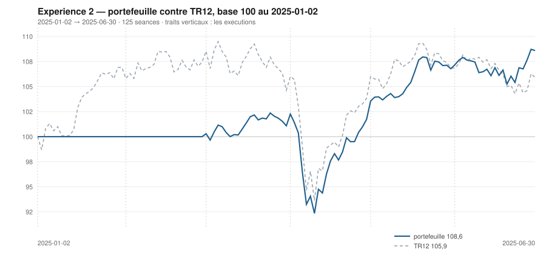

# Juin 2025

> Journal de l'[expérience 2](../README.md) · **décision au 2025-05-30** · **exécution au 2025-06-02**
> Portefeuille au 2025-06-30 : **10 858,95 €** (base 108,59) · TR12 105,91 · alpha du mois **+2,58 pt** · depuis janvier **+2,67 pt**

---

## 1. Les actualités du mois précédent

**Mai 2025** (`^FCHI` +2,08 %). Détente. L'accord de Genève du 12 mai entre
Washington et Pékin abaisse fortement les droits réciproques pour quatre-vingt-dix
jours ; les marchés effacent le reste de la correction d'avril.

Le 16 mai, Moody's retire aux États-Unis sa dernière note souveraine maximale.
L'événement fait remonter les rendements longs sans interrompre la hausse des
actions.

L'inflation de la zone euro revient au voisinage de 2 %, ce qui installe l'idée
que le cycle de baisse touche à sa fin.

---

## 2. Le dépouillement des thèses écrites au 2025-04-30

> Piste **S4**. Ces énoncés ont été écrits le mois dernier, avant de connaître ce mois-ci. Aucun n'a été retouché ; le verdict est calculé.

| Valeur | Thèse | Énoncé | Constaté | Verdict |
|---|---|---|---|---|
| `AIR.PA` | Canal | clôture entre 118,24 € et 188,45 € au 2025-05-30 | 159,14 € | **confirmée** |
| `AIR.PA` | Reflexive | AUCUNE SEQUENCE : écart contre TR12 dans ± 5 points, au 2025-05-30 | 7,24 pt | démentie |
| `MC.PA` | Canal | clôture entre 431,79 € et 387,88 € au 2025-05-30 | 466,55 € | démentie |
| `MC.PA` | Reflexive | AUCUNE SEQUENCE : écart contre TR12 dans ± 5 points, au 2025-05-30 | -4,90 pt | **confirmée** |
| `OR.PA` | Canal | clôture entre 318,48 € et 381,96 € au 2025-05-30 | 365,23 € | **confirmée** |
| `OR.PA` | Reflexive | AUTO-RENFORCEMENT : écart contre TR12 positif ou nul, au 2025-05-30 | -4,95 pt | démentie |
| `SAN.PA` | Canal | clôture entre 77,60 € et 109,43 € au 2025-05-30 | 82,89 € | **confirmée** |
| `SAN.PA` | Reflexive | AUCUNE SEQUENCE : écart contre TR12 dans ± 5 points, au 2025-05-30 | -7,64 pt | démentie |
| `BNP.PA` | Canal | clôture entre 56,08 € et 80,79 € au 2025-05-30 | 72,44 € | **confirmée** |
| `BNP.PA` | Reflexive | AUCUNE SEQUENCE : écart contre TR12 dans ± 5 points, au 2025-05-30 | 7,59 pt | démentie |
| `TTE.PA` | Canal | clôture entre 43,70 € et 58,58 € au 2025-05-30 | 48,15 € | **confirmée** |
| `TTE.PA` | Reflexive | AUCUNE SEQUENCE : écart contre TR12 dans ± 5 points, au 2025-05-30 | -1,94 pt | **confirmée** |
| `SU.PA` | Canal | clôture entre 144,43 € et 188,72 € au 2025-05-30 | 217,94 € | démentie |
| `SU.PA` | Reflexive | AUCUNE SEQUENCE : écart contre TR12 dans ± 5 points, au 2025-05-30 | 7,43 pt | démentie |
| `AI.PA` | Canal | clôture entre 141,39 € et 155,61 € au 2025-05-30 | 162,34 € | démentie |
| `AI.PA` | Reflexive | AUTO-RENFORCEMENT : écart contre TR12 positif ou nul, au 2025-05-30 | -0,08 pt | démentie |
| `DG.PA` | Canal | clôture entre 100,38 € et 122,77 € au 2025-05-30 | 121,13 € | **confirmée** |
| `DG.PA` | Reflexive | AUTO-RENFORCEMENT : écart contre TR12 positif ou nul, au 2025-05-30 | -0,27 pt | démentie |
| `CAP.PA` | Canal | clôture entre 89,24 € et 118,63 € au 2025-05-30 | 141,69 € | démentie |
| `CAP.PA` | Reflexive | AUCUNE SEQUENCE : écart contre TR12 dans ± 5 points, au 2025-05-30 | 4,07 pt | **confirmée** |
| `RI.PA` | Canal | clôture entre 68,70 € et 83,25 € au 2025-05-30 | 83,10 € | **confirmée** |
| `RI.PA` | Reflexive | AUCUNE SEQUENCE : écart contre TR12 dans ± 5 points, au 2025-05-30 | -7,33 pt | démentie |
| `ORA.PA` | Canal | clôture entre 11,26 € et 12,47 € au 2025-05-30 | 12,11 € | **confirmée** |
| `ORA.PA` | Reflexive | AUTO-RENFORCEMENT : écart contre TR12 positif ou nul, au 2025-05-30 | -0,18 pt | démentie |

## 3. L'exposition héritée au 2025-05-30

| Valeur | Achetée le | Prix d'achat | +/− value | Alpha du mois | Alpha global |
|---|---|---|---|---|---|
| `AIR.PA` Airbus | 2025-04-01 | 157,06 € | **+1,32 %** | +7,24 pt | +0,51 pt |
| `BNP.PA` BNP Paribas | 2025-03-03 | 64,10 € | **+13,01 %** | +7,59 pt | +14,56 pt |
| `DG.PA` Vinci | 2025-04-01 | 108,29 € | **+11,86 %** | -0,27 pt | +11,05 pt |
| `ORA.PA` Orange | 2025-04-01 | 11,05 € | **+9,55 %** | -0,18 pt | +8,74 pt |

## 4. Le portefeuille depuis le 2025-01-02

| | |
|---|---|
| Dotation initiale | 10 000,00 € au 2025-01-02 |
| Titres au 2025-06-30 | 8 696,39 € |
| Espèces | 2 162,55 € |
| **Total** | **10 858,95 €** |
| Base 100 | **108,59** |
| TR12, même base | 105,91 |
| Écart depuis janvier | **+2,67 pt** |

## 5. L'étude chartiste au 2025-05-30

> Notes rédigées sans aucune séance postérieure au 2025-05-30, par l'agent `chartiste`. Cinq lignes au plus par société.

### 1. `DG.PA` — Vinci

- Les deux tendances positives, clôture exactement sur le support — position 0,0 %.
- Encadrement de 121,13 à 126,58 €, se refermant dans 13,5 séances : veto 2.
- Deux contacts en support : veto 1.
- Momentum 12-1 de +12,6 %, le deuxième du jour.
- Position au plancher absolu, et deux vetos.

### 2. `BNP.PA` — BNP Paribas

- Les deux tendances positives, clôture à 22,8 % du canal — bas.
- Encadrement extrêmement serré, 71,96 à 74,10 €, se refermant dans 4,7 séances : veto 2.
- Deux contacts en résistance : veto 1 également.
- Momentum 12-1 de +11,2 %.
- Un canal qui meurt dans cinq séances : la position n'y veut plus rien dire.

### 3. `AI.PA` — Air Liquide

- Les deux tendances positives, clôture à 11,2 % du canal — près du support.
- Encadrement de 161,84 à 166,28 €, se refermant dans 7,4 séances : veto 2.
- Deux contacts en support : veto 1.
- Momentum 12-1 de +9,0 %.
- La configuration idéale de la règle, dans un canal qui n'existera plus dans huit séances.

### 4. `ORA.PA` — Orange

- Les deux tendances positives, clôture à 65,9 % du canal.
- Encadrement de 11,27 à 12,54 €, canal divergent, τ infini.
- Deux contacts en support : veto 1.
- Momentum 12-1 de +24,8 %, le meilleur de l'univers.
- Le meilleur momentum du jour, bloqué par un défaut de contacts en support.
- ---

### 5. `SAN.PA` — Sanofi

- Les deux tendances neutres, clôture à 28,1 % du canal.
- Encadrement de 80,91 à 87,96 €, se refermant dans 23 séances.
- Deux contacts en support : veto 1.
- Momentum 12-1 de +6,2 %, en fort recul depuis mars.
- Deux tendances neutres : la règle n'a aucun signe à lire.

### 6. `OR.PA` — L'Oréal

- Tendance longue positive, courte négative : veto 3.
- Clôture à 365,23 €, à 17,6 % d'un canal de 359,26 à 393,16 €.
- τ = 42 séances, trois contacts en support et quatre en résistance.
- Momentum 12-1 de −14,4 %.
- Position basse et tendance longue haute, annulées par un veto de contradiction.

### 7. `AIR.PA` — Airbus

- Tendance longue neutre, courte positive, clôture à 93,6 % du canal.
- Encadrement très large, de 109,67 à 162,50 €, canal divergent.
- Trois contacts de chaque côté : aucun veto.
- Momentum 12-1 de −1,4 %, passé négatif.
- Le momentum s'est effondré de +6 % à −1 % en un mois, sans que le cours baisse.

### 8. `SU.PA` — Schneider Electric

- Tendance longue négative, courte positive : veto 3, plus veto 1 et veto 2.
- Clôture à 217,94 €, à 23,3 % d'un canal de 215,76 à 225,12 €.
- τ = 5,0 séances : le canal se referme dans la semaine.
- Momentum 12-1 de −9,0 %, passé négatif pour la première fois.
- Trois vetos sur une même évaluation, le maximum observé cette année.

### 9. `CAP.PA` — Capgemini

- Tendance longue négative, courte positive : veto 3, plus veto 2.
- Clôture à 141,69 €, à 4,2 % d'un canal de 141,55 à 145,03 €.
- τ = 2,4 séances : le canal se referme après-demain.
- Momentum 12-1 de −26,0 %.
- Le canal le plus éphémère de toute l'année narrée.

### 10. `TTE.PA` — TotalEnergies

- Les deux tendances neutres, clôture à 90,2 % du canal.
- Encadrement de 43,70 à 48,63 €, se refermant dans 29 séances.
- Trois contacts de chaque côté : aucun veto.
- Momentum 12-1 de −16,1 %, en nette dégradation.
- Position haute et momentum en chute : rien de favorable.

### 11. `RI.PA` — Pernod Ricard

- Les deux tendances négatives, clôture à 3,3 % du canal.
- Encadrement de 82,92 à 88,49 €, se refermant dans 15 séances : veto 2.
- Trois contacts en support, quatre en résistance : la figure est éprouvée mais expire.
- Momentum 12-1 de −28,4 %.
- Sixième mois consécutif en bas de classement.

### 12. `MC.PA` — LVMH

- Tendance longue négative, courte neutre, clôture à 71,7 % du canal.
- Encadrement de 411,19 à 488,42 €, se refermant dans 49 séances.
- Trois contacts en support, cinq en résistance : aucun veto.
- Momentum 12-1 de −32,0 %, le plus mauvais de l'univers.
- Le luxe atteint son point bas relatif de l'année sur douze mois glissants.

## 6. Le classement au 2025-05-30

> De la valeur la plus intéressante à détenir à celle qu'il faut fuir. La colonne **τ** donne la date de péremption du canal en séances (piste C4), la colonne **Vetos** les numéros déclenchés (piste T3). Une valeur sous veto ne peut pas être achetée.

| Rang | Valeur | `s1` | `s2` | `s3` | `s4` | `s5` | Score | Position | Momentum | τ | Vetos |
|---|---|---|---|---|---|---|---|---|---|---|---|
| 1 | `DG.PA` Vinci | +2 | +1 | +1 | +2 | +0 | **+6** | 0,0 % | +12,6 % | 13,5 | 1 2 |
| 2 | `BNP.PA` BNP Paribas | +2 | +1 | +1 | +2 | +0 | **+6** | 22,8 % | +11,2 % | 4,7 | 1 2 |
| 3 | `AI.PA` Air Liquide | +2 | +1 | +1 | +1 | +0 | **+5** | 11,2 % | +9,0 % | 7,4 | 1 2 |
| 4 | `ORA.PA` Orange | +2 | +1 | -1 | +2 | +0 | **+4** | 65,9 % | +24,8 % | ∞ | 1 |
| 5 | `SAN.PA` Sanofi | +0 | +0 | +1 | +1 | +0 | **+2** | 28,1 % | +6,2 % | 22,8 | 1 |
| 6 | `OR.PA` L'Oréal | +2 | -1 | +1 | -2 | +0 | **+0** | 17,6 % | -14,4 % | 42,3 | 3 |
| 7 | `AIR.PA` Airbus | +0 | +1 | -1 | -1 | +0 | **-1** | 93,6 % | -1,4 % | ∞ | — |
| 8 | `SU.PA` Schneider Electric | -2 | +1 | +1 | -1 | +0 | **-1** | 23,3 % | -9,0 % | 5,0 | 1 2 3 |
| 9 | `CAP.PA` Capgemini | -2 | +1 | +1 | -2 | +0 | **-2** | 4,2 % | -26,0 % | 2,4 | 2 3 |
| 10 | `TTE.PA` TotalEnergies | +0 | +0 | -1 | -2 | +0 | **-3** | 90,2 % | -16,1 % | 29,2 | — |
| 11 | `RI.PA` Pernod Ricard | -2 | -1 | +1 | -2 | -1 | **-5** | 3,3 % | -28,4 % | 15,1 | 2 |
| 12 | `MC.PA` LVMH | -2 | +0 | -1 | -2 | +0 | **-5** | 71,7 % | -32,0 % | 49,0 | — |

## 7. Les ordres exécutés au 2025-06-02

> À l'**ouverture** de la séance, jamais à la clôture du 2025-05-30.

*Aucun ordre : le classement ne déclenche ni entrée ni sortie.*

## 8. La lecture du mois

Sur le mois, la meilleure contribution vient de `AIR.PA` (Airbus) pour **+178,86 €**, la moins bonne de `BNP.PA` (BNP Paribas) pour **-23,87 €**. Aucun ordre, donc aucun frais : le classement, l'hystérésis ou les vetos ont retenu le portefeuille en l'état. Le portefeuille termine le mois **devant TR12** de 2,58 point. Sur les 24 thèses du mois précédent qui ont pu être dépouillées, **11 sont confirmées** — 45,8 %.

## 9. Les thèses écrites au 2025-05-30

> Elles seront dépouillées à la prochaine date de décision, dans le fichier du mois suivant. Elles sont engendrées mécaniquement par les règles du [protocole](../README.md#le-registre-des-thèses-réfutables) — aucune n'est rédigée à la main.

| Valeur | Thèse | Énoncé, à dépouiller au mois suivant |
|---|---|---|
| `AIR.PA` | Canal | clôture entre 102,84 € et 159,83 € au 2025-06-30 |
| `AIR.PA` | Reflexive | AUCUNE SEQUENCE : écart contre TR12 dans ± 5 points, au 2025-06-30 |
| `MC.PA` | Canal | clôture entre 380,57 € et 424,70 € au 2025-06-30 |
| `MC.PA` | Reflexive | AUCUNE SEQUENCE : écart contre TR12 dans ± 5 points, au 2025-06-30 |
| `OR.PA` | Canal | clôture entre 385,28 € et 402,33 € au 2025-06-30 |
| `OR.PA` | Reflexive | AUCUNE SEQUENCE : écart contre TR12 dans ± 5 points, au 2025-06-30 |
| `SAN.PA` | Canal | clôture entre 82,62 € et 83,18 € au 2025-06-30 |
| `SAN.PA` | Reflexive | AUCUNE SEQUENCE : écart contre TR12 dans ± 5 points, au 2025-06-30 |
| `BNP.PA` | Canal | clôture entre 82,53 € et 75,08 € au 2025-06-30 |
| `BNP.PA` | Reflexive | AUCUNE SEQUENCE : écart contre TR12 dans ± 5 points, au 2025-06-30 |
| `TTE.PA` | Canal | clôture entre 43,26 € et 44,65 € au 2025-06-30 |
| `TTE.PA` | Reflexive | AUCUNE SEQUENCE : écart contre TR12 dans ± 5 points, au 2025-06-30 |
| `SU.PA` | Canal | clôture entre 244,86 € et 214,65 € au 2025-06-30 |
| `SU.PA` | Reflexive | AUCUNE SEQUENCE : écart contre TR12 dans ± 5 points, au 2025-06-30 |
| `AI.PA` | Canal | clôture entre 175,91 € et 167,75 € au 2025-06-30 |
| `AI.PA` | Reflexive | AUCUNE SEQUENCE : écart contre TR12 dans ± 5 points, au 2025-06-30 |
| `DG.PA` | Canal | clôture entre 135,20 € et 132,15 € au 2025-06-30 |
| `DG.PA` | Reflexive | AUCUNE SEQUENCE : écart contre TR12 dans ± 5 points, au 2025-06-30 |
| `CAP.PA` | Canal | clôture entre 163,35 € et 135,73 € au 2025-06-30 |
| `CAP.PA` | Reflexive | AUCUNE SEQUENCE : écart contre TR12 dans ± 5 points, au 2025-06-30 |
| `RI.PA` | Canal | clôture entre 87,06 € et 84,89 € au 2025-06-30 |
| `RI.PA` | Reflexive | RETOURNEMENT : écart contre TR12 négatif ou nul, au 2025-06-30 |
| `ORA.PA` | Canal | clôture entre 11,81 € et 13,12 € au 2025-06-30 |
| `ORA.PA` | Reflexive | AUTO-RENFORCEMENT : écart contre TR12 positif ou nul, au 2025-06-30 |

---

[← Mai](2025-05.md) · [Protocole](../README.md) · [Juillet →](2025-07.md)
