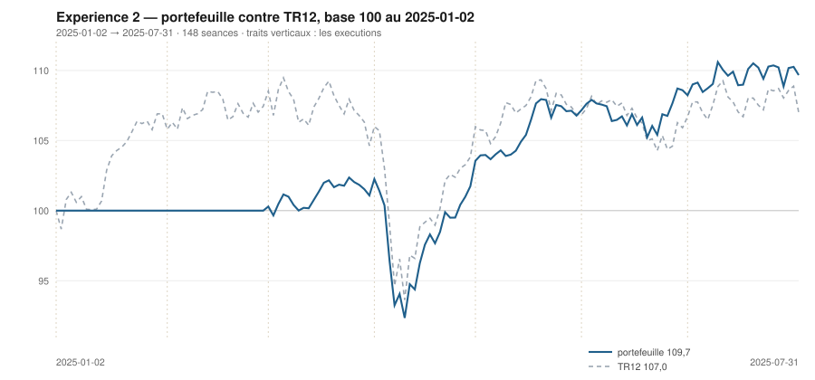

# Juillet 2025

> Journal de l'[expérience 2](../README.md) · **décision au 2025-06-30** · **exécution au 2025-07-01**
> Portefeuille au 2025-07-31 : **10 966,68 €** (base 109,67) · TR12 107,00 · alpha du mois **-0,03 pt** · depuis janvier **+2,67 pt**

---

## 1. Les actualités du mois précédent

**Juin 2025** (`^FCHI` −1,11 %). La BCE abaisse à 2,00 % le 5 juin et indique
qu'elle est « bien placée » — le marché lit une pause.

Le 13 juin, l'attaque israélienne sur l'Iran ouvre douze jours de conflit ouvert.
Le baril bondit, la crainte d'une fermeture du détroit d'Ormuz domine une
semaine, puis le cessez-le-feu du 24 juin fait retomber le pétrole sous son
niveau de départ. L'énergie européenne suit le mouvement dans les deux sens.

Le sommet de l'OTAN de La Haye, le 25, acte un objectif de dépense de défense de
5 % du PIB à horizon 2035.

---

## 2. Le dépouillement des thèses écrites au 2025-05-30

> Piste **S4**. Ces énoncés ont été écrits le mois dernier, avant de connaître ce mois-ci. Aucun n'a été retouché ; le verdict est calculé.

| Valeur | Thèse | Énoncé | Constaté | Verdict |
|---|---|---|---|---|
| `AIR.PA` | Canal | clôture entre 102,84 € et 159,83 € au 2025-06-30 | 174,04 € | démentie |
| `AIR.PA` | Reflexive | AUCUNE SEQUENCE : écart contre TR12 dans ± 5 points, au 2025-06-30 | 10,25 pt | démentie |
| `MC.PA` | Canal | clôture entre 380,57 € et 424,70 € au 2025-06-30 | 433,72 € | démentie |
| `MC.PA` | Reflexive | AUCUNE SEQUENCE : écart contre TR12 dans ± 5 points, au 2025-06-30 | -6,15 pt | démentie |
| `OR.PA` | Canal | clôture entre 385,28 € et 402,33 € au 2025-06-30 | 356,10 € | démentie |
| `OR.PA` | Reflexive | AUCUNE SEQUENCE : écart contre TR12 dans ± 5 points, au 2025-06-30 | -1,61 pt | **confirmée** |
| `SAN.PA` | Canal | clôture entre 82,62 € et 83,18 € au 2025-06-30 | 77,86 € | démentie |
| `SAN.PA` | Reflexive | AUCUNE SEQUENCE : écart contre TR12 dans ± 5 points, au 2025-06-30 | -5,18 pt | démentie |
| `BNP.PA` | Canal | clôture entre 82,53 € et 75,08 € au 2025-06-30 | 71,67 € | démentie |
| `BNP.PA` | Reflexive | AUCUNE SEQUENCE : écart contre TR12 dans ± 5 points, au 2025-06-30 | -0,18 pt | **confirmée** |
| `TTE.PA` | Canal | clôture entre 43,26 € et 44,65 € au 2025-06-30 | 49,33 € | démentie |
| `TTE.PA` | Reflexive | AUCUNE SEQUENCE : écart contre TR12 dans ± 5 points, au 2025-06-30 | 3,33 pt | **confirmée** |
| `SU.PA` | Canal | clôture entre 244,86 € et 214,65 € au 2025-06-30 | 222,32 € | démentie |
| `SU.PA` | Reflexive | AUCUNE SEQUENCE : écart contre TR12 dans ± 5 points, au 2025-06-30 | 2,90 pt | **confirmée** |
| `AI.PA` | Canal | clôture entre 175,91 € et 167,75 € au 2025-06-30 | 155,88 € | démentie |
| `AI.PA` | Reflexive | AUCUNE SEQUENCE : écart contre TR12 dans ± 5 points, au 2025-06-30 | -3,09 pt | **confirmée** |
| `DG.PA` | Canal | clôture entre 135,20 € et 132,15 € au 2025-06-30 | 120,41 € | démentie |
| `DG.PA` | Reflexive | AUCUNE SEQUENCE : écart contre TR12 dans ± 5 points, au 2025-06-30 | 0,29 pt | **confirmée** |
| `CAP.PA` | Canal | clôture entre 163,35 € et 135,73 € au 2025-06-30 | 140,53 € | démentie |
| `CAP.PA` | Reflexive | AUCUNE SEQUENCE : écart contre TR12 dans ± 5 points, au 2025-06-30 | 0,07 pt | **confirmée** |
| `RI.PA` | Canal | clôture entre 87,06 € et 84,89 € au 2025-06-30 | 77,24 € | démentie |
| `RI.PA` | Reflexive | RETOURNEMENT : écart contre TR12 négatif ou nul, au 2025-06-30 | -6,17 pt | **confirmée** |
| `ORA.PA` | Canal | clôture entre 11,81 € et 13,12 € au 2025-06-30 | 12,33 € | **confirmée** |
| `ORA.PA` | Reflexive | AUTO-RENFORCEMENT : écart contre TR12 positif ou nul, au 2025-06-30 | 2,68 pt | **confirmée** |

## 3. L'exposition héritée au 2025-06-30

| Valeur | Achetée le | Prix d'achat | +/− value | Alpha du mois | Alpha global |
|---|---|---|---|---|---|
| `AIR.PA` Airbus | 2025-04-01 | 157,06 € | **+10,81 %** | +10,25 pt | +10,90 pt |
| `BNP.PA` BNP Paribas | 2025-03-03 | 64,10 € | **+11,81 %** | -0,18 pt | +14,23 pt |
| `DG.PA` Vinci | 2025-04-01 | 108,29 € | **+11,19 %** | +0,29 pt | +11,27 pt |
| `ORA.PA` Orange | 2025-04-01 | 11,05 € | **+11,51 %** | +2,68 pt | +11,60 pt |

## 4. Le portefeuille depuis le 2025-01-02

| | |
|---|---|
| Dotation initiale | 10 000,00 € au 2025-01-02 |
| Titres au 2025-07-31 | 8 804,13 € |
| Espèces | 2 162,55 € |
| **Total** | **10 966,68 €** |
| Base 100 | **109,67** |
| TR12, même base | 107,00 |
| Écart depuis janvier | **+2,67 pt** |

## 5. L'étude chartiste au 2025-06-30

> Notes rédigées sans aucune séance postérieure au 2025-06-30, par l'agent `chartiste`. Cinq lignes au plus par société.

### 1. `ORA.PA` — Orange

- Les deux tendances positives, clôture à 19,5 % du canal — bas.
- Encadrement de 12,13 à 13,12 €, τ = 234 séances : durable.
- Trois contacts en support, six en résistance : aucun veto.
- Momentum 12-1 de +42,2 %, de très loin le meilleur de l'univers.
- Toutes les composantes du score vont dans le même sens, et aucun veto ne s'y oppose.
- ---

### 2. `DG.PA` — Vinci

- Tendance longue positive, courte négative : veto 3, plus veto 1.
- Clôture à 120,41 €, à 16,7 % d'un canal de 118,02 à 132,30 €.
- τ = 144 séances : le canal tiendra sept décisions.
- Six contacts en résistance, deux en support.
- Momentum 12-1 de +27,6 %, le deuxième de l'univers.

### 3. `AI.PA` — Air Liquide

- Tendance longue positive, courte négative : veto 3, plus veto 1.
- Clôture à 155,88 €, à 3,3 % d'un canal de 155,48 à 167,75 €.
- τ = 54 séances.
- Momentum 12-1 de +13,1 %, le troisième du jour.
- Position quasi nulle dans le canal, tendance longue haussière, momentum fort — et deux vetos.

### 4. `BNP.PA` — BNP Paribas

- Tendance longue positive, courte négative : veto 3.
- Clôture à 71,67 €, à 38,4 % d'un canal de 69,55 à 75,08 €.
- τ = 24 séances : le canal survit tout juste à la cadence.
- Trois contacts de chaque côté : aucun défaut de lisibilité.
- Momentum 12-1 de +30,9 %, le plus fort de l'univers.

### 5. `AIR.PA` — Airbus

- Tendance longue neutre, courte positive, clôture à 88,7 % du canal.
- Encadrement de 162,77 à 175,48 €, se refermant dans 19,2 séances : veto 2.
- Trois contacts de chaque côté : la figure est éprouvée, mais elle expire avant la décision suivante.
- Momentum 12-1 de +22,0 %, le deuxième du jour et en forte hausse.
- Le momentum se retourne violemment, le canal meurt au même moment.

### 6. `OR.PA` — L'Oréal

- Tendance longue positive, courte négative : veto 3.
- Clôture à 356,10 €, à 22,6 % d'un canal de 342,62 à 402,33 €.
- τ = 1 110 séances : canal quasi parallèle, trois contacts de chaque côté.
- Momentum 12-1 de −6,5 %, en nette amélioration.
- La figure est la plus durable du jour ; le veto 3 interdit d'en conclure.

### 7. `SAN.PA` — Sanofi

- Les deux tendances négatives, clôture à 11,2 % du canal.
- Encadrement de 77,18 à 83,18 €, se refermant dans 28,5 séances.
- Deux contacts en support : veto 1.
- Momentum 12-1 de +1,3 %, presque nul.
- Le momentum est passé de +24,5 % en mars à +1,3 % en juin.

### 8. `TTE.PA` — TotalEnergies

- Tendance longue négative, courte neutre, clôture à 15,4 % du canal.
- Encadrement de 48,87 à 51,86 €, se refermant dans 19 séances : veto 2.
- Trois contacts de chaque côté.
- Momentum 12-1 de −17,0 %.
- Position basse dans une tendance basse : la règle alignée ne l'achète pas pour autant.

### 9. `SU.PA` — Schneider Electric

- Tendance longue négative, courte neutre, clôture à 68,9 % du canal.
- Encadrement de 211,98 à 227,00 €, se refermant dans 12,9 séances : veto 2, plus veto 1.
- Deux contacts en support seulement.
- Momentum 12-1 de −1,7 %.
- La valeur qui avait le meilleur momentum de l'univers en décembre est devenue neutre partout.

### 10. `CAP.PA` — Capgemini

- Les deux tendances négatives, clôture à 29,5 % du canal.
- Encadrement de 138,03 à 146,51 €, se refermant dans 9,2 séances : veto 2, plus veto 1.
- Deux contacts de chaque côté.
- Momentum 12-1 de −22,1 %.
- Sept mois d'observation, sept classements dans la moitié basse.

### 11. `RI.PA` — Pernod Ricard

- Les deux tendances négatives, clôture à 10,7 % du canal.
- Encadrement de 76,82 à 80,73 €, se refermant dans 12,7 séances : veto 2, plus veto 1.
- Six contacts en résistance, deux en support.
- Momentum 12-1 de −27,6 %.
- La valeur touche ses plus bas de la période observée.

### 12. `MC.PA` — LVMH

- Les deux tendances négatives, clôture à 45,3 % du canal.
- Encadrement très serré, 424,70 à 444,60 €, se refermant dans 9,0 séances : veto 2.
- Cinq contacts de chaque côté : c'est la figure la mieux éprouvée du jour, et la plus éphémère.
- Momentum 12-1 de −31,4 %, encore le plus mauvais.
- Un canal avec dix épisodes de contact et neuf séances à vivre : la lisibilité n'est pas la durée.

## 6. Le classement au 2025-06-30

> De la valeur la plus intéressante à détenir à celle qu'il faut fuir. La colonne **τ** donne la date de péremption du canal en séances (piste C4), la colonne **Vetos** les numéros déclenchés (piste T3). Une valeur sous veto ne peut pas être achetée.

| Rang | Valeur | `s1` | `s2` | `s3` | `s4` | `s5` | Score | Position | Momentum | τ | Vetos |
|---|---|---|---|---|---|---|---|---|---|---|---|
| 1 | `ORA.PA` Orange | +2 | +1 | +1 | +2 | +0 | **+6** | 19,5 % | +42,2 % | 234,5 | — |
| 2 | `DG.PA` Vinci | +2 | -1 | +1 | +2 | +0 | **+4** | 16,7 % | +27,6 % | 144,4 | 1 3 |
| 3 | `AI.PA` Air Liquide | +2 | -1 | +1 | +2 | +0 | **+4** | 3,3 % | +13,1 % | 53,8 | 1 3 |
| 4 | `BNP.PA` BNP Paribas | +2 | -1 | +0 | +2 | +0 | **+3** | 38,4 % | +30,9 % | 24,1 | 3 |
| 5 | `AIR.PA` Airbus | +0 | +1 | -1 | +2 | +0 | **+2** | 88,7 % | +22,0 % | 19,2 | 2 |
| 6 | `OR.PA` L'Oréal | +2 | -1 | +1 | -1 | +0 | **+1** | 22,6 % | -6,5 % | 1 109,5 | 3 |
| 7 | `SAN.PA` Sanofi | -2 | -1 | +1 | +1 | +0 | **-1** | 11,2 % | +1,3 % | 28,5 | 1 |
| 8 | `TTE.PA` TotalEnergies | -2 | +0 | +1 | -2 | +0 | **-3** | 15,4 % | -17,0 % | 19,0 | 2 |
| 9 | `SU.PA` Schneider Electric | -2 | +0 | -1 | -1 | +0 | **-4** | 68,9 % | -1,7 % | 12,9 | 1 2 |
| 10 | `CAP.PA` Capgemini | -2 | -1 | +1 | -2 | +0 | **-4** | 29,5 % | -22,1 % | 9,2 | 1 2 |
| 11 | `RI.PA` Pernod Ricard | -2 | -1 | +1 | -2 | -1 | **-5** | 10,7 % | -27,6 % | 12,7 | 1 2 |
| 12 | `MC.PA` LVMH | -2 | -1 | +0 | -2 | +0 | **-5** | 45,3 % | -31,4 % | 9,0 | 2 |

## 7. Les ordres exécutés au 2025-07-01

> À l'**ouverture** de la séance, jamais à la clôture du 2025-06-30.

*Aucun ordre : le classement ne déclenche ni entrée ni sortie.*

## 8. La lecture du mois

Sur le mois, la meilleure contribution vient de `BNP.PA` (BNP Paribas) pour **+108,88 €**, la moins bonne de `DG.PA` (Vinci) pour **-60,64 €**. Aucun ordre, donc aucun frais : le classement, l'hystérésis ou les vetos ont retenu le portefeuille en l'état. Le portefeuille termine le mois **derrière TR12** de 0,03 point. Sur les 24 thèses du mois précédent qui ont pu être dépouillées, **10 sont confirmées** — 41,7 %.

## 9. Les thèses écrites au 2025-06-30

> Elles seront dépouillées à la prochaine date de décision, dans le fichier du mois suivant. Elles sont engendrées mécaniquement par les règles du [protocole](../README.md#le-registre-des-thèses-réfutables) — aucune n'est rédigée à la main.

| Valeur | Thèse | Énoncé, à dépouiller au mois suivant |
|---|---|---|
| `AIR.PA` | Canal | clôture entre 179,47 € et 176,95 € au 2025-07-31 |
| `AIR.PA` | Reflexive | AUCUNE SEQUENCE : écart contre TR12 dans ± 5 points, au 2025-07-31 |
| `MC.PA` | Canal | clôture entre 411,22 € et 380,40 € au 2025-07-31 |
| `MC.PA` | Reflexive | AUCUNE SEQUENCE : écart contre TR12 dans ± 5 points, au 2025-07-31 |
| `OR.PA` | Canal | clôture entre 353,90 € et 412,38 € au 2025-07-31 |
| `OR.PA` | Reflexive | AUCUNE SEQUENCE : écart contre TR12 dans ± 5 points, au 2025-07-31 |
| `SAN.PA` | Canal | clôture entre 76,78 € et 77,94 € au 2025-07-31 |
| `SAN.PA` | Reflexive | RETOURNEMENT : écart contre TR12 négatif ou nul, au 2025-07-31 |
| `BNP.PA` | Canal | clôture entre 75,89 € et 76,16 € au 2025-07-31 |
| `BNP.PA` | Reflexive | AUCUNE SEQUENCE : écart contre TR12 dans ± 5 points, au 2025-07-31 |
| `TTE.PA` | Canal | clôture entre 50,74 € et 50,09 € au 2025-07-31 |
| `TTE.PA` | Reflexive | AUCUNE SEQUENCE : écart contre TR12 dans ± 5 points, au 2025-07-31 |
| `SU.PA` | Canal | clôture entre 230,58 € et 218,72 € au 2025-07-31 |
| `SU.PA` | Reflexive | AUCUNE SEQUENCE : écart contre TR12 dans ± 5 points, au 2025-07-31 |
| `AI.PA` | Canal | clôture entre 162,34 € et 169,36 € au 2025-07-31 |
| `AI.PA` | Reflexive | AUCUNE SEQUENCE : écart contre TR12 dans ± 5 points, au 2025-07-31 |
| `DG.PA` | Canal | clôture entre 126,50 € et 138,50 € au 2025-07-31 |
| `DG.PA` | Reflexive | AUCUNE SEQUENCE : écart contre TR12 dans ± 5 points, au 2025-07-31 |
| `CAP.PA` | Canal | clôture entre 151,69 € et 139,02 € au 2025-07-31 |
| `CAP.PA` | Reflexive | RETOURNEMENT : écart contre TR12 négatif ou nul, au 2025-07-31 |
| `RI.PA` | Canal | clôture entre 77,22 € et 74,05 € au 2025-07-31 |
| `RI.PA` | Reflexive | RETOURNEMENT : écart contre TR12 négatif ou nul, au 2025-07-31 |
| `ORA.PA` | Canal | clôture entre 12,86 € et 13,75 € au 2025-07-31 |
| `ORA.PA` | Reflexive | AUCUNE SEQUENCE : écart contre TR12 dans ± 5 points, au 2025-07-31 |

---

[← Juin](2025-06.md) · [Protocole](../README.md) · [Août →](2025-08.md)
