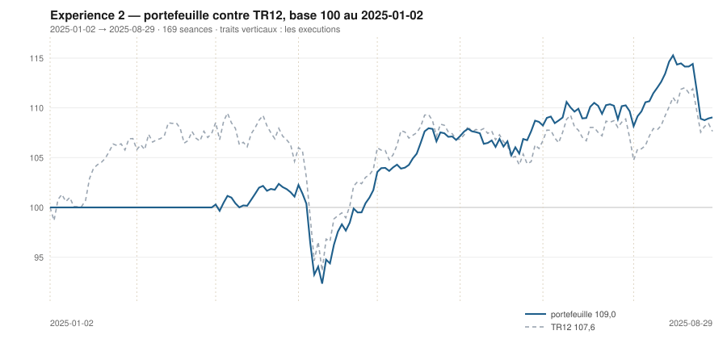

# Août 2025

> Journal de l'[expérience 2](../README.md) · **décision au 2025-07-31** · **exécution au 2025-08-01**
> Portefeuille au 2025-08-29 : **10 904,82 €** (base 109,05) · TR12 107,64 · alpha du mois **-1,17 pt** · depuis janvier **+1,40 pt**

---

## 1. Les actualités du mois précédent

**Juillet 2025** (`^FCHI` +1,38 %). Le 27 juillet, le cadre commercial
euro-américain fixe un droit de douane de 15 % sur la plupart des biens de
l'Union. Le chiffre est élevé mais connu : les secteurs exportateurs se
reprennent, l'incertitude ayant plus pesé que le niveau.

La Réserve fédérale maintient ses taux, avec deux dissidences internes — les
premières depuis 1993. La saison de résultats du deuxième trimestre est
globalement supérieure aux attentes en Europe.

Le luxe reste à l'écart du mouvement : la demande chinoise ne se redresse pas.

---

## 2. Le dépouillement des thèses écrites au 2025-06-30

> Piste **S4**. Ces énoncés ont été écrits le mois dernier, avant de connaître ce mois-ci. Aucun n'a été retouché ; le verdict est calculé.

| Valeur | Thèse | Énoncé | Constaté | Verdict |
|---|---|---|---|---|
| `AIR.PA` | Canal | clôture entre 179,47 € et 176,95 € au 2025-07-31 | 172,85 € | démentie |
| `AIR.PA` | Reflexive | AUCUNE SEQUENCE : écart contre TR12 dans ± 5 points, au 2025-07-31 | -1,71 pt | **confirmée** |
| `MC.PA` | Canal | clôture entre 411,22 € et 380,40 € au 2025-07-31 | 460,79 € | démentie |
| `MC.PA` | Reflexive | AUCUNE SEQUENCE : écart contre TR12 dans ± 5 points, au 2025-07-31 | 5,22 pt | démentie |
| `OR.PA` | Canal | clôture entre 353,90 € et 412,38 € au 2025-07-31 | 381,85 € | **confirmée** |
| `OR.PA` | Reflexive | AUCUNE SEQUENCE : écart contre TR12 dans ± 5 points, au 2025-07-31 | 6,20 pt | démentie |
| `SAN.PA` | Canal | clôture entre 76,78 € et 77,94 € au 2025-07-31 | 74,67 € | démentie |
| `SAN.PA` | Reflexive | RETOURNEMENT : écart contre TR12 négatif ou nul, au 2025-07-31 | -5,12 pt | **confirmée** |
| `BNP.PA` | Canal | clôture entre 75,89 € et 76,16 € au 2025-07-31 | 75,19 € | démentie |
| `BNP.PA` | Reflexive | AUCUNE SEQUENCE : écart contre TR12 dans ± 5 points, au 2025-07-31 | 3,88 pt | **confirmée** |
| `TTE.PA` | Canal | clôture entre 50,74 € et 50,09 € au 2025-07-31 | 49,25 € | démentie |
| `TTE.PA` | Reflexive | AUCUNE SEQUENCE : écart contre TR12 dans ± 5 points, au 2025-07-31 | -1,18 pt | **confirmée** |
| `SU.PA` | Canal | clôture entre 230,58 € et 218,72 € au 2025-07-31 | 224,73 € | démentie |
| `SU.PA` | Reflexive | AUCUNE SEQUENCE : écart contre TR12 dans ± 5 points, au 2025-07-31 | 0,06 pt | **confirmée** |
| `AI.PA` | Canal | clôture entre 162,34 € et 169,36 € au 2025-07-31 | 153,79 € | démentie |
| `AI.PA` | Reflexive | AUCUNE SEQUENCE : écart contre TR12 dans ± 5 points, au 2025-07-31 | -2,36 pt | **confirmée** |
| `DG.PA` | Canal | clôture entre 126,50 € et 138,50 € au 2025-07-31 | 117,04 € | démentie |
| `DG.PA` | Reflexive | AUCUNE SEQUENCE : écart contre TR12 dans ± 5 points, au 2025-07-31 | -3,82 pt | **confirmée** |
| `CAP.PA` | Canal | clôture entre 151,69 € et 139,02 € au 2025-07-31 | 126,82 € | démentie |
| `CAP.PA` | Reflexive | RETOURNEMENT : écart contre TR12 négatif ou nul, au 2025-07-31 | -10,78 pt | **confirmée** |
| `RI.PA` | Canal | clôture entre 77,22 € et 74,05 € au 2025-07-31 | 84,57 € | démentie |
| `RI.PA` | Reflexive | RETOURNEMENT : écart contre TR12 négatif ou nul, au 2025-07-31 | 8,47 pt | démentie |
| `ORA.PA` | Canal | clôture entre 12,86 € et 13,75 € au 2025-07-31 | 12,74 € | démentie |
| `ORA.PA` | Reflexive | AUCUNE SEQUENCE : écart contre TR12 dans ± 5 points, au 2025-07-31 | 2,30 pt | **confirmée** |

## 3. L'exposition héritée au 2025-07-31

| Valeur | Achetée le | Prix d'achat | +/− value | Alpha du mois | Alpha global |
|---|---|---|---|---|---|
| `AIR.PA` Airbus | 2025-04-01 | 157,06 € | **+10,05 %** | -1,71 pt | +9,11 pt |
| `BNP.PA` BNP Paribas | 2025-03-03 | 64,10 € | **+17,29 %** | +3,88 pt | +18,71 pt |
| `DG.PA` Vinci | 2025-04-01 | 108,29 € | **+8,08 %** | -3,82 pt | +7,14 pt |
| `ORA.PA` Orange | 2025-04-01 | 11,05 € | **+15,23 %** | +2,30 pt | +14,29 pt |

## 4. Le portefeuille depuis le 2025-01-02

| | |
|---|---|
| Dotation initiale | 10 000,00 € au 2025-01-02 |
| Titres au 2025-08-29 | 8 742,26 € |
| Espèces | 2 162,55 € |
| **Total** | **10 904,82 €** |
| Base 100 | **109,05** |
| TR12, même base | 107,64 |
| Écart depuis janvier | **+1,40 pt** |

## 5. L'étude chartiste au 2025-07-31

> Notes rédigées sans aucune séance postérieure au 2025-07-31, par l'agent `chartiste`. Cinq lignes au plus par société.

### 1. `ORA.PA` — Orange

- Les deux tendances positives, clôture à 27,0 % du canal.
- Encadrement de 12,36 à 13,75 €, canal divergent, τ infini.
- Deux contacts en support : veto 1.
- Momentum 12-1 de +39,5 %, le deuxième de l'univers.
- La valeur achetée en juillet reste la mieux orientée, mais son support n'est plus établi.
- ---

### 2. `BNP.PA` — BNP Paribas

- Les deux tendances positives, clôture à 62,6 % du canal.
- Encadrement très serré, 73,22 à 76,36 €, se refermant dans 16,3 séances : veto 2.
- Trois contacts en support, cinq en résistance.
- Momentum 12-1 de +39,2 %, le plus fort de l'univers.
- La ligne détenue depuis mars affiche le meilleur momentum du jour, et un canal qui expire.

### 3. `AIR.PA` — Airbus

- Tendance longue positive, courte neutre, clôture à 3,0 % du canal — sur le support.
- Encadrement de 172,47 à 184,86 €, se refermant dans 24,8 séances.
- Trois contacts de chaque côté : aucun veto.
- Momentum 12-1 de +37,3 %, le deuxième de l'univers.
- Position au plancher, tendance longue haussière, momentum très fort, figure lisible : le cas d'école de la règle alignée.

### 4. `DG.PA` — Vinci

- Tendance longue positive, courte négative : veto 3, plus vetos 1 et 2.
- Clôture exactement sur le support — position 0,0 %.
- Encadrement de 117,04 à 122,00 €, se refermant dans 15,6 séances.
- Momentum 12-1 de +28,9 %, le troisième de l'univers.
- Un plancher touché, un momentum de 29 %, et trois vetos.

### 5. `SU.PA` — Schneider Electric

- Tendance longue neutre, courte positive, clôture exactement sur le support — 0,0 %.
- Encadrement de 224,73 à 240,97 €, se refermant dans 18,1 séances : veto 2.
- Trois contacts de chaque côté.
- Momentum 12-1 de +12,9 %, en remontée.
- Position au plancher absolu pour la deuxième fois de l'année, et un veto à chaque fois.

### 6. `AI.PA` — Air Liquide

- Tendance longue positive, courte négative : veto 3, plus vetos 1 et 2.
- Clôture à 153,79 €, à 20,7 % d'un canal de 152,70 à 157,98 €.
- τ = 14,4 séances.
- Momentum 12-1 de +9,8 %.
- Trois vetos simultanés, pour la deuxième fois de l'année.

### 7. `OR.PA` — L'Oréal

- Tendance longue positive, courte neutre, clôture à 74,7 % du canal.
- Encadrement de 353,90 à 391,31 €, τ = 90 séances.
- Quatre contacts en support, trois en résistance : aucun veto.
- Momentum 12-1 de −1,4 %, presque revenu à zéro.
- Position haute : c'est ce qui la disqualifie, dans le sens aligné de `s3`.

### 8. `SAN.PA` — Sanofi

- Tendance longue négative, courte neutre, clôture à 5,6 % du canal.
- Encadrement de 74,23 à 81,97 €, se refermant dans 57 séances.
- Deux contacts en support : veto 1.
- Momentum 12-1 de −7,4 %, passé négatif.
- Le retournement de mars est entièrement effacé.

### 9. `TTE.PA` — TotalEnergies

- Les deux tendances négatives, clôture à 46,2 % du canal.
- Encadrement de 48,17 à 50,51 €, se refermant dans 19,5 séances : veto 2, plus veto 1.
- Deux contacts en support, six en résistance.
- Momentum 12-1 de −5,1 %.
- Un canal de 2,3 € de large sur une valeur à 49 € : la position n'a plus de portée.

### 10. `CAP.PA` — Capgemini

- Les deux tendances négatives, clôture à 0,7 % du canal.
- Encadrement de 126,72 à 139,82 €, se refermant dans 22 séances.
- Deux contacts en support : veto 1.
- Momentum 12-1 de −15,1 %.
- La valeur enchaîne les supports touchés sans que la tendance longue se retourne.

### 11. `RI.PA` — Pernod Ricard

- Tendance longue négative, courte positive : veto 3, plus veto 1.
- Clôture à 84,57 €, à 40,6 % d'un canal de 77,22 à 95,32 €.
- τ = 538 séances : canal quasi parallèle.
- Momentum 12-1 de −24,2 %.
- Premier rebond de court terme depuis le début de l'observation, sans effet sur le reste.

### 12. `MC.PA` — LVMH

- Tendance longue négative, courte neutre, clôture à 69,6 % du canal.
- Encadrement de 411,22 à 482,47 €, se refermant dans 57 séances.
- Quatre contacts en support, trois en résistance : aucun veto.
- Momentum 12-1 de −19,8 %, en amélioration de douze points depuis mai.
- La figure est lisible ; c'est le score qui la classe mal.

## 6. Le classement au 2025-07-31

> De la valeur la plus intéressante à détenir à celle qu'il faut fuir. La colonne **τ** donne la date de péremption du canal en séances (piste C4), la colonne **Vetos** les numéros déclenchés (piste T3). Une valeur sous veto ne peut pas être achetée.

| Rang | Valeur | `s1` | `s2` | `s3` | `s4` | `s5` | Score | Position | Momentum | τ | Vetos |
|---|---|---|---|---|---|---|---|---|---|---|---|
| 1 | `ORA.PA` Orange | +2 | +1 | +1 | +2 | +0 | **+6** | 27,0 % | +39,5 % | ∞ | 1 |
| 2 | `BNP.PA` BNP Paribas | +2 | +1 | +0 | +2 | +0 | **+5** | 62,6 % | +39,2 % | 16,3 | 2 |
| 3 | `AIR.PA` Airbus | +2 | +0 | +1 | +2 | +0 | **+5** | 3,0 % | +37,3 % | 24,8 | — |
| 4 | `DG.PA` Vinci | +2 | -1 | +1 | +2 | +0 | **+4** | 0,0 % | +28,9 % | 15,6 | 1 2 3 |
| 5 | `SU.PA` Schneider Electric | +0 | +1 | +1 | +2 | +0 | **+4** | 0,0 % | +12,8 % | 18,1 | 2 |
| 6 | `AI.PA` Air Liquide | +2 | -1 | +1 | +1 | +0 | **+3** | 20,7 % | +9,8 % | 14,4 | 1 2 3 |
| 7 | `OR.PA` L'Oréal | +2 | +0 | -1 | -1 | +0 | **+0** | 74,7 % | -1,4 % | 89,7 | — |
| 8 | `SAN.PA` Sanofi | -2 | +0 | +1 | -1 | +0 | **-2** | 5,6 % | -7,4 % | 56,6 | 1 |
| 9 | `TTE.PA` TotalEnergies | -2 | -1 | +0 | -1 | +0 | **-4** | 46,2 % | -5,0 % | 19,5 | 1 2 |
| 10 | `CAP.PA` Capgemini | -2 | -1 | +1 | -2 | +0 | **-4** | 0,7 % | -15,1 % | 21,8 | 1 |
| 11 | `RI.PA` Pernod Ricard | -2 | +1 | +0 | -2 | -1 | **-4** | 40,6 % | -24,1 % | 537,8 | 1 3 |
| 12 | `MC.PA` LVMH | -2 | +0 | -1 | -2 | +0 | **-5** | 69,6 % | -19,8 % | 57,3 | — |

## 7. Les ordres exécutés au 2025-08-01

> À l'**ouverture** de la séance, jamais à la clôture du 2025-07-31.

*Aucun ordre : le classement ne déclenche ni entrée ni sortie.*

## 8. La lecture du mois

Sur le mois, la meilleure contribution vient de `ORA.PA` (Orange) pour **+95,34 €**, la moins bonne de `DG.PA` (Vinci) pour **-98,75 €**. Aucun ordre, donc aucun frais : le classement, l'hystérésis ou les vetos ont retenu le portefeuille en l'état. Le portefeuille termine le mois **derrière TR12** de 1,17 point. Sur les 24 thèses du mois précédent qui ont pu être dépouillées, **10 sont confirmées** — 41,7 %.

## 9. Les thèses écrites au 2025-07-31

> Elles seront dépouillées à la prochaine date de décision, dans le fichier du mois suivant. Elles sont engendrées mécaniquement par les règles du [protocole](../README.md#le-registre-des-thèses-réfutables) — aucune n'est rédigée à la main.

| Valeur | Thèse | Énoncé, à dépouiller au mois suivant |
|---|---|---|
| `AIR.PA` | Canal | clôture entre 185,88 € et 187,78 € au 2025-08-29 |
| `AIR.PA` | Reflexive | AUCUNE SEQUENCE : écart contre TR12 dans ± 5 points, au 2025-08-29 |
| `MC.PA` | Canal | clôture entre 398,91 € et 444,04 € au 2025-08-29 |
| `MC.PA` | Reflexive | AUCUNE SEQUENCE : écart contre TR12 dans ± 5 points, au 2025-08-29 |
| `OR.PA` | Canal | clôture entre 364,20 € et 392,86 € au 2025-08-29 |
| `OR.PA` | Reflexive | AUCUNE SEQUENCE : écart contre TR12 dans ± 5 points, au 2025-08-29 |
| `SAN.PA` | Canal | clôture entre 73,18 € et 78,04 € au 2025-08-29 |
| `SAN.PA` | Reflexive | AUCUNE SEQUENCE : écart contre TR12 dans ± 5 points, au 2025-08-29 |
| `BNP.PA` | Canal | clôture entre 78,31 € et 77,39 € au 2025-08-29 |
| `BNP.PA` | Reflexive | AUCUNE SEQUENCE : écart contre TR12 dans ± 5 points, au 2025-08-29 |
| `TTE.PA` | Canal | clôture entre 49,18 € et 49,00 € au 2025-08-29 |
| `TTE.PA` | Reflexive | AUCUNE SEQUENCE : écart contre TR12 dans ± 5 points, au 2025-08-29 |
| `SU.PA` | Canal | clôture entre 240,18 € et 237,58 € au 2025-08-29 |
| `SU.PA` | Reflexive | AUCUNE SEQUENCE : écart contre TR12 dans ± 5 points, au 2025-08-29 |
| `AI.PA` | Canal | clôture entre 156,37 € et 153,92 € au 2025-08-29 |
| `AI.PA` | Reflexive | AUCUNE SEQUENCE : écart contre TR12 dans ± 5 points, au 2025-08-29 |
| `DG.PA` | Canal | clôture entre 122,30 € et 120,59 € au 2025-08-29 |
| `DG.PA` | Reflexive | AUCUNE SEQUENCE : écart contre TR12 dans ± 5 points, au 2025-08-29 |
| `CAP.PA` | Canal | clôture entre 132,64 € et 133,13 € au 2025-08-29 |
| `CAP.PA` | Reflexive | RETOURNEMENT : écart contre TR12 négatif ou nul, au 2025-08-29 |
| `RI.PA` | Canal | clôture entre 77,59 € et 94,98 € au 2025-08-29 |
| `RI.PA` | Reflexive | AUCUNE SEQUENCE : écart contre TR12 dans ± 5 points, au 2025-08-29 |
| `ORA.PA` | Canal | clôture entre 12,89 € et 14,33 € au 2025-08-29 |
| `ORA.PA` | Reflexive | AUCUNE SEQUENCE : écart contre TR12 dans ± 5 points, au 2025-08-29 |

---

[← Juillet](2025-07.md) · [Protocole](../README.md) · [Septembre →](2025-09.md)
