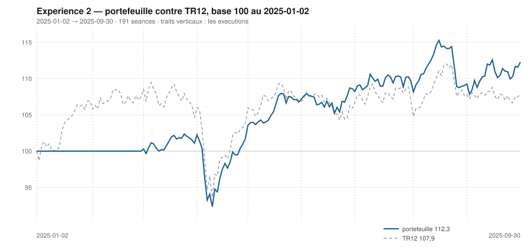

# Septembre 2025

> Journal de l'[expérience 2](../README.md) · **décision au 2025-08-29** · **exécution au 2025-09-01**
> Portefeuille au 2025-09-30 : **11 227,63 €** (base 112,28) · TR12 107,88 · alpha du mois **+2,74 pt** · depuis janvier **+4,40 pt**

---

## 1. Les actualités du mois précédent

**Août 2025** (`^FCHI` −0,88 %). Mois creux, dominé par deux échéances de
septembre. À Jackson Hole, le 22 août, Jerome Powell reconnaît un « équilibre des
risques qui se déplace » et ouvre explicitement la porte à une baisse.

En France, l'annonce le 25 août d'un vote de confiance au 8 septembre rouvre la
prime politique : l'écart franco-allemand se retend, les banques françaises
reculent, et l'indice sous-performe ses voisins.

---

## 2. Le dépouillement des thèses écrites au 2025-07-31

> Piste **S4**. Ces énoncés ont été écrits le mois dernier, avant de connaître ce mois-ci. Aucun n'a été retouché ; le verdict est calculé.

| Valeur | Thèse | Énoncé | Constaté | Verdict |
|---|---|---|---|---|
| `AIR.PA` | Canal | clôture entre 185,88 € et 187,78 € au 2025-08-29 | 175,81 € | démentie |
| `AIR.PA` | Reflexive | AUCUNE SEQUENCE : écart contre TR12 dans ± 5 points, au 2025-08-29 | 1,11 pt | **confirmée** |
| `MC.PA` | Canal | clôture entre 398,91 € et 444,04 € au 2025-08-29 | 491,77 € | démentie |
| `MC.PA` | Reflexive | AUCUNE SEQUENCE : écart contre TR12 dans ± 5 points, au 2025-08-29 | 6,12 pt | démentie |
| `OR.PA` | Canal | clôture entre 364,20 € et 392,86 € au 2025-08-29 | 390,23 € | **confirmée** |
| `OR.PA` | Reflexive | AUCUNE SEQUENCE : écart contre TR12 dans ± 5 points, au 2025-08-29 | 1,59 pt | **confirmée** |
| `SAN.PA` | Canal | clôture entre 73,18 € et 78,04 € au 2025-08-29 | 80,02 € | démentie |
| `SAN.PA` | Reflexive | AUCUNE SEQUENCE : écart contre TR12 dans ± 5 points, au 2025-08-29 | 6,56 pt | démentie |
| `BNP.PA` | Canal | clôture entre 78,31 € et 77,39 € au 2025-08-29 | 72,15 € | démentie |
| `BNP.PA` | Reflexive | AUCUNE SEQUENCE : écart contre TR12 dans ± 5 points, au 2025-08-29 | -4,64 pt | **confirmée** |
| `TTE.PA` | Canal | clôture entre 49,18 € et 49,00 € au 2025-08-29 | 50,65 € | démentie |
| `TTE.PA` | Reflexive | AUCUNE SEQUENCE : écart contre TR12 dans ± 5 points, au 2025-08-29 | 2,24 pt | **confirmée** |
| `SU.PA` | Canal | clôture entre 240,18 € et 237,58 € au 2025-08-29 | 206,81 € | démentie |
| `SU.PA` | Reflexive | AUCUNE SEQUENCE : écart contre TR12 dans ± 5 points, au 2025-08-29 | -8,58 pt | démentie |
| `AI.PA` | Canal | clôture entre 156,37 € et 153,92 € au 2025-08-29 | 156,84 € | démentie |
| `AI.PA` | Reflexive | AUCUNE SEQUENCE : écart contre TR12 dans ± 5 points, au 2025-08-29 | 1,38 pt | **confirmée** |
| `DG.PA` | Canal | clôture entre 122,30 € et 120,59 € au 2025-08-29 | 111,55 € | démentie |
| `DG.PA` | Reflexive | AUCUNE SEQUENCE : écart contre TR12 dans ± 5 points, au 2025-08-29 | -5,29 pt | démentie |
| `CAP.PA` | Canal | clôture entre 132,64 € et 133,13 € au 2025-08-29 | 117,67 € | démentie |
| `CAP.PA` | Reflexive | RETOURNEMENT : écart contre TR12 négatif ou nul, au 2025-08-29 | -7,82 pt | **confirmée** |
| `RI.PA` | Canal | clôture entre 77,59 € et 94,98 € au 2025-08-29 | 90,97 € | **confirmée** |
| `RI.PA` | Reflexive | AUCUNE SEQUENCE : écart contre TR12 dans ± 5 points, au 2025-08-29 | 6,97 pt | démentie |
| `ORA.PA` | Canal | clôture entre 12,89 € et 14,33 € au 2025-08-29 | 13,27 € | **confirmée** |
| `ORA.PA` | Reflexive | AUCUNE SEQUENCE : écart contre TR12 dans ± 5 points, au 2025-08-29 | 3,56 pt | **confirmée** |

## 3. L'exposition héritée au 2025-08-29

| Valeur | Achetée le | Prix d'achat | +/− value | Alpha du mois | Alpha global |
|---|---|---|---|---|---|
| `AIR.PA` Airbus | 2025-04-01 | 157,06 € | **+11,94 %** | +1,11 pt | +10,39 pt |
| `BNP.PA` BNP Paribas | 2025-03-03 | 64,10 € | **+12,56 %** | -4,64 pt | +13,38 pt |
| `DG.PA` Vinci | 2025-04-01 | 108,29 € | **+3,01 %** | -5,29 pt | +1,46 pt |
| `ORA.PA` Orange | 2025-04-01 | 11,05 € | **+20,02 %** | +3,56 pt | +18,47 pt |

## 4. Le portefeuille depuis le 2025-01-02

| | |
|---|---|
| Dotation initiale | 10 000,00 € au 2025-01-02 |
| Titres au 2025-09-30 | 11 116,13 € |
| Espèces | 111,49 € |
| **Total** | **11 227,63 €** |
| Base 100 | **112,28** |
| TR12, même base | 107,88 |
| Écart depuis janvier | **+4,40 pt** |

## 5. L'étude chartiste au 2025-08-29

> Notes rédigées sans aucune séance postérieure au 2025-08-29, par l'agent `chartiste`. Cinq lignes au plus par société.

### 1. `BNP.PA` — BNP Paribas

- Tendance longue positive, courte neutre, clôture à 16,9 % du canal — bas.
- Encadrement de 70,50 à 80,30 €, τ = 110 séances.
- Deux contacts en support : veto 1.
- Momentum 12-1 de +38,1 %, le plus fort de l'univers.
- La ligne détenue est au bas de son canal avec le meilleur momentum, et sous veto.

### 2. `ORA.PA` — Orange

- Tendance longue positive, courte neutre, clôture à 30,4 % du canal.
- Encadrement de 12,89 à 14,12 €, τ = 1 337 séances : quasi parallèle.
- Quatre contacts de chaque côté : aucun veto.
- Momentum 12-1 de +35,3 %, le troisième de l'univers.
- Figure lisible, durable, position basse, momentum fort : rien ne s'y oppose.
- ---

### 3. `AIR.PA` — Airbus

- Tendance longue positive, courte neutre, clôture à 10,4 % du canal.
- Encadrement de 174,16 à 190,05 €, τ = 51,6 séances : deux décisions et demie.
- Quatre contacts en support, trois en résistance : aucun veto.
- Momentum 12-1 de +33,8 %, le deuxième de l'univers.
- Deuxième mois consécutif où toutes les composantes convergent sans veto.

### 4. `DG.PA` — Vinci

- Tendance longue positive, courte neutre, clôture à 12,0 % du canal.
- Encadrement de 109,67 à 125,33 €, τ = 127 séances.
- Deux contacts de chaque côté : veto 1.
- Momentum 12-1 de +17,4 %.
- Quatrième mois consécutif où la position basse est annulée par un défaut de contacts.

### 5. `AI.PA` — Air Liquide

- Tendance longue neutre, courte positive, clôture à 25,7 % du canal.
- Encadrement de 154,13 à 164,67 €, τ = 62,7 séances.
- Trois contacts en support, quatre en résistance : aucun veto.
- Momentum 12-1 de +3,9 %.
- Figure lisible et durable, position basse, mais des tendances trop molles pour un score positif.

### 6. `SU.PA` — Schneider Electric

- Tendance longue positive, courte négative : veto 3, plus veto 1.
- Clôture à 206,81 €, à 1,1 % d'un canal de 206,42 à 242,75 €.
- τ = 111 séances.
- Momentum 12-1 de +2,4 %.
- Troisième support touché de l'année sur cette valeur, troisième veto.

### 7. `OR.PA` — L'Oréal

- Les deux tendances positives, clôture à 69,6 % du canal.
- Encadrement de 364,21 à 401,63 €, τ = 122 séances.
- Quatre contacts de chaque côté : la figure la mieux éprouvée du jour.
- Momentum 12-1 de −0,3 %, revenu à zéro.
- Aucun veto, tendances positives, mais une position juste au-dessus du seuil de 65 %.

### 8. `RI.PA` — Pernod Ricard

- Les deux tendances positives, clôture à 58,1 % du canal.
- Encadrement de 77,59 à 100,62 €, canal divergent, τ infini.
- Deux contacts de chaque côté : veto 1.
- Momentum 12-1 de −25,9 %.
- Premier retournement des deux tendances depuis le début de l'observation, sur la valeur la plus dégradée.

### 9. `TTE.PA` — TotalEnergies

- Tendance longue neutre, courte positive, clôture à 56,6 % du canal.
- Encadrement de 49,18 à 51,78 €, se refermant dans 27,6 séances.
- Deux contacts en résistance : veto 1.
- Momentum 12-1 de −9,0 %.
- Rien de tranché sur aucun des cinq critères.

### 10. `CAP.PA` — Capgemini

- Tendance longue négative, courte neutre, clôture à 1,2 % du canal.
- Encadrement de 117,18 à 157,40 €, τ = 3 659 séances : canal quasi parallèle.
- Quatre contacts en support, cinq en résistance : aucun veto.
- Momentum 12-1 de −28,4 %, le plus mauvais de l'univers.
- La figure la plus durable de l'année, sur la valeur la moins bien orientée.

### 11. `SAN.PA` — Sanofi

- Tendance longue négative, courte positive : veto 3, plus veto 1.
- Clôture à 80,02 €, à 74,0 % d'un canal de 71,34 à 83,07 €.
- τ = 170 séances.
- Momentum 12-1 de −20,9 %, en forte dégradation.
- La valeur a perdu vingt points de momentum en cinq mois.

### 12. `MC.PA` — LVMH

- Tendance longue négative, courte positive : veto 3, plus veto 1.
- Clôture à 491,77 €, à 70,2 % d'un canal de 444,36 à 511,90 €.
- τ = 58,7 séances.
- Momentum 12-1 de −27,9 %, en nouvelle dégradation.
- Le rebond de court terme ne renverse pas une tendance longue installée depuis dix-huit mois.

## 6. Le classement au 2025-08-29

> De la valeur la plus intéressante à détenir à celle qu'il faut fuir. La colonne **τ** donne la date de péremption du canal en séances (piste C4), la colonne **Vetos** les numéros déclenchés (piste T3). Une valeur sous veto ne peut pas être achetée.

| Rang | Valeur | `s1` | `s2` | `s3` | `s4` | `s5` | Score | Position | Momentum | τ | Vetos |
|---|---|---|---|---|---|---|---|---|---|---|---|
| 1 | `BNP.PA` BNP Paribas | +2 | +0 | +1 | +2 | +0 | **+5** | 16,9 % | +38,1 % | 109,5 | 1 |
| 2 | `ORA.PA` Orange | +2 | +0 | +1 | +2 | +0 | **+5** | 30,4 % | +35,3 % | 1 337,4 | — |
| 3 | `AIR.PA` Airbus | +2 | +0 | +1 | +2 | +0 | **+5** | 10,4 % | +33,8 % | 51,6 | — |
| 4 | `DG.PA` Vinci | +2 | +0 | +1 | +2 | +0 | **+5** | 12,0 % | +17,4 % | 126,6 | 1 |
| 5 | `AI.PA` Air Liquide | +0 | +1 | +1 | +1 | +0 | **+3** | 25,7 % | +3,9 % | 62,7 | — |
| 6 | `SU.PA` Schneider Electric | +2 | -1 | +1 | +1 | +0 | **+3** | 1,1 % | +2,4 % | 110,8 | 1 3 |
| 7 | `OR.PA` L'Oréal | +2 | +1 | -1 | -1 | +0 | **+1** | 69,6 % | -0,3 % | 122,3 | — |
| 8 | `RI.PA` Pernod Ricard | +2 | +1 | +0 | -2 | +0 | **+1** | 58,1 % | -25,9 % | ∞ | 1 |
| 9 | `TTE.PA` TotalEnergies | +0 | +1 | +0 | -1 | +0 | **+0** | 56,6 % | -9,0 % | 27,6 | 1 |
| 10 | `CAP.PA` Capgemini | -2 | +0 | +1 | -2 | +0 | **-3** | 1,2 % | -28,4 % | 3 658,5 | — |
| 11 | `SAN.PA` Sanofi | -2 | +1 | -1 | -2 | +0 | **-4** | 74,0 % | -20,9 % | 170,3 | 1 3 |
| 12 | `MC.PA` LVMH | -2 | +1 | -1 | -2 | +0 | **-4** | 70,2 % | -27,9 % | 58,7 | 1 3 |

## 7. Les ordres exécutés au 2025-09-01

> À l'**ouverture** de la séance, jamais à la clôture du 2025-08-29.

| Sens | Valeur | Quantité | Prix d'exécution | Brut | Frais | Motif |
|---|---|---|---|---|---|---|
| **Achat** | `AI.PA` Air Liquide | 13 | 157,12 € | 2 042,58 € | 8,48 € | rang 5, score +3, aucun veto |

## 8. La lecture du mois

Sur le mois, la meilleure contribution vient de `AIR.PA` (Airbus) pour **+216,09 €**, la moins bonne de `ORA.PA` (Orange) pour **-15,46 €**. Les 1 ordres du mois ont coûté **8,48 €** de frais, soit 0,085 % de la dotation initiale. Le portefeuille termine le mois **devant TR12** de 2,74 point. Sur les 24 thèses du mois précédent qui ont pu être dépouillées, **10 sont confirmées** — 41,7 %.

## 9. Les thèses écrites au 2025-08-29

> Elles seront dépouillées à la prochaine date de décision, dans le fichier du mois suivant. Elles sont engendrées mécaniquement par les règles du [protocole](../README.md#le-registre-des-thèses-réfutables) — aucune n'est rédigée à la main.

| Valeur | Thèse | Énoncé, à dépouiller au mois suivant |
|---|---|---|
| `AIR.PA` | Canal | clôture entre 185,66 € et 194,77 € au 2025-09-30 |
| `AIR.PA` | Reflexive | AUCUNE SEQUENCE : écart contre TR12 dans ± 5 points, au 2025-09-30 |
| `MC.PA` | Canal | clôture entre 453,20 € et 495,44 € au 2025-09-30 |
| `MC.PA` | Reflexive | AUCUNE SEQUENCE : écart contre TR12 dans ± 5 points, au 2025-09-30 |
| `OR.PA` | Canal | clôture entre 375,00 € et 405,69 € au 2025-09-30 |
| `OR.PA` | Reflexive | AUTO-RENFORCEMENT : écart contre TR12 positif ou nul, au 2025-09-30 |
| `SAN.PA` | Canal | clôture entre 69,83 € et 80,04 € au 2025-09-30 |
| `SAN.PA` | Reflexive | AUCUNE SEQUENCE : écart contre TR12 dans ± 5 points, au 2025-09-30 |
| `BNP.PA` | Canal | clôture entre 74,13 € et 81,96 € au 2025-09-30 |
| `BNP.PA` | Reflexive | AUCUNE SEQUENCE : écart contre TR12 dans ± 5 points, au 2025-09-30 |
| `TTE.PA` | Canal | clôture entre 50,24 € et 50,76 € au 2025-09-30 |
| `TTE.PA` | Reflexive | AUCUNE SEQUENCE : écart contre TR12 dans ± 5 points, au 2025-09-30 |
| `SU.PA` | Canal | clôture entre 215,25 € et 244,37 € au 2025-09-30 |
| `SU.PA` | Reflexive | AUCUNE SEQUENCE : écart contre TR12 dans ± 5 points, au 2025-09-30 |
| `AI.PA` | Canal | clôture entre 157,48 € et 164,32 € au 2025-09-30 |
| `AI.PA` | Reflexive | AUCUNE SEQUENCE : écart contre TR12 dans ± 5 points, au 2025-09-30 |
| `DG.PA` | Canal | clôture entre 112,43 € et 125,37 € au 2025-09-30 |
| `DG.PA` | Reflexive | AUCUNE SEQUENCE : écart contre TR12 dans ± 5 points, au 2025-09-30 |
| `CAP.PA` | Canal | clôture entre 120,01 € et 159,99 € au 2025-09-30 |
| `CAP.PA` | Reflexive | AUCUNE SEQUENCE : écart contre TR12 dans ± 5 points, au 2025-09-30 |
| `RI.PA` | Canal | clôture entre 77,98 € et 101,85 € au 2025-09-30 |
| `RI.PA` | Reflexive | AUCUNE SEQUENCE : écart contre TR12 dans ± 5 points, au 2025-09-30 |
| `ORA.PA` | Canal | clôture entre 13,45 € et 14,66 € au 2025-09-30 |
| `ORA.PA` | Reflexive | AUCUNE SEQUENCE : écart contre TR12 dans ± 5 points, au 2025-09-30 |

---

[← Août](2025-08.md) · [Protocole](../README.md) · [Octobre →](2025-10.md)
