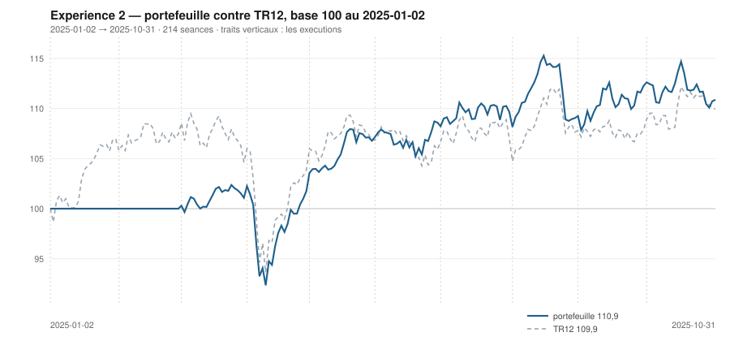

# Octobre 2025

> Journal de l'[expérience 2](../README.md) · **décision au 2025-09-30** · **exécution au 2025-10-01**
> Portefeuille au 2025-10-31 : **11 087,41 €** (base 110,87) · TR12 109,95 · alpha du mois **-3,17 pt** · depuis janvier **+0,93 pt**

---

## 1. Les actualités du mois précédent

**Septembre 2025** (`^FCHI` +2,49 %). Le gouvernement Bayrou perd le vote de
confiance le 8 septembre ; Sébastien Lecornu est nommé le lendemain. Fitch
abaisse la note de la France le 12.

Contre toute attente, le marché parisien monte : la Réserve fédérale baisse ses
taux de 25 points de base le 17, sa première baisse de l'année, et la
perspective d'un assouplissement l'emporte sur le risque politique intérieur. La
BCE, elle, maintient à 2,00 %.

La dispersion entre secteurs reste forte : les valeurs liées aux centres de
données montent nettement, le luxe et les spiritueux restent en retrait.

---

## 2. Le dépouillement des thèses écrites au 2025-08-29

> Piste **S4**. Ces énoncés ont été écrits le mois dernier, avant de connaître ce mois-ci. Aucun n'a été retouché ; le verdict est calculé.

| Valeur | Thèse | Énoncé | Constaté | Verdict |
|---|---|---|---|---|
| `AIR.PA` | Canal | clôture entre 185,66 € et 194,77 € au 2025-09-30 | 193,82 € | **confirmée** |
| `AIR.PA` | Reflexive | AUCUNE SEQUENCE : écart contre TR12 dans ± 5 points, au 2025-09-30 | 10,02 pt | démentie |
| `MC.PA` | Canal | clôture entre 453,20 € et 495,44 € au 2025-09-30 | 507,77 € | démentie |
| `MC.PA` | Reflexive | AUCUNE SEQUENCE : écart contre TR12 dans ± 5 points, au 2025-09-30 | 3,04 pt | **confirmée** |
| `OR.PA` | Canal | clôture entre 375,00 € et 405,69 € au 2025-09-30 | 361,40 € | démentie |
| `OR.PA` | Reflexive | AUTO-RENFORCEMENT : écart contre TR12 positif ou nul, au 2025-09-30 | -7,61 pt | démentie |
| `SAN.PA` | Canal | clôture entre 69,83 € et 80,04 € au 2025-09-30 | 74,39 € | **confirmée** |
| `SAN.PA` | Reflexive | AUCUNE SEQUENCE : écart contre TR12 dans ± 5 points, au 2025-09-30 | -7,25 pt | démentie |
| `BNP.PA` | Canal | clôture entre 74,13 € et 81,96 € au 2025-09-30 | 75,10 € | **confirmée** |
| `BNP.PA` | Reflexive | AUCUNE SEQUENCE : écart contre TR12 dans ± 5 points, au 2025-09-30 | 3,87 pt | **confirmée** |
| `TTE.PA` | Canal | clôture entre 50,24 € et 50,76 € au 2025-09-30 | 48,98 € | démentie |
| `TTE.PA` | Reflexive | AUCUNE SEQUENCE : écart contre TR12 dans ± 5 points, au 2025-09-30 | -3,53 pt | **confirmée** |
| `SU.PA` | Canal | clôture entre 215,25 € et 244,37 € au 2025-09-30 | 233,94 € | **confirmée** |
| `SU.PA` | Reflexive | AUCUNE SEQUENCE : écart contre TR12 dans ± 5 points, au 2025-09-30 | 12,90 pt | démentie |
| `AI.PA` | Canal | clôture entre 157,48 € et 164,32 € au 2025-09-30 | 157,41 € | démentie |
| `AI.PA` | Reflexive | AUCUNE SEQUENCE : écart contre TR12 dans ± 5 points, au 2025-09-30 | 0,15 pt | **confirmée** |
| `DG.PA` | Canal | clôture entre 112,43 € et 125,37 € au 2025-09-30 | 113,53 € | **confirmée** |
| `DG.PA` | Reflexive | AUCUNE SEQUENCE : écart contre TR12 dans ± 5 points, au 2025-09-30 | 1,55 pt | **confirmée** |
| `CAP.PA` | Canal | clôture entre 120,01 € et 159,99 € au 2025-09-30 | 119,70 € | démentie |
| `CAP.PA` | Reflexive | AUCUNE SEQUENCE : écart contre TR12 dans ± 5 points, au 2025-09-30 | 1,51 pt | **confirmée** |
| `RI.PA` | Canal | clôture entre 77,98 € et 101,85 € au 2025-09-30 | 78,19 € | **confirmée** |
| `RI.PA` | Reflexive | AUCUNE SEQUENCE : écart contre TR12 dans ± 5 points, au 2025-09-30 | -14,27 pt | démentie |
| `ORA.PA` | Canal | clôture entre 13,45 € et 14,66 € au 2025-09-30 | 13,18 € | démentie |
| `ORA.PA` | Reflexive | AUCUNE SEQUENCE : écart contre TR12 dans ± 5 points, au 2025-09-30 | -0,87 pt | **confirmée** |

## 3. L'exposition héritée au 2025-09-30

| Valeur | Achetée le | Prix d'achat | +/− value | Alpha du mois | Alpha global |
|---|---|---|---|---|---|
| `AI.PA` Air Liquide | 2025-09-01 | 157,12 € | **+0,18 %** | +0,11 pt *(partiel)* | +0,11 pt |
| `AIR.PA` Airbus | 2025-04-01 | 157,06 € | **+23,40 %** | +10,02 pt | +21,63 pt |
| `BNP.PA` BNP Paribas | 2025-03-03 | 64,10 € | **+17,16 %** | +3,87 pt | +17,77 pt |
| `DG.PA` Vinci | 2025-04-01 | 108,29 € | **+4,83 %** | +1,55 pt | +3,06 pt |
| `ORA.PA` Orange | 2025-04-01 | 11,05 € | **+19,24 %** | -0,87 pt | +17,47 pt |

## 4. Le portefeuille depuis le 2025-01-02

| | |
|---|---|
| Dotation initiale | 10 000,00 € au 2025-01-02 |
| Titres au 2025-10-31 | 8 935,91 € |
| Espèces | 2 151,50 € |
| **Total** | **11 087,41 €** |
| Base 100 | **110,87** |
| TR12, même base | 109,95 |
| Écart depuis janvier | **+0,93 pt** |

## 5. L'étude chartiste au 2025-09-30

> Notes rédigées sans aucune séance postérieure au 2025-09-30, par l'agent `chartiste`. Cinq lignes au plus par société.

### 1. `ORA.PA` — Orange

- Tendance longue positive, courte neutre, clôture à 20,1 % du canal.
- Encadrement de 12,81 à 14,65 €, canal divergent, τ infini.
- Trois contacts de chaque côté : aucun veto.
- Momentum 12-1 de +51,4 %, le plus fort jamais observé sur l'univers cette année.
- La ligne détenue depuis juillet est au bas de son canal avec le meilleur momentum de l'univers.
- ---

### 2. `AIR.PA` — Airbus

- Les deux tendances positives, clôture à 70,1 % du canal.
- Encadrement de 184,63 à 197,73 €, τ = 61,8 séances.
- Quatre contacts de chaque côté : aucun veto.
- Momentum 12-1 de +47,0 %, le plus fort de toute l'année narrée.
- La position est passée de 10 % à 70 % en un mois : c'est le prix d'un canal étroit et d'un mois de hausse.

### 3. `BNP.PA` — BNP Paribas

- Les deux tendances positives, clôture à 78,1 % du canal.
- Encadrement extrêmement serré, 73,06 à 75,68 €, se refermant dans 10,1 séances : veto 2, plus veto 1.
- Cinq contacts en support, deux en résistance.
- Momentum 12-1 de +36,5 %, le deuxième de l'univers.
- Le canal de la ligne détenue se referme dans dix séances, pour la troisième fois de l'année.

### 4. `OR.PA` — L'Oréal

- Tendance longue positive, courte négative : veto 3.
- Clôture à 361,40 €, à 15,4 % d'un canal de 353,31 à 405,69 €.
- τ = 813 séances : quasi parallèle, trois contacts en support et cinq en résistance.
- Momentum 12-1 de +3,7 %, redevenu positif.
- Position basse, tendance longue haute, figure durable — et un veto de contradiction.

### 5. `TTE.PA` — TotalEnergies

- Tendance longue positive, courte neutre, clôture à 16,8 % du canal.
- Encadrement de 48,44 à 51,64 €, τ = 77 séances.
- Deux contacts en support : veto 1.
- Momentum 12-1 de −9,2 %.
- La tendance longue se retourne pour la première fois de l'année sur cette valeur.

### 6. `DG.PA` — Vinci

- Tendance longue négative, courte neutre, clôture à 27,2 % du canal.
- Encadrement de 109,11 à 125,37 €, τ = 348 séances.
- Deux contacts en résistance : veto 1.
- Momentum 12-1 de +17,9 %.
- La tendance longue se retourne à la baisse alors que le momentum reste à +18 %.

### 7. `SU.PA` — Schneider Electric

- Les deux tendances positives, clôture à 93,1 % du canal — tout en haut.
- Encadrement de 210,12 à 235,71 €, τ = 76,6 séances.
- Deux contacts de chaque côté : veto 1.
- Momentum 12-1 de −8,2 %, encore négatif.
- Tendances positives et momentum négatif : les deux horizons ne racontent pas la même histoire.

### 8. `AI.PA` — Air Liquide

- Tendance longue négative, courte neutre, clôture à 36,0 % du canal.
- Encadrement de 153,52 à 164,32 €, τ = 112 séances.
- Trois contacts en support, quatre en résistance : aucun veto.
- Momentum 12-1 de +7,3 %.
- Figure lisible et durable, mais une tendance longue qui repasse négative.

### 9. `MC.PA` — LVMH

- Tendance longue neutre, courte positive, clôture à 86,1 % du canal.
- Encadrement de 453,21 à 516,57 €, τ = 123 séances.
- Trois contacts de chaque côté : aucun veto.
- Momentum 12-1 de −21,9 %, toujours le plus mauvais de l'univers.
- La tendance longue cesse d'être négative pour la première fois depuis décembre.

### 10. `RI.PA` — Pernod Ricard

- Tendance longue neutre, courte négative, clôture à 7,9 % du canal.
- Encadrement de 76,03 à 103,41 €, canal divergent, τ infini.
- Deux contacts en support : veto 1.
- Momentum 12-1 de −22,6 %.
- Le canal s'ouvre à 27 € de large sur une valeur à 78 € : la position perd tout sens.

### 11. `SAN.PA` — Sanofi

- Les deux tendances négatives, clôture à 24,0 % du canal.
- Encadrement de 72,12 à 81,61 €, τ = 145 séances.
- Trois contacts de chaque côté : aucun veto.
- Momentum 12-1 de −11,8 %.
- Figure lisible, tendances franchement négatives : la lecture est sans ambiguïté.

### 12. `CAP.PA` — Capgemini

- Tendance longue négative, courte neutre, clôture à 85,2 % du canal.
- Encadrement très serré, 113,86 à 120,72 €, se refermant dans 17,9 séances : veto 2.
- Sept contacts en support, cinq en résistance : la figure la mieux éprouvée de l'année.
- Momentum 12-1 de −34,5 %, le plus mauvais de toute l'année narrée.
- Douze épisodes de contact sur un canal qui expire dans dix-huit séances.

## 6. Le classement au 2025-09-30

> De la valeur la plus intéressante à détenir à celle qu'il faut fuir. La colonne **τ** donne la date de péremption du canal en séances (piste C4), la colonne **Vetos** les numéros déclenchés (piste T3). Une valeur sous veto ne peut pas être achetée.

| Rang | Valeur | `s1` | `s2` | `s3` | `s4` | `s5` | Score | Position | Momentum | τ | Vetos |
|---|---|---|---|---|---|---|---|---|---|---|---|
| 1 | `ORA.PA` Orange | +2 | +0 | +1 | +2 | +0 | **+5** | 20,1 % | +51,4 % | ∞ | — |
| 2 | `AIR.PA` Airbus | +2 | +1 | -1 | +2 | +0 | **+4** | 70,1 % | +47,0 % | 61,8 | — |
| 3 | `BNP.PA` BNP Paribas | +2 | +1 | -1 | +2 | +0 | **+4** | 78,1 % | +36,5 % | 10,1 | 1 2 |
| 4 | `OR.PA` L'Oréal | +2 | -1 | +1 | +1 | +0 | **+3** | 15,4 % | +3,7 % | 812,8 | 3 |
| 5 | `TTE.PA` TotalEnergies | +2 | +0 | +1 | -1 | +0 | **+2** | 16,8 % | -9,2 % | 77,2 | 1 |
| 6 | `DG.PA` Vinci | -2 | +0 | +1 | +2 | +0 | **+1** | 27,2 % | +17,9 % | 347,8 | 1 |
| 7 | `SU.PA` Schneider Electric | +2 | +1 | -1 | -1 | +0 | **+1** | 93,1 % | -8,2 % | 76,6 | 1 |
| 8 | `AI.PA` Air Liquide | -2 | +0 | +0 | +1 | +0 | **-1** | 36,0 % | +7,2 % | 112,4 | — |
| 9 | `MC.PA` LVMH | +0 | +1 | -1 | -2 | +0 | **-2** | 86,1 % | -21,9 % | 123,0 | — |
| 10 | `RI.PA` Pernod Ricard | +0 | -1 | +1 | -2 | -1 | **-3** | 7,9 % | -22,6 % | ∞ | 1 |
| 11 | `SAN.PA` Sanofi | -2 | -1 | +1 | -2 | +0 | **-4** | 24,0 % | -11,8 % | 145,0 | — |
| 12 | `CAP.PA` Capgemini | -2 | +0 | -1 | -2 | +0 | **-5** | 85,2 % | -34,5 % | 17,9 | 2 |

## 7. Les ordres exécutés au 2025-10-01

> À l'**ouverture** de la séance, jamais à la clôture du 2025-09-30.

| Sens | Valeur | Quantité | Prix d'exécution | Brut | Frais | Motif |
|---|---|---|---|---|---|---|
| **Vente** | `AI.PA` Air Liquide | 13 | 157,10 € | 2 042,35 € | 2,35 € | rang 8 au-dela de 7 |

## 8. La lecture du mois

Sur le mois, la meilleure contribution vient de `AIR.PA` (Airbus) pour **+188,52 €**, la moins bonne de `BNP.PA` (BNP Paribas) pour **-309,20 €**. Les 1 ordres du mois ont coûté **2,35 €** de frais, soit 0,023 % de la dotation initiale. Le portefeuille termine le mois **derrière TR12** de 3,17 point. Sur les 24 thèses du mois précédent qui ont pu être dépouillées, **13 sont confirmées** — 54,2 %.

## 9. Les thèses écrites au 2025-09-30

> Elles seront dépouillées à la prochaine date de décision, dans le fichier du mois suivant. Elles sont engendrées mécaniquement par les règles du [protocole](../README.md#le-registre-des-thèses-réfutables) — aucune n'est rédigée à la main.

| Valeur | Thèse | Énoncé, à dépouiller au mois suivant |
|---|---|---|
| `AIR.PA` | Canal | clôture entre 195,75 € et 203,98 € au 2025-10-31 |
| `AIR.PA` | Reflexive | AUTO-RENFORCEMENT : écart contre TR12 positif ou nul, au 2025-10-31 |
| `MC.PA` | Canal | clôture entre 462,46 € et 513,97 € au 2025-10-31 |
| `MC.PA` | Reflexive | AUCUNE SEQUENCE : écart contre TR12 dans ± 5 points, au 2025-10-31 |
| `OR.PA` | Canal | clôture entre 359,04 € et 409,94 € au 2025-10-31 |
| `OR.PA` | Reflexive | AUCUNE SEQUENCE : écart contre TR12 dans ± 5 points, au 2025-10-31 |
| `SAN.PA` | Canal | clôture entre 71,79 € et 79,78 € au 2025-10-31 |
| `SAN.PA` | Reflexive | RETOURNEMENT : écart contre TR12 négatif ou nul, au 2025-10-31 |
| `BNP.PA` | Canal | clôture entre 76,26 € et 72,90 € au 2025-10-31 |
| `BNP.PA` | Reflexive | AUTO-RENFORCEMENT : écart contre TR12 positif ou nul, au 2025-10-31 |
| `TTE.PA` | Canal | clôture entre 49,08 € et 51,32 € au 2025-10-31 |
| `TTE.PA` | Reflexive | AUCUNE SEQUENCE : écart contre TR12 dans ± 5 points, au 2025-10-31 |
| `SU.PA` | Canal | clôture entre 214,98 € et 232,88 € au 2025-10-31 |
| `SU.PA` | Reflexive | AUTO-RENFORCEMENT : écart contre TR12 positif ou nul, au 2025-10-31 |
| `AI.PA` | Canal | clôture entre 155,37 € et 163,96 € au 2025-10-31 |
| `AI.PA` | Reflexive | AUCUNE SEQUENCE : écart contre TR12 dans ± 5 points, au 2025-10-31 |
| `DG.PA` | Canal | clôture entre 110,22 € et 125,41 € au 2025-10-31 |
| `DG.PA` | Reflexive | AUCUNE SEQUENCE : écart contre TR12 dans ± 5 points, au 2025-10-31 |
| `CAP.PA` | Canal | clôture entre 113,22 € et 111,25 € au 2025-10-31 |
| `CAP.PA` | Reflexive | AUCUNE SEQUENCE : écart contre TR12 dans ± 5 points, au 2025-10-31 |
| `RI.PA` | Canal | clôture entre 75,76 € et 106,26 € au 2025-10-31 |
| `RI.PA` | Reflexive | AUCUNE SEQUENCE : écart contre TR12 dans ± 5 points, au 2025-10-31 |
| `ORA.PA` | Canal | clôture entre 13,16 € et 15,21 € au 2025-10-31 |
| `ORA.PA` | Reflexive | AUCUNE SEQUENCE : écart contre TR12 dans ± 5 points, au 2025-10-31 |

---

[← Septembre](2025-09.md) · [Protocole](../README.md) · [Novembre →](2025-11.md)
