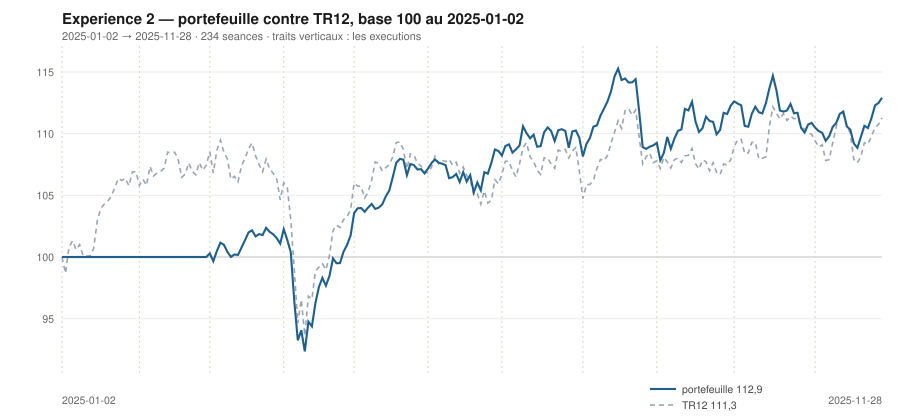

# Novembre 2025

> Journal de l'[expérience 2](../README.md) · **décision au 2025-10-31** · **exécution au 2025-11-03**
> Portefeuille au 2025-11-28 : **11 291,51 €** (base 112,92) · TR12 111,28 · alpha du mois **+0,62 pt** · depuis janvier **+1,63 pt**

---

## 1. Les actualités du mois précédent

**Octobre 2025** (`^FCHI` +2,85 %). Sébastien Lecornu démissionne le 6 octobre
puis est reconduit le 10 ; S&P abaisse la note souveraine le 17. La prime
politique française cesse pourtant de s'écarter, le budget 2026 étant engagé.

Le CAC 40 inscrit de nouveaux plus hauts historiques dans la seconde quinzaine.
La Réserve fédérale baisse de nouveau le 29 octobre, tout en écartant l'idée
qu'une baisse de décembre soit acquise.

Les résultats du troisième trimestre confirment l'écart sectoriel de l'année :
l'industrie électrique et la défense tirent, le luxe et la consommation
discrétionnaire suivent de loin.

---

## 2. Le dépouillement des thèses écrites au 2025-09-30

> Piste **S4**. Ces énoncés ont été écrits le mois dernier, avant de connaître ce mois-ci. Aucun n'a été retouché ; le verdict est calculé.

| Valeur | Thèse | Énoncé | Constaté | Verdict |
|---|---|---|---|---|
| `AIR.PA` | Canal | clôture entre 195,75 € et 203,98 € au 2025-10-31 | 209,53 € | démentie |
| `AIR.PA` | Reflexive | AUTO-RENFORCEMENT : écart contre TR12 positif ou nul, au 2025-10-31 | 6,19 pt | **confirmée** |
| `MC.PA` | Canal | clôture entre 462,46 € et 513,97 € au 2025-10-31 | 597,12 € | démentie |
| `MC.PA` | Reflexive | AUCUNE SEQUENCE : écart contre TR12 dans ± 5 points, au 2025-10-31 | 15,68 pt | démentie |
| `OR.PA` | Canal | clôture entre 359,04 € et 409,94 € au 2025-10-31 | 355,66 € | démentie |
| `OR.PA` | Reflexive | AUCUNE SEQUENCE : écart contre TR12 dans ± 5 points, au 2025-10-31 | -3,50 pt | **confirmée** |
| `SAN.PA` | Canal | clôture entre 71,79 € et 79,78 € au 2025-10-31 | 82,96 € | démentie |
| `SAN.PA` | Reflexive | RETOURNEMENT : écart contre TR12 négatif ou nul, au 2025-10-31 | 9,60 pt | démentie |
| `BNP.PA` | Canal | clôture entre 76,26 € et 72,90 € au 2025-10-31 | 65,13 € | démentie |
| `BNP.PA` | Reflexive | AUTO-RENFORCEMENT : écart contre TR12 positif ou nul, au 2025-10-31 | -15,20 pt | démentie |
| `TTE.PA` | Canal | clôture entre 49,08 € et 51,32 € au 2025-10-31 | 51,93 € | démentie |
| `TTE.PA` | Reflexive | AUCUNE SEQUENCE : écart contre TR12 dans ± 5 points, au 2025-10-31 | 4,12 pt | **confirmée** |
| `SU.PA` | Canal | clôture entre 214,98 € et 232,88 € au 2025-10-31 | 242,31 € | démentie |
| `SU.PA` | Reflexive | AUTO-RENFORCEMENT : écart contre TR12 positif ou nul, au 2025-10-31 | 1,66 pt | **confirmée** |
| `AI.PA` | Canal | clôture entre 155,37 € et 163,96 € au 2025-10-31 | 149,45 € | démentie |
| `AI.PA` | Reflexive | AUCUNE SEQUENCE : écart contre TR12 dans ± 5 points, au 2025-10-31 | -6,97 pt | démentie |
| `DG.PA` | Canal | clôture entre 110,22 € et 125,41 € au 2025-10-31 | 112,55 € | **confirmée** |
| `DG.PA` | Reflexive | AUCUNE SEQUENCE : écart contre TR12 dans ± 5 points, au 2025-10-31 | -2,78 pt | **confirmée** |
| `CAP.PA` | Canal | clôture entre 113,22 € et 111,25 € au 2025-10-31 | 129,34 € | démentie |
| `CAP.PA` | Reflexive | AUCUNE SEQUENCE : écart contre TR12 dans ± 5 points, au 2025-10-31 | 6,14 pt | démentie |
| `RI.PA` | Canal | clôture entre 75,76 € et 106,26 € au 2025-10-31 | 79,52 € | **confirmée** |
| `RI.PA` | Reflexive | AUCUNE SEQUENCE : écart contre TR12 dans ± 5 points, au 2025-10-31 | -0,22 pt | **confirmée** |
| `ORA.PA` | Canal | clôture entre 13,16 € et 15,21 € au 2025-10-31 | 13,20 € | **confirmée** |
| `ORA.PA` | Reflexive | AUCUNE SEQUENCE : écart contre TR12 dans ± 5 points, au 2025-10-31 | -1,74 pt | **confirmée** |

## 3. L'exposition héritée au 2025-10-31

| Valeur | Achetée le | Prix d'achat | +/− value | Alpha du mois | Alpha global |
|---|---|---|---|---|---|
| `AIR.PA` Airbus | 2025-04-01 | 157,06 € | **+33,40 %** | +6,19 pt | +29,68 pt |
| `BNP.PA` BNP Paribas | 2025-03-03 | 64,10 € | **+1,60 %** | -15,20 pt | +0,30 pt |
| `DG.PA` Vinci | 2025-04-01 | 108,29 € | **+3,93 %** | -2,78 pt | +0,21 pt |
| `ORA.PA` Orange | 2025-04-01 | 11,05 € | **+19,46 %** | -1,74 pt | +15,74 pt |

## 4. Le portefeuille depuis le 2025-01-02

| | |
|---|---|
| Dotation initiale | 10 000,00 € au 2025-01-02 |
| Titres au 2025-11-28 | 8 906,91 € |
| Espèces | 2 384,60 € |
| **Total** | **11 291,51 €** |
| Base 100 | **112,92** |
| TR12, même base | 111,28 |
| Écart depuis janvier | **+1,63 pt** |

## 5. L'étude chartiste au 2025-10-31

> Notes rédigées sans aucune séance postérieure au 2025-10-31, par l'agent `chartiste`. Cinq lignes au plus par société.

### 1. `ORA.PA` — Orange

- Les deux tendances positives, clôture à 56,0 % du canal.
- Encadrement de 12,63 à 13,65 €, τ = 82 séances.
- Quatre contacts en support, trois en résistance : aucun veto.
- Momentum 12-1 de +43,5 %, le troisième de l'univers.
- La position remonte au milieu du canal : la valeur cesse d'être bon marché au sens de la règle.
- ---

### 2. `SU.PA` — Schneider Electric

- Les deux tendances positives, clôture à 10,0 % du canal — bas.
- Encadrement de 240,73 à 256,52 €, se refermant dans 27,8 séances.
- Deux contacts en support : veto 1.
- Momentum 12-1 de +6,4 %, redevenu positif.
- Cinquième position basse de l'année sur cette valeur, cinquième veto.

### 3. `AIR.PA` — Airbus

- Les deux tendances positives, clôture à 66,9 % du canal.
- Encadrement de 201,68 à 213,41 €, τ = 54,8 séances.
- Cinq contacts en support, quatre en résistance : aucun veto.
- Momentum 12-1 de +45,7 %, le plus fort de l'univers.
- Position juste au-dessus du seuil de 65 % : deux euros de moins et `s3` basculait de −1 à 0.

### 4. `OR.PA` — L'Oréal

- Tendance longue positive, courte neutre, clôture à 6,0 % du canal — sur le support.
- Encadrement de 353,60 à 387,99 €, τ = 81 séances.
- Trois contacts en support, quatre en résistance : aucun veto.
- Momentum 12-1 de +9,7 %.
- Position au plancher, tendance longue haussière, figure lisible : la configuration que la règle achète.

### 5. `BNP.PA` — BNP Paribas

- Tendance longue neutre, courte négative, clôture à 12,5 % du canal.
- Encadrement de 63,73 à 74,92 €, τ = 303 séances.
- Trois contacts en support, quatre en résistance : aucun veto.
- Momentum 12-1 de +36,0 %, le deuxième de l'univers.
- La ligne détenue depuis mars voit sa tendance longue cesser d'être positive.

### 6. `TTE.PA` — TotalEnergies

- Les deux tendances positives, clôture à 86,5 % du canal.
- Encadrement de 47,45 à 52,63 €, τ = 1 116 séances : quasi parallèle.
- Deux contacts de chaque côté : veto 1.
- Momentum 12-1 de −7,1 %.
- Tendances positives et momentum négatif, pour le deuxième mois consécutif.

### 7. `MC.PA` — LVMH

- Les deux tendances positives, clôture à 84,0 % du canal.
- Encadrement très large, de 462,46 à 622,78 €, canal divergent.
- Deux contacts de chaque côté : veto 1.
- Momentum 12-1 de −7,7 %, en très forte amélioration.
- Le luxe efface la moitié de son retard de douze mois en deux mois de hausse.

### 8. `DG.PA` — Vinci

- Tendance longue négative, courte neutre, clôture à 61,3 % du canal.
- Encadrement de 101,97 à 119,22 €, canal divergent, τ infini.
- Deux contacts en résistance : veto 1.
- Momentum 12-1 de +19,7 %.
- Un momentum de +20 % avec une tendance longue négative : les deux horizons divergent depuis deux mois.

### 9. `AI.PA` — Air Liquide

- Tendance longue négative, courte neutre, clôture à 11,3 % du canal.
- Encadrement de 148,63 à 155,90 €, τ = 54,7 séances.
- Cinq contacts en support, deux en résistance : veto 1.
- Momentum 12-1 de +8,1 %.
- Le plancher est bien établi, le plafond ne l'est pas : le veto tient à un seul côté.

### 10. `SAN.PA` — Sanofi

- Tendance longue négative, courte positive : veto 3, plus veto 1.
- Clôture à 82,96 €, à 77,5 % d'un canal de 71,79 à 86,20 €.
- τ = 1 370 séances : quasi parallèle.
- Momentum 12-1 de −8,0 %.
- La figure est la plus durable du jour, et deux vetos interdisent d'en conclure.

### 11. `RI.PA` — Pernod Ricard

- Les deux tendances neutres, clôture à 60,6 % du canal.
- Encadrement de 75,76 à 81,96 €, se refermant dans 15,8 séances : veto 2, plus veto 1.
- Trois contacts en support, deux en résistance.
- Momentum 12-1 de −22,9 %.
- Onzième mois d'observation, onzième classement dans la moitié basse.

### 12. `CAP.PA` — Capgemini

- Tendance longue négative, courte positive : veto 3.
- Clôture à 129,34 €, à 85,8 % d'un canal de 91,42 à 135,60 €.
- Canal divergent, τ infini, trois contacts de chaque côté.
- Momentum 12-1 de −20,1 %.
- Le canal s'ouvre à 44 € de large : la position dans un tel canal ne mesure plus grand-chose.

## 6. Le classement au 2025-10-31

> De la valeur la plus intéressante à détenir à celle qu'il faut fuir. La colonne **τ** donne la date de péremption du canal en séances (piste C4), la colonne **Vetos** les numéros déclenchés (piste T3). Une valeur sous veto ne peut pas être achetée.

| Rang | Valeur | `s1` | `s2` | `s3` | `s4` | `s5` | Score | Position | Momentum | τ | Vetos |
|---|---|---|---|---|---|---|---|---|---|---|---|
| 1 | `ORA.PA` Orange | +2 | +1 | +0 | +2 | +0 | **+5** | 56,0 % | +43,5 % | 82,2 | — |
| 2 | `SU.PA` Schneider Electric | +2 | +1 | +1 | +1 | +0 | **+5** | 10,0 % | +6,4 % | 27,8 | 1 |
| 3 | `AIR.PA` Airbus | +2 | +1 | -1 | +2 | +0 | **+4** | 66,9 % | +45,7 % | 54,8 | — |
| 4 | `OR.PA` L'Oréal | +2 | +0 | +1 | +1 | +0 | **+4** | 6,0 % | +9,7 % | 81,1 | — |
| 5 | `BNP.PA` BNP Paribas | +0 | -1 | +1 | +2 | +0 | **+2** | 12,5 % | +36,0 % | 302,9 | — |
| 6 | `TTE.PA` TotalEnergies | +2 | +1 | -1 | -1 | +0 | **+1** | 86,5 % | -7,1 % | 1 115,7 | 1 |
| 7 | `MC.PA` LVMH | +2 | +1 | -1 | -1 | +0 | **+1** | 84,0 % | -7,7 % | ∞ | 1 |
| 8 | `DG.PA` Vinci | -2 | +0 | +0 | +2 | +0 | **+0** | 61,3 % | +19,7 % | ∞ | 1 |
| 9 | `AI.PA` Air Liquide | -2 | +0 | +1 | +1 | +0 | **+0** | 11,3 % | +8,1 % | 54,7 | 1 |
| 10 | `SAN.PA` Sanofi | -2 | +1 | -1 | -1 | +0 | **-3** | 77,5 % | -8,0 % | 1 369,9 | 1 3 |
| 11 | `RI.PA` Pernod Ricard | +0 | +0 | +0 | -2 | -1 | **-3** | 60,6 % | -22,9 % | 15,8 | 1 2 |
| 12 | `CAP.PA` Capgemini | -2 | +1 | -1 | -2 | +0 | **-4** | 85,8 % | -20,1 % | ∞ | 3 |

## 7. Les ordres exécutés au 2025-11-03

> À l'**ouverture** de la séance, jamais à la clôture du 2025-10-31.

| Sens | Valeur | Quantité | Prix d'exécution | Brut | Frais | Motif |
|---|---|---|---|---|---|---|
| **Vente** | `DG.PA` Vinci | 18 | 112,41 € | 2 023,34 € | 2,33 € | rang 8 au-dela de 7 |
| **Achat** | `OR.PA` L'Oréal | 5 | 356,10 € | 1 780,52 € | 7,39 € | rang 4, score +4, aucun veto |

## 8. La lecture du mois

Sur le mois, la meilleure contribution vient de `BNP.PA` (BNP Paribas) pour **+199,61 €**, la moins bonne de `AIR.PA` (Airbus) pour **-105,45 €**. Les 2 ordres du mois ont coûté **9,72 €** de frais, soit 0,097 % de la dotation initiale. Le portefeuille termine le mois **devant TR12** de 0,62 point. Sur les 24 thèses du mois précédent qui ont pu être dépouillées, **10 sont confirmées** — 41,7 %.

## 9. Les thèses écrites au 2025-10-31

> Elles seront dépouillées à la prochaine date de décision, dans le fichier du mois suivant. Elles sont engendrées mécaniquement par les règles du [protocole](../README.md#le-registre-des-thèses-réfutables) — aucune n'est rédigée à la main.

| Valeur | Thèse | Énoncé, à dépouiller au mois suivant |
|---|---|---|
| `AIR.PA` | Canal | clôture entre 213,91 € et 221,36 € au 2025-11-28 |
| `AIR.PA` | Reflexive | AUTO-RENFORCEMENT : écart contre TR12 positif ou nul, au 2025-11-28 |
| `MC.PA` | Canal | clôture entre 470,50 € et 644,57 € au 2025-11-28 |
| `MC.PA` | Reflexive | AUTO-RENFORCEMENT : écart contre TR12 positif ou nul, au 2025-11-28 |
| `OR.PA` | Canal | clôture entre 356,23 € et 382,14 € au 2025-11-28 |
| `OR.PA` | Reflexive | AUCUNE SEQUENCE : écart contre TR12 dans ± 5 points, au 2025-11-28 |
| `SAN.PA` | Canal | clôture entre 71,51 € et 85,71 € au 2025-11-28 |
| `SAN.PA` | Reflexive | AUCUNE SEQUENCE : écart contre TR12 dans ± 5 points, au 2025-11-28 |
| `BNP.PA` | Canal | clôture entre 62,79 € et 73,24 € au 2025-11-28 |
| `BNP.PA` | Reflexive | AUCUNE SEQUENCE : écart contre TR12 dans ± 5 points, au 2025-11-28 |
| `TTE.PA` | Canal | clôture entre 47,53 € et 52,61 € au 2025-11-28 |
| `TTE.PA` | Reflexive | AUTO-RENFORCEMENT : écart contre TR12 positif ou nul, au 2025-11-28 |
| `SU.PA` | Canal | clôture entre 256,66 € et 261,11 € au 2025-11-28 |
| `SU.PA` | Reflexive | AUCUNE SEQUENCE : écart contre TR12 dans ± 5 points, au 2025-11-28 |
| `AI.PA` | Canal | clôture entre 147,87 € et 152,49 € au 2025-11-28 |
| `AI.PA` | Reflexive | AUCUNE SEQUENCE : écart contre TR12 dans ± 5 points, au 2025-11-28 |
| `DG.PA` | Canal | clôture entre 99,01 € et 116,96 € au 2025-11-28 |
| `DG.PA` | Reflexive | AUCUNE SEQUENCE : écart contre TR12 dans ± 5 points, au 2025-11-28 |
| `CAP.PA` | Canal | clôture entre 83,16 € et 132,78 € au 2025-11-28 |
| `CAP.PA` | Reflexive | AUCUNE SEQUENCE : écart contre TR12 dans ± 5 points, au 2025-11-28 |
| `RI.PA` | Canal | clôture entre 75,52 € et 73,87 € au 2025-11-28 |
| `RI.PA` | Reflexive | AUCUNE SEQUENCE : écart contre TR12 dans ± 5 points, au 2025-11-28 |
| `ORA.PA` | Canal | clôture entre 12,79 € et 13,56 € au 2025-11-28 |
| `ORA.PA` | Reflexive | AUCUNE SEQUENCE : écart contre TR12 dans ± 5 points, au 2025-11-28 |

---

[← Octobre](2025-10.md) · [Protocole](../README.md) · [Décembre →](2025-12.md)
