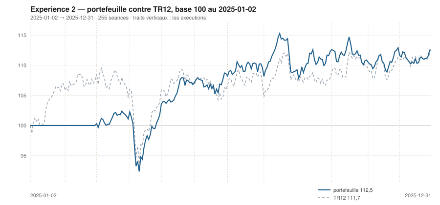

# Décembre 2025

> Journal de l'[expérience 2](../README.md) · **décision au 2025-11-28** · **exécution au 2025-12-01**
> Portefeuille au 2025-12-31 : **11 251,73 €** (base 112,52) · TR12 111,70 · alpha du mois **-0,73 pt** · depuis janvier **+0,81 pt**

---

## 1. Les actualités du mois précédent

**Novembre 2025** (`^FCHI` +0,02 %). Mois plat en surface, agité en dessous. La
première quinzaine voit un net repli des valeurs liées à l'intelligence
artificielle, sur des doutes de valorisation et de financement des
investissements annoncés ; la seconde efface le mouvement.

En France, l'examen du budget 2026 occupe le Parlement sans provoquer de crise
ouverte. L'écart franco-allemand se resserre par rapport à ses points hauts de
l'été.

Le débat de fin d'année porte sur l'ampleur de l'assouplissement de 2026, non sur
son principe.

---

## 2. Le dépouillement des thèses écrites au 2025-10-31

> Piste **S4**. Ces énoncés ont été écrits le mois dernier, avant de connaître ce mois-ci. Aucun n'a été retouché ; le verdict est calculé.

| Valeur | Thèse | Énoncé | Constaté | Verdict |
|---|---|---|---|---|
| `AIR.PA` | Canal | clôture entre 213,91 € et 221,36 € au 2025-11-28 | 200,74 € | démentie |
| `AIR.PA` | Reflexive | AUTO-RENFORCEMENT : écart contre TR12 positif ou nul, au 2025-11-28 | -5,41 pt | démentie |
| `MC.PA` | Canal | clôture entre 470,50 € et 644,57 € au 2025-11-28 | 619,95 € | **confirmée** |
| `MC.PA` | Reflexive | AUTO-RENFORCEMENT : écart contre TR12 positif ou nul, au 2025-11-28 | 2,61 pt | **confirmée** |
| `OR.PA` | Canal | clôture entre 356,23 € et 382,14 € au 2025-11-28 | 368,36 € | **confirmée** |
| `OR.PA` | Reflexive | AUCUNE SEQUENCE : écart contre TR12 dans ± 5 points, au 2025-11-28 | 2,35 pt | **confirmée** |
| `SAN.PA` | Canal | clôture entre 71,51 € et 85,71 € au 2025-11-28 | 81,22 € | **confirmée** |
| `SAN.PA` | Reflexive | AUCUNE SEQUENCE : écart contre TR12 dans ± 5 points, au 2025-11-28 | -3,32 pt | **confirmée** |
| `BNP.PA` | Canal | clôture entre 62,79 € et 73,24 € au 2025-11-28 | 71,57 € | **confirmée** |
| `BNP.PA` | Reflexive | AUCUNE SEQUENCE : écart contre TR12 dans ± 5 points, au 2025-11-28 | 8,67 pt | démentie |
| `TTE.PA` | Canal | clôture entre 47,53 € et 52,61 € au 2025-11-28 | 54,67 € | démentie |
| `TTE.PA` | Reflexive | AUTO-RENFORCEMENT : écart contre TR12 positif ou nul, au 2025-11-28 | 4,07 pt | **confirmée** |
| `SU.PA` | Canal | clôture entre 256,66 € et 261,11 € au 2025-11-28 | 227,44 € | démentie |
| `SU.PA` | Reflexive | AUCUNE SEQUENCE : écart contre TR12 dans ± 5 points, au 2025-11-28 | -7,35 pt | démentie |
| `AI.PA` | Canal | clôture entre 147,87 € et 152,49 € au 2025-11-28 | 146,96 € | démentie |
| `AI.PA` | Reflexive | AUCUNE SEQUENCE : écart contre TR12 dans ± 5 points, au 2025-11-28 | -2,88 pt | **confirmée** |
| `DG.PA` | Canal | clôture entre 99,01 € et 116,96 € au 2025-11-28 | 118,72 € | démentie |
| `DG.PA` | Reflexive | AUCUNE SEQUENCE : écart contre TR12 dans ± 5 points, au 2025-11-28 | 4,26 pt | **confirmée** |
| `CAP.PA` | Canal | clôture entre 83,16 € et 132,78 € au 2025-11-28 | 130,60 € | **confirmée** |
| `CAP.PA` | Reflexive | AUCUNE SEQUENCE : écart contre TR12 dans ± 5 points, au 2025-11-28 | -0,24 pt | **confirmée** |
| `RI.PA` | Canal | clôture entre 75,52 € et 73,87 € au 2025-11-28 | 74,77 € | démentie |
| `RI.PA` | Reflexive | AUCUNE SEQUENCE : écart contre TR12 dans ± 5 points, au 2025-11-28 | -7,18 pt | démentie |
| `ORA.PA` | Canal | clôture entre 12,79 € et 13,56 € au 2025-11-28 | 13,54 € | **confirmée** |
| `ORA.PA` | Reflexive | AUCUNE SEQUENCE : écart contre TR12 dans ± 5 points, au 2025-11-28 | 1,35 pt | **confirmée** |

## 3. L'exposition héritée au 2025-11-28

| Valeur | Achetée le | Prix d'achat | +/− value | Alpha du mois | Alpha global |
|---|---|---|---|---|---|
| `AIR.PA` Airbus | 2025-04-01 | 157,06 € | **+27,81 %** | -5,41 pt | +22,83 pt |
| `BNP.PA` BNP Paribas | 2025-03-03 | 64,10 € | **+11,65 %** | +8,67 pt | +9,11 pt |
| `OR.PA` L'Oréal | 2025-11-03 | 356,10 € | **+3,44 %** | +1,75 pt *(partiel)* | +1,75 pt |
| `ORA.PA` Orange | 2025-04-01 | 11,05 € | **+22,52 %** | +1,35 pt | +17,54 pt |

## 4. Le portefeuille depuis le 2025-01-02

| | |
|---|---|
| Dotation initiale | 10 000,00 € au 2025-01-02 |
| Titres au 2025-12-31 | 10 813,23 € |
| Espèces | 438,50 € |
| **Total** | **11 251,73 €** |
| Base 100 | **112,52** |
| TR12, même base | 111,70 |
| Écart depuis janvier | **+0,81 pt** |

## 5. L'étude chartiste au 2025-11-28

> Notes rédigées sans aucune séance postérieure au 2025-11-28, par l'agent `chartiste`. Cinq lignes au plus par société.

### 1. `AIR.PA` — Airbus

- Tendance longue positive, courte négative : veto 3.
- Clôture à 200,74 €, à 14,3 % d'un canal de 197,30 à 221,36 €.
- Canal divergent, τ infini, trois contacts de chaque côté.
- Momentum 12-1 de +43,0 %, le deuxième de l'univers.
- Position basse, tendance longue haussière, figure lisible et durable — et un veto de contradiction.

### 2. `MC.PA` — LVMH

- Tendance longue positive, courte neutre, clôture à 24,9 % du canal.
- Encadrement de 607,00 à 659,09 €, τ = 45,1 séances.
- Trois contacts en support, cinq en résistance : aucun veto.
- Momentum 12-1 de +1,7 %, redevenu positif pour la première fois de l'année.
- Le luxe termine l'année là où il l'avait commencée, après un aller-retour de trente points.

### 3. `SAN.PA` — Sanofi

- Tendance longue positive, courte neutre, clôture à 3,5 % du canal — sur le support.
- Encadrement de 80,99 à 87,43 €, τ = 39,7 séances.
- Deux contacts en support : veto 1.
- Momentum 12-1 de +0,3 %, revenu à zéro.
- Position au plancher, tendance longue haussière, et le même veto que onze mois plus tôt.

### 4. `ORA.PA` — Orange

- Tendance longue positive, courte neutre, clôture à 75,3 % du canal.
- Encadrement de 13,06 à 13,70 €, τ = 36 séances.
- Deux contacts en support : veto 1.
- Momentum 12-1 de +47,8 %, le plus fort de l'univers.
- La ligne détenue depuis juillet finit l'année avec le meilleur momentum et une position haute.

### 5. `TTE.PA` — TotalEnergies

- Les deux tendances positives, clôture à 98,0 % du canal — sur la résistance.
- Encadrement de 47,06 à 54,83 €, canal divergent, τ infini.
- Quatre contacts en support, trois en résistance : aucun veto.
- Momentum 12-1 de +5,3 %, redevenu positif.
- Toutes les composantes sont favorables sauf la position, qui est au plafond.

### 6. `SU.PA` — Schneider Electric

- Tendance longue positive, courte négative : veto 3, plus veto 1.
- Clôture à 227,44 €, à 22,0 % d'un canal de 217,96 à 261,11 €.
- Canal divergent, τ infini, six contacts en résistance et deux en support.
- Momentum 12-1 de +4,0 %.
- Sixième et dernière position basse de l'année sur cette valeur, sixième veto.

### 7. `OR.PA` — L'Oréal

- Tendance longue neutre, courte positive, clôture à 65,4 % du canal.
- Encadrement de 342,37 à 382,14 €, τ = 133 séances.
- Quatre contacts de chaque côté : aucun veto.
- Momentum 12-1 de +13,5 %.
- Position à un dixième de point au-dessus du seuil de 65 % : `s3` bascule à −1 pour rien.

### 8. `BNP.PA` — BNP Paribas

- Tendance longue négative, courte positive : veto 3, plus veto 1.
- Clôture à 71,57 €, à 97,0 % d'un canal de 62,37 à 71,85 €.
- τ = 124 séances.
- Momentum 12-1 de +31,2 %, le troisième de l'univers.
- La ligne détenue depuis mars cumule tendance longue négative et position au plafond : c'est ce qui la fait sortir.

### 9. `DG.PA` — Vinci

- Tendance longue négative, courte positive : veto 3, plus veto 1.
- Clôture à 118,72 €, à 97,8 % d'un canal de 99,01 à 119,17 €.
- Canal divergent, τ infini.
- Momentum 12-1 de +24,7 %, le quatrième de l'univers.
- Un momentum de +25 % et une tendance longue négative : la contradiction dure depuis trois mois.

### 10. `AI.PA` — Air Liquide

- Les deux tendances négatives, clôture à 33,9 % du canal.
- Encadrement de 143,67 à 153,37 €, τ = 136 séances.
- Quatre contacts en support, trois en résistance : aucun veto.
- Momentum 12-1 de +8,5 %.
- Figure lisible et durable, position basse, mais deux tendances négatives.

### 11. `CAP.PA` — Capgemini

- Tendance longue négative, courte positive : veto 3, plus veto 1.
- Clôture à 130,60 €, à 96,5 % d'un canal énorme, de 70,86 à 132,78 €.
- Canal divergent, τ infini.
- Momentum 12-1 de −12,2 %, en amélioration de vingt-deux points depuis septembre.
- Un canal de 62 € de large sur une valeur à 131 € : la position ne mesure plus rien.

### 12. `RI.PA` — Pernod Ricard

- Les deux tendances négatives, clôture à 67,2 % du canal.
- Encadrement de 72,38 à 75,94 €, se refermant dans 10,7 séances : veto 2.
- Trois contacts en support, quatre en résistance.
- Momentum 12-1 de −17,0 %, le plus mauvais de l'univers pour le douzième mois consécutif.
- La seule valeur de l'univers à n'avoir jamais quitté la moitié basse du classement.

## 6. Le classement au 2025-11-28

> De la valeur la plus intéressante à détenir à celle qu'il faut fuir. La colonne **τ** donne la date de péremption du canal en séances (piste C4), la colonne **Vetos** les numéros déclenchés (piste T3). Une valeur sous veto ne peut pas être achetée.

| Rang | Valeur | `s1` | `s2` | `s3` | `s4` | `s5` | Score | Position | Momentum | τ | Vetos |
|---|---|---|---|---|---|---|---|---|---|---|---|
| 1 | `AIR.PA` Airbus | +2 | -1 | +1 | +2 | +0 | **+4** | 14,3 % | +43,0 % | ∞ | 3 |
| 2 | `MC.PA` LVMH | +2 | +0 | +1 | +1 | +0 | **+4** | 24,9 % | +1,7 % | 45,1 | — |
| 3 | `SAN.PA` Sanofi | +2 | +0 | +1 | +1 | +0 | **+4** | 3,5 % | +0,3 % | 39,7 | 1 |
| 4 | `ORA.PA` Orange | +2 | +0 | -1 | +2 | +0 | **+3** | 75,3 % | +47,8 % | 36,0 | 1 |
| 5 | `TTE.PA` TotalEnergies | +2 | +1 | -1 | +1 | +0 | **+3** | 98,0 % | +5,3 % | ∞ | — |
| 6 | `SU.PA` Schneider Electric | +2 | -1 | +1 | +1 | +0 | **+3** | 22,0 % | +4,0 % | ∞ | 1 3 |
| 7 | `OR.PA` L'Oréal | +0 | +1 | -1 | +2 | +0 | **+2** | 65,4 % | +13,5 % | 132,8 | — |
| 8 | `BNP.PA` BNP Paribas | -2 | +1 | -1 | +2 | +0 | **+0** | 97,0 % | +31,1 % | 123,8 | 1 3 |
| 9 | `DG.PA` Vinci | -2 | +1 | -1 | +2 | +0 | **+0** | 97,8 % | +24,7 % | ∞ | 1 3 |
| 10 | `AI.PA` Air Liquide | -2 | -1 | +1 | +1 | +0 | **-1** | 33,9 % | +8,5 % | 136,2 | — |
| 11 | `CAP.PA` Capgemini | -2 | +1 | -1 | -2 | +0 | **-4** | 96,5 % | -12,2 % | ∞ | 1 3 |
| 12 | `RI.PA` Pernod Ricard | -2 | -1 | -1 | -2 | -1 | **-7** | 67,2 % | -17,0 % | 10,7 | 2 |

## 7. Les ordres exécutés au 2025-12-01

> À l'**ouverture** de la séance, jamais à la clôture du 2025-11-28.

| Sens | Valeur | Quantité | Prix d'exécution | Brut | Frais | Motif |
|---|---|---|---|---|---|---|
| **Vente** | `BNP.PA` BNP Paribas | 31 | 71,57 € | 2 218,61 € | 2,55 € | rang 8 au-dela de 7 |
| **Achat** | `MC.PA` LVMH | 3 | 620,25 € | 1 860,74 € | 7,72 € | rang 2, score +4, aucun veto |
| **Achat** | `TTE.PA` TotalEnergies | 42 | 54,39 € | 2 284,22 € | 9,48 € | rang 5, score +3, aucun veto |

## 8. La lecture du mois

Sur le mois, la meilleure contribution vient de `ORA.PA` (Orange) pour **+54,57 €**, la moins bonne de `AIR.PA` (Airbus) pour **-71,28 €**. Les 3 ordres du mois ont coûté **19,75 €** de frais, soit 0,198 % de la dotation initiale. Le portefeuille termine le mois **derrière TR12** de 0,73 point. Sur les 24 thèses du mois précédent qui ont pu être dépouillées, **14 sont confirmées** — 58,3 %.

## 9. Les thèses écrites au 2025-11-28

> Elles seront dépouillées à la prochaine date de décision, dans le fichier du mois suivant. Elles sont engendrées mécaniquement par les règles du [protocole](../README.md#le-registre-des-thèses-réfutables) — aucune n'est rédigée à la main.

| Valeur | Thèse | Énoncé, à dépouiller au mois suivant |
|---|---|---|
| `AIR.PA` | Canal | clôture entre 205,45 € et 229,71 € au 2025-12-31 |
| `AIR.PA` | Reflexive | AUCUNE SEQUENCE : écart contre TR12 dans ± 5 points, au 2025-12-31 |
| `MC.PA` | Canal | clôture entre 665,86 € et 693,70 € au 2025-12-31 |
| `MC.PA` | Reflexive | AUCUNE SEQUENCE : écart contre TR12 dans ± 5 points, au 2025-12-31 |
| `OR.PA` | Canal | clôture entre 342,51 € et 375,99 € au 2025-12-31 |
| `OR.PA` | Reflexive | AUCUNE SEQUENCE : écart contre TR12 dans ± 5 points, au 2025-12-31 |
| `SAN.PA` | Canal | clôture entre 85,32 € et 88,36 € au 2025-12-31 |
| `SAN.PA` | Reflexive | AUCUNE SEQUENCE : écart contre TR12 dans ± 5 points, au 2025-12-31 |
| `BNP.PA` | Canal | clôture entre 61,30 € et 69,17 € au 2025-12-31 |
| `BNP.PA` | Reflexive | AUCUNE SEQUENCE : écart contre TR12 dans ± 5 points, au 2025-12-31 |
| `TTE.PA` | Canal | clôture entre 46,85 € et 55,31 € au 2025-12-31 |
| `TTE.PA` | Reflexive | AUTO-RENFORCEMENT : écart contre TR12 positif ou nul, au 2025-12-31 |
| `SU.PA` | Canal | clôture entre 221,99 € et 265,93 € au 2025-12-31 |
| `SU.PA` | Reflexive | AUCUNE SEQUENCE : écart contre TR12 dans ± 5 points, au 2025-12-31 |
| `AI.PA` | Canal | clôture entre 141,84 € et 150,04 € au 2025-12-31 |
| `AI.PA` | Reflexive | RETOURNEMENT : écart contre TR12 négatif ou nul, au 2025-12-31 |
| `DG.PA` | Canal | clôture entre 95,90 € et 117,42 € au 2025-12-31 |
| `DG.PA` | Reflexive | AUCUNE SEQUENCE : écart contre TR12 dans ± 5 points, au 2025-12-31 |
| `CAP.PA` | Canal | clôture entre 59,03 € et 129,81 € au 2025-12-31 |
| `CAP.PA` | Reflexive | AUCUNE SEQUENCE : écart contre TR12 dans ± 5 points, au 2025-12-31 |
| `RI.PA` | Canal | clôture entre 71,53 € et 68,10 € au 2025-12-31 |
| `RI.PA` | Reflexive | AUCUNE SEQUENCE : écart contre TR12 dans ± 5 points, au 2025-12-31 |
| `ORA.PA` | Canal | clôture entre 13,38 € et 13,64 € au 2025-12-31 |
| `ORA.PA` | Reflexive | AUCUNE SEQUENCE : écart contre TR12 dans ± 5 points, au 2025-12-31 |

---

L'expérience s'arrête ici. Le compte complet de l'année, les quatre audits et la confrontation du dimensionnement sont dans le **[bilan de l'année](../bilan-2025.md)**.

---

[← Novembre](2025-11.md) · [Protocole](../README.md)
