# Janvier 2022

> Journal de l'[expérience 3](../README.md) · **décision au 2021-12-31** · **exécution au 2022-01-03**
> Portefeuille au 2022-01-31 : **9 460,49 €** (base 94,60) · TR39 96,91 · alpha du mois **-2,30 pt** · depuis janvier **-2,30 pt**

---

## 1. Les actualités du mois précédent

**Décembre 2021.** L'année se termine sur des indices proches de leurs records :
le CAC 40 gagne près de 29 % sur 2021, sa meilleure année depuis 1999. Le variant
Omicron, identifié fin novembre, s'avère plus contagieux mais moins sévère, et le
marché passe rapidement de la peur au soulagement.

Le tournant est ailleurs, et il est monétaire. La Réserve fédérale double le
rythme de réduction de ses achats d'actifs et ses membres projettent désormais
trois hausses de taux en 2022. Le mot « transitoire » disparaît du vocabulaire
officiel après une inflation américaine à 6,8 % sur un an, la plus forte depuis
1982. La BCE, elle, maintient que les taux ne bougeront pas en 2022.

Le luxe, la technologie et les valeurs de croissance ont mené la hausse de
l'année ; les bancaires ont profité de la perspective de taux plus élevés.

## 2. Le dépouillement des thèses écrites au 2021-11-30

> Piste **S4**. Ces énoncés ont été écrits le mois dernier, avant de connaître ce mois-ci. Aucun n'a été retouché ; le verdict est calculé.

| Valeur | Thèse | Énoncé | Constaté | Verdict |
|---|---|---|---|---|
| `ACA.PA` | Canal | clôture entre 8,24 € et 9,28 € au 2021-12-31 | 8,49 € | **confirmée** |
| `ACA.PA` | Reflexive | AUCUNE SEQUENCE : écart contre TR39 dans ± 9,92 pt (σ̂), au 2021-12-31 | -2,20 pt | **confirmée** |
| `AI.PA` | Canal | clôture entre 102,73 € et 106,09 € au 2021-12-31 | 105,00 € | **confirmée** |
| `AIR.PA` | Canal | clôture entre 86,02 € et 106,36 € au 2021-12-31 | 103,08 € | **confirmée** |
| `ALO.PA` | Canal | clôture entre 30,13 € et 31,32 € au 2021-12-31 | 30,65 € | **confirmée** |
| `ALO.PA` | Reflexive | AUCUNE SEQUENCE : écart contre TR39 dans ± 7,94 pt (σ̂), au 2021-12-31 | -7,04 pt | **confirmée** |
| `BN.PA` | Canal | clôture entre 42,62 € et 46,02 € au 2021-12-31 | 46,17 € | démentie |
| `BNP.PA` | Canal | clôture entre 39,98 € et 46,49 € au 2021-12-31 | 43,76 € | **confirmée** |
| `BNP.PA` | Reflexive | AUCUNE SEQUENCE : écart contre TR39 dans ± 10,37 pt (σ̂), au 2021-12-31 | 4,12 pt | **confirmée** |
| `CA.PA` | Canal | clôture entre 11,20 € et 12,30 € au 2021-12-31 | 12,29 € | **confirmée** |
| `CAP.PA` | Canal | clôture entre 192,32 € et 206,94 € au 2021-12-31 | 194,02 € | **confirmée** |
| `CS.PA` | Canal | clôture entre 18,40 € et 20,55 € au 2021-12-31 | 19,49 € | **confirmée** |
| `CS.PA` | Reflexive | AUCUNE SEQUENCE : écart contre TR39 dans ± 8,68 pt (σ̂), au 2021-12-31 | 1,32 pt | **confirmée** |
| `DG.PA` | Canal | clôture entre 68,85 € et 79,46 € au 2021-12-31 | 77,43 € | **confirmée** |
| `DSY.PA` | Canal | clôture entre 55,05 € et 57,92 € au 2021-12-31 | 50,43 € | démentie |
| `EL.PA` | Canal | clôture entre 165,93 € et 183,06 € au 2021-12-31 | 166,70 € | **confirmée** |
| `EN.PA` | Canal | clôture entre 22,39 € et 31,82 € au 2021-12-31 | 24,24 € | **confirmée** |
| `ENGI.PA` | Canal | clôture entre 9,14 € et 9,49 € au 2021-12-31 | 8,79 € | démentie |
| `ERF.PA` | Canal | clôture entre 94,04 € et 106,31 € au 2021-12-31 | 101,96 € | **confirmée** |
| `ERF.PA` | Reflexive | AUTO-RENFORCEMENT : écart contre TR39 au-dessus de +5,18 pt (0,5 σ̂), au 2021-12-31 | -9,88 pt | démentie |
| `GLE.PA` | Canal | clôture entre 21,73 € et 26,06 € au 2021-12-31 | 24,16 € | **confirmée** |
| `GLE.PA` | Reflexive | AUCUNE SEQUENCE : écart contre TR39 dans ± 11,44 pt (σ̂), au 2021-12-31 | 3,44 pt | **confirmée** |
| `HO.PA` | Canal | clôture entre 62,68 € et 72,06 € au 2021-12-31 | 67,99 € | **confirmée** |
| `KER.PA` | Canal | clôture entre 409,32 € et 611,93 € au 2021-12-31 | 618,32 € | démentie |
| `LR.PA` | Canal | clôture entre 88,67 € et 90,43 € au 2021-12-31 | 93,22 € | démentie |
| `MC.PA` | Canal | clôture entre 605,29 € et 682,84 € au 2021-12-31 | 662,71 € | **confirmée** |
| `ML.PA` | Canal | clôture entre 25,44 € et 28,61 € au 2021-12-31 | 29,40 € | démentie |
| `MT.AS` | Canal | clôture entre 21,37 € et 27,29 € au 2021-12-31 | 25,96 € | **confirmée** |
| `MT.AS` | Reflexive | AUCUNE SEQUENCE : écart contre TR39 dans ± 10,31 pt (σ̂), au 2021-12-31 | 11,40 pt | démentie |
| `OR.PA` | Canal | clôture entre 387,91 € et 406,03 € au 2021-12-31 | 384,53 € | démentie |
| `ORA.PA` | Canal | clôture entre 6,74 € et 7,27 € au 2021-12-31 | 7,10 € | **confirmée** |
| `PUB.PA` | Canal | clôture entre 47,12 € et 51,08 € au 2021-12-31 | 47,96 € | **confirmée** |
| `RI.PA` | Canal | clôture entre 176,20 € et 183,99 € au 2021-12-31 | 176,53 € | **confirmée** |
| `RMS.PA` | Canal | clôture entre 1 101,31 € et 1 716,03 € au 2021-12-31 | 1 468,46 € | **confirmée** |
| `RNO.PA` | Canal | clôture entre 23,88 € et 29,16 € au 2021-12-31 | 25,86 € | **confirmée** |
| `SAF.PA` | Canal | clôture entre 90,64 € et 115,88 € au 2021-12-31 | 102,69 € | **confirmée** |
| `SAN.PA` | Canal | clôture entre 69,37 € et 73,36 € au 2021-12-31 | 71,49 € | **confirmée** |
| `SGO.PA` | Canal | clôture entre 48,77 € et 52,30 € au 2021-12-31 | 53,55 € | démentie |
| `STMPA.PA` | Canal | clôture entre 43,37 € et 47,76 € au 2021-12-31 | 41,52 € | démentie |
| `SU.PA` | Canal | clôture entre 145,28 € et 151,58 € au 2021-12-31 | 157,43 € | démentie |
| `TEP.PA` | Canal | clôture entre 300,84 € et 304,50 € au 2021-12-31 | 328,80 € | démentie |
| `TEP.PA` | Reflexive | AUCUNE SEQUENCE : écart contre TR39 dans ± 4,92 pt (σ̂), au 2021-12-31 | 1,86 pt | **confirmée** |
| `TTE.PA` | Canal | clôture entre 31,83 € et 36,67 € au 2021-12-31 | 34,00 € | **confirmée** |
| `VIE.PA` | Canal | clôture entre 23,37 € et 25,90 € au 2021-12-31 | 26,04 € | démentie |
| `VIV.PA` | Canal | encadrement ferme avant le 2021-12-31 : les bornes prolongees se croisent, la thèse est inconfirmable à l'écriture | 10,85 € | *inconfirmable à l'écriture* |
| `VIV.PA` | Reflexive | AUCUNE SEQUENCE : écart contre TR39 dans ± 7,72 pt (σ̂), au 2021-12-31 | -0,53 pt | **confirmée** |
| `WLN.PA` | Canal | clôture entre 343,30 € et 584,27 € au 2021-12-31 | 506,42 € | **confirmée** |
| `WLN.PA` | Reflexive | RETOURNEMENT : écart contre TR39 au-dessous de −4,94 pt (0,5 σ̂), au 2021-12-31 | -0,56 pt | *zone morte* |

## 3. L'exposition héritée au 2021-12-31

*Aucune ligne : le portefeuille est intégralement en espèces.*

## 4. Le portefeuille depuis le 2022-01-03

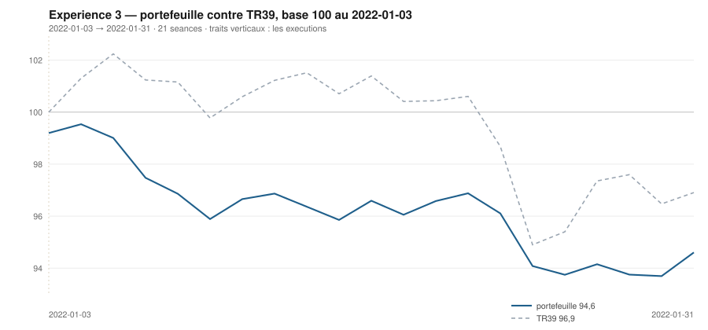

| | |
|---|---|
| Dotation initiale | 10 000,00 € au 2022-01-03 |
| Titres au 2022-01-31 | 3 373,60 € |
| Espèces | 6 086,89 € |
| **Total** | **9 460,49 €** |
| Base 100 | **94,60** |
| TR39, même base | 96,91 |
| Écart depuis janvier | **-2,30 pt** |

### Toutes les positions depuis le début de l'expérience

> Closes comme ouvertes. Une position encore ouverte laisse les deux dernières colonnes vides. Aucune séance postérieure au 2022-01-31 n'entre dans ce tableau.

| Société | Prix d'achat | Date d'achat | Prix de vente | Date de vente |
|---|---|---|---|---|
| `CAP.PA` Capgemini | 194,20 € | 2022-01-03 |  |  |
| `DSY.PA` Dassault Systèmes | 50,13 € | 2022-01-03 |  |  |

*2 positions depuis le début, dont 2 encore ouvertes : les deux dernières colonnes restent vides.*

## 5. L'étude chartiste au 2021-12-31

> Notes rédigées sans aucune séance postérieure au 2021-12-31, par l'agent `chartiste`. Cinq lignes au plus par société, **chacune sous la figure de décision qui la justifie** — celle que la règle a lue ce jour-là, portant les cinq critères, les vetos et le verdict.

### 1. `EL.PA` — EssilorLuxottica

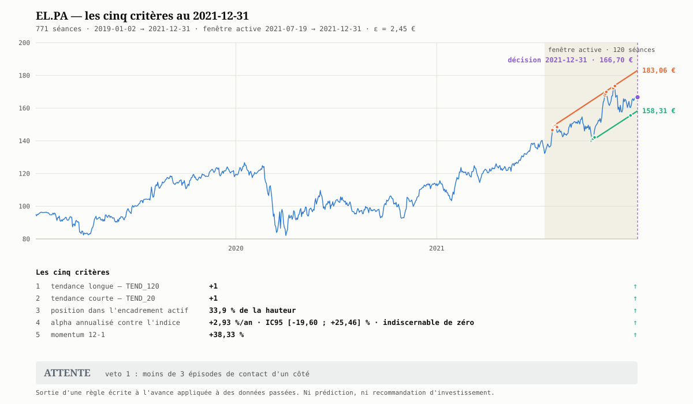

- Canal 158,31 – 183,06 €, large de 24,8 %, clôture à 166,70 € soit 33,9 % de la hauteur : le tiers bas.
- Les deux droites montent au même rythme, +0,310 et +0,315 €/séance — canal rigoureusement parallèle, τ infini.
- Deux épisodes de contact en support seulement : le veto 1 se déclenche, l'appui bas n'est pas certifié.
- Momentum 12-1 de +38,3 %, l'un des plus forts de l'univers ; l'alpha, +2,9 %/an, reste indiscernable de zéro.

### 2. `RI.PA` — Pernod Ricard

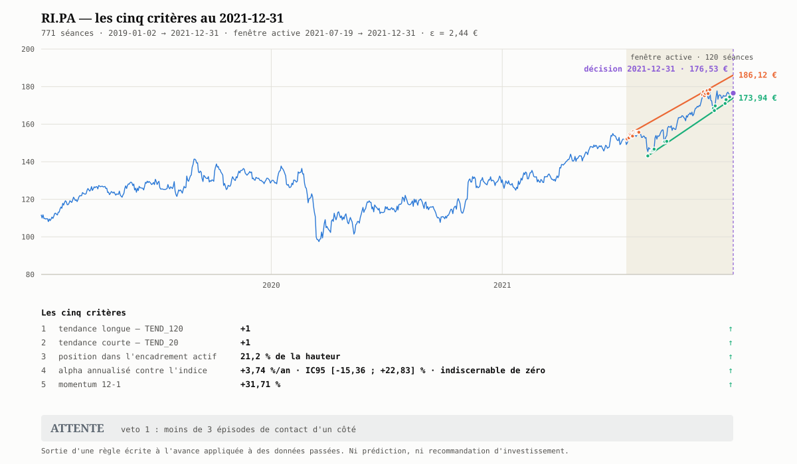

- Canal 173,94 – 186,12 €, étroit — 12,2 % —, clôture à 176,53 € dans le cinquième bas, 21,2 %.
- Support +0,325 contre résistance +0,271 €/séance : convergence lente, τ de 225 séances, bien au-delà de la cadence.
- Sept épisodes de contact en support contre deux en résistance : c'est le plafond qui n'est pas certifié, d'où le veto 1.
- Momentum +31,7 %, alpha +3,7 %/an avec un IC95 de −15,4 à +22,8 : rien de tranché.

### 3. `RMS.PA` — Hermès International

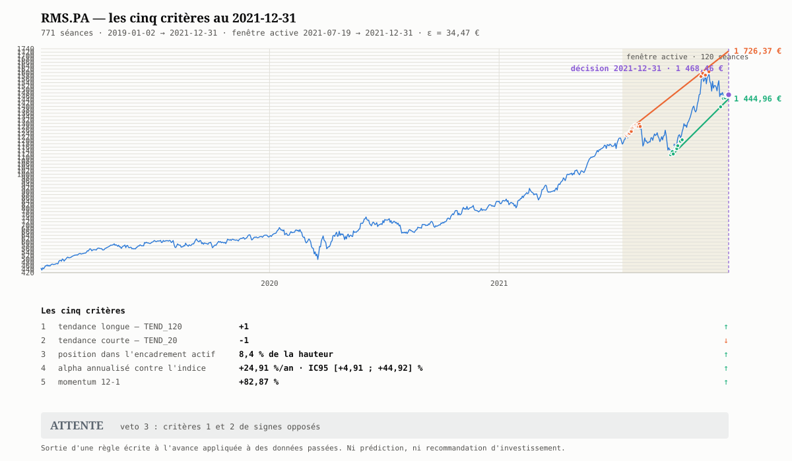

- Canal 1 444,96 – 1 726,37 €, très large — 281 € —, clôture à 1 468,46 € à 8,4 % : contre le support.
- Deux droites fortement montantes, +5,249 et +4,151 €/séance, convergentes, τ de 256 séances.
- Quatre contacts de chaque côté : la figure est lisible, mais la tendance courte est négative quand la longue est positive — veto 3.
- **Seul alpha significatif de la date** : +24,9 %/an, IC95 de +4,9 à +44,9, entièrement positif.

### 4. `CAP.PA` — Capgemini

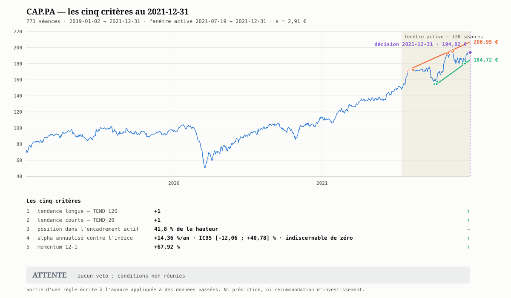

- Canal 184,72 – 206,95 €, large de 22,2 %, clôture à 194,02 € à 41,8 % — le milieu bas de la figure.
- Support +0,517 contre résistance +0,323 €/séance : le canal se referme, τ de 114 séances.
- Quatre contacts en bas, trois en haut : les deux bornes sont certifiées, aucun veto.
- Momentum de +67,9 %, le deuxième de l'univers ; alpha +14,4 %/an, IC95 encore à cheval sur zéro.

### 5. `DSY.PA` — Dassault Systèmes

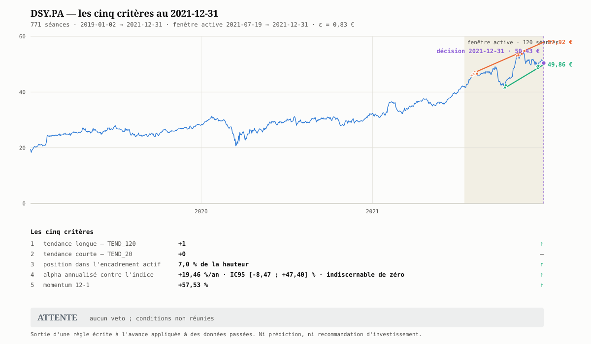

- Canal 49,86 – 57,92 €, clôture à 50,43 € : 7,0 % de la hauteur, presque sur le support.
- Deux droites montantes qui convergent doucement, +0,143 et +0,105 €/séance, τ de 210 séances.
- Trois et quatre épisodes : figure lisible des deux côtés, aucun veto.
- Momentum +57,5 %, alpha +19,5 %/an — le plus élevé après Eurofins, mais l'IC95 descend à −8,5.

### 6. `PUB.PA` — Publicis

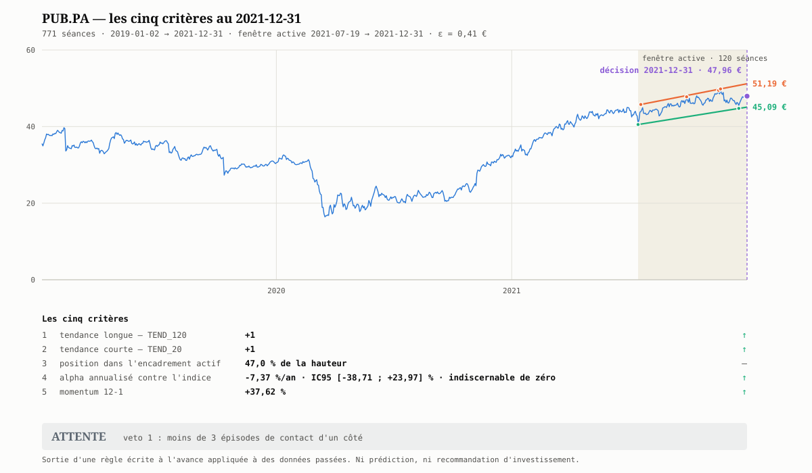

- Canal 45,09 – 51,19 €, large de 6,1 %, clôture à 47,96 € en plein milieu, 47,0 %.
- Pentes +0,038 et +0,047 €/séance : les droites s'écartent, canal divergent, τ infini.
- Deux épisodes en support : veto 1, l'appui bas repose sur deux points.
- Momentum +37,6 % malgré un alpha négatif de −7,4 %/an — la hausse est celle du marché.

### 7. `OR.PA` — L'Oréal

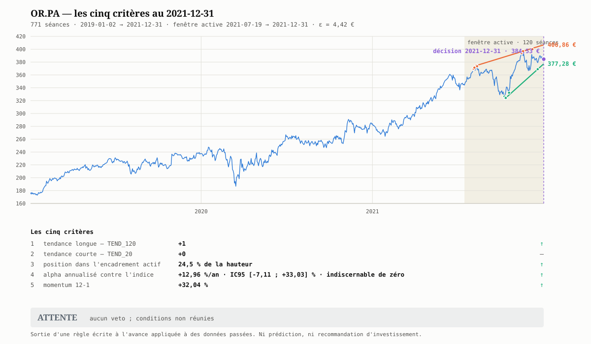

- Canal 377,28 – 406,86 €, clôture à 384,53 € à 24,5 % de la hauteur.
- Support +0,931 contre résistance +0,319 €/séance : la convergence est rapide, τ de 48 séances seulement.
- Trois contacts bas, quatre hauts, aucun veto — mais le canal a moins de trois mois d'espérance de vie.
- Momentum +32,0 %, alpha +13,0 %/an, IC95 de −7,1 à +33,0.

### 8. `STMPA.PA` — STMicroelectronics

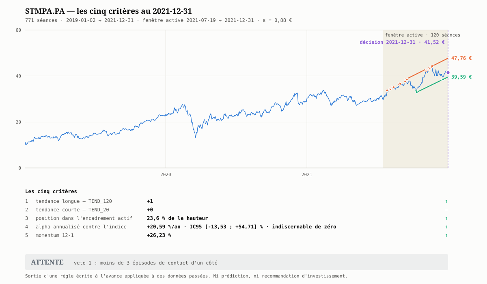

- Canal 39,59 – 47,76 €, clôture à 41,52 € à 23,6 % de la hauteur.
- Pentes +0,116 et +0,119 €/séance : divergence, τ infini, le canal ne se referme pas.
- Deux épisodes en support contre cinq en résistance : veto 1 sur l'appui bas.
- Momentum +26,2 %, alpha +20,6 %/an mais un IC95 de −13,5 à +54,7 : la mesure ne porte rien.

### 9. `GLE.PA` — Société Générale

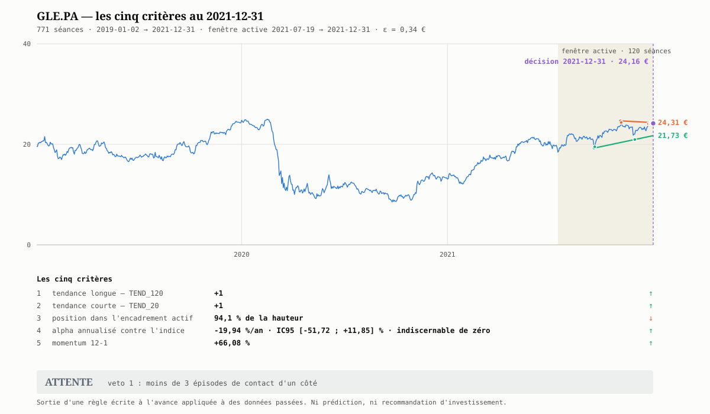

- Canal 21,73 – 24,31 €, clôture à 24,16 € à 94,1 % : contre le plafond.
- Support +0,034, résistance −0,009 €/séance, τ de 61 séances.
- Deux épisodes de chaque côté, veto 1 : la figure repose sur quatre points.
- Momentum de +66,1 %, le troisième de l'univers, pour un alpha de −19,9 %/an — la valeur monte moins que son marché.

### 10. `VIE.PA` — Veolia

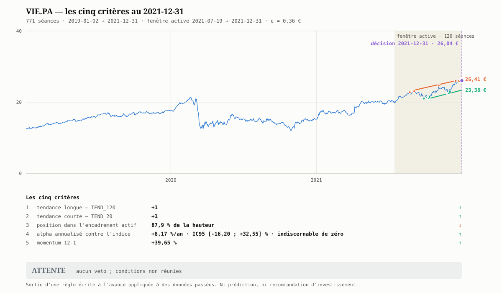

- Canal 23,38 – 26,41 €, clôture à 26,04 € à 87,9 % de la hauteur.
- Pentes +0,041 et +0,036 €/séance, quasi parallèles, τ de 668 séances — le canal survivra à l'année.
- Trois et cinq épisodes, aucun veto.
- Momentum +39,6 %, alpha +8,2 %/an, IC95 de −16,2 à +32,5.

### 11. `TEP.PA` — Teleperformance

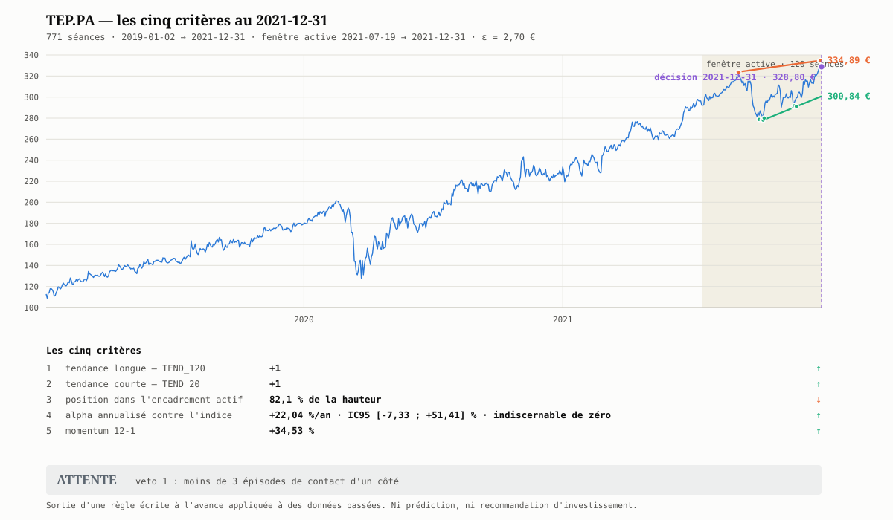

- Canal 300,84 – 334,89 €, clôture à 328,80 € à 82,1 % de la hauteur.
- Support +0,391 contre résistance +0,133 €/séance, τ de 132 séances.
- Deux épisodes seulement en résistance : veto 1.
- Momentum +34,5 %, alpha +22,0 %/an mais un IC95 large de 59 points.

### 12. `MC.PA` — LVMH

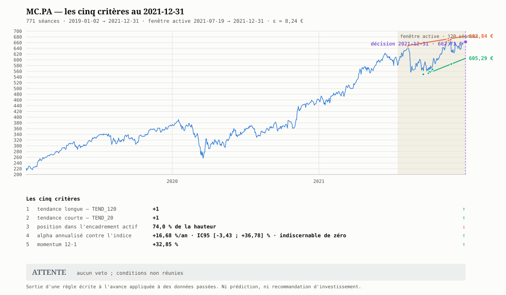

- Canal 605,29 – 682,84 €, large de 77,5 €, clôture à 662,71 € à 74,0 % : dans le quart haut.
- Support +0,794 contre résistance +0,324 €/séance, τ de 165 séances.
- Quatre et trois épisodes : les deux bornes sont certifiées, aucun veto.
- Momentum +32,9 %, alpha +16,7 %/an, IC95 de −3,4 à +36,8 — à un point d'être significatif.

### 13. `CS.PA` — AXA

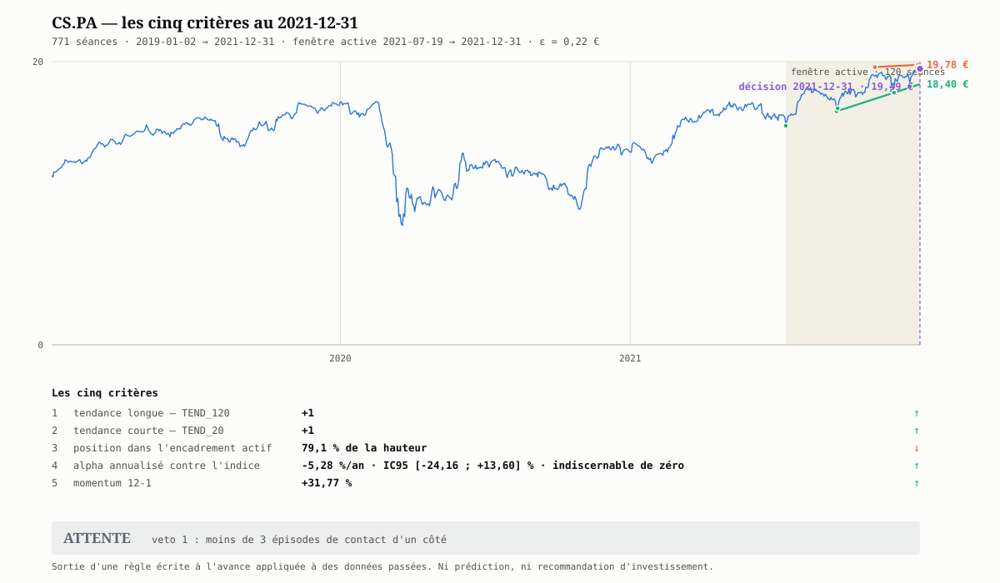

- Canal 18,40 – 19,78 €, clôture à 19,49 € à 79,1 % de la hauteur.
- Pentes +0,026 et +0,004 €/séance, convergence douce, τ de 64 séances.
- Quatre contacts en support, deux en résistance : veto 1.
- Momentum +31,8 %, alpha −5,3 %/an, IC95 de −24,2 à +13,6.

### 14. `BNP.PA` — BNP Paribas

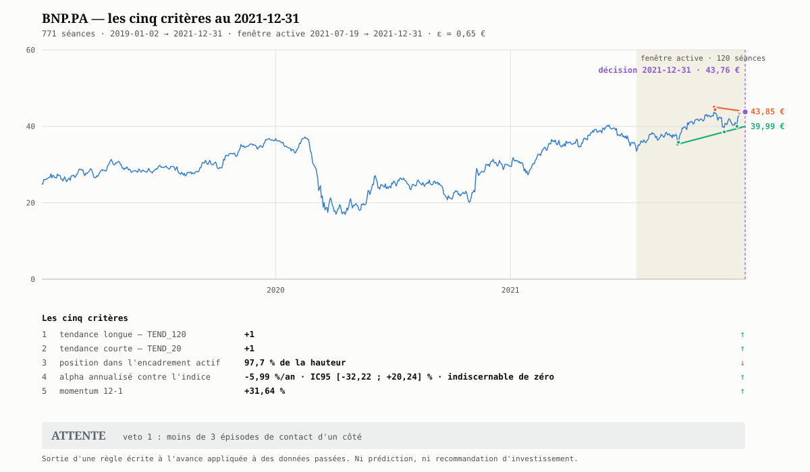

- Canal 39,99 – 43,85 €, large de 3,9 %, clôture à 43,76 € à 97,7 % — sous la résistance, à neuf centimes.
- Support montant +0,063, résistance descendante −0,035 €/séance : τ de 39 séances.
- Trois contacts bas, deux hauts : veto 1 sur la résistance.
- Momentum +31,6 %, alpha −6,0 %/an malgré la hausse.

### 15. `SU.PA` — Schneider Electric

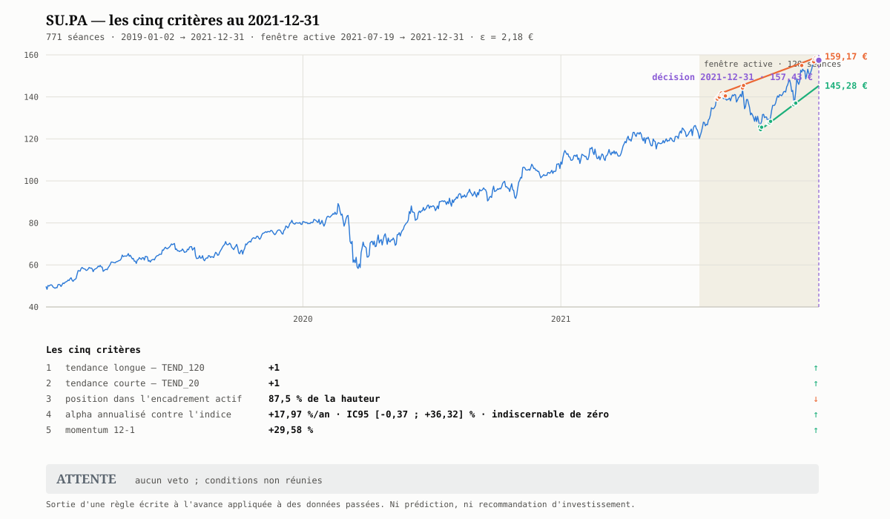

- Canal 145,28 – 159,17 €, clôture à 157,43 € à 87,5 %, tout près du plafond.
- Pentes +0,360 et +0,179 €/séance, convergence, τ de 77 séances.
- Trois contacts bas, quatre hauts, aucun veto : la figure est la plus propre du haut de classement.
- Alpha +18,0 %/an, IC95 de −0,4 à +36,3 : il manque quatre dixièmes pour que la borne basse passe au-dessus de zéro.

### 16. `ACA.PA` — Crédit Agricole

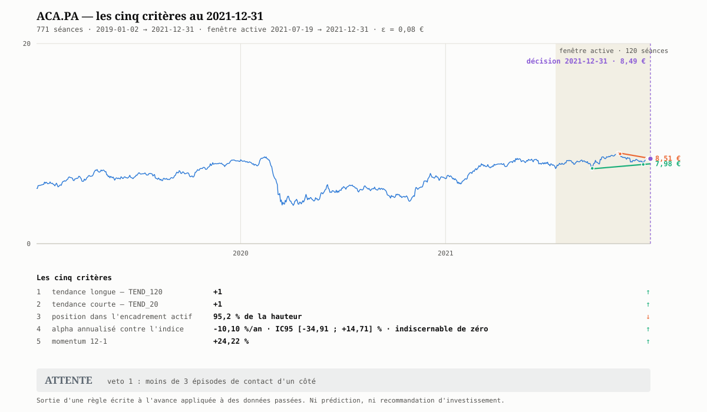

- Canal 7,98 – 8,51 €, d'une largeur de 0,5 % seulement, clôture à 8,49 € à 95,2 % : collée au plafond.
- Support +0,007 contre résistance −0,014 €/séance : les droites se croisent dans 25 séances.
- Deux contacts de chaque côté : veto 1. Un canal aussi mince rend la position dans la hauteur peu informative.
- Momentum +24,2 %, alpha −10,1 %/an.

### 17. `LR.PA` — Legrand

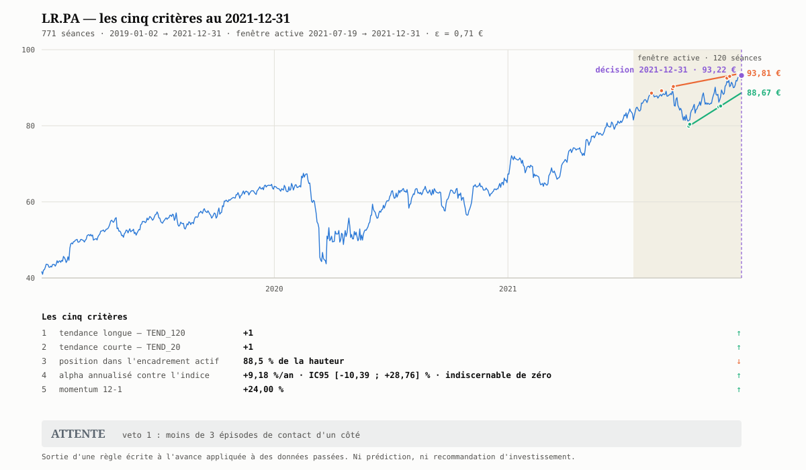

- Canal 88,67 – 93,81 €, clôture à 93,22 € à 88,5 % de la hauteur.
- Pentes +0,151 et +0,046 €/séance, τ de 49 séances : le canal se referme avant deux mois.
- Six contacts en résistance mais deux seulement en support : veto 1 sur l'appui bas.
- Momentum +24,0 %, alpha +9,2 %/an, IC95 à cheval sur zéro.

### 18. `TTE.PA` — TotalEnergies

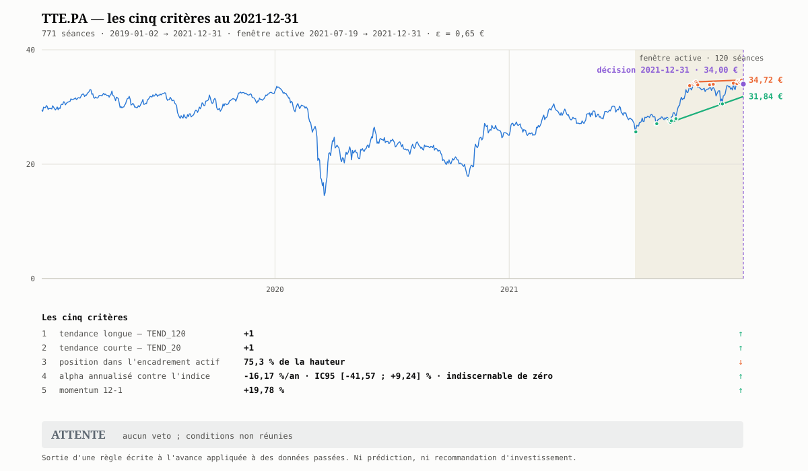

- Canal 31,84 – 34,72 €, clôture à 34,00 € à 75,3 %.
- Pentes +0,056 et +0,006 €/séance, τ de 57 séances.
- Cinq contacts en support et six en résistance : la figure la mieux étayée de la date, aucun veto.
- Momentum +19,8 % pour un alpha de −16,2 %/an : la valeur suit le marché de loin.

### 19. `AI.PA` — Air Liquide

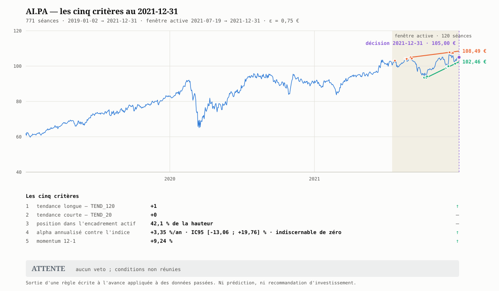

- Canal 102,46 – 108,49 €, large de 6,0 %, clôture à 105,00 € à 42,1 % : le milieu.
- Pentes +0,155 et +0,041 €/séance, τ de 53 séances.
- Quatre et cinq contacts : figure lisible, aucun veto.
- Momentum de +9,2 % seulement, sous le seuil de +10 % qui vaut deux points au lieu d'un.

### 20. `ML.PA` — Michelin

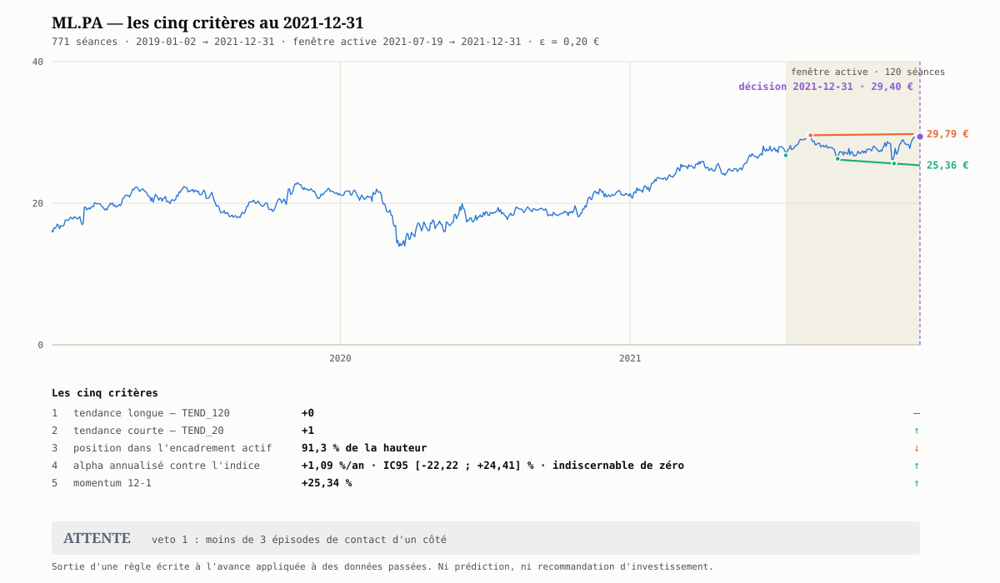

- Canal 25,36 – 29,79 €, clôture à 29,40 € à 91,3 % de la hauteur.
- Support en légère baisse, −0,011, résistance en légère hausse, +0,002 €/séance : divergence, τ infini.
- Trois contacts bas, deux hauts : veto 1.
- Tendance longue nulle, tendance courte positive ; momentum +25,3 %.

### 21. `SAN.PA` — Sanofi

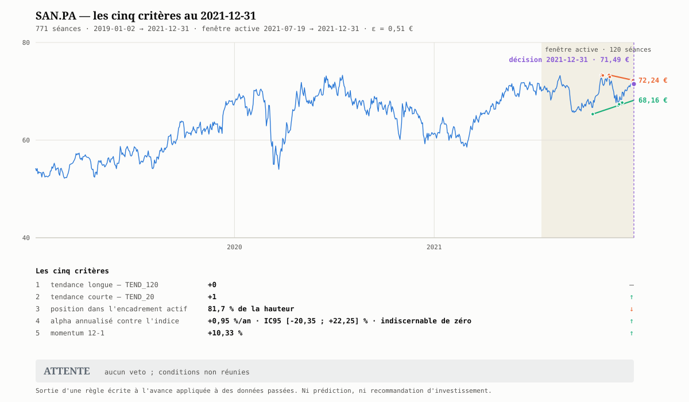

- Canal 68,16 – 72,24 €, clôture à 71,49 € à 81,7 %.
- Support +0,053 contre résistance −0,035 €/séance, τ de 46 séances.
- Trois épisodes de chaque côté : le minimum requis, aucun veto.
- Momentum +10,3 %, à peine au-dessus du seuil ; alpha +0,9 %/an, rigoureusement nul.

### 22. `ENGI.PA` — Engie

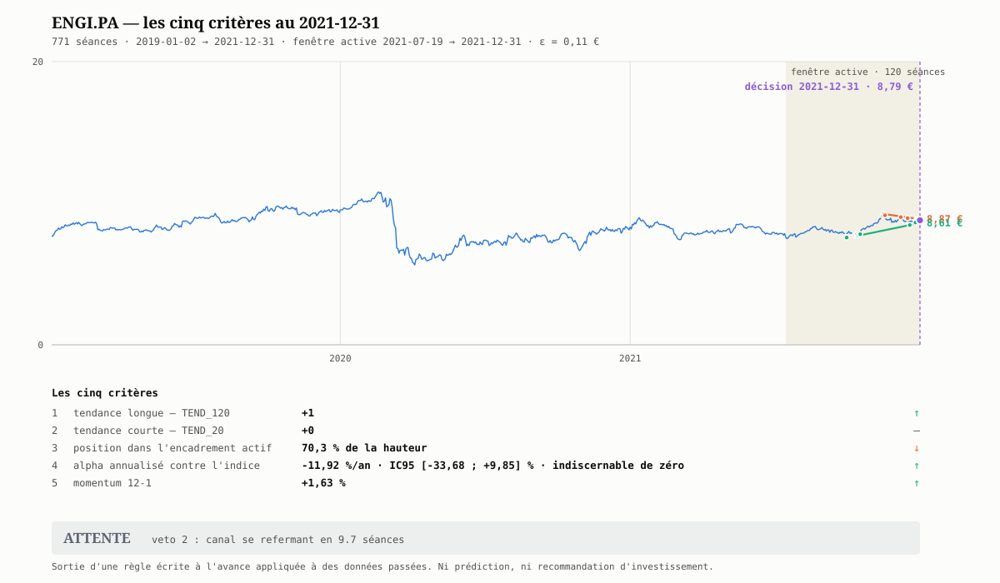

- Canal 8,61 – 8,87 €, d'une largeur de 0,3 % — le plus mince de la date —, clôture à 8,79 € à 70,3 %.
- Support +0,016, résistance −0,011 €/séance : **les droites se croisent dans dix séances**, veto 2.
- Un canal qui se referme avant la décision suivante ne dit rien de la position qu'on y lit.
- Momentum de +1,6 %, quasi nul ; alpha −11,9 %/an.

### 23. `DG.PA` — Vinci

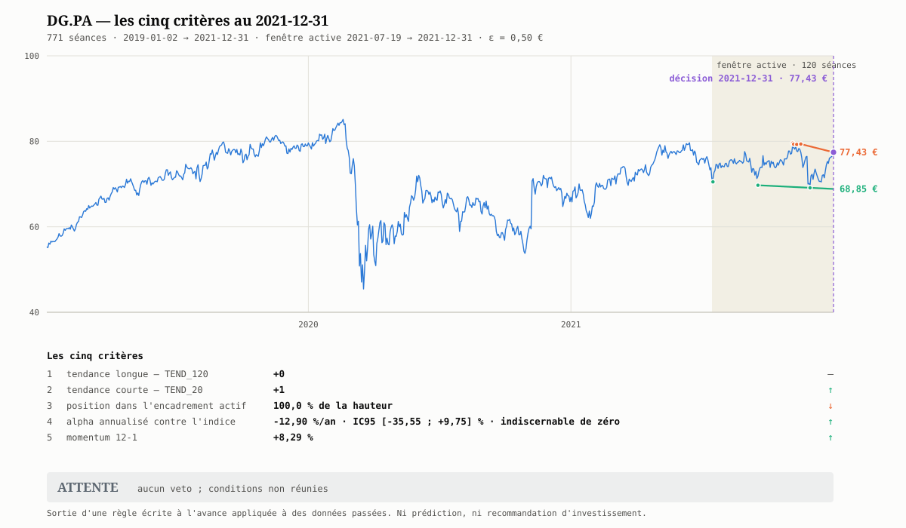

- Canal 68,85 – 77,43 €, clôture à 77,43 € : **exactement sur la résistance**, 100,0 % de la hauteur.
- Les deux droites descendent, −0,012 et −0,060 €/séance, τ de 177 séances.
- Trois et quatre contacts, aucun veto : la figure est lisible et la clôture est à son plafond.
- Momentum +8,3 %, alpha −12,9 %/an.

### 24. `ERF.PA` — Eurofins Scientific

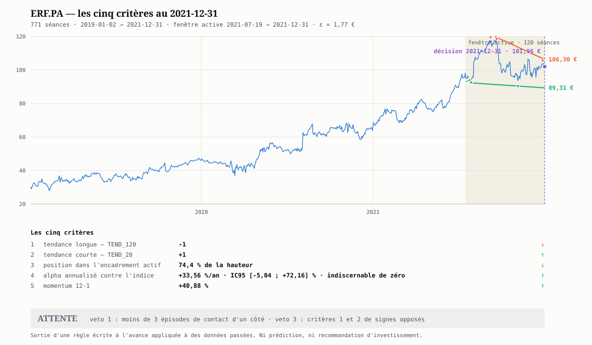

- Canal 89,31 – 106,30 €, clôture à 101,96 € à 74,4 % de la hauteur.
- Support −0,027, résistance −0,183 €/séance : le canal se referme, τ de 109 séances.
- Deux contacts en support : veto 1 ; tendances de signes opposés : veto 3.
- **Momentum +40,9 % et alpha +33,6 %/an**, le plus élevé de la date — mais l'IC95 va de −5,0 à +72,2.

### 25. `SGO.PA` — Saint-Gobain

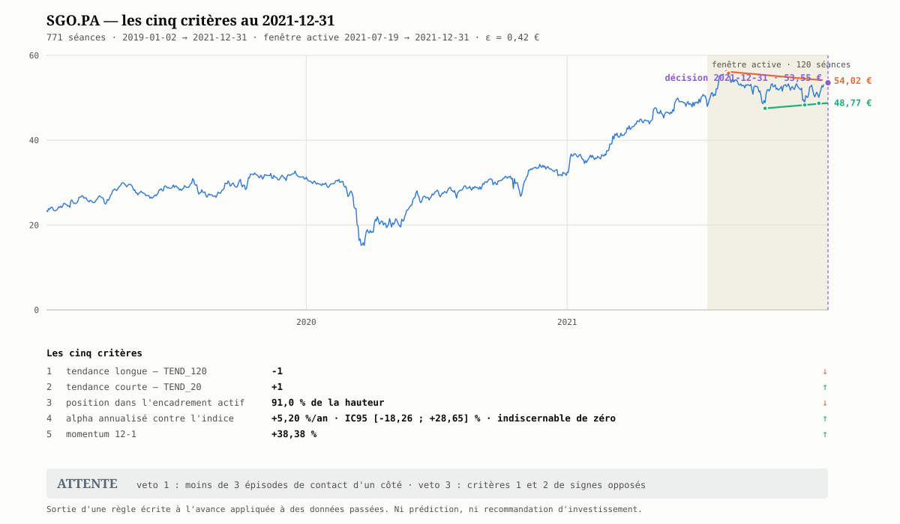

- Canal 48,77 – 54,02 €, clôture à 53,55 € à 91,0 %.
- Support +0,020, résistance −0,022 €/séance, τ de 126 séances.
- Trois contacts bas, deux hauts : veto 1 ; tendances opposées : veto 3.
- Momentum +38,4 %, alpha +5,2 %/an.

### 26. `MT.AS` — ArcelorMittal

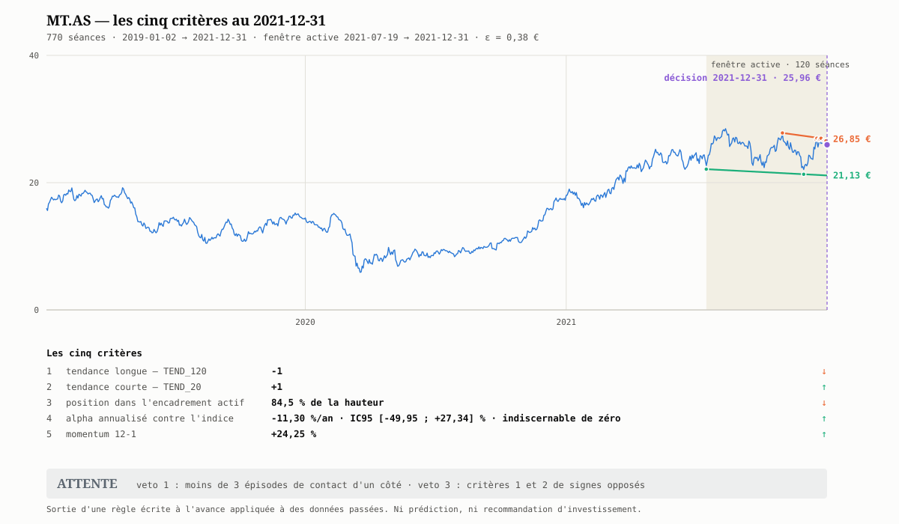

- Canal 21,13 – 26,85 €, clôture à 25,96 € à 84,5 % de la hauteur.
- Deux droites légèrement descendantes, −0,008 et −0,022 €/séance, τ de 419 séances.
- Deux épisodes en support : veto 1 ; tendances contradictoires : veto 3.
- Momentum +24,2 %, alpha −11,3 %/an, IC95 de 77 points.

### 27. `KER.PA` — Kering

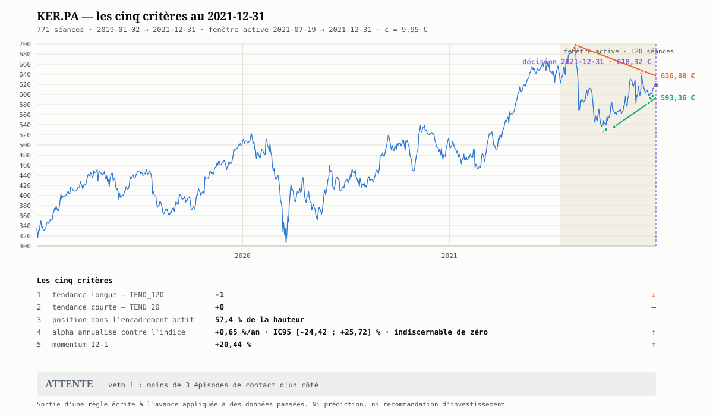

- Canal 593,36 – 636,88 €, clôture à 618,32 € à 57,4 % : le milieu haut.
- Support +1,105 contre résistance −0,611 €/séance : convergence franche, τ de 25 séances.
- Quatre contacts bas, deux hauts : veto 1.
- Momentum +20,4 %, alpha +0,7 %/an — exactement nul.

### 28. `VIV.PA` — Vivendi

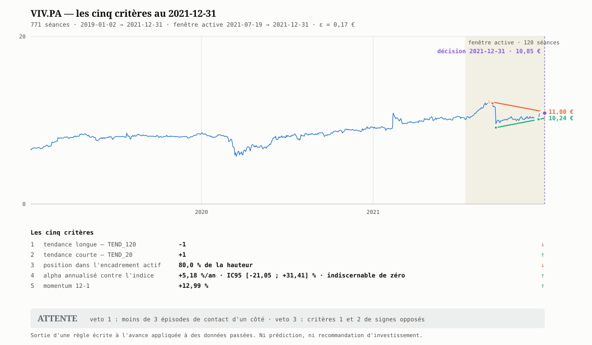

- Canal 10,24 – 11,00 €, large de 0,8 %, clôture à 10,85 € à 80,0 %.
- Pentes +0,015 et −0,015 €/séance, symétriques : τ de 25 séances, le canal se referme avant la décision suivante.
- Deux contacts de chaque côté : veto 1 ; tendances opposées : veto 3.
- Momentum +13,0 %, alpha +5,2 %/an.

### 29. `AIR.PA` — Airbus

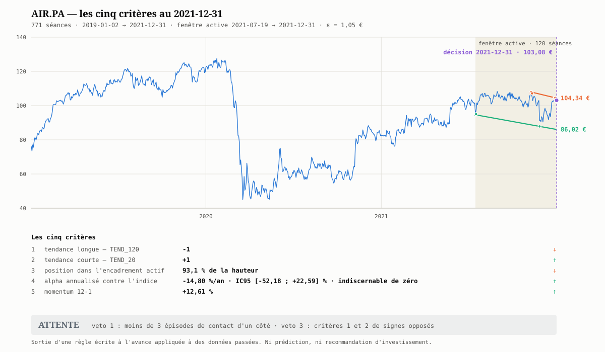

- Canal 86,02 – 104,34 €, large de 18,3 %, clôture à 103,08 € à 93,1 %.
- Deux droites descendantes, −0,072 et −0,097 €/séance, τ de 753 séances : la figure ne se refermera pas.
- Deux contacts de chaque côté — veto 1 — et tendance longue négative contre courte positive — veto 3.
- Momentum +12,6 %, alpha −14,8 %/an avec un IC95 de 75 points de large.

### 30. `BN.PA` — Danone

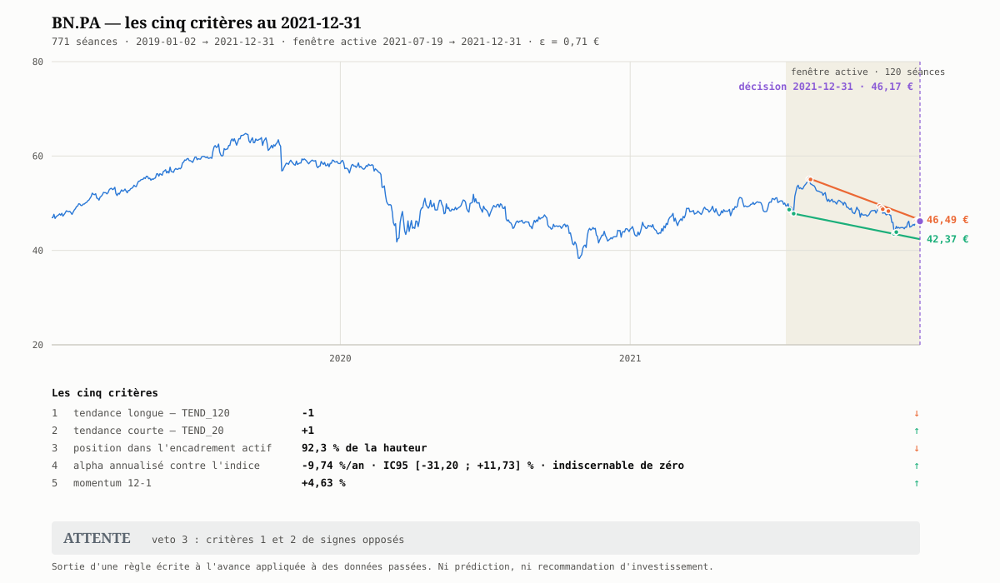

- Canal 42,37 – 46,49 €, clôture à 46,17 € à 92,3 % de la hauteur.
- Deux droites descendantes, −0,049 et −0,089 €/séance, τ de 101 séances.
- Trois et quatre épisodes : figure lisible, mais tendances de signes opposés, veto 3.
- Momentum de +4,6 % seulement ; alpha −9,7 %/an.

### 31. `ORA.PA` — Orange

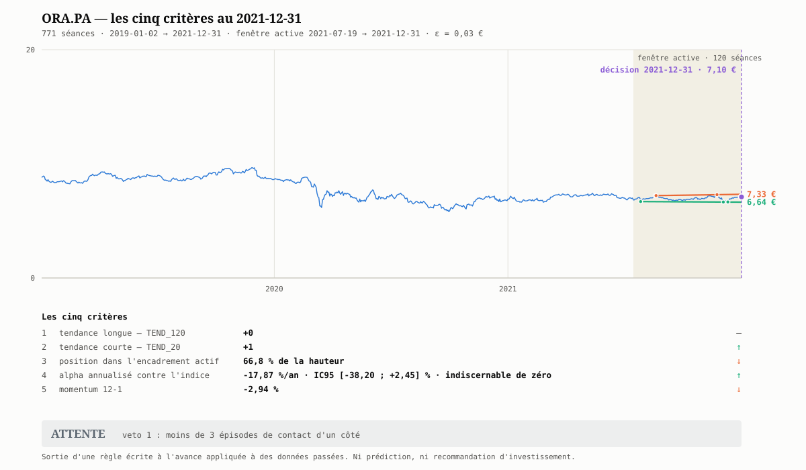

- Canal 6,64 – 7,33 €, clôture à 7,10 € à 66,8 %, juste au-dessus du seuil de 65 %.
- Pentes −0,001 et +0,001 €/séance : divergence imperceptible, τ infini.
- Trois contacts bas, deux hauts : veto 1.
- **Momentum négatif, −2,9 %**, le premier de la liste ; alpha −17,9 %/an, IC95 de −38,2 à +2,5.

### 32. `CA.PA` — Carrefour

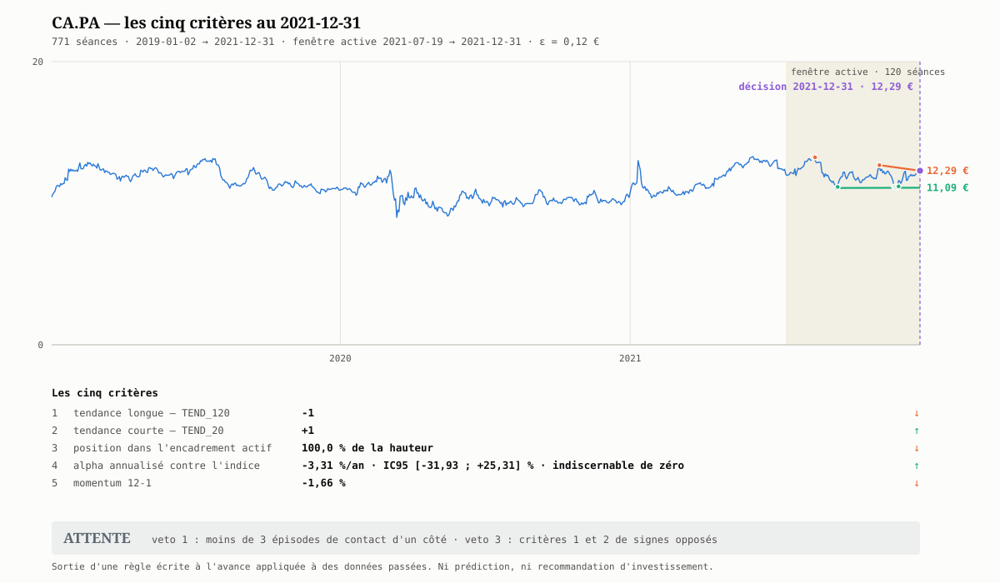

- Canal 11,09 – 12,29 €, clôture à 12,29 € : **sur la résistance exactement**, 100,0 %.
- Support plat, 0,000, résistance −0,011 €/séance, τ de 107 séances.
- Deux contacts en support : veto 1 ; tendances opposées : veto 3.
- Momentum −1,7 %, alpha −3,3 %/an.

### 33. `EN.PA` — Bouygues

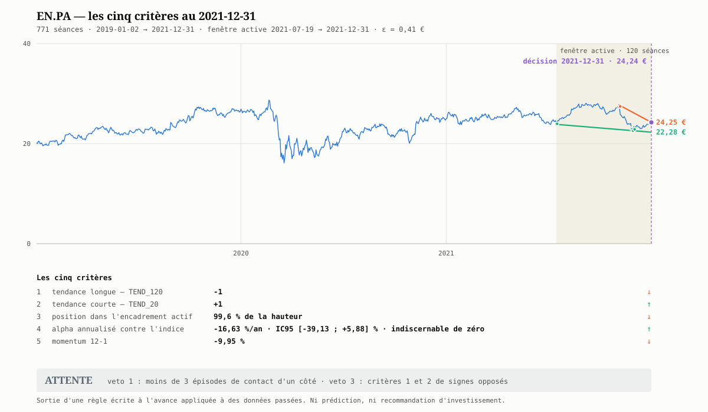

- Canal 22,28 – 24,25 €, clôture à 24,24 € à 99,6 % : au centime sous le plafond.
- Pentes −0,013 et −0,086 €/séance, τ de 27 séances.
- Deux contacts de chaque côté : veto 1 ; tendances opposées : veto 3.
- Momentum −9,9 %, à un dixième du seuil de −10 % qui coûterait un point de plus.

### 34. `SAF.PA` — Safran

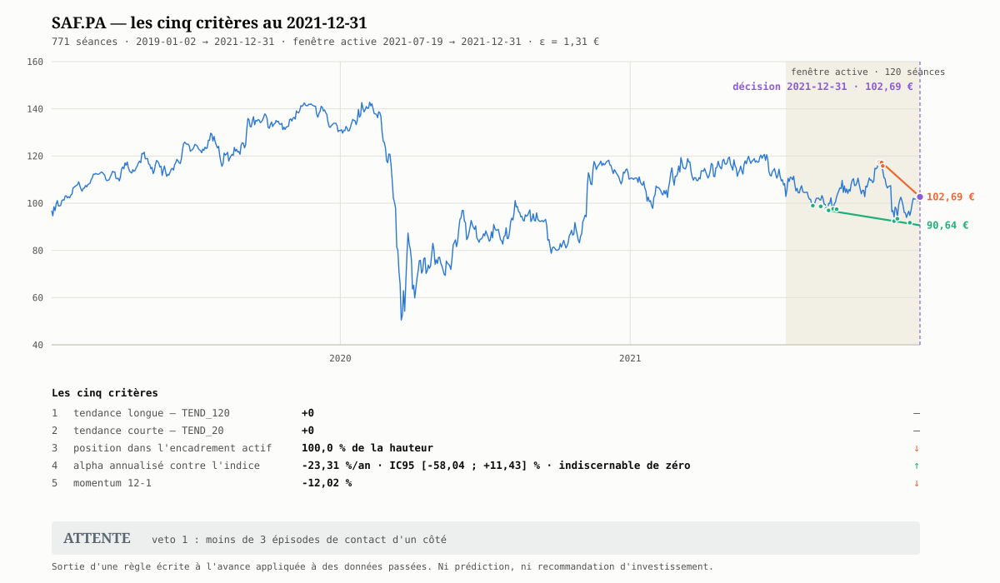

- Canal 90,64 – 102,69 €, clôture à 102,69 € : **sur la résistance**, 100,0 %.
- Support −0,077, résistance −0,428 €/séance : convergence rapide, τ de 34 séances.
- Huit contacts en support — le plus étayé de la date — mais deux seulement en résistance : veto 1.
- Momentum −12,0 %, alpha −23,3 %/an.

### 35. `ALO.PA` — Alstom

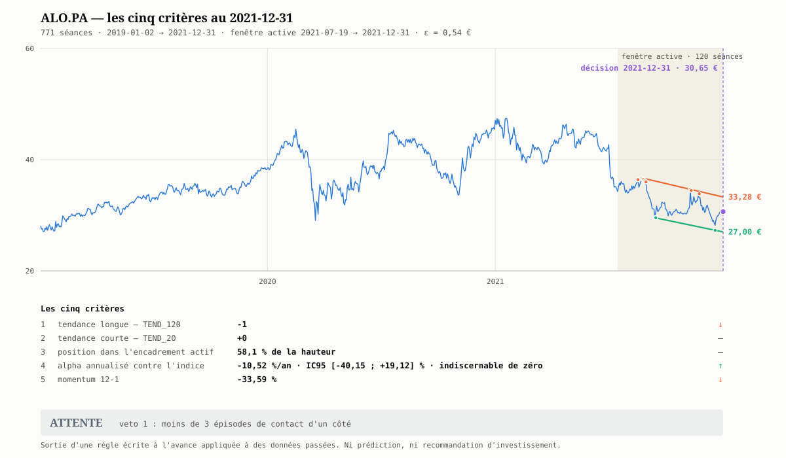

- Canal 27,00 – 33,28 €, large de 6,3 %, clôture à 30,65 € à 58,1 % : le milieu.
- Deux droites descendantes presque parallèles, −0,033 et −0,037 €/séance, τ de 1 532 séances.
- Deux contacts en support : veto 1.
- **Momentum de −33,6 %**, le plus faible de l'univers après Worldline ; alpha −10,5 %/an.

### 36. `HO.PA` — Thales

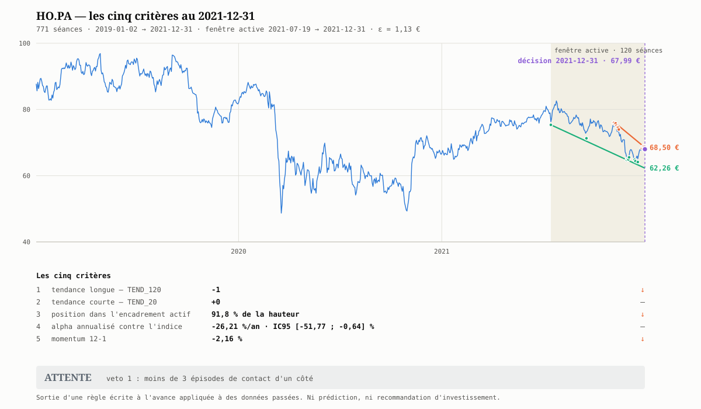

- Canal 62,26 – 68,50 €, clôture à 67,99 € à 91,8 % de la hauteur.
- Pentes −0,110 et −0,198 €/séance, τ de 71 séances.
- Cinq contacts bas, deux hauts : veto 1.
- **Alpha significativement négatif** : −26,2 %/an, IC95 de −51,8 à −0,6, entièrement sous zéro.

### 37. `WLN.PA` — Worldline

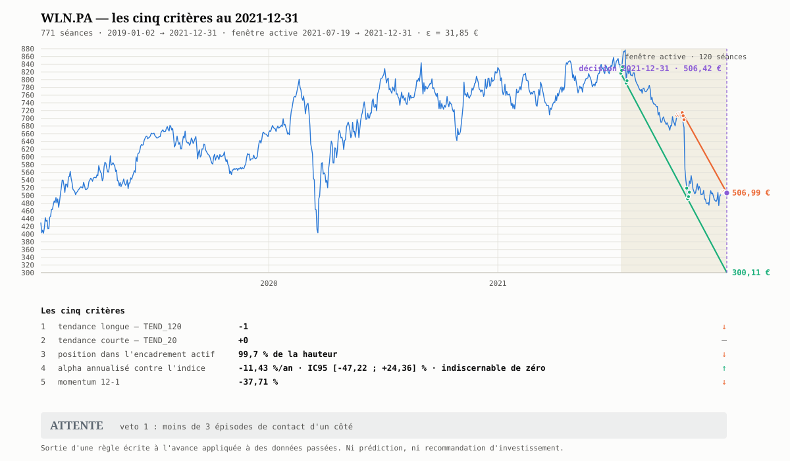

- Canal 300,11 – 506,99 €, d'une largeur de 207 % — la figure la plus étirée de la date —, clôture à 506,42 € à 99,7 %.
- Deux droites en chute, −4,338 et −4,147 €/séance, divergentes : τ infini.
- Trois contacts bas, deux hauts : veto 1.
- **Momentum de −37,7 %, le plus faible de l'univers** ; alpha −11,4 %/an.
- Les niveaux en euros de cette série portent le regroupement de 2026 : seules ses quantités relatives sont comparables aux autres.

### 38. `RNO.PA` — Renault

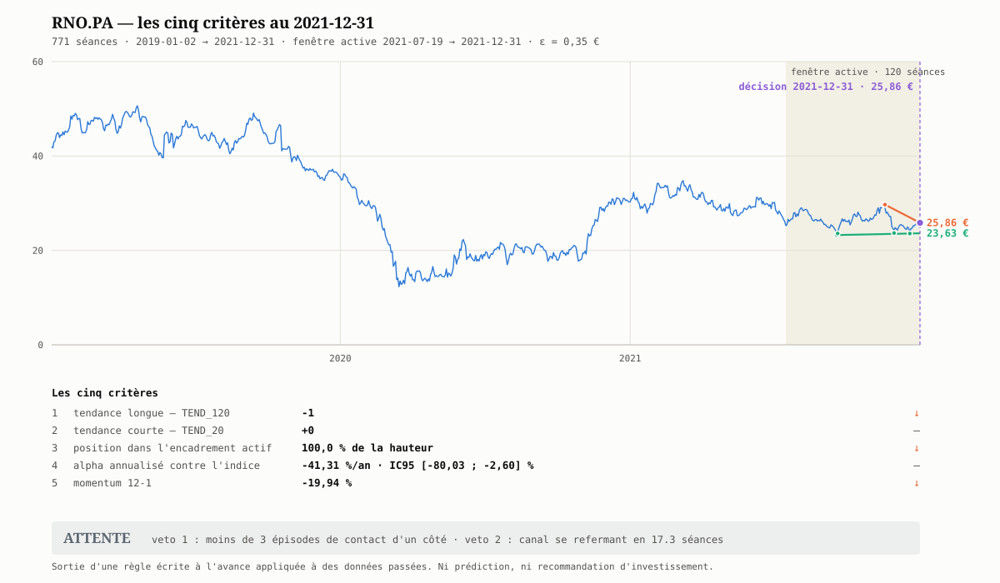

- Canal 23,63 – 25,86 €, clôture à 25,86 € : **sur la résistance**, 100,0 %.
- Support +0,005, résistance −0,124 €/séance : **le canal se referme en 17 séances**, veto 2, avant même la prochaine décision.
- Deux contacts en résistance : veto 1 également.
- **Alpha significativement négatif** : −41,3 %/an, IC95 de −80,0 à −2,6. Momentum −19,9 %.

## 6. Le classement au 2021-12-31

> De la valeur la plus intéressante à détenir à celle qu'il faut fuir. La colonne **τ** donne la date de péremption du canal en séances, la colonne **Vetos** les numéros déclenchés. Une valeur sous veto ne peut pas être achetée.

| Rang | Valeur | `s1` | `s2` | `s3` | `s4` | `s5` | Score | Position | Momentum | τ | Vetos |
|---|---|---|---|---|---|---|---|---|---|---|---|
| 1 | `EL.PA` EssilorLuxottica | +2 | +1 | +1 | +2 | +0 | **+6** | 33,9 % | +38,3 % | ∞ | 1 |
| 2 | `RI.PA` Pernod Ricard | +2 | +1 | +1 | +2 | +0 | **+6** | 21,2 % | +31,7 % | 224,9 | 1 |
| 3 | `RMS.PA` Hermès International | +2 | -1 | +1 | +2 | +1 | **+5** | 8,4 % | +82,9 % | 256,3 | 3 |
| 4 | `CAP.PA` Capgemini | +2 | +1 | +0 | +2 | +0 | **+5** | 41,8 % | +67,9 % | 114,3 | — |
| 5 | `DSY.PA` Dassault Systèmes | +2 | +0 | +1 | +2 | +0 | **+5** | 7,0 % | +57,5 % | 210,5 | — |
| 6 | `PUB.PA` Publicis | +2 | +1 | +0 | +2 | +0 | **+5** | 47,0 % | +37,6 % | ∞ | 1 |
| 7 | `OR.PA` L'Oréal | +2 | +0 | +1 | +2 | +0 | **+5** | 24,5 % | +32,0 % | 48,3 | — |
| 8 | `STMPA.PA` STMicroelectronics | +2 | +0 | +1 | +2 | +0 | **+5** | 23,6 % | +26,2 % | ∞ | 1 |
| 9 | `GLE.PA` Société Générale | +2 | +1 | -1 | +2 | +0 | **+4** | 94,1 % | +66,1 % | 61,3 | 1 |
| 10 | `VIE.PA` Veolia | +2 | +1 | -1 | +2 | +0 | **+4** | 87,9 % | +39,6 % | 667,6 | — |
| 11 | `TEP.PA` Teleperformance | +2 | +1 | -1 | +2 | +0 | **+4** | 82,1 % | +34,5 % | 131,7 | 1 |
| 12 | `MC.PA` LVMH | +2 | +1 | -1 | +2 | +0 | **+4** | 74,0 % | +32,9 % | 165,0 | — |
| 13 | `CS.PA` AXA | +2 | +1 | -1 | +2 | +0 | **+4** | 79,1 % | +31,8 % | 63,6 | 1 |
| 14 | `BNP.PA` BNP Paribas | +2 | +1 | -1 | +2 | +0 | **+4** | 97,7 % | +31,6 % | 39,3 | 1 |
| 15 | `SU.PA` Schneider Electric | +2 | +1 | -1 | +2 | +0 | **+4** | 87,5 % | +29,6 % | 76,8 | — |
| 16 | `ACA.PA` Crédit Agricole | +2 | +1 | -1 | +2 | +0 | **+4** | 95,2 % | +24,2 % | 25,5 | 1 |
| 17 | `LR.PA` Legrand | +2 | +1 | -1 | +2 | +0 | **+4** | 88,5 % | +24,0 % | 49,0 | 1 |
| 18 | `TTE.PA` TotalEnergies | +2 | +1 | -1 | +2 | +0 | **+4** | 75,3 % | +19,8 % | 57,3 | — |
| 19 | `AI.PA` Air Liquide | +2 | +0 | +0 | +1 | +0 | **+3** | 42,1 % | +9,2 % | 52,9 | — |
| 20 | `ML.PA` Michelin | +0 | +1 | -1 | +2 | +0 | **+2** | 91,3 % | +25,3 % | ∞ | 1 |
| 21 | `SAN.PA` Sanofi | +0 | +1 | -1 | +2 | +0 | **+2** | 81,7 % | +10,3 % | 46,3 | — |
| 22 | `ENGI.PA` Engie | +2 | +0 | -1 | +1 | +0 | **+2** | 70,3 % | +1,6 % | 9,7 | 2 |
| 23 | `DG.PA` Vinci | +0 | +1 | -1 | +1 | +0 | **+1** | 100,0 % | +8,3 % | 176,7 | — |
| 24 | `ERF.PA` Eurofins Scientific | -2 | +1 | -1 | +2 | +0 | **+0** | 74,4 % | +40,9 % | 109,2 | 1 3 |
| 25 | `SGO.PA` Saint-Gobain | -2 | +1 | -1 | +2 | +0 | **+0** | 91,0 % | +38,4 % | 125,7 | 1 3 |
| 26 | `MT.AS` ArcelorMittal | -2 | +1 | -1 | +2 | +0 | **+0** | 84,5 % | +24,2 % | 418,7 | 1 3 |
| 27 | `KER.PA` Kering | -2 | +0 | +0 | +2 | +0 | **+0** | 57,4 % | +20,4 % | 25,4 | 1 |
| 28 | `VIV.PA` Vivendi | -2 | +1 | -1 | +2 | +0 | **+0** | 80,0 % | +13,0 % | 25,3 | 1 3 |
| 29 | `AIR.PA` Airbus | -2 | +1 | -1 | +2 | +0 | **+0** | 93,1 % | +12,6 % | 752,7 | 1 3 |
| 30 | `BN.PA` Danone | -2 | +1 | -1 | +1 | +0 | **-1** | 92,3 % | +4,6 % | 101,0 | 3 |
| 31 | `ORA.PA` Orange | +0 | +1 | -1 | -1 | +0 | **-1** | 66,8 % | -2,9 % | ∞ | 1 |
| 32 | `CA.PA` Carrefour | -2 | +1 | -1 | -1 | +0 | **-3** | 100,0 % | -1,7 % | 106,5 | 1 3 |
| 33 | `EN.PA` Bouygues | -2 | +1 | -1 | -1 | +0 | **-3** | 99,6 % | -9,9 % | 27,2 | 1 3 |
| 34 | `SAF.PA` Safran | +0 | +0 | -1 | -2 | +0 | **-3** | 100,0 % | -12,0 % | 34,3 | 1 |
| 35 | `ALO.PA` Alstom | -2 | +0 | +0 | -2 | +0 | **-4** | 58,1 % | -33,6 % | 1 532,0 | 1 |
| 36 | `HO.PA` Thales | -2 | +0 | -1 | -1 | -1 | **-5** | 91,8 % | -2,2 % | 71,2 | 1 |
| 37 | `WLN.PA` Worldline | -2 | +0 | -1 | -2 | +0 | **-5** | 99,7 % | -37,7 % | ∞ | 1 |
| 38 | `RNO.PA` Renault | -2 | +0 | -1 | -2 | -1 | **-6** | 100,0 % | -19,9 % | 17,3 | 1 2 |

## 7. Les ordres exécutés au 2022-01-03

> À l'**ouverture** de la séance, jamais à la clôture du 2021-12-31.

| Sens | Valeur | Quantité | Prix d'exécution | Brut | Frais | Motif |
|---|---|---|---|---|---|---|
| **Achat** | `CAP.PA` Capgemini | 10 | 194,20 € | 1 942,01 € | 8,06 € | rang 4, score +5, aucun veto |
| **Achat** | `DSY.PA` Dassault Systèmes | 39 | 50,13 € | 1 954,92 € | 8,11 € | rang 5, score +5, aucun veto |

## 8. La lecture du mois

Sur le mois, la meilleure contribution vient de `CAP.PA` (Capgemini) pour **-172,37 €**, la moins bonne de `DSY.PA` (Dassault Systèmes) pour **-367,14 €**. Les 2 ordres du mois ont coûté **16,17 €** de frais, soit 0,162 % de la dotation initiale. Le portefeuille termine le mois **derrière TR39** de 2,30 point. Sur les 46 thèses du mois précédent qui ont pu être tranchées, **32 sont confirmées** — 69,6 %.

## 9. Les thèses écrites au 2021-12-31

> Elles seront dépouillées à la prochaine date de décision, dans le fichier du mois suivant. Elles sont engendrées mécaniquement par les règles du [protocole](../README.md#le-registre-des-thèses-réfutables) — aucune n'est rédigée à la main.

| Valeur | Thèse | Énoncé, à dépouiller au mois suivant |
|---|---|---|
| `ACA.PA` | Canal | clôture entre 8,12 € et 8,22 € au 2022-01-31 |
| `ACA.PA` | Reflexive | AUTO-RENFORCEMENT : écart contre TR39 au-dessus de +3,63 pt (0,5 σ̂), au 2022-01-31 |
| `AI.PA` | Canal | clôture entre 105,72 € et 109,35 € au 2022-01-31 |
| `AIR.PA` | Canal | clôture entre 84,51 € et 102,31 € au 2022-01-31 |
| `ALO.PA` | Canal | clôture entre 26,30 € et 32,50 € au 2022-01-31 |
| `ALO.PA` | Reflexive | AUCUNE SEQUENCE : écart contre TR39 dans ± 7,57 pt (σ̂), au 2022-01-31 |
| `BN.PA` | Canal | clôture entre 41,35 € et 44,62 € au 2022-01-31 |
| `BNP.PA` | Canal | clôture entre 41,32 € et 43,11 € au 2022-01-31 |
| `BNP.PA` | Reflexive | AUTO-RENFORCEMENT : écart contre TR39 au-dessus de +3,67 pt (0,5 σ̂), au 2022-01-31 |
| `CA.PA` | Canal | clôture entre 11,09 € et 12,06 € au 2022-01-31 |
| `CAP.PA` | Canal | clôture entre 195,58 € et 213,73 € au 2022-01-31 |
| `CS.PA` | Canal | clôture entre 18,94 € et 19,87 € au 2022-01-31 |
| `CS.PA` | Reflexive | AUTO-RENFORCEMENT : écart contre TR39 au-dessus de +2,41 pt (0,5 σ̂), au 2022-01-31 |
| `DG.PA` | Canal | clôture entre 68,61 € et 76,17 € au 2022-01-31 |
| `DSY.PA` | Canal | clôture entre 52,87 € et 60,12 € au 2022-01-31 |
| `EL.PA` | Canal | clôture entre 164,83 € et 189,68 € au 2022-01-31 |
| `EN.PA` | Canal | clôture entre 22,00 € et 22,45 € au 2022-01-31 |
| `ENGI.PA` | Canal | encadrement ferme avant le 2022-01-31 : les bornes prolongees se croisent, la thèse est inconfirmable à l'écriture |
| `ERF.PA` | Canal | clôture entre 88,74 € et 102,46 € au 2022-01-31 |
| `ERF.PA` | Reflexive | AUCUNE SEQUENCE : écart contre TR39 dans ± 9,34 pt (σ̂), au 2022-01-31 |
| `GLE.PA` | Canal | clôture entre 22,44 € et 24,13 € au 2022-01-31 |
| `GLE.PA` | Reflexive | AUTO-RENFORCEMENT : écart contre TR39 au-dessus de +4,74 pt (0,5 σ̂), au 2022-01-31 |
| `HO.PA` | Canal | clôture entre 59,95 € et 64,35 € au 2022-01-31 |
| `KER.PA` | Canal | clôture entre 616,56 € et 624,04 € au 2022-01-31 |
| `LR.PA` | Canal | clôture entre 91,85 € et 94,78 € au 2022-01-31 |
| `MC.PA` | Canal | clôture entre 621,97 € et 689,65 € au 2022-01-31 |
| `ML.PA` | Canal | clôture entre 25,13 € et 29,83 € au 2022-01-31 |
| `MT.AS` | Canal | clôture entre 20,96 € et 26,39 € au 2022-01-31 |
| `MT.AS` | Reflexive | AUCUNE SEQUENCE : écart contre TR39 dans ± 11,42 pt (σ̂), au 2022-01-31 |
| `OR.PA` | Canal | clôture entre 396,83 € et 413,55 € au 2022-01-31 |
| `ORA.PA` | Canal | clôture entre 6,63 € et 7,36 € au 2022-01-31 |
| `PUB.PA` | Canal | clôture entre 45,89 € et 52,17 € au 2022-01-31 |
| `RI.PA` | Canal | clôture entre 180,76 € et 191,80 € au 2022-01-31 |
| `RMS.PA` | Canal | clôture entre 1 555,19 € et 1 813,55 € au 2022-01-31 |
| `RNO.PA` | Canal | encadrement ferme avant le 2022-01-31 : les bornes prolongees se croisent, la thèse est inconfirmable à l'écriture |
| `SAF.PA` | Canal | clôture entre 89,02 € et 93,70 € au 2022-01-31 |
| `SAN.PA` | Canal | clôture entre 69,28 € et 71,51 € au 2022-01-31 |
| `SGO.PA` | Canal | clôture entre 49,19 € et 53,56 € au 2022-01-31 |
| `STMPA.PA` | Canal | clôture entre 42,02 € et 50,27 € au 2022-01-31 |
| `SU.PA` | Canal | clôture entre 152,83 € et 162,92 € au 2022-01-31 |
| `TEP.PA` | Canal | clôture entre 309,06 € et 337,68 € au 2022-01-31 |
| `TEP.PA` | Reflexive | AUTO-RENFORCEMENT : écart contre TR39 au-dessus de +2,13 pt (0,5 σ̂), au 2022-01-31 |
| `TTE.PA` | Canal | clôture entre 33,02 € et 34,85 € au 2022-01-31 |
| `VIE.PA` | Canal | clôture entre 24,23 € et 27,17 € au 2022-01-31 |
| `VIV.PA` | Canal | clôture entre 10,56 € et 10,69 € au 2022-01-31 |
| `VIV.PA` | Reflexive | AUCUNE SEQUENCE : écart contre TR39 dans ± 6,53 pt (σ̂), au 2022-01-31 |
| `WLN.PA` | Canal | clôture entre 209,02 € et 419,91 € au 2022-01-31 |
| `WLN.PA` | Reflexive | AUCUNE SEQUENCE : écart contre TR39 dans ± 9,42 pt (σ̂), au 2022-01-31 |

---

[Protocole](../README.md) · [Février →](2022-02.md)
