# Février 2022

> Journal de l'[expérience 3](../README.md) · **décision au 2022-01-31** · **exécution au 2022-02-01**
> Portefeuille au 2022-02-28 : **9 381,15 €** (base 93,81) · TR39 93,67 · alpha du mois **+2,51 pt** · depuis janvier **+0,14 pt**

---

## 1. Les actualités du mois précédent

**Janvier 2022.** Le mois de la bascule. Les rendements obligataires montent
brutalement, le dix ans américain passant de 1,5 % à plus de 1,8 %, et les
valeurs de croissance décrochent : le Nasdaq abandonne près de 9 %, sa pire
entrée en matière depuis 2008. En Europe, la rotation vers les banques et
l'énergie est nette, les bancaires françaises signant l'un des meilleurs mois
d'un secteur depuis des années.

Aux frontières de l'Ukraine, la concentration de troupes russes devient le
principal sujet des chancelleries. Le gaz européen, déjà tendu depuis l'automne,
s'installe sur des niveaux inconnus avant 2021.

## 2. Le dépouillement des thèses écrites au 2021-12-31

> Piste **S4**. Ces énoncés ont été écrits le mois dernier, avant de connaître ce mois-ci. Aucun n'a été retouché ; le verdict est calculé.

| Valeur | Thèse | Énoncé | Constaté | Verdict |
|---|---|---|---|---|
| `ACA.PA` | Canal | clôture entre 8,12 € et 8,22 € au 2022-01-31 | 8,98 € | démentie |
| `ACA.PA` | Reflexive | AUTO-RENFORCEMENT : écart contre TR39 au-dessus de +3,63 pt (0,5 σ̂), au 2022-01-31 | 8,01 pt | **confirmée** |
| `AI.PA` | Canal | clôture entre 105,72 € et 109,35 € au 2022-01-31 | 103,67 € | démentie |
| `AIR.PA` | Canal | clôture entre 84,51 € et 102,31 € au 2022-01-31 | 102,86 € | démentie |
| `ALO.PA` | Canal | clôture entre 26,30 € et 32,50 € au 2022-01-31 | 28,12 € | **confirmée** |
| `ALO.PA` | Reflexive | AUCUNE SEQUENCE : écart contre TR39 dans ± 7,57 pt (σ̂), au 2022-01-31 | -6,04 pt | **confirmée** |
| `BN.PA` | Canal | clôture entre 41,35 € et 44,62 € au 2022-01-31 | 46,73 € | démentie |
| `BNP.PA` | Canal | clôture entre 41,32 € et 43,11 € au 2022-01-31 | 45,37 € | démentie |
| `BNP.PA` | Reflexive | AUTO-RENFORCEMENT : écart contre TR39 au-dessus de +3,67 pt (0,5 σ̂), au 2022-01-31 | 5,86 pt | **confirmée** |
| `CA.PA` | Canal | clôture entre 11,09 € et 12,06 € au 2022-01-31 | 12,91 € | démentie |
| `CAP.PA` | Canal | clôture entre 195,58 € et 213,73 € au 2022-01-31 | 177,77 € | démentie |
| `CS.PA` | Canal | clôture entre 18,94 € et 19,87 € au 2022-01-31 | 20,81 € | démentie |
| `CS.PA` | Reflexive | AUTO-RENFORCEMENT : écart contre TR39 au-dessus de +2,41 pt (0,5 σ̂), au 2022-01-31 | 8,95 pt | **confirmée** |
| `DG.PA` | Canal | clôture entre 68,61 € et 76,17 € au 2022-01-31 | 80,55 € | démentie |
| `DSY.PA` | Canal | clôture entre 52,87 € et 60,12 € au 2022-01-31 | 40,92 € | démentie |
| `EL.PA` | Canal | clôture entre 164,83 € et 189,68 € au 2022-01-31 | 148,52 € | démentie |
| `EN.PA` | Canal | clôture entre 22,00 € et 22,45 € au 2022-01-31 | 24,01 € | démentie |
| `ENGI.PA` | Canal | encadrement ferme avant le 2022-01-31 : les bornes prolongees se croisent, la thèse est inconfirmable à l'écriture | 9,16 € | *inconfirmable à l'écriture* |
| `ERF.PA` | Canal | clôture entre 88,74 € et 102,46 € au 2022-01-31 | 83,19 € | démentie |
| `ERF.PA` | Reflexive | AUCUNE SEQUENCE : écart contre TR39 dans ± 9,34 pt (σ̂), au 2022-01-31 | -16,22 pt | démentie |
| `GLE.PA` | Canal | clôture entre 22,44 € et 24,13 € au 2022-01-31 | 26,14 € | démentie |
| `GLE.PA` | Reflexive | AUTO-RENFORCEMENT : écart contre TR39 au-dessus de +4,74 pt (0,5 σ̂), au 2022-01-31 | 10,40 pt | **confirmée** |
| `HO.PA` | Canal | clôture entre 59,95 € et 64,35 € au 2022-01-31 | 74,02 € | démentie |
| `KER.PA` | Canal | clôture entre 616,56 € et 624,04 € au 2022-01-31 | 576,89 € | démentie |
| `LR.PA` | Canal | clôture entre 91,85 € et 94,78 € au 2022-01-31 | 81,35 € | démentie |
| `MC.PA` | Canal | clôture entre 621,97 € et 689,65 € au 2022-01-31 | 658,70 € | **confirmée** |
| `ML.PA` | Canal | clôture entre 25,13 € et 29,83 € au 2022-01-31 | 30,13 € | démentie |
| `MT.AS` | Canal | clôture entre 20,96 € et 26,39 € au 2022-01-31 | 24,16 € | **confirmée** |
| `MT.AS` | Reflexive | AUCUNE SEQUENCE : écart contre TR39 dans ± 11,42 pt (σ̂), au 2022-01-31 | -4,74 pt | **confirmée** |
| `OR.PA` | Canal | clôture entre 396,83 € et 413,55 € au 2022-01-31 | 347,55 € | démentie |
| `ORA.PA` | Canal | clôture entre 6,63 € et 7,36 € au 2022-01-31 | 7,86 € | démentie |
| `PUB.PA` | Canal | clôture entre 45,89 € et 52,17 € au 2022-01-31 | 48,36 € | **confirmée** |
| `RI.PA` | Canal | clôture entre 180,76 € et 191,80 € au 2022-01-31 | 157,75 € | démentie |
| `RMS.PA` | Canal | clôture entre 1 555,19 € et 1 813,55 € au 2022-01-31 | 1 260,53 € | démentie |
| `RNO.PA` | Canal | encadrement ferme avant le 2022-01-31 : les bornes prolongees se croisent, la thèse est inconfirmable à l'écriture | 29,56 € | *inconfirmable à l'écriture* |
| `SAF.PA` | Canal | clôture entre 89,02 € et 93,70 € au 2022-01-31 | 101,70 € | démentie |
| `SAN.PA` | Canal | clôture entre 69,28 € et 71,51 € au 2022-01-31 | 74,86 € | démentie |
| `SGO.PA` | Canal | clôture entre 49,19 € et 53,56 € au 2022-01-31 | 51,62 € | **confirmée** |
| `STMPA.PA` | Canal | clôture entre 42,02 € et 50,27 € au 2022-01-31 | 39,48 € | démentie |
| `SU.PA` | Canal | clôture entre 152,83 € et 162,92 € au 2022-01-31 | 136,34 € | démentie |
| `TEP.PA` | Canal | clôture entre 309,06 € et 337,68 € au 2022-01-31 | 279,65 € | démentie |
| `TEP.PA` | Reflexive | AUTO-RENFORCEMENT : écart contre TR39 au-dessus de +2,13 pt (0,5 σ̂), au 2022-01-31 | -12,76 pt | démentie |
| `TTE.PA` | Canal | clôture entre 33,02 € et 34,85 € au 2022-01-31 | 38,84 € | démentie |
| `VIE.PA` | Canal | clôture entre 24,23 € et 27,17 € au 2022-01-31 | 25,78 € | **confirmée** |
| `VIV.PA` | Canal | clôture entre 10,56 € et 10,69 € au 2022-01-31 | 10,59 € | **confirmée** |
| `VIV.PA` | Reflexive | AUCUNE SEQUENCE : écart contre TR39 dans ± 6,53 pt (σ̂), au 2022-01-31 | -0,25 pt | **confirmée** |
| `WLN.PA` | Canal | clôture entre 209,02 € et 419,91 € au 2022-01-31 | 441,06 € | démentie |
| `WLN.PA` | Reflexive | AUCUNE SEQUENCE : écart contre TR39 dans ± 9,42 pt (σ̂), au 2022-01-31 | -10,72 pt | démentie |

## 3. L'exposition héritée au 2022-01-31

| Valeur | Achetée le | Prix d'achat | +/− value | Alpha du mois | Alpha global |
|---|---|---|---|---|---|
| `CAP.PA` Capgemini | 2022-01-03 | 194,20 € | **-8,46 %** | -5,37 pt *(partiel)* | -5,37 pt |
| `DSY.PA` Dassault Systèmes | 2022-01-03 | 50,13 € | **-18,37 %** | -15,27 pt *(partiel)* | -15,27 pt |

## 4. Le portefeuille depuis le 2022-01-03

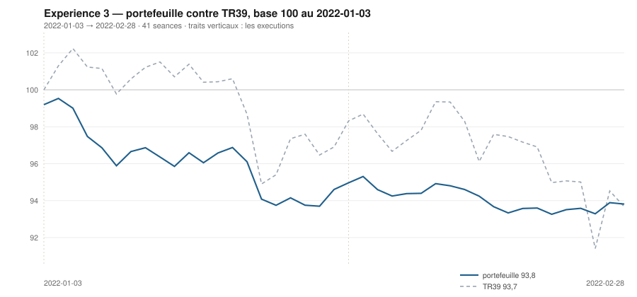

| | |
|---|---|
| Dotation initiale | 10 000,00 € au 2022-01-03 |
| Titres au 2022-02-28 | 1 695,32 € |
| Espèces | 7 685,83 € |
| **Total** | **9 381,15 €** |
| Base 100 | **93,81** |
| TR39, même base | 93,67 |
| Écart depuis janvier | **+0,14 pt** |

### Toutes les positions depuis le début de l'expérience

> Closes comme ouvertes. Une position encore ouverte laisse les deux dernières colonnes vides. Aucune séance postérieure au 2022-02-28 n'entre dans ce tableau.

| Société | Prix d'achat | Date d'achat | Prix de vente | Date de vente |
|---|---|---|---|---|
| `CAP.PA` Capgemini | 194,20 € | 2022-01-03 |  |  |
| `DSY.PA` Dassault Systèmes | 50,13 € | 2022-01-03 | 41,05 € | 2022-02-01 |

*2 positions depuis le début, dont 1 encore ouverte : les deux dernières colonnes restent vides.*

## 5. L'étude chartiste au 2022-01-31

> Notes rédigées sans aucune séance postérieure au 2022-01-31, par l'agent `chartiste`. Cinq lignes au plus par société, **chacune sous la figure de décision qui la justifie** — celle que la règle a lue ce jour-là, portant les cinq critères, les vetos et le verdict.

### 1. `DG.PA` — Vinci

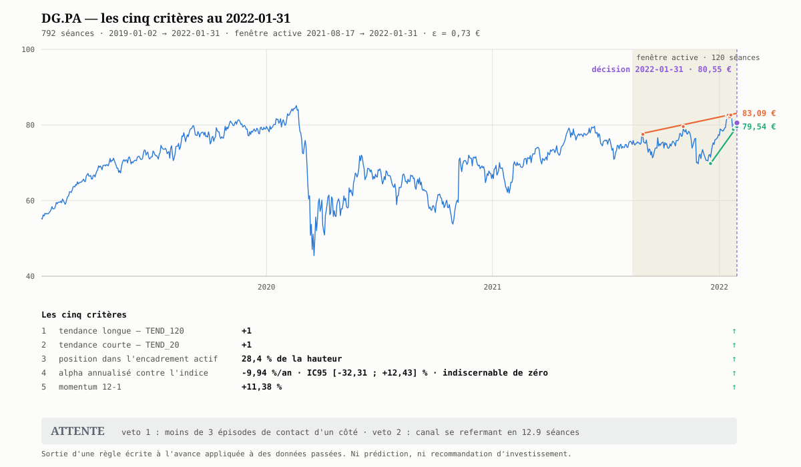

- Canal 79,54 – 83,09 €, large de 3,5 %, clôture à 80,55 € à 28,4 % de la hauteur.
- Support +0,325 contre résistance +0,050 €/séance : **les droites se croisent dans 13 séances**, veto 2 — bien avant la décision suivante.
- Deux contacts en support seulement : veto 1 s'ajoute. La position lue dans un canal aussi éphémère ne s'appuie sur rien.
- Momentum +11,4 %, alpha −9,9 %/an.

### 2. `SAN.PA` — Sanofi

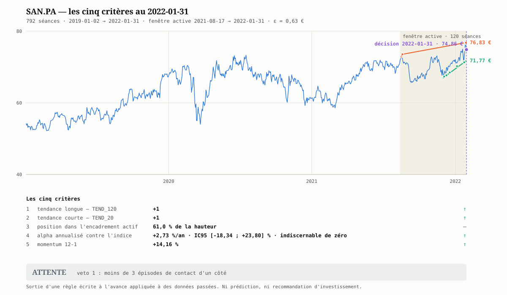

- Canal 71,77 – 76,83 €, clôture à 74,86 € à 61,0 %, juste sous le seuil de 65 %.
- Support +0,114, résistance +0,029 €/séance, τ de 59 séances.
- Cinq contacts en support, deux en résistance : veto 1.
- Momentum +14,2 %, alpha +2,7 %/an — nul.

### 3. `CA.PA` — Carrefour

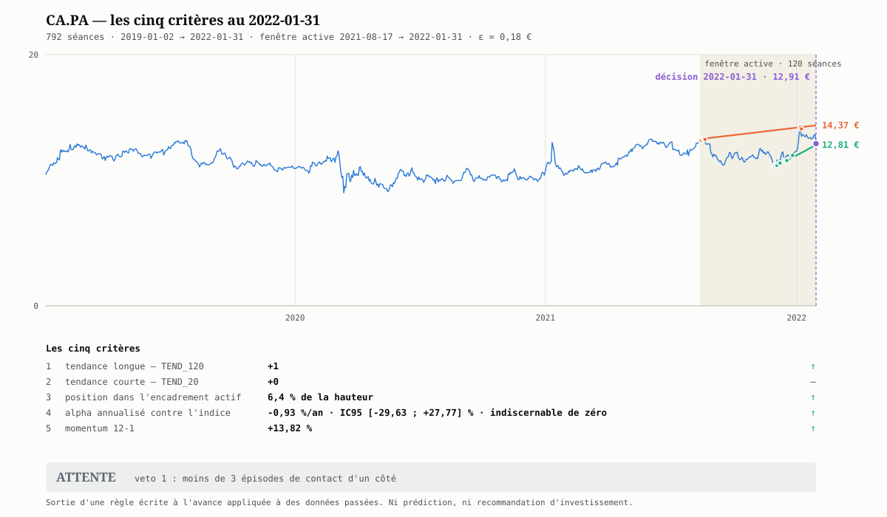

- Canal 12,81 – 14,37 €, clôture à 12,91 € à 6,4 % : le bas de la figure, à dix centimes du support.
- Pentes +0,042 et +0,009 €/séance, convergence, τ de 48 séances.
- Quatre contacts bas, deux hauts : veto 1 sur la résistance.
- Momentum +13,8 %, alpha −0,9 %/an, IC95 de 57 points de large.

### 4. `GLE.PA` — Société Générale

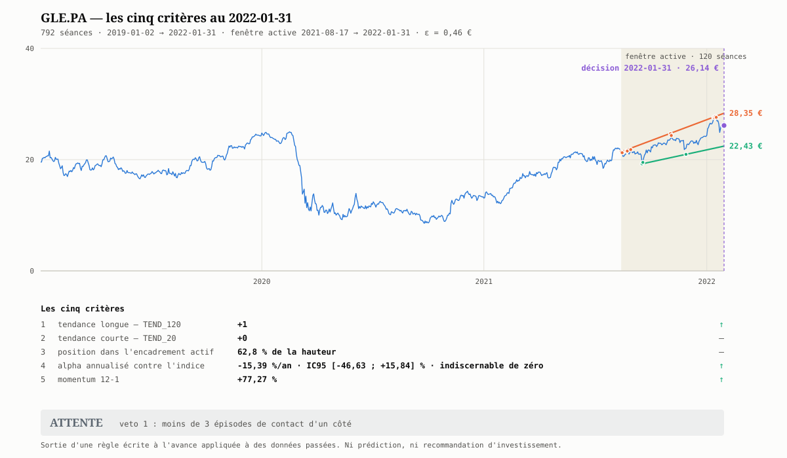

- Canal 22,43 – 28,35 €, clôture à 26,14 € à 62,8 %.
- Pentes +0,034 et +0,058 €/séance : le canal s'ouvre, τ infini.
- Deux contacts en support : veto 1.
- **Momentum +77,3 %, le plus fort de l'univers** — pour un alpha de −15,4 %/an.

### 5. `RMS.PA` — Hermès International

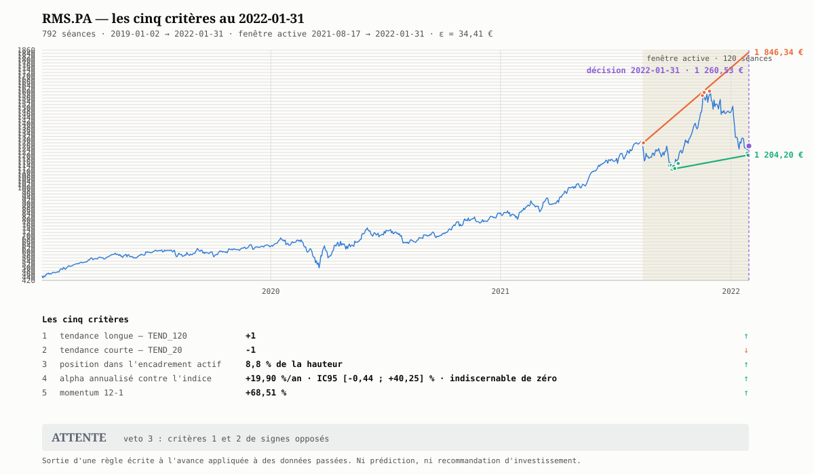

- Canal 1 204,20 – 1 846,34 €, d'une largeur de 642 € — la figure la plus étirée de la date —, clôture à 1 260,53 € à 8,8 %.
- Support +1,035 contre résistance +4,794 €/séance : ouverture rapide, τ infini.
- Trois contacts de chaque côté ; veto 3.
- Momentum +68,5 %, alpha +19,9 %/an, IC95 de −0,4 à +40,2 : à quatre dixièmes de la significativité.

### 6. `CAP.PA` — Capgemini

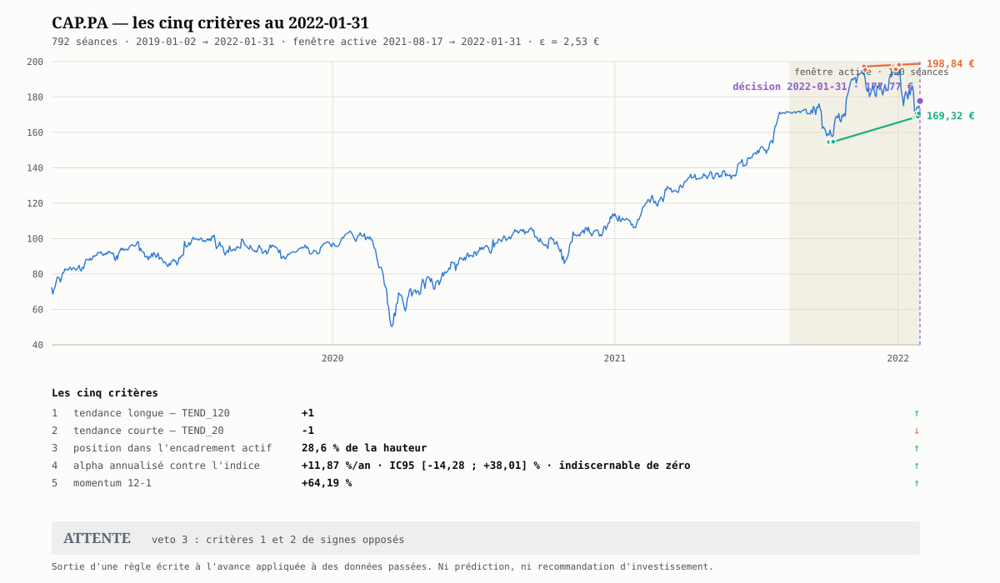

- Canal 169,32 – 198,84 €, clôture à 177,77 € à 28,6 % de la hauteur.
- Support +0,185 contre résistance +0,031 €/séance, τ de 192 séances.
- Trois contacts de chaque côté, aucun veto 1 ; mais tendances de signes opposés, veto 3.
- Momentum +64,2 %, le deuxième de la date ; alpha +11,9 %/an.

### 7. `VIE.PA` — Veolia

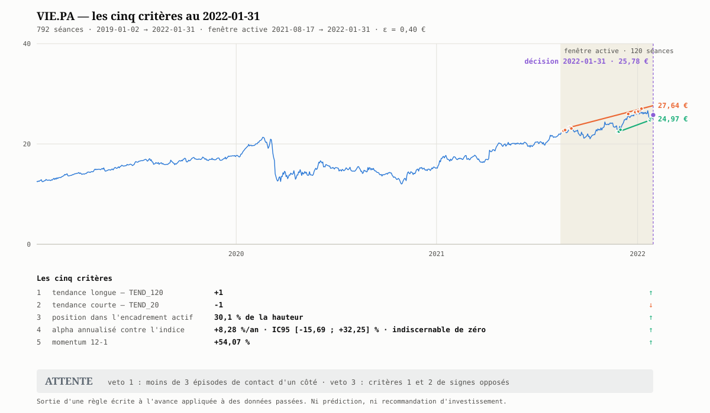

- Canal 24,97 – 27,64 €, clôture à 25,78 € à 30,1 %.
- Pentes +0,057 et +0,041 €/séance, convergence lente, τ de 160 séances.
- Deux contacts en support contre six en résistance : veto 1 ; tendances opposées : veto 3.
- Momentum +54,1 %, alpha +8,3 %/an.

### 8. `MT.AS` — ArcelorMittal

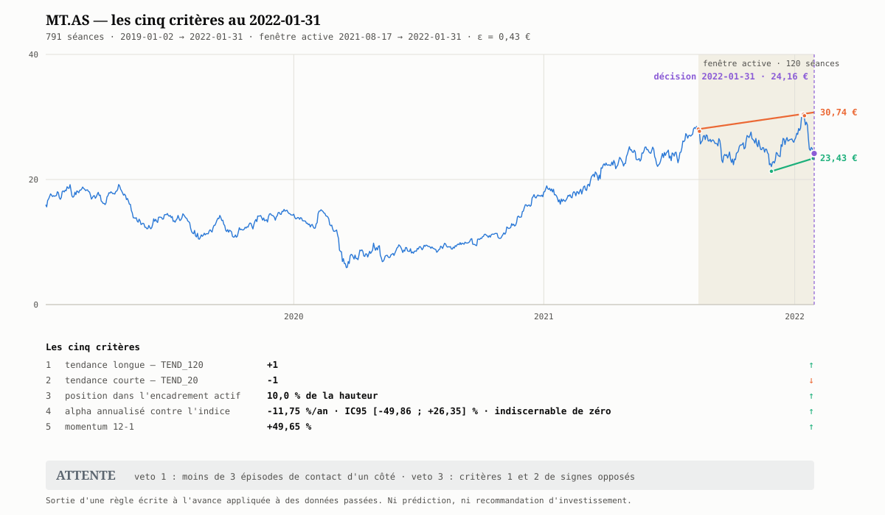

- Canal 23,43 – 30,74 €, clôture à 24,16 € à 10,0 % : le dixième bas.
- Pentes +0,048 et +0,022 €/séance, τ de 288 séances.
- Deux contacts de chaque côté : veto 1 ; tendances opposées : veto 3.
- Momentum +49,6 %, alpha −11,8 %/an avec un IC95 de 76 points.

### 9. `BNP.PA` — BNP Paribas

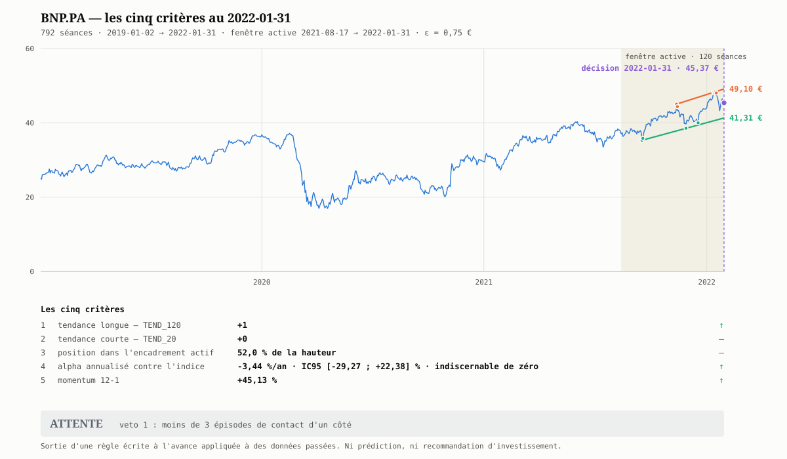

- Canal 41,31 – 49,10 €, large de 7,8 %, clôture à 45,37 € à 52,0 % : le milieu exact.
- Pentes +0,063 et +0,074 €/séance : divergence, τ infini.
- Deux contacts en résistance : veto 1.
- **Momentum +45,1 %** pour un alpha de −3,4 %/an : la hausse est celle du secteur.

### 10. `SU.PA` — Schneider Electric

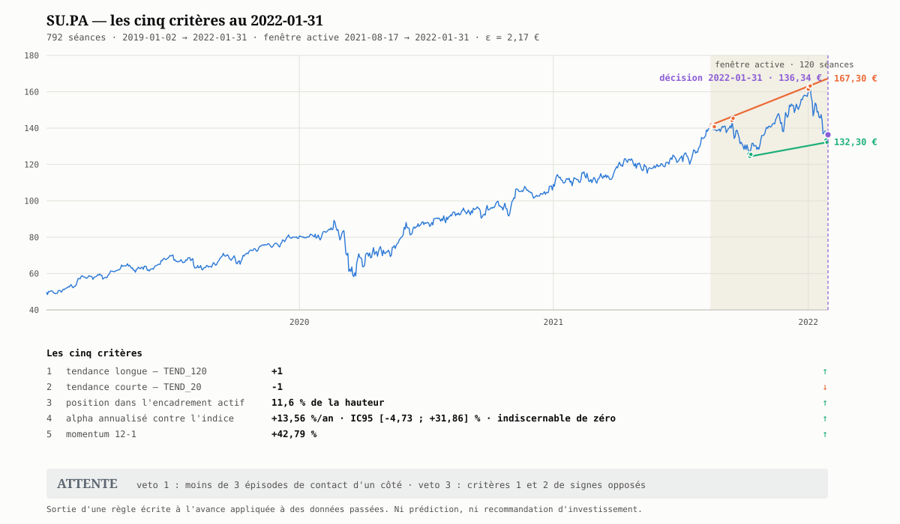

- Canal 132,30 – 167,30 €, clôture à 136,34 € à 11,6 % : contre le support.
- Support +0,100 contre résistance +0,216 €/séance : divergence, τ infini.
- Deux contacts en support : veto 1 ; tendances opposées : veto 3.
- Momentum +42,8 %, alpha +13,6 %/an, IC95 de −4,7 à +31,9.

### 11. `EL.PA` — EssilorLuxottica

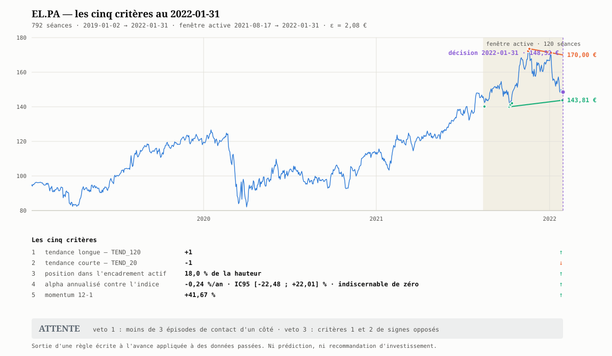

- Canal 143,81 – 170,00 €, clôture à 148,52 € à 18,0 % : le cinquième bas.
- Support +0,048, résistance −0,071 €/séance : convergence, τ de 221 séances.
- Deux contacts en résistance : veto 1 ; tendances opposées : veto 3.
- Momentum +41,7 %, alpha −0,2 %/an, exactement nul.

### 12. `TTE.PA` — TotalEnergies

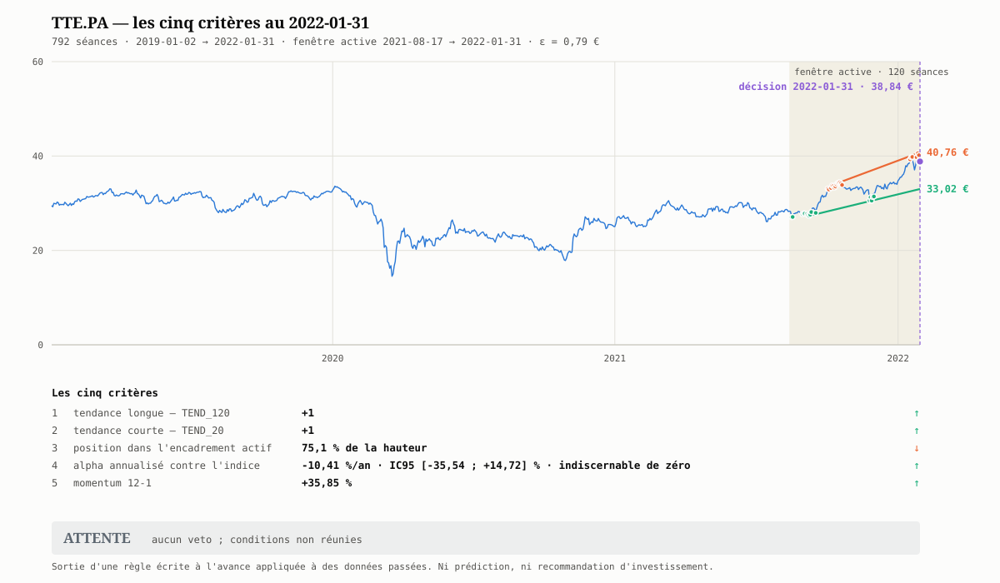

- Canal 33,02 – 40,76 €, clôture à 38,84 € à 75,1 % de la hauteur.
- Pentes +0,056 et +0,086 €/séance : le canal s'ouvre, τ infini.
- Quatre contacts bas, trois hauts : **aucun veto**, seule valeur de score +4 dans ce cas.
- Momentum +35,9 % pour un alpha de −10,4 %/an.

### 13. `STLAP.PA` — Stellantis

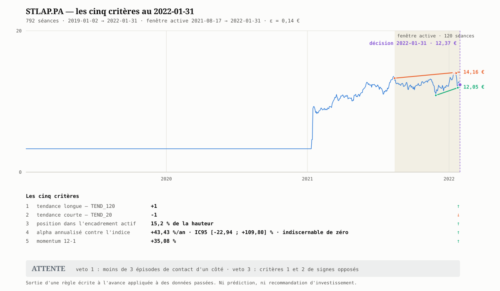

- **Première date où Stellantis entre dans l'univers** : elle vient d'atteindre les 253 séances de volume non nul qu'exige le momentum 12-1.
- Canal 12,05 – 14,16 €, clôture à 12,37 € à 15,2 % de la hauteur.
- Pentes +0,027 et +0,007 €/séance, τ de 108 séances ; deux contacts de chaque côté : veto 1, plus le veto 3.
- Momentum +35,1 % et alpha +43,4 %/an — le plus élevé de la date, mais sur un IC95 de 133 points, c'est-à-dire rien.

### 14. `OR.PA` — L'Oréal

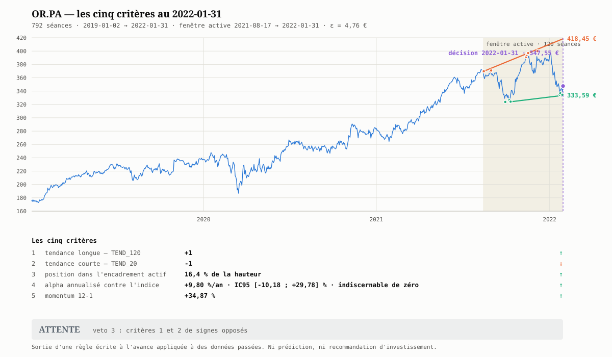

- Canal 333,59 – 418,45 €, très large — 84,9 € —, clôture à 347,55 € à 16,4 %.
- Support +0,123 contre résistance +0,413 €/séance : le canal s'ouvre, τ infini.
- Trois et quatre contacts, figure lisible ; veto 3.
- Momentum +34,9 %, alpha +9,8 %/an.

### 15. `LR.PA` — Legrand

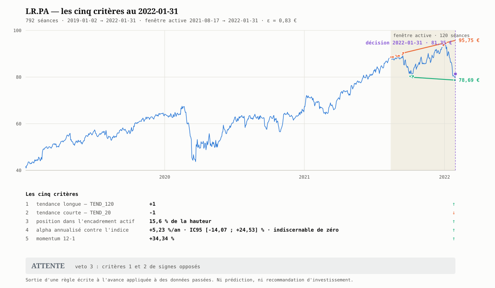

- Canal 78,69 – 95,75 €, clôture à 81,35 € à 15,6 % : contre le support.
- Support −0,015 contre résistance +0,056 €/séance : divergence, τ infini.
- Trois contacts bas, six hauts : figure lisible des deux côtés ; veto 3 seul.
- Momentum +34,3 %, alpha +5,2 %/an.

### 16. `ACA.PA` — Crédit Agricole

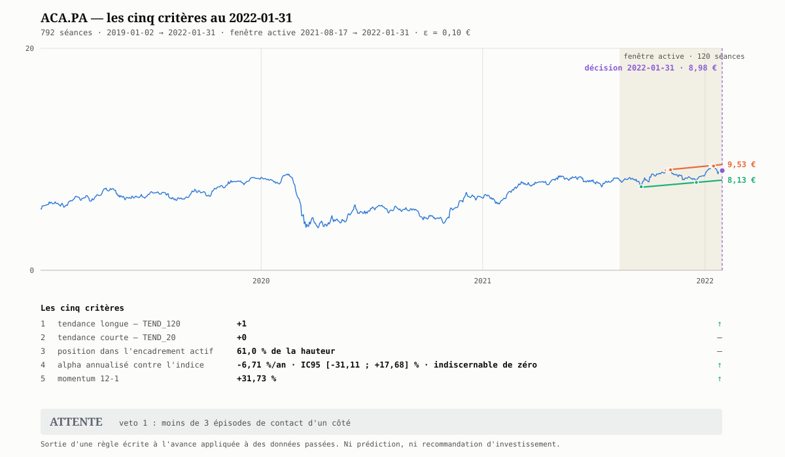

- Canal 8,13 – 9,53 €, clôture à 8,98 € à 61,0 % de la hauteur.
- Deux droites montantes de même pente, +0,007 : canal parallèle, τ infini.
- Deux contacts de chaque côté : veto 1, la figure repose sur quatre points.
- Momentum +31,7 %, alpha −6,7 %/an.

### 17. `RI.PA` — Pernod Ricard

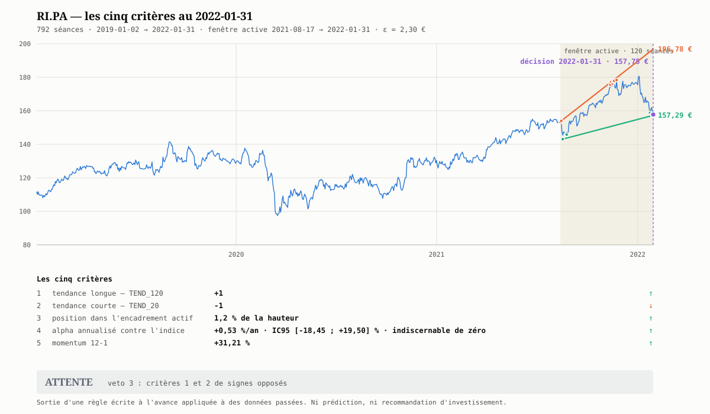

- Canal 157,29 – 196,78 €, clôture à 157,75 € à **1,2 % de la hauteur** : quasiment sur le support.
- Pentes +0,122 et +0,363 €/séance : divergence marquée, τ infini.
- Trois contacts de chaque côté ; veto 3 seul.
- Momentum +31,2 %, alpha +0,5 %/an.

### 18. `KER.PA` — Kering

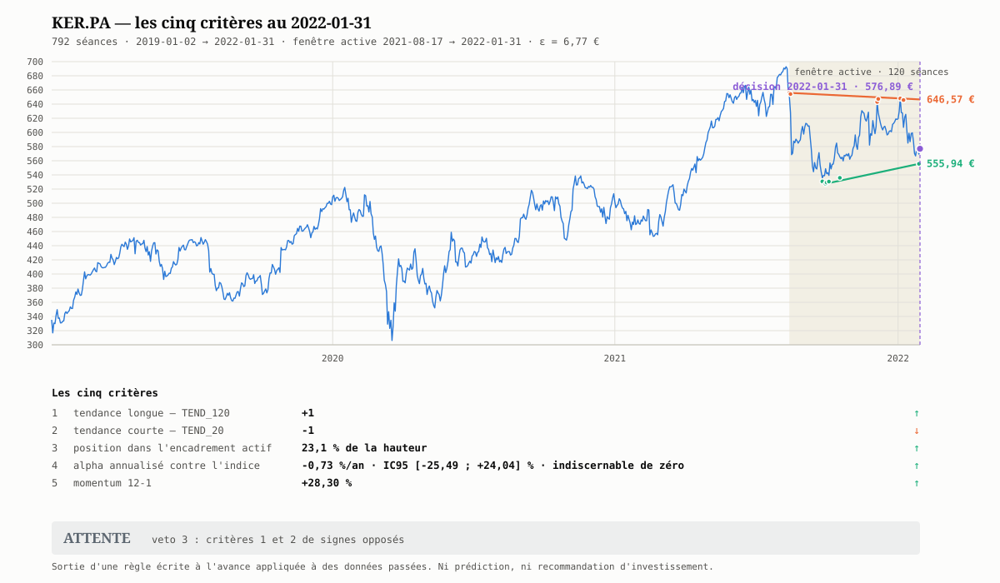

- Canal 555,94 – 646,57 €, large de 90,6 €, clôture à 576,89 € à 23,1 % de la hauteur.
- Support +0,330 contre résistance −0,078 €/séance, τ de 222 séances.
- Quatre contacts de chaque côté : la figure est bien étayée ; seul le veto 3 se déclenche.
- Momentum +28,3 %, alpha −0,7 %/an.

### 19. `ML.PA` — Michelin

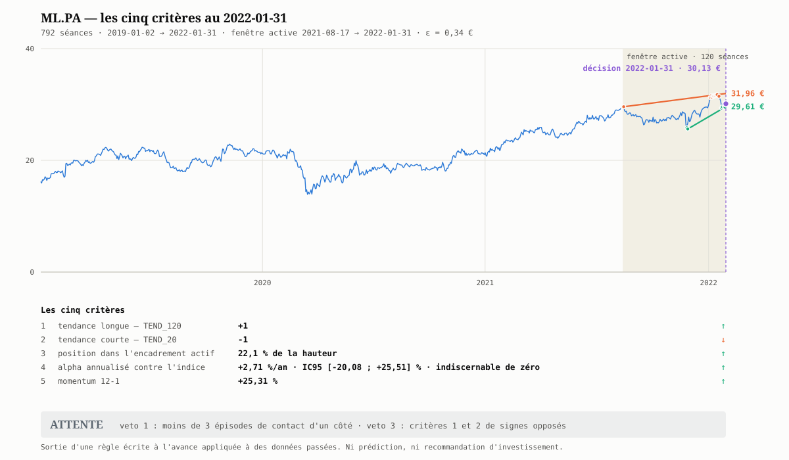

- Canal 29,61 – 31,96 €, clôture à 30,13 € à 22,1 %.
- Pentes +0,091 et +0,020 €/séance, τ de 33 séances : le canal se referme avant deux mois.
- Deux contacts de chaque côté : veto 1 ; tendances opposées : veto 3.
- Momentum +25,3 %, alpha +2,7 %/an.

### 20. `AI.PA` — Air Liquide

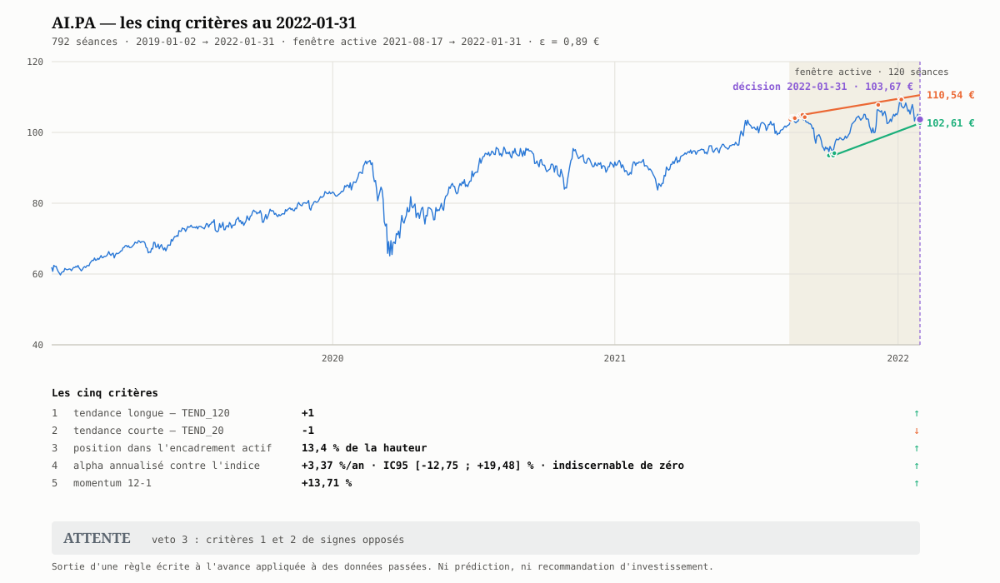

- Canal 102,61 – 110,54 €, clôture à 103,67 € à 13,4 % : contre le support.
- Pentes +0,116 et +0,052 €/séance, τ de 125 séances.
- Trois et quatre épisodes : figure lisible, mais tendance longue positive contre courte négative — veto 3.
- Momentum +13,7 %, alpha +3,4 %/an.
- Les niveaux en euros de cette série portent les attributions gratuites de 2024 et 2026.

### 21. `CS.PA` — AXA

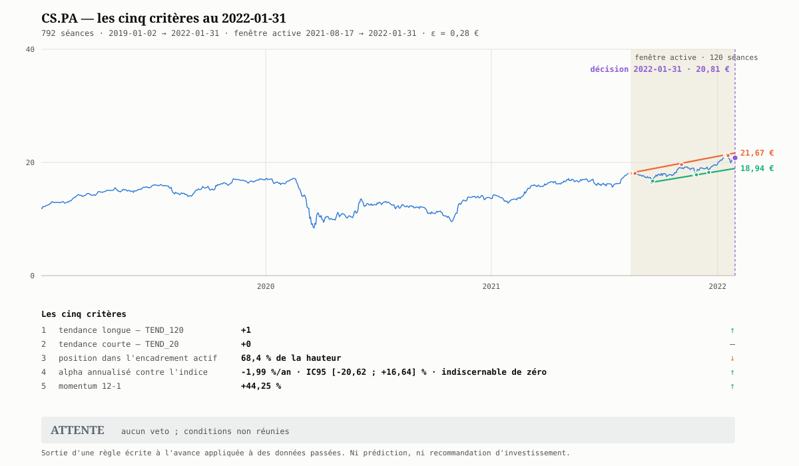

- Canal 18,94 – 21,67 €, clôture à 20,81 € à 68,4 %, juste au-dessus du seuil haut.
- Pentes +0,026 et +0,030 €/séance, divergence imperceptible, τ infini.
- Trois contacts de chaque côté : **aucun veto**.
- Momentum +44,2 %, alpha −2,0 %/an.

### 22. `MC.PA` — LVMH

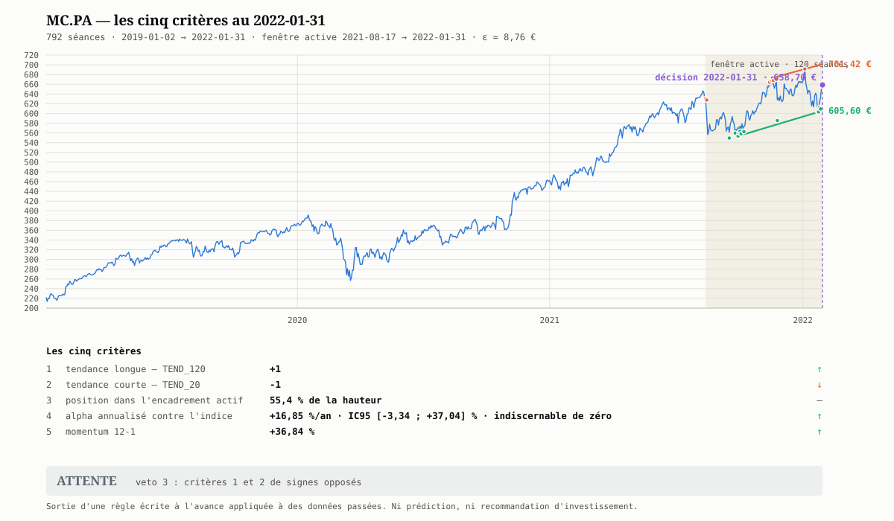

- Canal 605,60 – 701,42 €, clôture à 658,70 € à 55,4 % de la hauteur.
- Pentes +0,604 et +0,555 €/séance, quasi parallèles : τ de 1 958 séances.
- Six contacts en support, quatre en résistance — la figure la mieux étayée de la date ; seul le veto 3 mord.
- Momentum +36,8 %, alpha +16,9 %/an, IC95 de −3,3 à +37,0.

### 23. `PUB.PA` — Publicis

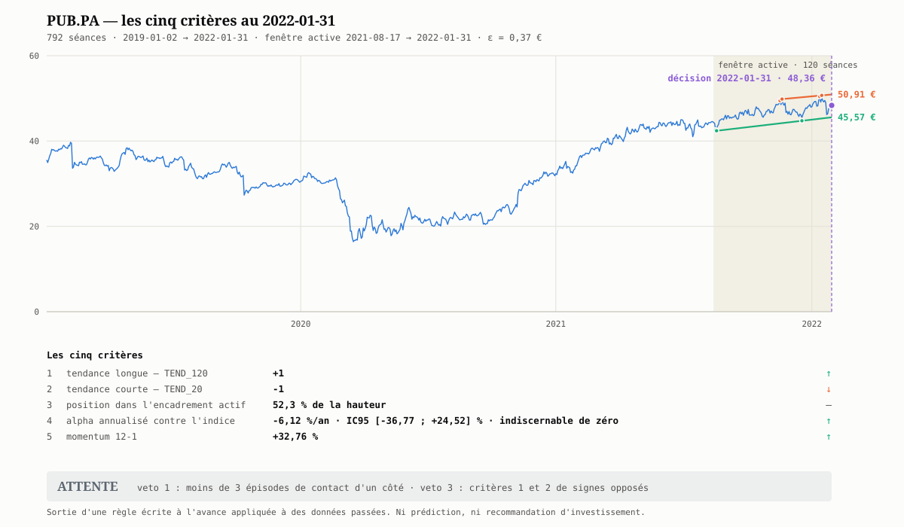

- Canal 45,57 – 50,91 €, clôture à 48,36 € à 52,3 % : le milieu.
- Pentes +0,027 et +0,021 €/séance, τ de 913 séances : le canal survivra largement à l'année.
- Deux contacts de chaque côté : veto 1 ; tendances opposées : veto 3.
- Momentum +32,8 %, alpha −6,1 %/an.

### 24. `STMPA.PA` — STMicroelectronics

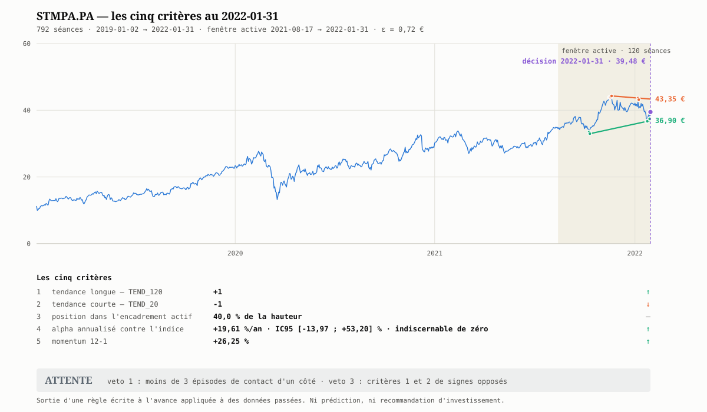

- Canal 36,90 – 43,35 €, clôture à 39,48 € à 40,0 % de la hauteur.
- Support +0,050 contre résistance −0,019 €/séance, τ de 93 séances.
- Deux contacts en résistance : veto 1 ; tendances opposées : veto 3.
- Momentum +26,2 %, alpha +19,6 %/an sur un IC95 de 67 points.

### 25. `ORA.PA` — Orange

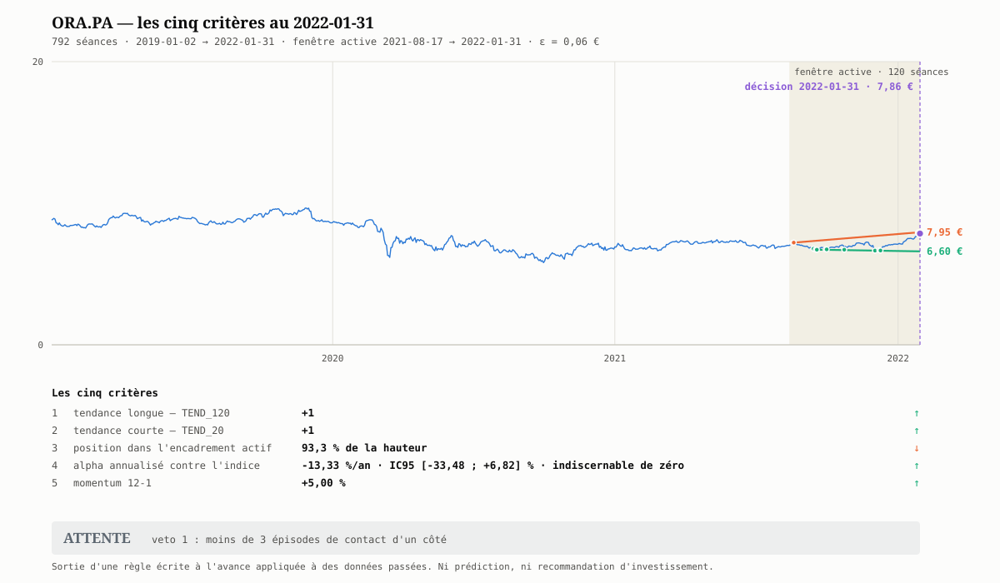

- Canal 6,60 – 7,95 €, clôture à 7,86 € à 93,3 % : sous le plafond.
- Support −0,001, résistance +0,006 €/séance : divergence, τ infini.
- Cinq contacts bas, deux hauts : veto 1.
- Momentum +5,0 %, alpha −13,3 %/an.

### 26. `ENGI.PA` — Engie

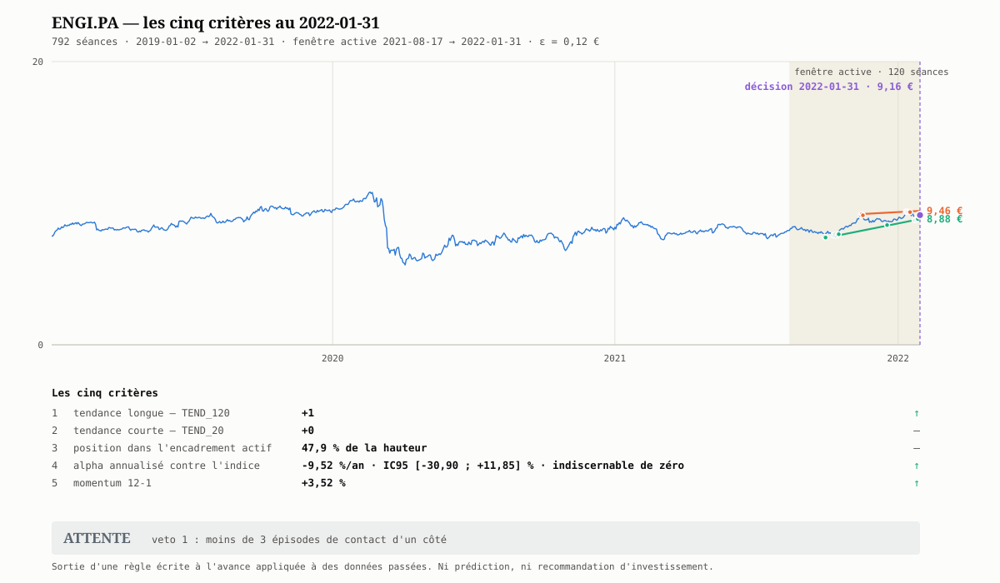

- Canal 8,88 – 9,46 €, large de 0,6 %, clôture à 9,16 € à 47,9 % : le milieu.
- Pentes +0,015 et +0,004 €/séance, τ de 51 séances.
- Quatre contacts bas, deux hauts : veto 1.
- Momentum de +3,5 % seulement ; alpha −9,5 %/an.

### 27. `SGO.PA` — Saint-Gobain

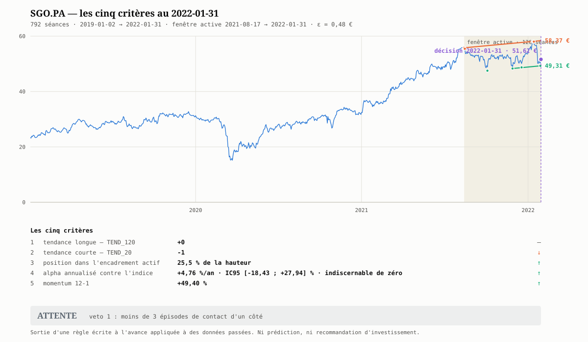

- Canal 49,31 – 58,37 €, clôture à 51,62 € à 25,5 %.
- Pentes +0,023 et +0,022 €/séance, presque identiques : τ de 7 622 séances, autant dire jamais.
- Quatre contacts bas, deux hauts : veto 1.
- Momentum +49,4 %, alpha +4,8 %/an.

### 28. `DSY.PA` — Dassault Systèmes

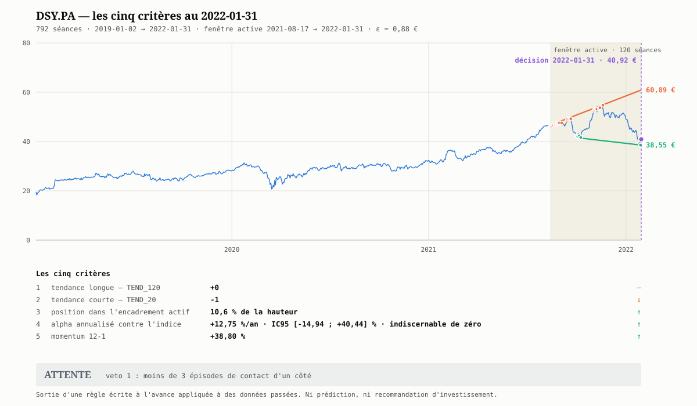

- Canal 38,55 – 60,89 €, clôture à 40,92 € à 10,6 % : le dixième bas.
- Support −0,036 contre résistance +0,120 €/séance : le canal s'ouvre, τ infini.
- Deux contacts en support : veto 1.
- Momentum +38,8 %, alpha +12,8 %/an ; la tendance longue est passée à zéro.

### 29. `TEP.PA` — Teleperformance

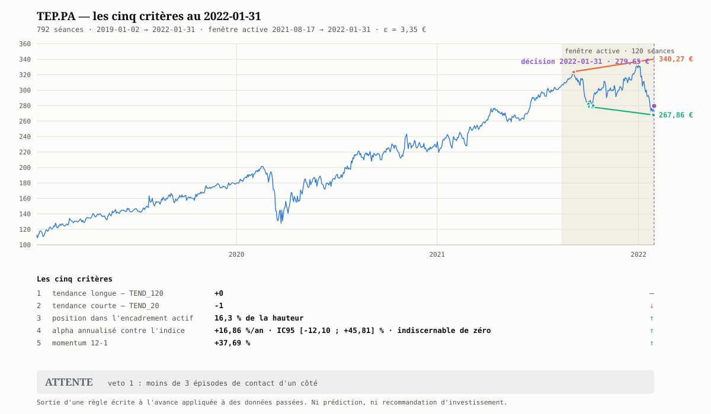

- Canal 267,86 – 340,27 €, clôture à 279,65 € à 16,3 % de la hauteur.
- Support −0,130 contre résistance +0,158 €/séance : divergence, τ infini.
- Deux contacts en résistance : veto 1.
- Momentum +37,7 %, alpha +16,9 %/an.

### 30. `ERF.PA` — Eurofins Scientific

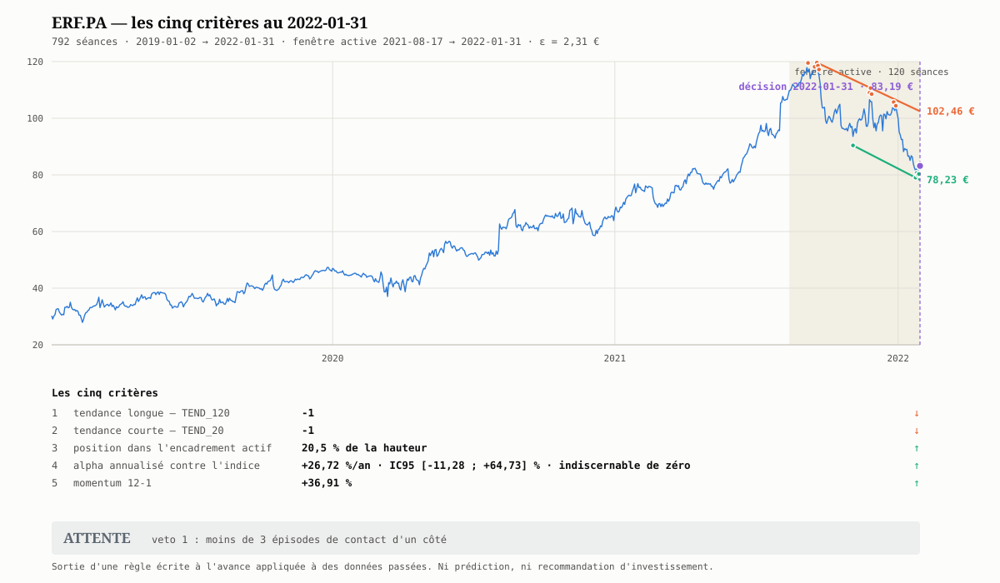

- Canal 78,23 – 102,46 €, clôture à 83,19 € à 20,5 %.
- Deux droites descendantes presque parallèles, −0,200 et −0,183 €/séance : τ infini.
- Deux contacts en support : veto 1.
- Momentum +36,9 %, alpha +26,7 %/an sur un IC95 de 76 points.

### 31. `AIR.PA` — Airbus

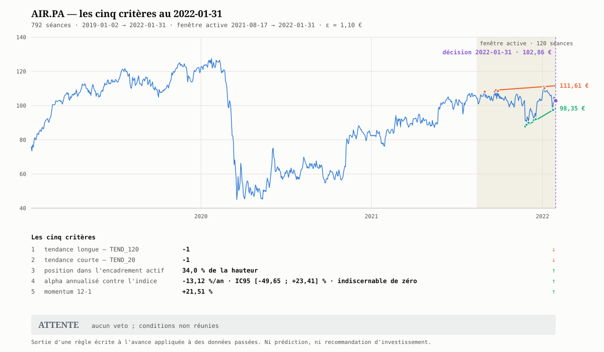

- Canal 98,35 – 111,61 €, clôture à 102,86 € à 34,0 %, juste sous le seuil de 35 %.
- Support +0,229 contre résistance +0,028 €/séance, τ de 66 séances.
- Cinq contacts bas, quatre hauts : **aucun veto**, la figure la mieux certifiée de la date.
- Mais les deux tendances sont négatives ; momentum +21,5 %, alpha −13,1 %/an.

### 32. `VIV.PA` — Vivendi

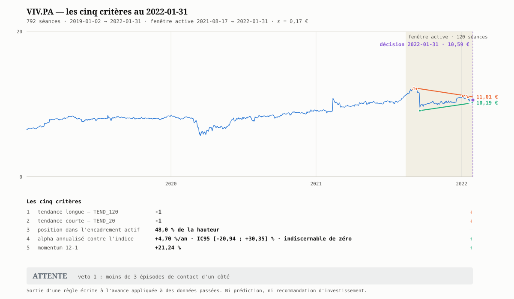

- Canal 10,19 – 11,01 €, large de 0,8 %, clôture à 10,59 € à 48,0 % : le milieu.
- Pentes +0,011 et −0,012 €/séance, τ de 35 séances.
- Deux contacts en support : veto 1.
- Momentum +21,2 %, alpha +4,7 %/an ; les deux tendances sont négatives.

### 33. `HO.PA` — Thales

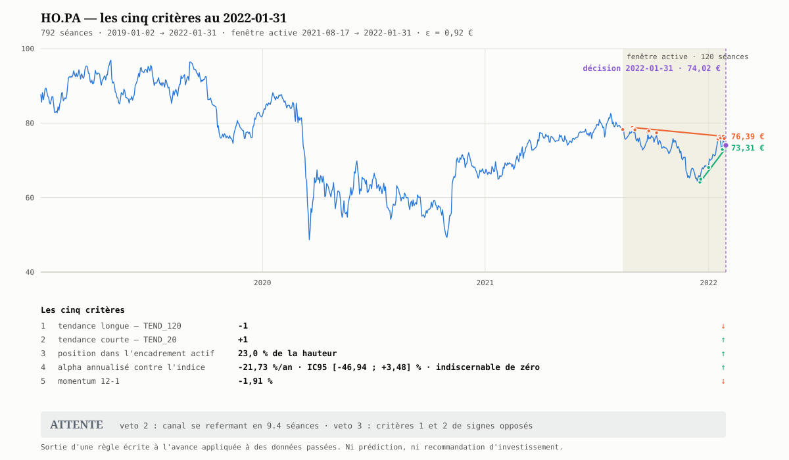

- Canal 73,31 – 76,39 €, large de 3,1 %, clôture à 74,02 € à 23,0 % de la hauteur.
- Support +0,307 contre résistance −0,022 €/séance : **le canal se referme en 9 séances**, veto 2 — le plus court de la date.
- Tendances de signes opposés : veto 3. Quatre et six contacts pourtant, la figure est étayée mais périmée.
- Momentum −1,9 %, alpha −21,7 %/an.

### 34. `RNO.PA` — Renault

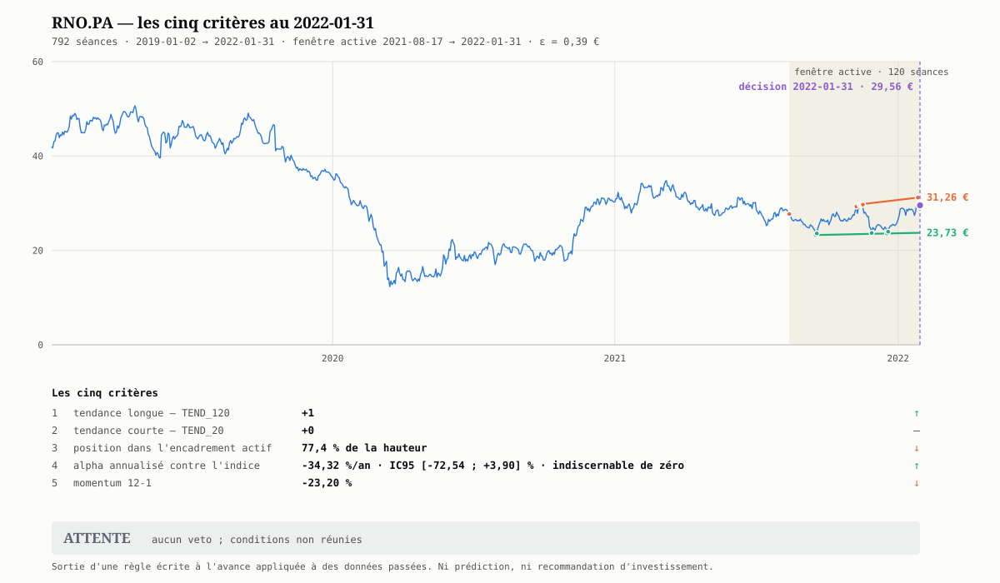

- Canal 23,73 – 31,26 €, clôture à 29,56 € à 77,4 %.
- Pentes +0,005 et +0,028 €/séance : divergence, τ infini.
- Trois et quatre contacts : **aucun veto**.
- **Momentum −23,2 %** et alpha −34,3 %/an : la valeur la plus en retard de la date.

### 35. `BN.PA` — Danone

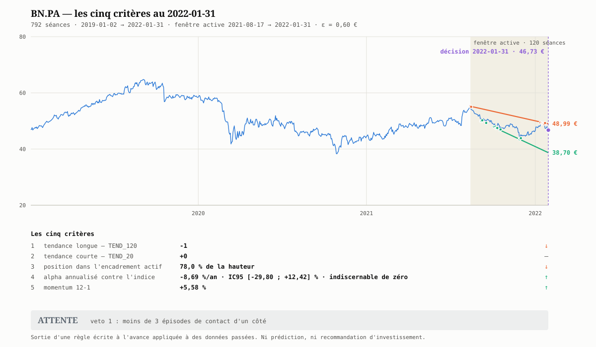

- Canal 38,70 – 48,99 €, clôture à 46,73 € à 78,0 % de la hauteur.
- Deux droites descendantes, −0,109 et −0,052 €/séance : divergence, τ infini.
- Cinq contacts bas, deux hauts : veto 1.
- Momentum +5,6 %, alpha −8,7 %/an.

### 36. `SAF.PA` — Safran

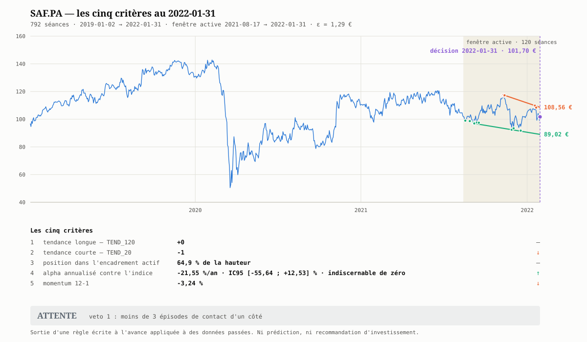

- Canal 89,02 – 108,56 €, clôture à 101,70 € à 64,9 % — un dixième sous le seuil haut.
- Pentes −0,077 et −0,158 €/séance, τ de 241 séances.
- Huit contacts en support, deux en résistance : veto 1, comme le mois dernier.
- Momentum −3,2 %, alpha −21,6 %/an.

### 37. `ALO.PA` — Alstom

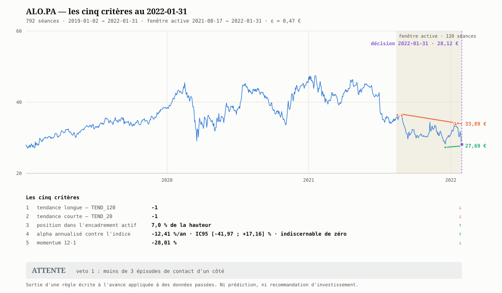

- Canal 27,69 – 33,89 €, clôture à 28,12 € à 7,0 % : contre le support.
- Support +0,013 contre résistance −0,025 €/séance, τ de 163 séances.
- Deux contacts en support : veto 1.
- **Momentum −28,0 %**, alpha −12,4 %/an ; les deux tendances sont négatives.

### 38. `WLN.PA` — Worldline

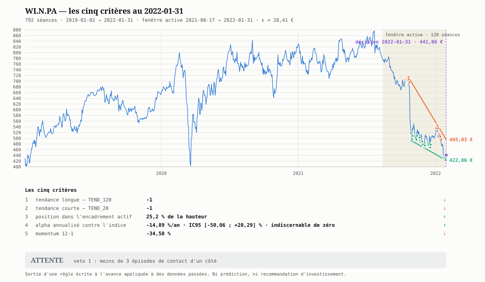

- Canal 422,86 – 495,03 €, clôture à 441,06 € à 25,2 % de la hauteur.
- Deux droites en chute, −1,048 et −3,089 €/séance, convergentes : τ de 35 séances.
- Cinq contacts bas, deux hauts : veto 1.
- **Momentum −34,5 %**, le plus faible de l'univers ; alpha −14,9 %/an.

### 39. `EN.PA` — Bouygues

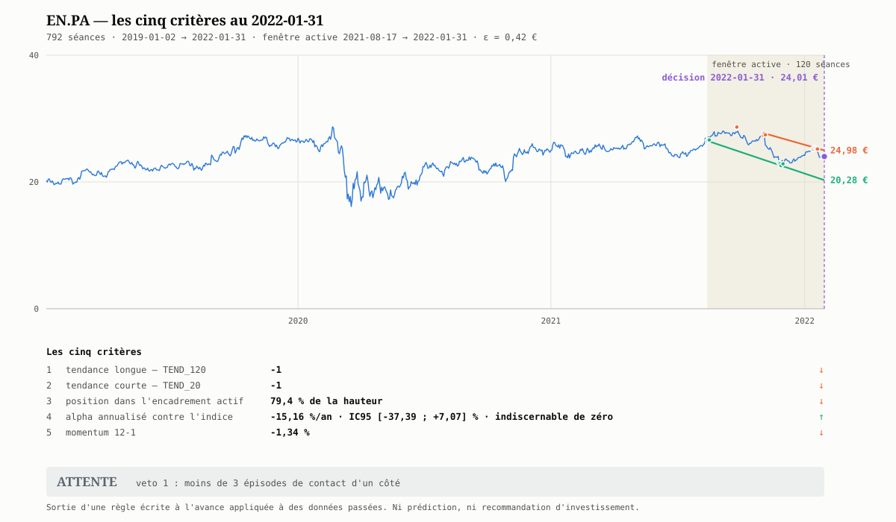

- Canal 20,28 – 24,98 €, clôture à 24,01 € à 79,4 %.
- Deux droites descendantes, −0,052 et −0,044 €/séance : divergence, τ infini.
- Deux contacts en support : veto 1.
- Momentum −1,3 %, alpha −15,2 %/an ; les deux tendances sont négatives.

## 6. Le classement au 2022-01-31

> De la valeur la plus intéressante à détenir à celle qu'il faut fuir. La colonne **τ** donne la date de péremption du canal en séances, la colonne **Vetos** les numéros déclenchés. Une valeur sous veto ne peut pas être achetée.

| Rang | Valeur | `s1` | `s2` | `s3` | `s4` | `s5` | Score | Position | Momentum | τ | Vetos |
|---|---|---|---|---|---|---|---|---|---|---|---|
| 1 | `DG.PA` Vinci | +2 | +1 | +1 | +2 | +0 | **+6** | 28,4 % | +11,4 % | 12,9 | 1 2 |
| 2 | `SAN.PA` Sanofi | +2 | +1 | +0 | +2 | +0 | **+5** | 61,0 % | +14,2 % | 59,1 | 1 |
| 3 | `CA.PA` Carrefour | +2 | +0 | +1 | +2 | +0 | **+5** | 6,4 % | +13,8 % | 48,1 | 1 |
| 4 | `GLE.PA` Société Générale | +2 | +0 | +0 | +2 | +0 | **+4** | 62,8 % | +77,3 % | ∞ | 1 |
| 5 | `RMS.PA` Hermès International | +2 | -1 | +1 | +2 | +0 | **+4** | 8,8 % | +68,5 % | ∞ | 3 |
| 6 | `CAP.PA` Capgemini | +2 | -1 | +1 | +2 | +0 | **+4** | 28,6 % | +64,2 % | 192,0 | 3 |
| 7 | `VIE.PA` Veolia | +2 | -1 | +1 | +2 | +0 | **+4** | 30,1 % | +54,1 % | 160,4 | 1 3 |
| 8 | `MT.AS` ArcelorMittal | +2 | -1 | +1 | +2 | +0 | **+4** | 10,0 % | +49,6 % | 287,9 | 1 3 |
| 9 | `BNP.PA` BNP Paribas | +2 | +0 | +0 | +2 | +0 | **+4** | 52,0 % | +45,1 % | ∞ | 1 |
| 10 | `SU.PA` Schneider Electric | +2 | -1 | +1 | +2 | +0 | **+4** | 11,6 % | +42,8 % | ∞ | 1 3 |
| 11 | `EL.PA` EssilorLuxottica | +2 | -1 | +1 | +2 | +0 | **+4** | 18,0 % | +41,7 % | 221,1 | 1 3 |
| 12 | `TTE.PA` TotalEnergies | +2 | +1 | -1 | +2 | +0 | **+4** | 75,1 % | +35,9 % | ∞ | — |
| 13 | `STLAP.PA` Stellantis | +2 | -1 | +1 | +2 | +0 | **+4** | 15,2 % | +35,1 % | 108,4 | 1 3 |
| 14 | `OR.PA` L'Oréal | +2 | -1 | +1 | +2 | +0 | **+4** | 16,4 % | +34,9 % | ∞ | 3 |
| 15 | `LR.PA` Legrand | +2 | -1 | +1 | +2 | +0 | **+4** | 15,6 % | +34,3 % | ∞ | 3 |
| 16 | `ACA.PA` Crédit Agricole | +2 | +0 | +0 | +2 | +0 | **+4** | 61,0 % | +31,7 % | ∞ | 1 |
| 17 | `RI.PA` Pernod Ricard | +2 | -1 | +1 | +2 | +0 | **+4** | 1,2 % | +31,2 % | ∞ | 3 |
| 18 | `KER.PA` Kering | +2 | -1 | +1 | +2 | +0 | **+4** | 23,1 % | +28,3 % | 221,9 | 3 |
| 19 | `ML.PA` Michelin | +2 | -1 | +1 | +2 | +0 | **+4** | 22,1 % | +25,3 % | 33,2 | 1 3 |
| 20 | `AI.PA` Air Liquide | +2 | -1 | +1 | +2 | +0 | **+4** | 13,4 % | +13,7 % | 124,5 | 3 |
| 21 | `CS.PA` AXA | +2 | +0 | -1 | +2 | +0 | **+3** | 68,4 % | +44,2 % | ∞ | — |
| 22 | `MC.PA` LVMH | +2 | -1 | +0 | +2 | +0 | **+3** | 55,4 % | +36,8 % | 1 958,3 | 3 |
| 23 | `PUB.PA` Publicis | +2 | -1 | +0 | +2 | +0 | **+3** | 52,3 % | +32,8 % | 913,1 | 1 3 |
| 24 | `STMPA.PA` STMicroelectronics | +2 | -1 | +0 | +2 | +0 | **+3** | 40,0 % | +26,2 % | 93,4 | 1 3 |
| 25 | `ORA.PA` Orange | +2 | +1 | -1 | +1 | +0 | **+3** | 93,3 % | +5,0 % | ∞ | 1 |
| 26 | `ENGI.PA` Engie | +2 | +0 | +0 | +1 | +0 | **+3** | 47,9 % | +3,5 % | 50,9 | 1 |
| 27 | `SGO.PA` Saint-Gobain | +0 | -1 | +1 | +2 | +0 | **+2** | 25,5 % | +49,4 % | 7 621,8 | 1 |
| 28 | `DSY.PA` Dassault Systèmes | +0 | -1 | +1 | +2 | +0 | **+2** | 10,6 % | +38,8 % | ∞ | 1 |
| 29 | `TEP.PA` Teleperformance | +0 | -1 | +1 | +2 | +0 | **+2** | 16,3 % | +37,7 % | ∞ | 1 |
| 30 | `ERF.PA` Eurofins Scientific | -2 | -1 | +1 | +2 | +0 | **+0** | 20,5 % | +36,9 % | ∞ | 1 |
| 31 | `AIR.PA` Airbus | -2 | -1 | +1 | +2 | +0 | **+0** | 34,0 % | +21,5 % | 66,2 | — |
| 32 | `VIV.PA` Vivendi | -2 | -1 | +0 | +2 | +0 | **-1** | 48,0 % | +21,2 % | 35,2 | 1 |
| 33 | `HO.PA` Thales | -2 | +1 | +1 | -1 | +0 | **-1** | 23,0 % | -1,9 % | 9,4 | 2 3 |
| 34 | `RNO.PA` Renault | +2 | +0 | -1 | -2 | +0 | **-1** | 77,4 % | -23,2 % | ∞ | — |
| 35 | `BN.PA` Danone | -2 | +0 | -1 | +1 | +0 | **-2** | 78,0 % | +5,6 % | ∞ | 1 |
| 36 | `SAF.PA` Safran | +0 | -1 | +0 | -1 | +0 | **-2** | 64,9 % | -3,2 % | 241,4 | 1 |
| 37 | `ALO.PA` Alstom | -2 | -1 | +1 | -2 | +0 | **-4** | 7,0 % | -28,0 % | 162,7 | 1 |
| 38 | `WLN.PA` Worldline | -2 | -1 | +1 | -2 | +0 | **-4** | 25,2 % | -34,5 % | 35,4 | 1 |
| 39 | `EN.PA` Bouygues | -2 | -1 | -1 | -1 | +0 | **-5** | 79,4 % | -1,3 % | ∞ | 1 |

## 7. Les ordres exécutés au 2022-02-01

> À l'**ouverture** de la séance, jamais à la clôture du 2022-01-31.

| Sens | Valeur | Quantité | Prix d'exécution | Brut | Frais | Motif |
|---|---|---|---|---|---|---|
| **Vente** | `DSY.PA` Dassault Systèmes | 39 | 41,05 € | 1 600,78 € | 1,84 € | rang 28 au-dela de 7 |

## 8. La lecture du mois

Sur le mois, la meilleure contribution vient de `DSY.PA` (Dassault Systèmes) pour **+3,05 €**, la moins bonne de `CAP.PA` (Capgemini) pour **-82,38 €**. Les 1 ordres du mois ont coûté **1,84 €** de frais, soit 0,018 % de la dotation initiale. Le portefeuille termine le mois **devant TR39** de 2,51 point. Sur les 46 thèses du mois précédent qui ont pu être tranchées, **14 sont confirmées** — 30,4 %.

## 9. Les thèses écrites au 2022-01-31

> Elles seront dépouillées à la prochaine date de décision, dans le fichier du mois suivant. Elles sont engendrées mécaniquement par les règles du [protocole](../README.md#le-registre-des-thèses-réfutables) — aucune n'est rédigée à la main.

| Valeur | Thèse | Énoncé, à dépouiller au mois suivant |
|---|---|---|
| `ACA.PA` | Canal | clôture entre 8,27 € et 9,68 € au 2022-02-28 |
| `ACA.PA` | Reflexive | AUCUNE SEQUENCE : écart contre TR39 dans ± 7,13 pt (σ̂), au 2022-02-28 |
| `AI.PA` | Canal | clôture entre 104,93 € et 111,58 € au 2022-02-28 |
| `AIR.PA` | Canal | clôture entre 102,92 € et 112,18 € au 2022-02-28 |
| `ALO.PA` | Canal | clôture entre 27,95 € et 33,39 € au 2022-02-28 |
| `ALO.PA` | Reflexive | RETOURNEMENT : écart contre TR39 au-dessous de −3,60 pt (0,5 σ̂), au 2022-02-28 |
| `BN.PA` | Canal | clôture entre 36,52 € et 47,94 € au 2022-02-28 |
| `BNP.PA` | Canal | clôture entre 42,57 € et 50,58 € au 2022-02-28 |
| `BNP.PA` | Reflexive | AUCUNE SEQUENCE : écart contre TR39 dans ± 7,40 pt (σ̂), au 2022-02-28 |
| `CA.PA` | Canal | clôture entre 13,64 € et 14,55 € au 2022-02-28 |
| `CAP.PA` | Canal | clôture entre 173,01 € et 199,46 € au 2022-02-28 |
| `CS.PA` | Canal | clôture entre 19,46 € et 22,26 € au 2022-02-28 |
| `CS.PA` | Reflexive | AUCUNE SEQUENCE : écart contre TR39 dans ± 4,76 pt (σ̂), au 2022-02-28 |
| `DG.PA` | Canal | encadrement ferme avant le 2022-02-28 : les bornes prolongees se croisent, la thèse est inconfirmable à l'écriture |
| `DSY.PA` | Canal | clôture entre 37,84 € et 63,29 € au 2022-02-28 |
| `EL.PA` | Canal | clôture entre 144,77 € et 168,59 € au 2022-02-28 |
| `EN.PA` | Canal | clôture entre 19,24 € et 24,10 € au 2022-02-28 |
| `ENGI.PA` | Canal | clôture entre 9,19 € et 9,54 € au 2022-02-28 |
| `ERF.PA` | Canal | clôture entre 74,24 € et 98,80 € au 2022-02-28 |
| `ERF.PA` | Reflexive | RETOURNEMENT : écart contre TR39 au-dessous de −4,98 pt (0,5 σ̂), au 2022-02-28 |
| `GLE.PA` | Canal | clôture entre 23,10 € et 29,52 € au 2022-02-28 |
| `GLE.PA` | Reflexive | AUCUNE SEQUENCE : écart contre TR39 dans ± 9,46 pt (σ̂), au 2022-02-28 |
| `HO.PA` | Canal | encadrement ferme avant le 2022-02-28 : les bornes prolongees se croisent, la thèse est inconfirmable à l'écriture |
| `KER.PA` | Canal | clôture entre 562,55 € et 645,01 € au 2022-02-28 |
| `LR.PA` | Canal | clôture entre 78,38 € et 96,88 € au 2022-02-28 |
| `MC.PA` | Canal | clôture entre 617,68 € et 712,52 € au 2022-02-28 |
| `ML.PA` | Canal | clôture entre 31,43 € et 32,36 € au 2022-02-28 |
| `MT.AS` | Canal | clôture entre 24,39 € et 31,19 € au 2022-02-28 |
| `MT.AS` | Reflexive | AUCUNE SEQUENCE : écart contre TR39 dans ± 10,19 pt (σ̂), au 2022-02-28 |
| `OR.PA` | Canal | clôture entre 336,05 € et 426,71 € au 2022-02-28 |
| `ORA.PA` | Canal | clôture entre 6,57 € et 8,08 € au 2022-02-28 |
| `PUB.PA` | Canal | clôture entre 46,12 € et 51,34 € au 2022-02-28 |
| `RI.PA` | Canal | clôture entre 159,74 € et 204,03 € au 2022-02-28 |
| `RMS.PA` | Canal | clôture entre 1 224,90 € et 1 942,22 € au 2022-02-28 |
| `RNO.PA` | Canal | clôture entre 23,83 € et 31,81 € au 2022-02-28 |
| `SAF.PA` | Canal | clôture entre 87,48 € et 105,40 € au 2022-02-28 |
| `SAN.PA` | Canal | clôture entre 74,05 € et 77,40 € au 2022-02-28 |
| `SGO.PA` | Canal | clôture entre 49,76 € et 58,80 € au 2022-02-28 |
| `STLAP.PA` | Canal | clôture entre 12,59 € et 14,31 € au 2022-02-28 |
| `STMPA.PA` | Canal | clôture entre 37,90 € et 42,97 € au 2022-02-28 |
| `SU.PA` | Canal | clôture entre 134,29 € et 171,62 € au 2022-02-28 |
| `TEP.PA` | Canal | clôture entre 265,27 € et 343,43 € au 2022-02-28 |
| `TEP.PA` | Reflexive | AUCUNE SEQUENCE : écart contre TR39 dans ± 4,04 pt (σ̂), au 2022-02-28 |
| `TTE.PA` | Canal | clôture entre 34,15 € et 42,49 € au 2022-02-28 |
| `VIE.PA` | Canal | clôture entre 26,11 € et 28,45 € au 2022-02-28 |
| `VIV.PA` | Canal | clôture entre 10,42 € et 10,77 € au 2022-02-28 |
| `VIV.PA` | Reflexive | AUCUNE SEQUENCE : écart contre TR39 dans ± 6,41 pt (σ̂), au 2022-02-28 |
| `WLN.PA` | Canal | clôture entre 401,90 € et 433,26 € au 2022-02-28 |
| `WLN.PA` | Reflexive | RETOURNEMENT : écart contre TR39 au-dessous de −4,68 pt (0,5 σ̂), au 2022-02-28 |

---

[← Janvier](2022-01.md) · [Protocole](../README.md) · [Mars →](2022-03.md)
