# Mars 2022

> Journal de l'[expérience 3](../README.md) · **décision au 2022-02-28** · **exécution au 2022-03-01**
> Portefeuille au 2022-03-31 : **9 345,41 €** (base 93,45) · TR39 92,89 · alpha du mois **+0,45 pt** · depuis janvier **+0,56 pt**

---

## 1. Les actualités du mois précédent

**Février 2022.** L'invasion de l'Ukraine, le 24 février, coupe le mois en deux.
Les indices européens perdent en quelques séances ce qu'ils avaient mis des mois
à gagner ; le CAC 40 recule d'environ 5 % sur le mois après avoir touché
−10 % en séance. Les sanctions occidentales visent les banques russes, les
réserves de change et l'exclusion de plusieurs établissements de SWIFT.

Les matières premières s'envolent : le pétrole dépasse 100 dollars, le blé et le
nickel atteignent des sommets, le gaz européen double. Les valeurs exposées à la
Russie — énergie, automobile, banques — sont les plus frappées ; l'or et la
défense montent.

## 2. Le dépouillement des thèses écrites au 2022-01-31

> Piste **S4**. Ces énoncés ont été écrits le mois dernier, avant de connaître ce mois-ci. Aucun n'a été retouché ; le verdict est calculé.

| Valeur | Thèse | Énoncé | Constaté | Verdict |
|---|---|---|---|---|
| `ACA.PA` | Canal | clôture entre 8,27 € et 9,68 € au 2022-02-28 | 7,75 € | démentie |
| `ACA.PA` | Reflexive | AUCUNE SEQUENCE : écart contre TR39 dans ± 7,13 pt (σ̂), au 2022-02-28 | -10,32 pt | démentie |
| `AI.PA` | Canal | clôture entre 104,93 € et 111,58 € au 2022-02-28 | 101,83 € | démentie |
| `AIR.PA` | Canal | clôture entre 102,92 € et 112,18 € au 2022-02-28 | 105,41 € | **confirmée** |
| `ALO.PA` | Canal | clôture entre 27,95 € et 33,39 € au 2022-02-28 | 22,48 € | démentie |
| `ALO.PA` | Reflexive | RETOURNEMENT : écart contre TR39 au-dessous de −3,60 pt (0,5 σ̂), au 2022-02-28 | -16,73 pt | **confirmée** |
| `BN.PA` | Canal | clôture entre 36,52 € et 47,94 € au 2022-02-28 | 45,93 € | **confirmée** |
| `BNP.PA` | Canal | clôture entre 42,57 € et 50,58 € au 2022-02-28 | 37,81 € | démentie |
| `BNP.PA` | Reflexive | AUCUNE SEQUENCE : écart contre TR39 dans ± 7,40 pt (σ̂), au 2022-02-28 | -13,31 pt | démentie |
| `CA.PA` | Canal | clôture entre 13,64 € et 14,55 € au 2022-02-28 | 13,66 € | **confirmée** |
| `CAP.PA` | Canal | clôture entre 173,01 € et 199,46 € au 2022-02-28 | 169,53 € | démentie |
| `CS.PA` | Canal | clôture entre 19,46 € et 22,26 € au 2022-02-28 | 18,07 € | démentie |
| `CS.PA` | Reflexive | AUCUNE SEQUENCE : écart contre TR39 dans ± 4,76 pt (σ̂), au 2022-02-28 | -9,82 pt | démentie |
| `DG.PA` | Canal | encadrement ferme avant le 2022-02-28 : les bornes prolongees se croisent, la thèse est inconfirmable à l'écriture | 78,77 € | *inconfirmable à l'écriture* |
| `DSY.PA` | Canal | clôture entre 37,84 € et 63,29 € au 2022-02-28 | 41,92 € | **confirmée** |
| `EL.PA` | Canal | clôture entre 144,77 € et 168,59 € au 2022-02-28 | 139,52 € | démentie |
| `EN.PA` | Canal | clôture entre 19,24 € et 24,10 € au 2022-02-28 | 24,65 € | démentie |
| `ENGI.PA` | Canal | clôture entre 9,19 € et 9,54 € au 2022-02-28 | 9,64 € | démentie |
| `ERF.PA` | Canal | clôture entre 74,24 € et 98,80 € au 2022-02-28 | 84,84 € | **confirmée** |
| `ERF.PA` | Reflexive | RETOURNEMENT : écart contre TR39 au-dessous de −4,98 pt (0,5 σ̂), au 2022-02-28 | 5,34 pt | démentie |
| `GLE.PA` | Canal | clôture entre 23,10 € et 29,52 € au 2022-02-28 | 20,51 € | démentie |
| `GLE.PA` | Reflexive | AUCUNE SEQUENCE : écart contre TR39 dans ± 9,46 pt (σ̂), au 2022-02-28 | -18,21 pt | démentie |
| `HO.PA` | Canal | encadrement ferme avant le 2022-02-28 : les bornes prolongees se croisent, la thèse est inconfirmable à l'écriture | 93,53 € | *inconfirmable à l'écriture* |
| `KER.PA` | Canal | clôture entre 562,55 € et 645,01 € au 2022-02-28 | 560,01 € | démentie |
| `LR.PA` | Canal | clôture entre 78,38 € et 96,88 € au 2022-02-28 | 76,84 € | démentie |
| `MC.PA` | Canal | clôture entre 617,68 € et 712,52 € au 2022-02-28 | 601,55 € | démentie |
| `ML.PA` | Canal | clôture entre 31,43 € et 32,36 € au 2022-02-28 | 25,29 € | démentie |
| `MT.AS` | Canal | clôture entre 24,39 € et 31,19 € au 2022-02-28 | 25,55 € | **confirmée** |
| `MT.AS` | Reflexive | AUCUNE SEQUENCE : écart contre TR39 dans ± 10,19 pt (σ̂), au 2022-02-28 | 9,11 pt | **confirmée** |
| `OR.PA` | Canal | clôture entre 336,05 € et 426,71 € au 2022-02-28 | 327,40 € | démentie |
| `ORA.PA` | Canal | clôture entre 6,57 € et 8,08 € au 2022-02-28 | 8,16 € | démentie |
| `PUB.PA` | Canal | clôture entre 46,12 € et 51,34 € au 2022-02-28 | 48,31 € | **confirmée** |
| `RI.PA` | Canal | clôture entre 159,74 € et 204,03 € au 2022-02-28 | 163,30 € | **confirmée** |
| `RMS.PA` | Canal | clôture entre 1 224,90 € et 1 942,22 € au 2022-02-28 | 1 189,86 € | démentie |
| `RNO.PA` | Canal | clôture entre 23,83 € et 31,81 € au 2022-02-28 | 24,16 € | **confirmée** |
| `SAF.PA` | Canal | clôture entre 87,48 € et 105,40 € au 2022-02-28 | 109,40 € | démentie |
| `SAN.PA` | Canal | clôture entre 74,05 € et 77,40 € au 2022-02-28 | 75,44 € | **confirmée** |
| `SGO.PA` | Canal | clôture entre 49,76 € et 58,80 € au 2022-02-28 | 48,42 € | démentie |
| `STLAP.PA` | Canal | clôture entre 12,59 € et 14,31 € au 2022-02-28 | 11,94 € | démentie |
| `STMPA.PA` | Canal | clôture entre 37,90 € et 42,97 € au 2022-02-28 | 36,32 € | démentie |
| `SU.PA` | Canal | clôture entre 134,29 € et 171,62 € au 2022-02-28 | 127,60 € | démentie |
| `TEP.PA` | Canal | clôture entre 265,27 € et 343,43 € au 2022-02-28 | 278,39 € | **confirmée** |
| `TEP.PA` | Reflexive | AUCUNE SEQUENCE : écart contre TR39 dans ± 4,04 pt (σ̂), au 2022-02-28 | 2,89 pt | **confirmée** |
| `TTE.PA` | Canal | clôture entre 34,15 € et 42,49 € au 2022-02-28 | 35,26 € | **confirmée** |
| `VIE.PA` | Canal | clôture entre 26,11 € et 28,45 € au 2022-02-28 | 25,19 € | démentie |
| `VIV.PA` | Canal | clôture entre 10,42 € et 10,77 € au 2022-02-28 | 10,32 € | démentie |
| `VIV.PA` | Reflexive | AUCUNE SEQUENCE : écart contre TR39 dans ± 6,41 pt (σ̂), au 2022-02-28 | 0,84 pt | **confirmée** |
| `WLN.PA` | Canal | clôture entre 401,90 € et 433,26 € au 2022-02-28 | 474,33 € | démentie |
| `WLN.PA` | Reflexive | RETOURNEMENT : écart contre TR39 au-dessous de −4,68 pt (0,5 σ̂), au 2022-02-28 | 10,89 pt | démentie |

## 3. L'exposition héritée au 2022-02-28

| Valeur | Achetée le | Prix d'achat | +/− value | Alpha du mois | Alpha global |
|---|---|---|---|---|---|
| `CAP.PA` Capgemini | 2022-01-03 | 194,20 € | **-12,70 %** | -1,29 pt | -6,37 pt |

## 4. Le portefeuille depuis le 2022-01-03

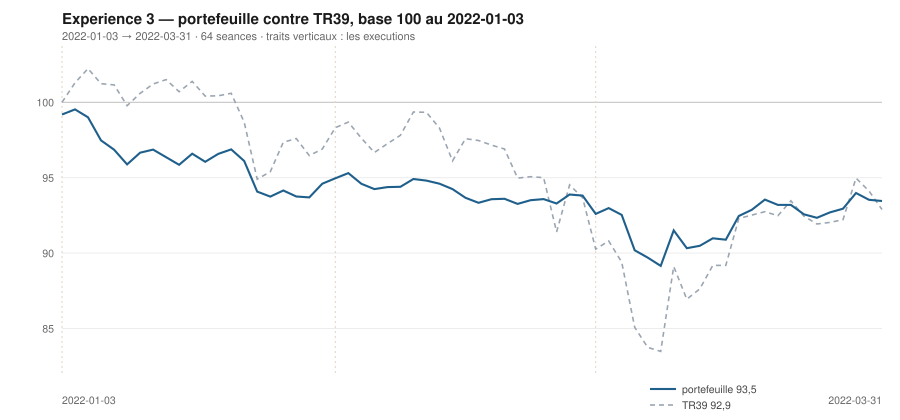

| | |
|---|---|
| Dotation initiale | 10 000,00 € au 2022-01-03 |
| Titres au 2022-03-31 | 3 341,29 € |
| Espèces | 6 004,13 € |
| **Total** | **9 345,41 €** |
| Base 100 | **93,45** |
| TR39, même base | 92,89 |
| Écart depuis janvier | **+0,56 pt** |

### Toutes les positions depuis le début de l'expérience

> Closes comme ouvertes. Une position encore ouverte laisse les deux dernières colonnes vides. Aucune séance postérieure au 2022-03-31 n'entre dans ce tableau.

| Société | Prix d'achat | Date d'achat | Prix de vente | Date de vente |
|---|---|---|---|---|
| `CAP.PA` Capgemini | 194,20 € | 2022-01-03 |  |  |
| `DSY.PA` Dassault Systèmes | 50,13 € | 2022-01-03 | 41,05 € | 2022-02-01 |
| `KER.PA` Kering | 558,25 € | 2022-03-01 |  |  |

*3 positions depuis le début, dont 2 encore ouvertes : les deux dernières colonnes restent vides.*

## 5. L'étude chartiste au 2022-02-28

> Notes rédigées sans aucune séance postérieure au 2022-02-28, par l'agent `chartiste`. Cinq lignes au plus par société, **chacune sous la figure de décision qui la justifie** — celle que la règle a lue ce jour-là, portant les cinq critères, les vetos et le verdict.

### 1. `PUB.PA` — Publicis

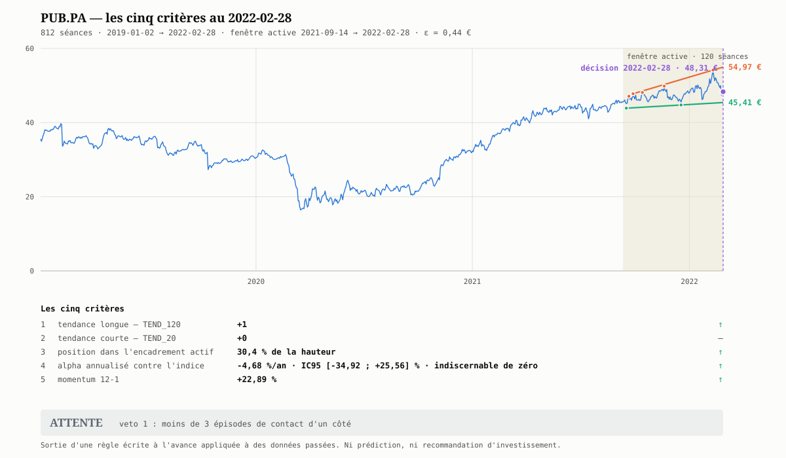

- Canal 45,41 – 54,97 €, clôture à 48,31 € à 30,4 % de la hauteur.
- Pentes +0,013 et +0,067 €/séance : divergence, τ infini.
- Deux contacts en support contre cinq en résistance : veto 1.
- Momentum +22,9 %, alpha −4,7 %/an.

### 2. `KER.PA` — Kering

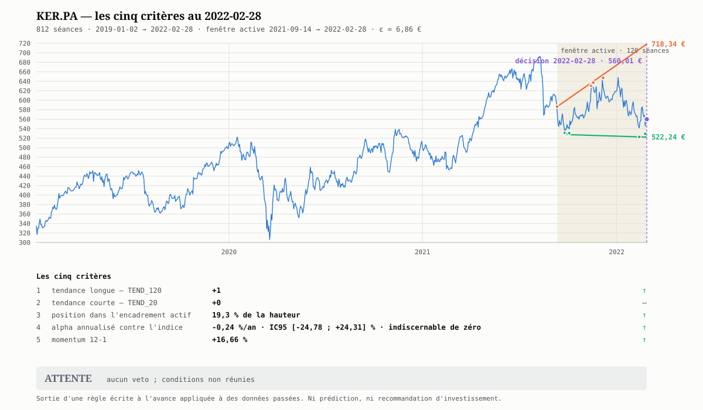

- Canal 522,24 – 718,34 €, large de 196 €, clôture à 560,01 € à 19,3 %.
- Support −0,050 contre résistance +1,107 €/séance : le canal s'ouvre franchement, τ infini.
- Quatre contacts bas, trois hauts : **aucun veto**.
- Momentum +16,7 %, alpha −0,2 %/an, rigoureusement nul.

### 3. `DG.PA` — Vinci

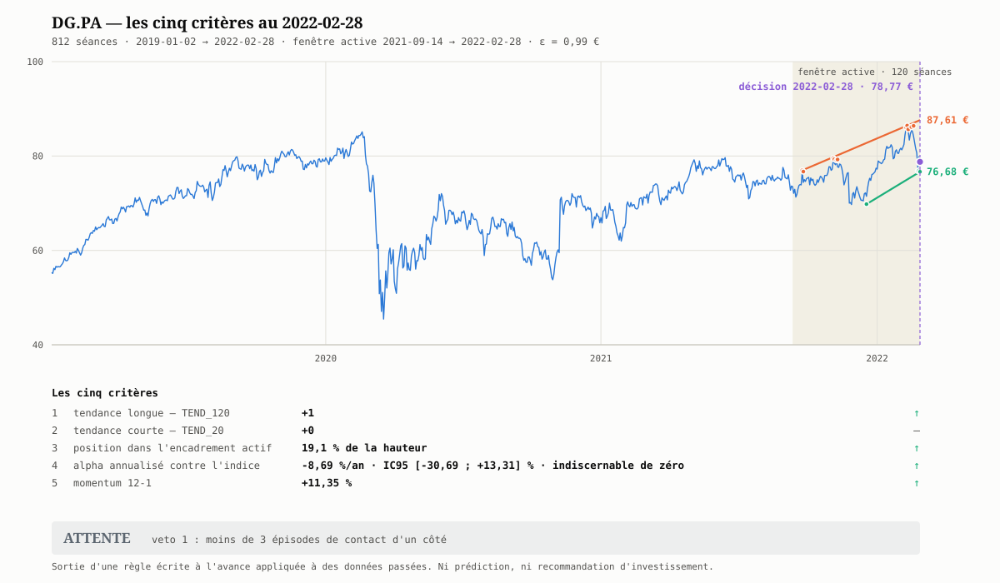

- Canal 76,68 – 87,61 €, clôture à 78,77 € à 19,1 % de la hauteur.
- Pentes +0,137 et +0,097 €/séance, convergence lente, τ de 270 séances — le veto 2 du mois dernier a disparu.
- Deux contacts en support : veto 1.
- Momentum +11,3 %, alpha −8,7 %/an.

### 4. `GLE.PA` — Société Générale

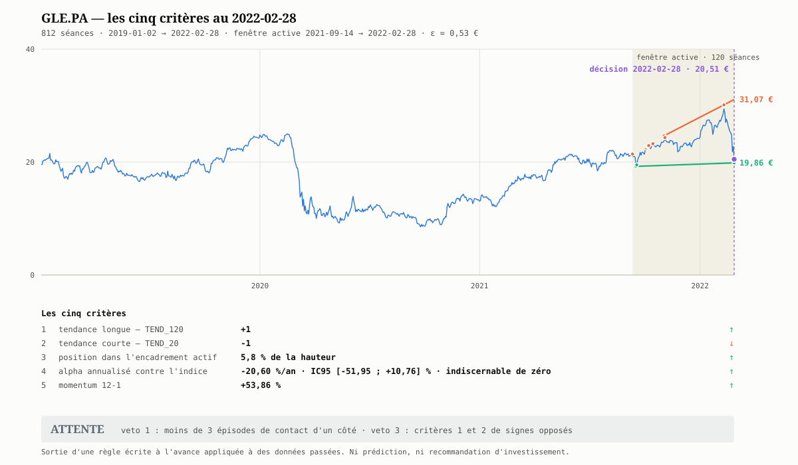

- Canal 19,86 – 31,07 €, clôture à 20,51 € à 5,8 % : contre le support.
- Support +0,005 contre résistance +0,078 €/séance : ouverture rapide, τ infini.
- Deux contacts en support : veto 1 ; tendances opposées : veto 3.
- **Momentum +53,9 %** pour un alpha de −20,6 %/an.

### 5. `VIE.PA` — Veolia

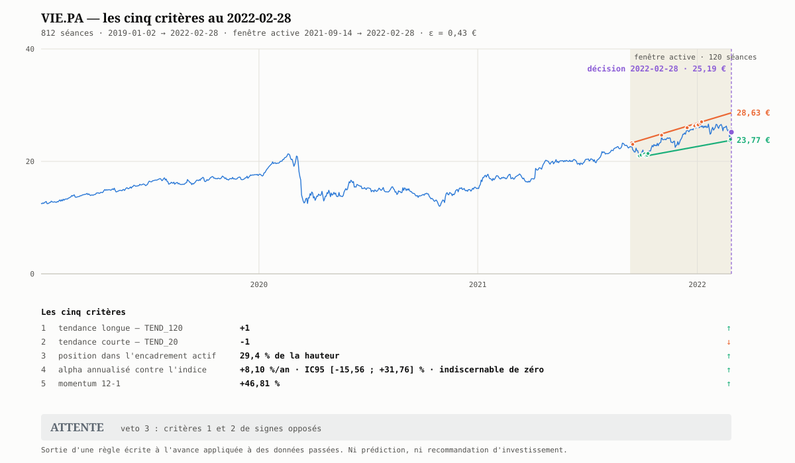

- Canal 23,77 – 28,63 €, clôture à 25,19 € à 29,4 %.
- Pentes +0,028 et +0,046 €/séance : ouverture, τ infini.
- Trois contacts bas, six hauts : figure lisible ; veto 3.
- Momentum +46,8 %, alpha +8,1 %/an.

### 6. `CAP.PA` — Capgemini

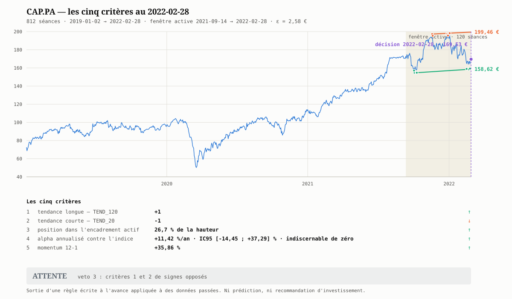

- Canal 158,62 – 199,46 €, clôture à 169,53 € à 26,7 % de la hauteur.
- Pentes +0,039 et +0,031 €/séance, quasi parallèles : τ de 4 839 séances.
- Quatre et trois contacts, figure lisible ; seul le veto 3 mord.
- Momentum +35,9 %, alpha +11,4 %/an.

### 7. `STMPA.PA` — STMicroelectronics

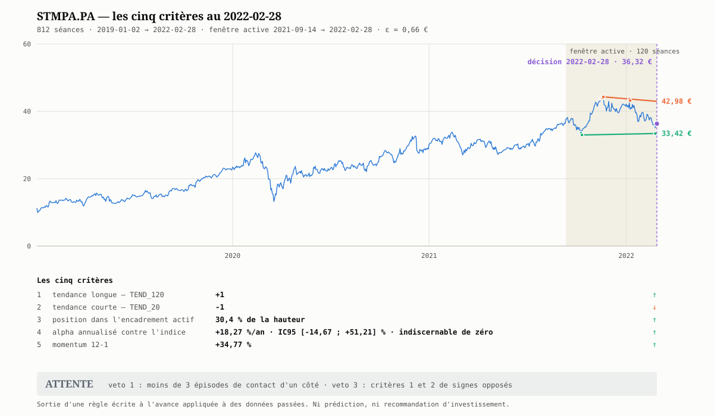

- Canal 33,42 – 42,98 €, clôture à 36,32 € à 30,4 % de la hauteur.
- Pentes +0,004 et −0,019 €/séance, τ de 410 séances.
- Deux contacts de chaque côté : veto 1 ; tendances opposées : veto 3.
- Momentum +34,8 %, alpha +18,3 %/an sur un IC95 de 66 points.

### 8. `TTE.PA` — TotalEnergies

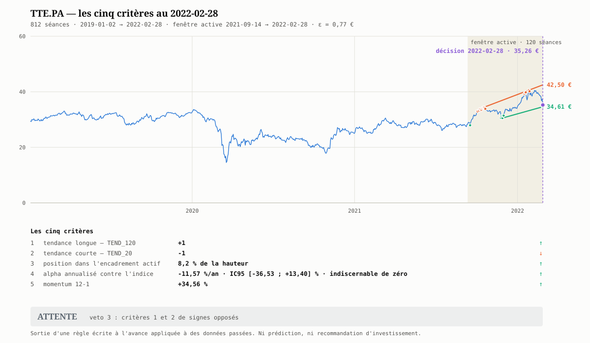

- Canal 34,61 – 42,50 €, clôture à 35,26 € à 8,2 % : contre le support.
- Pentes +0,064 et +0,086 €/séance : ouverture, τ infini.
- Trois contacts de chaque côté ; seul le veto 3 mord.
- Momentum +34,6 %, alpha −11,6 %/an.

### 9. `MC.PA` — LVMH

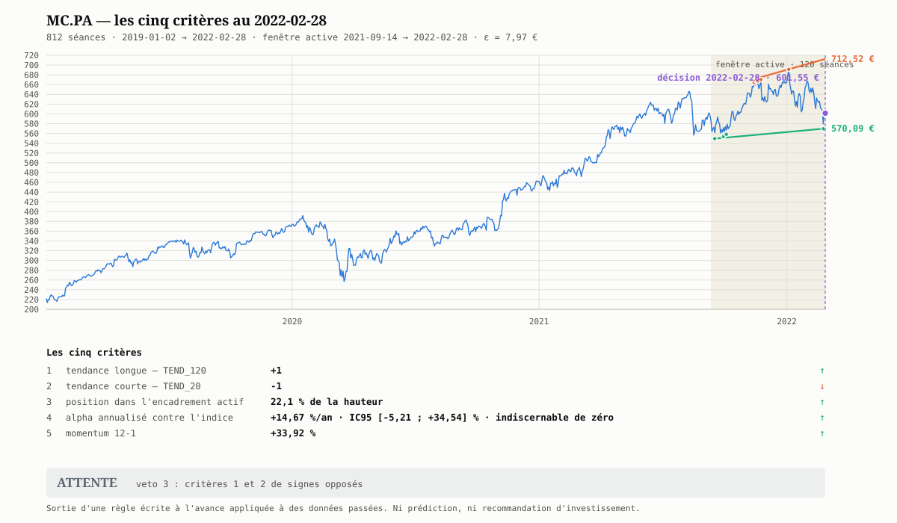

- Canal 570,09 – 712,52 €, clôture à 601,55 € à 22,1 % de la hauteur.
- Support +0,179 contre résistance +0,555 €/séance : le canal s'ouvre, τ infini.
- Quatre et trois contacts, figure lisible ; veto 3 seul.
- Momentum +33,9 %, alpha +14,7 %/an, IC95 de −5,2 à +34,5.

### 10. `CS.PA` — AXA

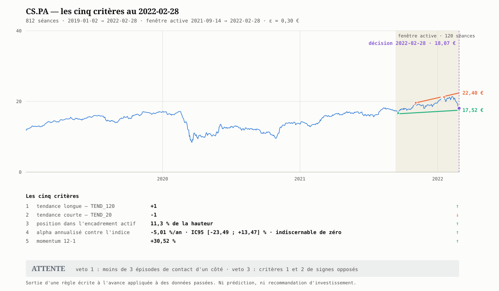

- Canal 17,52 – 22,40 €, clôture à 18,07 € à 11,3 % : le bas de la figure.
- Pentes +0,009 et +0,034 €/séance : ouverture, τ infini.
- Deux contacts de chaque côté : veto 1 ; tendances opposées : veto 3.
- Momentum +30,5 %, alpha −5,0 %/an.

### 11. `CA.PA` — Carrefour

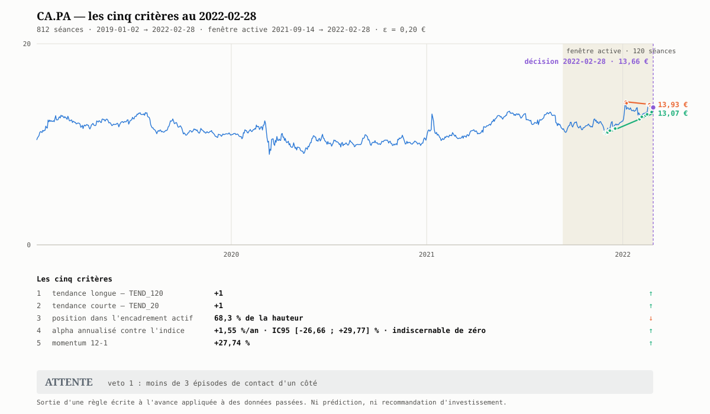

- Canal 13,07 – 13,93 €, large de 0,9 % seulement, clôture à 13,66 € à 68,3 %.
- Support +0,032 contre résistance −0,008 €/séance : τ de 21 séances, le canal se referme presque à la décision suivante.
- Cinq contacts bas, deux hauts : veto 1.
- Momentum +27,7 %, alpha +1,6 %/an.

### 12. `BNP.PA` — BNP Paribas

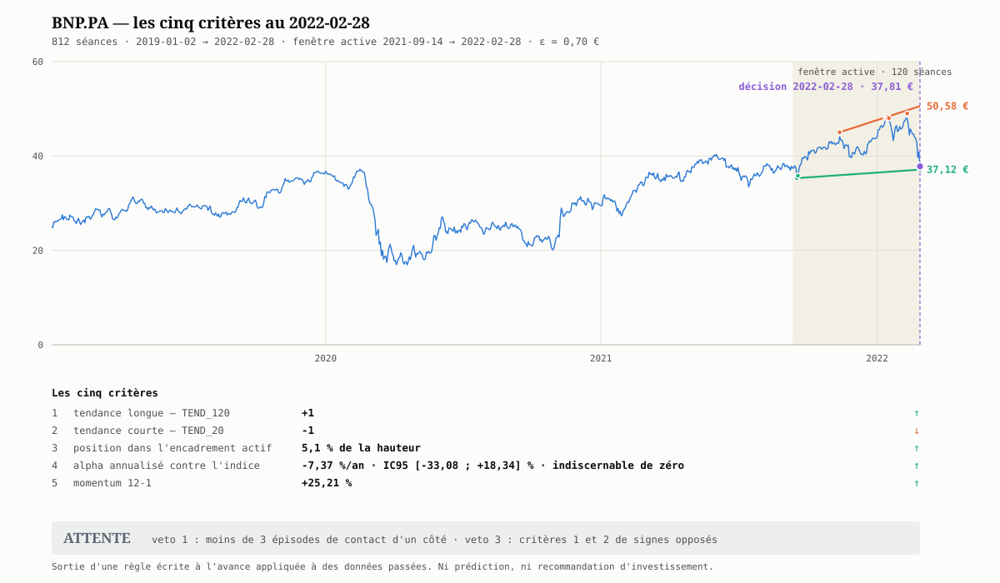

- Canal 37,12 – 50,58 €, clôture à 37,81 € à 5,1 % : quasiment sur le support.
- Pentes +0,016 et +0,074 €/séance, divergence, τ infini.
- Deux contacts en support : veto 1 ; tendances opposées : veto 3.
- Momentum +25,2 %, alpha −7,4 %/an.

### 13. `SGO.PA` — Saint-Gobain

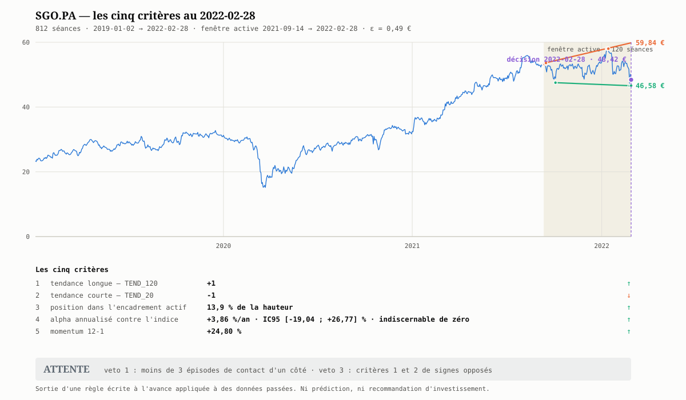

- Canal 46,58 – 59,84 €, clôture à 48,42 € à 13,9 %.
- Support −0,009 contre résistance +0,053 €/séance : ouverture, τ infini.
- Deux contacts de chaque côté : veto 1 ; tendances opposées : veto 3.
- Momentum +24,8 %, alpha +3,9 %/an.

### 14. `SAN.PA` — Sanofi

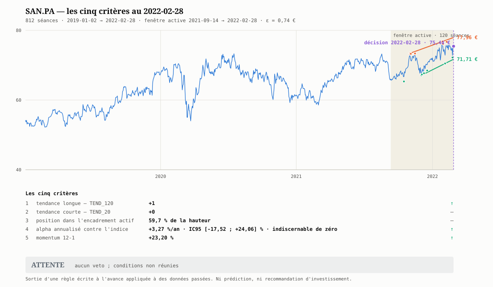

- Canal 71,71 – 77,96 €, clôture à 75,44 € à 59,7 % : sous le seuil haut.
- Pentes +0,076 et +0,055 €/séance, τ de 303 séances.
- **Six contacts en support et quatre en résistance** — la figure la plus étayée de la date, aucun veto.
- Momentum +23,2 %, alpha +3,3 %/an.

### 15. `ML.PA` — Michelin

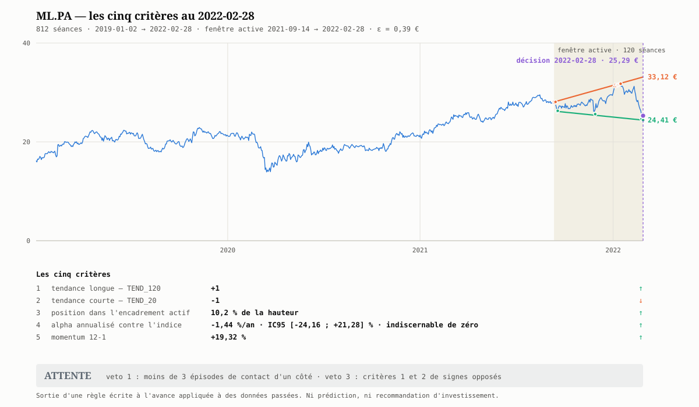

- Canal 24,41 – 33,12 €, clôture à 25,29 € à 10,2 %.
- Support −0,015 contre résistance +0,042 €/séance : ouverture, τ infini.
- Trois contacts bas, deux hauts : veto 1 ; tendances opposées : veto 3.
- Momentum +19,3 %, alpha −1,4 %/an.

### 16. `ENGI.PA` — Engie

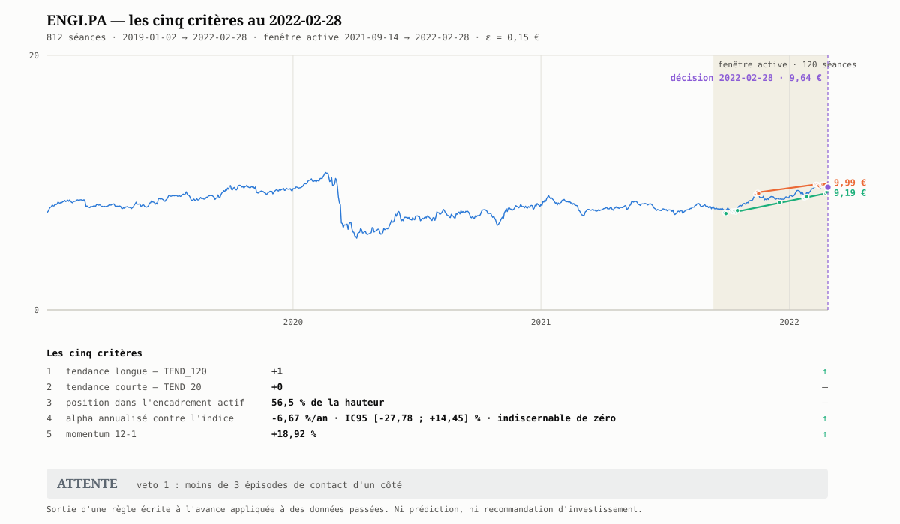

- Canal 9,19 – 9,99 €, large de 0,8 %, clôture à 9,64 € à 56,5 % : le milieu.
- Pentes +0,015 et +0,010 €/séance, τ de 159 séances.
- Cinq contacts bas, deux hauts : veto 1.
- Momentum +18,9 %, alpha −6,7 %/an.

### 17. `AI.PA` — Air Liquide

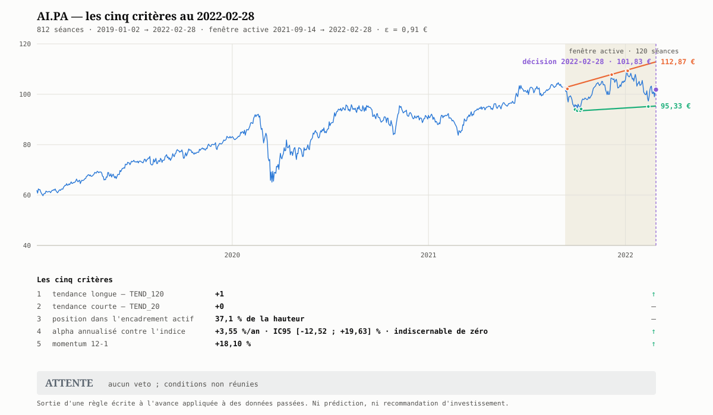

- Canal 95,33 – 112,87 €, large de 17,6 %, clôture à 101,83 € à 37,1 %.
- Support +0,019 contre résistance +0,086 €/séance : ouverture, τ infini.
- Quatre contacts bas, trois hauts : **aucun veto**.
- Momentum +18,1 %, alpha +3,5 %/an.

### 18. `ORA.PA` — Orange

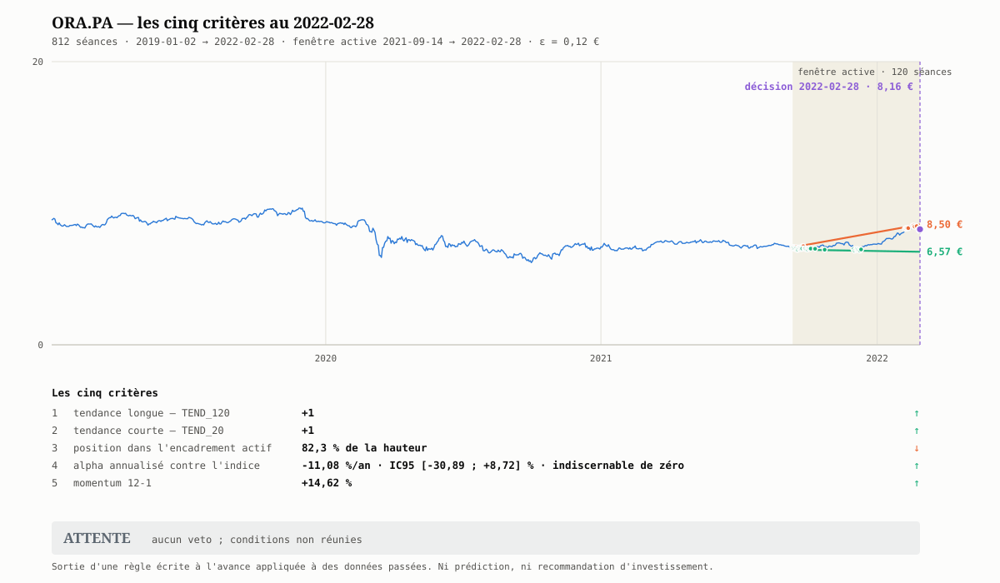

- Canal 6,57 – 8,50 €, clôture à 8,16 € à 82,3 % de la hauteur.
- Support −0,001 contre résistance +0,013 €/séance, τ infini.
- Quatre contacts bas, cinq hauts : **aucun veto**, la figure la mieux étayée du haut de tableau.
- Momentum +14,6 %, alpha −11,1 %/an.

### 19. `ACA.PA` — Crédit Agricole

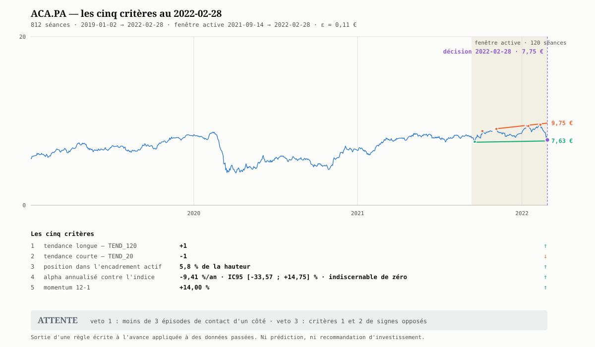

- Canal 7,63 – 9,75 €, clôture à 7,75 € à 5,8 % : contre le support.
- Pentes +0,001 et +0,008 €/séance, divergence imperceptible, τ infini.
- Deux contacts en support : veto 1 ; tendances opposées : veto 3.
- Momentum +14,0 %, alpha −9,4 %/an.

### 20. `STLAP.PA` — Stellantis

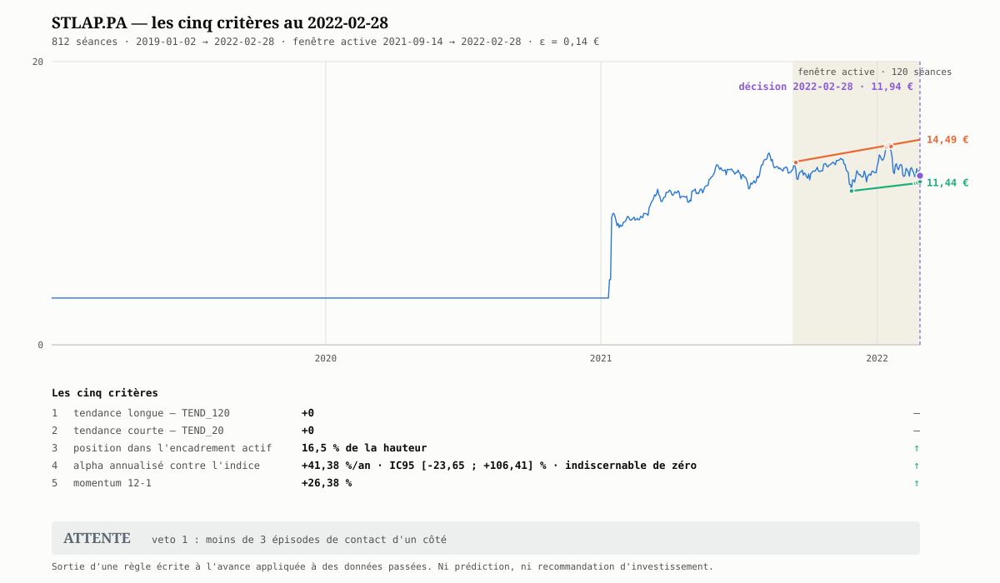

- Canal 11,44 – 14,49 €, clôture à 11,94 € à 16,5 % de la hauteur.
- Pentes +0,009 et +0,013 €/séance : quasi parallèles, τ infini.
- Deux contacts de chaque côté : veto 1.
- Momentum +26,4 %, alpha +41,4 %/an mais un IC95 de 130 points : la mesure ne porte rien. Les deux tendances sont passées à zéro.

### 21. `MT.AS` — ArcelorMittal

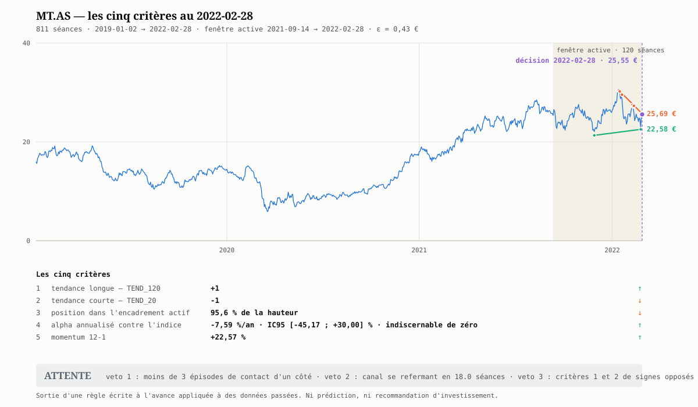

- Canal 22,58 – 25,69 €, clôture à 25,55 € à 95,6 % : collée au plafond.
- Support +0,020 contre résistance −0,153 €/séance : **le canal se referme en 18 séances**, veto 2.
- Deux contacts en support : veto 1 ; tendances opposées : veto 3. **Les trois vetos non arithmétiques à la fois.**
- Momentum +22,6 %, alpha −7,6 %/an.

### 22. `EL.PA` — EssilorLuxottica

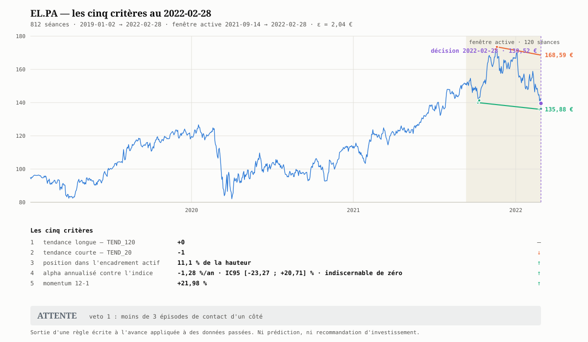

- Canal 135,88 – 168,59 €, clôture à 139,52 € à 11,1 % : le bas de la figure.
- Deux droites descendantes, −0,041 et −0,071 €/séance, τ de 1 104 séances.
- Deux contacts de chaque côté : veto 1.
- Momentum +22,0 %, alpha −1,3 %/an.

### 23. `SU.PA` — Schneider Electric

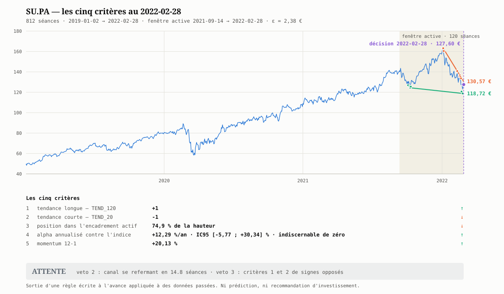

- Canal 118,72 – 130,57 €, clôture à 127,60 € à 74,9 % de la hauteur.
- Support −0,058 contre résistance −0,858 €/séance : **le canal se referme en 15 séances**, veto 2.
- Tendances opposées : veto 3. Trois contacts de chaque côté, la figure est étayée mais périmée.
- Momentum +20,1 %, alpha +12,3 %/an, IC95 de −5,8 à +30,3.

### 24. `AIR.PA` — Airbus

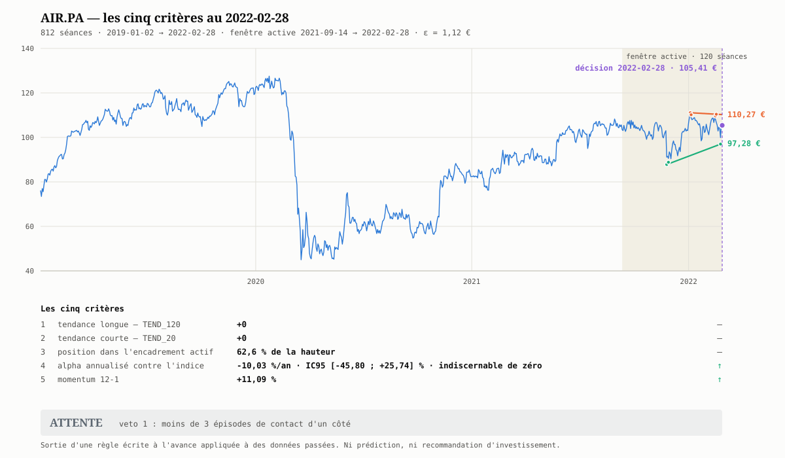

- Canal 97,28 – 110,27 €, clôture à 105,41 € à 62,6 %.
- Support +0,143 contre résistance −0,022 €/séance, τ de 79 séances.
- Deux contacts de chaque côté : veto 1.
- Momentum +11,1 %, alpha −10,0 %/an.

### 25. `VIV.PA` — Vivendi

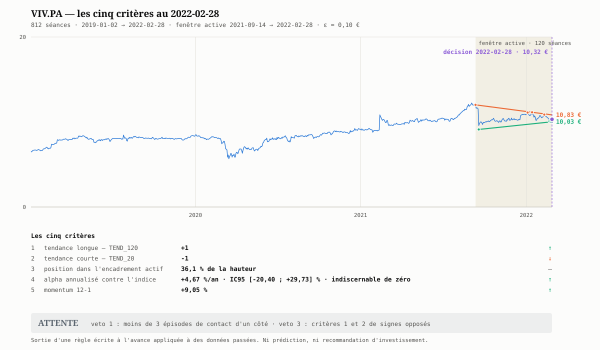

- Canal 10,03 – 10,83 €, large de 0,8 %, clôture à 10,32 € à 36,1 %.
- Pentes +0,008 et −0,010 €/séance, τ de 45 séances.
- Deux contacts en support : veto 1 ; tendances opposées : veto 3.
- Momentum +9,1 %, sous le seuil de dix ; alpha +4,7 %/an.

### 26. `RI.PA` — Pernod Ricard

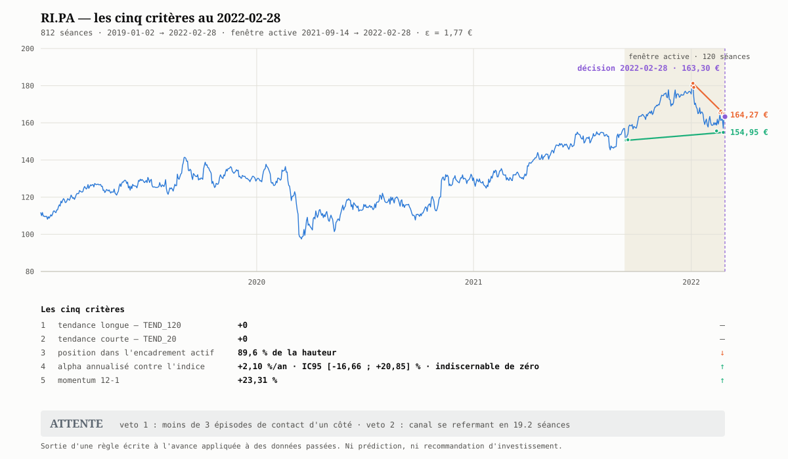

- Canal 154,95 – 164,27 €, clôture à 163,30 € à 89,6 % de la hauteur.
- Support +0,038 contre résistance −0,448 €/séance : **le canal se referme en 19 séances**, veto 2.
- Deux contacts en résistance : veto 1.
- Momentum +23,3 %, alpha +2,1 %/an.

### 27. `HO.PA` — Thales

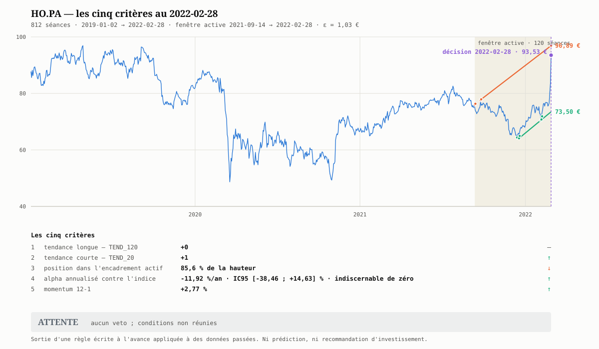

- Canal 73,50 – 96,89 €, large de 23,4 %, clôture à 93,53 € à 85,6 %.
- Pentes +0,188 et +0,174 €/séance, quasi parallèles : τ de 1 740 séances.
- Trois contacts de chaque côté : **aucun veto** — le veto 2 de janvier a disparu.
- Momentum +2,8 %, alpha −11,9 %/an.

### 28. `RMS.PA` — Hermès International

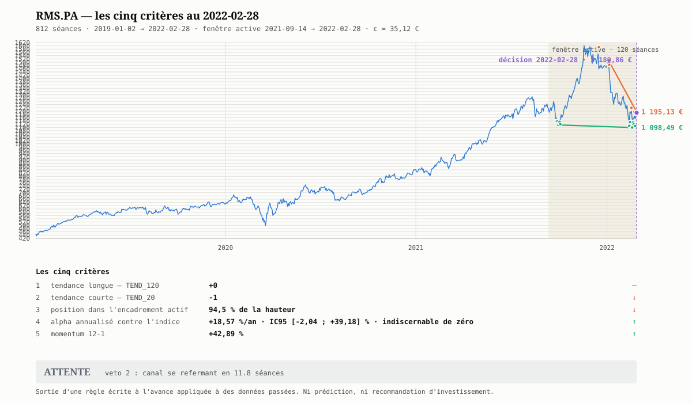

- Canal 1 098,49 – 1 195,13 €, clôture à 1 189,86 € à 94,5 % de la hauteur.
- Support −0,158 contre résistance −8,325 €/séance : **le canal se referme en 12 séances**, veto 2 — le plus court de la date.
- Trois et quatre contacts : figure étayée mais périmée avant la prochaine décision.
- Momentum +42,9 %, alpha +18,6 %/an, IC95 de −2,0 à +39,2.

### 29. `OR.PA` — L'Oréal

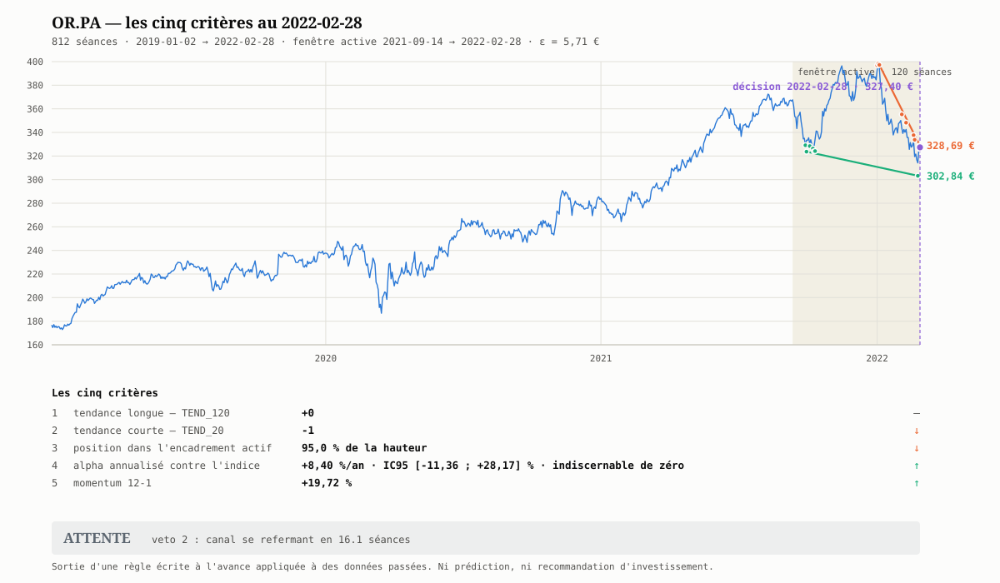

- Canal 302,84 – 328,69 €, clôture à 327,40 € à 95,0 % : sous le plafond.
- Support −0,197 contre résistance −1,804 €/séance : **le canal se referme en 16 séances**, veto 2.
- Quatre et cinq contacts : la figure est bien étayée, mais elle est en train de disparaître.
- Momentum +19,7 %, alpha +8,4 %/an.

### 30. `LR.PA` — Legrand

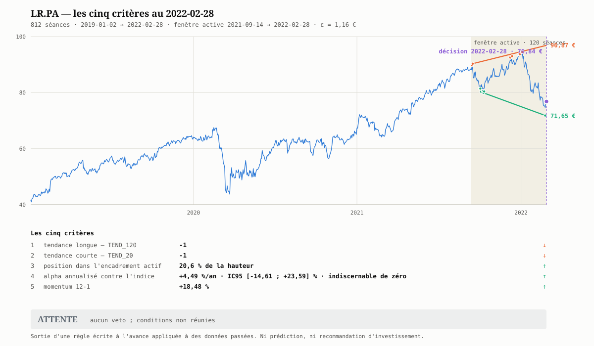

- Canal 71,65 – 96,87 €, clôture à 76,84 € à 20,6 % de la hauteur.
- Support −0,083 contre résistance +0,056 €/séance : le canal s'ouvre, τ infini.
- Trois contacts bas, quatre hauts : **aucun veto**.
- Momentum +18,5 %, alpha +4,5 %/an ; mais les deux tendances sont négatives.

### 31. `BN.PA` — Danone

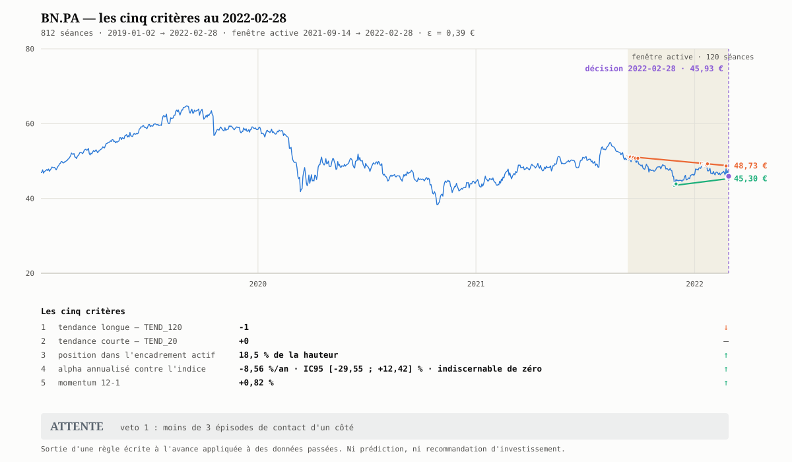

- Canal 45,30 – 48,73 €, clôture à 45,93 € à 18,5 %.
- Pentes +0,028 et −0,021 €/séance, τ de 70 séances.
- Deux contacts en support : veto 1.
- **Momentum +0,8 %**, le plus faible des valeurs encore positives ; alpha −8,6 %/an.

### 32. `RNO.PA` — Renault

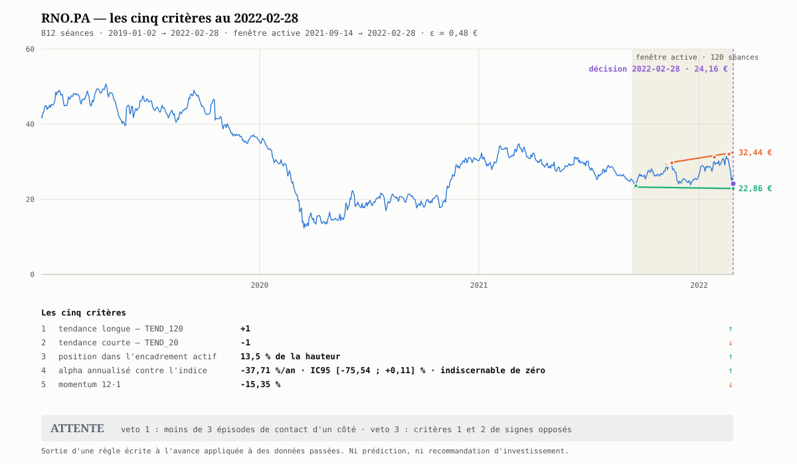

- Canal 22,86 – 32,44 €, clôture à 24,16 € à 13,5 %.
- Support −0,004 contre résistance +0,036 €/séance : ouverture, τ infini.
- Deux contacts en support : veto 1 ; tendances opposées : veto 3.
- **Momentum −15,3 %** ; alpha −37,7 %/an, IC95 de −75,5 à +0,1 — à un dixième de point d'être significativement négatif.

### 33. `DSY.PA` — Dassault Systèmes

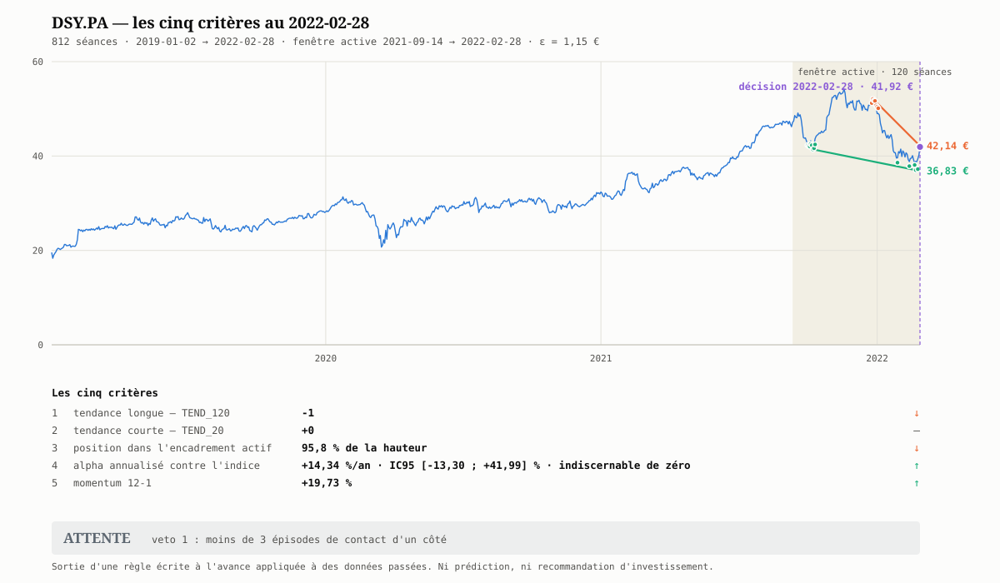

- Canal 36,83 – 42,14 €, clôture à 41,92 € à 95,8 % : contre la résistance.
- Pentes −0,046 et −0,227 €/séance, τ de 29 séances.
- Quatre contacts bas, deux hauts : veto 1.
- Momentum +19,7 %, alpha +14,3 %/an.

### 34. `ERF.PA` — Eurofins Scientific

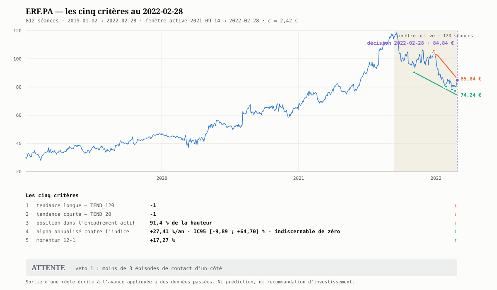

- Canal 74,24 – 85,84 €, clôture à 84,84 € à 91,4 % de la hauteur.
- Pentes −0,200 et −0,452 €/séance, τ de 46 séances.
- Quatre contacts bas, deux hauts : veto 1.
- Momentum +17,3 %, **alpha +27,4 %/an, le plus élevé de la date** — sur un IC95 de 75 points.

### 35. `TEP.PA` — Teleperformance

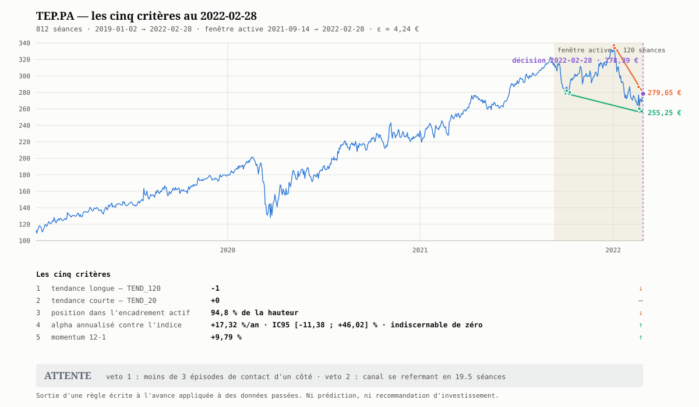

- Canal 255,25 – 279,65 €, clôture à 278,39 € à 94,8 % : sous le plafond.
- Support −0,228 contre résistance −1,478 €/séance : **le canal se referme en 20 séances**, veto 2.
- Deux contacts en support : veto 1 également.
- Momentum +9,8 %, alpha +17,3 %/an.

### 36. `SAF.PA` — Safran

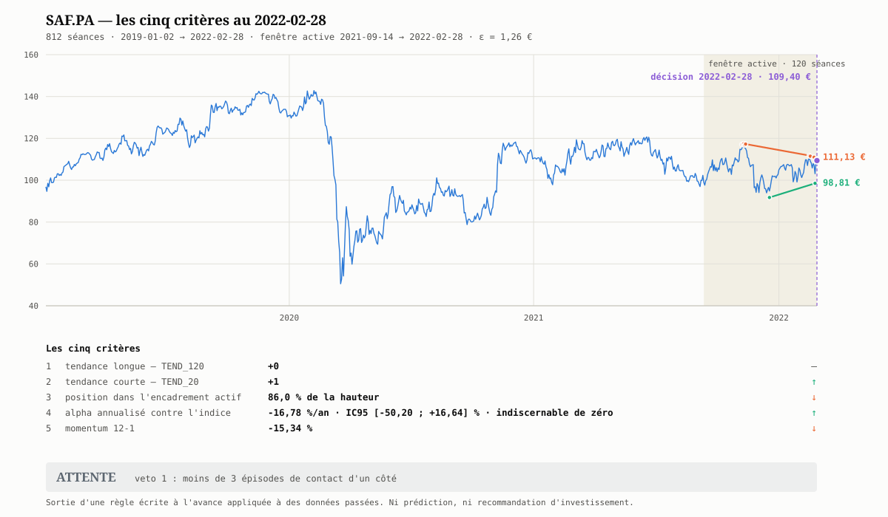

- Canal 98,81 – 111,13 €, clôture à 109,40 € à 86,0 %.
- Support +0,142 contre résistance −0,082 €/séance, τ de 55 séances.
- Deux contacts en support : veto 1.
- Momentum −15,3 %, alpha −16,8 %/an.

### 37. `EN.PA` — Bouygues

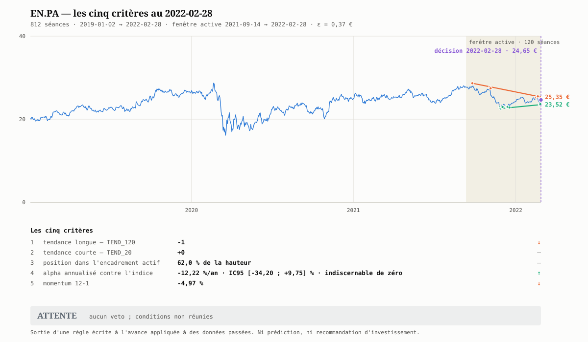

- Canal 23,52 – 25,35 €, large de 1,8 %, clôture à 24,65 € à 62,0 % de la hauteur.
- Pentes +0,015 et −0,030 €/séance, τ de 41 séances.
- Quatre contacts bas, trois hauts : **aucun veto**.
- Momentum −5,0 %, alpha −12,2 %/an.

### 38. `ALO.PA` — Alstom

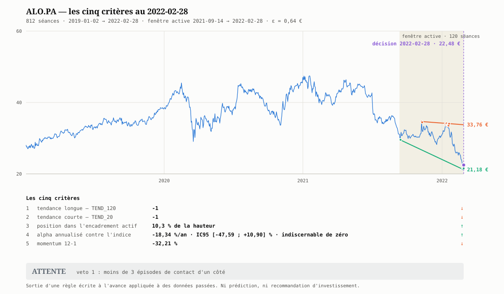

- Canal 21,18 – 33,76 €, clôture à 22,48 € à 10,3 %.
- Pentes −0,071 et −0,011 €/séance : ouverture vers le bas, τ infini.
- Deux contacts de chaque côté : veto 1.
- **Momentum −32,2 %**, alpha −18,3 %/an.

### 39. `WLN.PA` — Worldline

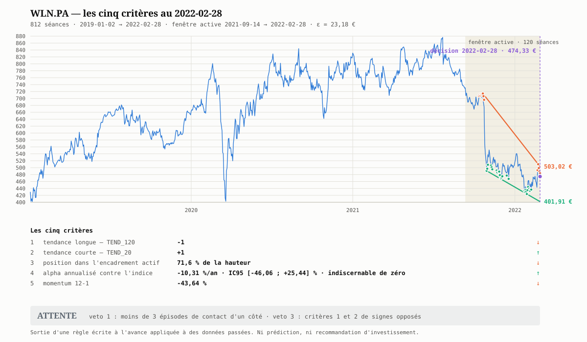

- Canal 401,91 – 503,02 €, clôture à 474,33 € à 71,6 % de la hauteur.
- Deux droites en chute, −1,048 et −2,322 €/séance, τ de 79 séances.
- Six contacts en support, deux en résistance : veto 1 ; tendances opposées : veto 3.
- **Momentum −43,6 %, le plus faible de l'univers** ; alpha −10,3 %/an.

## 6. Le classement au 2022-02-28

> De la valeur la plus intéressante à détenir à celle qu'il faut fuir. La colonne **τ** donne la date de péremption du canal en séances, la colonne **Vetos** les numéros déclenchés. Une valeur sous veto ne peut pas être achetée.

| Rang | Valeur | `s1` | `s2` | `s3` | `s4` | `s5` | Score | Position | Momentum | τ | Vetos |
|---|---|---|---|---|---|---|---|---|---|---|---|
| 1 | `PUB.PA` Publicis | +2 | +0 | +1 | +2 | +0 | **+5** | 30,4 % | +22,9 % | ∞ | 1 |
| 2 | `KER.PA` Kering | +2 | +0 | +1 | +2 | +0 | **+5** | 19,3 % | +16,7 % | ∞ | — |
| 3 | `DG.PA` Vinci | +2 | +0 | +1 | +2 | +0 | **+5** | 19,1 % | +11,3 % | 269,5 | 1 |
| 4 | `GLE.PA` Société Générale | +2 | -1 | +1 | +2 | +0 | **+4** | 5,8 % | +53,9 % | ∞ | 1 3 |
| 5 | `VIE.PA` Veolia | +2 | -1 | +1 | +2 | +0 | **+4** | 29,4 % | +46,8 % | ∞ | 3 |
| 6 | `CAP.PA` Capgemini | +2 | -1 | +1 | +2 | +0 | **+4** | 26,7 % | +35,9 % | 4 838,9 | 3 |
| 7 | `STMPA.PA` STMicroelectronics | +2 | -1 | +1 | +2 | +0 | **+4** | 30,4 % | +34,8 % | 409,6 | 1 3 |
| 8 | `TTE.PA` TotalEnergies | +2 | -1 | +1 | +2 | +0 | **+4** | 8,2 % | +34,6 % | ∞ | 3 |
| 9 | `MC.PA` LVMH | +2 | -1 | +1 | +2 | +0 | **+4** | 22,1 % | +33,9 % | ∞ | 3 |
| 10 | `CS.PA` AXA | +2 | -1 | +1 | +2 | +0 | **+4** | 11,3 % | +30,5 % | ∞ | 1 3 |
| 11 | `CA.PA` Carrefour | +2 | +1 | -1 | +2 | +0 | **+4** | 68,3 % | +27,7 % | 21,4 | 1 |
| 12 | `BNP.PA` BNP Paribas | +2 | -1 | +1 | +2 | +0 | **+4** | 5,1 % | +25,2 % | ∞ | 1 3 |
| 13 | `SGO.PA` Saint-Gobain | +2 | -1 | +1 | +2 | +0 | **+4** | 13,9 % | +24,8 % | ∞ | 1 3 |
| 14 | `SAN.PA` Sanofi | +2 | +0 | +0 | +2 | +0 | **+4** | 59,7 % | +23,2 % | 302,6 | — |
| 15 | `ML.PA` Michelin | +2 | -1 | +1 | +2 | +0 | **+4** | 10,2 % | +19,3 % | ∞ | 1 3 |
| 16 | `ENGI.PA` Engie | +2 | +0 | +0 | +2 | +0 | **+4** | 56,5 % | +18,9 % | 158,5 | 1 |
| 17 | `AI.PA` Air Liquide | +2 | +0 | +0 | +2 | +0 | **+4** | 37,1 % | +18,1 % | ∞ | — |
| 18 | `ORA.PA` Orange | +2 | +1 | -1 | +2 | +0 | **+4** | 82,3 % | +14,6 % | ∞ | — |
| 19 | `ACA.PA` Crédit Agricole | +2 | -1 | +1 | +2 | +0 | **+4** | 5,8 % | +14,0 % | ∞ | 1 3 |
| 20 | `STLAP.PA` Stellantis | +0 | +0 | +1 | +2 | +0 | **+3** | 16,5 % | +26,4 % | ∞ | 1 |
| 21 | `MT.AS` ArcelorMittal | +2 | -1 | -1 | +2 | +0 | **+2** | 95,6 % | +22,6 % | 18,0 | 1 2 3 |
| 22 | `EL.PA` EssilorLuxottica | +0 | -1 | +1 | +2 | +0 | **+2** | 11,1 % | +22,0 % | 1 104,1 | 1 |
| 23 | `SU.PA` Schneider Electric | +2 | -1 | -1 | +2 | +0 | **+2** | 74,9 % | +20,1 % | 14,8 | 2 3 |
| 24 | `AIR.PA` Airbus | +0 | +0 | +0 | +2 | +0 | **+2** | 62,6 % | +11,1 % | 78,7 | 1 |
| 25 | `VIV.PA` Vivendi | +2 | -1 | +0 | +1 | +0 | **+2** | 36,1 % | +9,1 % | 44,8 | 1 3 |
| 26 | `RI.PA` Pernod Ricard | +0 | +0 | -1 | +2 | +0 | **+1** | 89,6 % | +23,3 % | 19,2 | 1 2 |
| 27 | `HO.PA` Thales | +0 | +1 | -1 | +1 | +0 | **+1** | 85,6 % | +2,8 % | 1 739,7 | — |
| 28 | `RMS.PA` Hermès International | +0 | -1 | -1 | +2 | +0 | **+0** | 94,5 % | +42,9 % | 11,8 | 2 |
| 29 | `OR.PA` L'Oréal | +0 | -1 | -1 | +2 | +0 | **+0** | 95,0 % | +19,7 % | 16,1 | 2 |
| 30 | `LR.PA` Legrand | -2 | -1 | +1 | +2 | +0 | **+0** | 20,6 % | +18,5 % | ∞ | — |
| 31 | `BN.PA` Danone | -2 | +0 | +1 | +1 | +0 | **+0** | 18,5 % | +0,8 % | 69,9 | 1 |
| 32 | `RNO.PA` Renault | +2 | -1 | +1 | -2 | +0 | **+0** | 13,5 % | -15,3 % | ∞ | 1 3 |
| 33 | `DSY.PA` Dassault Systèmes | -2 | +0 | -1 | +2 | +0 | **-1** | 95,8 % | +19,7 % | 29,3 | 1 |
| 34 | `ERF.PA` Eurofins Scientific | -2 | -1 | -1 | +2 | +0 | **-2** | 91,4 % | +17,3 % | 46,1 | 1 |
| 35 | `TEP.PA` Teleperformance | -2 | +0 | -1 | +1 | +0 | **-2** | 94,8 % | +9,8 % | 19,5 | 1 2 |
| 36 | `SAF.PA` Safran | +0 | +1 | -1 | -2 | +0 | **-2** | 86,0 % | -15,3 % | 55,1 | 1 |
| 37 | `EN.PA` Bouygues | -2 | +0 | +0 | -1 | +0 | **-3** | 62,0 % | -5,0 % | 40,6 | — |
| 38 | `ALO.PA` Alstom | -2 | -1 | +1 | -2 | +0 | **-4** | 10,3 % | -32,2 % | ∞ | 1 |
| 39 | `WLN.PA` Worldline | -2 | +1 | -1 | -2 | +0 | **-4** | 71,6 % | -43,6 % | 79,4 | 1 3 |

## 7. Les ordres exécutés au 2022-03-01

> À l'**ouverture** de la séance, jamais à la clôture du 2022-02-28.

| Sens | Valeur | Quantité | Prix d'exécution | Brut | Frais | Motif |
|---|---|---|---|---|---|---|
| **Achat** | `KER.PA` Kering | 3 | 558,25 € | 1 674,75 € | 6,95 € | rang 2, score +5, aucun veto |

## 8. La lecture du mois

Sur le mois, la meilleure contribution vient de `CAP.PA` (Capgemini) pour **+127,85 €**, la moins bonne de `KER.PA` (Kering) pour **-163,59 €**. Les 1 ordres du mois ont coûté **6,95 €** de frais, soit 0,070 % de la dotation initiale. Le portefeuille termine le mois **devant TR39** de 0,45 point. Sur les 47 thèses du mois précédent qui ont pu être tranchées, **16 sont confirmées** — 34,0 %.

## 9. Les thèses écrites au 2022-02-28

> Elles seront dépouillées à la prochaine date de décision, dans le fichier du mois suivant. Elles sont engendrées mécaniquement par les règles du [protocole](../README.md#le-registre-des-thèses-réfutables) — aucune n'est rédigée à la main.

| Valeur | Thèse | Énoncé, à dépouiller au mois suivant |
|---|---|---|
| `ACA.PA` | Canal | clôture entre 7,66 € et 9,94 € au 2022-03-31 |
| `ACA.PA` | Reflexive | AUCUNE SEQUENCE : écart contre TR39 dans ± 6,47 pt (σ̂), au 2022-03-31 |
| `AI.PA` | Canal | clôture entre 95,76 € et 114,85 € au 2022-03-31 |
| `AIR.PA` | Canal | clôture entre 100,57 € et 109,77 € au 2022-03-31 |
| `ALO.PA` | Canal | clôture entre 19,55 € et 33,50 € au 2022-03-31 |
| `ALO.PA` | Reflexive | RETOURNEMENT : écart contre TR39 au-dessous de −3,60 pt (0,5 σ̂), au 2022-03-31 |
| `BN.PA` | Canal | clôture entre 45,95 € et 48,25 € au 2022-03-31 |
| `BNP.PA` | Canal | clôture entre 37,48 € et 52,28 € au 2022-03-31 |
| `BNP.PA` | Reflexive | AUCUNE SEQUENCE : écart contre TR39 dans ± 6,59 pt (σ̂), au 2022-03-31 |
| `CA.PA` | Canal | encadrement ferme avant le 2022-03-31 : les bornes prolongees se croisent, la thèse est inconfirmable à l'écriture |
| `CAP.PA` | Canal | clôture entre 159,53 € et 200,17 € au 2022-03-31 |
| `CS.PA` | Canal | clôture entre 17,72 € et 23,19 € au 2022-03-31 |
| `CS.PA` | Reflexive | AUCUNE SEQUENCE : écart contre TR39 dans ± 4,35 pt (σ̂), au 2022-03-31 |
| `DG.PA` | Canal | clôture entre 79,84 € et 89,84 € au 2022-03-31 |
| `DSY.PA` | Canal | clôture entre 35,78 € et 36,92 € au 2022-03-31 |
| `EL.PA` | Canal | clôture entre 134,93 € et 166,96 € au 2022-03-31 |
| `EN.PA` | Canal | clôture entre 23,86 € et 24,65 € au 2022-03-31 |
| `ENGI.PA` | Canal | clôture entre 9,54 € et 10,23 € au 2022-03-31 |
| `ERF.PA` | Canal | clôture entre 69,65 € et 75,46 € au 2022-03-31 |
| `ERF.PA` | Reflexive | AUCUNE SEQUENCE : écart contre TR39 dans ± 10,53 pt (σ̂), au 2022-03-31 |
| `GLE.PA` | Canal | clôture entre 19,98 € et 32,87 € au 2022-03-31 |
| `GLE.PA` | Reflexive | AUCUNE SEQUENCE : écart contre TR39 dans ± 8,42 pt (σ̂), au 2022-03-31 |
| `HO.PA` | Canal | clôture entre 77,82 € et 100,90 € au 2022-03-31 |
| `KER.PA` | Canal | clôture entre 521,09 € et 743,81 € au 2022-03-31 |
| `LR.PA` | Canal | clôture entre 69,73 € et 98,17 € au 2022-03-31 |
| `MC.PA` | Canal | clôture entre 574,21 € et 725,28 € au 2022-03-31 |
| `ML.PA` | Canal | clôture entre 24,06 € et 34,10 € au 2022-03-31 |
| `MT.AS` | Canal | encadrement ferme avant le 2022-03-31 : les bornes prolongees se croisent, la thèse est inconfirmable à l'écriture |
| `MT.AS` | Reflexive | AUCUNE SEQUENCE : écart contre TR39 dans ± 10,03 pt (σ̂), au 2022-03-31 |
| `OR.PA` | Canal | encadrement ferme avant le 2022-03-31 : les bornes prolongees se croisent, la thèse est inconfirmable à l'écriture |
| `ORA.PA` | Canal | clôture entre 6,54 € et 8,81 € au 2022-03-31 |
| `PUB.PA` | Canal | clôture entre 45,71 € et 56,52 € au 2022-03-31 |
| `RI.PA` | Canal | encadrement ferme avant le 2022-03-31 : les bornes prolongees se croisent, la thèse est inconfirmable à l'écriture |
| `RMS.PA` | Canal | encadrement ferme avant le 2022-03-31 : les bornes prolongees se croisent, la thèse est inconfirmable à l'écriture |
| `RNO.PA` | Canal | clôture entre 22,78 € et 33,27 € au 2022-03-31 |
| `SAF.PA` | Canal | clôture entre 102,07 € et 109,25 € au 2022-03-31 |
| `SAN.PA` | Canal | clôture entre 73,45 € et 79,22 € au 2022-03-31 |
| `SGO.PA` | Canal | clôture entre 46,37 € et 61,06 € au 2022-03-31 |
| `STLAP.PA` | Canal | clôture entre 11,64 € et 14,80 € au 2022-03-31 |
| `STMPA.PA` | Canal | clôture entre 33,52 € et 42,55 € au 2022-03-31 |
| `SU.PA` | Canal | encadrement ferme avant le 2022-03-31 : les bornes prolongees se croisent, la thèse est inconfirmable à l'écriture |
| `TEP.PA` | Canal | encadrement ferme avant le 2022-03-31 : les bornes prolongees se croisent, la thèse est inconfirmable à l'écriture |
| `TEP.PA` | Reflexive | AUCUNE SEQUENCE : écart contre TR39 dans ± 5,52 pt (σ̂), au 2022-03-31 |
| `TTE.PA` | Canal | clôture entre 36,07 € et 44,49 € au 2022-03-31 |
| `VIE.PA` | Canal | clôture entre 24,41 € et 29,68 € au 2022-03-31 |
| `VIV.PA` | Canal | clôture entre 10,21 € et 10,60 € au 2022-03-31 |
| `VIV.PA` | Reflexive | AUCUNE SEQUENCE : écart contre TR39 dans ± 6,16 pt (σ̂), au 2022-03-31 |
| `WLN.PA` | Canal | clôture entre 377,81 € et 449,61 € au 2022-03-31 |
| `WLN.PA` | Reflexive | AUCUNE SEQUENCE : écart contre TR39 dans ± 9,14 pt (σ̂), au 2022-03-31 |

---

[← Février](2022-02.md) · [Protocole](../README.md) · [Avril →](2022-04.md)
