# Avril 2022

> Journal de l'[expérience 3](../README.md) · **décision au 2022-03-31** · **exécution au 2022-04-01**
> Portefeuille au 2022-04-29 : **9 245,57 €** (base 92,46) · TR39 92,09 · alpha du mois **-0,20 pt** · depuis janvier **+0,37 pt**

---

## 1. Les actualités du mois précédent

**Mars 2022.** Un mois de deux temps : chute jusqu'au 7 mars, où le pétrole
touche 139 dollars et les indices leurs plus bas, puis rebond marqué. Le CAC 40
termine le mois presque à l'équilibre malgré une amplitude de plus de 15 %.

La Réserve fédérale relève ses taux d'un quart de point, la première hausse
depuis 2018, et laisse entendre que le rythme s'accélérera. La courbe des taux
américaine s'inverse brièvement entre deux et dix ans, signal que les marchés
lisent comme une menace de récession. Renault annonce la suspension de ses
activités en Russie, Société Générale la cession de Rosbank.

## 2. Le dépouillement des thèses écrites au 2022-02-28

> Piste **S4**. Ces énoncés ont été écrits le mois dernier, avant de connaître ce mois-ci. Aucun n'a été retouché ; le verdict est calculé.

| Valeur | Thèse | Énoncé | Constaté | Verdict |
|---|---|---|---|---|
| `ACA.PA` | Canal | clôture entre 7,66 € et 9,94 € au 2022-03-31 | 7,36 € | démentie |
| `ACA.PA` | Reflexive | AUCUNE SEQUENCE : écart contre TR39 dans ± 6,47 pt (σ̂), au 2022-03-31 | -4,23 pt | **confirmée** |
| `AI.PA` | Canal | clôture entre 95,76 € et 114,85 € au 2022-03-31 | 108,83 € | **confirmée** |
| `AIR.PA` | Canal | clôture entre 100,57 € et 109,77 € au 2022-03-31 | 101,25 € | **confirmée** |
| `ALO.PA` | Canal | clôture entre 19,55 € et 33,50 € au 2022-03-31 | 20,88 € | **confirmée** |
| `ALO.PA` | Reflexive | RETOURNEMENT : écart contre TR39 au-dessous de −3,60 pt (0,5 σ̂), au 2022-03-31 | -6,29 pt | **confirmée** |
| `BN.PA` | Canal | clôture entre 45,95 € et 48,25 € au 2022-03-31 | 42,31 € | démentie |
| `BNP.PA` | Canal | clôture entre 37,48 € et 52,28 € au 2022-03-31 | 37,39 € | démentie |
| `BNP.PA` | Reflexive | AUCUNE SEQUENCE : écart contre TR39 dans ± 6,59 pt (σ̂), au 2022-03-31 | -0,28 pt | **confirmée** |
| `CA.PA` | Canal | encadrement ferme avant le 2022-03-31 : les bornes prolongees se croisent, la thèse est inconfirmable à l'écriture | 14,99 € | *inconfirmable à l'écriture* |
| `CAP.PA` | Canal | clôture entre 159,53 € et 200,17 € au 2022-03-31 | 182,32 € | **confirmée** |
| `CS.PA` | Canal | clôture entre 17,72 € et 23,19 € au 2022-03-31 | 19,78 € | **confirmée** |
| `CS.PA` | Reflexive | AUCUNE SEQUENCE : écart contre TR39 dans ± 4,35 pt (σ̂), au 2022-03-31 | 10,26 pt | démentie |
| `DG.PA` | Canal | clôture entre 79,84 € et 89,84 € au 2022-03-31 | 77,49 € | démentie |
| `DSY.PA` | Canal | clôture entre 35,78 € et 36,92 € au 2022-03-31 | 43,10 € | démentie |
| `EL.PA` | Canal | clôture entre 134,93 € et 166,96 € au 2022-03-31 | 148,05 € | **confirmée** |
| `EN.PA` | Canal | clôture entre 23,86 € et 24,65 € au 2022-03-31 | 24,35 € | **confirmée** |
| `ENGI.PA` | Canal | clôture entre 9,54 € et 10,23 € au 2022-03-31 | 8,06 € | démentie |
| `ERF.PA` | Canal | clôture entre 69,65 € et 75,46 € au 2022-03-31 | 84,25 € | démentie |
| `ERF.PA` | Reflexive | AUCUNE SEQUENCE : écart contre TR39 dans ± 10,53 pt (σ̂), au 2022-03-31 | 0,13 pt | **confirmée** |
| `GLE.PA` | Canal | clôture entre 19,98 € et 32,87 € au 2022-03-31 | 19,57 € | démentie |
| `GLE.PA` | Reflexive | AUCUNE SEQUENCE : écart contre TR39 dans ± 8,42 pt (σ̂), au 2022-03-31 | -3,77 pt | **confirmée** |
| `HO.PA` | Canal | clôture entre 77,82 € et 100,90 € au 2022-03-31 | 103,57 € | démentie |
| `KER.PA` | Canal | clôture entre 521,09 € et 743,81 € au 2022-03-31 | 506,04 € | démentie |
| `LR.PA` | Canal | clôture entre 69,73 € et 98,17 € au 2022-03-31 | 78,25 € | **confirmée** |
| `MC.PA` | Canal | clôture entre 574,21 € et 725,28 € au 2022-03-31 | 591,97 € | **confirmée** |
| `ML.PA` | Canal | clôture entre 24,06 € et 34,10 € au 2022-03-31 | 25,08 € | **confirmée** |
| `MT.AS` | Canal | encadrement ferme avant le 2022-03-31 : les bornes prolongees se croisent, la thèse est inconfirmable à l'écriture | 27,02 € | *inconfirmable à l'écriture* |
| `MT.AS` | Reflexive | AUCUNE SEQUENCE : écart contre TR39 dans ± 10,03 pt (σ̂), au 2022-03-31 | 6,58 pt | **confirmée** |
| `OR.PA` | Canal | encadrement ferme avant le 2022-03-31 : les bornes prolongees se croisent, la thèse est inconfirmable à l'écriture | 335,56 € | *inconfirmable à l'écriture* |
| `ORA.PA` | Canal | clôture entre 6,54 € et 8,81 € au 2022-03-31 | 8,08 € | **confirmée** |
| `PUB.PA` | Canal | clôture entre 45,71 € et 56,52 € au 2022-03-31 | 44,76 € | démentie |
| `RI.PA` | Canal | encadrement ferme avant le 2022-03-31 : les bornes prolongees se croisent, la thèse est inconfirmable à l'écriture | 166,35 € | *inconfirmable à l'écriture* |
| `RMS.PA` | Canal | encadrement ferme avant le 2022-03-31 : les bornes prolongees se croisent, la thèse est inconfirmable à l'écriture | 1 237,29 € | *inconfirmable à l'écriture* |
| `RNO.PA` | Canal | clôture entre 22,78 € et 33,27 € au 2022-03-31 | 20,21 € | démentie |
| `SAF.PA` | Canal | clôture entre 102,07 € et 109,25 € au 2022-03-31 | 102,31 € | **confirmée** |
| `SAN.PA` | Canal | clôture entre 73,45 € et 79,22 € au 2022-03-31 | 74,66 € | **confirmée** |
| `SGO.PA` | Canal | clôture entre 46,37 € et 61,06 € au 2022-03-31 | 46,97 € | **confirmée** |
| `STLAP.PA` | Canal | clôture entre 11,64 € et 14,80 € au 2022-03-31 | 10,79 € | démentie |
| `STMPA.PA` | Canal | clôture entre 33,52 € et 42,55 € au 2022-03-31 | 37,96 € | **confirmée** |
| `SU.PA` | Canal | encadrement ferme avant le 2022-03-31 : les bornes prolongees se croisent, la thèse est inconfirmable à l'écriture | 138,90 € | *inconfirmable à l'écriture* |
| `TEP.PA` | Canal | encadrement ferme avant le 2022-03-31 : les bornes prolongees se croisent, la thèse est inconfirmable à l'écriture | 290,47 € | *inconfirmable à l'écriture* |
| `TEP.PA` | Reflexive | AUCUNE SEQUENCE : écart contre TR39 dans ± 5,52 pt (σ̂), au 2022-03-31 | 5,17 pt | **confirmée** |
| `TTE.PA` | Canal | clôture entre 36,07 € et 44,49 € au 2022-03-31 | 36,12 € | **confirmée** |
| `VIE.PA` | Canal | clôture entre 24,41 € et 29,68 € au 2022-03-31 | 23,48 € | démentie |
| `VIV.PA` | Canal | clôture entre 10,21 € et 10,60 € au 2022-03-31 | 10,80 € | démentie |
| `VIV.PA` | Reflexive | AUCUNE SEQUENCE : écart contre TR39 dans ± 6,16 pt (σ̂), au 2022-03-31 | 5,51 pt | **confirmée** |
| `WLN.PA` | Canal | clôture entre 377,81 € et 449,61 € au 2022-03-31 | 408,00 € | **confirmée** |
| `WLN.PA` | Reflexive | AUCUNE SEQUENCE : écart contre TR39 dans ± 9,14 pt (σ̂), au 2022-03-31 | -13,16 pt | démentie |

## 3. L'exposition héritée au 2022-03-31

| Valeur | Achetée le | Prix d'achat | +/− value | Alpha du mois | Alpha global |
|---|---|---|---|---|---|
| `CAP.PA` Capgemini | 2022-01-03 | 194,20 € | **-6,12 %** | +8,37 pt | +0,99 pt |
| `KER.PA` Kering | 2022-03-01 | 558,25 € | **-9,35 %** | -12,26 pt *(partiel)* | -12,26 pt |

Lignes **conservées sans ordre**, faute de classement :

- `KER.PA` Kering — hors classement du jour : conservee sans ordre

## 4. Le portefeuille depuis le 2022-01-03

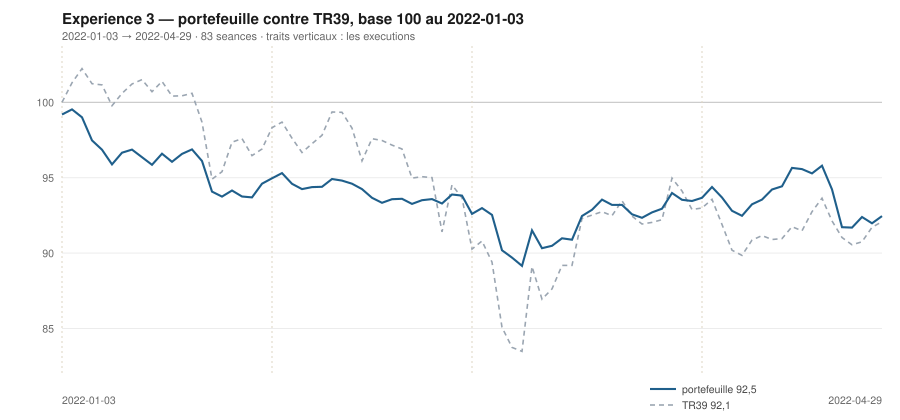

| | |
|---|---|
| Dotation initiale | 10 000,00 € au 2022-01-03 |
| Titres au 2022-04-29 | 5 216,04 € |
| Espèces | 4 029,53 € |
| **Total** | **9 245,57 €** |
| Base 100 | **92,46** |
| TR39, même base | 92,09 |
| Écart depuis janvier | **+0,37 pt** |

### Toutes les positions depuis le début de l'expérience

> Closes comme ouvertes. Une position encore ouverte laisse les deux dernières colonnes vides. Aucune séance postérieure au 2022-04-29 n'entre dans ce tableau.

| Société | Prix d'achat | Date d'achat | Prix de vente | Date de vente |
|---|---|---|---|---|
| `CAP.PA` Capgemini | 194,20 € | 2022-01-03 | 182,68 € | 2022-04-01 |
| `DSY.PA` Dassault Systèmes | 50,13 € | 2022-01-03 | 41,05 € | 2022-02-01 |
| `KER.PA` Kering | 558,25 € | 2022-03-01 |  |  |
| `HO.PA` Thales | 103,16 € | 2022-04-01 |  |  |
| `MT.AS` ArcelorMittal | 26,84 € | 2022-04-01 |  |  |

*5 positions depuis le début, dont 3 encore ouvertes : les deux dernières colonnes restent vides.*

## 5. L'étude chartiste au 2022-03-31

> Notes rédigées sans aucune séance postérieure au 2022-03-31, par l'agent `chartiste`. Cinq lignes au plus par société, **chacune sous la figure de décision qui la justifie** — celle que la règle a lue ce jour-là, portant les cinq critères, les vetos et le verdict.

### 1. `ORA.PA` — Orange

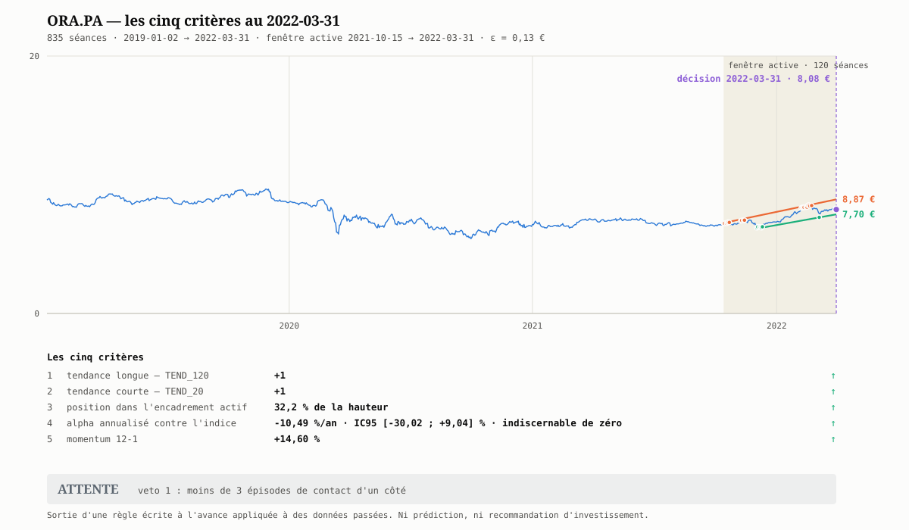

- Canal 7,70 – 8,87 €, clôture à 8,08 € à 32,2 % de la hauteur — sous le seuil de 35 %.
- Pentes +0,013 et +0,015 €/séance, quasi parallèles : τ infini.
- Deux contacts en support : veto 1.
- Momentum +14,6 %, alpha −10,5 %/an. Score le plus élevé de la date, et pourtant sous veto.

### 2. `TTE.PA` — TotalEnergies

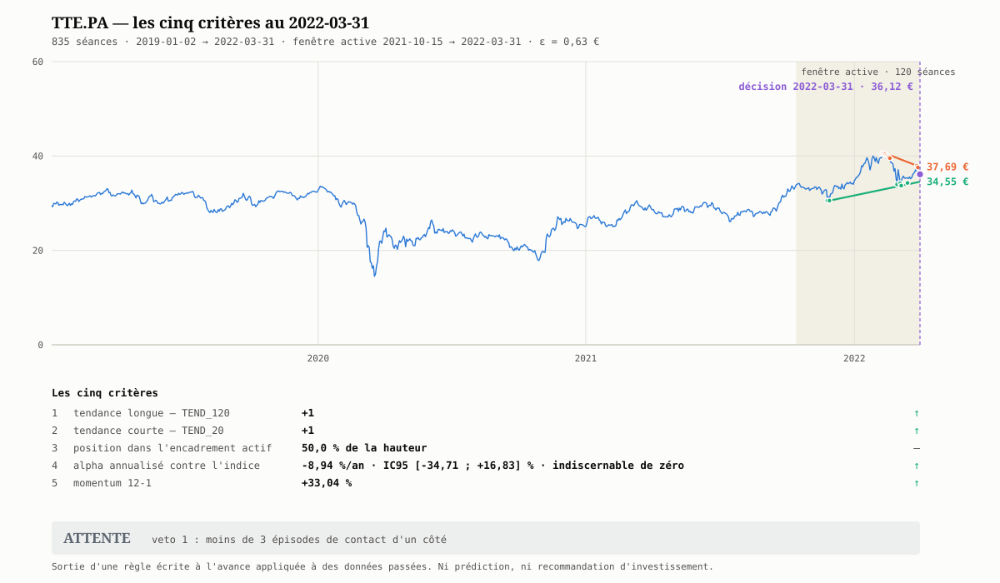

- Canal 34,55 – 37,69 €, clôture à 36,12 € à **50,0 % exactement** : le milieu du canal.
- Support +0,046 contre résistance −0,086 €/séance : τ de 24 séances, le canal se referme presque à la décision suivante.
- Quatre contacts bas, deux hauts : veto 1.
- Momentum +33,0 %, alpha −8,9 %/an.

### 3. `HO.PA` — Thales

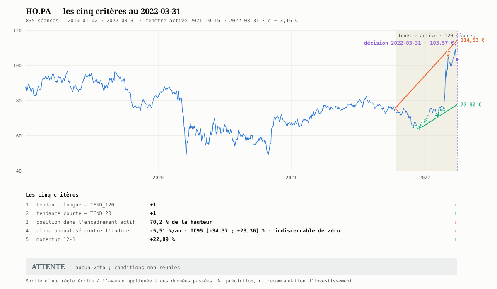

- Canal 77,82 – 114,53 €, clôture à 103,57 € à 70,2 % de la hauteur.
- Pentes +0,188 et +0,324 €/séance : ouverture, τ infini.
- Cinq contacts bas, trois hauts : **aucun veto** — figure lisible et tendances concordantes.
- Momentum +22,9 %, alpha −5,5 %/an.

### 4. `CA.PA` — Carrefour

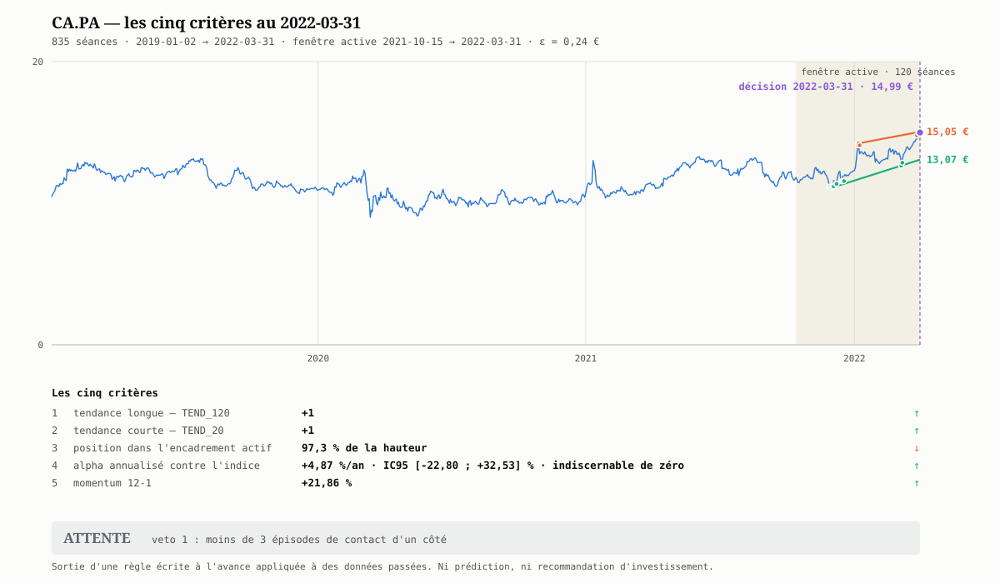

- Canal 13,07 – 15,05 €, clôture à 14,99 € à 97,3 % : contre le plafond.
- Pentes +0,023 et +0,014 €/séance, τ de 209 séances.
- Trois contacts bas, deux hauts : veto 1.
- Momentum +21,9 %, alpha +4,9 %/an.

### 5. `MT.AS` — ArcelorMittal

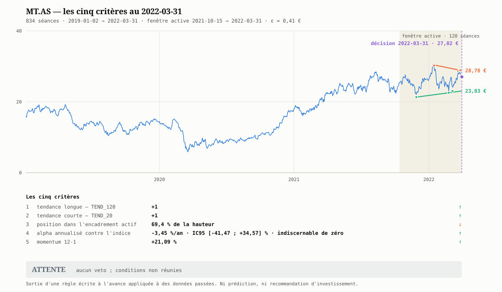

- Canal 23,03 – 28,78 €, clôture à 27,02 € à 69,4 %.
- Support +0,020 contre résistance −0,030 €/séance, τ de 115 séances.
- Trois contacts de chaque côté : **aucun veto**.
- Momentum +21,1 %, alpha −3,5 %/an sur un IC95 de 76 points.

### 6. `SAN.PA` — Sanofi

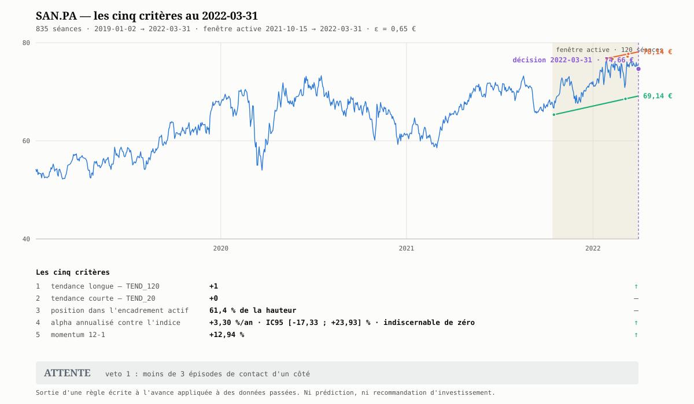

- Canal 69,14 – 78,14 €, clôture à 74,66 € à 61,4 % de la hauteur.
- Pentes +0,033 et +0,030 €/séance, presque identiques : τ de 4 229 séances.
- Deux contacts en support : veto 1 — les six épisodes de février n'ont pas tenu à la refonte de la fenêtre.
- Momentum +12,9 %, alpha +3,3 %/an.

### 7. `DG.PA` — Vinci

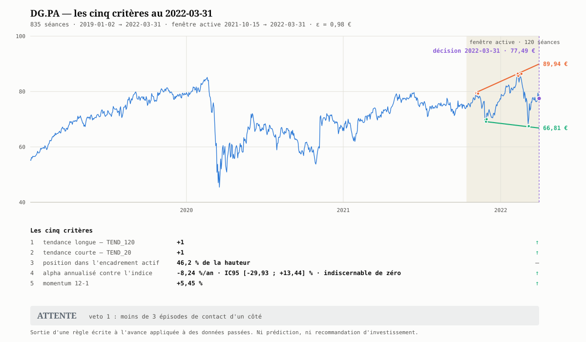

- Canal 66,81 – 89,94 €, large de 23,1 %, clôture à 77,49 € à 46,2 % : le milieu.
- Support −0,027 contre résistance +0,100 €/séance : le canal s'ouvre, τ infini.
- Deux contacts en support : veto 1.
- Momentum +5,5 %, alpha −8,2 %/an.

### 8. `VIE.PA` — Veolia

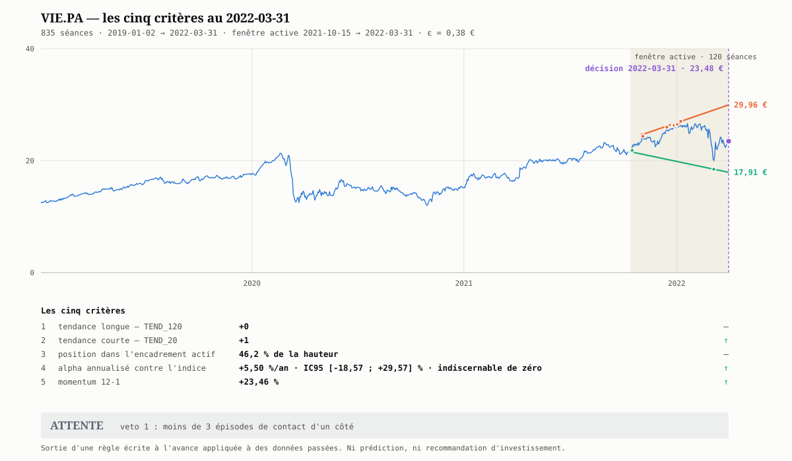

- Canal 17,91 – 29,96 €, très large — 12,1 % —, clôture à 23,48 € à 46,2 % : le milieu.
- Support −0,031 contre résistance +0,051 €/séance : ouverture, τ infini.
- Deux contacts en support : veto 1.
- Momentum +23,5 %, alpha +5,5 %/an ; la tendance longue est retombée à zéro.

### 9. `CS.PA` — AXA

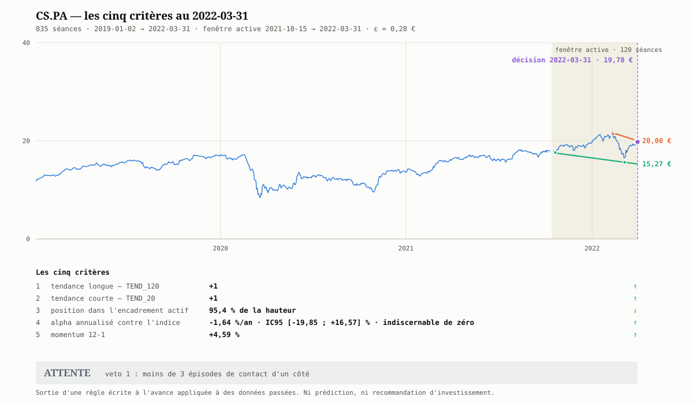

- Canal 15,27 – 20,00 €, clôture à 19,78 € à 95,4 % : sous le plafond.
- Deux droites descendantes, −0,020 et −0,047 €/séance, τ de 171 séances.
- Deux contacts de chaque côté : veto 1.
- Momentum +4,6 %, alpha −1,6 %/an.

### 10. `VIV.PA` — Vivendi

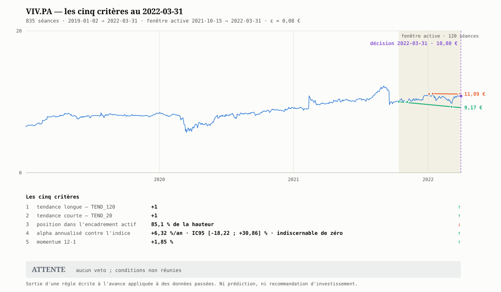

- Canal 9,17 – 11,09 €, clôture à 10,80 € à 85,1 % de la hauteur.
- Pentes −0,007 et −0,001 €/séance : ouverture lente, τ infini.
- Trois contacts de chaque côté : **aucun veto**.
- Momentum +1,9 %, alpha +6,3 %/an.

### 11. `PUB.PA` — Publicis

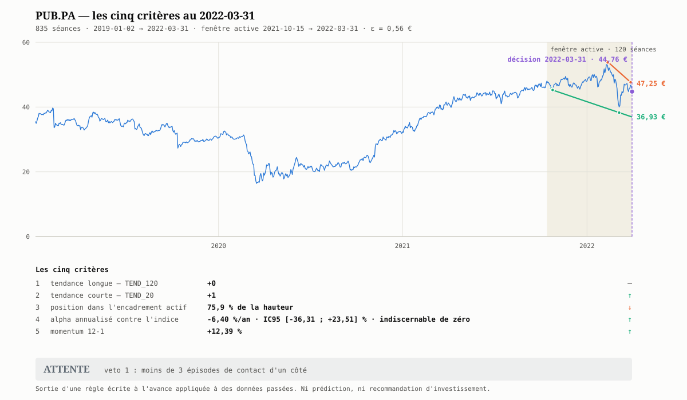

- Canal 36,93 – 47,25 €, clôture à 44,76 € à 75,9 % de la hauteur.
- Pentes −0,075 et −0,197 €/séance, τ de 84 séances.
- Deux contacts de chaque côté : veto 1.
- Momentum +12,4 %, alpha −6,4 %/an.

### 12. `AIR.PA` — Airbus

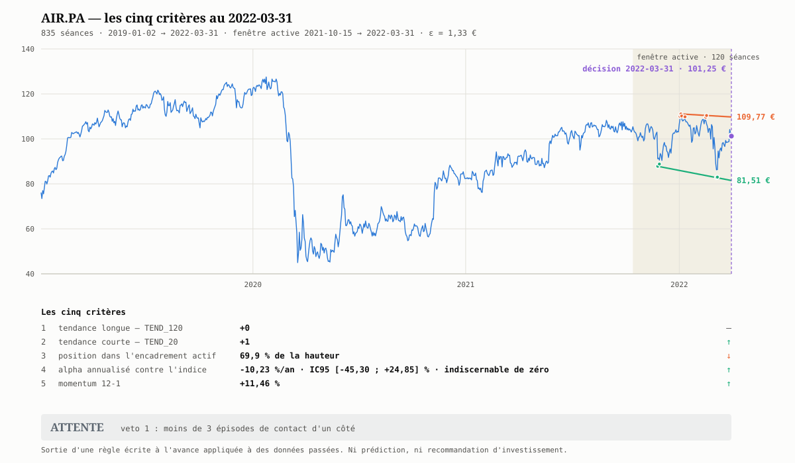

- Canal 81,51 – 109,77 €, clôture à 101,25 € à 69,9 %.
- Pentes −0,071 et −0,022 €/séance : ouverture vers le haut, τ infini.
- Deux contacts en support : veto 1.
- Momentum +11,5 %, alpha −10,2 %/an.

### 13. `ENGI.PA` — Engie

- Canal 6,43 – 10,23 €, d'une largeur de 3,8 % — la figure s'est brutalement élargie —, clôture à 8,06 € à 43,0 %.
- Pentes −0,011 et +0,010 €/séance : ouverture, τ infini.
- Deux contacts de chaque côté : veto 1.
- Momentum +2,6 %, alpha −11,9 %/an.

### 14. `AI.PA` — Air Liquide

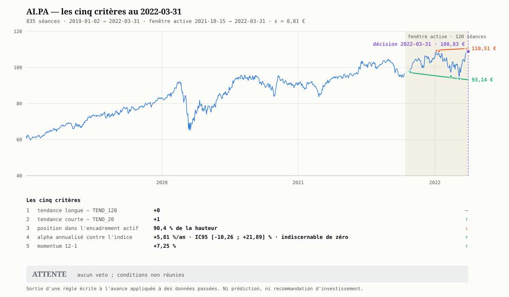

- Canal 93,14 – 110,51 €, clôture à 108,83 € à 90,4 % : contre la résistance.
- Support −0,036 contre résistance +0,015 €/séance : ouverture, τ infini.
- Trois contacts de chaque côté : **aucun veto**.
- Momentum +7,2 %, sous le seuil de dix ; alpha +5,8 %/an.

### 15. `RMS.PA` — Hermès International

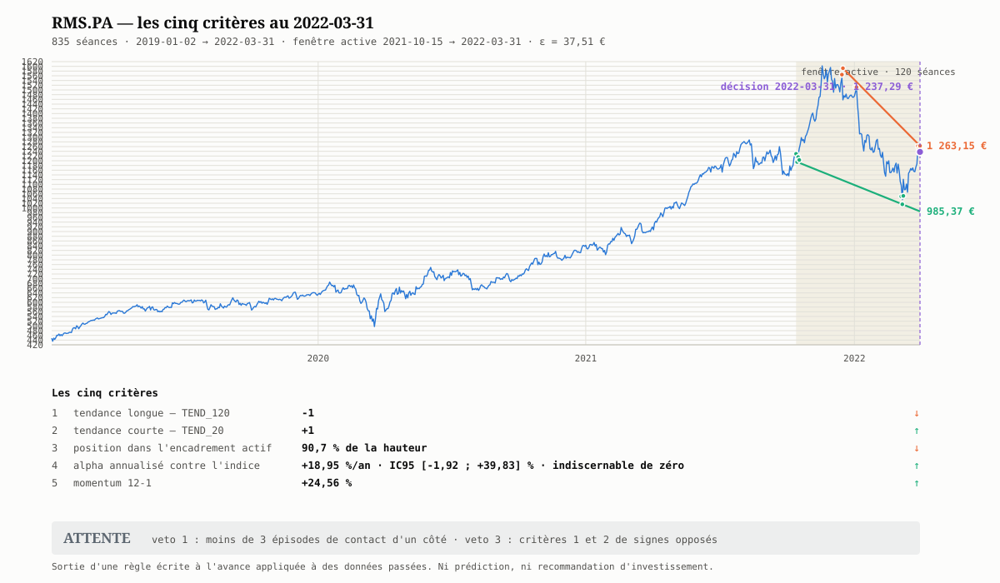

- Canal 985,37 – 1 263,15 €, d'une largeur de 278 €, clôture à 1 237,29 € à 90,7 % de la hauteur.
- Pentes −1,773 et −4,447 €/séance, τ de 104 séances.
- Deux contacts en support : veto 1 ; tendances opposées : veto 3.
- Momentum +24,6 %, **alpha +18,9 %/an, IC95 de −1,9 à +39,8** — le plus proche de la significativité.

### 16. `CAP.PA` — Capgemini

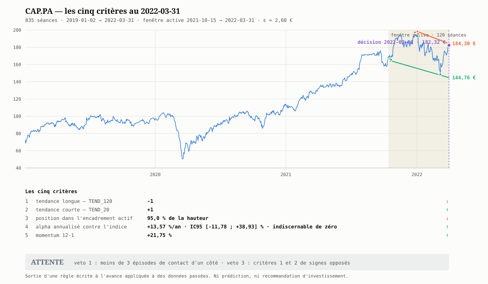

- Canal 144,76 – 184,30 €, clôture à 182,32 € à 95,0 % de la hauteur.
- Deux droites descendantes, −0,171 et −0,225 €/séance, τ de 728 séances.
- Deux contacts en support : veto 1 ; tendances opposées : veto 3.
- Momentum +21,8 %, alpha +13,6 %/an.

### 17. `DSY.PA` — Dassault Systèmes

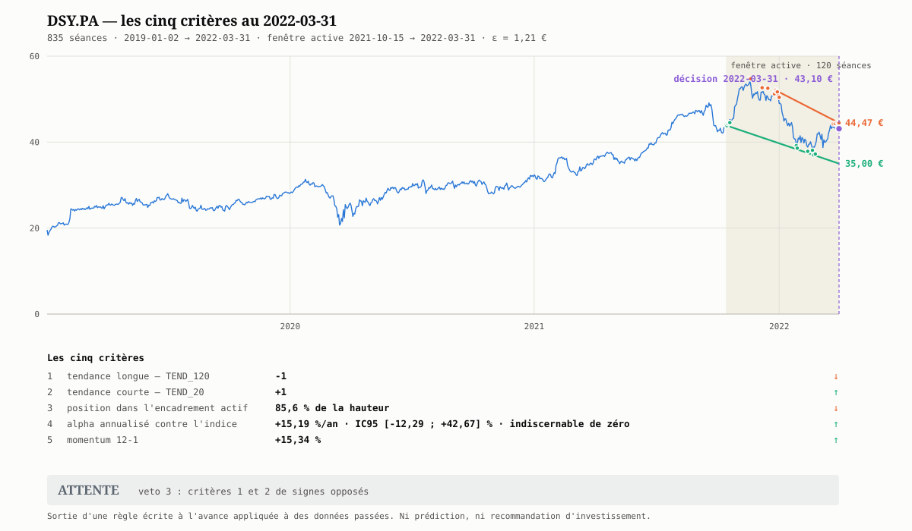

- Canal 35,00 – 44,47 €, clôture à 43,10 € à 85,6 %.
- Pentes −0,075 et −0,114 €/séance, τ de 245 séances.
- Quatre contacts bas, cinq hauts : figure bien étayée ; seul le veto 3 mord.
- Momentum +15,3 %, alpha +15,2 %/an.

### 18. `RI.PA` — Pernod Ricard

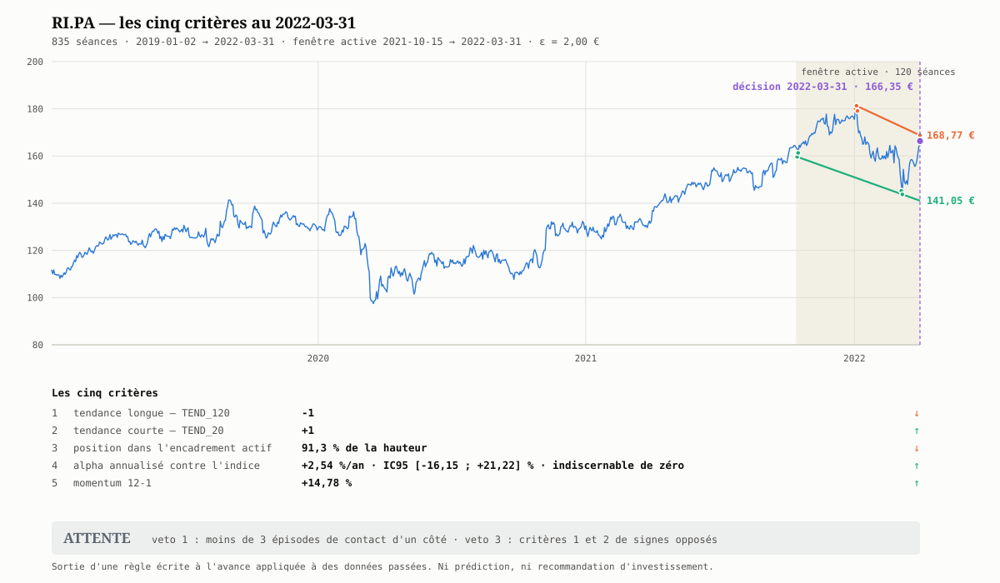

- Canal 141,05 – 168,77 €, clôture à 166,35 € à 91,3 %.
- Pentes −0,158 et −0,205 €/séance, τ de 582 séances.
- Deux contacts de chaque côté : veto 1 ; tendances opposées : veto 3.
- Momentum +14,8 %, alpha +2,5 %/an.

### 19. `STMPA.PA` — STMicroelectronics

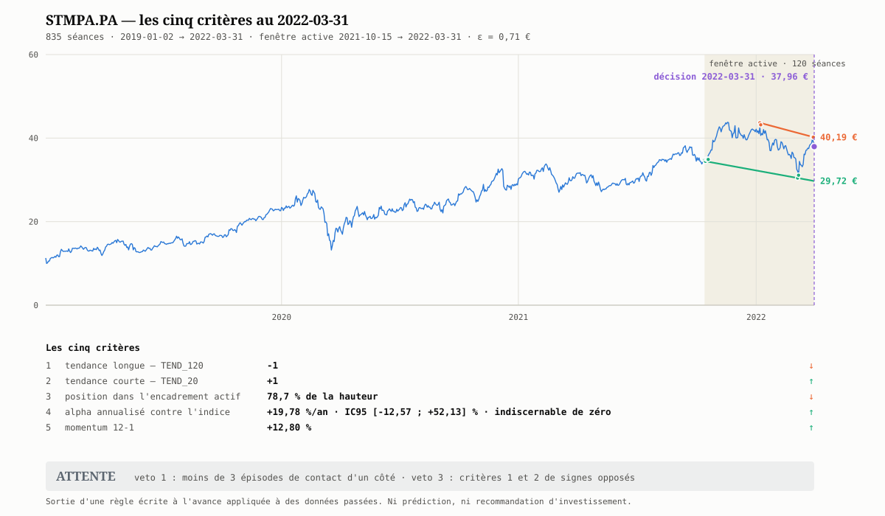

- Canal 29,72 – 40,19 €, clôture à 37,96 € à 78,7 %.
- Pentes −0,040 et −0,059 €/séance, τ de 559 séances.
- Deux contacts de chaque côté : veto 1 ; tendances opposées : veto 3.
- Momentum +12,8 %, alpha +19,8 %/an.

### 20. `EL.PA` — EssilorLuxottica

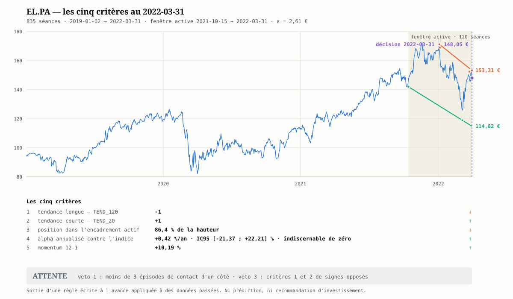

- Canal 114,82 – 153,31 €, large de 38,5 %, clôture à 148,05 € à 86,4 % de la hauteur.
- Deux droites descendantes, −0,229 et −0,294 €/séance, τ de 587 séances.
- Deux contacts en support : veto 1 ; tendances opposées : veto 3.
- Momentum +10,2 %, alpha +0,4 %/an.

### 21. `SGO.PA` — Saint-Gobain

- Canal 37,53 – 62,20 €, clôture à 46,97 € à 38,2 %.
- Support −0,115 contre résistance +0,073 €/séance : ouverture franche, τ infini.
- Deux contacts de chaque côté : veto 1 ; tendances opposées : veto 3.
- Momentum +4,3 %, alpha +3,4 %/an.

### 22. `STLAP.PA` — Stellantis

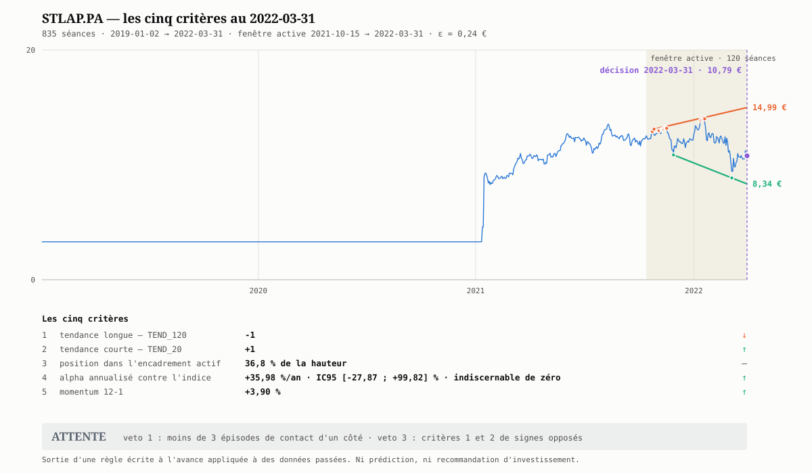

- Canal 8,34 – 14,99 €, clôture à 10,79 € à 36,8 % de la hauteur.
- Support −0,029 contre résistance +0,017 €/séance : ouverture, τ infini.
- Deux contacts en support : veto 1 ; tendances opposées : veto 3.
- Momentum +3,9 %, alpha +36,0 %/an sur un IC95 de 128 points.

### 23. `MC.PA` — LVMH

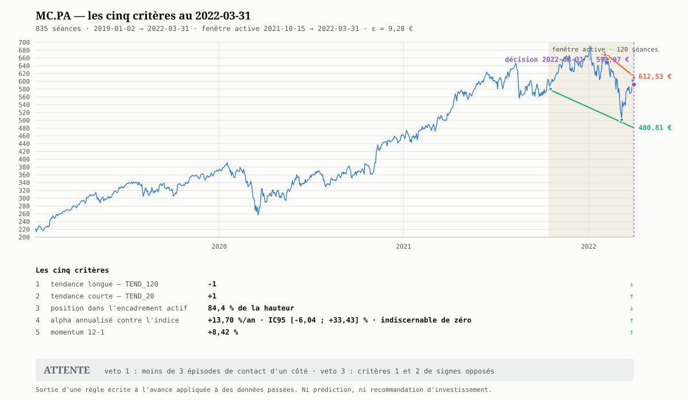

- Canal 480,81 – 612,53 €, clôture à 591,97 € à 84,4 % de la hauteur.
- Pentes −0,833 et −1,480 €/séance, τ de 204 séances.
- Deux contacts en support : veto 1 ; tendances opposées : veto 3.
- Momentum +8,4 %, alpha +13,7 %/an.

### 24. `GLE.PA` — Société Générale

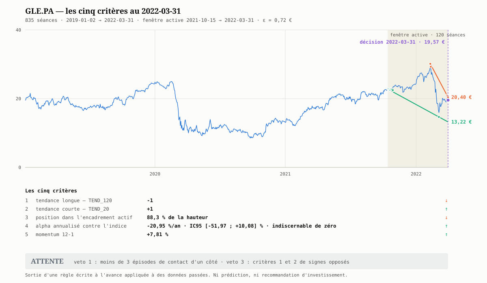

- Canal 13,22 – 20,40 €, clôture à 19,57 € à 88,3 % de la hauteur.
- Pentes −0,080 et −0,278 €/séance, τ de 36 séances.
- Deux contacts de chaque côté : veto 1 ; tendances opposées : veto 3.
- Momentum +7,8 %, alpha −20,9 %/an.

### 25. `SU.PA` — Schneider Electric

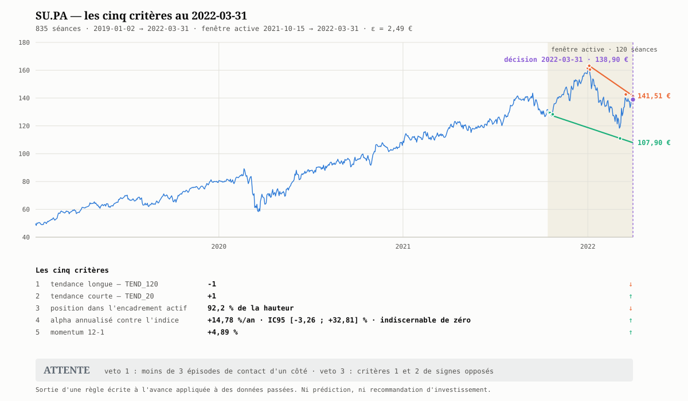

- Canal 107,90 – 141,51 €, clôture à 138,90 € à 92,2 % de la hauteur.
- Pentes −0,173 et −0,355 €/séance, τ de 184 séances.
- Deux contacts en support : veto 1 ; tendances opposées : veto 3.
- Momentum +4,9 %, alpha +14,8 %/an, IC95 de −3,3 à +32,8.

### 26. `ERF.PA` — Eurofins Scientific

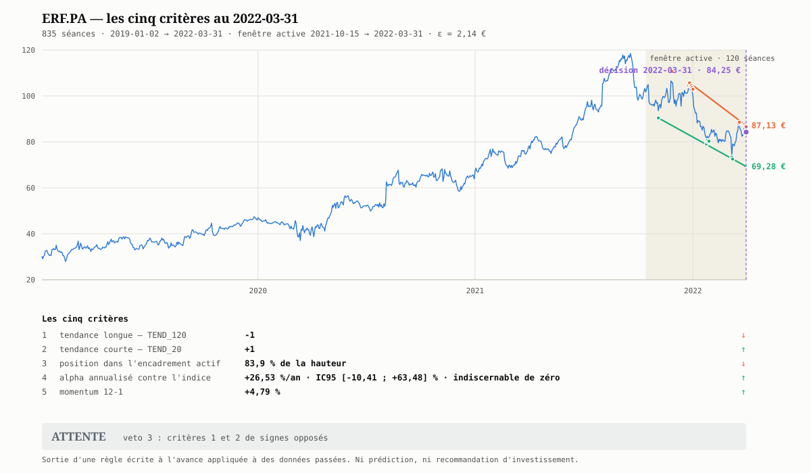

- Canal 69,28 – 87,13 €, clôture à 84,25 € à 83,9 %.
- Pentes −0,203 et −0,277 €/séance, τ de 241 séances.
- Trois contacts bas, quatre hauts : figure lisible ; veto 3 seul.
- Momentum +4,8 %, **alpha +26,5 %/an**, le plus élevé de la date.

### 27. `LR.PA` — Legrand

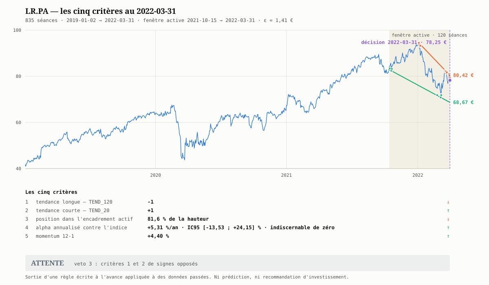

- Canal 68,67 – 80,42 €, clôture à 78,25 € à 81,6 %.
- Pentes −0,119 et −0,231 €/séance, τ de 106 séances.
- Quatre contacts bas, trois hauts : figure lisible ; veto 3.
- Momentum +4,4 %, alpha +5,3 %/an.

### 28. `OR.PA` — L'Oréal

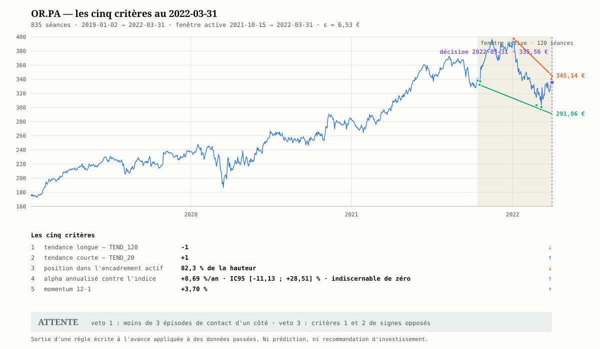

- Canal 291,06 – 345,14 €, clôture à 335,56 € à 82,3 %.
- Pentes −0,353 et −0,859 €/séance, τ de 107 séances.
- Deux contacts en résistance : veto 1 ; tendances opposées : veto 3.
- Momentum +3,7 %, alpha +8,7 %/an.

### 29. `BNP.PA` — BNP Paribas

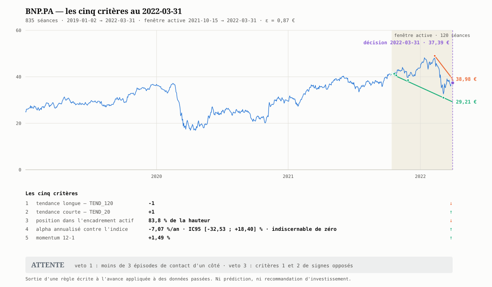

- Canal 29,21 – 38,98 €, clôture à 37,39 € à 83,8 % de la hauteur.
- Pentes −0,101 et −0,287 €/séance, τ de 53 séances.
- Deux contacts en résistance : veto 1 ; tendances opposées : veto 3.
- Momentum +1,5 %, alpha −7,1 %/an.

### 30. `TEP.PA` — Teleperformance

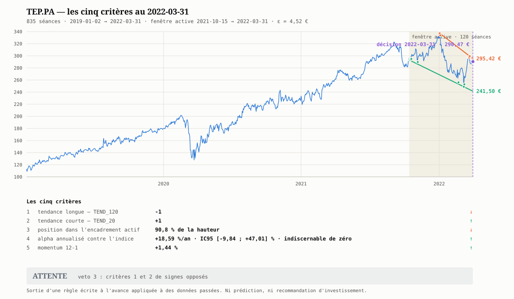

- Canal 241,50 – 295,42 €, clôture à 290,47 € à 90,8 %.
- Pentes −0,433 et −0,675 €/séance, τ de 223 séances.
- Quatre contacts bas, trois hauts : figure lisible ; veto 3 seul.
- Momentum +1,4 %, alpha +18,6 %/an.

### 31. `EN.PA` — Bouygues

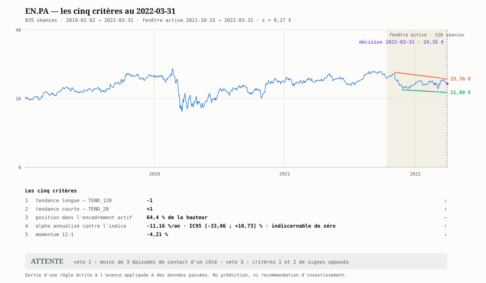

- Canal 21,80 – 25,76 €, clôture à 24,35 € à 64,4 % de la hauteur — un dixième sous le seuil haut.
- Pentes −0,009 et −0,018 €/séance, τ de 415 séances.
- Deux contacts en support : veto 1 ; tendances opposées : veto 3.
- Momentum −4,2 %, alpha −11,2 %/an.

### 32. `ML.PA` — Michelin

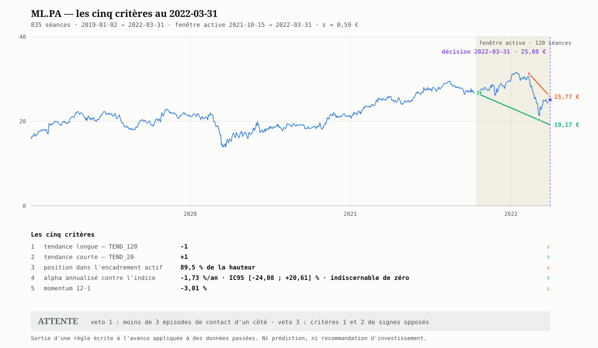

- Canal 19,17 – 25,77 €, clôture à 25,08 € à 89,5 %.
- Pentes −0,063 et −0,162 €/séance, τ de 67 séances.
- Deux contacts en résistance : veto 1 ; tendances opposées : veto 3.
- Momentum −3,0 %, alpha −1,7 %/an.

### 33. `SAF.PA` — Safran

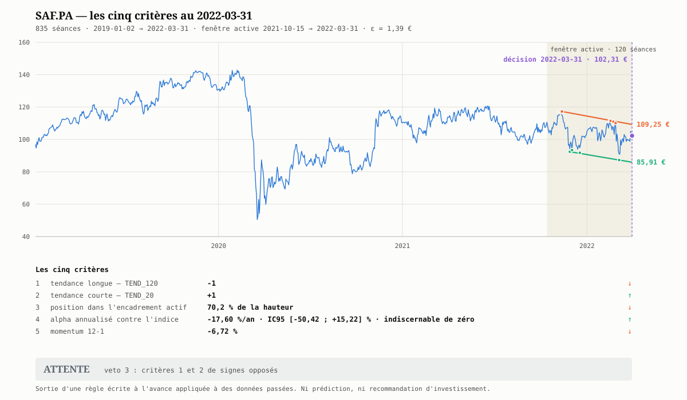

- Canal 85,91 – 109,25 €, clôture à 102,31 € à 70,2 %.
- Pentes −0,075 et −0,082 €/séance, presque parallèles : τ de 3 247 séances.
- Quatre contacts de chaque côté : figure bien étayée ; veto 3 seul.
- Momentum −6,7 %, alpha −17,6 %/an.

### 34. `BN.PA` — Danone

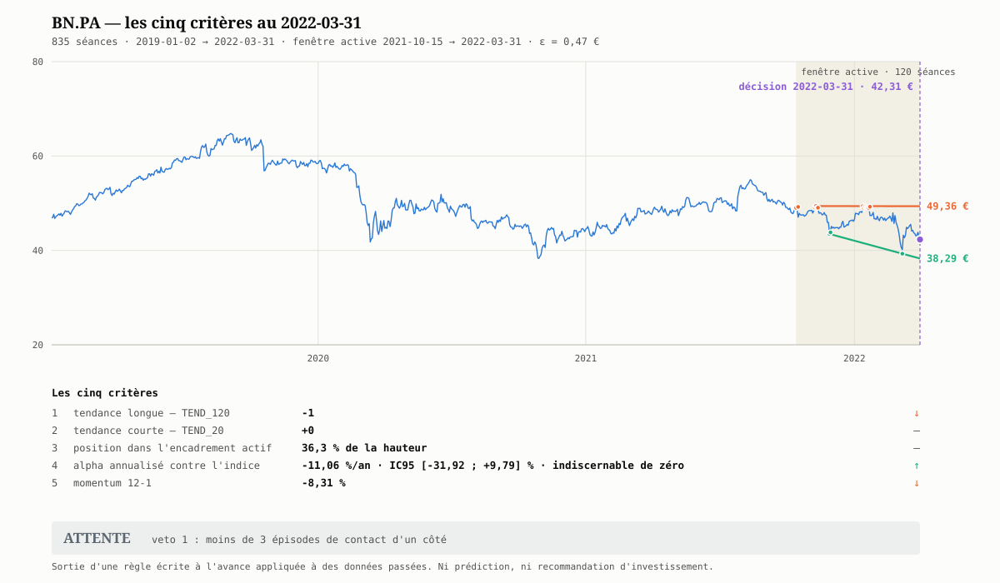

- Canal 38,29 – 49,36 €, clôture à 42,31 € à 36,3 % de la hauteur.
- Support −0,060 contre résistance −0,000 €/séance : ouverture, τ infini.
- Deux contacts en support : veto 1.
- Momentum −8,3 %, alpha −11,1 %/an.

### 35. `ACA.PA` — Crédit Agricole

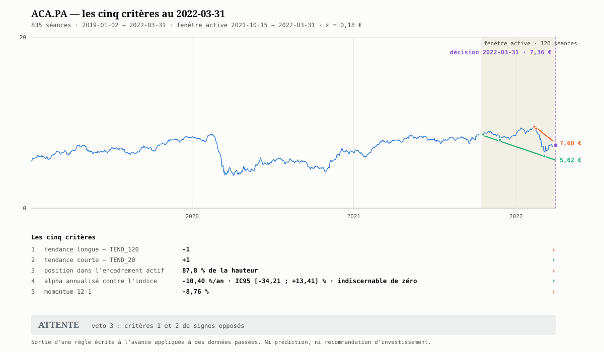

- Canal 5,62 – 7,60 €, clôture à 7,36 € à 87,8 %.
- Pentes −0,025 et −0,058 €/séance, τ de 60 séances.
- Trois contacts de chaque côté : figure lisible ; seul le veto 3 mord.
- Momentum −8,8 %, alpha −10,4 %/an.

### 36. `RNO.PA` — Renault

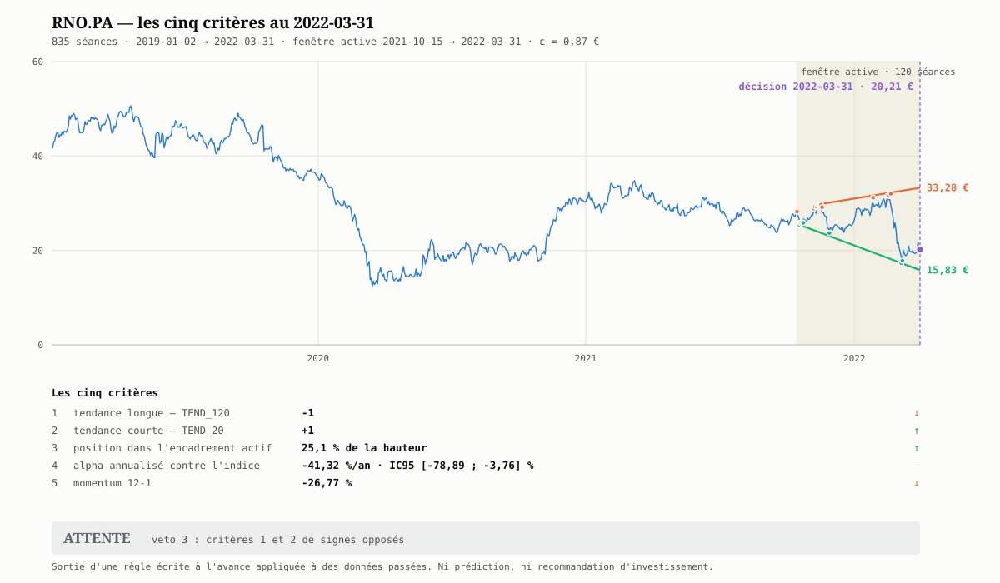

- Canal 15,83 – 33,28 €, d'une largeur de 17,4 %, clôture à 20,21 € à 25,1 % de la hauteur.
- Support −0,083 contre résistance +0,036 €/séance : ouverture franche, τ infini.
- Trois et quatre contacts : figure lisible ; veto 3.
- **Alpha significativement négatif** : −41,3 %/an, IC95 de −78,9 à −3,8. Momentum −26,8 %.

### 37. `WLN.PA` — Worldline

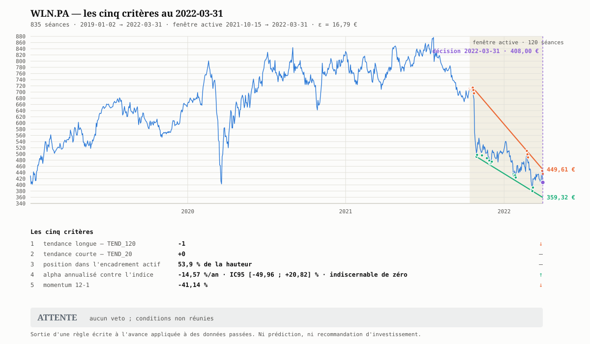

- Canal 359,32 – 449,61 €, clôture à 408,00 € à 53,9 % : le milieu.
- Pentes −1,219 et −2,322 €/séance, τ de 82 séances.
- Six contacts bas, trois hauts : **aucun veto** — la figure la mieux étayée de la date.
- Momentum −41,1 %, alpha −14,6 %/an.

### 38. `ALO.PA` — Alstom

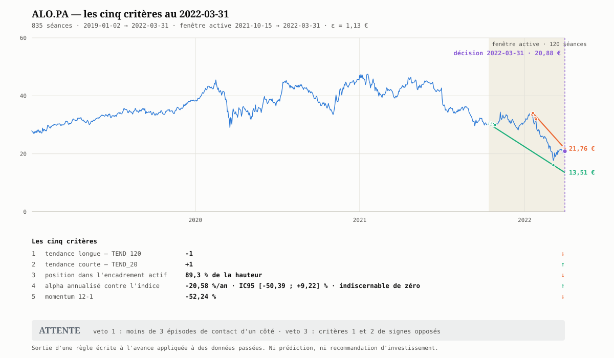

- Canal 13,51 – 21,76 €, clôture à 20,88 € à 89,3 % de la hauteur.
- Pentes −0,141 et −0,246 €/séance, τ de 79 séances.
- Deux contacts en support : veto 1 ; tendances opposées : veto 3.
- **Momentum −52,2 %, le plus faible de tout l'univers sur l'année** ; alpha −20,6 %/an.

### `KER.PA` — Kering — *hors classement*

*(figure absente)*

- **Évaluation impossible.** La règle sort en 2 : son contrôle de non-traversée de l'enveloppe convexe échoue, 88 séances passant du mauvais côté de la résistance.
- Aucun critère n'est publié, et le protocole traite le cas comme un veto : la valeur est exclue du classement, ne reçoit aucun rang, et ne peut ni être achetée ni décaler le rang d'une autre.
- Une figure qu'on ne sait pas calculer n'est pas une figure qu'on peut lire.

## 6. Le classement au 2022-03-31

> De la valeur la plus intéressante à détenir à celle qu'il faut fuir. La colonne **τ** donne la date de péremption du canal en séances, la colonne **Vetos** les numéros déclenchés. Une valeur sous veto ne peut pas être achetée.

| Rang | Valeur | `s1` | `s2` | `s3` | `s4` | `s5` | Score | Position | Momentum | τ | Vetos |
|---|---|---|---|---|---|---|---|---|---|---|---|
| 1 | `ORA.PA` Orange | +2 | +1 | +1 | +2 | +0 | **+6** | 32,2 % | +14,6 % | ∞ | 1 |
| 2 | `TTE.PA` TotalEnergies | +2 | +1 | +0 | +2 | +0 | **+5** | 50,0 % | +33,0 % | 23,9 | 1 |
| 3 | `HO.PA` Thales | +2 | +1 | -1 | +2 | +0 | **+4** | 70,2 % | +22,9 % | ∞ | — |
| 4 | `CA.PA` Carrefour | +2 | +1 | -1 | +2 | +0 | **+4** | 97,3 % | +21,9 % | 208,8 | 1 |
| 5 | `MT.AS` ArcelorMittal | +2 | +1 | -1 | +2 | +0 | **+4** | 69,4 % | +21,1 % | 114,7 | — |
| 6 | `SAN.PA` Sanofi | +2 | +0 | +0 | +2 | +0 | **+4** | 61,4 % | +12,9 % | 4 229,3 | 1 |
| 7 | `DG.PA` Vinci | +2 | +1 | +0 | +1 | +0 | **+4** | 46,2 % | +5,5 % | ∞ | 1 |
| 8 | `VIE.PA` Veolia | +0 | +1 | +0 | +2 | +0 | **+3** | 46,2 % | +23,5 % | ∞ | 1 |
| 9 | `CS.PA` AXA | +2 | +1 | -1 | +1 | +0 | **+3** | 95,4 % | +4,6 % | 170,7 | 1 |
| 10 | `VIV.PA` Vivendi | +2 | +1 | -1 | +1 | +0 | **+3** | 85,1 % | +1,9 % | ∞ | — |
| 11 | `PUB.PA` Publicis | +0 | +1 | -1 | +2 | +0 | **+2** | 75,9 % | +12,4 % | 84,3 | 1 |
| 12 | `AIR.PA` Airbus | +0 | +1 | -1 | +2 | +0 | **+2** | 69,9 % | +11,5 % | ∞ | 1 |
| 13 | `ENGI.PA` Engie | +0 | +1 | +0 | +1 | +0 | **+2** | 43,0 % | +2,6 % | ∞ | 1 |
| 14 | `AI.PA` Air Liquide | +0 | +1 | -1 | +1 | +0 | **+1** | 90,4 % | +7,2 % | ∞ | — |
| 15 | `RMS.PA` Hermès International | -2 | +1 | -1 | +2 | +0 | **+0** | 90,7 % | +24,6 % | 103,9 | 1 3 |
| 16 | `CAP.PA` Capgemini | -2 | +1 | -1 | +2 | +0 | **+0** | 95,0 % | +21,8 % | 728,2 | 1 3 |
| 17 | `DSY.PA` Dassault Systèmes | -2 | +1 | -1 | +2 | +0 | **+0** | 85,6 % | +15,3 % | 244,5 | 3 |
| 18 | `RI.PA` Pernod Ricard | -2 | +1 | -1 | +2 | +0 | **+0** | 91,3 % | +14,8 % | 582,0 | 1 3 |
| 19 | `STMPA.PA` STMicroelectronics | -2 | +1 | -1 | +2 | +0 | **+0** | 78,7 % | +12,8 % | 558,9 | 1 3 |
| 20 | `EL.PA` EssilorLuxottica | -2 | +1 | -1 | +2 | +0 | **+0** | 86,4 % | +10,2 % | 587,4 | 1 3 |
| 21 | `SGO.PA` Saint-Gobain | -2 | +1 | +0 | +1 | +0 | **+0** | 38,2 % | +4,3 % | ∞ | 1 3 |
| 22 | `STLAP.PA` Stellantis | -2 | +1 | +0 | +1 | +0 | **+0** | 36,8 % | +3,9 % | ∞ | 1 3 |
| 23 | `MC.PA` LVMH | -2 | +1 | -1 | +1 | +0 | **-1** | 84,4 % | +8,4 % | 203,7 | 1 3 |
| 24 | `GLE.PA` Société Générale | -2 | +1 | -1 | +1 | +0 | **-1** | 88,3 % | +7,8 % | 36,3 | 1 3 |
| 25 | `SU.PA` Schneider Electric | -2 | +1 | -1 | +1 | +0 | **-1** | 92,2 % | +4,9 % | 184,1 | 1 3 |
| 26 | `ERF.PA` Eurofins Scientific | -2 | +1 | -1 | +1 | +0 | **-1** | 83,9 % | +4,8 % | 240,7 | 3 |
| 27 | `LR.PA` Legrand | -2 | +1 | -1 | +1 | +0 | **-1** | 81,6 % | +4,4 % | 105,5 | 3 |
| 28 | `OR.PA` L'Oréal | -2 | +1 | -1 | +1 | +0 | **-1** | 82,3 % | +3,7 % | 107,1 | 1 3 |
| 29 | `BNP.PA` BNP Paribas | -2 | +1 | -1 | +1 | +0 | **-1** | 83,8 % | +1,5 % | 52,5 | 1 3 |
| 30 | `TEP.PA` Teleperformance | -2 | +1 | -1 | +1 | +0 | **-1** | 90,8 % | +1,4 % | 223,1 | 3 |
| 31 | `EN.PA` Bouygues | -2 | +1 | +0 | -1 | +0 | **-2** | 64,4 % | -4,2 % | 414,6 | 1 3 |
| 32 | `ML.PA` Michelin | -2 | +1 | -1 | -1 | +0 | **-3** | 89,5 % | -3,0 % | 66,8 | 1 3 |
| 33 | `SAF.PA` Safran | -2 | +1 | -1 | -1 | +0 | **-3** | 70,2 % | -6,7 % | 3 246,7 | 3 |
| 34 | `BN.PA` Danone | -2 | +0 | +0 | -1 | +0 | **-3** | 36,3 % | -8,3 % | ∞ | 1 |
| 35 | `ACA.PA` Crédit Agricole | -2 | +1 | -1 | -1 | +0 | **-3** | 87,8 % | -8,8 % | 59,6 | 3 |
| 36 | `RNO.PA` Renault | -2 | +1 | +1 | -2 | -1 | **-3** | 25,1 % | -26,8 % | ∞ | 3 |
| 37 | `WLN.PA` Worldline | -2 | +0 | +0 | -2 | +0 | **-4** | 53,9 % | -41,1 % | 81,9 | — |
| 38 | `ALO.PA` Alstom | -2 | +1 | -1 | -2 | +0 | **-4** | 89,3 % | -52,2 % | 79,0 | 1 3 |

**Non classées** — la règle n'a rien produit :

- `KER.PA` Kering — code 2 : Contrôle de non-traversée en échec : 88 séances du mauvais côté de la resistance.

## 7. Les ordres exécutés au 2022-04-01

> À l'**ouverture** de la séance, jamais à la clôture du 2022-03-31.

| Sens | Valeur | Quantité | Prix d'exécution | Brut | Frais | Motif |
|---|---|---|---|---|---|---|
| **Vente** | `CAP.PA` Capgemini | 10 | 182,68 € | 1 826,77 € | 2,10 € | rang 16 au-dela de 7 |
| **Achat** | `HO.PA` Thales | 18 | 103,16 € | 1 856,94 € | 7,71 € | rang 3, score +4, aucun veto |
| **Achat** | `MT.AS` ArcelorMittal | 72 | 26,84 € | 1 932,41 € | 2,22 € | rang 5, score +4, aucun veto |

## 8. La lecture du mois

Sur le mois, la meilleure contribution vient de `HO.PA` (Thales) pour **+131,36 €**, la moins bonne de `KER.PA` (Kering) pour **-165,08 €**. Les 3 ordres du mois ont coûté **12,03 €** de frais, soit 0,120 % de la dotation initiale. Le portefeuille termine le mois **derrière TR39** de 0,20 point. Sur les 42 thèses du mois précédent qui ont pu être tranchées, **25 sont confirmées** — 59,5 %.

## 9. Les thèses écrites au 2022-03-31

> Elles seront dépouillées à la prochaine date de décision, dans le fichier du mois suivant. Elles sont engendrées mécaniquement par les règles du [protocole](../README.md#le-registre-des-thèses-réfutables) — aucune n'est rédigée à la main.

| Valeur | Thèse | Énoncé, à dépouiller au mois suivant |
|---|---|---|
| `ACA.PA` | Canal | clôture entre 5,15 € et 6,49 € au 2022-04-29 |
| `ACA.PA` | Reflexive | AUCUNE SEQUENCE : écart contre TR39 dans ± 4,88 pt (σ̂), au 2022-04-29 |
| `AI.PA` | Canal | clôture entre 92,46 € et 110,79 € au 2022-04-29 |
| `AIR.PA` | Canal | clôture entre 80,16 € et 109,35 € au 2022-04-29 |
| `ALO.PA` | Canal | clôture entre 10,82 € et 17,09 € au 2022-04-29 |
| `ALO.PA` | Reflexive | AUCUNE SEQUENCE : écart contre TR39 dans ± 7,53 pt (σ̂), au 2022-04-29 |
| `BN.PA` | Canal | clôture entre 37,16 € et 49,35 € au 2022-04-29 |
| `BNP.PA` | Canal | clôture entre 27,30 € et 33,53 € au 2022-04-29 |
| `BNP.PA` | Reflexive | AUCUNE SEQUENCE : écart contre TR39 dans ± 5,98 pt (σ̂), au 2022-04-29 |
| `CA.PA` | Canal | clôture entre 13,51 € et 15,31 € au 2022-04-29 |
| `CAP.PA` | Canal | clôture entre 141,51 € et 180,02 € au 2022-04-29 |
| `CS.PA` | Canal | clôture entre 14,90 € et 19,10 € au 2022-04-29 |
| `CS.PA` | Reflexive | AUTO-RENFORCEMENT : écart contre TR39 au-dessus de +2,56 pt (0,5 σ̂), au 2022-04-29 |
| `DG.PA` | Canal | clôture entre 66,30 € et 91,83 € au 2022-04-29 |
| `DSY.PA` | Canal | clôture entre 33,58 € et 42,31 € au 2022-04-29 |
| `EL.PA` | Canal | clôture entre 110,47 € et 147,71 € au 2022-04-29 |
| `EN.PA` | Canal | clôture entre 21,63 € et 25,41 € au 2022-04-29 |
| `ENGI.PA` | Canal | clôture entre 6,23 € et 10,43 € au 2022-04-29 |
| `ERF.PA` | Canal | clôture entre 65,42 € et 81,86 € au 2022-04-29 |
| `ERF.PA` | Reflexive | AUCUNE SEQUENCE : écart contre TR39 dans ± 9,91 pt (σ̂), au 2022-04-29 |
| `GLE.PA` | Canal | clôture entre 11,69 € et 15,12 € au 2022-04-29 |
| `GLE.PA` | Reflexive | AUCUNE SEQUENCE : écart contre TR39 dans ± 7,61 pt (σ̂), au 2022-04-29 |
| `HO.PA` | Canal | clôture entre 81,39 € et 120,68 € au 2022-04-29 |
| `KER.PA` | Canal | clôture entre — € et — € au 2022-04-29 |
| `LR.PA` | Canal | clôture entre 66,40 € et 76,04 € au 2022-04-29 |
| `MC.PA` | Canal | clôture entre 464,99 € et 584,42 € au 2022-04-29 |
| `ML.PA` | Canal | clôture entre 17,97 € et 22,69 € au 2022-04-29 |
| `MT.AS` | Canal | clôture entre 23,40 € et 28,20 € au 2022-04-29 |
| `MT.AS` | Reflexive | AUTO-RENFORCEMENT : écart contre TR39 au-dessus de +5,13 pt (0,5 σ̂), au 2022-04-29 |
| `OR.PA` | Canal | clôture entre 284,34 € et 328,83 € au 2022-04-29 |
| `ORA.PA` | Canal | clôture entre 7,95 € et 9,16 € au 2022-04-29 |
| `PUB.PA` | Canal | clôture entre 35,51 € et 43,50 € au 2022-04-29 |
| `RI.PA` | Canal | clôture entre 138,06 € et 164,87 € au 2022-04-29 |
| `RMS.PA` | Canal | clôture entre 951,69 € et 1 178,65 € au 2022-04-29 |
| `RNO.PA` | Canal | clôture entre 14,25 € et 33,97 € au 2022-04-29 |
| `SAF.PA` | Canal | clôture entre 84,49 € et 107,70 € au 2022-04-29 |
| `SAN.PA` | Canal | clôture entre 69,76 € et 78,72 € au 2022-04-29 |
| `SGO.PA` | Canal | clôture entre 35,34 € et 63,60 € au 2022-04-29 |
| `STLAP.PA` | Canal | clôture entre 7,79 € et 15,31 € au 2022-04-29 |
| `STMPA.PA` | Canal | clôture entre 28,96 € et 39,07 € au 2022-04-29 |
| `SU.PA` | Canal | clôture entre 104,62 € et 134,76 € au 2022-04-29 |
| `TEP.PA` | Canal | clôture entre 233,26 € et 282,59 € au 2022-04-29 |
| `TEP.PA` | Reflexive | AUCUNE SEQUENCE : écart contre TR39 dans ± 5,54 pt (σ̂), au 2022-04-29 |
| `TTE.PA` | Canal | clôture entre 35,42 € et 36,06 € au 2022-04-29 |
| `VIE.PA` | Canal | clôture entre 17,32 € et 30,92 € au 2022-04-29 |
| `VIV.PA` | Canal | clôture entre 9,04 € et 11,07 € au 2022-04-29 |
| `VIV.PA` | Reflexive | AUTO-RENFORCEMENT : écart contre TR39 au-dessus de +2,87 pt (0,5 σ̂), au 2022-04-29 |
| `WLN.PA` | Canal | clôture entre 336,16 € et 405,49 € au 2022-04-29 |
| `WLN.PA` | Reflexive | AUCUNE SEQUENCE : écart contre TR39 dans ± 10,28 pt (σ̂), au 2022-04-29 |

---

[← Mars](2022-03.md) · [Protocole](../README.md) · [Mai →](2022-05.md)
