# Mai 2022

> Journal de l'[expérience 3](../README.md) · **décision au 2022-04-29** · **exécution au 2022-05-02**
> Portefeuille au 2022-05-31 : **9 305,78 €** (base 93,06) · TR39 92,44 · alpha du mois **+0,27 pt** · depuis janvier **+0,62 pt**

---

## 1. Les actualités du mois précédent

**Avril 2022.** Le rebond de mars ne tient pas. L'inflation américaine atteint
8,5 % sur un an, l'européenne 7,4 %, et le marché intègre des hausses de taux
d'un demi-point. Le Nasdaq perd plus de 13 % sur le mois, sa pire performance
depuis 2008.

La Chine confine Shanghai pendant plusieurs semaines au nom de la politique
« zéro Covid », désorganisant les chaînes d'approvisionnement et pesant sur le
luxe, très exposé à la clientèle chinoise. En France, l'élection présidentielle
se joue le 24 avril. L'euro glisse sous 1,06 dollar.

## 2. Le dépouillement des thèses écrites au 2022-03-31

> Piste **S4**. Ces énoncés ont été écrits le mois dernier, avant de connaître ce mois-ci. Aucun n'a été retouché ; le verdict est calculé.

| Valeur | Thèse | Énoncé | Constaté | Verdict |
|---|---|---|---|---|
| `ACA.PA` | Canal | clôture entre 5,15 € et 6,49 € au 2022-04-29 | 7,02 € | démentie |
| `ACA.PA` | Reflexive | AUCUNE SEQUENCE : écart contre TR39 dans ± 4,88 pt (σ̂), au 2022-04-29 | -3,82 pt | **confirmée** |
| `AI.PA` | Canal | clôture entre 92,46 € et 110,79 € au 2022-04-29 | 113,23 € | démentie |
| `AIR.PA` | Canal | clôture entre 80,16 € et 109,35 € au 2022-04-29 | 98,21 € | **confirmée** |
| `ALO.PA` | Canal | clôture entre 10,82 € et 17,09 € au 2022-04-29 | 20,73 € | démentie |
| `ALO.PA` | Reflexive | AUCUNE SEQUENCE : écart contre TR39 dans ± 7,53 pt (σ̂), au 2022-04-29 | 0,16 pt | **confirmée** |
| `BN.PA` | Canal | clôture entre 37,16 € et 49,35 € au 2022-04-29 | 48,75 € | **confirmée** |
| `BNP.PA` | Canal | clôture entre 27,30 € et 33,53 € au 2022-04-29 | 35,79 € | démentie |
| `BNP.PA` | Reflexive | AUCUNE SEQUENCE : écart contre TR39 dans ± 5,98 pt (σ̂), au 2022-04-29 | -3,42 pt | **confirmée** |
| `CA.PA` | Canal | clôture entre 13,51 € et 15,31 € au 2022-04-29 | 15,39 € | démentie |
| `CAP.PA` | Canal | clôture entre 141,51 € et 180,02 € au 2022-04-29 | 176,55 € | **confirmée** |
| `CS.PA` | Canal | clôture entre 14,90 € et 19,10 € au 2022-04-29 | 18,95 € | **confirmée** |
| `CS.PA` | Reflexive | AUTO-RENFORCEMENT : écart contre TR39 au-dessus de +2,56 pt (0,5 σ̂), au 2022-04-29 | -3,29 pt | démentie |
| `DG.PA` | Canal | clôture entre 66,30 € et 91,83 € au 2022-04-29 | 79,26 € | **confirmée** |
| `DSY.PA` | Canal | clôture entre 33,58 € et 42,31 € au 2022-04-29 | 41,00 € | **confirmée** |
| `EL.PA` | Canal | clôture entre 110,47 € et 147,71 € au 2022-04-29 | 145,83 € | **confirmée** |
| `EN.PA` | Canal | clôture entre 21,63 € et 25,41 € au 2022-04-29 | 25,29 € | **confirmée** |
| `ENGI.PA` | Canal | clôture entre 6,23 € et 10,43 € au 2022-04-29 | 8,23 € | **confirmée** |
| `ERF.PA` | Canal | clôture entre 65,42 € et 81,86 € au 2022-04-29 | 83,14 € | démentie |
| `ERF.PA` | Reflexive | AUCUNE SEQUENCE : écart contre TR39 dans ± 9,91 pt (σ̂), au 2022-04-29 | -0,46 pt | **confirmée** |
| `GLE.PA` | Canal | clôture entre 11,69 € et 15,12 € au 2022-04-29 | 18,53 € | démentie |
| `GLE.PA` | Reflexive | AUCUNE SEQUENCE : écart contre TR39 dans ± 7,61 pt (σ̂), au 2022-04-29 | -4,41 pt | **confirmée** |
| `HO.PA` | Canal | clôture entre 81,39 € et 120,68 € au 2022-04-29 | 110,89 € | **confirmée** |
| `KER.PA` | Canal | clôture entre — € et — € au 2022-04-29 | 451,01 € | **confirmée** |
| `LR.PA` | Canal | clôture entre 66,40 € et 76,04 € au 2022-04-29 | 76,78 € | démentie |
| `MC.PA` | Canal | clôture entre 464,99 € et 584,42 € au 2022-04-29 | 571,21 € | **confirmée** |
| `ML.PA` | Canal | clôture entre 17,97 € et 22,69 € au 2022-04-29 | 24,28 € | démentie |
| `MT.AS` | Canal | clôture entre 23,40 € et 28,20 € au 2022-04-29 | 25,93 € | **confirmée** |
| `MT.AS` | Reflexive | AUTO-RENFORCEMENT : écart contre TR39 au-dessus de +5,13 pt (0,5 σ̂), au 2022-04-29 | -3,18 pt | *zone morte* |
| `OR.PA` | Canal | clôture entre 284,34 € et 328,83 € au 2022-04-29 | 326,40 € | **confirmée** |
| `ORA.PA` | Canal | clôture entre 7,95 € et 9,16 € au 2022-04-29 | 8,54 € | **confirmée** |
| `PUB.PA` | Canal | clôture entre 35,51 € et 43,50 € au 2022-04-29 | 46,64 € | démentie |
| `RI.PA` | Canal | clôture entre 138,06 € et 164,87 € au 2022-04-29 | 164,97 € | démentie |
| `RMS.PA` | Canal | clôture entre 951,69 € et 1 178,65 € au 2022-04-29 | 1 141,79 € | **confirmée** |
| `RNO.PA` | Canal | clôture entre 14,25 € et 33,97 € au 2022-04-29 | 19,96 € | **confirmée** |
| `SAF.PA` | Canal | clôture entre 84,49 € et 107,70 € au 2022-04-29 | 98,42 € | **confirmée** |
| `SAN.PA` | Canal | clôture entre 69,76 € et 78,72 € au 2022-04-29 | 81,66 € | démentie |
| `SGO.PA` | Canal | clôture entre 35,34 € et 63,60 € au 2022-04-29 | 48,75 € | **confirmée** |
| `STLAP.PA` | Canal | clôture entre 7,79 € et 15,31 € au 2022-04-29 | 10,24 € | **confirmée** |
| `STMPA.PA` | Canal | clôture entre 28,96 € et 39,07 € au 2022-04-29 | 34,26 € | **confirmée** |
| `SU.PA` | Canal | clôture entre 104,62 € et 134,76 € au 2022-04-29 | 125,70 € | **confirmée** |
| `TEP.PA` | Canal | clôture entre 233,26 € et 282,59 € au 2022-04-29 | 290,26 € | démentie |
| `TEP.PA` | Reflexive | AUCUNE SEQUENCE : écart contre TR39 dans ± 5,54 pt (σ̂), au 2022-04-29 | 0,79 pt | **confirmée** |
| `TTE.PA` | Canal | clôture entre 35,42 € et 36,06 € au 2022-04-29 | 37,05 € | démentie |
| `VIE.PA` | Canal | clôture entre 17,32 € et 30,92 € au 2022-04-29 | 22,52 € | **confirmée** |
| `VIV.PA` | Canal | clôture entre 9,04 € et 11,07 € au 2022-04-29 | 10,22 € | **confirmée** |
| `VIV.PA` | Reflexive | AUTO-RENFORCEMENT : écart contre TR39 au-dessus de +2,87 pt (0,5 σ̂), au 2022-04-29 | -4,51 pt | démentie |
| `WLN.PA` | Canal | clôture entre 336,16 € et 405,49 € au 2022-04-29 | 391,10 € | **confirmée** |
| `WLN.PA` | Reflexive | AUCUNE SEQUENCE : écart contre TR39 dans ± 10,28 pt (σ̂), au 2022-04-29 | -3,27 pt | **confirmée** |

## 3. L'exposition héritée au 2022-04-29

| Valeur | Achetée le | Prix d'achat | +/− value | Alpha du mois | Alpha global |
|---|---|---|---|---|---|
| `HO.PA` Thales | 2022-04-01 | 103,16 € | **+7,49 %** | +8,46 pt *(partiel)* | +8,46 pt |
| `KER.PA` Kering | 2022-03-01 | 558,25 € | **-19,21 %** | -10,01 pt | -21,23 pt |
| `MT.AS` ArcelorMittal | 2022-04-01 | 26,84 € | **-3,38 %** | -2,41 pt *(partiel)* | -2,41 pt |

Lignes **conservées sans ordre**, faute de classement :

- `KER.PA` Kering — hors classement du jour : conservee sans ordre

## 4. Le portefeuille depuis le 2022-01-03

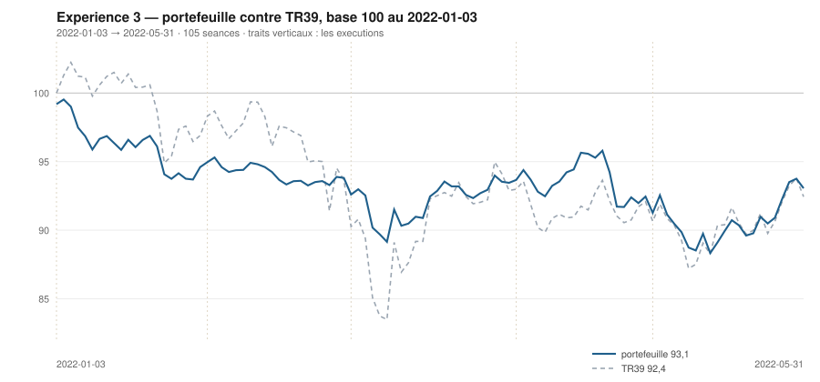

| | |
|---|---|
| Dotation initiale | 10 000,00 € au 2022-01-03 |
| Titres au 2022-05-31 | 5 276,25 € |
| Espèces | 4 029,53 € |
| **Total** | **9 305,78 €** |
| Base 100 | **93,06** |
| TR39, même base | 92,44 |
| Écart depuis janvier | **+0,62 pt** |

### Toutes les positions depuis le début de l'expérience

> Closes comme ouvertes. Une position encore ouverte laisse les deux dernières colonnes vides. Aucune séance postérieure au 2022-05-31 n'entre dans ce tableau.

| Société | Prix d'achat | Date d'achat | Prix de vente | Date de vente |
|---|---|---|---|---|
| `CAP.PA` Capgemini | 194,20 € | 2022-01-03 | 182,68 € | 2022-04-01 |
| `DSY.PA` Dassault Systèmes | 50,13 € | 2022-01-03 | 41,05 € | 2022-02-01 |
| `KER.PA` Kering | 558,25 € | 2022-03-01 |  |  |
| `HO.PA` Thales | 103,16 € | 2022-04-01 |  |  |
| `MT.AS` ArcelorMittal | 26,84 € | 2022-04-01 |  |  |

*5 positions depuis le début, dont 3 encore ouvertes : les deux dernières colonnes restent vides.*

## 5. L'étude chartiste au 2022-04-29

> Notes rédigées sans aucune séance postérieure au 2022-04-29, par l'agent `chartiste`. Cinq lignes au plus par société, **chacune sous la figure de décision qui la justifie** — celle que la règle a lue ce jour-là, portant les cinq critères, les vetos et le verdict.

### 1. `HO.PA` — Thales

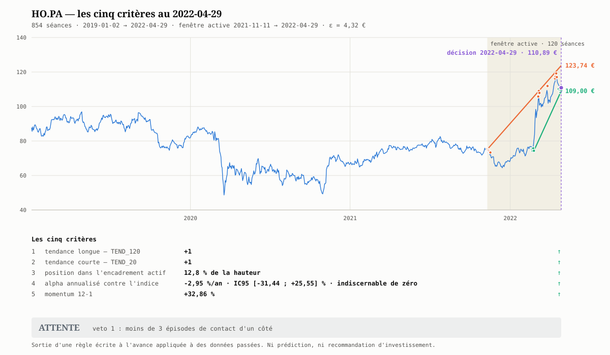

- Canal 109,00 – 123,74 €, clôture à 110,89 € à 12,8 % de la hauteur : contre le support.
- Support +0,788 contre résistance +0,409 €/séance, τ de 39 séances.
- Deux contacts en support : veto 1 — le seul défaut d'une figure par ailleurs franche.
- Momentum +32,9 %, le deuxième de la date ; alpha −3,0 %/an.

### 2. `CA.PA` — Carrefour

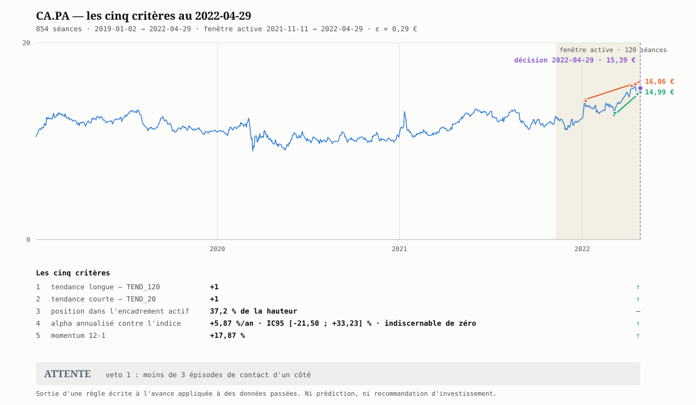

- Canal 14,99 – 16,06 €, large de 1,1 %, clôture à 15,39 € à 37,2 %.
- Pentes +0,063 et +0,024 €/séance, τ de 27 séances : le canal se referme presque à la décision suivante.
- Deux contacts en support : veto 1.
- Momentum +17,9 %, alpha +5,9 %/an.

### 3. `AI.PA` — Air Liquide

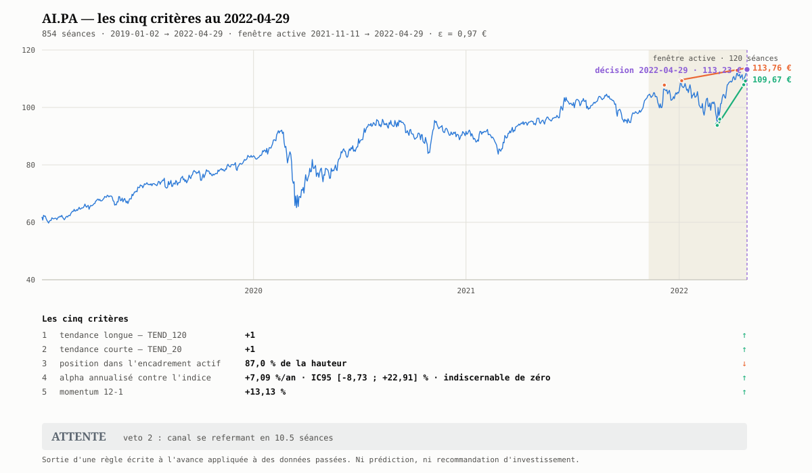

- Canal 109,67 – 113,76 €, large de 4,1 %, clôture à 113,23 € à 87,0 % de la hauteur.
- Support +0,442 contre résistance +0,052 €/séance : **le canal se referme en 11 séances**, veto 2.
- Trois et quatre contacts : la figure est étayée mais elle disparaît avant la prochaine décision.
- Momentum +13,1 %, alpha +7,1 %/an.

### 4. `ORA.PA` — Orange

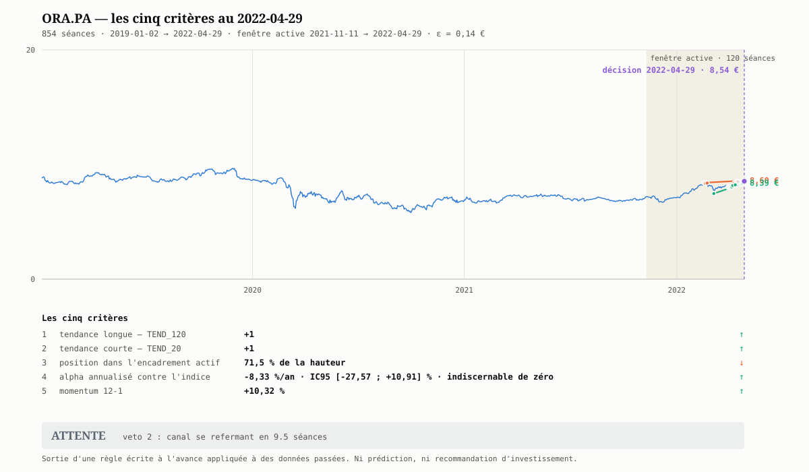

- Canal 8,39 – 8,60 €, d'une largeur de 0,2 % — le plus mince de la date —, clôture à 8,54 € à 71,5 %.
- Pentes +0,025 et +0,004 €/séance : **le canal se referme en 10 séances**, veto 2.
- Quatre et trois contacts, mais une figure de 21 centimes de haut ne mesure rien.
- Momentum +10,3 %, alpha −8,3 %/an.

### 5. `MT.AS` — ArcelorMittal

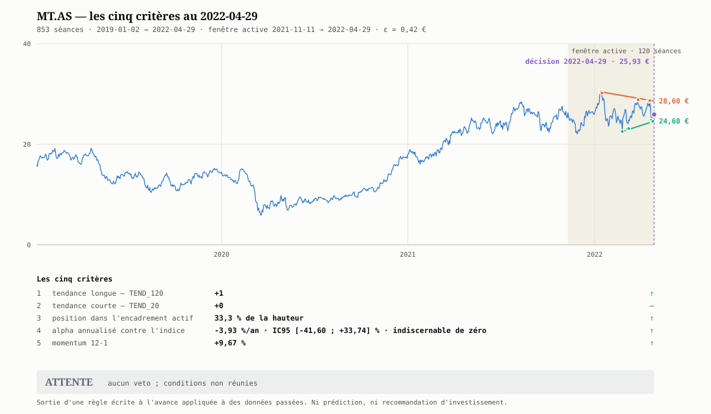

- Canal 24,60 – 28,60 €, clôture à 25,93 € à 33,3 % — sous le seuil de 35 %.
- Support +0,047 contre résistance −0,025 €/séance, τ de 56 séances.
- Trois contacts de chaque côté : **aucun veto**.
- Momentum +9,7 %, à trois dixièmes du seuil de dix ; alpha −3,9 %/an.

### 6. `TTE.PA` — TotalEnergies

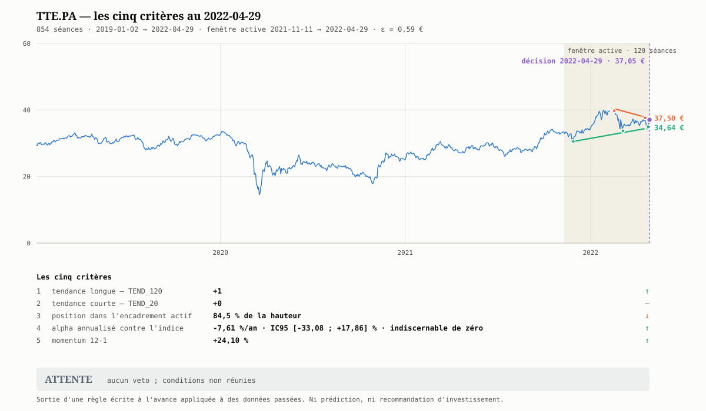

- Canal 34,64 – 37,50 €, clôture à 37,05 € à 84,5 % de la hauteur.
- Pentes +0,039 et −0,059 €/séance, τ de 29 séances.
- Trois contacts de chaque côté : **aucun veto**.
- Momentum +24,1 %, alpha −7,6 %/an.

### 7. `CS.PA` — AXA

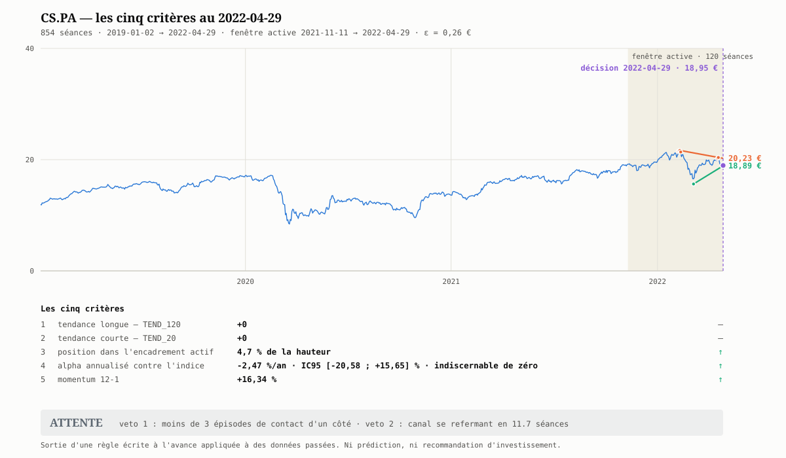

- Canal 18,89 – 20,23 €, clôture à 18,95 € à 4,7 % : sur le support.
- Support +0,088 contre résistance −0,026 €/séance : **le canal se referme en 12 séances**, veto 2.
- Deux contacts de chaque côté : veto 1 également.
- Momentum +16,3 %, alpha −2,5 %/an ; la tendance longue est retombée à zéro.

### 8. `SAN.PA` — Sanofi

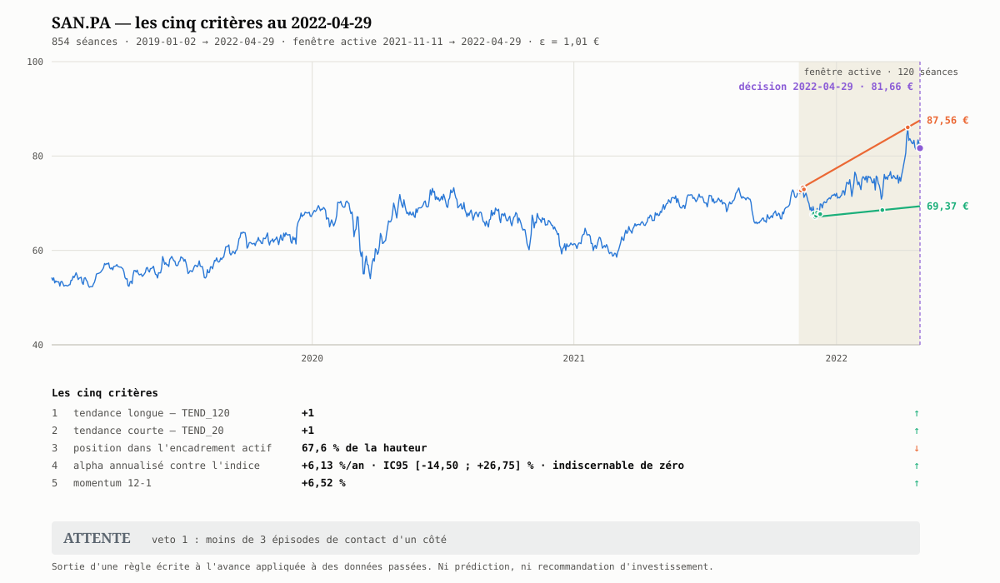

- Canal 69,37 – 87,56 €, large de 18,2 %, clôture à 81,66 € à 67,6 %.
- Support +0,022 contre résistance +0,123 €/séance : le canal s'ouvre, τ infini.
- Deux contacts de chaque côté : veto 1.
- Momentum +6,5 %, alpha +6,1 %/an.

### 9. `VIV.PA` — Vivendi

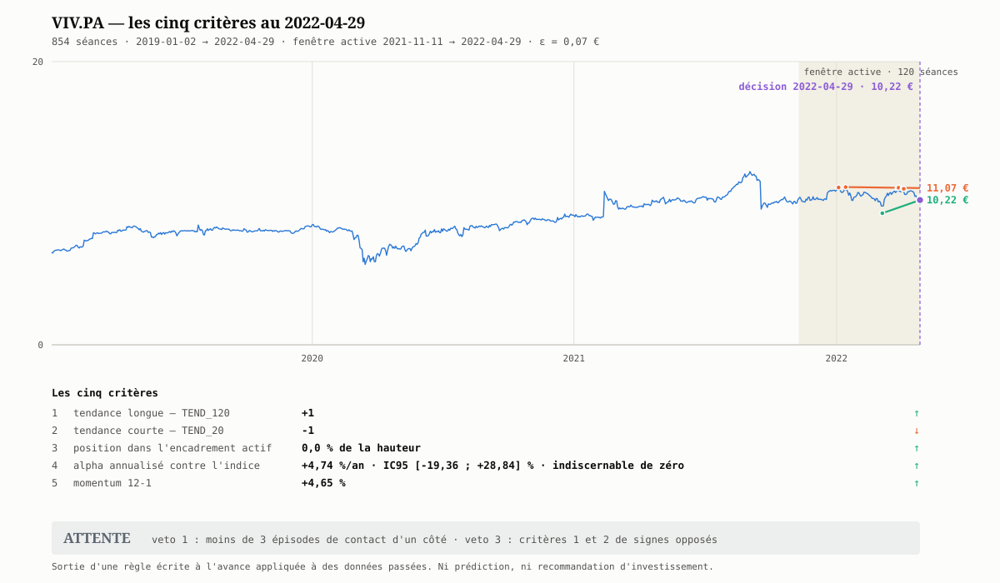

- Canal 10,22 – 11,07 €, clôture à 10,22 € : **exactement sur le support**, 0,0 % de la hauteur.
- Support +0,025 contre résistance −0,001 €/séance, τ de 33 séances.
- Deux contacts en support : veto 1 ; tendances opposées : veto 3.
- Momentum +4,7 %, alpha +4,7 %/an.

### 10. `DG.PA` — Vinci

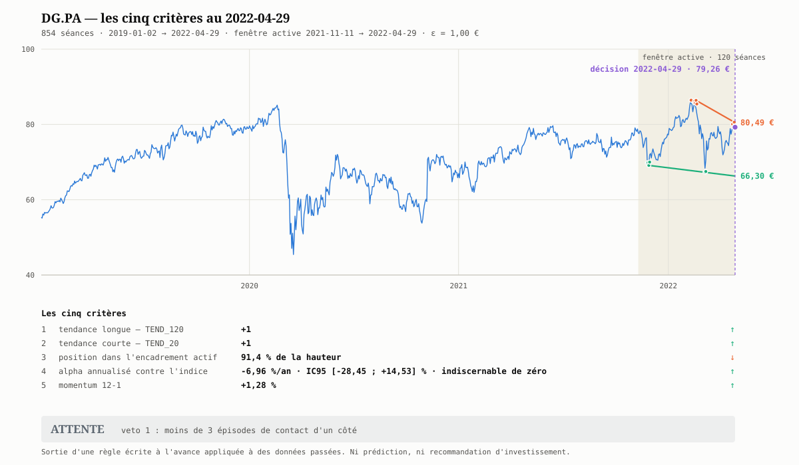

- Canal 66,30 – 80,49 €, clôture à 79,26 € à 91,4 % de la hauteur.
- Pentes −0,027 et −0,123 €/séance, τ de 147 séances.
- Deux contacts en support : veto 1.
- Momentum +1,3 %, alpha −7,0 %/an.

### 11. `EL.PA` — EssilorLuxottica

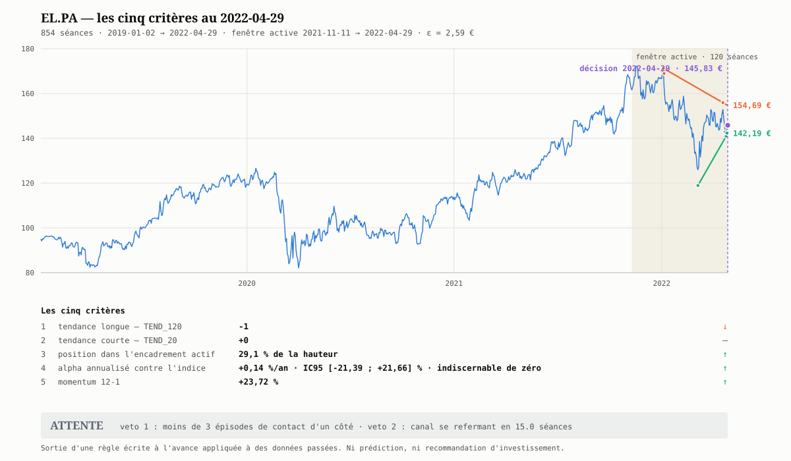

- Canal 142,19 – 154,69 €, clôture à 145,83 € à 29,1 %.
- Support +0,628 contre résistance −0,207 €/séance : **le canal se referme en 15 séances**, veto 2.
- Deux contacts de chaque côté : veto 1 également.
- Momentum +23,7 %, alpha +0,1 %/an.

### 12. `ERF.PA` — Eurofins Scientific

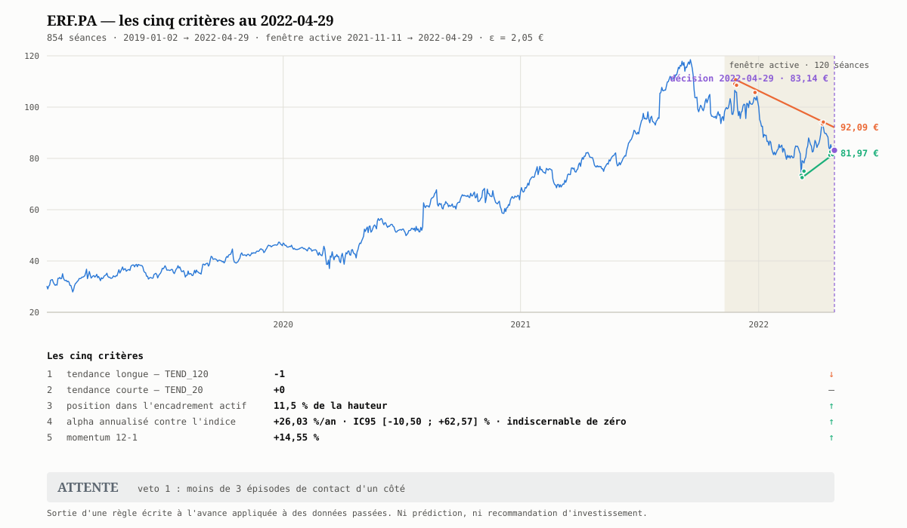

- Canal 81,97 – 92,09 €, clôture à 83,14 € à 11,5 % : contre le support.
- Support +0,270 contre résistance −0,174 €/séance, τ de 23 séances.
- Deux contacts en support : veto 1.
- Momentum +14,6 %, **alpha +26,0 %/an**, le plus élevé de la date.

### 13. `EN.PA` — Bouygues

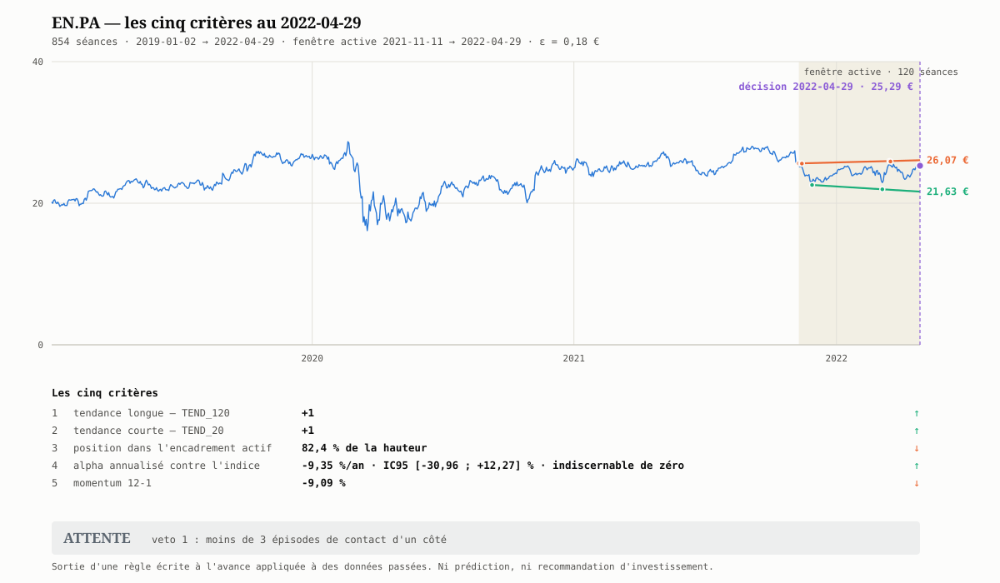

- Canal 21,63 – 26,07 €, clôture à 25,29 € à 82,4 % de la hauteur.
- Pentes −0,009 et +0,004 €/séance : ouverture, τ infini.
- Deux contacts de chaque côté : veto 1.
- Momentum −9,1 %, à neuf dixièmes du seuil de −10 % ; alpha −9,3 %/an.

### 14. `STMPA.PA` — STMicroelectronics

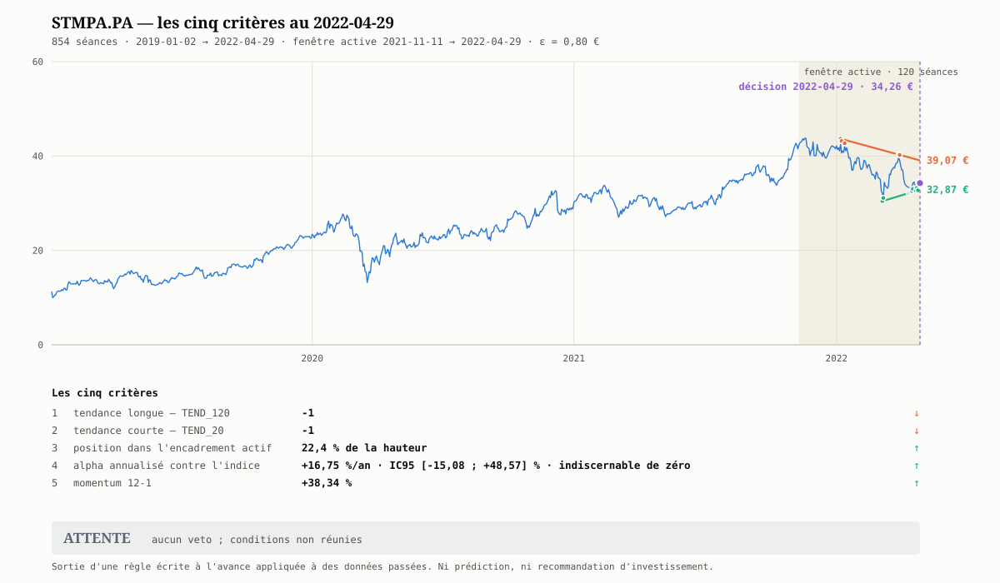

- Canal 32,87 – 39,07 €, clôture à 34,26 € à 22,4 % de la hauteur.
- Support +0,066 contre résistance −0,059 €/séance, τ de 50 séances.
- Trois contacts de chaque côté : **aucun veto**.
- **Momentum +38,3 %, le plus fort de la date** ; alpha +16,8 %/an, mais les deux tendances sont négatives.

### 15. `RMS.PA` — Hermès International

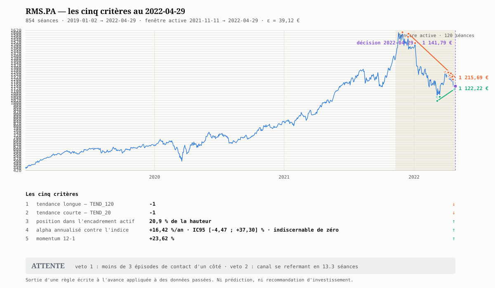

- Canal 1 122,22 – 1 215,69 €, clôture à 1 141,79 € à 20,9 %.
- Support +2,964 contre résistance −4,049 €/séance : **le canal se referme en 13 séances**, veto 2.
- Deux contacts en support : veto 1 également.
- Momentum +23,6 %, alpha +16,4 %/an, IC95 de −4,5 à +37,3.

### 16. `SU.PA` — Schneider Electric

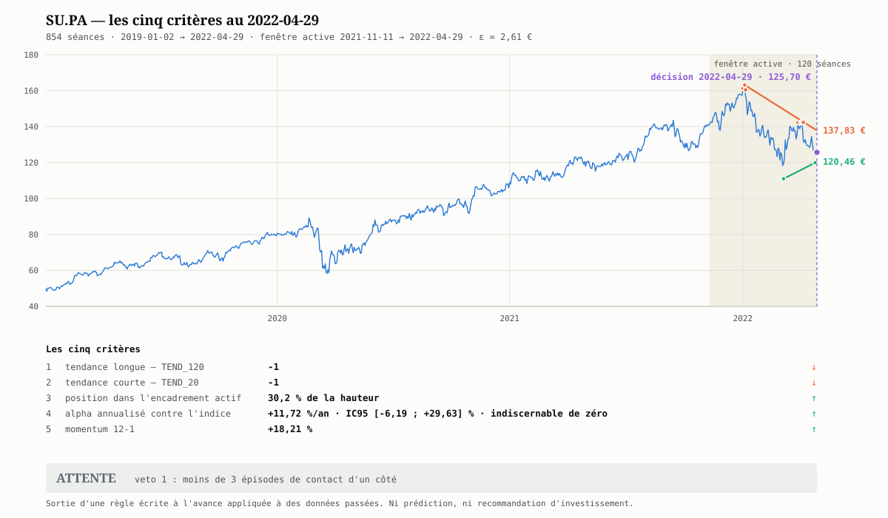

- Canal 120,46 – 137,83 €, clôture à 125,70 € à 30,2 %.
- Support +0,256 contre résistance −0,317 €/séance, τ de 30 séances.
- Deux contacts en support : veto 1.
- Momentum +18,2 %, alpha +11,7 %/an.

### 17. `VIE.PA` — Veolia

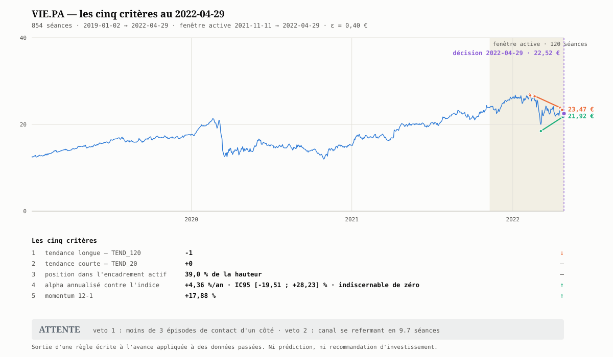

- Canal 21,92 – 23,47 €, clôture à 22,52 € à 39,0 % de la hauteur.
- Support +0,093 contre résistance −0,066 €/séance : **le canal se referme en 10 séances**, veto 2.
- Deux contacts en support : veto 1 également.
- Momentum +17,9 %, alpha +4,4 %/an.

### 18. `AIR.PA` — Airbus

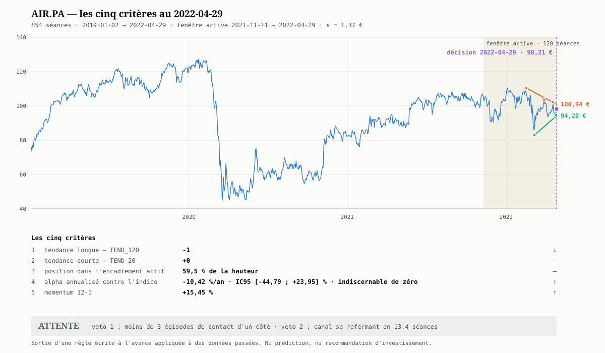

- Canal 94,20 – 100,94 €, clôture à 98,21 € à 59,5 % de la hauteur.
- Support +0,311 contre résistance −0,193 €/séance : **le canal se referme en 13 séances**, veto 2.
- Deux contacts en support : veto 1 également.
- Momentum +15,4 %, alpha −10,4 %/an.

### 19. `DSY.PA` — Dassault Systèmes

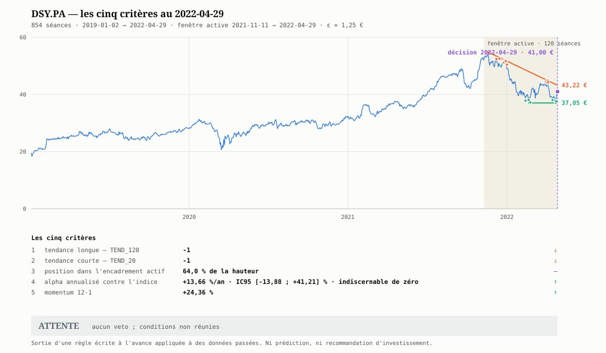

- Canal 37,05 – 43,22 €, clôture à 41,00 € à 64,0 % — un point sous le seuil haut.
- Pentes +0,001 et −0,103 €/séance, τ de 60 séances.
- Quatre contacts bas, cinq hauts : **aucun veto**, la figure la mieux étayée de la date.
- Momentum +24,4 %, alpha +13,7 %/an.

### 20. `TEP.PA` — Teleperformance

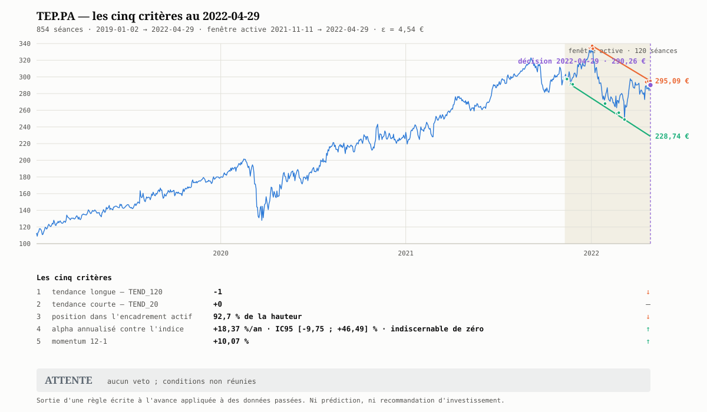

- Canal 228,74 – 295,09 €, large de 66,3 €, clôture à 290,26 € à 92,7 %.
- Pentes −0,559 et −0,521 €/séance : ouverture imperceptible, τ infini.
- Cinq contacts bas, trois hauts : **aucun veto**.
- Momentum +10,1 %, alpha +18,4 %/an.

### 21. `PUB.PA` — Publicis

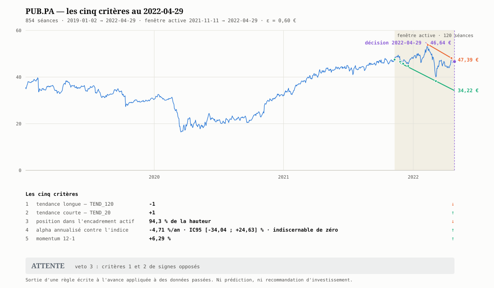

- Canal 34,22 – 47,39 €, large de 13,2 %, clôture à 46,64 € à 94,3 %.
- Pentes −0,110 et −0,125 €/séance, quasi parallèles : τ de 836 séances.
- Quatre contacts bas, trois hauts : figure lisible ; seul le veto 3 mord.
- Momentum +6,3 %, alpha −4,7 %/an.

### 22. `SGO.PA` — Saint-Gobain

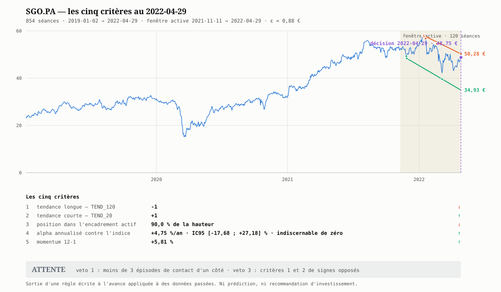

- Canal 34,93 – 50,28 €, clôture à 48,75 € à 90,0 % de la hauteur.
- Pentes −0,126 et −0,106 €/séance : ouverture lente, τ infini.
- Deux contacts en support : veto 1 ; tendances opposées : veto 3.
- Momentum +5,8 %, alpha +4,8 %/an.

### 23. `ML.PA` — Michelin

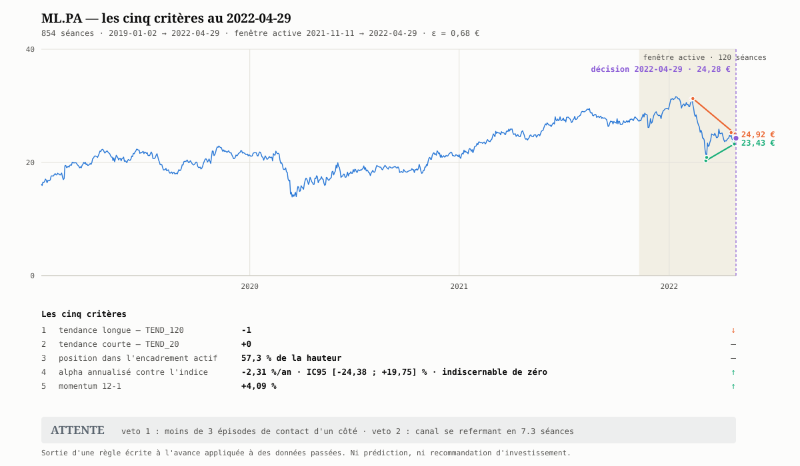

- Canal 23,43 – 24,92 €, clôture à 24,28 € à 57,3 % de la hauteur.
- Support +0,084 contre résistance −0,120 €/séance : **le canal se referme en 7 séances**, veto 2.
- Deux contacts en support : veto 1 également.
- Momentum +4,1 %, alpha −2,3 %/an.

### 24. `GLE.PA` — Société Générale

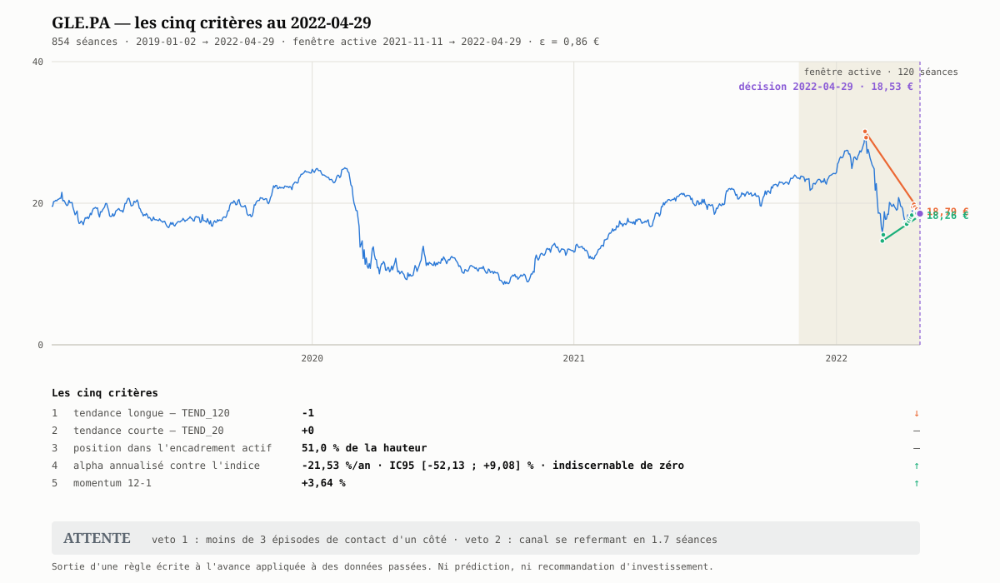

- Canal 18,26 – 18,79 €, d'une largeur de 0,5 %, clôture à 18,53 € à 51,0 %.
- Support +0,097 contre résistance −0,210 €/séance : **le canal se referme en moins de deux séances**, τ = 1,7. Veto 2, le plus court de toute l'année.
- Trois contacts bas, deux hauts : veto 1 également. Une figure de 53 centimes de haut, périmée à l'écriture.
- Momentum +3,6 %, alpha −21,5 %/an.

### 25. `CAP.PA` — Capgemini

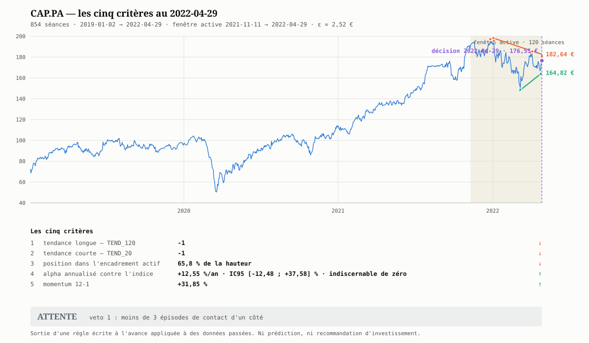

- Canal 164,82 – 182,64 €, clôture à 176,55 € à 65,8 % : à peine au-dessus du seuil haut.
- Support +0,459 contre résistance −0,193 €/séance, τ de 27 séances.
- Deux contacts en support : veto 1.
- Momentum +31,9 %, alpha +12,6 %/an.

### 26. `RI.PA` — Pernod Ricard

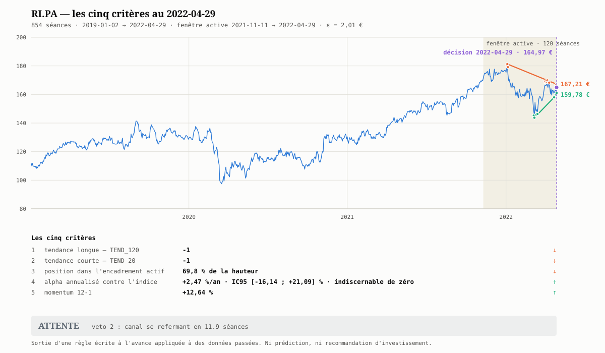

- Canal 159,78 – 167,21 €, clôture à 164,97 € à 69,8 % de la hauteur.
- Support +0,446 contre résistance −0,176 €/séance : **le canal se referme en 12 séances**, veto 2.
- Trois contacts de chaque côté : la figure est étayée, la géométrie ne tient pas.
- Momentum +12,6 %, alpha +2,5 %/an.

### 27. `MC.PA` — LVMH

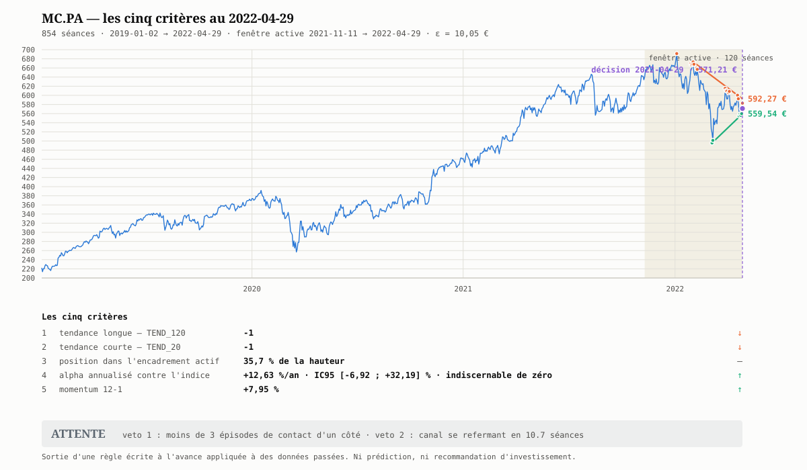

- Canal 559,54 – 592,27 €, clôture à 571,21 € à 35,7 % de la hauteur.
- Support +1,722 contre résistance −1,349 €/séance : **le canal se referme en 11 séances**, veto 2.
- Deux contacts en support : veto 1 également, malgré six épisodes en résistance.
- Momentum +8,0 %, alpha +12,6 %/an.

### 28. `LR.PA` — Legrand

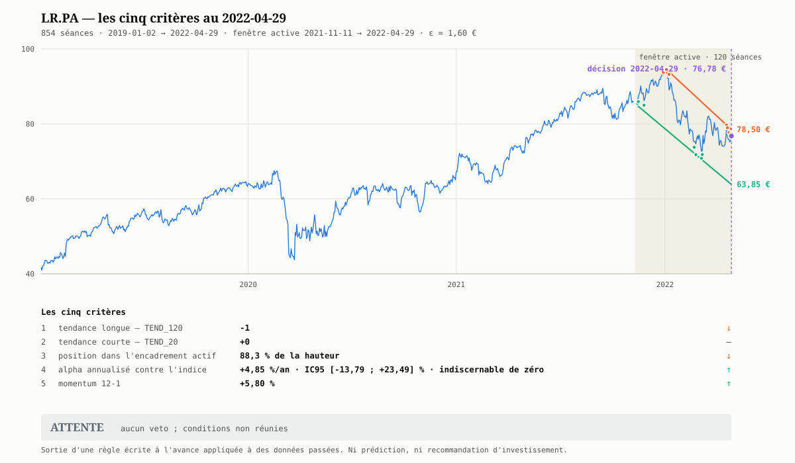

- Canal 63,85 – 78,50 €, clôture à 76,78 € à 88,3 %.
- Pentes −0,181 et −0,200 €/séance, τ de 788 séances.
- Quatre contacts bas, trois hauts : **aucun veto**.
- Momentum +5,8 %, alpha +4,8 %/an.

### 29. `OR.PA` — L'Oréal

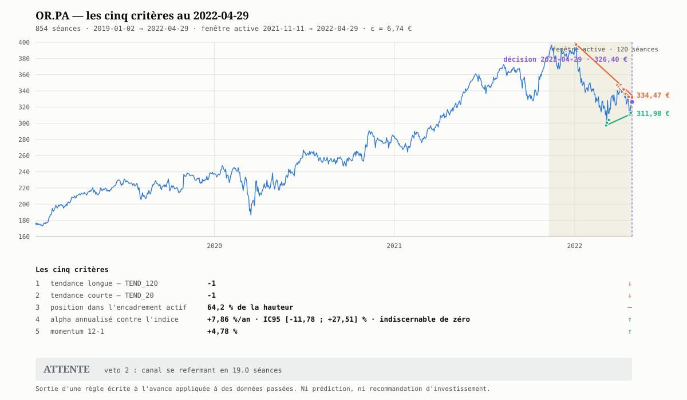

- Canal 311,98 – 334,47 €, clôture à 326,40 € à 64,2 %.
- Support +0,393 contre résistance −0,789 €/séance : **le canal se referme en 19 séances**, veto 2.
- Trois et quatre contacts : la figure est lisible, mais périmée avant la décision suivante.
- Momentum +4,8 %, alpha +7,9 %/an.

### 30. `BNP.PA` — BNP Paribas

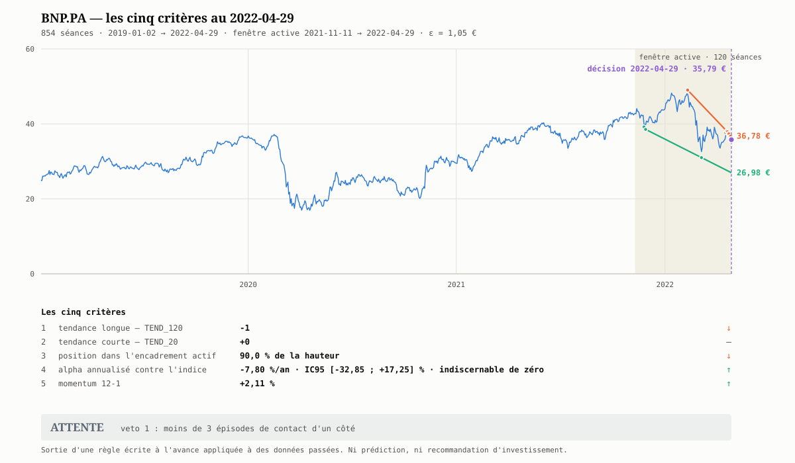

- Canal 26,98 – 36,78 €, clôture à 35,79 € à 90,0 % de la hauteur.
- Pentes −0,109 et −0,227 €/séance, τ de 83 séances.
- Deux contacts de chaque côté : veto 1.
- Momentum +2,1 %, alpha −7,8 %/an.

### 31. `STLAP.PA` — Stellantis

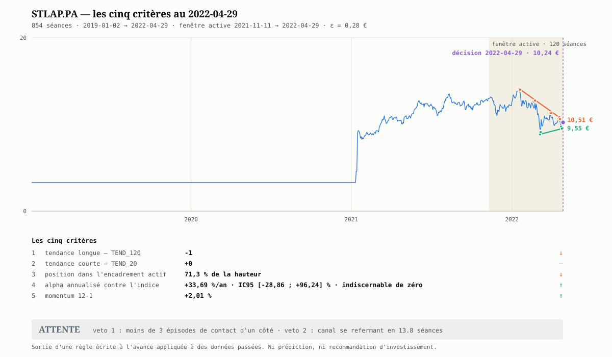

- Canal 9,55 – 10,51 €, large de 1,0 %, clôture à 10,24 € à 71,3 %.
- Support +0,019 contre résistance −0,051 €/séance : **le canal se referme en 14 séances**, veto 2.
- Deux contacts en support : veto 1 également.
- Momentum +2,0 %, alpha +33,7 %/an sur un IC95 de 125 points.

### 32. `ENGI.PA` — Engie

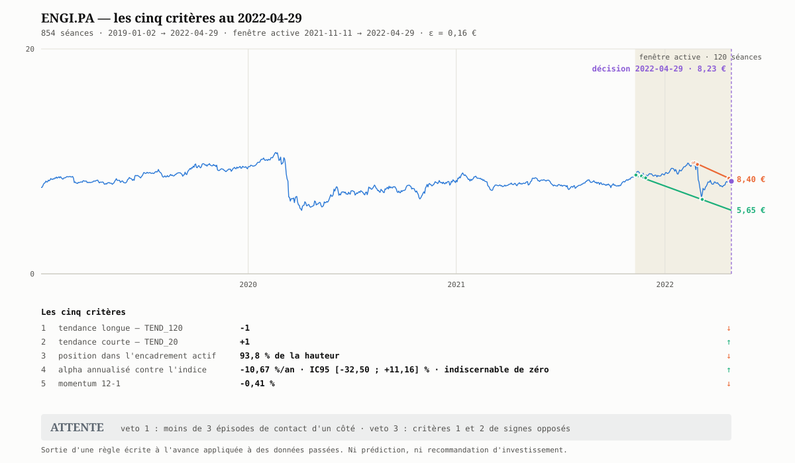

- Canal 5,65 – 8,40 €, clôture à 8,23 € à 93,8 % de la hauteur.
- Pentes −0,026 et −0,033 €/séance, τ de 422 séances.
- Quatre contacts bas, deux hauts : veto 1 ; tendances opposées : veto 3.
- **Momentum −0,4 %**, quasi nul ; alpha −10,7 %/an.

### 33. `BN.PA` — Danone

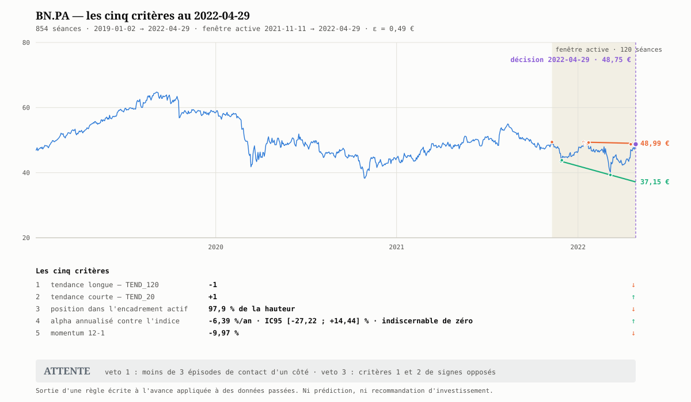

- Canal 37,15 – 48,99 €, clôture à 48,75 € à 97,9 % : contre le plafond.
- Pentes −0,060 et −0,005 €/séance : ouverture, τ infini.
- Deux contacts en support : veto 1 ; tendances opposées : veto 3.
- Momentum −10,0 %, exactement au seuil ; alpha −6,4 %/an.

### 34. `SAF.PA` — Safran

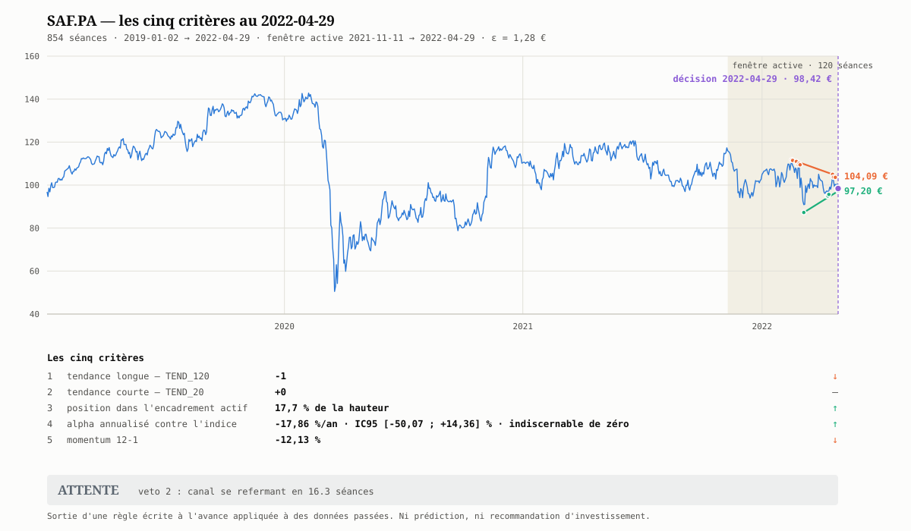

- Canal 97,20 – 104,09 €, clôture à 98,42 € à 17,7 %.
- Support +0,269 contre résistance −0,154 €/séance : **le canal se referme en 16 séances**, veto 2.
- Trois contacts de chaque côté : figure étayée, géométrie périmée.
- Momentum −12,1 %, alpha −17,9 %/an.

### 35. `ACA.PA` — Crédit Agricole

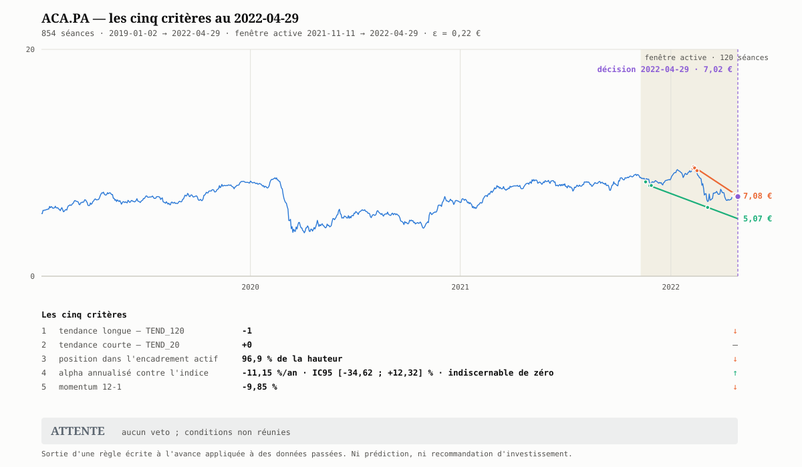

- Canal 5,07 – 7,08 €, clôture à 7,02 € à 96,9 % de la hauteur.
- Pentes −0,027 et −0,048 €/séance, τ de 98 séances.
- Trois contacts de chaque côté : **aucun veto**.
- Momentum −9,8 %, alpha −11,2 %/an.

### 36. `ALO.PA` — Alstom

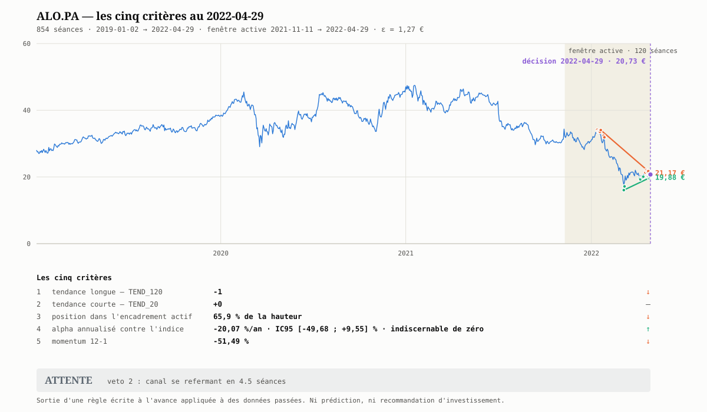

- Canal 19,88 – 21,17 €, large de 1,3 %, clôture à 20,73 € à 65,9 %.
- Support +0,103 contre résistance −0,187 €/séance : **le canal se referme en 4,5 séances**, veto 2.
- Quatre contacts bas, trois hauts : la figure est étayée et pourtant sans avenir.
- **Momentum −51,5 %**, le plus faible de la date ; alpha −20,1 %/an.

### 37. `RNO.PA` — Renault

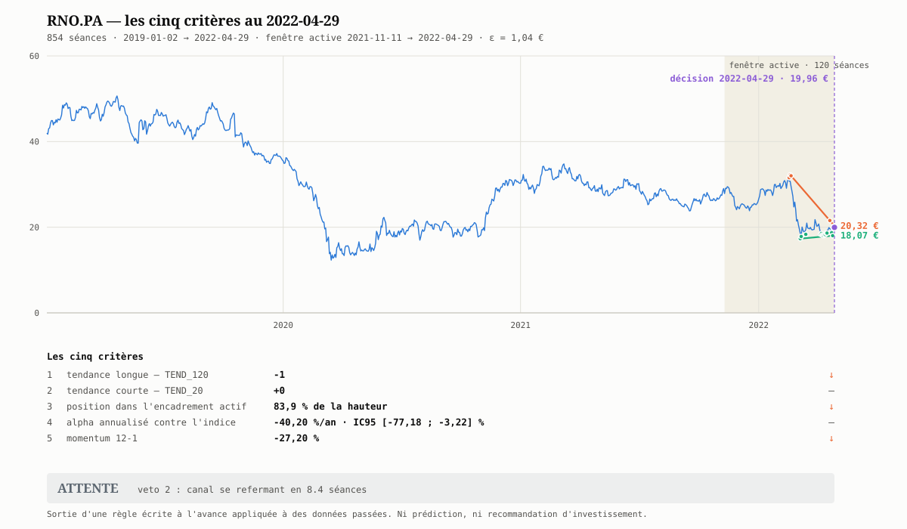

- Canal 18,07 – 20,32 €, clôture à 19,96 € à 83,9 % de la hauteur.
- Support +0,020 contre résistance −0,249 €/séance : **le canal se referme en 8 séances**, veto 2.
- Quatre et trois contacts : figure étayée, géométrie périmée.
- **Alpha significativement négatif** : −40,2 %/an, IC95 de −77,2 à −3,2. Momentum −27,2 %.

### 38. `WLN.PA` — Worldline

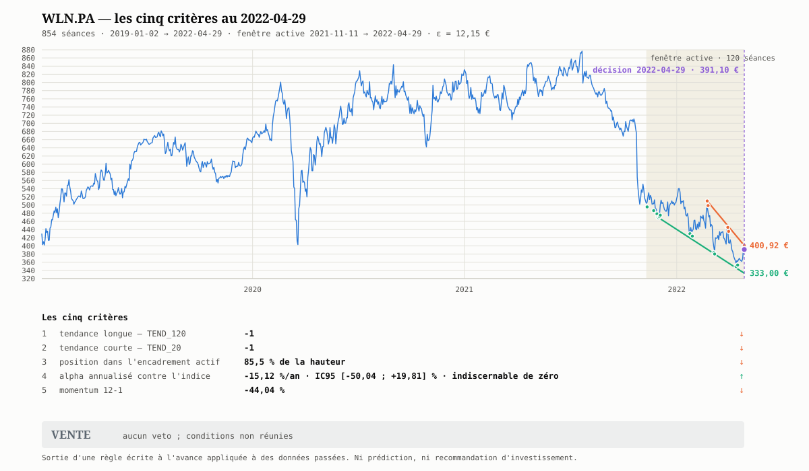

- Canal 333,00 – 400,92 €, clôture à 391,10 € à 85,5 %.
- Pentes −1,307 et −2,424 €/séance, τ de 61 séances.
- **Sept contacts en support et trois en résistance** — la figure la mieux étayée de la date, aucun veto.
- **Momentum −44,0 %**, alpha −15,1 %/an. Score −6, le plus bas de la date.

### `KER.PA` — Kering — *hors classement*

*(figure absente)*

- **Évaluation impossible pour le deuxième mois consécutif.** La règle sort en 2 : 108 séances passent du mauvais côté de la résistance, contre 88 en mars.
- Aucun critère n'est publié ; la valeur reste hors du classement et hors d'atteinte de tout ordre.
- Une position détenue sur cette valeur ne serait pas vendue pour autant : la règle n'ayant rien dit, elle ne commande rien.

## 6. Le classement au 2022-04-29

> De la valeur la plus intéressante à détenir à celle qu'il faut fuir. La colonne **τ** donne la date de péremption du canal en séances, la colonne **Vetos** les numéros déclenchés. Une valeur sous veto ne peut pas être achetée.

| Rang | Valeur | `s1` | `s2` | `s3` | `s4` | `s5` | Score | Position | Momentum | τ | Vetos |
|---|---|---|---|---|---|---|---|---|---|---|---|
| 1 | `HO.PA` Thales | +2 | +1 | +1 | +2 | +0 | **+6** | 12,8 % | +32,9 % | 38,8 | 1 |
| 2 | `CA.PA` Carrefour | +2 | +1 | +0 | +2 | +0 | **+5** | 37,2 % | +17,9 % | 27,3 | 1 |
| 3 | `AI.PA` Air Liquide | +2 | +1 | -1 | +2 | +0 | **+4** | 87,0 % | +13,1 % | 10,5 | 2 |
| 4 | `ORA.PA` Orange | +2 | +1 | -1 | +2 | +0 | **+4** | 71,5 % | +10,3 % | 9,5 | 2 |
| 5 | `MT.AS` ArcelorMittal | +2 | +0 | +1 | +1 | +0 | **+4** | 33,3 % | +9,7 % | 55,7 | — |
| 6 | `TTE.PA` TotalEnergies | +2 | +0 | -1 | +2 | +0 | **+3** | 84,5 % | +24,1 % | 29,3 | — |
| 7 | `CS.PA` AXA | +0 | +0 | +1 | +2 | +0 | **+3** | 4,7 % | +16,3 % | 11,7 | 1 2 |
| 8 | `SAN.PA` Sanofi | +2 | +1 | -1 | +1 | +0 | **+3** | 67,6 % | +6,5 % | ∞ | 1 |
| 9 | `VIV.PA` Vivendi | +2 | -1 | +1 | +1 | +0 | **+3** | 0,0 % | +4,7 % | 32,6 | 1 3 |
| 10 | `DG.PA` Vinci | +2 | +1 | -1 | +1 | +0 | **+3** | 91,4 % | +1,3 % | 146,9 | 1 |
| 11 | `EL.PA` EssilorLuxottica | -2 | +0 | +1 | +2 | +0 | **+1** | 29,1 % | +23,7 % | 15,0 | 1 2 |
| 12 | `ERF.PA` Eurofins Scientific | -2 | +0 | +1 | +2 | +0 | **+1** | 11,5 % | +14,6 % | 22,8 | 1 |
| 13 | `EN.PA` Bouygues | +2 | +1 | -1 | -1 | +0 | **+1** | 82,4 % | -9,1 % | ∞ | 1 |
| 14 | `STMPA.PA` STMicroelectronics | -2 | -1 | +1 | +2 | +0 | **+0** | 22,4 % | +38,3 % | 49,8 | — |
| 15 | `RMS.PA` Hermès International | -2 | -1 | +1 | +2 | +0 | **+0** | 20,9 % | +23,6 % | 13,3 | 1 2 |
| 16 | `SU.PA` Schneider Electric | -2 | -1 | +1 | +2 | +0 | **+0** | 30,2 % | +18,2 % | 30,3 | 1 |
| 17 | `VIE.PA` Veolia | -2 | +0 | +0 | +2 | +0 | **+0** | 39,0 % | +17,9 % | 9,7 | 1 2 |
| 18 | `AIR.PA` Airbus | -2 | +0 | +0 | +2 | +0 | **+0** | 59,5 % | +15,4 % | 13,4 | 1 2 |
| 19 | `DSY.PA` Dassault Systèmes | -2 | -1 | +0 | +2 | +0 | **-1** | 64,0 % | +24,4 % | 59,6 | — |
| 20 | `TEP.PA` Teleperformance | -2 | +0 | -1 | +2 | +0 | **-1** | 92,7 % | +10,1 % | ∞ | — |
| 21 | `PUB.PA` Publicis | -2 | +1 | -1 | +1 | +0 | **-1** | 94,3 % | +6,3 % | 836,3 | 3 |
| 22 | `SGO.PA` Saint-Gobain | -2 | +1 | -1 | +1 | +0 | **-1** | 90,0 % | +5,8 % | ∞ | 1 3 |
| 23 | `ML.PA` Michelin | -2 | +0 | +0 | +1 | +0 | **-1** | 57,3 % | +4,1 % | 7,3 | 1 2 |
| 24 | `GLE.PA` Société Générale | -2 | +0 | +0 | +1 | +0 | **-1** | 51,0 % | +3,6 % | 1,7 | 1 2 |
| 25 | `CAP.PA` Capgemini | -2 | -1 | -1 | +2 | +0 | **-2** | 65,8 % | +31,9 % | 27,3 | 1 |
| 26 | `RI.PA` Pernod Ricard | -2 | -1 | -1 | +2 | +0 | **-2** | 69,8 % | +12,6 % | 11,9 | 2 |
| 27 | `MC.PA` LVMH | -2 | -1 | +0 | +1 | +0 | **-2** | 35,7 % | +8,0 % | 10,7 | 1 2 |
| 28 | `LR.PA` Legrand | -2 | +0 | -1 | +1 | +0 | **-2** | 88,3 % | +5,8 % | 787,5 | — |
| 29 | `OR.PA` L'Oréal | -2 | -1 | +0 | +1 | +0 | **-2** | 64,2 % | +4,8 % | 19,0 | 2 |
| 30 | `BNP.PA` BNP Paribas | -2 | +0 | -1 | +1 | +0 | **-2** | 90,0 % | +2,1 % | 83,2 | 1 |
| 31 | `STLAP.PA` Stellantis | -2 | +0 | -1 | +1 | +0 | **-2** | 71,3 % | +2,0 % | 13,8 | 1 2 |
| 32 | `ENGI.PA` Engie | -2 | +1 | -1 | -1 | +0 | **-3** | 93,8 % | -0,4 % | 422,0 | 1 3 |
| 33 | `BN.PA` Danone | -2 | +1 | -1 | -1 | +0 | **-3** | 97,9 % | -10,0 % | ∞ | 1 3 |
| 34 | `SAF.PA` Safran | -2 | +0 | +1 | -2 | +0 | **-3** | 17,7 % | -12,1 % | 16,3 | 2 |
| 35 | `ACA.PA` Crédit Agricole | -2 | +0 | -1 | -1 | +0 | **-4** | 96,9 % | -9,8 % | 97,7 | — |
| 36 | `ALO.PA` Alstom | -2 | +0 | -1 | -2 | +0 | **-5** | 65,9 % | -51,5 % | 4,5 | 2 |
| 37 | `RNO.PA` Renault | -2 | +0 | -1 | -2 | -1 | **-6** | 83,9 % | -27,2 % | 8,4 | 2 |
| 38 | `WLN.PA` Worldline | -2 | -1 | -1 | -2 | +0 | **-6** | 85,5 % | -44,0 % | 60,8 | — |

**Non classées** — la règle n'a rien produit :

- `KER.PA` Kering — code 2 : Contrôle de non-traversée en échec : 108 séances du mauvais côté de la resistance.

## 7. Les ordres exécutés au 2022-05-02

> À l'**ouverture** de la séance, jamais à la clôture du 2022-04-29.

*Aucun ordre : le classement ne déclenche ni entrée ni sortie.*

## 8. La lecture du mois

Sur le mois, la meilleure contribution vient de `MT.AS` (ArcelorMittal) pour **+151,63 €**, la moins bonne de `HO.PA` (Thales) pour **-105,50 €**. Aucun ordre, donc aucun frais : le classement, l'hystérésis ou les vetos ont retenu le portefeuille en l'état. Le portefeuille termine le mois **devant TR39** de 0,27 point. Sur les 48 thèses du mois précédent qui ont pu être tranchées, **32 sont confirmées** — 66,7 %.

## 9. Les thèses écrites au 2022-04-29

> Elles seront dépouillées à la prochaine date de décision, dans le fichier du mois suivant. Elles sont engendrées mécaniquement par les règles du [protocole](../README.md#le-registre-des-thèses-réfutables) — aucune n'est rédigée à la main.

| Valeur | Thèse | Énoncé, à dépouiller au mois suivant |
|---|---|---|
| `ACA.PA` | Canal | clôture entre 4,48 € et 6,03 € au 2022-05-31 |
| `ACA.PA` | Reflexive | AUCUNE SEQUENCE : écart contre TR39 dans ± 4,97 pt (σ̂), au 2022-05-31 |
| `AI.PA` | Canal | encadrement ferme avant le 2022-05-31 : les bornes prolongees se croisent, la thèse est inconfirmable à l'écriture |
| `AIR.PA` | Canal | encadrement ferme avant le 2022-05-31 : les bornes prolongees se croisent, la thèse est inconfirmable à l'écriture |
| `ALO.PA` | Canal | encadrement ferme avant le 2022-05-31 : les bornes prolongees se croisent, la thèse est inconfirmable à l'écriture |
| `ALO.PA` | Reflexive | AUCUNE SEQUENCE : écart contre TR39 dans ± 7,50 pt (σ̂), au 2022-05-31 |
| `BN.PA` | Canal | clôture entre 35,84 € et 48,87 € au 2022-05-31 |
| `BNP.PA` | Canal | clôture entre 24,58 € et 31,79 € au 2022-05-31 |
| `BNP.PA` | Reflexive | AUCUNE SEQUENCE : écart contre TR39 dans ± 5,97 pt (σ̂), au 2022-05-31 |
| `CA.PA` | Canal | clôture entre 16,38 € et 16,58 € au 2022-05-31 |
| `CAP.PA` | Canal | clôture entre 174,92 € et 178,40 € au 2022-05-31 |
| `CS.PA` | Canal | encadrement ferme avant le 2022-05-31 : les bornes prolongees se croisent, la thèse est inconfirmable à l'écriture |
| `CS.PA` | Reflexive | AUCUNE SEQUENCE : écart contre TR39 dans ± 5,82 pt (σ̂), au 2022-05-31 |
| `DG.PA` | Canal | clôture entre 65,71 € et 77,78 € au 2022-05-31 |
| `DSY.PA` | Canal | clôture entre 37,07 € et 40,95 € au 2022-05-31 |
| `EL.PA` | Canal | encadrement ferme avant le 2022-05-31 : les bornes prolongees se croisent, la thèse est inconfirmable à l'écriture |
| `EN.PA` | Canal | clôture entre 21,43 € et 26,15 € au 2022-05-31 |
| `ENGI.PA` | Canal | clôture entre 5,07 € et 7,68 € au 2022-05-31 |
| `ERF.PA` | Canal | clôture entre 87,91 € et 88,27 € au 2022-05-31 |
| `ERF.PA` | Reflexive | AUCUNE SEQUENCE : écart contre TR39 dans ± 9,86 pt (σ̂), au 2022-05-31 |
| `GLE.PA` | Canal | encadrement ferme avant le 2022-05-31 : les bornes prolongees se croisent, la thèse est inconfirmable à l'écriture |
| `GLE.PA` | Reflexive | AUCUNE SEQUENCE : écart contre TR39 dans ± 7,72 pt (σ̂), au 2022-05-31 |
| `HO.PA` | Canal | clôture entre 126,34 € et 132,73 € au 2022-05-31 |
| `KER.PA` | Canal | clôture entre — € et — € au 2022-05-31 |
| `LR.PA` | Canal | clôture entre 59,86 € et 74,10 € au 2022-05-31 |
| `MC.PA` | Canal | encadrement ferme avant le 2022-05-31 : les bornes prolongees se croisent, la thèse est inconfirmable à l'écriture |
| `ML.PA` | Canal | encadrement ferme avant le 2022-05-31 : les bornes prolongees se croisent, la thèse est inconfirmable à l'écriture |
| `MT.AS` | Canal | clôture entre 25,63 € et 28,05 € au 2022-05-31 |
| `MT.AS` | Reflexive | AUCUNE SEQUENCE : écart contre TR39 dans ± 8,70 pt (σ̂), au 2022-05-31 |
| `OR.PA` | Canal | encadrement ferme avant le 2022-05-31 : les bornes prolongees se croisent, la thèse est inconfirmable à l'écriture |
| `ORA.PA` | Canal | encadrement ferme avant le 2022-05-31 : les bornes prolongees se croisent, la thèse est inconfirmable à l'écriture |
| `PUB.PA` | Canal | clôture entre 31,81 € et 44,63 € au 2022-05-31 |
| `RI.PA` | Canal | encadrement ferme avant le 2022-05-31 : les bornes prolongees se croisent, la thèse est inconfirmable à l'écriture |
| `RMS.PA` | Canal | encadrement ferme avant le 2022-05-31 : les bornes prolongees se croisent, la thèse est inconfirmable à l'écriture |
| `RNO.PA` | Canal | encadrement ferme avant le 2022-05-31 : les bornes prolongees se croisent, la thèse est inconfirmable à l'écriture |
| `SAF.PA` | Canal | encadrement ferme avant le 2022-05-31 : les bornes prolongees se croisent, la thèse est inconfirmable à l'écriture |
| `SAN.PA` | Canal | clôture entre 69,86 € et 90,27 € au 2022-05-31 |
| `SGO.PA` | Canal | clôture entre 32,15 € et 47,95 € au 2022-05-31 |
| `STLAP.PA` | Canal | encadrement ferme avant le 2022-05-31 : les bornes prolongees se croisent, la thèse est inconfirmable à l'écriture |
| `STMPA.PA` | Canal | clôture entre 34,32 € et 37,78 € au 2022-05-31 |
| `SU.PA` | Canal | clôture entre 126,08 € et 130,86 € au 2022-05-31 |
| `TEP.PA` | Canal | clôture entre 216,44 € et 283,63 € au 2022-05-31 |
| `TEP.PA` | Reflexive | AUCUNE SEQUENCE : écart contre TR39 dans ± 5,75 pt (σ̂), au 2022-05-31 |
| `TTE.PA` | Canal | clôture entre 35,49 € et 36,21 € au 2022-05-31 |
| `VIE.PA` | Canal | encadrement ferme avant le 2022-05-31 : les bornes prolongees se croisent, la thèse est inconfirmable à l'écriture |
| `VIV.PA` | Canal | clôture entre 10,77 € et 11,05 € au 2022-05-31 |
| `VIV.PA` | Reflexive | AUCUNE SEQUENCE : écart contre TR39 dans ± 5,44 pt (σ̂), au 2022-05-31 |
| `WLN.PA` | Canal | clôture entre 304,25 € et 347,60 € au 2022-05-31 |
| `WLN.PA` | Reflexive | AUCUNE SEQUENCE : écart contre TR39 dans ± 10,46 pt (σ̂), au 2022-05-31 |

---

[← Avril](2022-04.md) · [Protocole](../README.md) · [Juin →](2022-06.md)
