# Juin 2022

> Journal de l'[expérience 3](../README.md) · **décision au 2022-05-31** · **exécution au 2022-06-01**
> Portefeuille au 2022-06-30 : **9 229,35 €** (base 92,29) · TR39 83,80 · alpha du mois **+8,52 pt** · depuis janvier **+8,49 pt**

---

## 1. Les actualités du mois précédent

**Mai 2022.** Un mois heurté, sans direction nette. Les indices européens
terminent proches de l'équilibre après avoir touché de nouveaux plus bas
annuels à la mi-mois. La BCE prépare ouvertement la fin des taux négatifs, et
Christine Lagarde évoque une sortie du territoire négatif d'ici la fin du
troisième trimestre.

Le pétrole poursuit sa hausse — l'Union européenne s'accorde sur un embargo
partiel sur le brut russe —, tandis que les valeurs de distribution souffrent
d'avertissements sur les marges aux États-Unis. Le gaz européen reste sur des
niveaux extrêmes, la Russie interrompant ses livraisons à plusieurs pays.

## 2. Le dépouillement des thèses écrites au 2022-04-29

> Piste **S4**. Ces énoncés ont été écrits le mois dernier, avant de connaître ce mois-ci. Aucun n'a été retouché ; le verdict est calculé.

| Valeur | Thèse | Énoncé | Constaté | Verdict |
|---|---|---|---|---|
| `ACA.PA` | Canal | clôture entre 4,48 € et 6,03 € au 2022-05-31 | 7,69 € | démentie |
| `ACA.PA` | Reflexive | AUCUNE SEQUENCE : écart contre TR39 dans ± 4,97 pt (σ̂), au 2022-05-31 | 9,25 pt | démentie |
| `AI.PA` | Canal | encadrement ferme avant le 2022-05-31 : les bornes prolongees se croisent, la thèse est inconfirmable à l'écriture | 113,55 € | *inconfirmable à l'écriture* |
| `AIR.PA` | Canal | encadrement ferme avant le 2022-05-31 : les bornes prolongees se croisent, la thèse est inconfirmable à l'écriture | 101,23 € | *inconfirmable à l'écriture* |
| `ALO.PA` | Canal | encadrement ferme avant le 2022-05-31 : les bornes prolongees se croisent, la thèse est inconfirmable à l'écriture | 24,93 € | *inconfirmable à l'écriture* |
| `ALO.PA` | Reflexive | AUCUNE SEQUENCE : écart contre TR39 dans ± 7,50 pt (σ̂), au 2022-05-31 | 19,88 pt | démentie |
| `BN.PA` | Canal | clôture entre 35,84 € et 48,87 € au 2022-05-31 | 47,95 € | **confirmée** |
| `BNP.PA` | Canal | clôture entre 24,58 € et 31,79 € au 2022-05-31 | 41,05 € | démentie |
| `BNP.PA` | Reflexive | AUCUNE SEQUENCE : écart contre TR39 dans ± 5,97 pt (σ̂), au 2022-05-31 | 14,30 pt | démentie |
| `CA.PA` | Canal | clôture entre 16,38 € et 16,58 € au 2022-05-31 | 14,52 € | démentie |
| `CAP.PA` | Canal | clôture entre 174,92 € et 178,40 € au 2022-05-31 | 162,51 € | démentie |
| `CS.PA` | Canal | encadrement ferme avant le 2022-05-31 : les bornes prolongees se croisent, la thèse est inconfirmable à l'écriture | 18,67 € | *inconfirmable à l'écriture* |
| `CS.PA` | Reflexive | AUCUNE SEQUENCE : écart contre TR39 dans ± 5,82 pt (σ̂), au 2022-05-31 | -1,90 pt | **confirmée** |
| `DG.PA` | Canal | clôture entre 65,71 € et 77,78 € au 2022-05-31 | 76,57 € | **confirmée** |
| `DSY.PA` | Canal | clôture entre 37,07 € et 40,95 € au 2022-05-31 | 37,94 € | **confirmée** |
| `EL.PA` | Canal | encadrement ferme avant le 2022-05-31 : les bornes prolongees se croisent, la thèse est inconfirmable à l'écriture | 135,87 € | *inconfirmable à l'écriture* |
| `EN.PA` | Canal | clôture entre 21,43 € et 26,15 € au 2022-05-31 | 26,20 € | démentie |
| `ENGI.PA` | Canal | clôture entre 5,07 € et 7,68 € au 2022-05-31 | 9,08 € | démentie |
| `ERF.PA` | Canal | clôture entre 87,91 € et 88,27 € au 2022-05-31 | 81,36 € | démentie |
| `ERF.PA` | Reflexive | AUCUNE SEQUENCE : écart contre TR39 dans ± 9,86 pt (σ̂), au 2022-05-31 | -2,53 pt | **confirmée** |
| `GLE.PA` | Canal | encadrement ferme avant le 2022-05-31 : les bornes prolongees se croisent, la thèse est inconfirmable à l'écriture | 21,39 € | *inconfirmable à l'écriture* |
| `GLE.PA` | Reflexive | AUCUNE SEQUENCE : écart contre TR39 dans ± 7,72 pt (σ̂), au 2022-05-31 | 15,01 pt | démentie |
| `HO.PA` | Canal | clôture entre 126,34 € et 132,73 € au 2022-05-31 | 105,03 € | démentie |
| `KER.PA` | Canal | clôture entre — € et — € au 2022-05-31 | 455,71 € | **confirmée** |
| `LR.PA` | Canal | clôture entre 59,86 € et 74,10 € au 2022-05-31 | 74,47 € | démentie |
| `MC.PA` | Canal | encadrement ferme avant le 2022-05-31 : les bornes prolongees se croisent, la thèse est inconfirmable à l'écriture | 550,65 € | *inconfirmable à l'écriture* |
| `ML.PA` | Canal | encadrement ferme avant le 2022-05-31 : les bornes prolongees se croisent, la thèse est inconfirmable à l'écriture | 25,69 € | *inconfirmable à l'écriture* |
| `MT.AS` | Canal | clôture entre 25,63 € et 28,05 € au 2022-05-31 | 28,04 € | **confirmée** |
| `MT.AS` | Reflexive | AUCUNE SEQUENCE : écart contre TR39 dans ± 8,70 pt (σ̂), au 2022-05-31 | 7,74 pt | **confirmée** |
| `OR.PA` | Canal | encadrement ferme avant le 2022-05-31 : les bornes prolongees se croisent, la thèse est inconfirmable à l'écriture | 307,37 € | *inconfirmable à l'écriture* |
| `ORA.PA` | Canal | encadrement ferme avant le 2022-05-31 : les bornes prolongees se croisent, la thèse est inconfirmable à l'écriture | 8,79 € | *inconfirmable à l'écriture* |
| `PUB.PA` | Canal | clôture entre 31,81 € et 44,63 € au 2022-05-31 | 41,22 € | **confirmée** |
| `RI.PA` | Canal | encadrement ferme avant le 2022-05-31 : les bornes prolongees se croisent, la thèse est inconfirmable à l'écriture | 152,32 € | *inconfirmable à l'écriture* |
| `RMS.PA` | Canal | encadrement ferme avant le 2022-05-31 : les bornes prolongees se croisent, la thèse est inconfirmable à l'écriture | 1 068,17 € | *inconfirmable à l'écriture* |
| `RNO.PA` | Canal | encadrement ferme avant le 2022-05-31 : les bornes prolongees se croisent, la thèse est inconfirmable à l'écriture | 21,63 € | *inconfirmable à l'écriture* |
| `SAF.PA` | Canal | encadrement ferme avant le 2022-05-31 : les bornes prolongees se croisent, la thèse est inconfirmable à l'écriture | 92,27 € | *inconfirmable à l'écriture* |
| `SAN.PA` | Canal | clôture entre 69,86 € et 90,27 € au 2022-05-31 | 83,44 € | **confirmée** |
| `SGO.PA` | Canal | clôture entre 32,15 € et 47,95 € au 2022-05-31 | 47,69 € | **confirmée** |
| `STLAP.PA` | Canal | encadrement ferme avant le 2022-05-31 : les bornes prolongees se croisent, la thèse est inconfirmable à l'écriture | 10,96 € | *inconfirmable à l'écriture* |
| `STMPA.PA` | Canal | clôture entre 34,32 € et 37,78 € au 2022-05-31 | 35,70 € | **confirmée** |
| `SU.PA` | Canal | clôture entre 126,08 € et 130,86 € au 2022-05-31 | 120,53 € | démentie |
| `TEP.PA` | Canal | clôture entre 216,44 € et 283,63 € au 2022-05-31 | 261,46 € | **confirmée** |
| `TEP.PA` | Reflexive | AUCUNE SEQUENCE : écart contre TR39 dans ± 5,75 pt (σ̂), au 2022-05-31 | -10,31 pt | démentie |
| `TTE.PA` | Canal | clôture entre 35,49 € et 36,21 € au 2022-05-31 | 43,62 € | démentie |
| `VIE.PA` | Canal | encadrement ferme avant le 2022-05-31 : les bornes prolongees se croisent, la thèse est inconfirmable à l'écriture | 21,02 € | *inconfirmable à l'écriture* |
| `VIV.PA` | Canal | clôture entre 10,77 € et 11,05 € au 2022-05-31 | 10,35 € | démentie |
| `VIV.PA` | Reflexive | AUCUNE SEQUENCE : écart contre TR39 dans ± 5,44 pt (σ̂), au 2022-05-31 | 0,89 pt | **confirmée** |
| `WLN.PA` | Canal | clôture entre 304,25 € et 347,60 € au 2022-05-31 | 392,76 € | démentie |
| `WLN.PA` | Reflexive | AUCUNE SEQUENCE : écart contre TR39 dans ± 10,46 pt (σ̂), au 2022-05-31 | 0,04 pt | **confirmée** |

## 3. L'exposition héritée au 2022-05-31

| Valeur | Achetée le | Prix d'achat | +/− value | Alpha du mois | Alpha global |
|---|---|---|---|---|---|
| `HO.PA` Thales | 2022-04-01 | 103,16 € | **+1,81 %** | -5,67 pt | +2,40 pt |
| `KER.PA` Kering | 2022-03-01 | 558,25 € | **-18,37 %** | +0,66 pt | -20,78 pt |
| `MT.AS` ArcelorMittal | 2022-04-01 | 26,84 € | **+4,46 %** | +7,74 pt | +5,05 pt |

## 4. Le portefeuille depuis le 2022-01-03

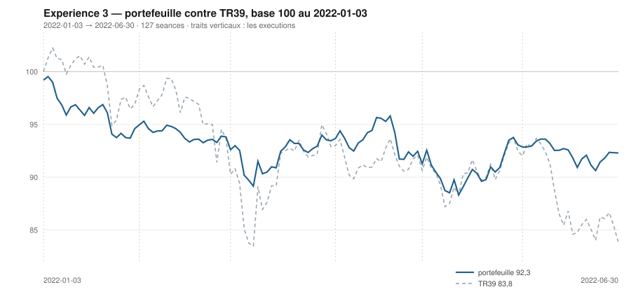

| | |
|---|---|
| Dotation initiale | 10 000,00 € au 2022-01-03 |
| Titres au 2022-06-30 | 3 629,94 € |
| Espèces | 5 599,41 € |
| **Total** | **9 229,35 €** |
| Base 100 | **92,29** |
| TR39, même base | 83,80 |
| Écart depuis janvier | **+8,49 pt** |

### Toutes les positions depuis le début de l'expérience

> Closes comme ouvertes. Une position encore ouverte laisse les deux dernières colonnes vides. Aucune séance postérieure au 2022-06-30 n'entre dans ce tableau.

| Société | Prix d'achat | Date d'achat | Prix de vente | Date de vente |
|---|---|---|---|---|
| `CAP.PA` Capgemini | 194,20 € | 2022-01-03 | 182,68 € | 2022-04-01 |
| `DSY.PA` Dassault Systèmes | 50,13 € | 2022-01-03 | 41,05 € | 2022-02-01 |
| `KER.PA` Kering | 558,25 € | 2022-03-01 | 454,99 € | 2022-06-01 |
| `HO.PA` Thales | 103,16 € | 2022-04-01 |  |  |
| `MT.AS` ArcelorMittal | 26,84 € | 2022-04-01 | 28,27 € | 2022-06-01 |
| `TTE.PA` TotalEnergies | 43,30 € | 2022-06-01 |  |  |

*6 positions depuis le début, dont 2 encore ouvertes : les deux dernières colonnes restent vides.*

## 5. L'étude chartiste au 2022-05-31

> Notes rédigées sans aucune séance postérieure au 2022-05-31, par l'agent `chartiste`. Cinq lignes au plus par société, **chacune sous la figure de décision qui la justifie** — celle que la règle a lue ce jour-là, portant les cinq critères, les vetos et le verdict.

### 1. `SAN.PA` — Sanofi

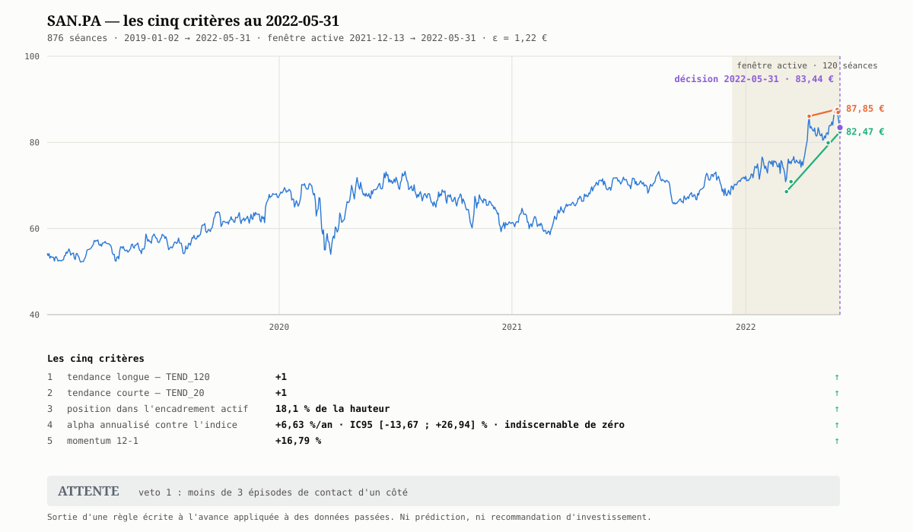

- Canal 82,47 – 87,85 €, clôture à 83,44 € à 18,1 % de la hauteur : le cinquième bas.
- Support +0,236 contre résistance +0,052 €/séance, τ de 29 séances.
- Deux contacts en résistance : veto 1.
- Momentum +16,8 %, alpha +6,6 %/an. Meilleur score de la date, et pourtant sous veto.

### 2. `HO.PA` — Thales

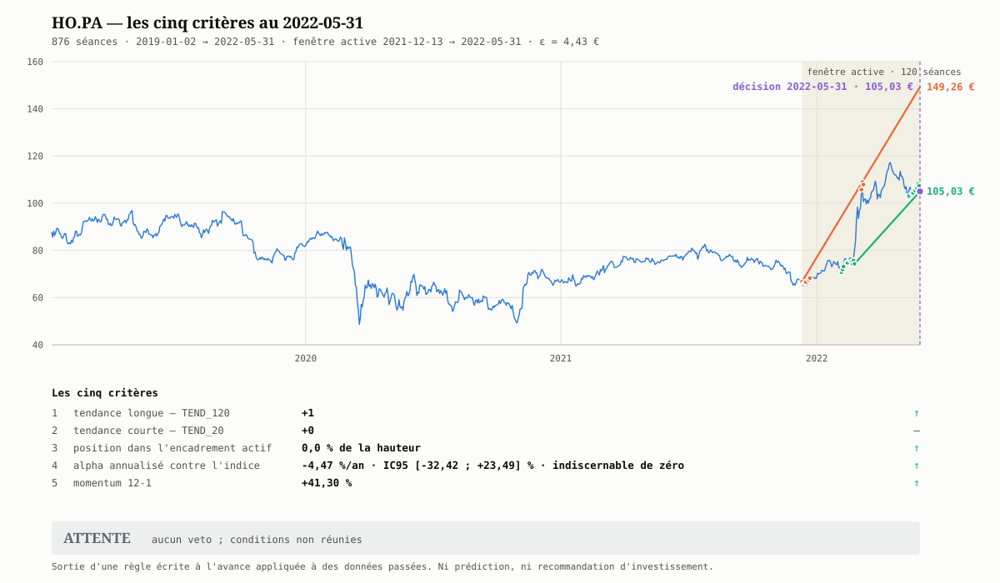

- Canal 105,03 – 149,26 €, large de 44,2 % — la figure la plus ouverte de la date —, clôture à 105,03 € : **exactement sur le support**, 0,0 %.
- Support +0,465 contre résistance +0,694 €/séance : le canal s'ouvre, τ infini.
- Quatre contacts bas, trois hauts : **aucun veto**.
- **Momentum +41,3 %, le plus fort de la date** ; alpha −4,5 %/an.

### 3. `AI.PA` — Air Liquide

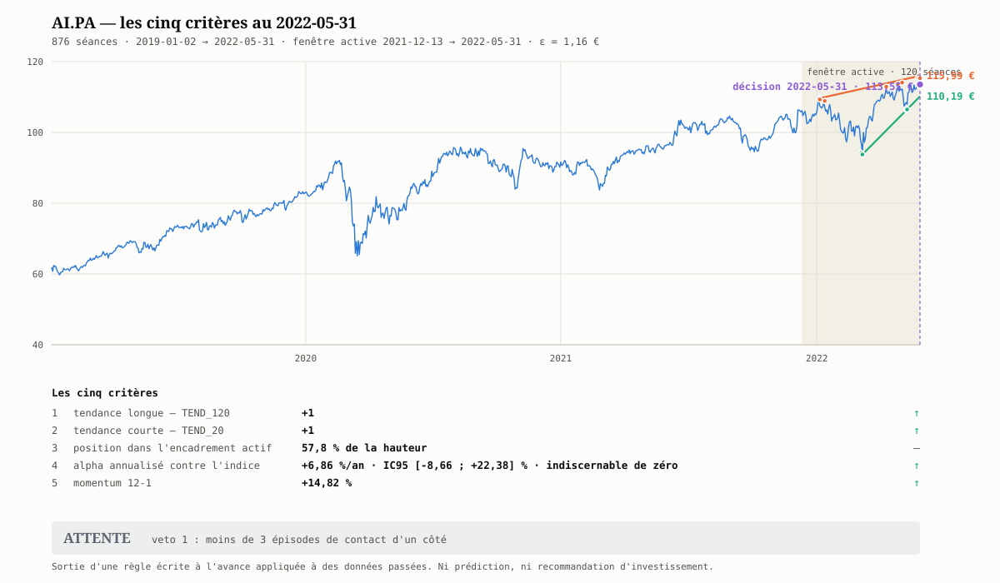

- Canal 110,19 – 115,99 €, clôture à 113,55 € à 57,8 % : le milieu haut.
- Pentes +0,283 et +0,063 €/séance, τ de 26 séances.
- Deux contacts en support contre six en résistance : veto 1.
- Momentum +14,8 %, alpha +6,9 %/an.

### 4. `TTE.PA` — TotalEnergies

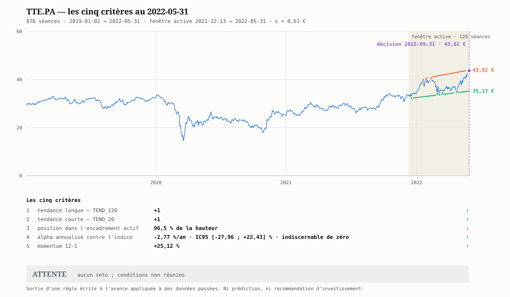

- Canal 35,17 – 43,92 €, clôture à 43,62 € à 96,5 % : contre le plafond.
- Pentes +0,026 et +0,039 €/séance : ouverture, τ infini.
- Cinq contacts bas, quatre hauts : **aucun veto** — la figure la mieux étayée de la date.
- Momentum +25,1 %, alpha −2,8 %/an.

### 5. `CA.PA` — Carrefour

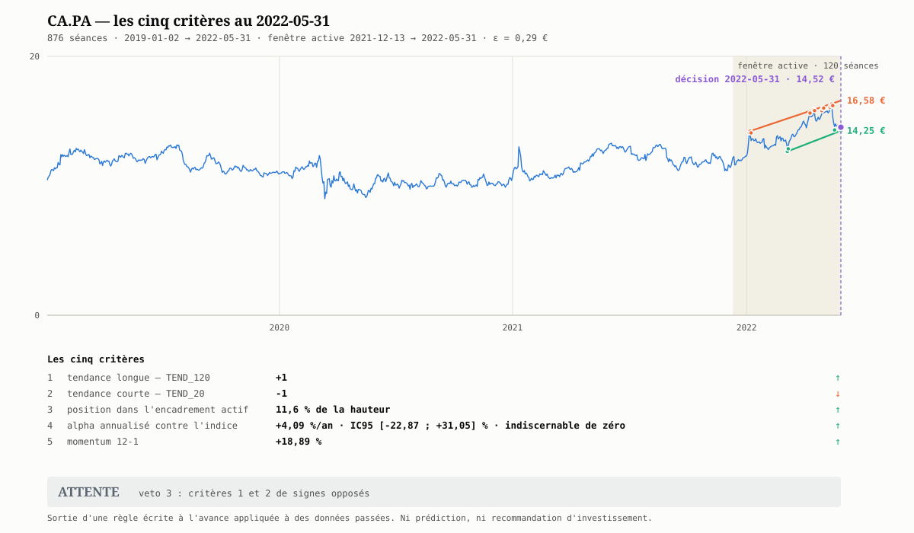

- Canal 14,25 – 16,58 €, clôture à 14,52 € à 11,6 % de la hauteur.
- Pentes +0,027 et +0,024 €/séance, quasi parallèles : τ de 656 séances.
- Trois contacts bas, cinq hauts : figure lisible ; seul le veto 3 mord.
- Momentum +18,9 %, alpha +4,1 %/an.

### 6. `ORA.PA` — Orange

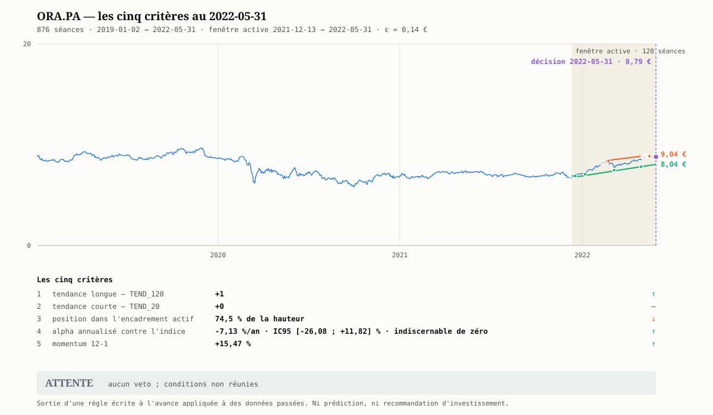

- Canal 8,04 – 9,04 €, clôture à 8,79 € à 74,5 % de la hauteur.
- Pentes +0,011 et +0,009 €/séance, τ de 472 séances.
- Cinq contacts bas, trois hauts : **aucun veto**.
- Momentum +15,5 %, alpha −7,1 %/an.

### 7. `CS.PA` — AXA

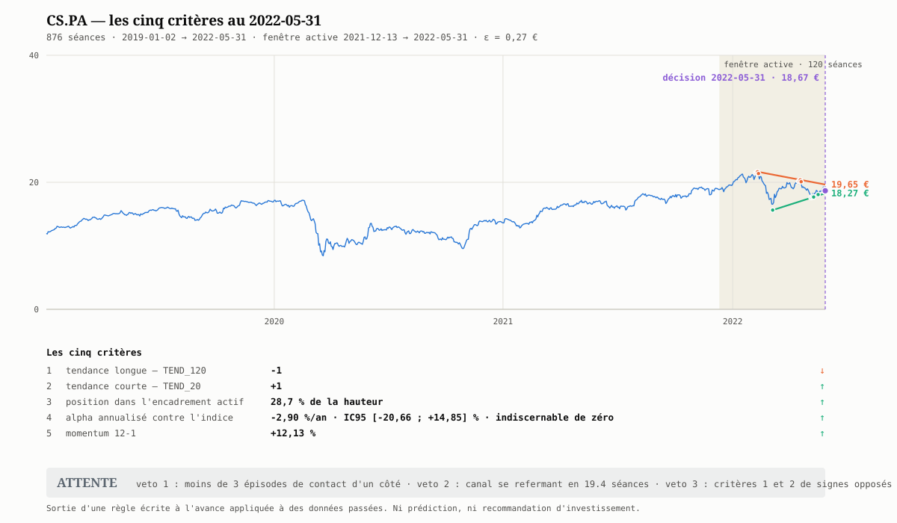

- Canal 18,27 – 19,65 €, clôture à 18,67 € à 28,7 %.
- Support +0,045 contre résistance −0,026 €/séance : **le canal se referme en 19 séances**, veto 2.
- Deux contacts en résistance : veto 1 ; tendances opposées : veto 3. **Les trois vetos non arithmétiques.**
- Momentum +12,1 %, alpha −2,9 %/an.

### 8. `CAP.PA` — Capgemini

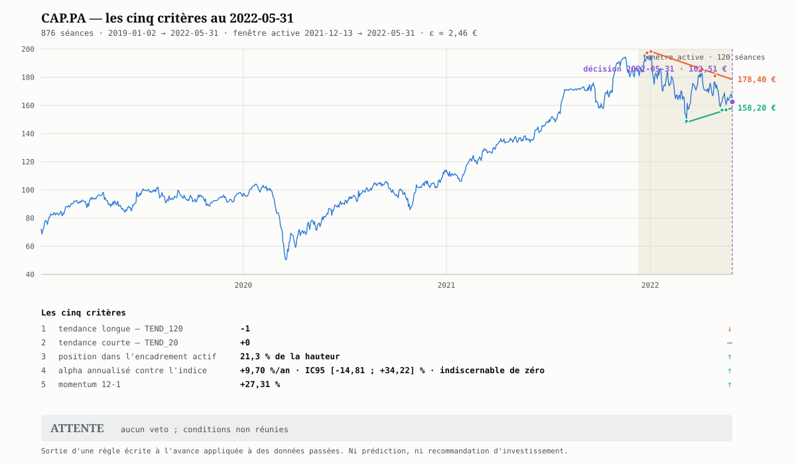

- Canal 158,20 – 178,40 €, clôture à 162,51 € à 21,3 % de la hauteur.
- Support +0,176 contre résistance −0,193 €/séance, τ de 55 séances.
- Trois contacts bas, quatre hauts : **aucun veto**.
- Momentum +27,3 %, alpha +9,7 %/an ; la tendance longue est négative.

### 9. `RI.PA` — Pernod Ricard

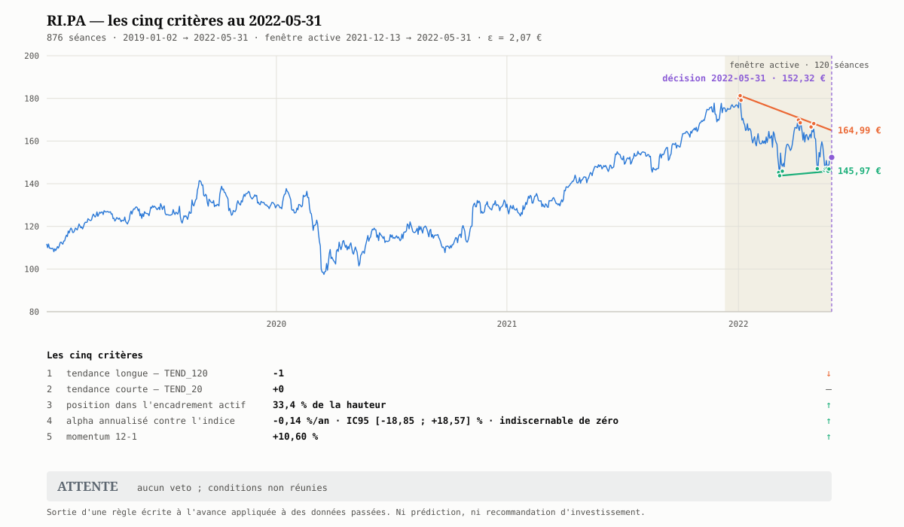

- Canal 145,97 – 164,99 €, clôture à 152,32 € à 33,4 % — sous le seuil de 35 %.
- Support +0,039 contre résistance −0,160 €/séance, τ de 96 séances.
- Quatre contacts de chaque côté : **aucun veto**, figure bien étayée.
- Momentum +10,6 %, alpha −0,1 %/an, rigoureusement nul.

### 10. `MT.AS` — ArcelorMittal

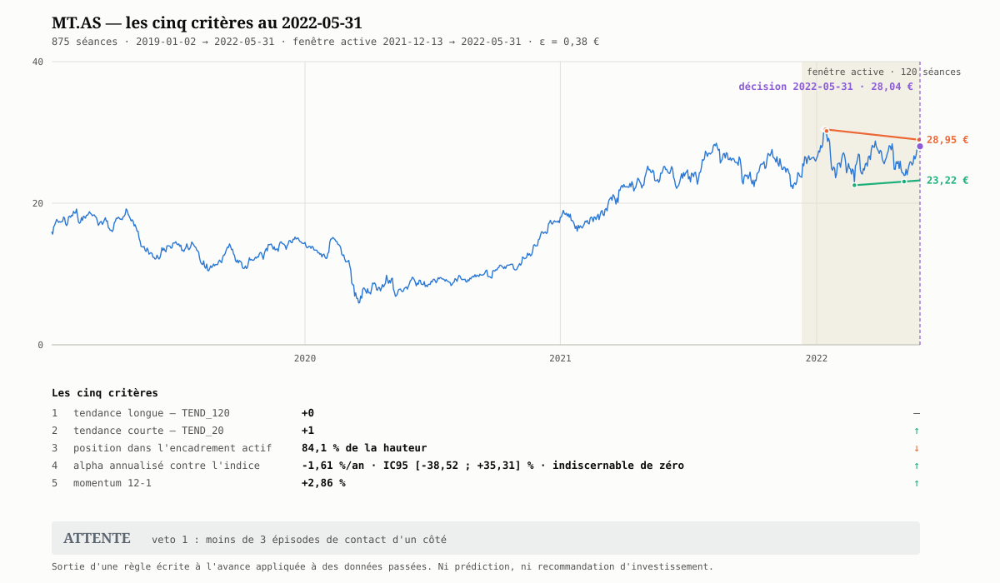

- Canal 23,22 – 28,95 €, clôture à 28,04 € à 84,1 % de la hauteur.
- Pentes +0,010 et −0,015 €/séance, τ de 222 séances.
- Deux contacts de chaque côté : veto 1.
- Momentum +2,9 %, alpha −1,6 %/an ; la tendance longue est retombée à zéro.

### 11. `EN.PA` — Bouygues

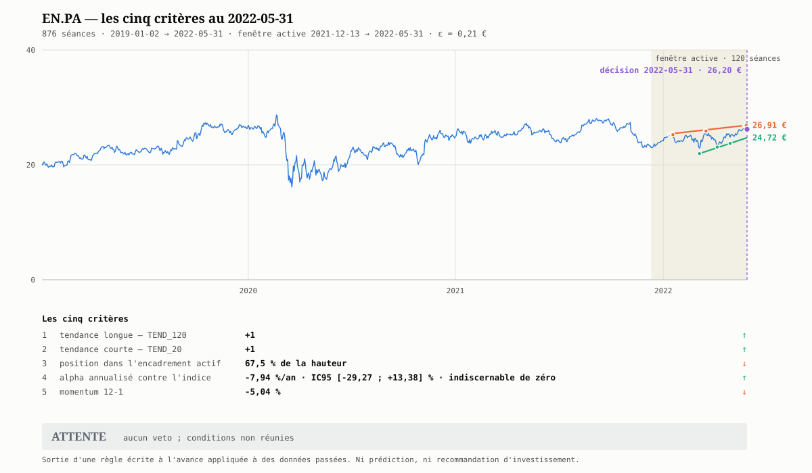

- Canal 24,72 – 26,91 €, clôture à 26,20 € à 67,5 % : au-dessus du seuil haut.
- Pentes +0,047 et +0,016 €/séance, τ de 70 séances.
- Trois contacts de chaque côté : **aucun veto**.
- Momentum −5,0 %, alpha −7,9 %/an.

### 12. `STMPA.PA` — STMicroelectronics

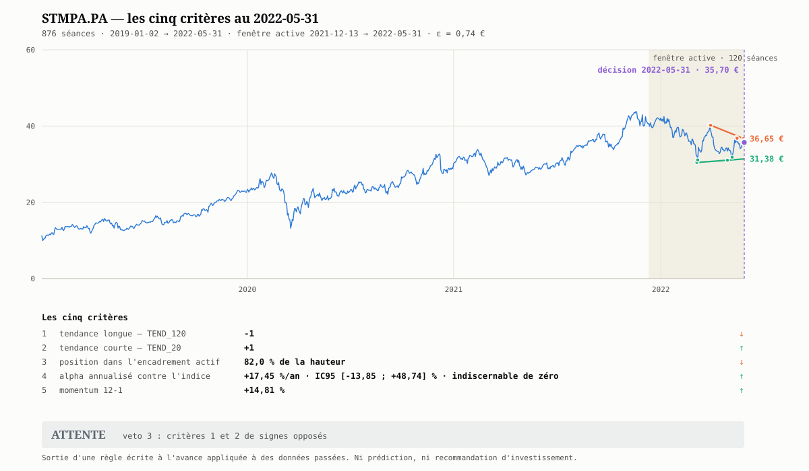

- Canal 31,38 – 36,65 €, clôture à 35,70 € à 82,0 % de la hauteur.
- Support +0,016 contre résistance −0,085 €/séance, τ de 52 séances.
- Trois contacts de chaque côté : figure lisible ; seul le veto 3 mord.
- Momentum +14,8 %, alpha +17,4 %/an.

### 13. `EL.PA` — EssilorLuxottica

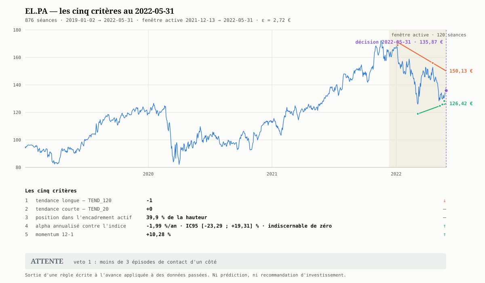

- Canal 126,42 – 150,13 €, clôture à 135,87 € à 39,9 %.
- Support +0,127 contre résistance −0,207 €/séance, τ de 71 séances.
- Deux contacts en résistance : veto 1.
- Momentum +10,3 %, alpha −2,0 %/an.

### 14. `BN.PA` — Danone

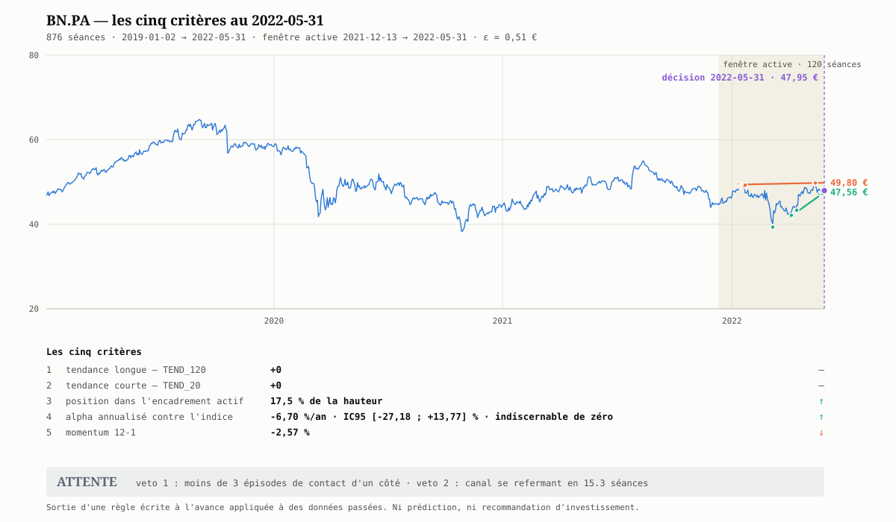

- Canal 47,56 – 49,80 €, clôture à 47,95 € à 17,5 % de la hauteur.
- Support +0,151 contre résistance +0,004 €/séance : **le canal se referme en 15 séances**, veto 2.
- Deux contacts en résistance : veto 1 également.
- Momentum −2,6 %, alpha −6,7 %/an.

### 15. `VIE.PA` — Veolia

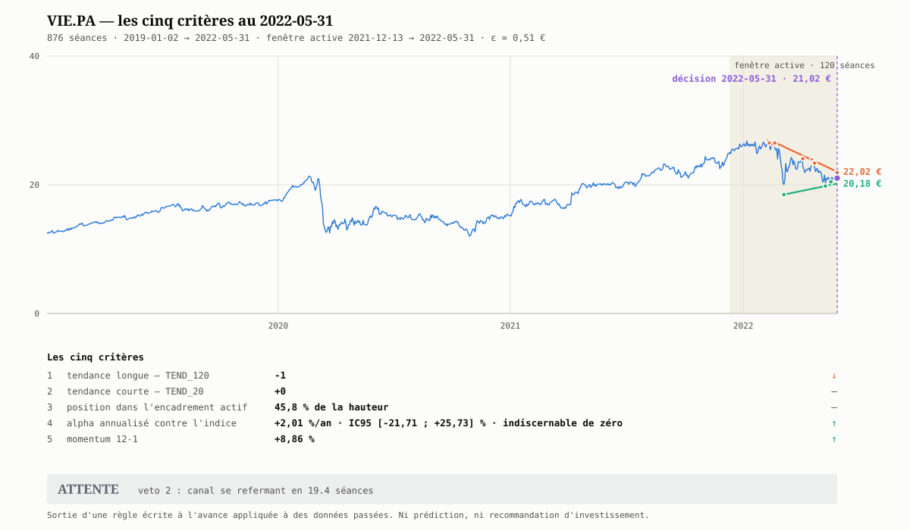

- Canal 20,18 – 22,02 €, clôture à 21,02 € à 45,8 % de la hauteur.
- Support +0,029 contre résistance −0,066 €/séance : **le canal se referme en 19 séances**, veto 2.
- Trois contacts bas, cinq hauts : la figure est étayée, la géométrie ne tient pas.
- Momentum +8,9 %, alpha +2,0 %/an.

### 16. `TEP.PA` — Teleperformance

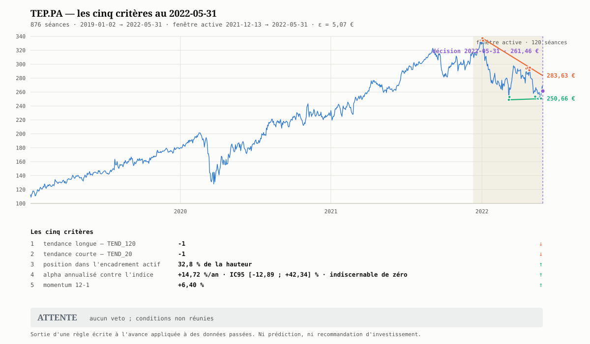

- Canal 250,66 – 283,63 €, clôture à 261,46 € à 32,8 % — sous le seuil de 35 %.
- Support +0,031 contre résistance −0,521 €/séance, τ de 60 séances.
- Quatre contacts bas, trois hauts : **aucun veto**.
- Momentum +6,4 %, alpha +14,7 %/an ; mais les deux tendances sont négatives.

### 17. `PUB.PA` — Publicis

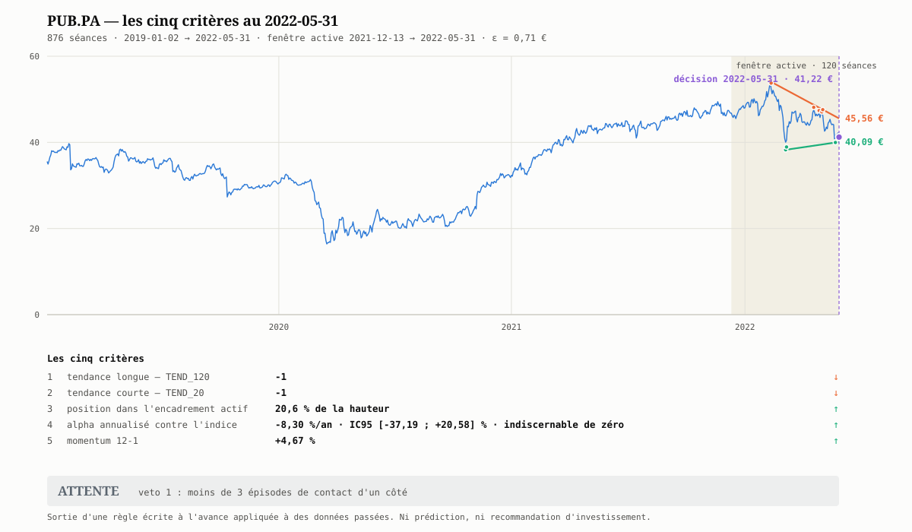

- Canal 40,09 – 45,56 €, clôture à 41,22 € à 20,6 %.
- Support +0,031 contre résistance −0,113 €/séance, τ de 38 séances.
- Deux contacts en support : veto 1.
- Momentum +4,7 %, alpha −8,3 %/an.

### 18. `ERF.PA` — Eurofins Scientific

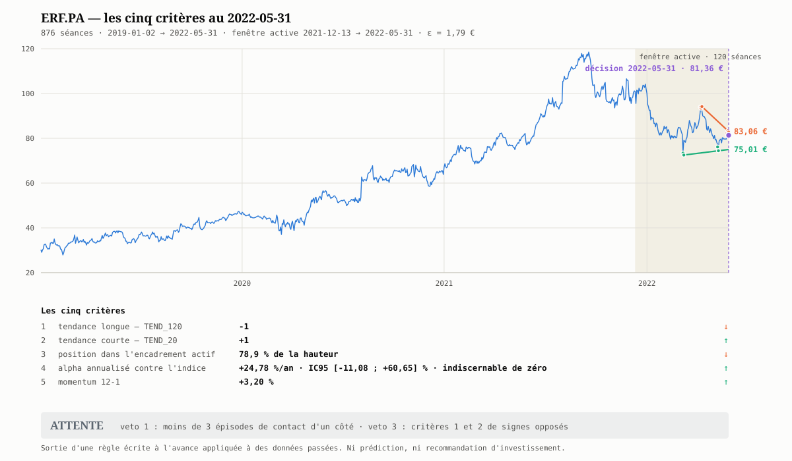

- Canal 75,01 – 83,06 €, clôture à 81,36 € à 78,9 % de la hauteur.
- Support +0,043 contre résistance −0,327 €/séance, τ de 22 séances : le canal ne passera pas le mois.
- Deux contacts de chaque côté : veto 1 ; tendances opposées : veto 3.
- Momentum +3,2 %, **alpha +24,8 %/an**, le plus élevé de la date.

### 19. `VIV.PA` — Vivendi

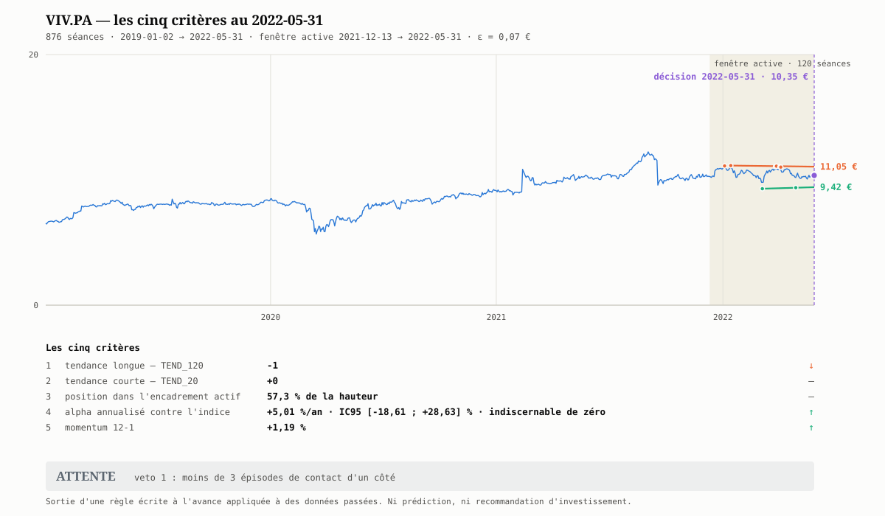

- Canal 9,42 – 11,05 €, clôture à 10,35 € à 57,3 % : le milieu.
- Pentes +0,002 et −0,001 €/séance, quasi plates : τ de 532 séances.
- Deux contacts en support : veto 1.
- Momentum +1,2 %, alpha +5,0 %/an.

### 20. `SU.PA` — Schneider Electric

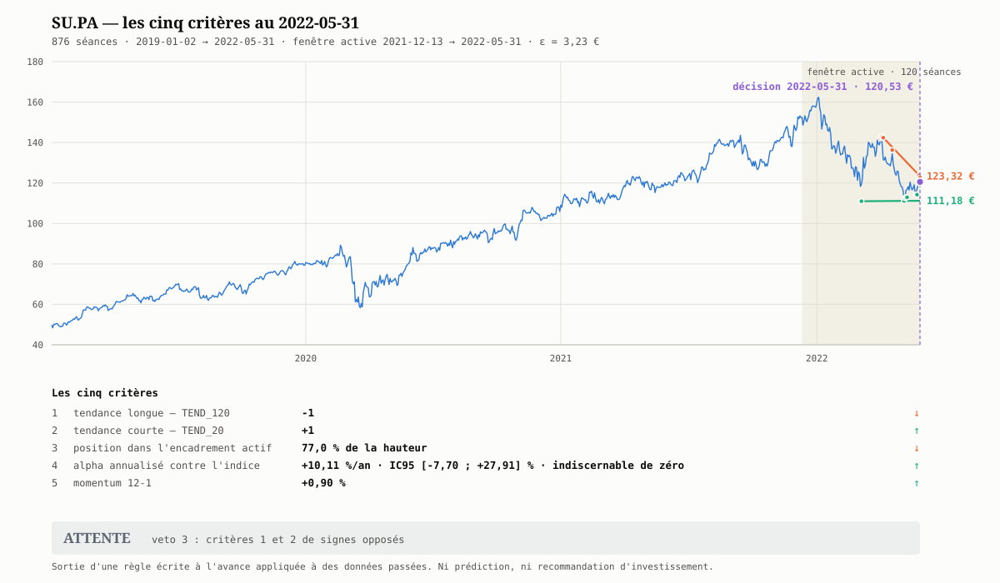

- Canal 111,18 – 123,32 €, clôture à 120,53 € à 77,0 % de la hauteur.
- Support +0,003 contre résistance −0,516 €/séance, τ de 23 séances.
- Trois contacts de chaque côté : figure lisible ; veto 3 seul.
- Momentum +0,9 %, alpha +10,1 %/an.

### 21. `DG.PA` — Vinci

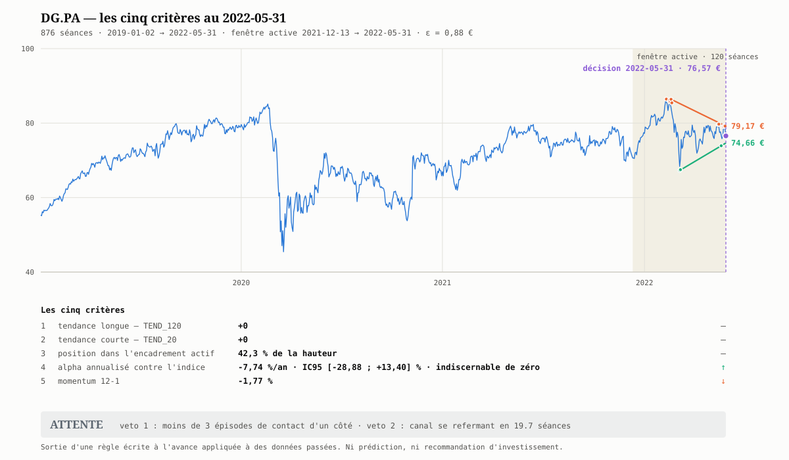

- Canal 74,66 – 79,17 €, clôture à 76,57 € à 42,3 % : le milieu.
- Support +0,125 contre résistance −0,103 €/séance : **le canal se referme en 20 séances**, veto 2.
- Deux contacts en support : veto 1 également.
- Momentum −1,8 %, alpha −7,7 %/an.

### 22. `DSY.PA` — Dassault Systèmes

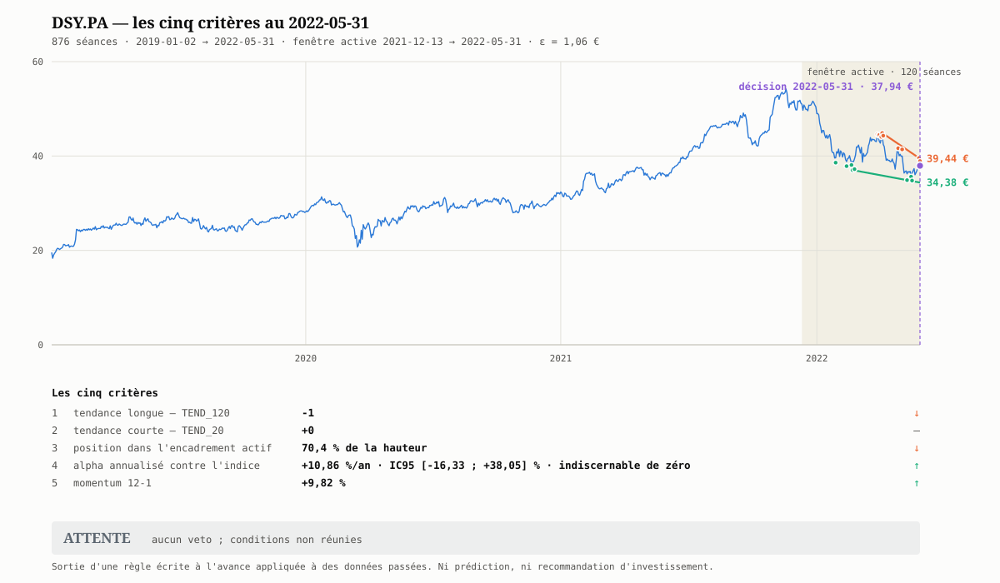

- Canal 34,38 – 39,44 €, clôture à 37,94 € à 70,4 %.
- Pentes −0,039 et −0,143 €/séance, τ de 49 séances.
- Cinq contacts bas, quatre hauts : **aucun veto**, figure très bien étayée.
- Momentum +9,8 %, à deux dixièmes du seuil de dix ; alpha +10,9 %/an.

### 23. `AIR.PA` — Airbus

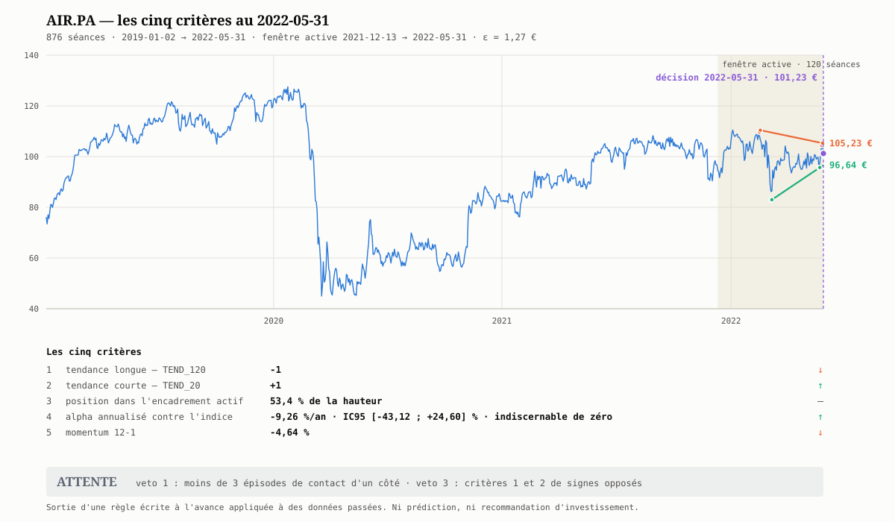

- Canal 96,64 – 105,23 €, clôture à 101,23 € à 53,4 % de la hauteur.
- Support +0,235 contre résistance −0,073 €/séance, τ de 28 séances.
- Deux contacts de chaque côté : veto 1 ; tendances opposées : veto 3.
- Momentum −4,6 %, alpha −9,3 %/an.

### 24. `ENGI.PA` — Engie

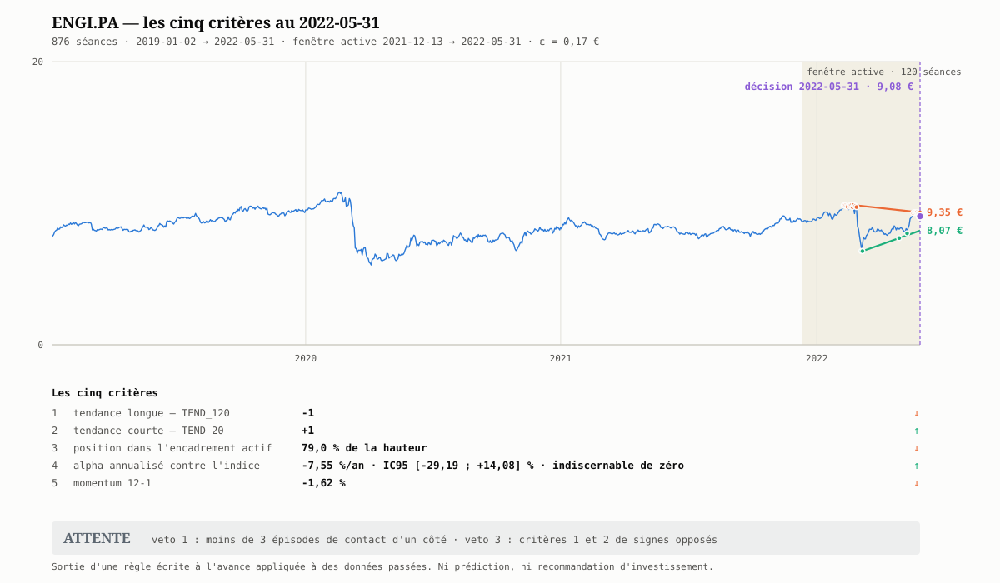

- Canal 8,07 – 9,35 €, clôture à 9,08 € à 79,0 % de la hauteur.
- Support +0,025 contre résistance −0,008 €/séance, τ de 39 séances.
- Deux contacts en résistance : veto 1 ; tendances opposées : veto 3.
- Momentum −1,6 %, alpha −7,5 %/an.

### 25. `ML.PA` — Michelin

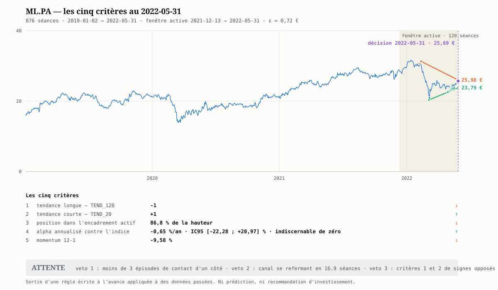

- Canal 23,79 – 25,98 €, clôture à 25,69 € à 86,8 %.
- Support +0,059 contre résistance −0,071 €/séance : **le canal se referme en 17 séances**, veto 2.
- Deux contacts en résistance : veto 1 ; tendances opposées : veto 3. **Les trois vetos.**
- Momentum −9,6 %, alpha −0,7 %/an.

### 26. `SGO.PA` — Saint-Gobain

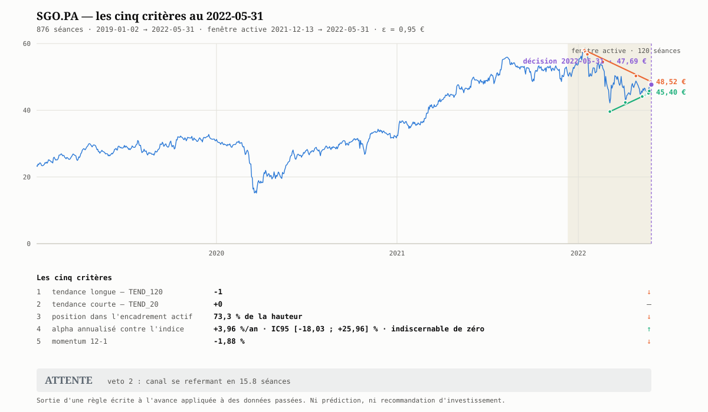

- Canal 45,40 – 48,52 €, clôture à 47,69 € à 73,3 %.
- Support +0,098 contre résistance −0,100 €/séance : **le canal se referme en 16 séances**, veto 2.
- Quatre contacts de chaque côté : figure étayée, géométrie périmée.
- Momentum −1,9 %, alpha +4,0 %/an.

### 27. `RMS.PA` — Hermès International

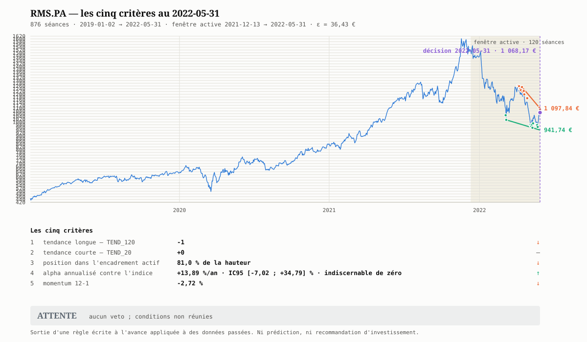

- Canal 941,74 – 1 097,84 €, large de 156 €, clôture à 1 068,17 € à 81,0 %.
- Pentes −1,272 et −4,977 €/séance, τ de 42 séances.
- Trois contacts de chaque côté : **aucun veto**.
- Momentum −2,7 %, alpha +13,9 %/an.

### 28. `LR.PA` — Legrand

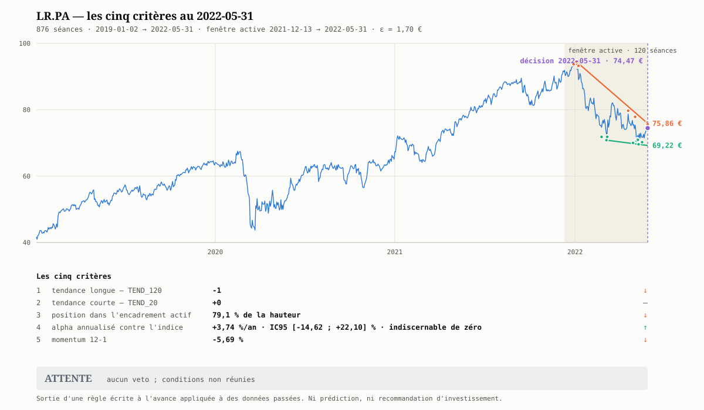

- Canal 69,22 – 75,86 €, clôture à 74,47 € à 79,1 % de la hauteur.
- Pentes −0,027 et −0,183 €/séance, τ de 43 séances.
- Cinq contacts bas, quatre hauts : **aucun veto**.
- Momentum −5,7 %, alpha +3,7 %/an.

### 29. `MC.PA` — LVMH

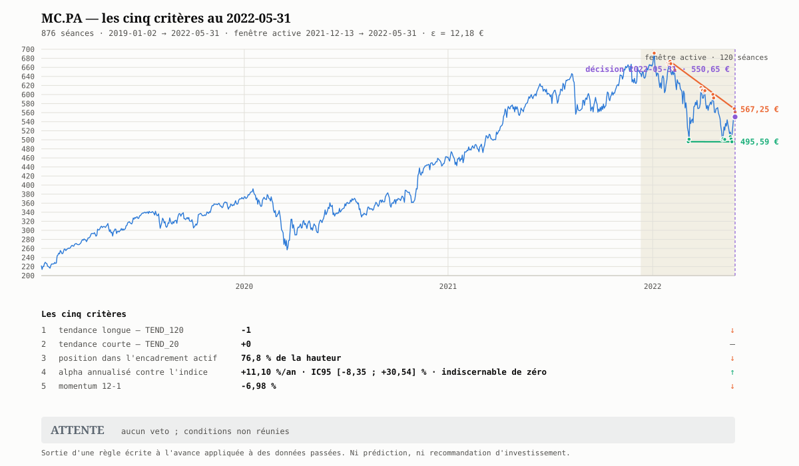

- Canal 495,59 – 567,25 €, clôture à 550,65 € à 76,8 %.
- Pentes −0,004 et −1,292 €/séance, τ de 56 séances.
- Trois contacts bas, six hauts : **aucun veto**.
- Momentum −7,0 %, alpha +11,1 %/an.

### 30. `OR.PA` — L'Oréal

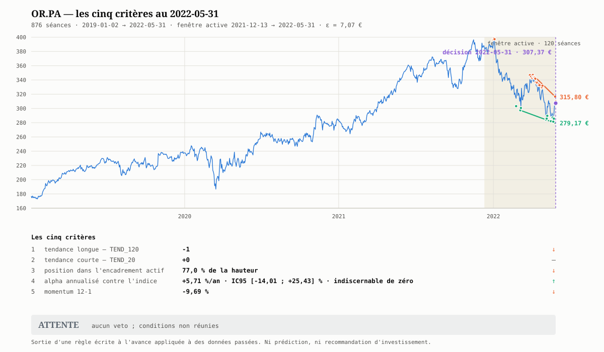

- Canal 279,17 – 315,80 €, clôture à 307,37 € à 77,0 % de la hauteur.
- Pentes −0,309 et −0,823 €/séance, τ de 71 séances.
- Quatre contacts de chaque côté : **aucun veto**, figure bien étayée.
- Momentum −9,7 %, alpha +5,7 %/an.

### 31. `BNP.PA` — BNP Paribas

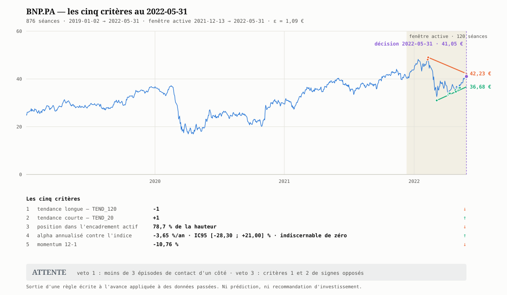

- Canal 36,68 – 42,23 €, clôture à 41,05 € à 78,7 % de la hauteur.
- Support +0,096 contre résistance −0,089 €/séance, τ de 30 séances.
- Quatre contacts bas, deux hauts : veto 1 ; tendances opposées : veto 3.
- Momentum −10,8 %, alpha −3,6 %/an.

### 32. `GLE.PA` — Société Générale

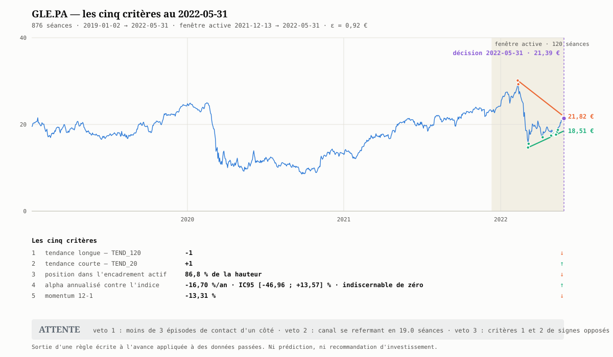

- Canal 18,51 – 21,82 €, clôture à 21,39 € à 86,8 %.
- Support +0,065 contre résistance −0,109 €/séance : **le canal se referme en 19 séances**, veto 2.
- Quatre contacts bas, deux hauts : veto 1 ; tendances opposées : veto 3. **Les trois vetos.**
- Momentum −13,3 %, alpha −16,7 %/an.

### 33. `ACA.PA` — Crédit Agricole

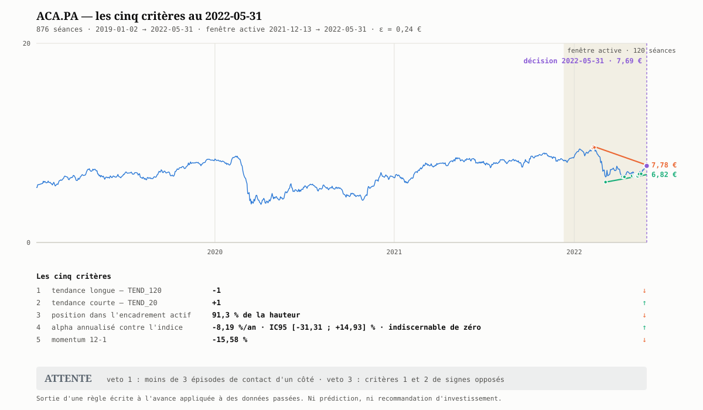

- Canal 6,82 – 7,78 €, large de 0,9 %, clôture à 7,69 € à 91,3 % de la hauteur.
- Support +0,013 contre résistance −0,025 €/séance, τ de 26 séances.
- Cinq contacts bas, deux hauts : veto 1 ; tendances opposées : veto 3.
- Momentum −15,6 %, alpha −8,2 %/an.

### 34. `SAF.PA` — Safran

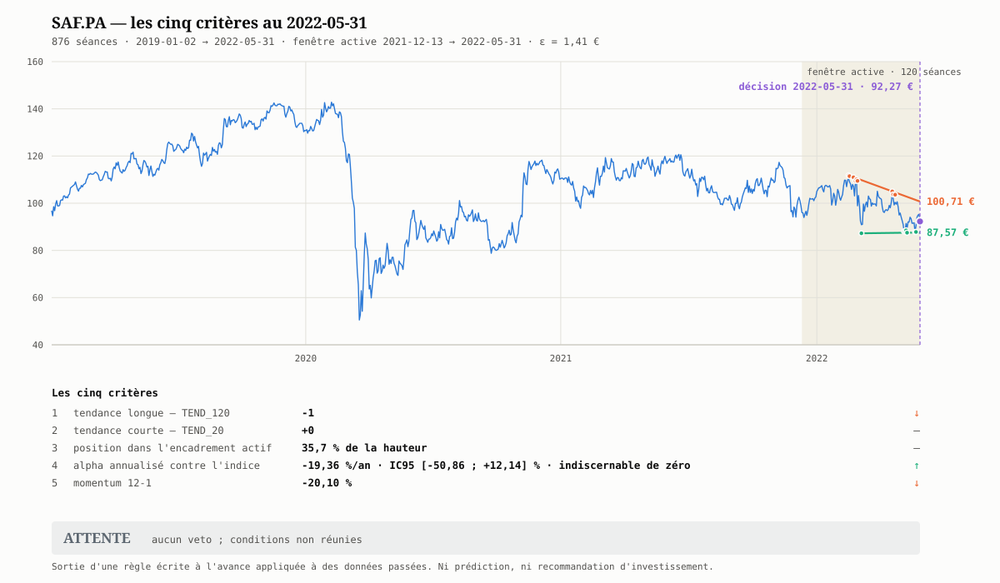

- Canal 87,57 – 100,71 €, clôture à 92,27 € à 35,7 % de la hauteur — à peine au-dessus du seuil bas.
- Pentes +0,005 et −0,154 €/séance, τ de 82 séances.
- Trois contacts de chaque côté : **aucun veto**.
- Momentum −20,1 %, alpha −19,4 %/an.

### 35. `STLAP.PA` — Stellantis

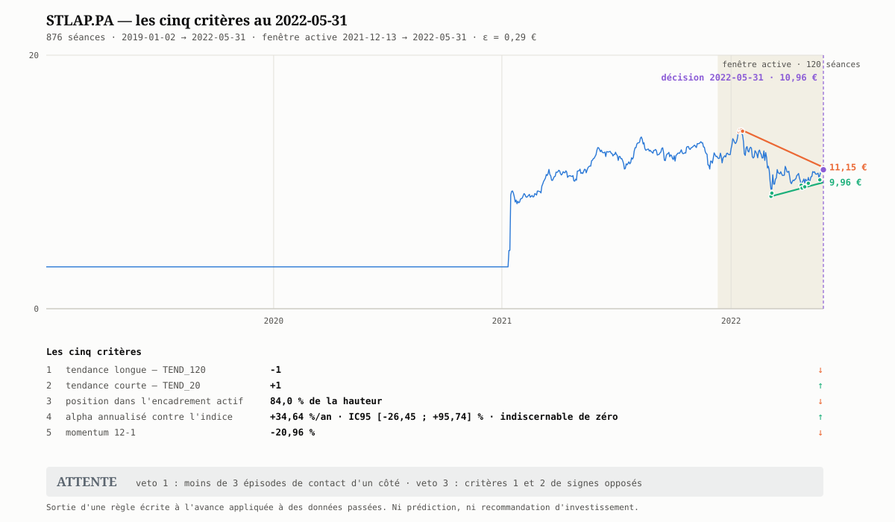

- Canal 9,96 – 11,15 €, large de 1,2 %, clôture à 10,96 € à 84,0 % de la hauteur.
- Support +0,019 contre résistance −0,032 €/séance, τ de 24 séances.
- Cinq contacts bas, deux hauts : veto 1 ; tendances opposées : veto 3.
- Momentum −21,0 %, alpha +34,6 %/an sur un IC95 de 122 points : la mesure ne porte rien.

### 36. `WLN.PA` — Worldline

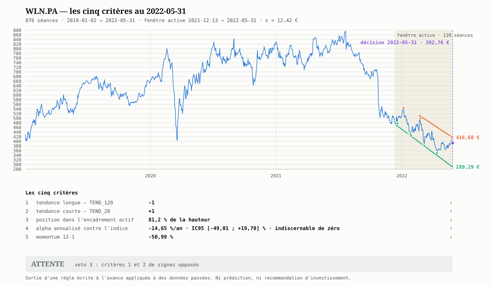

- Canal 289,29 – 416,68 €, d'une largeur de 127 % — la plus étirée de la date —, clôture à 392,76 € à 81,2 %.
- Pentes −1,565 et −1,393 €/séance : ouverture, τ infini.
- Cinq contacts bas, trois hauts : figure lisible ; seul le veto 3 mord.
- **Momentum −51,0 %** ; alpha −14,7 %/an.

### 37. `ALO.PA` — Alstom

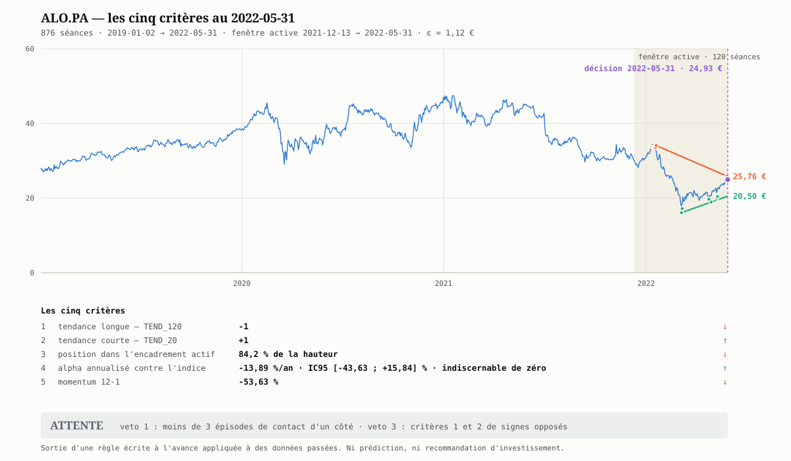

- Canal 20,50 – 25,76 €, clôture à 24,93 € à 84,2 %.
- Support +0,075 contre résistance −0,091 €/séance, τ de 32 séances.
- Quatre contacts bas, deux hauts : veto 1 ; tendances opposées : veto 3.
- **Momentum −53,6 %, le plus faible de toute l'année** ; alpha −13,9 %/an.

### 38. `KER.PA` — Kering

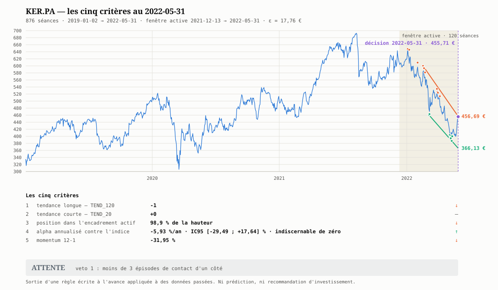

- **La règle publie de nouveau des critères** après deux mois d'échec du contrôle de non-traversée.
- Canal 366,13 – 456,69 €, clôture à 455,71 € à 98,9 % : contre le plafond, au plus haut du canal.
- Pentes −1,598 et −2,016 €/séance, τ de 217 séances ; deux contacts en support contre sept en résistance : veto 1.
- Momentum −31,9 %, alpha −5,9 %/an. Score −5.

### 39. `RNO.PA` — Renault

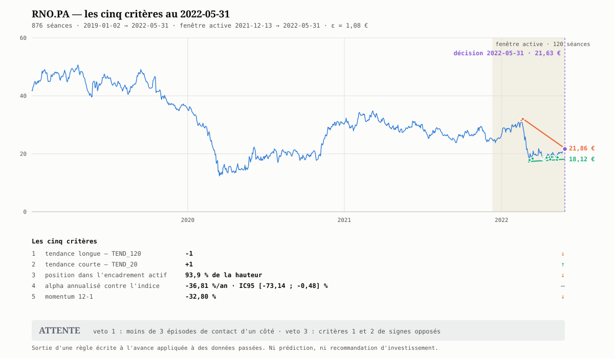

- Canal 18,12 – 21,86 €, clôture à 21,63 € à 93,9 % de la hauteur.
- Support +0,013 contre résistance −0,148 €/séance, τ de 23 séances.
- Six contacts bas, deux hauts : veto 1 ; tendances opposées : veto 3.
- **Alpha significativement négatif** : −36,8 %/an, IC95 de −73,1 à −0,5. Momentum −32,8 %.

## 6. Le classement au 2022-05-31

> De la valeur la plus intéressante à détenir à celle qu'il faut fuir. La colonne **τ** donne la date de péremption du canal en séances, la colonne **Vetos** les numéros déclenchés. Une valeur sous veto ne peut pas être achetée.

| Rang | Valeur | `s1` | `s2` | `s3` | `s4` | `s5` | Score | Position | Momentum | τ | Vetos |
|---|---|---|---|---|---|---|---|---|---|---|---|
| 1 | `SAN.PA` Sanofi | +2 | +1 | +1 | +2 | +0 | **+6** | 18,1 % | +16,8 % | 29,2 | 1 |
| 2 | `HO.PA` Thales | +2 | +0 | +1 | +2 | +0 | **+5** | 0,0 % | +41,3 % | ∞ | — |
| 3 | `AI.PA` Air Liquide | +2 | +1 | +0 | +2 | +0 | **+5** | 57,8 % | +14,8 % | 26,3 | 1 |
| 4 | `TTE.PA` TotalEnergies | +2 | +1 | -1 | +2 | +0 | **+4** | 96,5 % | +25,1 % | ∞ | — |
| 5 | `CA.PA` Carrefour | +2 | -1 | +1 | +2 | +0 | **+4** | 11,6 % | +18,9 % | 655,9 | 3 |
| 6 | `ORA.PA` Orange | +2 | +0 | -1 | +2 | +0 | **+3** | 74,5 % | +15,5 % | 471,7 | — |
| 7 | `CS.PA` AXA | -2 | +1 | +1 | +2 | +0 | **+2** | 28,7 % | +12,1 % | 19,4 | 1 2 3 |
| 8 | `CAP.PA` Capgemini | -2 | +0 | +1 | +2 | +0 | **+1** | 21,3 % | +27,3 % | 54,8 | — |
| 9 | `RI.PA` Pernod Ricard | -2 | +0 | +1 | +2 | +0 | **+1** | 33,4 % | +10,6 % | 95,8 | — |
| 10 | `MT.AS` ArcelorMittal | +0 | +1 | -1 | +1 | +0 | **+1** | 84,1 % | +2,9 % | 221,5 | 1 |
| 11 | `EN.PA` Bouygues | +2 | +1 | -1 | -1 | +0 | **+1** | 67,5 % | -5,0 % | 70,4 | — |
| 12 | `STMPA.PA` STMicroelectronics | -2 | +1 | -1 | +2 | +0 | **+0** | 82,0 % | +14,8 % | 52,2 | 3 |
| 13 | `EL.PA` EssilorLuxottica | -2 | +0 | +0 | +2 | +0 | **+0** | 39,9 % | +10,3 % | 71,0 | 1 |
| 14 | `BN.PA` Danone | +0 | +0 | +1 | -1 | +0 | **+0** | 17,5 % | -2,6 % | 15,3 | 1 2 |
| 15 | `VIE.PA` Veolia | -2 | +0 | +0 | +1 | +0 | **-1** | 45,8 % | +8,9 % | 19,4 | 2 |
| 16 | `TEP.PA` Teleperformance | -2 | -1 | +1 | +1 | +0 | **-1** | 32,8 % | +6,4 % | 59,8 | — |
| 17 | `PUB.PA` Publicis | -2 | -1 | +1 | +1 | +0 | **-1** | 20,6 % | +4,7 % | 38,0 | 1 |
| 18 | `ERF.PA` Eurofins Scientific | -2 | +1 | -1 | +1 | +0 | **-1** | 78,9 % | +3,2 % | 21,7 | 1 3 |
| 19 | `VIV.PA` Vivendi | -2 | +0 | +0 | +1 | +0 | **-1** | 57,3 % | +1,2 % | 531,6 | 1 |
| 20 | `SU.PA` Schneider Electric | -2 | +1 | -1 | +1 | +0 | **-1** | 77,0 % | +0,9 % | 23,4 | 3 |
| 21 | `DG.PA` Vinci | +0 | +0 | +0 | -1 | +0 | **-1** | 42,3 % | -1,8 % | 19,7 | 1 2 |
| 22 | `DSY.PA` Dassault Systèmes | -2 | +0 | -1 | +1 | +0 | **-2** | 70,4 % | +9,8 % | 48,5 | — |
| 23 | `AIR.PA` Airbus | -2 | +1 | +0 | -1 | +0 | **-2** | 53,4 % | -4,6 % | 27,9 | 1 3 |
| 24 | `ENGI.PA` Engie | -2 | +1 | -1 | -1 | +0 | **-3** | 79,0 % | -1,6 % | 39,2 | 1 3 |
| 25 | `ML.PA` Michelin | -2 | +1 | -1 | -1 | +0 | **-3** | 86,8 % | -9,6 % | 16,9 | 1 2 3 |
| 26 | `SGO.PA` Saint-Gobain | -2 | +0 | -1 | -1 | +0 | **-4** | 73,3 % | -1,9 % | 15,8 | 2 |
| 27 | `RMS.PA` Hermès International | -2 | +0 | -1 | -1 | +0 | **-4** | 81,0 % | -2,7 % | 42,1 | — |
| 28 | `LR.PA` Legrand | -2 | +0 | -1 | -1 | +0 | **-4** | 79,1 % | -5,7 % | 42,8 | — |
| 29 | `MC.PA` LVMH | -2 | +0 | -1 | -1 | +0 | **-4** | 76,8 % | -7,0 % | 55,6 | — |
| 30 | `OR.PA` L'Oréal | -2 | +0 | -1 | -1 | +0 | **-4** | 77,0 % | -9,7 % | 71,3 | — |
| 31 | `BNP.PA` BNP Paribas | -2 | +1 | -1 | -2 | +0 | **-4** | 78,7 % | -10,8 % | 29,9 | 1 3 |
| 32 | `GLE.PA` Société Générale | -2 | +1 | -1 | -2 | +0 | **-4** | 86,8 % | -13,3 % | 19,0 | 1 2 3 |
| 33 | `ACA.PA` Crédit Agricole | -2 | +1 | -1 | -2 | +0 | **-4** | 91,3 % | -15,6 % | 25,5 | 1 3 |
| 34 | `SAF.PA` Safran | -2 | +0 | +0 | -2 | +0 | **-4** | 35,7 % | -20,1 % | 82,4 | — |
| 35 | `STLAP.PA` Stellantis | -2 | +1 | -1 | -2 | +0 | **-4** | 84,0 % | -21,0 % | 23,6 | 1 3 |
| 36 | `WLN.PA` Worldline | -2 | +1 | -1 | -2 | +0 | **-4** | 81,2 % | -51,0 % | ∞ | 3 |
| 37 | `ALO.PA` Alstom | -2 | +1 | -1 | -2 | +0 | **-4** | 84,2 % | -53,6 % | 31,6 | 1 3 |
| 38 | `KER.PA` Kering | -2 | +0 | -1 | -2 | +0 | **-5** | 98,9 % | -31,9 % | 216,7 | 1 |
| 39 | `RNO.PA` Renault | -2 | +1 | -1 | -2 | -1 | **-5** | 93,9 % | -32,8 % | 23,1 | 1 3 |

## 7. Les ordres exécutés au 2022-06-01

> À l'**ouverture** de la séance, jamais à la clôture du 2022-05-31.

| Sens | Valeur | Quantité | Prix d'exécution | Brut | Frais | Motif |
|---|---|---|---|---|---|---|
| **Vente** | `KER.PA` Kering | 3 | 454,99 € | 1 364,98 € | 1,57 € | rang 38 au-dela de 7 |
| **Vente** | `MT.AS` ArcelorMittal | 72 | 28,27 € | 2 035,14 € | 2,34 € | rang 10 au-dela de 7 |
| **Achat** | `TTE.PA` TotalEnergies | 42 | 43,30 € | 1 818,77 € | 7,55 € | rang 4, score +4, aucun veto |

## 8. La lecture du mois

Sur le mois, la meilleure contribution vient de `HO.PA` (Thales) pour **+57,41 €**, la moins bonne de `TTE.PA` (TotalEnergies) pour **-144,30 €**. Les 3 ordres du mois ont coûté **11,46 €** de frais, soit 0,115 % de la dotation initiale. Le portefeuille termine le mois **devant TR39** de 8,52 point. Sur les 33 thèses du mois précédent qui ont pu être tranchées, **15 sont confirmées** — 45,5 %.

## 9. Les thèses écrites au 2022-05-31

> Elles seront dépouillées à la prochaine date de décision, dans le fichier du mois suivant. Elles sont engendrées mécaniquement par les règles du [protocole](../README.md#le-registre-des-thèses-réfutables) — aucune n'est rédigée à la main.

| Valeur | Thèse | Énoncé, à dépouiller au mois suivant |
|---|---|---|
| `ACA.PA` | Canal | clôture entre 7,10 € et 7,24 € au 2022-06-30 |
| `ACA.PA` | Reflexive | AUCUNE SEQUENCE : écart contre TR39 dans ± 4,94 pt (σ̂), au 2022-06-30 |
| `AI.PA` | Canal | clôture entre 116,42 € et 117,37 € au 2022-06-30 |
| `AIR.PA` | Canal | clôture entre 101,81 € et 103,62 € au 2022-06-30 |
| `ALO.PA` | Canal | clôture entre 22,16 € et 23,75 € au 2022-06-30 |
| `ALO.PA` | Reflexive | AUCUNE SEQUENCE : écart contre TR39 dans ± 7,10 pt (σ̂), au 2022-06-30 |
| `BN.PA` | Canal | encadrement ferme avant le 2022-06-30 : les bornes prolongees se croisent, la thèse est inconfirmable à l'écriture |
| `BNP.PA` | Canal | clôture entre 38,79 € et 40,27 € au 2022-06-30 |
| `BNP.PA` | Reflexive | AUCUNE SEQUENCE : écart contre TR39 dans ± 6,03 pt (σ̂), au 2022-06-30 |
| `CA.PA` | Canal | clôture entre 14,85 € et 17,10 € au 2022-06-30 |
| `CAP.PA` | Canal | clôture entre 162,07 € et 174,16 € au 2022-06-30 |
| `CS.PA` | Canal | encadrement ferme avant le 2022-06-30 : les bornes prolongees se croisent, la thèse est inconfirmable à l'écriture |
| `CS.PA` | Reflexive | AUCUNE SEQUENCE : écart contre TR39 dans ± 5,95 pt (σ̂), au 2022-06-30 |
| `DG.PA` | Canal | encadrement ferme avant le 2022-06-30 : les bornes prolongees se croisent, la thèse est inconfirmable à l'écriture |
| `DSY.PA` | Canal | clôture entre 33,53 € et 36,29 € au 2022-06-30 |
| `EL.PA` | Canal | clôture entre 129,21 € et 145,57 € au 2022-06-30 |
| `EN.PA` | Canal | clôture entre 25,75 € et 27,26 € au 2022-06-30 |
| `ENGI.PA` | Canal | clôture entre 8,62 € et 9,18 € au 2022-06-30 |
| `ERF.PA` | Canal | encadrement ferme avant le 2022-06-30 : les bornes prolongees se croisent, la thèse est inconfirmable à l'écriture |
| `ERF.PA` | Reflexive | AUCUNE SEQUENCE : écart contre TR39 dans ± 9,84 pt (σ̂), au 2022-06-30 |
| `GLE.PA` | Canal | encadrement ferme avant le 2022-06-30 : les bornes prolongees se croisent, la thèse est inconfirmable à l'écriture |
| `GLE.PA` | Reflexive | AUCUNE SEQUENCE : écart contre TR39 dans ± 7,79 pt (σ̂), au 2022-06-30 |
| `HO.PA` | Canal | clôture entre 115,27 € et 164,52 € au 2022-06-30 |
| `KER.PA` | Canal | clôture entre 330,97 € et 412,34 € au 2022-06-30 |
| `LR.PA` | Canal | clôture entre 68,62 € et 71,84 € au 2022-06-30 |
| `MC.PA` | Canal | clôture entre 495,51 € et 538,83 € au 2022-06-30 |
| `ML.PA` | Canal | encadrement ferme avant le 2022-06-30 : les bornes prolongees se croisent, la thèse est inconfirmable à l'écriture |
| `MT.AS` | Canal | clôture entre 23,45 € et 28,61 € au 2022-06-30 |
| `MT.AS` | Reflexive | AUCUNE SEQUENCE : écart contre TR39 dans ± 8,64 pt (σ̂), au 2022-06-30 |
| `OR.PA` | Canal | clôture entre 272,36 € et 297,69 € au 2022-06-30 |
| `ORA.PA` | Canal | clôture entre 8,28 € et 9,24 € au 2022-06-30 |
| `PUB.PA` | Canal | clôture entre 40,77 € et 43,07 € au 2022-06-30 |
| `RI.PA` | Canal | clôture entre 146,82 € et 161,47 € au 2022-06-30 |
| `RMS.PA` | Canal | clôture entre 913,76 € et 988,34 € au 2022-06-30 |
| `RNO.PA` | Canal | clôture entre 18,42 € et 18,60 € au 2022-06-30 |
| `SAF.PA` | Canal | clôture entre 87,69 € et 97,32 € au 2022-06-30 |
| `SAN.PA` | Canal | clôture entre 87,66 € et 88,99 € au 2022-06-30 |
| `SGO.PA` | Canal | encadrement ferme avant le 2022-06-30 : les bornes prolongees se croisent, la thèse est inconfirmable à l'écriture |
| `STLAP.PA` | Canal | clôture entre 10,37 € et 10,45 € au 2022-06-30 |
| `STMPA.PA` | Canal | clôture entre 31,73 € et 34,78 € au 2022-06-30 |
| `SU.PA` | Canal | clôture entre 111,25 € et 111,97 € au 2022-06-30 |
| `TEP.PA` | Canal | clôture entre 251,34 € et 272,17 € au 2022-06-30 |
| `TEP.PA` | Reflexive | RETOURNEMENT : écart contre TR39 au-dessous de −2,87 pt (0,5 σ̂), au 2022-06-30 |
| `TTE.PA` | Canal | clôture entre 35,74 € et 44,77 € au 2022-06-30 |
| `VIE.PA` | Canal | encadrement ferme avant le 2022-06-30 : les bornes prolongees se croisent, la thèse est inconfirmable à l'écriture |
| `VIV.PA` | Canal | clôture entre 9,47 € et 11,03 € au 2022-06-30 |
| `VIV.PA` | Reflexive | AUCUNE SEQUENCE : écart contre TR39 dans ± 5,60 pt (σ̂), au 2022-06-30 |
| `WLN.PA` | Canal | clôture entre 254,87 € et 386,04 € au 2022-06-30 |
| `WLN.PA` | Reflexive | AUCUNE SEQUENCE : écart contre TR39 dans ± 9,11 pt (σ̂), au 2022-06-30 |

---

[← Mai](2022-05.md) · [Protocole](../README.md) · [Juillet →](2022-07.md)
