# Juillet 2022

> Journal de l'[expérience 3](../README.md) · **décision au 2022-06-30** · **exécution au 2022-07-01**
> Portefeuille au 2022-07-29 : **9 280,54 €** (base 92,81) · TR39 90,64 · alpha du mois **-7,60 pt** · depuis janvier **+2,16 pt**

---

## 1. Les actualités du mois précédent

**Juin 2022.** Le pire mois du premier semestre. L'inflation américaine de mai,
publiée le 10 juin à 8,6 %, prend le marché à contre-pied et déclenche une chute
générale ; la Réserve fédérale relève ses taux de trois quarts de point, la plus
forte hausse depuis 1994. Le CAC 40 perd près de 8 % sur le mois et clôt le
semestre sur un recul d'environ 17 %.

La BCE convoque une réunion d'urgence pour annoncer un instrument
anti-fragmentation, les écarts de taux italiens s'étant brutalement écartés.
Le mot « récession » devient le sujet dominant : le cuivre, le pétrole et les
cycliques reculent ensemble.

## 2. Le dépouillement des thèses écrites au 2022-05-31

> Piste **S4**. Ces énoncés ont été écrits le mois dernier, avant de connaître ce mois-ci. Aucun n'a été retouché ; le verdict est calculé.

| Valeur | Thèse | Énoncé | Constaté | Verdict |
|---|---|---|---|---|
| `ACA.PA` | Canal | clôture entre 7,10 € et 7,24 € au 2022-06-30 | 6,51 € | démentie |
| `ACA.PA` | Reflexive | AUCUNE SEQUENCE : écart contre TR39 dans ± 4,94 pt (σ̂), au 2022-06-30 | -6,01 pt | démentie |
| `AI.PA` | Canal | clôture entre 116,42 € et 117,37 € au 2022-06-30 | 98,27 € | démentie |
| `AIR.PA` | Canal | clôture entre 101,81 € et 103,62 € au 2022-06-30 | 86,03 € | démentie |
| `ALO.PA` | Canal | clôture entre 22,16 € et 23,75 € au 2022-06-30 | 21,19 € | démentie |
| `ALO.PA` | Reflexive | AUCUNE SEQUENCE : écart contre TR39 dans ± 7,10 pt (σ̂), au 2022-06-30 | -5,66 pt | **confirmée** |
| `BN.PA` | Canal | encadrement ferme avant le 2022-06-30 : les bornes prolongees se croisent, la thèse est inconfirmable à l'écriture | 46,66 € | *inconfirmable à l'écriture* |
| `BNP.PA` | Canal | clôture entre 38,79 € et 40,27 € au 2022-06-30 | 35,06 € | démentie |
| `BNP.PA` | Reflexive | AUCUNE SEQUENCE : écart contre TR39 dans ± 6,03 pt (σ̂), au 2022-06-30 | -5,24 pt | **confirmée** |
| `CA.PA` | Canal | clôture entre 14,85 € et 17,10 € au 2022-06-30 | 13,24 € | démentie |
| `CAP.PA` | Canal | clôture entre 162,07 € et 174,16 € au 2022-06-30 | 149,14 € | démentie |
| `CS.PA` | Canal | encadrement ferme avant le 2022-06-30 : les bornes prolongees se croisent, la thèse est inconfirmable à l'écriture | 17,20 € | *inconfirmable à l'écriture* |
| `CS.PA` | Reflexive | AUCUNE SEQUENCE : écart contre TR39 dans ± 5,95 pt (σ̂), au 2022-06-30 | 1,47 pt | **confirmée** |
| `DG.PA` | Canal | encadrement ferme avant le 2022-06-30 : les bornes prolongees se croisent, la thèse est inconfirmable à l'écriture | 72,54 € | *inconfirmable à l'écriture* |
| `DSY.PA` | Canal | clôture entre 33,53 € et 36,29 € au 2022-06-30 | 34,00 € | **confirmée** |
| `EL.PA` | Canal | clôture entre 129,21 € et 145,57 € au 2022-06-30 | 129,39 € | **confirmée** |
| `EN.PA` | Canal | clôture entre 25,75 € et 27,26 € au 2022-06-30 | 23,94 € | démentie |
| `ENGI.PA` | Canal | clôture entre 8,62 € et 9,18 € au 2022-06-30 | 7,97 € | démentie |
| `ERF.PA` | Canal | encadrement ferme avant le 2022-06-30 : les bornes prolongees se croisent, la thèse est inconfirmable à l'écriture | 70,36 € | *inconfirmable à l'écriture* |
| `ERF.PA` | Reflexive | AUCUNE SEQUENCE : écart contre TR39 dans ± 9,84 pt (σ̂), au 2022-06-30 | -4,18 pt | **confirmée** |
| `GLE.PA` | Canal | encadrement ferme avant le 2022-06-30 : les bornes prolongees se croisent, la thèse est inconfirmable à l'écriture | 17,87 € | *inconfirmable à l'écriture* |
| `GLE.PA` | Reflexive | AUCUNE SEQUENCE : écart contre TR39 dans ± 7,79 pt (σ̂), au 2022-06-30 | -7,11 pt | **confirmée** |
| `HO.PA` | Canal | clôture entre 115,27 € et 164,52 € au 2022-06-30 | 108,22 € | démentie |
| `KER.PA` | Canal | clôture entre 330,97 € et 412,34 € au 2022-06-30 | 438,18 € | démentie |
| `LR.PA` | Canal | clôture entre 68,62 € et 71,84 € au 2022-06-30 | 65,14 € | démentie |
| `MC.PA` | Canal | clôture entre 495,51 € et 538,83 € au 2022-06-30 | 536,36 € | **confirmée** |
| `ML.PA` | Canal | encadrement ferme avant le 2022-06-30 : les bornes prolongees se croisent, la thèse est inconfirmable à l'écriture | 22,01 € | *inconfirmable à l'écriture* |
| `MT.AS` | Canal | clôture entre 23,45 € et 28,61 € au 2022-06-30 | 20,13 € | démentie |
| `MT.AS` | Reflexive | AUCUNE SEQUENCE : écart contre TR39 dans ± 8,64 pt (σ̂), au 2022-06-30 | -18,85 pt | démentie |
| `OR.PA` | Canal | clôture entre 272,36 € et 297,69 € au 2022-06-30 | 308,07 € | démentie |
| `ORA.PA` | Canal | clôture entre 8,28 € et 9,24 € au 2022-06-30 | 8,77 € | **confirmée** |
| `PUB.PA` | Canal | clôture entre 40,77 € et 43,07 € au 2022-06-30 | 37,80 € | démentie |
| `RI.PA` | Canal | clôture entre 146,82 € et 161,47 € au 2022-06-30 | 146,31 € | démentie |
| `RMS.PA` | Canal | clôture entre 913,76 € et 988,34 € au 2022-06-30 | 1 026,79 € | démentie |
| `RNO.PA` | Canal | clôture entre 18,42 € et 18,60 € au 2022-06-30 | 20,14 € | démentie |
| `SAF.PA` | Canal | clôture entre 87,69 € et 97,32 € au 2022-06-30 | 90,31 € | **confirmée** |
| `SAN.PA` | Canal | clôture entre 87,66 € et 88,99 € au 2022-06-30 | 80,89 € | démentie |
| `SGO.PA` | Canal | encadrement ferme avant le 2022-06-30 : les bornes prolongees se croisent, la thèse est inconfirmable à l'écriture | 36,48 € | *inconfirmable à l'écriture* |
| `STLAP.PA` | Canal | clôture entre 10,37 € et 10,45 € au 2022-06-30 | 9,27 € | démentie |
| `STMPA.PA` | Canal | clôture entre 31,73 € et 34,78 € au 2022-06-30 | 28,82 € | démentie |
| `SU.PA` | Canal | clôture entre 111,25 € et 111,97 € au 2022-06-30 | 105,46 € | démentie |
| `TEP.PA` | Canal | clôture entre 251,34 € et 272,17 € au 2022-06-30 | 248,42 € | démentie |
| `TEP.PA` | Reflexive | RETOURNEMENT : écart contre TR39 au-dessous de −2,87 pt (0,5 σ̂), au 2022-06-30 | 4,35 pt | démentie |
| `TTE.PA` | Canal | clôture entre 35,74 € et 44,77 € au 2022-06-30 | 40,05 € | **confirmée** |
| `VIE.PA` | Canal | encadrement ferme avant le 2022-06-30 : les bornes prolongees se croisent, la thèse est inconfirmable à l'écriture | 18,80 € | *inconfirmable à l'écriture* |
| `VIV.PA` | Canal | clôture entre 9,47 € et 11,03 € au 2022-06-30 | 9,04 € | démentie |
| `VIV.PA` | Reflexive | AUCUNE SEQUENCE : écart contre TR39 dans ± 5,60 pt (σ̂), au 2022-06-30 | -3,31 pt | **confirmée** |
| `WLN.PA` | Canal | clôture entre 254,87 € et 386,04 € au 2022-06-30 | 365,58 € | **confirmée** |
| `WLN.PA` | Reflexive | AUCUNE SEQUENCE : écart contre TR39 dans ± 9,11 pt (σ̂), au 2022-06-30 | 2,42 pt | **confirmée** |

## 3. L'exposition héritée au 2022-06-30

| Valeur | Achetée le | Prix d'achat | +/− value | Alpha du mois | Alpha global |
|---|---|---|---|---|---|
| `HO.PA` Thales | 2022-04-01 | 103,16 € | **+4,90 %** | +12,38 pt | +14,78 pt |
| `TTE.PA` TotalEnergies | 2022-06-01 | 43,30 € | **-7,52 %** | +1,41 pt *(partiel)* | +1,41 pt |

## 4. Le portefeuille depuis le 2022-01-03

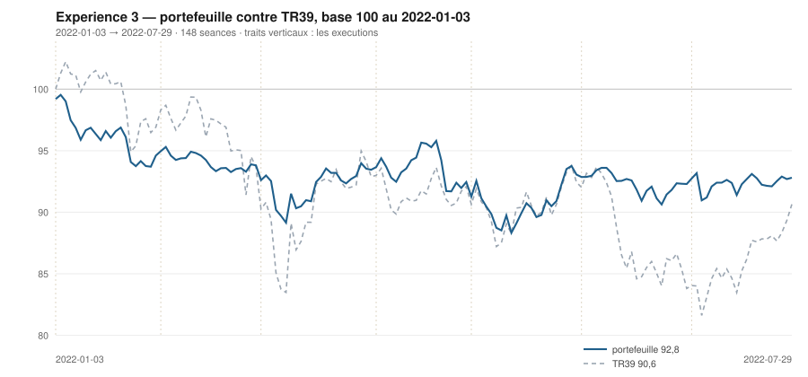

| | |
|---|---|
| Dotation initiale | 10 000,00 € au 2022-01-03 |
| Titres au 2022-07-29 | 3 681,13 € |
| Espèces | 5 599,41 € |
| **Total** | **9 280,54 €** |
| Base 100 | **92,81** |
| TR39, même base | 90,64 |
| Écart depuis janvier | **+2,16 pt** |

### Toutes les positions depuis le début de l'expérience

> Closes comme ouvertes. Une position encore ouverte laisse les deux dernières colonnes vides. Aucune séance postérieure au 2022-07-29 n'entre dans ce tableau.

| Société | Prix d'achat | Date d'achat | Prix de vente | Date de vente |
|---|---|---|---|---|
| `CAP.PA` Capgemini | 194,20 € | 2022-01-03 | 182,68 € | 2022-04-01 |
| `DSY.PA` Dassault Systèmes | 50,13 € | 2022-01-03 | 41,05 € | 2022-02-01 |
| `KER.PA` Kering | 558,25 € | 2022-03-01 | 454,99 € | 2022-06-01 |
| `HO.PA` Thales | 103,16 € | 2022-04-01 |  |  |
| `MT.AS` ArcelorMittal | 26,84 € | 2022-04-01 | 28,27 € | 2022-06-01 |
| `TTE.PA` TotalEnergies | 43,30 € | 2022-06-01 |  |  |

*6 positions depuis le début, dont 2 encore ouvertes : les deux dernières colonnes restent vides.*

## 5. L'étude chartiste au 2022-06-30

> Notes rédigées sans aucune séance postérieure au 2022-06-30, par l'agent `chartiste`. Cinq lignes au plus par société, **chacune sous la figure de décision qui la justifie** — celle que la règle a lue ce jour-là, portant les cinq critères, les vetos et le verdict.

### 1. `ORA.PA` — Orange

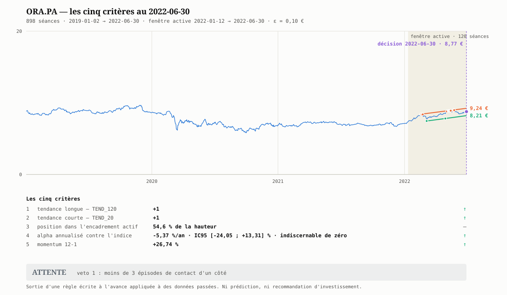

- Canal 8,21 – 9,24 €, clôture à 8,77 € à 54,6 % : le milieu.
- Pentes +0,009 et +0,009 €/séance, rigoureusement identiques : τ de 3 226 séances, le canal est parallèle.
- Deux contacts en support : veto 1.
- Momentum +26,7 %, alpha −5,4 %/an. Meilleur score de la date.

### 2. `SAN.PA` — Sanofi

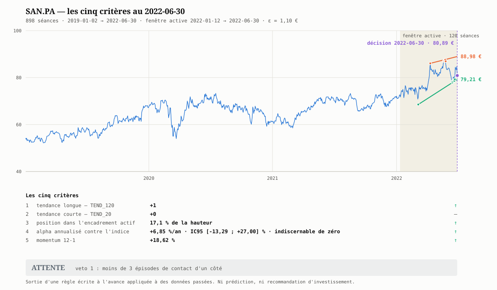

- Canal 79,21 – 88,98 €, clôture à 80,89 € à 17,1 % de la hauteur.
- Pentes +0,132 et +0,052 €/séance, τ de 122 séances.
- Deux contacts de chaque côté : veto 1 — les six épisodes du mois dernier n'ont pas survécu au décalage de la fenêtre.
- Momentum +18,6 %, alpha +6,8 %/an.

### 3. `TTE.PA` — TotalEnergies

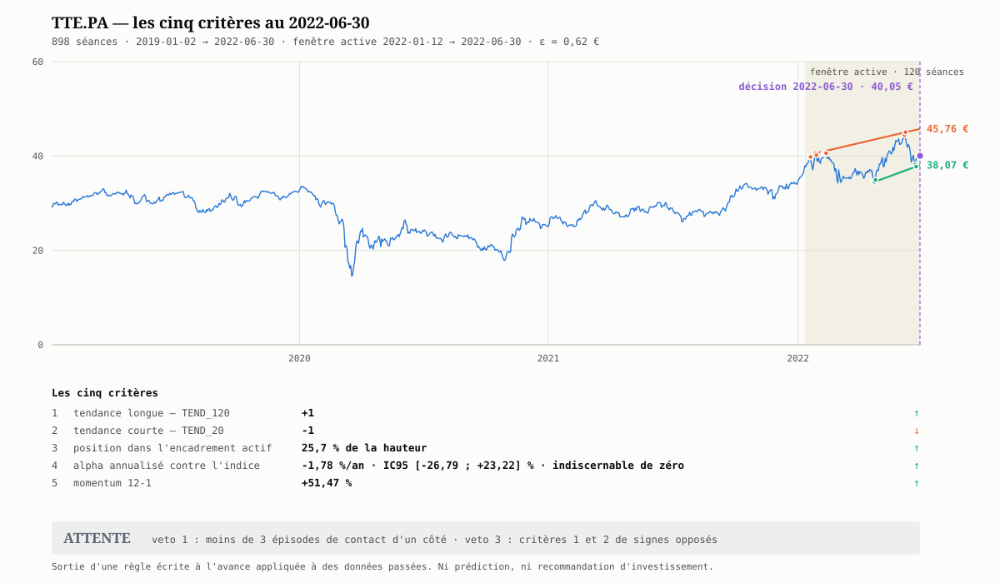

- Canal 38,07 – 45,76 €, clôture à 40,05 € à 25,7 % de la hauteur.
- Pentes +0,075 et +0,048 €/séance, τ de 280 séances.
- Deux contacts en support : veto 1 ; tendances opposées : veto 3.
- **Momentum +51,5 %, le plus fort de la date** ; alpha −1,8 %/an.

### 4. `CA.PA` — Carrefour

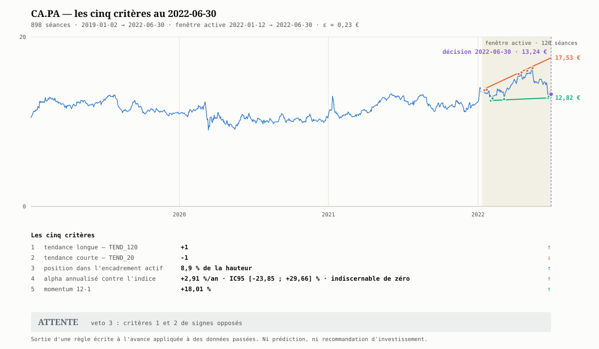

- Canal 12,82 – 17,53 €, large de 4,7 %, clôture à 13,24 € à 8,9 % : contre le support.
- Support +0,003 contre résistance +0,032 €/séance : le canal s'ouvre, τ infini.
- Quatre contacts bas, six hauts : figure bien étayée ; seul le veto 3 mord.
- Momentum +18,0 %, alpha +2,9 %/an.

### 5. `HO.PA` — Thales

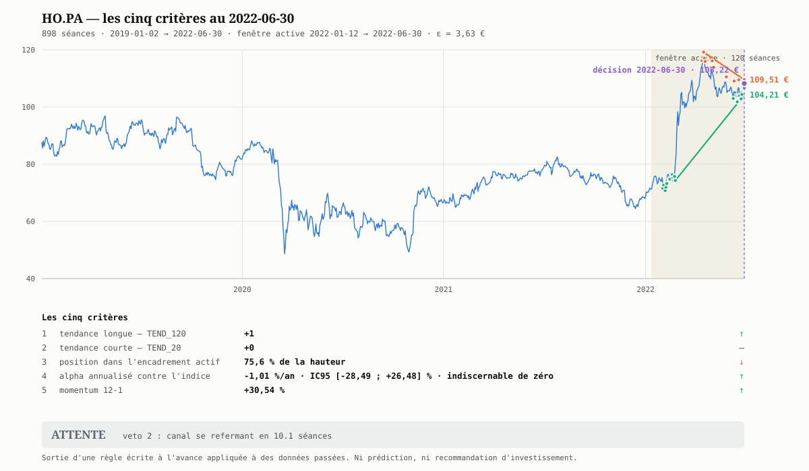

- Canal 104,21 – 109,51 €, clôture à 108,22 € à 75,6 % de la hauteur.
- Support +0,340 contre résistance −0,186 €/séance : **le canal se referme en 10 séances**, veto 2.
- Quatre contacts bas, six hauts : la figure est la mieux étayée de la date, et elle disparaît avant la décision suivante.
- Momentum +30,5 %, alpha −1,0 %/an.

### 6. `AI.PA` — Air Liquide

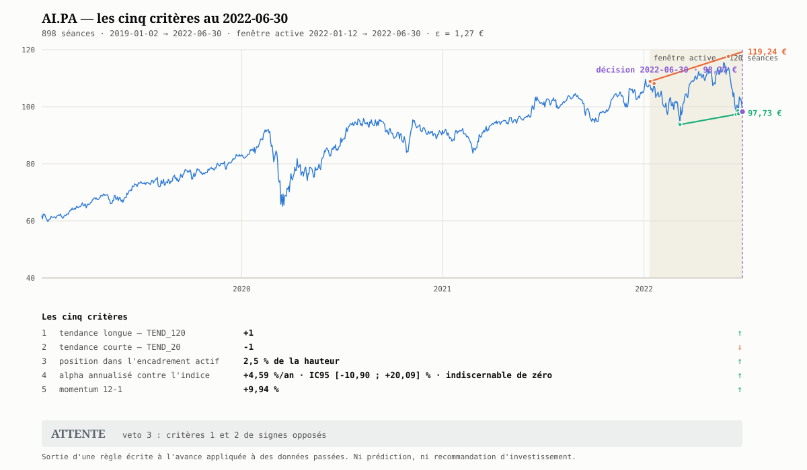

- Canal 97,73 – 119,24 €, large de 21,5 %, clôture à 98,27 € à **2,5 %** : sur le support.
- Support +0,050 contre résistance +0,088 €/séance : ouverture, τ infini.
- Trois contacts de chaque côté : figure lisible ; veto 3 seul.
- Momentum +9,9 %, à un dixième du seuil de dix ; alpha +4,6 %/an.

### 7. `EN.PA` — Bouygues

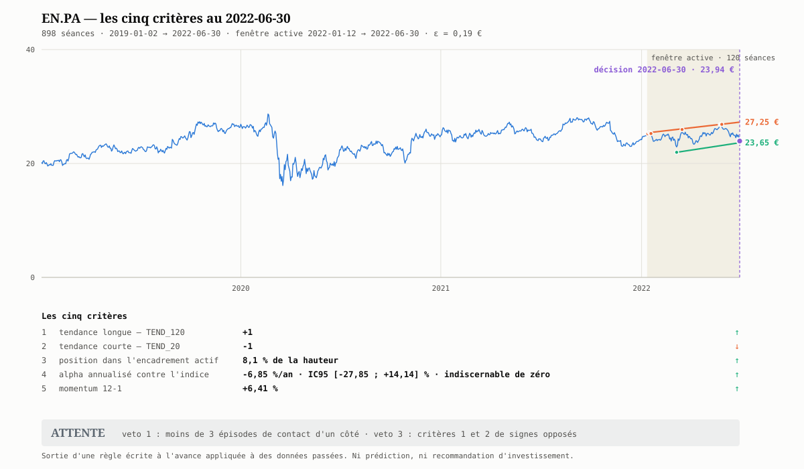

- Canal 23,65 – 27,25 €, clôture à 23,94 € à 8,1 % : contre le support.
- Pentes +0,021 et +0,016 €/séance, τ de 728 séances.
- Deux contacts en support : veto 1 ; tendances opposées : veto 3.
- Momentum +6,4 %, alpha −6,8 %/an.

### 8. `STMPA.PA` — STMicroelectronics

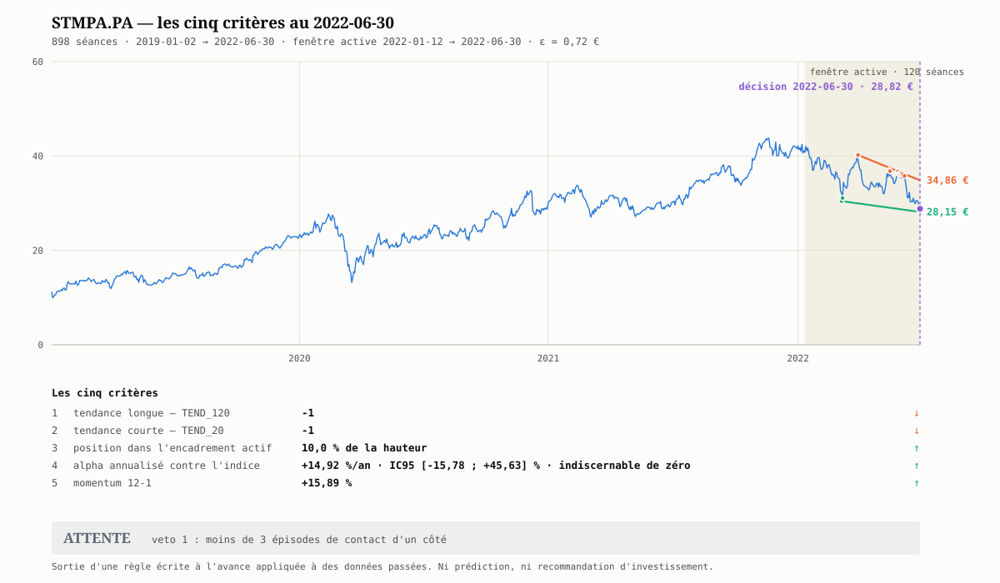

- Canal 28,15 – 34,86 €, clôture à 28,82 € à 10,0 %.
- Pentes −0,028 et −0,084 €/séance, τ de 121 séances.
- Deux contacts en support : veto 1.
- Momentum +15,9 %, alpha +14,9 %/an.

### 9. `ENGI.PA` — Engie

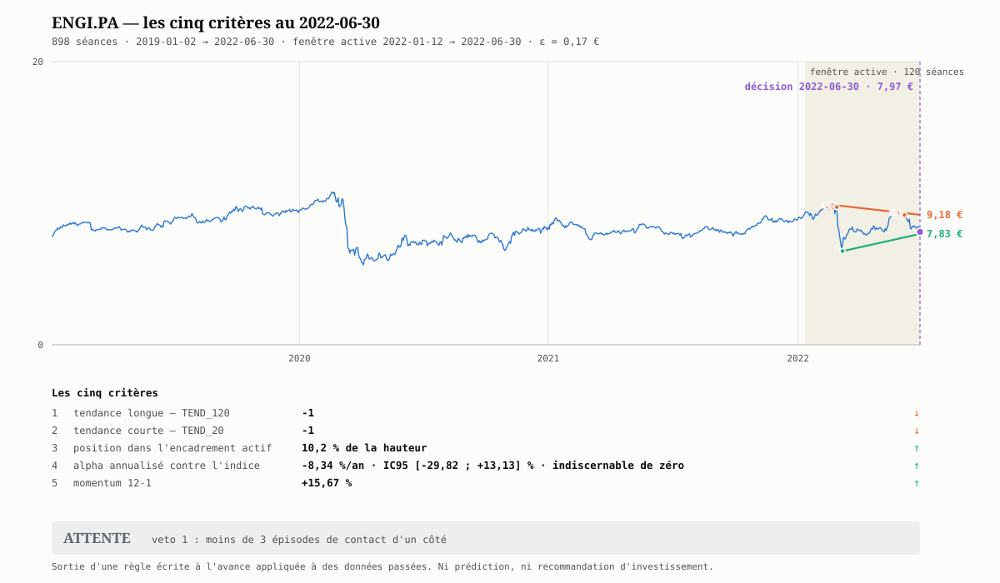

- Canal 7,83 – 9,18 €, clôture à 7,97 € à 10,2 % : contre le support.
- Pentes +0,015 et −0,008 €/séance, τ de 59 séances.
- Deux contacts de chaque côté : veto 1.
- Momentum +15,7 %, alpha −8,3 %/an.

### 10. `CS.PA` — AXA

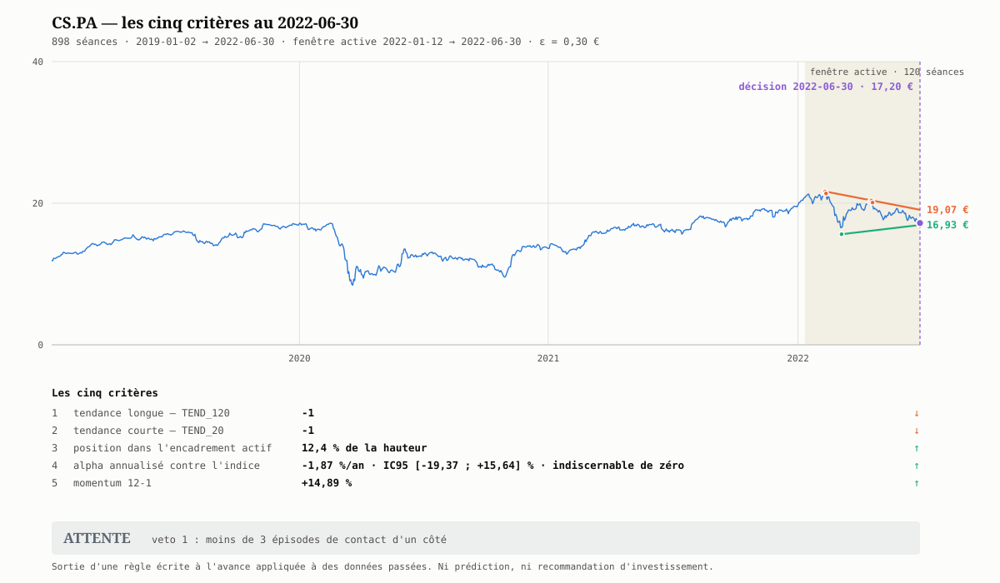

- Canal 16,93 – 19,07 €, clôture à 17,20 € à 12,4 % de la hauteur.
- Pentes +0,016 et −0,026 €/séance, τ de 50 séances.
- Deux contacts de chaque côté : veto 1.
- Momentum +14,9 %, alpha −1,9 %/an.

### 11. `BNP.PA` — BNP Paribas

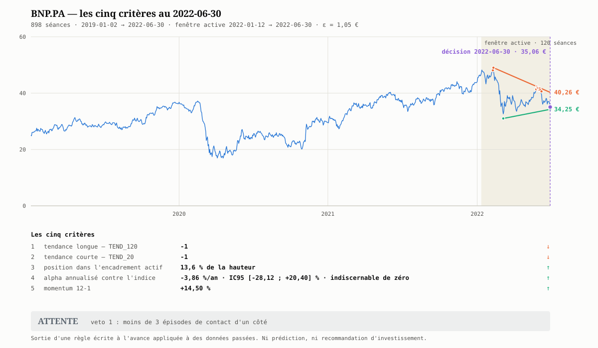

- Canal 34,25 – 40,26 €, clôture à 35,06 € à 13,6 %.
- Pentes +0,040 et −0,089 €/séance, τ de 47 séances.
- Deux contacts de chaque côté : veto 1.
- Momentum +14,5 %, alpha −3,9 %/an.

### 12. `MT.AS` — ArcelorMittal

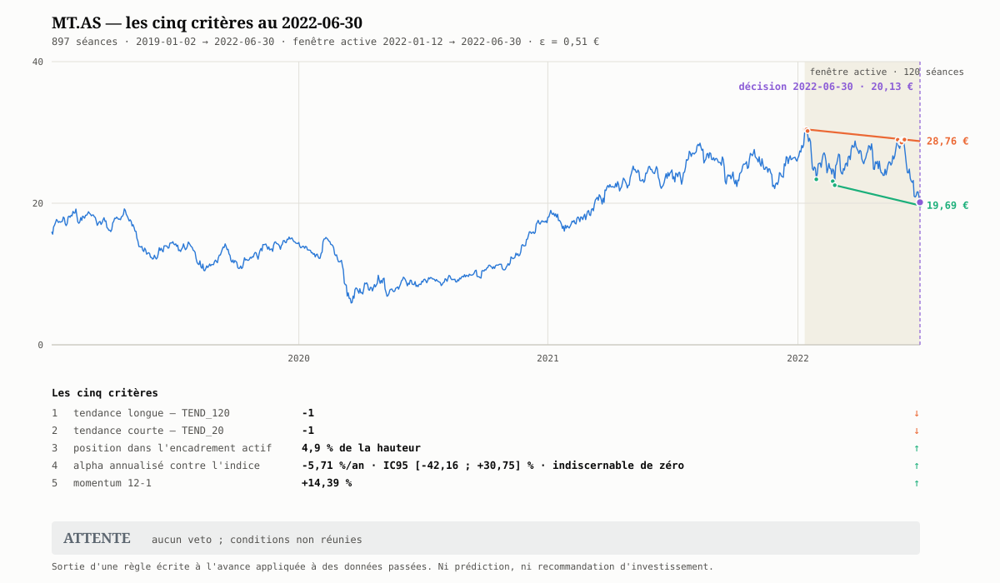

- Canal 19,69 – 28,76 €, clôture à 20,13 € à 4,9 % de la hauteur.
- Pentes −0,032 et −0,014 €/séance : ouverture, τ infini.
- Trois contacts de chaque côté : **aucun veto**.
- Momentum +14,4 %, alpha −5,7 %/an sur un IC95 de 73 points.

### 13. `CAP.PA` — Capgemini

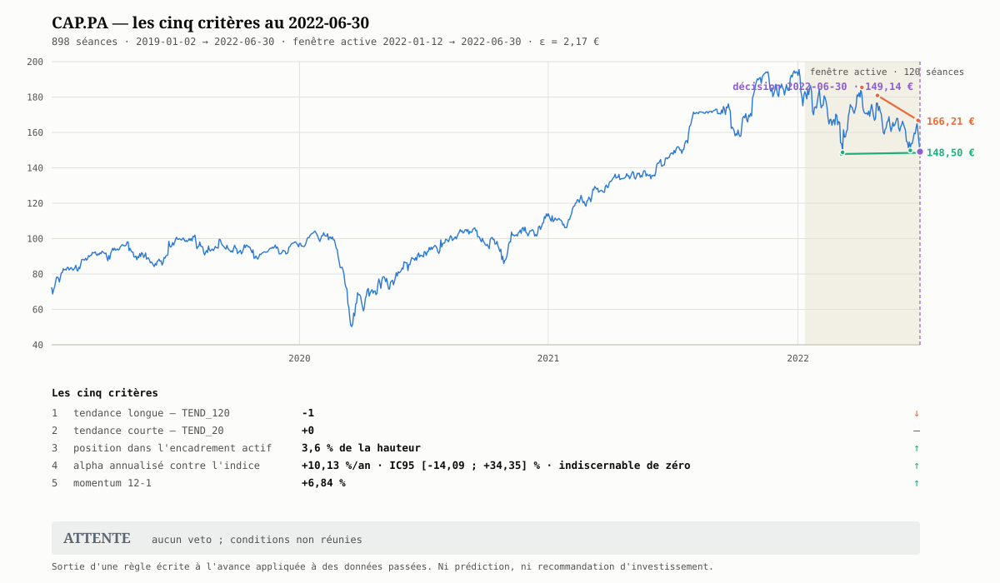

- Canal 148,50 – 166,21 €, clôture à 149,14 € à **3,6 %** : quasiment sur le support.
- Support +0,008 contre résistance −0,333 €/séance, τ de 52 séances.
- Trois contacts de chaque côté : **aucun veto**.
- Momentum +6,8 %, alpha +10,1 %/an.

### 14. `GLE.PA` — Société Générale

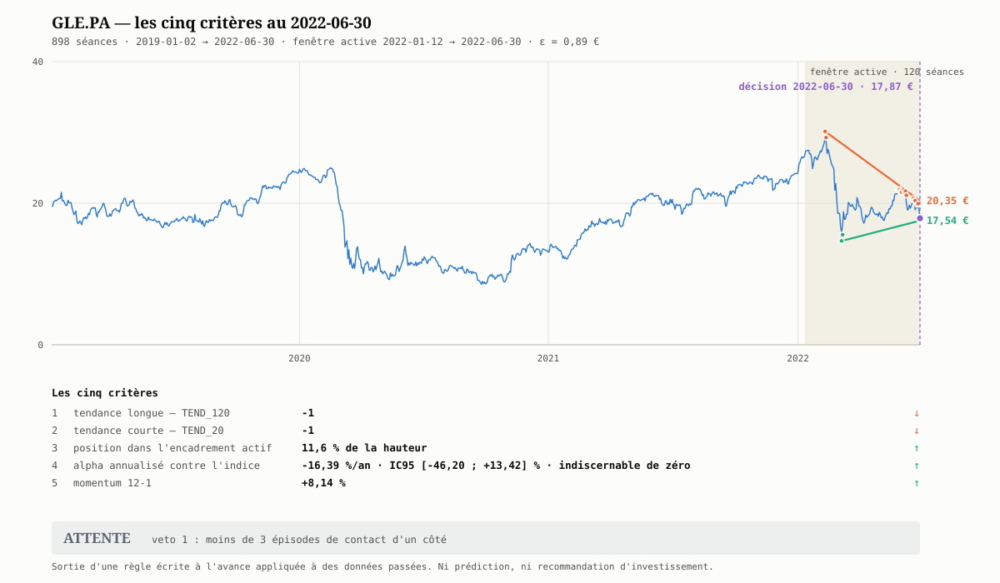

- Canal 17,54 – 20,35 €, clôture à 17,87 € à 11,6 %.
- Pentes +0,035 et −0,100 €/séance, τ de 21 séances : le canal ne passera pas le mois.
- Deux contacts en support : veto 1.
- Momentum +8,1 %, alpha −16,4 %/an.

### 15. `VIE.PA` — Veolia

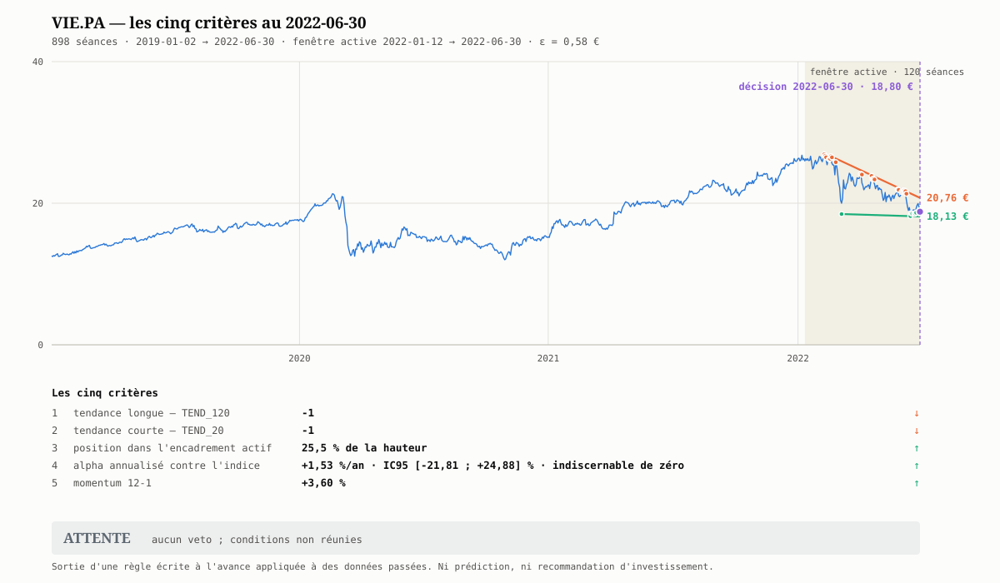

- Canal 18,13 – 20,76 €, clôture à 18,80 € à 25,5 % de la hauteur.
- Pentes −0,004 et −0,064 €/séance, τ de 44 séances.
- Trois contacts bas et **sept en résistance** — la figure la mieux étayée de la date, aucun veto.
- Momentum +3,6 %, alpha +1,5 %/an.

### 16. `DG.PA` — Vinci

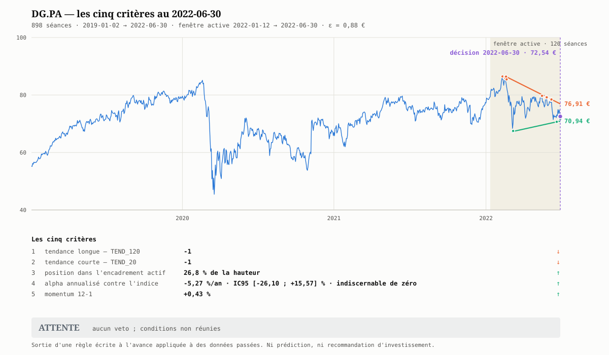

- Canal 70,94 – 76,91 €, clôture à 72,54 € à 26,8 % de la hauteur.
- Pentes +0,045 et −0,103 €/séance, τ de 40 séances.
- Trois contacts bas, cinq hauts : **aucun veto**.
- **Momentum +0,4 %**, quasi nul ; alpha −5,3 %/an.

### 17. `RI.PA` — Pernod Ricard

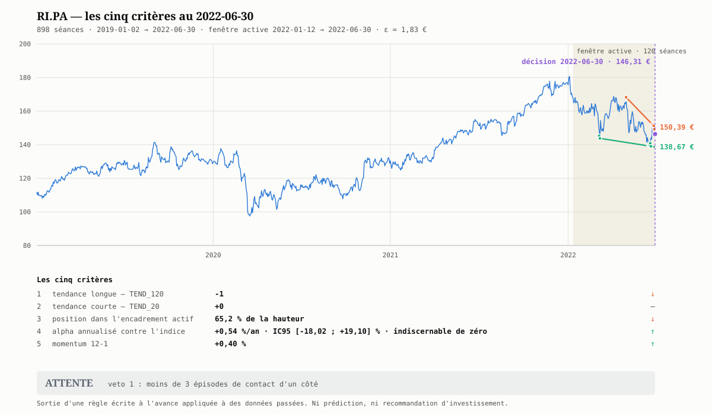

- Canal 138,67 – 150,39 €, clôture à 146,31 € à 65,2 % — à deux dixièmes au-dessus du seuil haut.
- Pentes −0,063 et −0,424 €/séance, τ de 33 séances.
- Deux contacts de chaque côté : veto 1.
- **Momentum +0,4 %** ; alpha +0,5 %/an — les deux quasiment nuls.

### 18. `BN.PA` — Danone

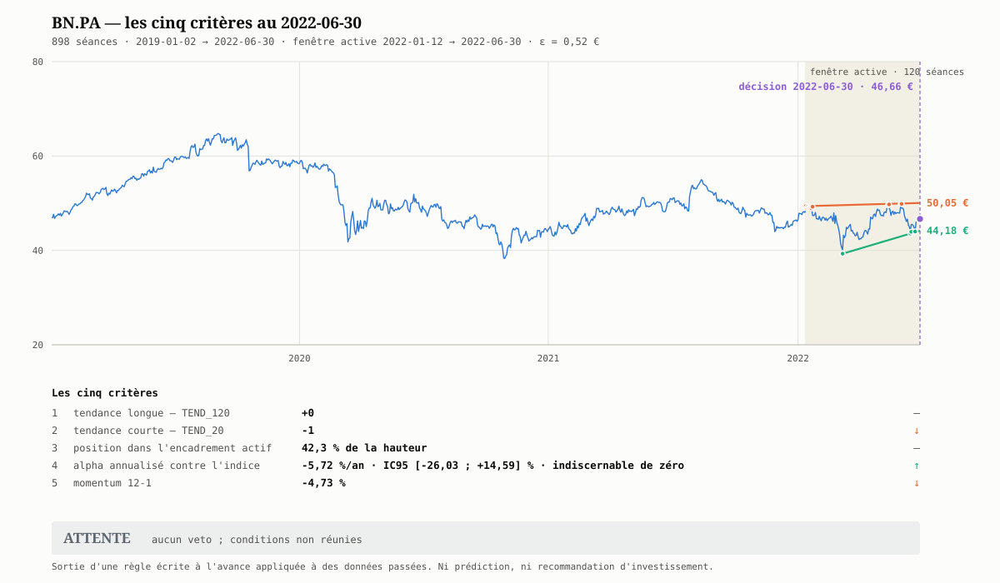

- Canal 44,18 – 50,05 €, clôture à 46,66 € à 42,3 % : le milieu.
- Pentes +0,061 et +0,006 €/séance, τ de 106 séances.
- Trois contacts de chaque côté : **aucun veto**.
- Momentum −4,7 %, alpha −5,7 %/an ; la tendance longue est retombée à zéro.

### 19. `VIV.PA` — Vivendi

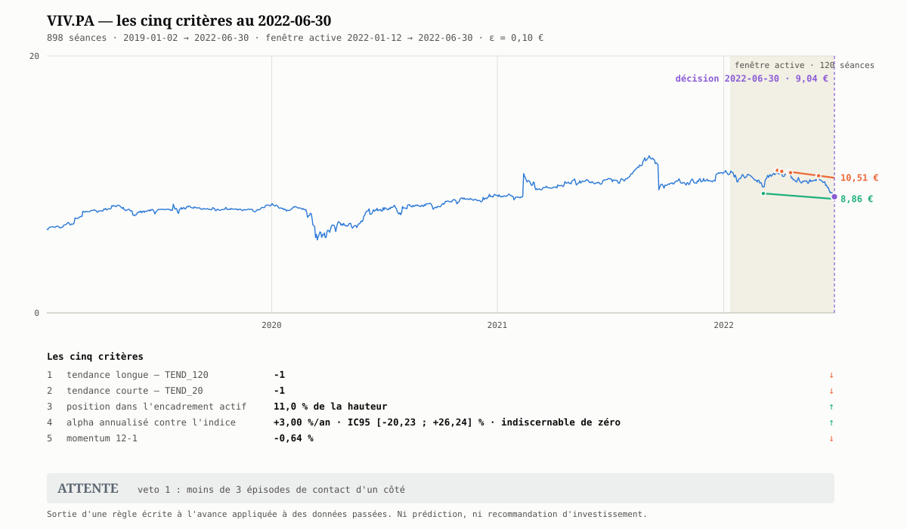

- Canal 8,86 – 10,51 €, clôture à 9,04 € à 11,0 % de la hauteur.
- Pentes −0,005 et −0,009 €/séance, quasi plates : τ de 429 séances.
- Deux contacts en support : veto 1.
- **Momentum −0,6 %**, quasi nul ; alpha +3,0 %/an.

### 20. `AIR.PA` — Airbus

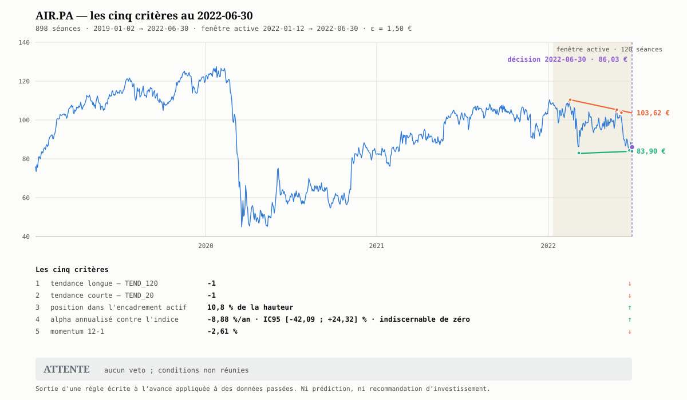

- Canal 83,90 – 103,62 €, clôture à 86,03 € à 10,8 % : contre le support.
- Pentes +0,014 et −0,073 €/séance, τ de 227 séances.
- Trois contacts de chaque côté : **aucun veto**.
- Momentum −2,6 %, alpha −8,9 %/an.

### 21. `PUB.PA` — Publicis

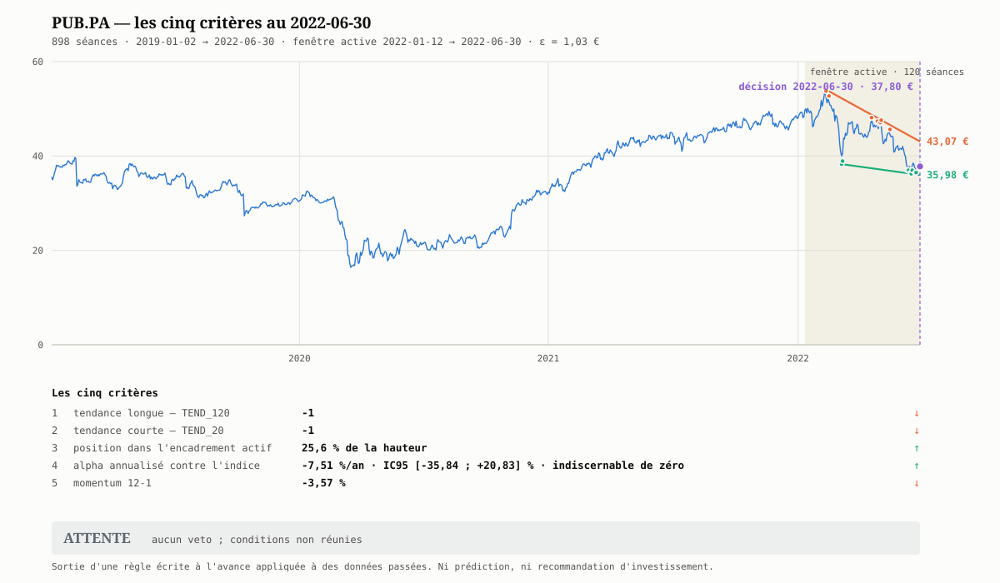

- Canal 35,98 – 43,07 €, clôture à 37,80 € à 25,6 %.
- Pentes −0,028 et −0,113 €/séance, τ de 84 séances.
- Trois contacts bas, cinq hauts : **aucun veto**.
- Momentum −3,6 %, alpha −7,5 %/an.

### 22. `SU.PA` — Schneider Electric

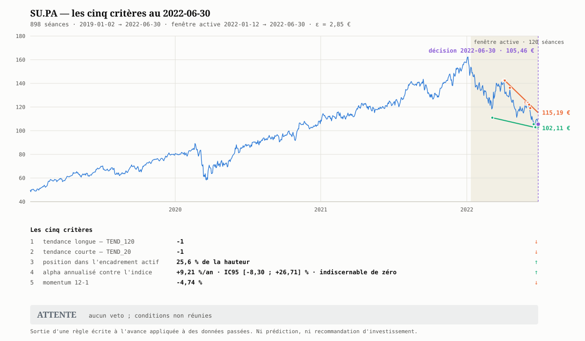

- Canal 102,11 – 115,19 €, clôture à 105,46 € à 25,6 %.
- Pentes −0,110 et −0,462 €/séance, τ de 37 séances.
- Trois contacts de chaque côté : **aucun veto**.
- Momentum −4,7 %, alpha +9,2 %/an.

### 23. `ACA.PA` — Crédit Agricole

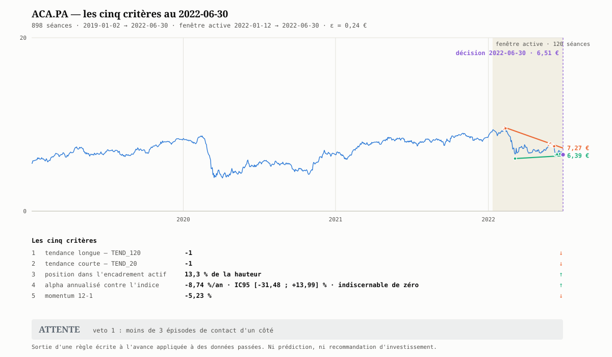

- Canal 6,39 – 7,27 €, large de 0,9 %, clôture à 6,51 € à 13,3 % de la hauteur.
- Pentes +0,004 et −0,024 €/séance, τ de 31 séances.
- Quatre contacts bas, deux hauts : veto 1.
- Momentum −5,2 %, alpha −8,7 %/an.

### 24. `SGO.PA` — Saint-Gobain

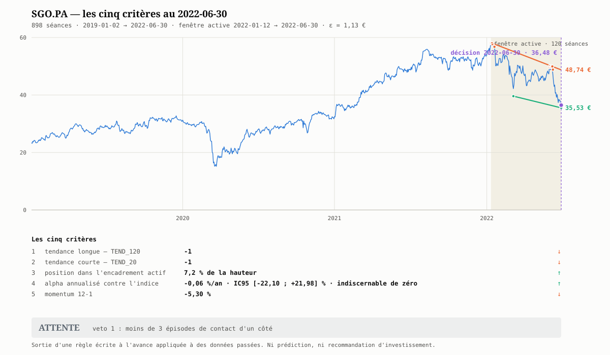

- Canal 35,53 – 48,74 €, clôture à 36,48 € à 7,2 % : contre le support.
- Pentes −0,050 et −0,079 €/séance, τ de 455 séances.
- Deux contacts de chaque côté : veto 1.
- Momentum −5,3 %, alpha −0,1 %/an.

### 25. `STLAP.PA` — Stellantis

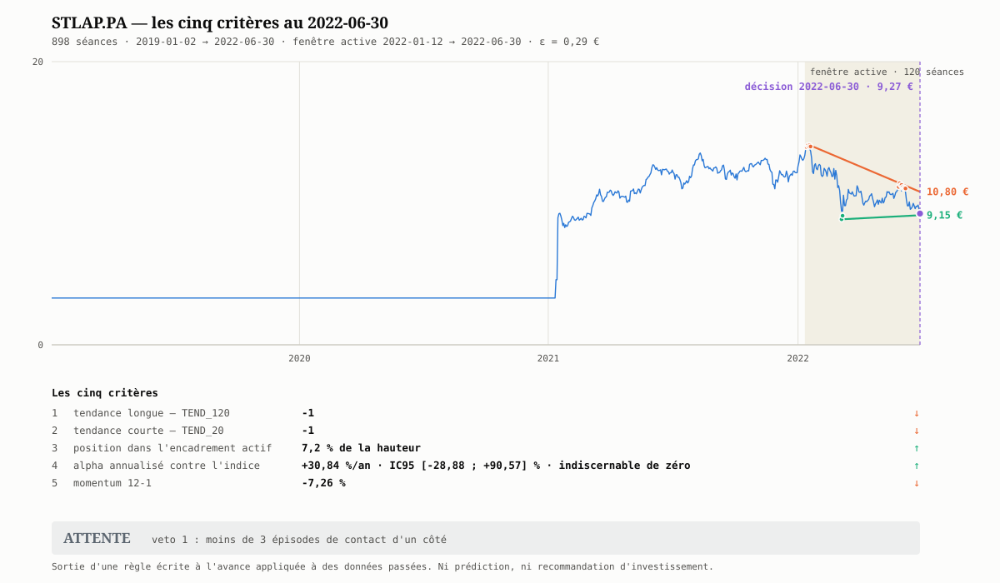

- Canal 9,15 – 10,80 €, clôture à 9,27 € à 7,2 % de la hauteur.
- Pentes +0,004 et −0,029 €/séance, τ de 51 séances.
- Deux contacts de chaque côté : veto 1.
- Momentum −7,3 %, alpha +30,8 %/an sur un IC95 de 120 points.

### 26. `ML.PA` — Michelin

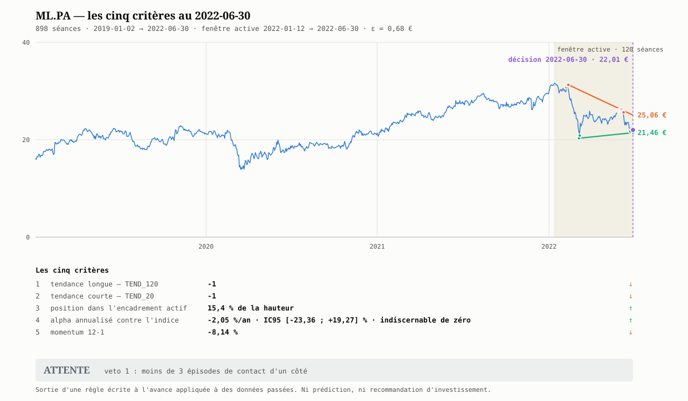

- Canal 21,46 – 25,06 €, clôture à 22,01 € à 15,4 % de la hauteur.
- Pentes +0,014 et −0,064 €/séance, τ de 46 séances.
- Trois contacts bas, deux hauts : veto 1.
- Momentum −8,1 %, alpha −2,0 %/an.

### 27. `EL.PA` — EssilorLuxottica

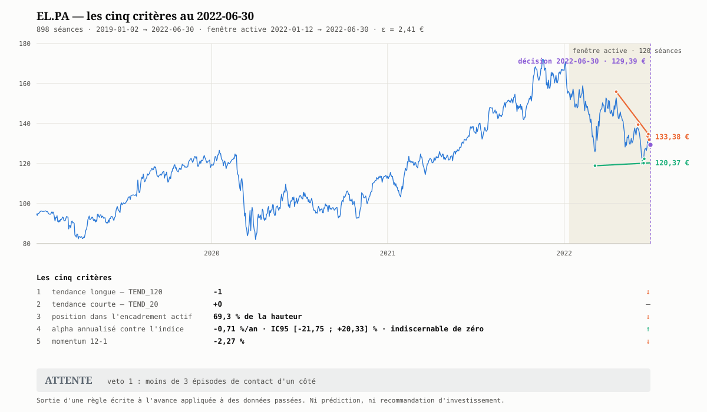

- Canal 120,37 – 133,38 €, clôture à 129,39 € à 69,3 % de la hauteur.
- Support +0,018 contre résistance −0,451 €/séance, τ de 28 séances.
- Deux contacts en support : veto 1.
- Momentum −2,3 %, alpha −0,7 %/an.

### 28. `MC.PA` — LVMH

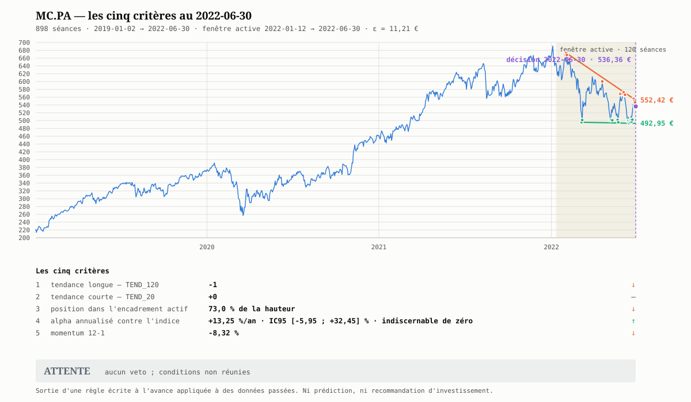

- Canal 492,95 – 552,42 €, clôture à 536,36 € à 73,0 % de la hauteur.
- Pentes −0,035 et −1,161 €/séance, τ de 53 séances.
- Quatre contacts bas, six hauts : **aucun veto**, figure très bien étayée.
- Momentum −8,3 %, alpha +13,2 %/an.

### 29. `DSY.PA` — Dassault Systèmes

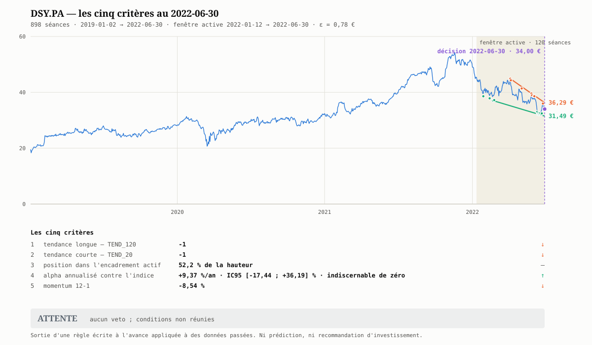

- Canal 31,49 – 36,29 €, clôture à 34,00 € à 52,2 % : le milieu.
- Pentes −0,061 et −0,143 €/séance, τ de 59 séances.
- Quatre contacts bas, cinq hauts : **aucun veto**.
- Momentum −8,5 %, alpha +9,4 %/an.

### 30. `LR.PA` — Legrand

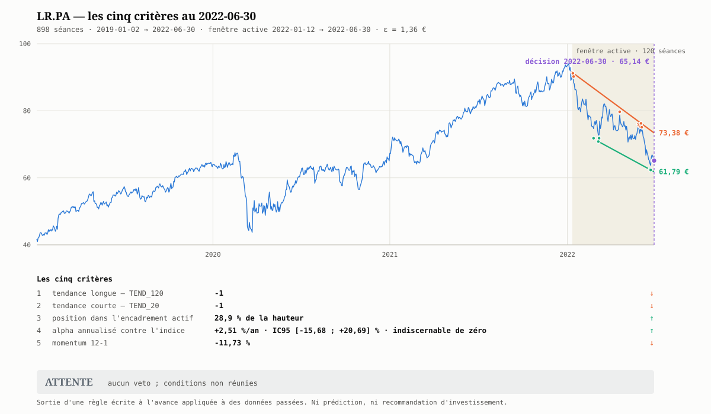

- Canal 61,79 – 73,38 €, clôture à 65,14 € à 28,9 %.
- Pentes −0,112 et −0,152 €/séance, τ de 288 séances.
- Trois contacts de chaque côté : **aucun veto**.
- Momentum −11,7 %, alpha +2,5 %/an.

### 31. `RNO.PA` — Renault

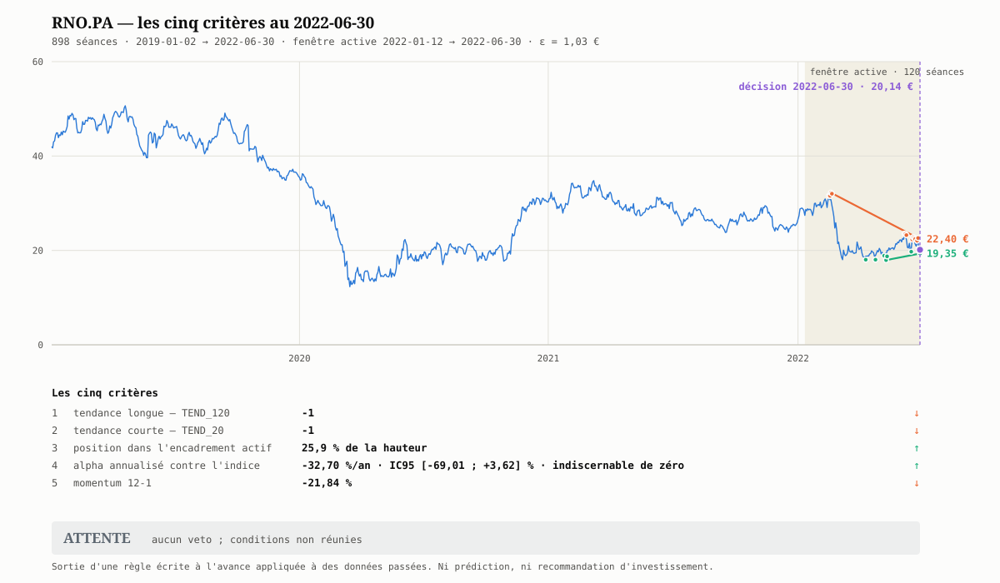

- Canal 19,35 – 22,40 €, clôture à 20,14 € à 25,9 %.
- Pentes +0,040 et −0,107 €/séance, τ de 21 séances : le canal ne passera pas le mois.
- Cinq contacts bas, trois hauts : **aucun veto**.
- Momentum −21,8 %, alpha −32,7 %/an, IC95 de −69,0 à +3,6.

### 32. `ALO.PA` — Alstom

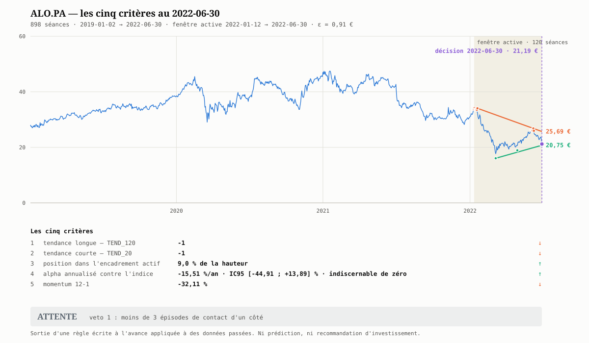

- Canal 20,75 – 25,69 €, clôture à 21,19 € à 9,0 %.
- Support +0,058 contre résistance −0,074 €/séance, τ de 37 séances.
- Trois contacts bas, deux hauts : veto 1.
- **Momentum −32,1 %** ; alpha −15,5 %/an.

### 33. `WLN.PA` — Worldline

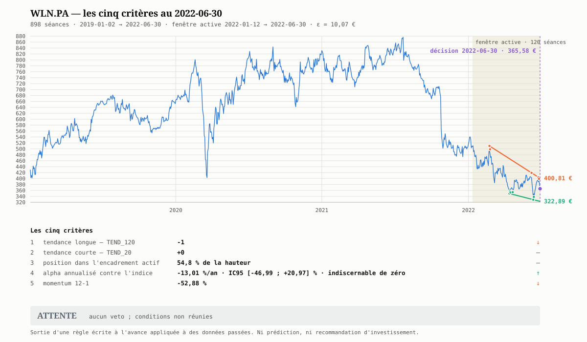

- Canal 322,89 – 400,81 €, clôture à 365,58 € à 54,8 % : le milieu.
- Pentes −0,492 et −1,227 €/séance, τ de 106 séances.
- Trois contacts de chaque côté : **aucun veto**.
- **Momentum −52,9 %, le plus faible de la date** ; alpha −13,0 %/an.

### 34. `RMS.PA` — Hermès International

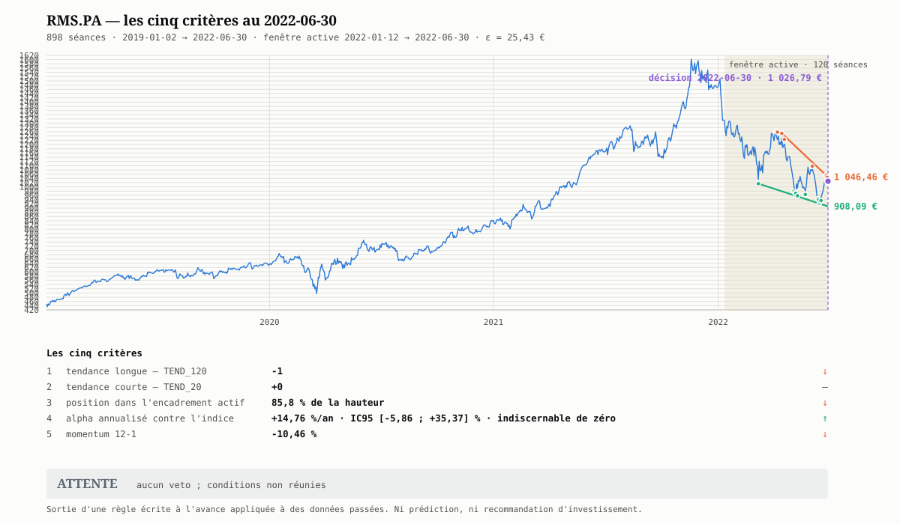

- Canal 908,09 – 1 046,46 €, large de 138 €, clôture à 1 026,79 € à 85,8 % de la hauteur.
- Pentes −1,343 et −3,881 €/séance, τ de 55 séances.
- Quatre contacts bas, cinq hauts : **aucun veto**.
- Momentum −10,5 %, alpha +14,8 %/an.

### 35. `OR.PA` — L'Oréal

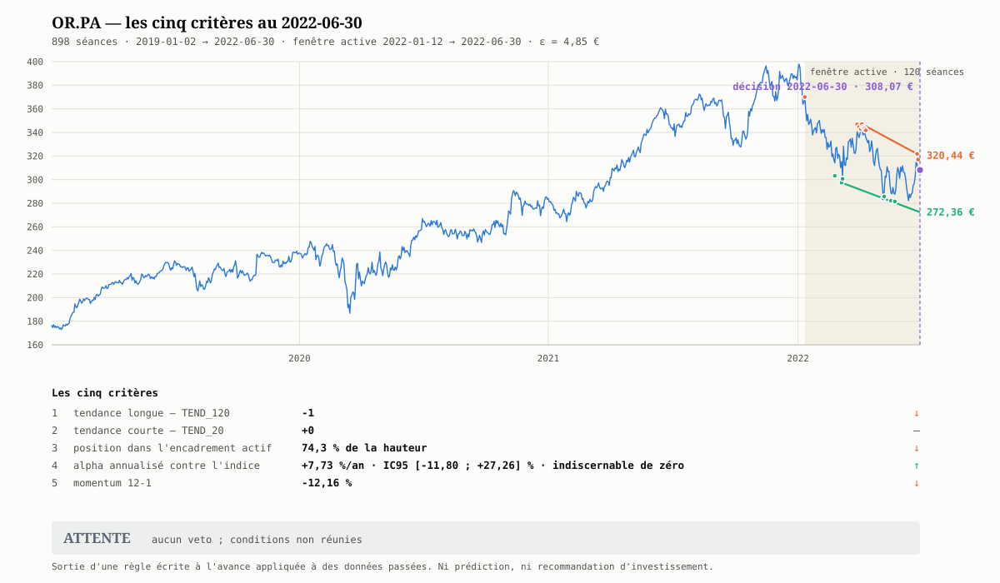

- Canal 272,36 – 320,44 €, clôture à 308,07 € à 74,3 %.
- Pentes −0,309 et −0,444 €/séance, τ de 357 séances.
- Cinq contacts bas, trois hauts : **aucun veto**.
- Momentum −12,2 %, alpha +7,7 %/an.

### 36. `ERF.PA` — Eurofins Scientific

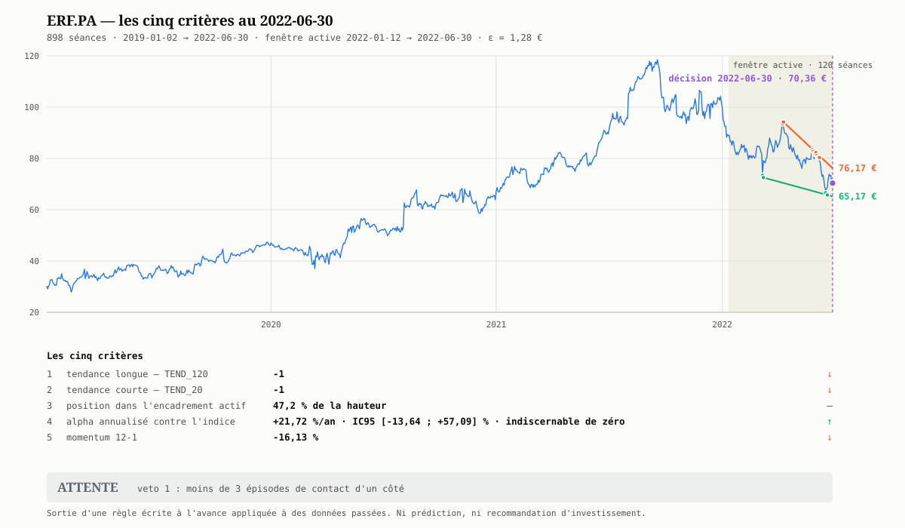

- Canal 65,17 – 76,17 €, clôture à 70,36 € à 47,2 % de la hauteur.
- Pentes −0,093 et −0,322 €/séance, τ de 48 séances.
- Deux contacts de chaque côté : veto 1.
- Momentum −16,1 %, **alpha +21,7 %/an**, le plus élevé de la date.

### 37. `SAF.PA` — Safran

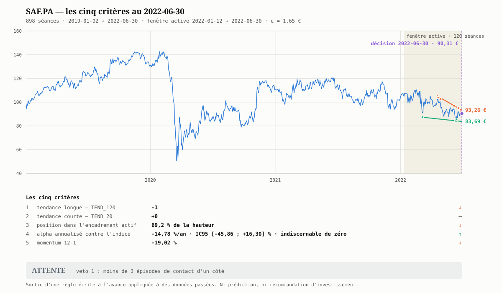

- Canal 83,69 – 93,26 €, clôture à 90,31 € à 69,2 %.
- Pentes −0,044 et −0,235 €/séance, τ de 50 séances.
- Deux contacts en support : veto 1.
- Momentum −19,0 %, alpha −14,8 %/an.

### 38. `TEP.PA` — Teleperformance

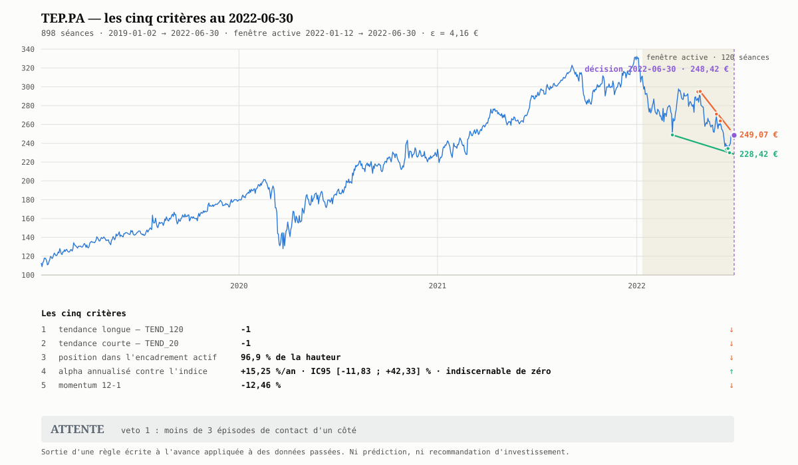

- Canal 228,42 – 249,07 €, clôture à 248,42 € à 96,9 % : contre le plafond, alors que tout le canal descend.
- Pentes −0,256 et −1,046 €/séance, τ de 26 séances.
- Deux contacts en support contre cinq en résistance : veto 1.
- Momentum −12,5 %, alpha +15,2 %/an.

### 39. `KER.PA` — Kering

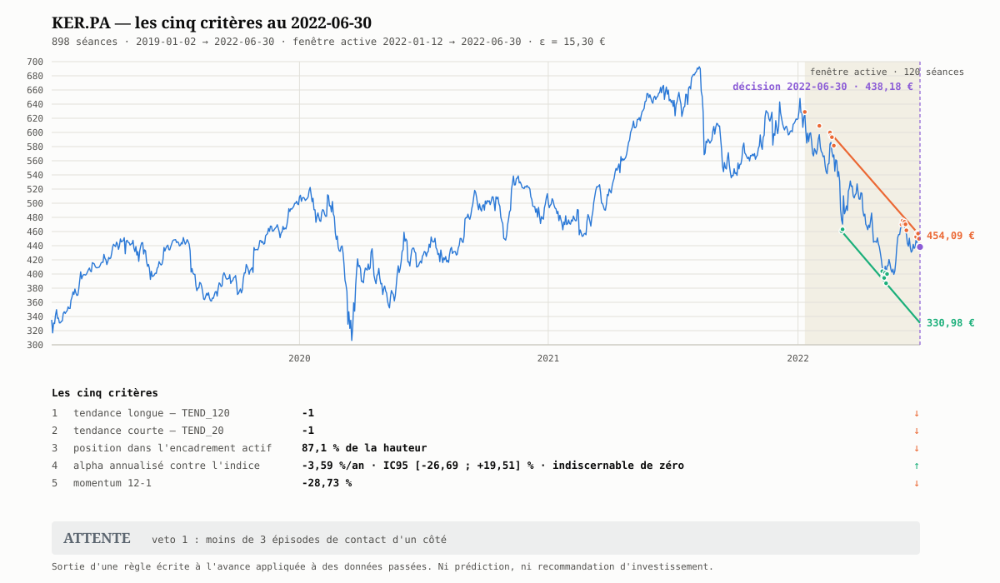

- Canal 330,98 – 454,09 €, large de 123 €, clôture à 438,18 € à 87,1 % de la hauteur.
- Pentes −1,598 et −1,567 €/séance, quasi parallèles : τ infini.
- Deux contacts en support contre cinq en résistance : veto 1.
- Momentum −28,7 %, alpha −3,6 %/an. Score −6, le plus bas de la date avec Teleperformance.

## 6. Le classement au 2022-06-30

> De la valeur la plus intéressante à détenir à celle qu'il faut fuir. La colonne **τ** donne la date de péremption du canal en séances, la colonne **Vetos** les numéros déclenchés. Une valeur sous veto ne peut pas être achetée.

| Rang | Valeur | `s1` | `s2` | `s3` | `s4` | `s5` | Score | Position | Momentum | τ | Vetos |
|---|---|---|---|---|---|---|---|---|---|---|---|
| 1 | `ORA.PA` Orange | +2 | +1 | +0 | +2 | +0 | **+5** | 54,6 % | +26,7 % | 3 225,9 | 1 |
| 2 | `SAN.PA` Sanofi | +2 | +0 | +1 | +2 | +0 | **+5** | 17,1 % | +18,6 % | 122,4 | 1 |
| 3 | `TTE.PA` TotalEnergies | +2 | -1 | +1 | +2 | +0 | **+4** | 25,7 % | +51,5 % | 279,7 | 1 3 |
| 4 | `CA.PA` Carrefour | +2 | -1 | +1 | +2 | +0 | **+4** | 8,9 % | +18,0 % | ∞ | 3 |
| 5 | `HO.PA` Thales | +2 | +0 | -1 | +2 | +0 | **+3** | 75,6 % | +30,5 % | 10,1 | 2 |
| 6 | `AI.PA` Air Liquide | +2 | -1 | +1 | +1 | +0 | **+3** | 2,5 % | +9,9 % | ∞ | 3 |
| 7 | `EN.PA` Bouygues | +2 | -1 | +1 | +1 | +0 | **+3** | 8,1 % | +6,4 % | 727,7 | 1 3 |
| 8 | `STMPA.PA` STMicroelectronics | -2 | -1 | +1 | +2 | +0 | **+0** | 10,0 % | +15,9 % | 120,8 | 1 |
| 9 | `ENGI.PA` Engie | -2 | -1 | +1 | +2 | +0 | **+0** | 10,2 % | +15,7 % | 58,9 | 1 |
| 10 | `CS.PA` AXA | -2 | -1 | +1 | +2 | +0 | **+0** | 12,4 % | +14,9 % | 50,3 | 1 |
| 11 | `BNP.PA` BNP Paribas | -2 | -1 | +1 | +2 | +0 | **+0** | 13,6 % | +14,5 % | 46,5 | 1 |
| 12 | `MT.AS` ArcelorMittal | -2 | -1 | +1 | +2 | +0 | **+0** | 4,9 % | +14,4 % | ∞ | — |
| 13 | `CAP.PA` Capgemini | -2 | +0 | +1 | +1 | +0 | **+0** | 3,6 % | +6,8 % | 51,8 | — |
| 14 | `GLE.PA` Société Générale | -2 | -1 | +1 | +1 | +0 | **-1** | 11,6 % | +8,1 % | 20,7 | 1 |
| 15 | `VIE.PA` Veolia | -2 | -1 | +1 | +1 | +0 | **-1** | 25,5 % | +3,6 % | 44,1 | — |
| 16 | `DG.PA` Vinci | -2 | -1 | +1 | +1 | +0 | **-1** | 26,8 % | +0,4 % | 40,3 | — |
| 17 | `RI.PA` Pernod Ricard | -2 | +0 | -1 | +1 | +0 | **-2** | 65,2 % | +0,4 % | 32,5 | 1 |
| 18 | `BN.PA` Danone | +0 | -1 | +0 | -1 | +0 | **-2** | 42,3 % | -4,7 % | 106,3 | — |
| 19 | `VIV.PA` Vivendi | -2 | -1 | +1 | -1 | +0 | **-3** | 11,0 % | -0,6 % | 428,9 | 1 |
| 20 | `AIR.PA` Airbus | -2 | -1 | +1 | -1 | +0 | **-3** | 10,8 % | -2,6 % | 227,1 | — |
| 21 | `PUB.PA` Publicis | -2 | -1 | +1 | -1 | +0 | **-3** | 25,6 % | -3,6 % | 83,7 | — |
| 22 | `SU.PA` Schneider Electric | -2 | -1 | +1 | -1 | +0 | **-3** | 25,6 % | -4,7 % | 37,2 | — |
| 23 | `ACA.PA` Crédit Agricole | -2 | -1 | +1 | -1 | +0 | **-3** | 13,3 % | -5,2 % | 31,1 | 1 |
| 24 | `SGO.PA` Saint-Gobain | -2 | -1 | +1 | -1 | +0 | **-3** | 7,2 % | -5,3 % | 455,4 | 1 |
| 25 | `STLAP.PA` Stellantis | -2 | -1 | +1 | -1 | +0 | **-3** | 7,2 % | -7,3 % | 50,8 | 1 |
| 26 | `ML.PA` Michelin | -2 | -1 | +1 | -1 | +0 | **-3** | 15,4 % | -8,1 % | 46,0 | 1 |
| 27 | `EL.PA` EssilorLuxottica | -2 | +0 | -1 | -1 | +0 | **-4** | 69,3 % | -2,3 % | 27,8 | 1 |
| 28 | `MC.PA` LVMH | -2 | +0 | -1 | -1 | +0 | **-4** | 73,0 % | -8,3 % | 52,8 | — |
| 29 | `DSY.PA` Dassault Systèmes | -2 | -1 | +0 | -1 | +0 | **-4** | 52,2 % | -8,5 % | 58,8 | — |
| 30 | `LR.PA` Legrand | -2 | -1 | +1 | -2 | +0 | **-4** | 28,9 % | -11,7 % | 287,9 | — |
| 31 | `RNO.PA` Renault | -2 | -1 | +1 | -2 | +0 | **-4** | 25,9 % | -21,8 % | 20,8 | — |
| 32 | `ALO.PA` Alstom | -2 | -1 | +1 | -2 | +0 | **-4** | 9,0 % | -32,1 % | 37,4 | 1 |
| 33 | `WLN.PA` Worldline | -2 | +0 | +0 | -2 | +0 | **-4** | 54,8 % | -52,9 % | 106,1 | — |
| 34 | `RMS.PA` Hermès International | -2 | +0 | -1 | -2 | +0 | **-5** | 85,8 % | -10,5 % | 54,5 | — |
| 35 | `OR.PA` L'Oréal | -2 | +0 | -1 | -2 | +0 | **-5** | 74,3 % | -12,2 % | 357,0 | — |
| 36 | `ERF.PA` Eurofins Scientific | -2 | -1 | +0 | -2 | +0 | **-5** | 47,2 % | -16,1 % | 48,1 | 1 |
| 37 | `SAF.PA` Safran | -2 | +0 | -1 | -2 | +0 | **-5** | 69,2 % | -19,0 % | 50,1 | 1 |
| 38 | `TEP.PA` Teleperformance | -2 | -1 | -1 | -2 | +0 | **-6** | 96,9 % | -12,5 % | 26,1 | 1 |
| 39 | `KER.PA` Kering | -2 | -1 | -1 | -2 | +0 | **-6** | 87,1 % | -28,7 % | ∞ | 1 |

## 7. Les ordres exécutés au 2022-07-01

> À l'**ouverture** de la séance, jamais à la clôture du 2022-06-30.

*Aucun ordre : le classement ne déclenche ni entrée ni sortie.*

## 8. La lecture du mois

Sur le mois, la meilleure contribution vient de `HO.PA` (Thales) pour **+71,56 €**, la moins bonne de `TTE.PA` (TotalEnergies) pour **-20,37 €**. Aucun ordre, donc aucun frais : le classement, l'hystérésis ou les vetos ont retenu le portefeuille en l'état. Le portefeuille termine le mois **derrière TR39** de 7,60 point. Sur les 41 thèses du mois précédent qui ont pu être tranchées, **14 sont confirmées** — 34,1 %.

## 9. Les thèses écrites au 2022-06-30

> Elles seront dépouillées à la prochaine date de décision, dans le fichier du mois suivant. Elles sont engendrées mécaniquement par les règles du [protocole](../README.md#le-registre-des-thèses-réfutables) — aucune n'est rédigée à la main.

| Valeur | Thèse | Énoncé, à dépouiller au mois suivant |
|---|---|---|
| `ACA.PA` | Canal | clôture entre 6,48 € et 6,76 € au 2022-07-29 |
| `ACA.PA` | Reflexive | RETOURNEMENT : écart contre TR39 au-dessous de −2,90 pt (0,5 σ̂), au 2022-07-29 |
| `AI.PA` | Canal | clôture entre 98,77 € et 121,08 € au 2022-07-29 |
| `AIR.PA` | Canal | clôture entre 84,19 € et 102,08 € au 2022-07-29 |
| `ALO.PA` | Canal | clôture entre 21,97 € et 24,13 € au 2022-07-29 |
| `ALO.PA` | Reflexive | RETOURNEMENT : écart contre TR39 au-dessous de −5,21 pt (0,5 σ̂), au 2022-07-29 |
| `BN.PA` | Canal | clôture entre 45,46 € et 50,17 € au 2022-07-29 |
| `BNP.PA` | Canal | clôture entre 35,09 € et 38,38 € au 2022-07-29 |
| `BNP.PA` | Reflexive | RETOURNEMENT : écart contre TR39 au-dessous de −3,70 pt (0,5 σ̂), au 2022-07-29 |
| `CA.PA` | Canal | clôture entre 12,89 € et 18,20 € au 2022-07-29 |
| `CAP.PA` | Canal | clôture entre 148,67 € et 159,21 € au 2022-07-29 |
| `CS.PA` | Canal | clôture entre 17,27 € et 18,52 € au 2022-07-29 |
| `CS.PA` | Reflexive | RETOURNEMENT : écart contre TR39 au-dessous de −2,96 pt (0,5 σ̂), au 2022-07-29 |
| `DG.PA` | Canal | clôture entre 71,89 € et 74,74 € au 2022-07-29 |
| `DSY.PA` | Canal | clôture entre 30,20 € et 33,29 € au 2022-07-29 |
| `EL.PA` | Canal | clôture entre 120,74 € et 123,91 € au 2022-07-29 |
| `EN.PA` | Canal | clôture entre 24,09 € et 27,58 € au 2022-07-29 |
| `ENGI.PA` | Canal | clôture entre 8,15 € et 9,02 € au 2022-07-29 |
| `ERF.PA` | Canal | clôture entre 63,21 € et 69,41 € au 2022-07-29 |
| `ERF.PA` | Reflexive | AUCUNE SEQUENCE : écart contre TR39 dans ± 9,85 pt (σ̂), au 2022-07-29 |
| `GLE.PA` | Canal | encadrement ferme avant le 2022-07-29 : les bornes prolongees se croisent, la thèse est inconfirmable à l'écriture |
| `GLE.PA` | Reflexive | RETOURNEMENT : écart contre TR39 au-dessous de −4,31 pt (0,5 σ̂), au 2022-07-29 |
| `HO.PA` | Canal | encadrement ferme avant le 2022-07-29 : les bornes prolongees se croisent, la thèse est inconfirmable à l'écriture |
| `KER.PA` | Canal | clôture entre 297,42 € et 421,18 € au 2022-07-29 |
| `LR.PA` | Canal | clôture entre 59,45 € et 70,19 € au 2022-07-29 |
| `MC.PA` | Canal | clôture entre 492,21 € et 528,03 € au 2022-07-29 |
| `ML.PA` | Canal | clôture entre 21,76 € et 23,71 € au 2022-07-29 |
| `MT.AS` | Canal | clôture entre 19,01 € et 28,46 € au 2022-07-29 |
| `MT.AS` | Reflexive | RETOURNEMENT : écart contre TR39 au-dessous de −4,36 pt (0,5 σ̂), au 2022-07-29 |
| `OR.PA` | Canal | clôture entre 265,86 € et 311,11 € au 2022-07-29 |
| `ORA.PA` | Canal | clôture entre 8,40 € et 9,43 € au 2022-07-29 |
| `PUB.PA` | Canal | clôture entre 35,38 € et 40,69 € au 2022-07-29 |
| `RI.PA` | Canal | clôture entre 137,34 € et 141,49 € au 2022-07-29 |
| `RMS.PA` | Canal | clôture entre 879,89 € et 964,97 € au 2022-07-29 |
| `RNO.PA` | Canal | encadrement ferme avant le 2022-07-29 : les bornes prolongees se croisent, la thèse est inconfirmable à l'écriture |
| `SAF.PA` | Canal | clôture entre 82,76 € et 88,32 € au 2022-07-29 |
| `SAN.PA` | Canal | clôture entre 81,97 € et 90,07 € au 2022-07-29 |
| `SGO.PA` | Canal | clôture entre 34,47 € et 47,07 € au 2022-07-29 |
| `STLAP.PA` | Canal | clôture entre 9,23 € et 10,19 € au 2022-07-29 |
| `STMPA.PA` | Canal | clôture entre 27,56 € et 33,10 € au 2022-07-29 |
| `SU.PA` | Canal | clôture entre 99,80 € et 105,49 € au 2022-07-29 |
| `TEP.PA` | Canal | clôture entre 223,05 € et 227,11 € au 2022-07-29 |
| `TEP.PA` | Reflexive | AUCUNE SEQUENCE : écart contre TR39 dans ± 6,24 pt (σ̂), au 2022-07-29 |
| `TTE.PA` | Canal | clôture entre 39,65 € et 46,77 € au 2022-07-29 |
| `VIE.PA` | Canal | clôture entre 18,04 € et 19,42 € au 2022-07-29 |
| `VIV.PA` | Canal | clôture entre 8,75 € et 10,32 € au 2022-07-29 |
| `VIV.PA` | Reflexive | RETOURNEMENT : écart contre TR39 au-dessous de −2,79 pt (0,5 σ̂), au 2022-07-29 |
| `WLN.PA` | Canal | clôture entre 312,56 € et 375,05 € au 2022-07-29 |
| `WLN.PA` | Reflexive | AUCUNE SEQUENCE : écart contre TR39 dans ± 9,26 pt (σ̂), au 2022-07-29 |

---

[← Juin](2022-06.md) · [Protocole](../README.md) · [Août →](2022-08.md)
