# Août 2022

> Journal de l'[expérience 3](../README.md) · **décision au 2022-07-29** · **exécution au 2022-08-01**
> Portefeuille au 2022-08-31 : **9 246,44 €** (base 92,46) · TR39 86,74 · alpha du mois **+3,94 pt** · depuis janvier **+5,73 pt**

---

## 1. Les actualités du mois précédent

**Juillet 2022.** Rebond net des indices, le meilleur mois de l'année à ce stade.
Le marché commence à anticiper que le ralentissement forcera les banques
centrales à ralentir, et les taux longs reculent depuis leurs sommets de juin.

La BCE relève pourtant ses taux d'un demi-point le 21 juillet — première hausse
depuis 2011 — et met fin à huit ans de taux négatifs. Le même jour, Gazprom
réduit les flux de Nord Stream à 20 % de leur capacité. L'euro touche la parité
avec le dollar pour la première fois depuis 2002. En France, la crise politique
italienne et la démission de Mario Draghi ajoutent à la tension sur les taux du
sud de la zone.

## 2. Le dépouillement des thèses écrites au 2022-06-30

> Piste **S4**. Ces énoncés ont été écrits le mois dernier, avant de connaître ce mois-ci. Aucun n'a été retouché ; le verdict est calculé.

| Valeur | Thèse | Énoncé | Constaté | Verdict |
|---|---|---|---|---|
| `ACA.PA` | Canal | clôture entre 6,48 € et 6,76 € au 2022-07-29 | 6,70 € | **confirmée** |
| `ACA.PA` | Reflexive | RETOURNEMENT : écart contre TR39 au-dessous de −2,90 pt (0,5 σ̂), au 2022-07-29 | -5,32 pt | **confirmée** |
| `AI.PA` | Canal | clôture entre 98,77 € et 121,08 € au 2022-07-29 | 102,87 € | **confirmée** |
| `AIR.PA` | Canal | clôture entre 84,19 € et 102,08 € au 2022-07-29 | 97,60 € | **confirmée** |
| `ALO.PA` | Canal | clôture entre 21,97 € et 24,13 € au 2022-07-29 | 22,95 € | **confirmée** |
| `ALO.PA` | Reflexive | RETOURNEMENT : écart contre TR39 au-dessous de −5,21 pt (0,5 σ̂), au 2022-07-29 | 0,12 pt | *zone morte* |
| `BN.PA` | Canal | clôture entre 45,46 € et 50,17 € au 2022-07-29 | 47,15 € | **confirmée** |
| `BNP.PA` | Canal | clôture entre 35,09 € et 38,38 € au 2022-07-29 | 35,55 € | **confirmée** |
| `BNP.PA` | Reflexive | RETOURNEMENT : écart contre TR39 au-dessous de −3,70 pt (0,5 σ̂), au 2022-07-29 | -6,76 pt | **confirmée** |
| `CA.PA` | Canal | clôture entre 12,89 € et 18,20 € au 2022-07-29 | 13,05 € | **confirmée** |
| `CAP.PA` | Canal | clôture entre 148,67 € et 159,21 € au 2022-07-29 | 169,13 € | démentie |
| `CS.PA` | Canal | clôture entre 17,27 € et 18,52 € au 2022-07-29 | 17,83 € | **confirmée** |
| `CS.PA` | Reflexive | RETOURNEMENT : écart contre TR39 au-dessous de −2,96 pt (0,5 σ̂), au 2022-07-29 | -4,51 pt | **confirmée** |
| `DG.PA` | Canal | clôture entre 71,89 € et 74,74 € au 2022-07-29 | 79,72 € | démentie |
| `DSY.PA` | Canal | clôture entre 30,20 € et 33,29 € au 2022-07-29 | 40,34 € | démentie |
| `EL.PA` | Canal | clôture entre 120,74 € et 123,91 € au 2022-07-29 | 138,04 € | démentie |
| `EN.PA` | Canal | clôture entre 24,09 € et 27,58 € au 2022-07-29 | 24,05 € | démentie |
| `ENGI.PA` | Canal | clôture entre 8,15 € et 9,02 € au 2022-07-29 | 8,77 € | **confirmée** |
| `ERF.PA` | Canal | clôture entre 63,21 € et 69,41 € au 2022-07-29 | 72,20 € | démentie |
| `ERF.PA` | Reflexive | AUCUNE SEQUENCE : écart contre TR39 dans ± 9,85 pt (σ̂), au 2022-07-29 | -5,54 pt | **confirmée** |
| `GLE.PA` | Canal | encadrement ferme avant le 2022-07-29 : les bornes prolongees se croisent, la thèse est inconfirmable à l'écriture | 18,68 € | *inconfirmable à l'écriture* |
| `GLE.PA` | Reflexive | RETOURNEMENT : écart contre TR39 au-dessous de −4,31 pt (0,5 σ̂), au 2022-07-29 | -3,63 pt | *zone morte* |
| `HO.PA` | Canal | encadrement ferme avant le 2022-07-29 : les bornes prolongees se croisent, la thèse est inconfirmable à l'écriture | 112,19 € | *inconfirmable à l'écriture* |
| `KER.PA` | Canal | clôture entre 297,42 € et 421,18 € au 2022-07-29 | 497,91 € | démentie |
| `LR.PA` | Canal | clôture entre 59,45 € et 70,19 € au 2022-07-29 | 73,84 € | démentie |
| `MC.PA` | Canal | clôture entre 492,21 € et 528,03 € au 2022-07-29 | 622,39 € | démentie |
| `ML.PA` | Canal | clôture entre 21,76 € et 23,71 € au 2022-07-29 | 23,02 € | **confirmée** |
| `MT.AS` | Canal | clôture entre 19,01 € et 28,46 € au 2022-07-29 | 22,38 € | **confirmée** |
| `MT.AS` | Reflexive | RETOURNEMENT : écart contre TR39 au-dessous de −4,36 pt (0,5 σ̂), au 2022-07-29 | 3,02 pt | *zone morte* |
| `OR.PA` | Canal | clôture entre 265,86 € et 311,11 € au 2022-07-29 | 344,37 € | démentie |
| `ORA.PA` | Canal | clôture entre 8,40 € et 9,43 € au 2022-07-29 | 7,81 € | démentie |
| `PUB.PA` | Canal | clôture entre 35,38 € et 40,69 € au 2022-07-29 | 44,33 € | démentie |
| `RI.PA` | Canal | clôture entre 137,34 € et 141,49 € au 2022-07-29 | 161,26 € | démentie |
| `RMS.PA` | Canal | clôture entre 879,89 € et 964,97 € au 2022-07-29 | 1 283,73 € | démentie |
| `RNO.PA` | Canal | encadrement ferme avant le 2022-07-29 : les bornes prolongees se croisent, la thèse est inconfirmable à l'écriture | 24,33 € | *inconfirmable à l'écriture* |
| `SAF.PA` | Canal | clôture entre 82,76 € et 88,32 € au 2022-07-29 | 102,55 € | démentie |
| `SAN.PA` | Canal | clôture entre 81,97 € et 90,07 € au 2022-07-29 | 81,62 € | démentie |
| `SGO.PA` | Canal | clôture entre 34,47 € et 47,07 € au 2022-07-29 | 40,39 € | **confirmée** |
| `STLAP.PA` | Canal | clôture entre 9,23 € et 10,19 € au 2022-07-29 | 10,96 € | démentie |
| `STMPA.PA` | Canal | clôture entre 27,56 € et 33,10 € au 2022-07-29 | 35,48 € | démentie |
| `SU.PA` | Canal | clôture entre 99,80 € et 105,49 € au 2022-07-29 | 125,67 € | démentie |
| `TEP.PA` | Canal | clôture entre 223,05 € et 227,11 € au 2022-07-29 | 276,37 € | démentie |
| `TEP.PA` | Reflexive | AUCUNE SEQUENCE : écart contre TR39 dans ± 6,24 pt (σ̂), au 2022-07-29 | 3,09 pt | **confirmée** |
| `TTE.PA` | Canal | clôture entre 39,65 € et 46,77 € au 2022-07-29 | 39,56 € | démentie |
| `VIE.PA` | Canal | clôture entre 18,04 € et 19,42 € au 2022-07-29 | 20,55 € | démentie |
| `VIV.PA` | Canal | clôture entre 8,75 € et 10,32 € au 2022-07-29 | 8,64 € | démentie |
| `VIV.PA` | Reflexive | RETOURNEMENT : écart contre TR39 au-dessous de −2,79 pt (0,5 σ̂), au 2022-07-29 | -12,68 pt | **confirmée** |
| `WLN.PA` | Canal | clôture entre 312,56 € et 375,05 € au 2022-07-29 | 444,32 € | démentie |
| `WLN.PA` | Reflexive | AUCUNE SEQUENCE : écart contre TR39 dans ± 9,26 pt (σ̂), au 2022-07-29 | 13,38 pt | démentie |

## 3. L'exposition héritée au 2022-07-29

| Valeur | Achetée le | Prix d'achat | +/− value | Alpha du mois | Alpha global |
|---|---|---|---|---|---|
| `HO.PA` Thales | 2022-04-01 | 103,16 € | **+8,75 %** | -4,48 pt | +11,28 pt |
| `TTE.PA` TotalEnergies | 2022-06-01 | 43,30 € | **-8,64 %** | -9,37 pt | -7,14 pt |

## 4. Le portefeuille depuis le 2022-01-03

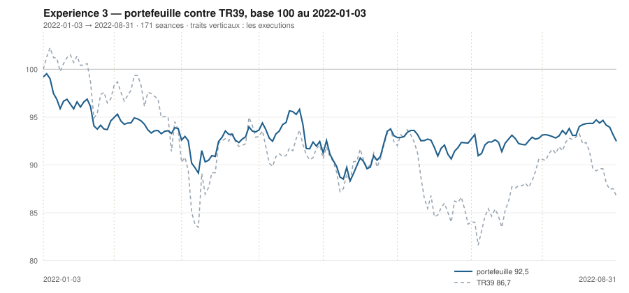

| | |
|---|---|
| Dotation initiale | 10 000,00 € au 2022-01-03 |
| Titres au 2022-08-31 | 5 486,47 € |
| Espèces | 3 759,97 € |
| **Total** | **9 246,44 €** |
| Base 100 | **92,46** |
| TR39, même base | 86,74 |
| Écart depuis janvier | **+5,73 pt** |

### Toutes les positions depuis le début de l'expérience

> Closes comme ouvertes. Une position encore ouverte laisse les deux dernières colonnes vides. Aucune séance postérieure au 2022-08-31 n'entre dans ce tableau.

| Société | Prix d'achat | Date d'achat | Prix de vente | Date de vente |
|---|---|---|---|---|
| `CAP.PA` Capgemini | 194,20 € | 2022-01-03 | 182,68 € | 2022-04-01 |
| `DSY.PA` Dassault Systèmes | 50,13 € | 2022-01-03 | 41,05 € | 2022-02-01 |
| `KER.PA` Kering | 558,25 € | 2022-03-01 | 454,99 € | 2022-06-01 |
| `HO.PA` Thales | 103,16 € | 2022-04-01 |  |  |
| `MT.AS` ArcelorMittal | 26,84 € | 2022-04-01 | 28,27 € | 2022-06-01 |
| `TTE.PA` TotalEnergies | 43,30 € | 2022-06-01 |  |  |
| `BN.PA` Danone | 46,97 € | 2022-08-01 |  |  |

*7 positions depuis le début, dont 3 encore ouvertes : les deux dernières colonnes restent vides.*

## 5. L'étude chartiste au 2022-07-29

> Notes rédigées sans aucune séance postérieure au 2022-07-29, par l'agent `chartiste`. Cinq lignes au plus par société, **chacune sous la figure de décision qui la justifie** — celle que la règle a lue ce jour-là, portant les cinq critères, les vetos et le verdict.

### 1. `HO.PA` — Thales

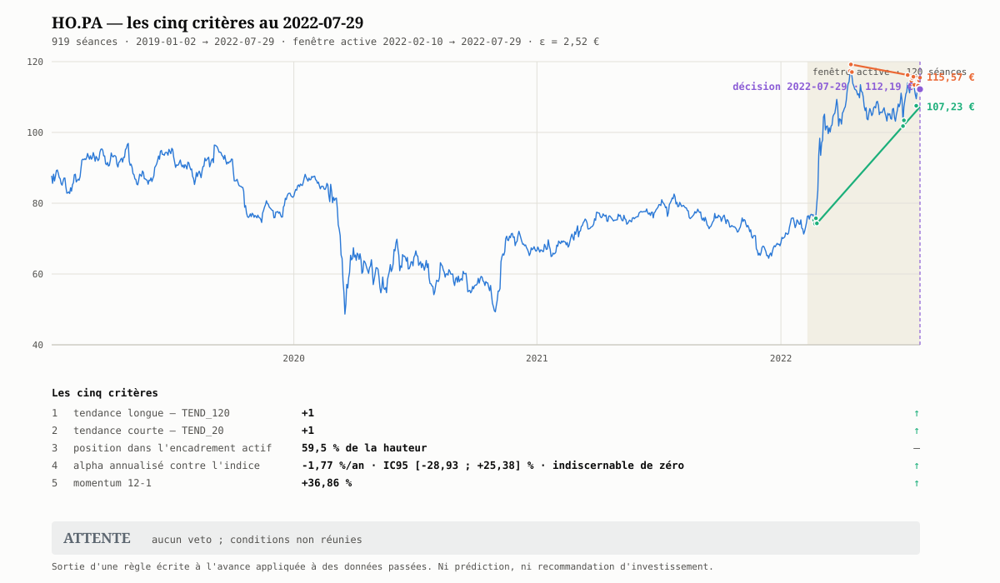

- Canal 107,23 – 115,57 €, clôture à 112,19 € à 59,5 % de la hauteur.
- Support +0,302 contre résistance −0,050 €/séance, τ de 24 séances : le canal se referme presque à la décision suivante.
- Trois contacts bas, quatre hauts : **aucun veto**.
- **Momentum +36,9 %, le plus fort de la date** ; alpha −1,8 %/an.

### 2. `SAN.PA` — Sanofi

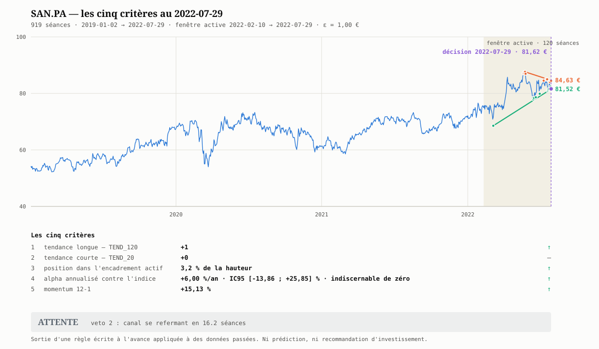

- Canal 81,52 – 84,63 €, large de 3,1 %, clôture à 81,62 € à **3,2 %** : sur le support.
- Support +0,127 contre résistance −0,065 €/séance : **le canal se referme en 16 séances**, veto 2.
- **Six contacts en support et quatre en résistance** — la figure la mieux étayée de la date, et elle disparaît avant la décision suivante.
- Momentum +15,1 %, alpha +6,0 %/an.

### 3. `ORA.PA` — Orange

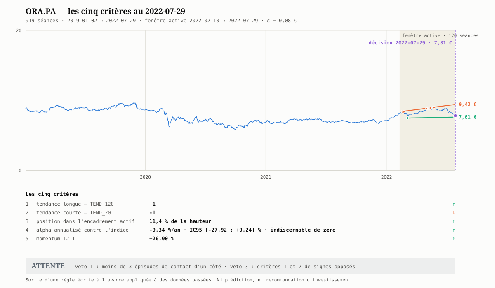

- Canal 7,61 – 9,42 €, clôture à 7,81 € à 11,4 % de la hauteur.
- Support +0,001 contre résistance +0,009 €/séance : ouverture, τ infini.
- Deux contacts en support : veto 1 ; tendances opposées : veto 3.
- Momentum +26,0 %, alpha −9,3 %/an.

### 4. `TTE.PA` — TotalEnergies

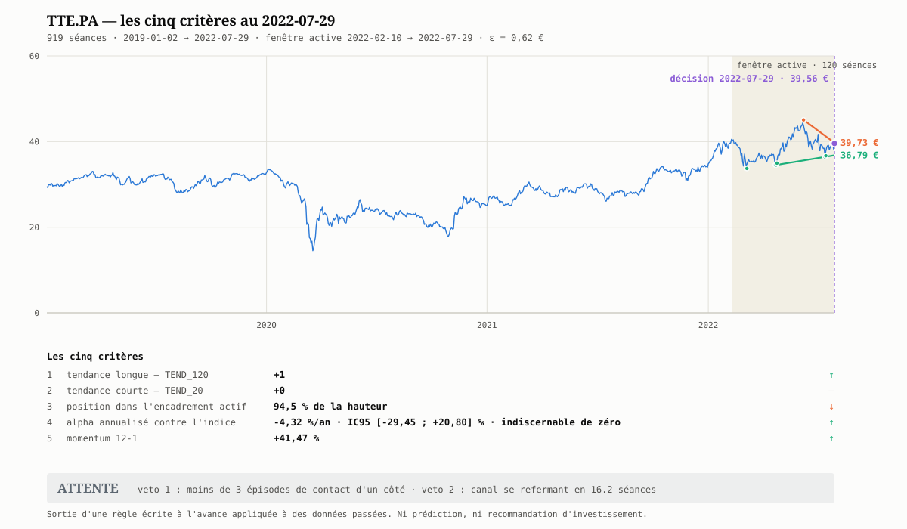

- Canal 36,79 – 39,73 €, clôture à 39,56 € à 94,5 % : contre le plafond.
- Support +0,033 contre résistance −0,148 €/séance : **le canal se referme en 16 séances**, veto 2.
- Deux contacts en résistance : veto 1 également.
- **Momentum +41,5 %**, le deuxième de la date ; alpha −4,3 %/an.

### 5. `BN.PA` — Danone

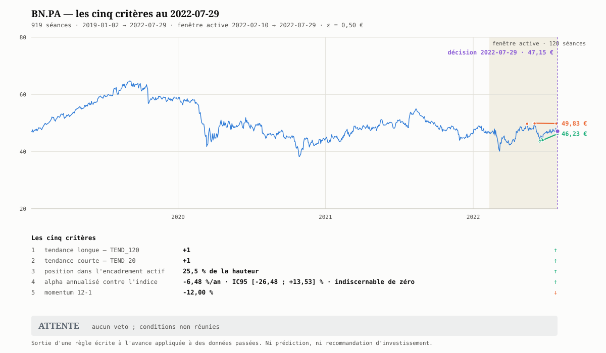

- Canal 46,23 – 49,83 €, clôture à 47,15 € à 25,5 % de la hauteur.
- Pentes +0,086 et −0,003 €/séance, τ de 41 séances.
- Trois contacts de chaque côté : **aucun veto**.
- Momentum −12,0 %, alpha −6,5 %/an.

### 6. `CA.PA` — Carrefour

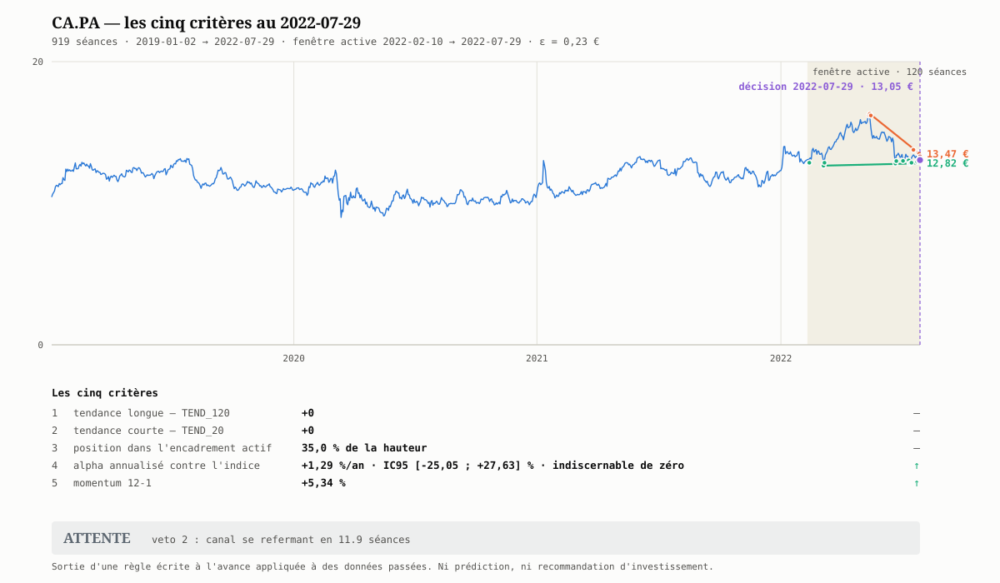

- Canal 12,82 – 13,47 €, large de 0,7 %, clôture à 13,05 € à 35,0 % : exactement au seuil bas.
- Support +0,002 contre résistance −0,054 €/séance : **le canal se referme en 12 séances**, veto 2.
- Six contacts bas, trois hauts : figure étayée, géométrie périmée.
- Momentum +5,3 %, alpha +1,3 %/an.

### 7. `ENGI.PA` — Engie

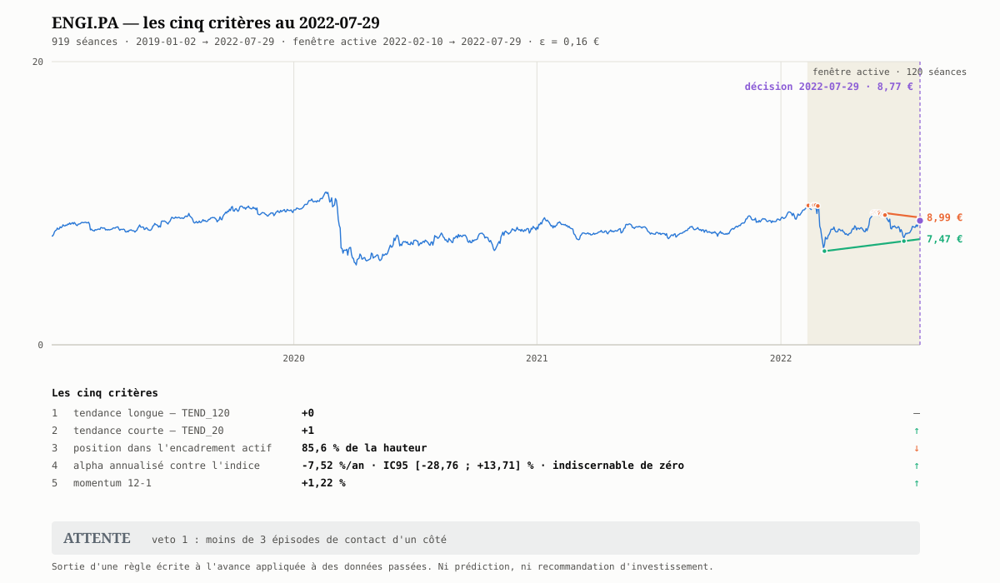

- Canal 7,47 – 8,99 €, clôture à 8,77 € à 85,6 % de la hauteur.
- Pentes +0,008 et −0,009 €/séance, τ de 90 séances.
- Deux contacts en support : veto 1.
- Momentum +1,2 %, alpha −7,5 %/an.

### 8. `ALO.PA` — Alstom

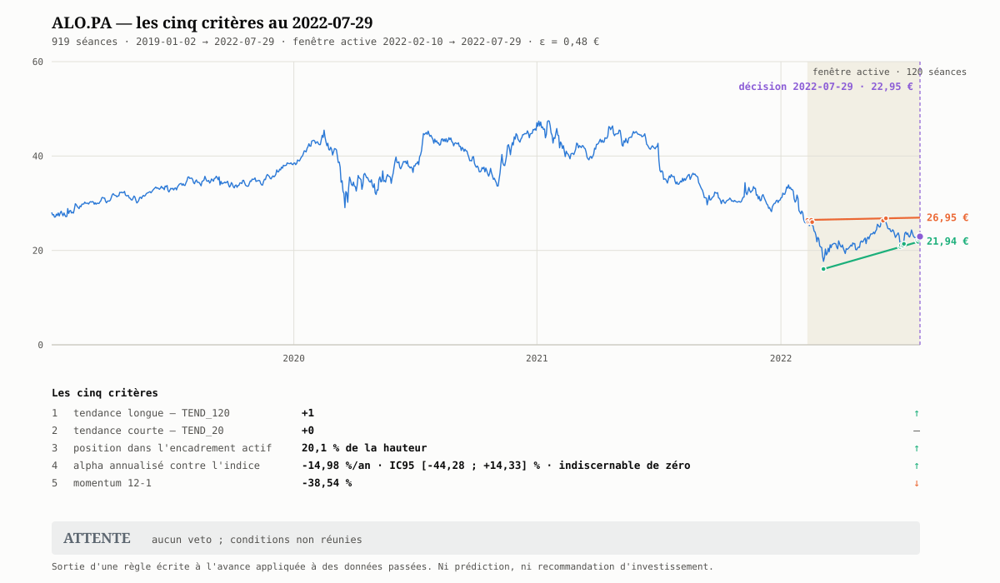

- Canal 21,94 – 26,95 €, clôture à 22,95 € à 20,1 %.
- Pentes +0,058 et +0,004 €/séance, τ de 94 séances.
- Trois contacts de chaque côté : **aucun veto** — première figure propre d'Alstom depuis décembre.
- **Momentum −38,5 %**, le plus faible de la date ; alpha −15,0 %/an.

### 9. `AI.PA` — Air Liquide

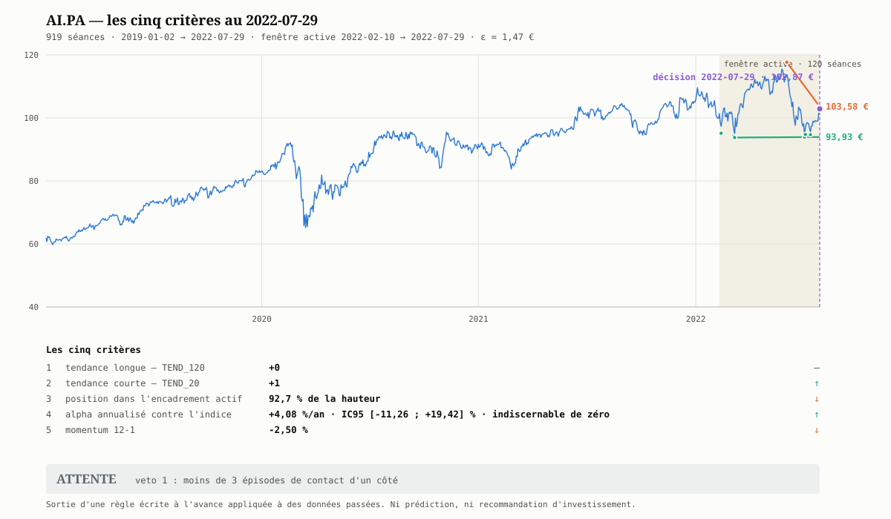

- Canal 93,93 – 103,58 €, clôture à 102,87 € à 92,7 % : sous le plafond.
- Support +0,002 contre résistance −0,361 €/séance, τ de 27 séances.
- Quatre contacts bas, deux hauts : veto 1.
- Momentum −2,5 %, alpha +4,1 %/an.

### 10. `EN.PA` — Bouygues

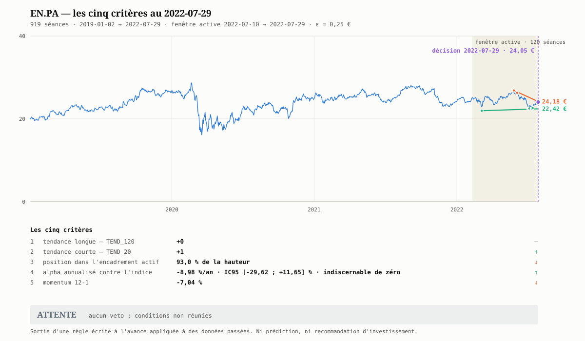

- Canal 22,42 – 24,18 €, clôture à 24,05 € à 93,0 % de la hauteur.
- Pentes +0,004 et −0,061 €/séance, τ de 27 séances.
- Trois contacts de chaque côté : **aucun veto**.
- Momentum −7,0 %, alpha −9,0 %/an.

### 11. `VIV.PA` — Vivendi

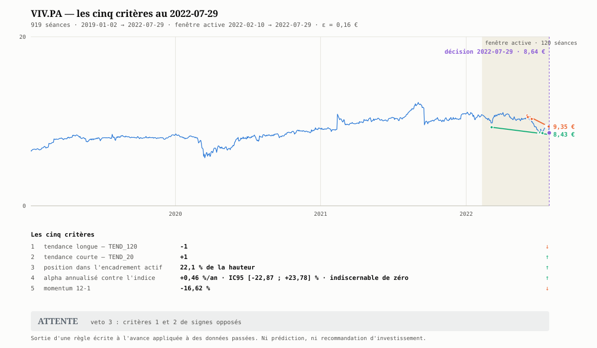

- Canal 8,43 – 9,35 €, clôture à 8,64 € à 22,1 %.
- Pentes −0,008 et −0,034 €/séance, τ de 36 séances.
- Trois contacts de chaque côté : figure lisible ; seul le veto 3 mord.
- Momentum −16,6 %, alpha +0,5 %/an.

### 12. `DG.PA` — Vinci

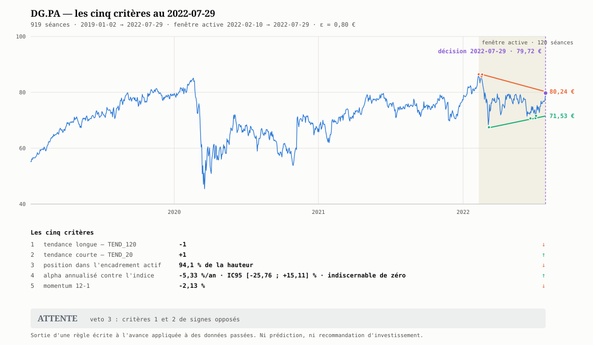

- Canal 71,53 – 80,24 €, clôture à 79,72 € à 94,1 % : contre le plafond.
- Pentes +0,042 et −0,055 €/séance, τ de 91 séances.
- Trois contacts de chaque côté : figure lisible ; veto 3.
- Momentum −2,1 %, alpha −5,3 %/an.

### 13. `CS.PA` — AXA

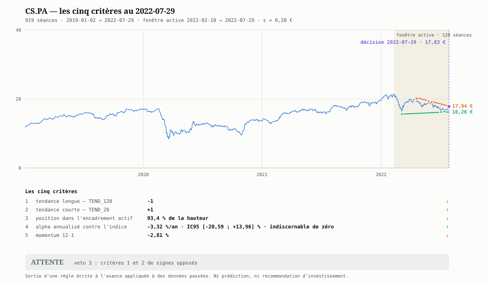

- Canal 16,26 – 17,94 €, clôture à 17,83 € à 93,4 % de la hauteur.
- Pentes +0,006 et −0,035 €/séance, τ de 41 séances.
- Trois contacts bas, quatre hauts : figure lisible ; veto 3.
- Momentum −2,8 %, alpha −3,3 %/an.

### 14. `RI.PA` — Pernod Ricard

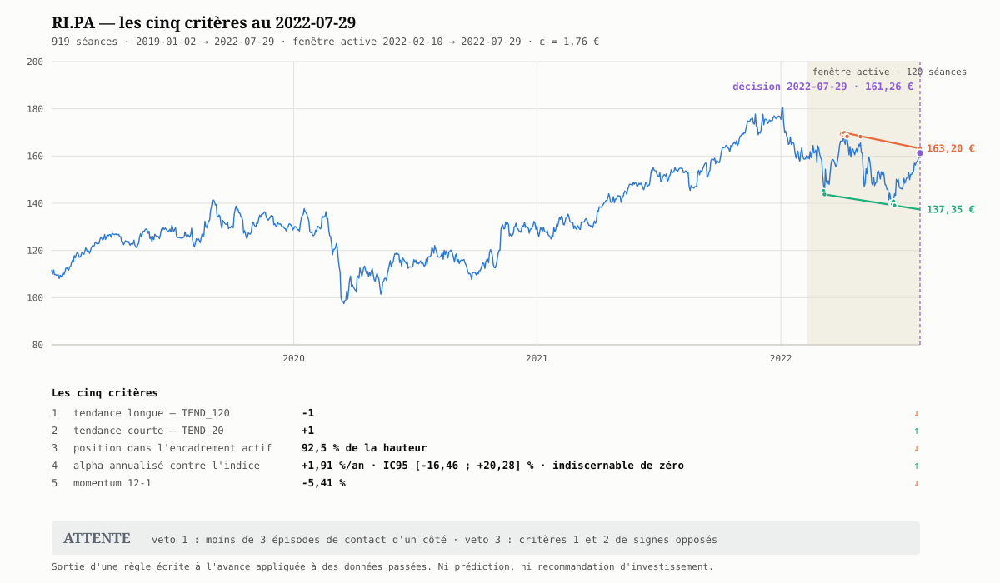

- Canal 137,35 – 163,20 €, clôture à 161,26 € à 92,5 % de la hauteur.
- Pentes −0,063 et −0,083 €/séance, quasi parallèles : τ de 1 292 séances.
- Deux contacts en support : veto 1 ; tendances opposées : veto 3.
- Momentum −5,4 %, alpha +1,9 %/an.

### 15. `BNP.PA` — BNP Paribas

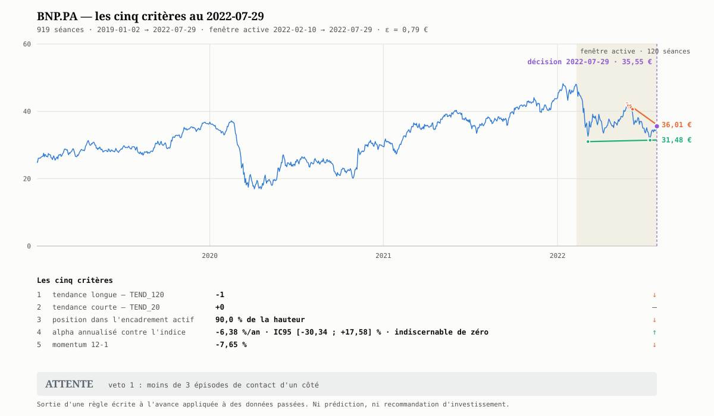

- Canal 31,48 – 36,01 €, clôture à 35,55 € à 90,0 % de la hauteur.
- Pentes +0,004 et −0,144 €/séance, τ de 31 séances.
- Deux contacts de chaque côté : veto 1.
- Momentum −7,7 %, alpha −6,4 %/an.

### 16. `VIE.PA` — Veolia

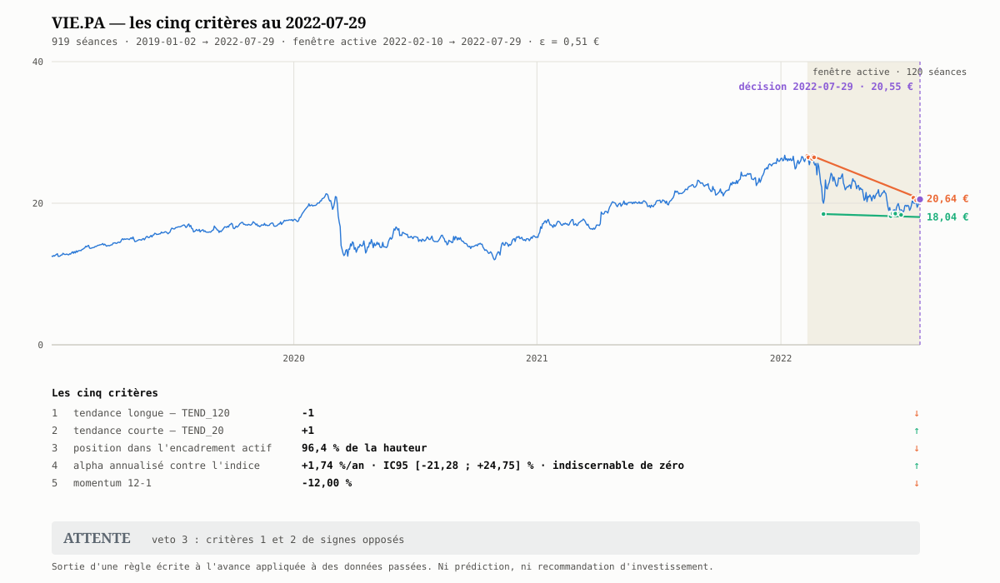

- Canal 18,04 – 20,64 €, clôture à 20,55 € à 96,4 % : contre le plafond.
- Pentes −0,004 et −0,053 €/séance, τ de 53 séances.
- Trois contacts bas, cinq hauts : figure lisible ; veto 3.
- Momentum −12,0 %, alpha +1,7 %/an.

### 17. `EL.PA` — EssilorLuxottica

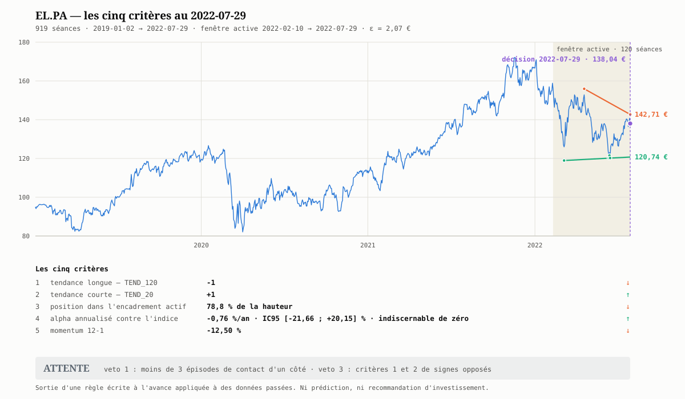

- Canal 120,74 – 142,71 €, clôture à 138,04 € à 78,8 %.
- Support +0,018 contre résistance −0,186 €/séance, τ de 108 séances.
- Deux contacts de chaque côté : veto 1 ; tendances opposées : veto 3.
- Momentum −12,5 %, alpha −0,8 %/an.

### 18. `CAP.PA` — Capgemini

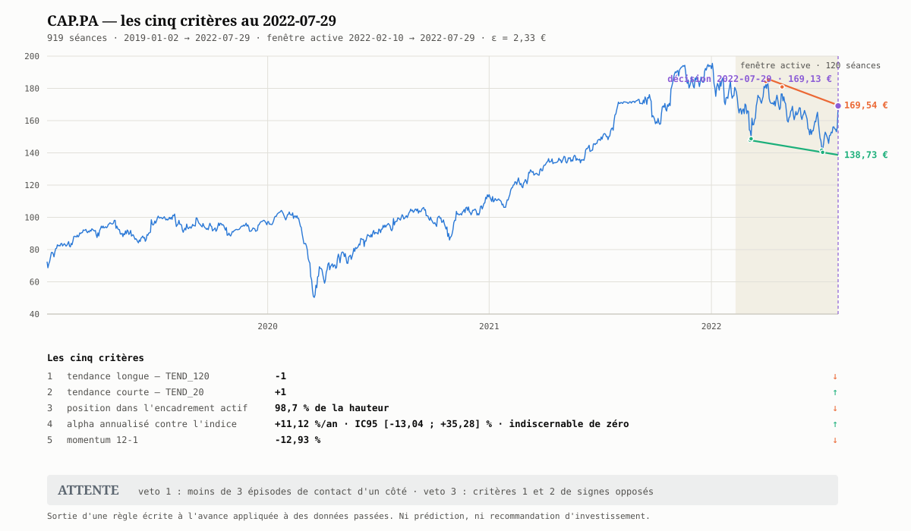

- Canal 138,73 – 169,54 €, clôture à 169,13 € à 98,7 % : à quarante centimes du plafond.
- Pentes −0,089 et −0,200 €/séance, τ de 279 séances.
- Deux contacts en support : veto 1 ; tendances opposées : veto 3.
- Momentum −12,9 %, alpha +11,1 %/an.

### 19. `PUB.PA` — Publicis

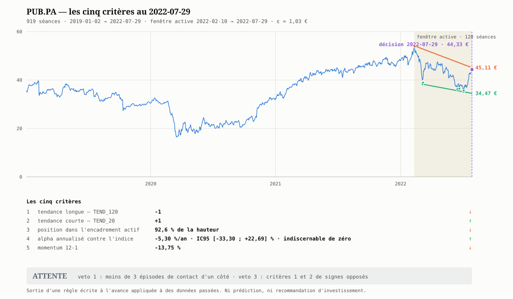

- Canal 34,47 – 45,11 €, clôture à 44,33 € à 92,6 % de la hauteur.
- Pentes −0,037 et −0,076 €/séance, τ de 274 séances.
- Quatre contacts bas, deux hauts : veto 1 ; tendances opposées : veto 3.
- Momentum −13,8 %, alpha −5,3 %/an.

### 20. `SAF.PA` — Safran

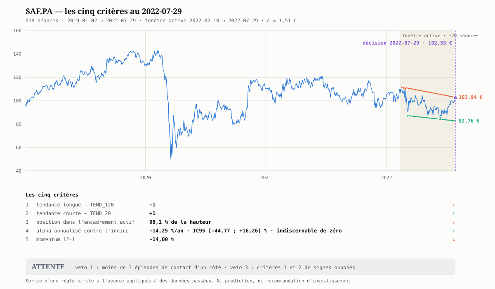

- Canal 82,76 – 102,94 €, clôture à 102,55 € à 98,1 % : contre le plafond.
- Pentes −0,044 et −0,077 €/séance, τ de 613 séances.
- Deux contacts en support : veto 1 ; tendances opposées : veto 3.
- Momentum −14,0 %, alpha −14,2 %/an.

### 21. `MC.PA` — LVMH

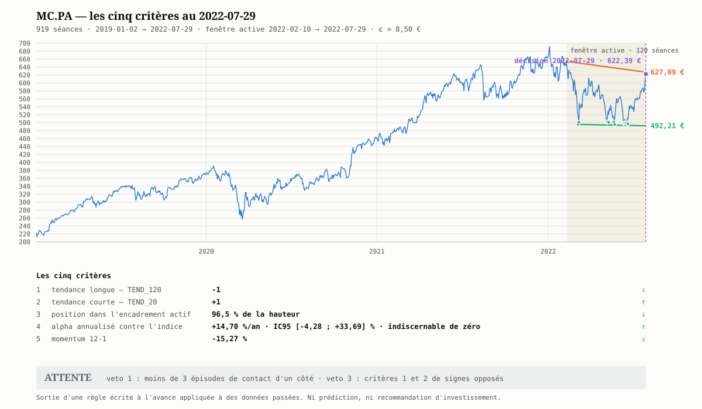

- Canal 492,21 – 627,09 €, large de 135 €, clôture à 622,39 € à 96,5 % de la hauteur.
- Pentes −0,035 et −0,228 €/séance, τ de 700 séances.
- Deux contacts en résistance : veto 1 ; tendances opposées : veto 3.
- Momentum −15,3 %, alpha +14,7 %/an, IC95 de −4,3 à +33,7.

### 22. `OR.PA` — L'Oréal

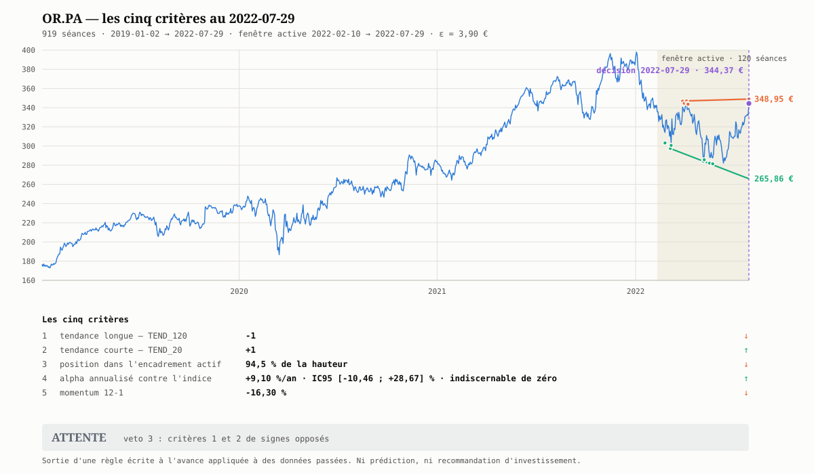

- Canal 265,86 – 348,95 €, large de 83,1 %, clôture à 344,37 € à 94,5 %.
- Support −0,309 contre résistance +0,023 €/séance : ouverture, τ infini.
- Cinq contacts bas, trois hauts : figure bien étayée ; seul le veto 3 mord.
- Momentum −16,3 %, alpha +9,1 %/an.

### 23. `STMPA.PA` — STMicroelectronics

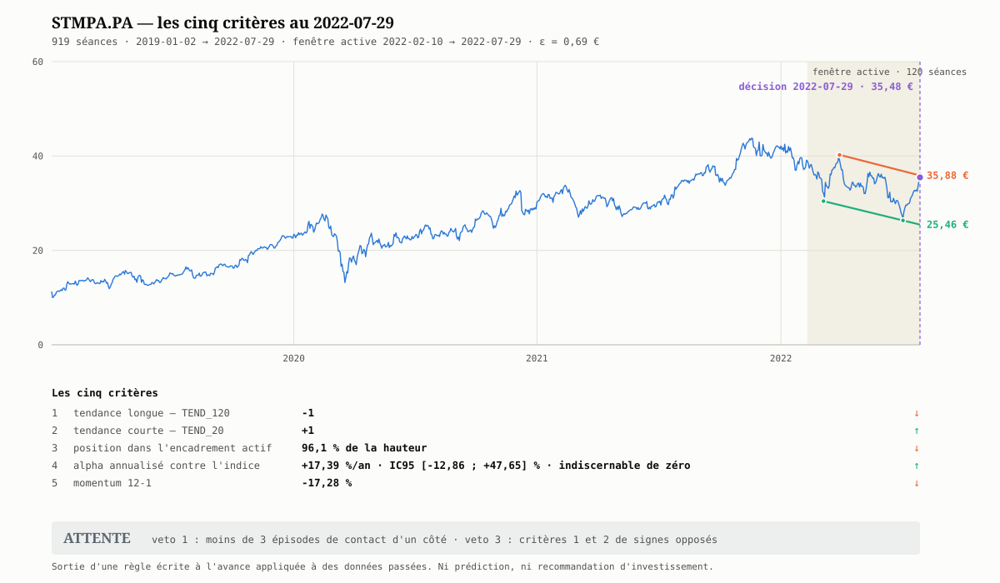

- Canal 25,46 – 35,88 €, clôture à 35,48 € à 96,1 % de la hauteur.
- Pentes −0,049 et −0,051 €/séance, quasi parallèles : τ de 4 090 séances.
- Deux contacts de chaque côté : veto 1 ; tendances opposées : veto 3.
- Momentum −17,3 %, alpha +17,4 %/an.

### 24. `TEP.PA` — Teleperformance

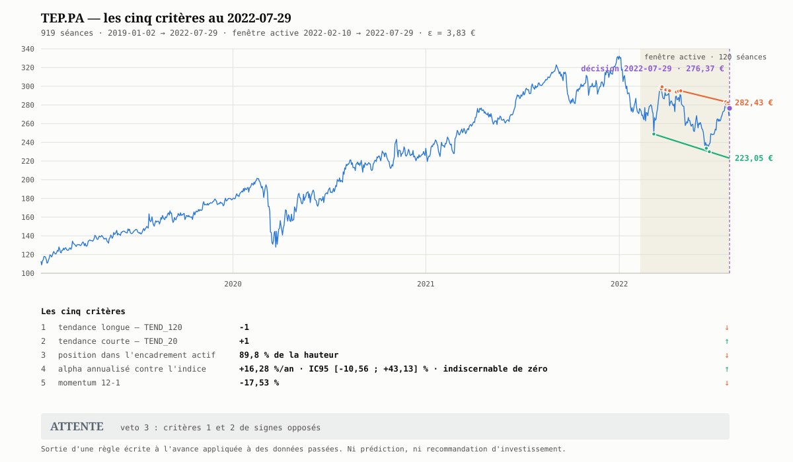

- Canal 223,05 – 282,43 €, clôture à 276,37 € à 89,8 % de la hauteur.
- Pentes −0,256 et −0,195 €/séance : ouverture, τ infini.
- Trois contacts bas et **sept en résistance** : figure bien étayée ; seul le veto 3 mord.
- Momentum −17,5 %, alpha +16,3 %/an.

### 25. `AIR.PA` — Airbus

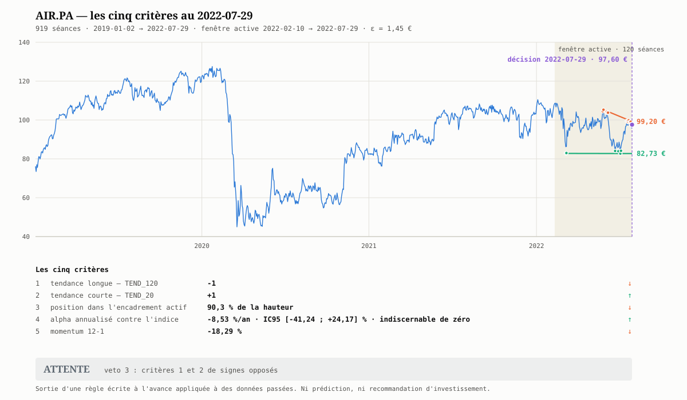

- Canal 82,73 – 99,20 €, clôture à 97,60 € à 90,3 %.
- Pentes −0,001 et −0,139 €/séance, τ de 119 séances.
- Quatre contacts bas, trois hauts : figure lisible ; veto 3 seul.
- Momentum −18,3 %, alpha −8,5 %/an.

### 26. `GLE.PA` — Société Générale

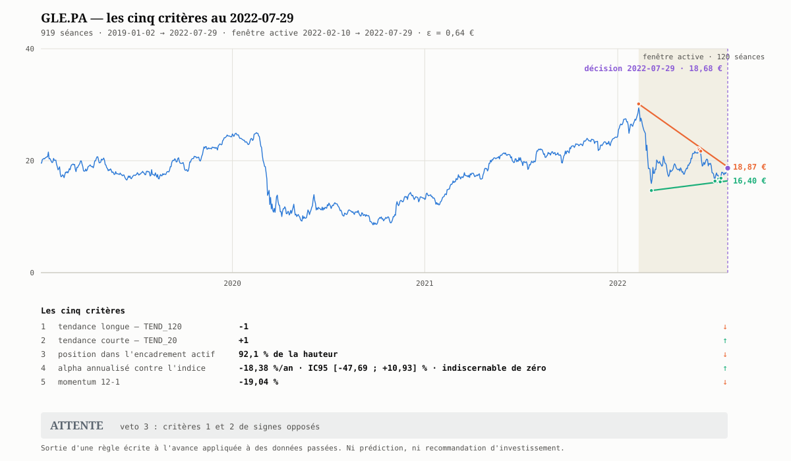

- Canal 16,40 – 18,87 €, clôture à 18,68 € à 92,1 %.
- Pentes +0,017 et −0,095 €/séance, τ de 22 séances.
- Trois contacts de chaque côté : figure lisible ; veto 3.
- Momentum −19,0 %, alpha −18,4 %/an.

### 27. `RMS.PA` — Hermès International

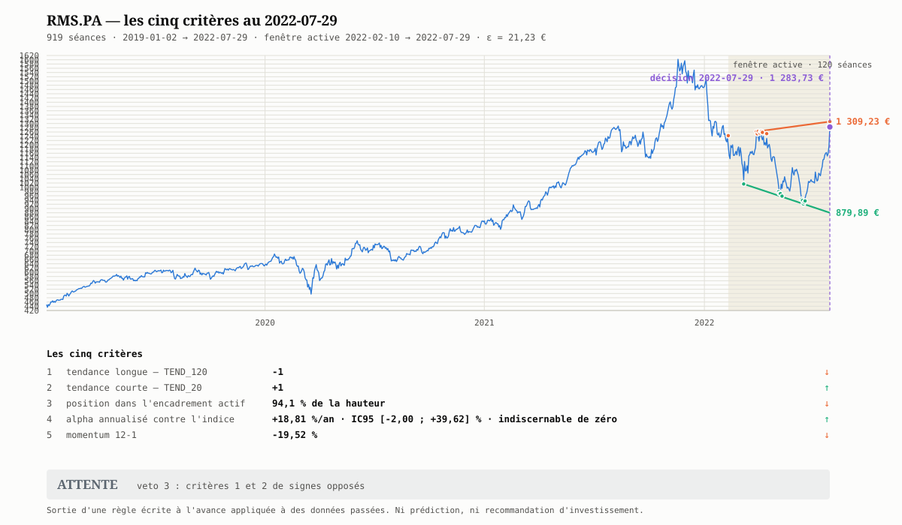

- Canal 879,89 – 1 309,23 €, d'une largeur de 429 € — la figure la plus étirée de la date —, clôture à 1 283,73 € à 94,1 %.
- Support −1,343 contre résistance +0,547 €/séance : ouverture franche, τ infini.
- Trois contacts bas, quatre hauts : figure lisible ; veto 3.
- Momentum −19,5 %, alpha +18,8 %/an, IC95 de −2,0 à +39,6.

### 28. `SU.PA` — Schneider Electric

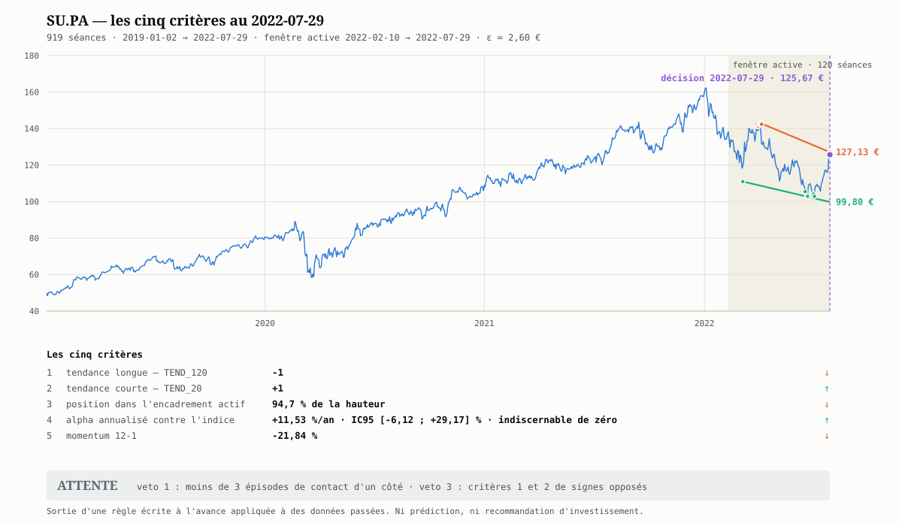

- Canal 99,80 – 127,13 €, clôture à 125,67 € à 94,7 %.
- Pentes −0,110 et −0,195 €/séance, τ de 322 séances.
- Trois contacts bas, deux hauts : veto 1 ; tendances opposées : veto 3.
- Momentum −21,8 %, alpha +11,5 %/an.

### 29. `ML.PA` — Michelin

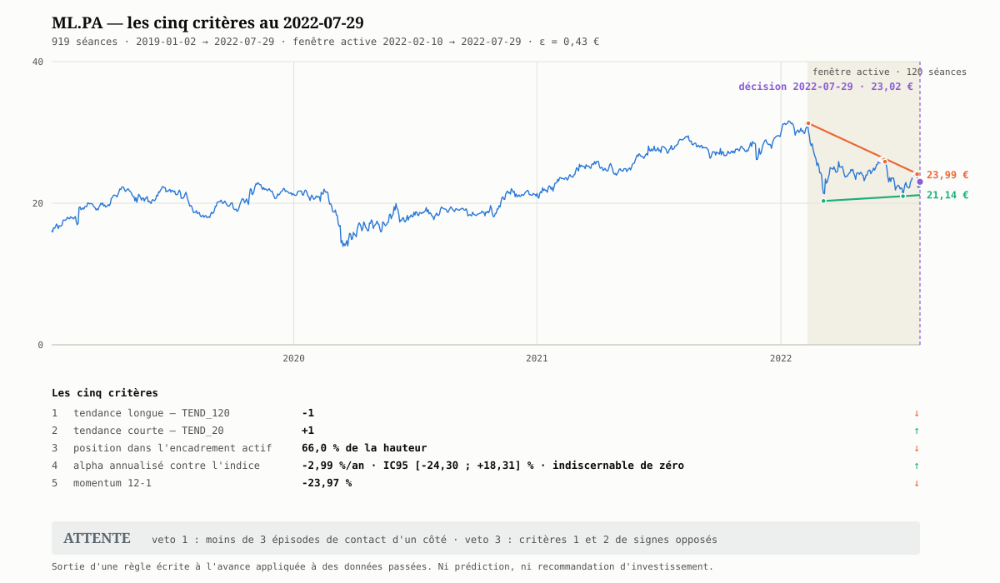

- Canal 21,14 – 23,99 €, clôture à 23,02 € à 66,0 % — juste au-dessus du seuil haut.
- Pentes +0,008 et −0,062 €/séance, τ de 41 séances.
- Deux contacts en support : veto 1 ; tendances opposées : veto 3.
- Momentum −24,0 %, alpha −3,0 %/an.

### 30. `LR.PA` — Legrand

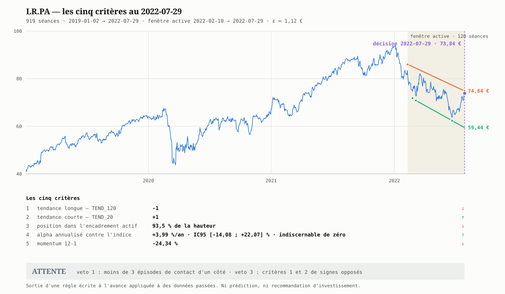

- Canal 59,44 – 74,84 €, clôture à 73,84 € à 93,5 %.
- Pentes −0,112 et −0,094 €/séance : ouverture, τ infini.
- Deux contacts en résistance : veto 1 ; tendances opposées : veto 3.
- Momentum −24,3 %, alpha +4,0 %/an.

### 31. `MT.AS` — ArcelorMittal

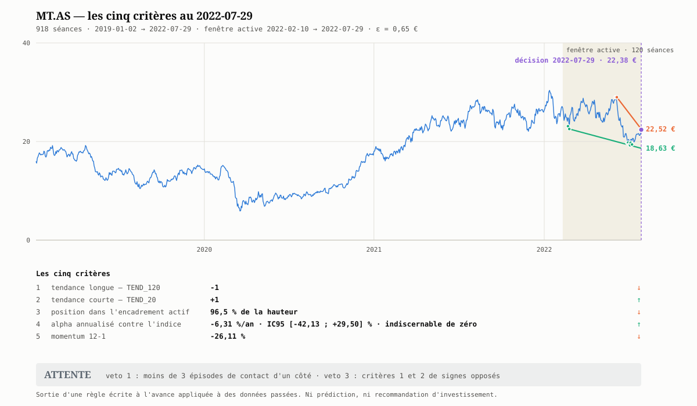

- Canal 18,63 – 22,52 €, clôture à 22,38 € à 96,5 % de la hauteur.
- Pentes −0,036 et −0,175 €/séance, τ de 28 séances.
- Deux contacts de chaque côté : veto 1 ; tendances opposées : veto 3.
- Momentum −26,1 %, alpha −6,3 %/an sur un IC95 de 72 points.

### 32. `DSY.PA` — Dassault Systèmes

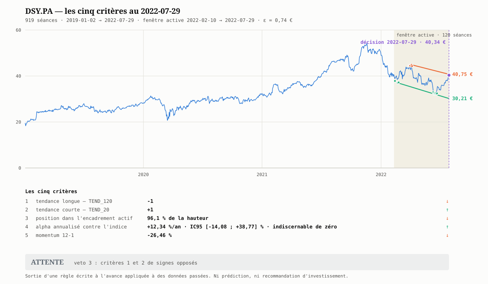

- Canal 30,21 – 40,75 €, clôture à 40,34 € à 96,1 % de la hauteur.
- Pentes −0,061 et −0,051 €/séance : ouverture, τ infini.
- Trois contacts de chaque côté : figure lisible ; veto 3.
- Momentum −26,5 %, alpha +12,3 %/an.

### 33. `STLAP.PA` — Stellantis

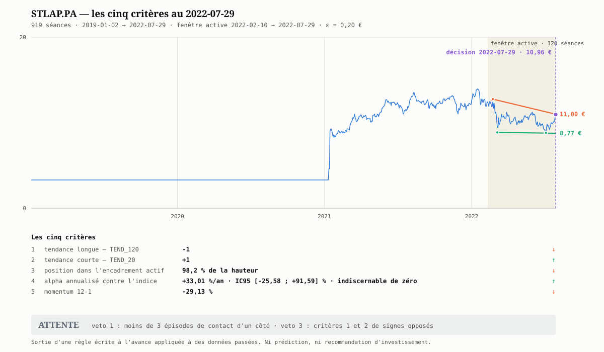

- Canal 8,77 – 11,00 €, clôture à 10,96 € à 98,2 % : à quatre centimes du plafond.
- Pentes −0,001 et −0,016 €/séance, τ de 148 séances.
- Deux contacts de chaque côté : veto 1 ; tendances opposées : veto 3.
- Momentum −29,1 %, alpha +33,0 %/an sur un IC95 de 117 points.

### 34. `RNO.PA` — Renault

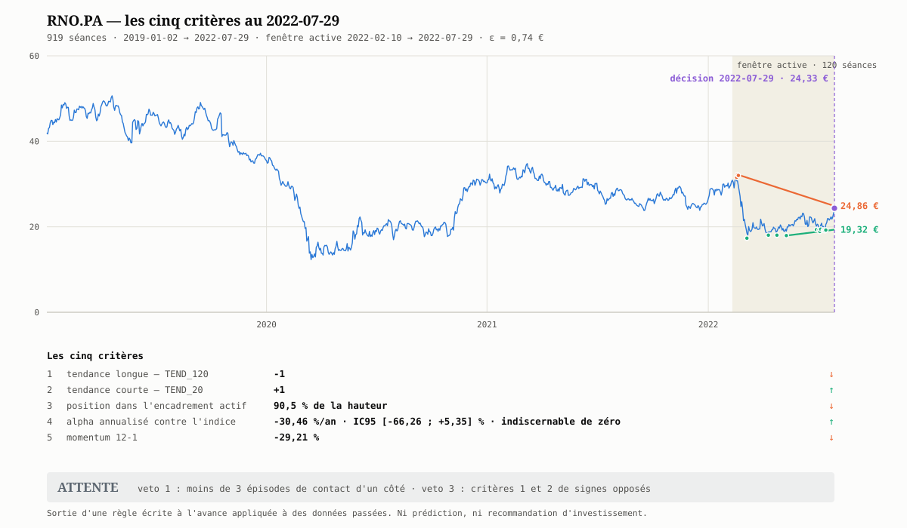

- Canal 19,32 – 24,86 €, clôture à 24,33 € à 90,5 % de la hauteur.
- Pentes +0,025 et −0,065 €/séance, τ de 62 séances.
- **Sept contacts en support** contre deux en résistance : veto 1 ; tendances opposées : veto 3.
- Momentum −29,2 %, alpha −30,5 %/an.

### 35. `SGO.PA` — Saint-Gobain

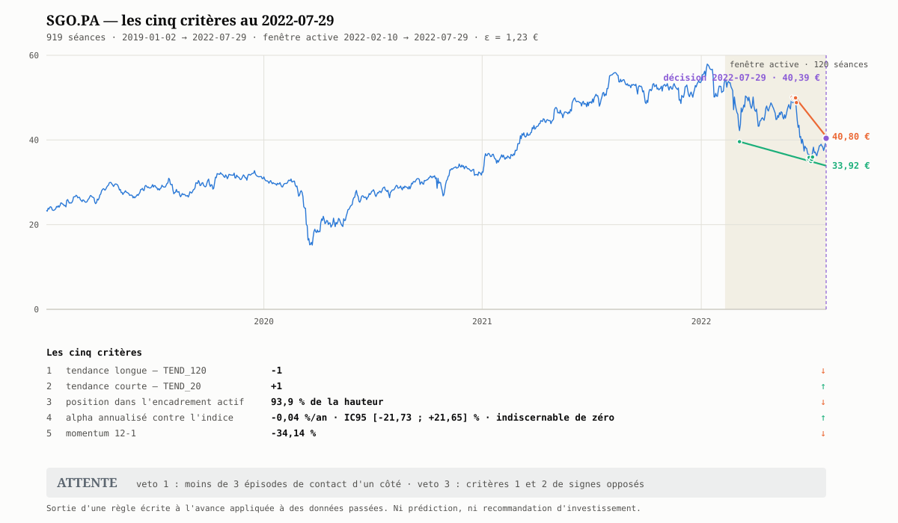

- Canal 33,92 – 40,80 €, clôture à 40,39 € à 93,9 % de la hauteur.
- Pentes −0,056 et −0,254 €/séance, τ de 35 séances.
- Deux contacts de chaque côté : veto 1 ; tendances opposées : veto 3.
- Momentum −34,1 %, alpha rigoureusement nul, −0,0 %/an.

### 36. `ERF.PA` — Eurofins Scientific

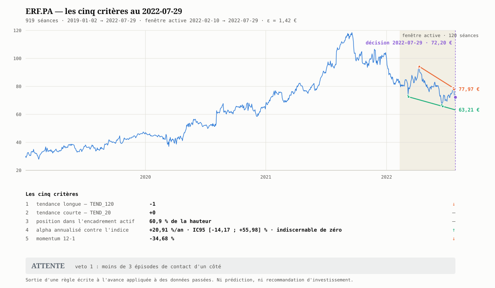

- Canal 63,21 – 77,97 €, clôture à 72,20 € à 60,9 % de la hauteur.
- Pentes −0,093 et −0,210 €/séance, τ de 126 séances.
- Deux contacts de chaque côté : veto 1.
- Momentum −34,7 %, **alpha +20,9 %/an**, le plus élevé de la date.

### 37. `KER.PA` — Kering

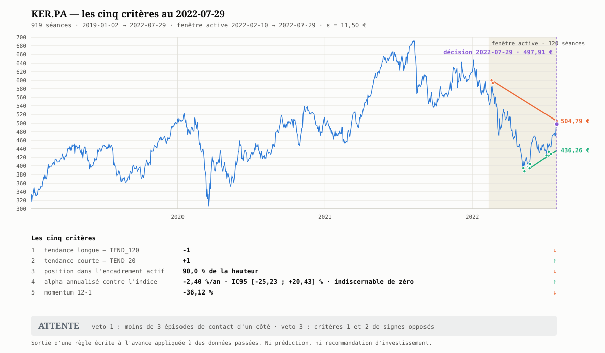

- Canal 436,26 – 504,79 €, clôture à 497,91 € à 90,0 % de la hauteur.
- Support +0,899 contre résistance −0,834 €/séance, τ de 40 séances.
- Cinq contacts bas, deux hauts : veto 1 ; tendances opposées : veto 3.
- Momentum −36,1 %, alpha −2,4 %/an.

### 38. `WLN.PA` — Worldline

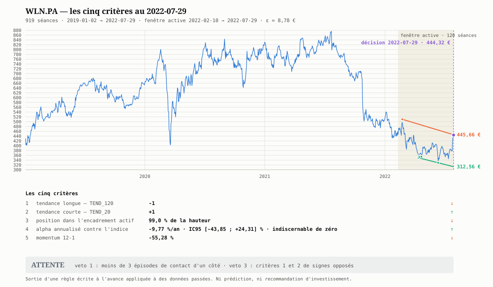

- Canal 312,56 – 445,66 €, clôture à 444,32 € à 99,0 % : à un centime du plafond, en base rétro-ajustée.
- Pentes −0,492 et −0,585 €/séance, τ de 1 436 séances.
- Trois contacts bas, deux hauts : veto 1 ; tendances opposées : veto 3.
- **Momentum −55,3 %, le plus faible de toute l'année** ; alpha −9,8 %/an.

### 39. `ACA.PA` — Crédit Agricole

- Canal 6,03 – 6,73 €, d'une largeur de 0,7 %, clôture à 6,70 € à 94,6 % de la hauteur.
- Pentes −0,000 et −0,025 €/séance, τ de 29 séances.
- Trois contacts de chaque côté : **aucun veto** — figure lisible, tendances concordantes, et pourtant le score le plus bas de la date, −5.
- Momentum −21,6 %, alpha −10,7 %/an.

## 6. Le classement au 2022-07-29

> De la valeur la plus intéressante à détenir à celle qu'il faut fuir. La colonne **τ** donne la date de péremption du canal en séances, la colonne **Vetos** les numéros déclenchés. Une valeur sous veto ne peut pas être achetée.

| Rang | Valeur | `s1` | `s2` | `s3` | `s4` | `s5` | Score | Position | Momentum | τ | Vetos |
|---|---|---|---|---|---|---|---|---|---|---|---|
| 1 | `HO.PA` Thales | +2 | +1 | +0 | +2 | +0 | **+5** | 59,5 % | +36,9 % | 23,7 | — |
| 2 | `SAN.PA` Sanofi | +2 | +0 | +1 | +2 | +0 | **+5** | 3,2 % | +15,1 % | 16,2 | 2 |
| 3 | `ORA.PA` Orange | +2 | -1 | +1 | +2 | +0 | **+4** | 11,4 % | +26,0 % | ∞ | 1 3 |
| 4 | `TTE.PA` TotalEnergies | +2 | +0 | -1 | +2 | +0 | **+3** | 94,5 % | +41,5 % | 16,2 | 1 2 |
| 5 | `BN.PA` Danone | +2 | +1 | +1 | -2 | +0 | **+2** | 25,5 % | -12,0 % | 40,8 | — |
| 6 | `CA.PA` Carrefour | +0 | +0 | +0 | +1 | +0 | **+1** | 35,0 % | +5,3 % | 11,9 | 2 |
| 7 | `ENGI.PA` Engie | +0 | +1 | -1 | +1 | +0 | **+1** | 85,6 % | +1,2 % | 89,7 | 1 |
| 8 | `ALO.PA` Alstom | +2 | +0 | +1 | -2 | +0 | **+1** | 20,1 % | -38,5 % | 93,6 | — |
| 9 | `AI.PA` Air Liquide | +0 | +1 | -1 | -1 | +0 | **-1** | 92,7 % | -2,5 % | 26,6 | 1 |
| 10 | `EN.PA` Bouygues | +0 | +1 | -1 | -1 | +0 | **-1** | 93,0 % | -7,0 % | 26,7 | — |
| 11 | `VIV.PA` Vivendi | -2 | +1 | +1 | -2 | +0 | **-2** | 22,1 % | -16,6 % | 35,9 | 3 |
| 12 | `DG.PA` Vinci | -2 | +1 | -1 | -1 | +0 | **-3** | 94,1 % | -2,1 % | 90,6 | 3 |
| 13 | `CS.PA` AXA | -2 | +1 | -1 | -1 | +0 | **-3** | 93,4 % | -2,8 % | 41,1 | 3 |
| 14 | `RI.PA` Pernod Ricard | -2 | +1 | -1 | -1 | +0 | **-3** | 92,5 % | -5,4 % | 1 292,3 | 1 3 |
| 15 | `BNP.PA` BNP Paribas | -2 | +0 | -1 | -1 | +0 | **-4** | 90,0 % | -7,7 % | 30,5 | 1 |
| 16 | `VIE.PA` Veolia | -2 | +1 | -1 | -2 | +0 | **-4** | 96,4 % | -12,0 % | 53,2 | 3 |
| 17 | `EL.PA` EssilorLuxottica | -2 | +1 | -1 | -2 | +0 | **-4** | 78,8 % | -12,5 % | 107,7 | 1 3 |
| 18 | `CAP.PA` Capgemini | -2 | +1 | -1 | -2 | +0 | **-4** | 98,7 % | -12,9 % | 278,7 | 1 3 |
| 19 | `PUB.PA` Publicis | -2 | +1 | -1 | -2 | +0 | **-4** | 92,6 % | -13,8 % | 274,4 | 1 3 |
| 20 | `SAF.PA` Safran | -2 | +1 | -1 | -2 | +0 | **-4** | 98,1 % | -14,0 % | 613,3 | 1 3 |
| 21 | `MC.PA` LVMH | -2 | +1 | -1 | -2 | +0 | **-4** | 96,5 % | -15,3 % | 699,5 | 1 3 |
| 22 | `OR.PA` L'Oréal | -2 | +1 | -1 | -2 | +0 | **-4** | 94,5 % | -16,3 % | ∞ | 3 |
| 23 | `STMPA.PA` STMicroelectronics | -2 | +1 | -1 | -2 | +0 | **-4** | 96,1 % | -17,3 % | 4 089,9 | 1 3 |
| 24 | `TEP.PA` Teleperformance | -2 | +1 | -1 | -2 | +0 | **-4** | 89,8 % | -17,5 % | ∞ | 3 |
| 25 | `AIR.PA` Airbus | -2 | +1 | -1 | -2 | +0 | **-4** | 90,3 % | -18,3 % | 119,1 | 3 |
| 26 | `GLE.PA` Société Générale | -2 | +1 | -1 | -2 | +0 | **-4** | 92,1 % | -19,0 % | 22,2 | 3 |
| 27 | `RMS.PA` Hermès International | -2 | +1 | -1 | -2 | +0 | **-4** | 94,1 % | -19,5 % | ∞ | 3 |
| 28 | `SU.PA` Schneider Electric | -2 | +1 | -1 | -2 | +0 | **-4** | 94,7 % | -21,8 % | 321,9 | 1 3 |
| 29 | `ML.PA` Michelin | -2 | +1 | -1 | -2 | +0 | **-4** | 66,0 % | -24,0 % | 40,8 | 1 3 |
| 30 | `LR.PA` Legrand | -2 | +1 | -1 | -2 | +0 | **-4** | 93,5 % | -24,3 % | ∞ | 1 3 |
| 31 | `MT.AS` ArcelorMittal | -2 | +1 | -1 | -2 | +0 | **-4** | 96,5 % | -26,1 % | 28,0 | 1 3 |
| 32 | `DSY.PA` Dassault Systèmes | -2 | +1 | -1 | -2 | +0 | **-4** | 96,1 % | -26,5 % | ∞ | 3 |
| 33 | `STLAP.PA` Stellantis | -2 | +1 | -1 | -2 | +0 | **-4** | 98,2 % | -29,1 % | 147,8 | 1 3 |
| 34 | `RNO.PA` Renault | -2 | +1 | -1 | -2 | +0 | **-4** | 90,5 % | -29,2 % | 61,7 | 1 3 |
| 35 | `SGO.PA` Saint-Gobain | -2 | +1 | -1 | -2 | +0 | **-4** | 93,9 % | -34,1 % | 34,8 | 1 3 |
| 36 | `ERF.PA` Eurofins Scientific | -2 | +0 | +0 | -2 | +0 | **-4** | 60,9 % | -34,7 % | 125,8 | 1 |
| 37 | `KER.PA` Kering | -2 | +1 | -1 | -2 | +0 | **-4** | 90,0 % | -36,1 % | 39,6 | 1 3 |
| 38 | `WLN.PA` Worldline | -2 | +1 | -1 | -2 | +0 | **-4** | 99,0 % | -55,3 % | 1 435,8 | 1 3 |
| 39 | `ACA.PA` Crédit Agricole | -2 | +0 | -1 | -2 | +0 | **-5** | 94,6 % | -21,6 % | 28,5 | — |

## 7. Les ordres exécutés au 2022-08-01

> À l'**ouverture** de la séance, jamais à la clôture du 2022-07-29.

| Sens | Valeur | Quantité | Prix d'exécution | Brut | Frais | Motif |
|---|---|---|---|---|---|---|
| **Achat** | `BN.PA` Danone | 39 | 46,97 € | 1 831,84 € | 7,60 € | rang 5, score +2, aucun veto |

## 8. La lecture du mois

Sur le mois, la meilleure contribution vient de `TTE.PA` (TotalEnergies) pour **+31,06 €**, la moins bonne de `BN.PA` (Danone) pour **-45,19 €**. Les 1 ordres du mois ont coûté **7,60 €** de frais, soit 0,076 % de la dotation initiale. Le portefeuille termine le mois **devant TR39** de 3,94 point. Sur les 43 thèses du mois précédent qui ont pu être tranchées, **18 sont confirmées** — 41,9 %.

## 9. Les thèses écrites au 2022-07-29

> Elles seront dépouillées à la prochaine date de décision, dans le fichier du mois suivant. Elles sont engendrées mécaniquement par les règles du [protocole](../README.md#le-registre-des-thèses-réfutables) — aucune n'est rédigée à la main.

| Valeur | Thèse | Énoncé, à dépouiller au mois suivant |
|---|---|---|
| `ACA.PA` | Canal | clôture entre 6,02 € et 6,16 € au 2022-08-31 |
| `ACA.PA` | Reflexive | AUCUNE SEQUENCE : écart contre TR39 dans ± 5,93 pt (σ̂), au 2022-08-31 |
| `AI.PA` | Canal | clôture entre 93,97 € et 95,27 € au 2022-08-31 |
| `AIR.PA` | Canal | clôture entre 82,72 € et 96,01 € au 2022-08-31 |
| `ALO.PA` | Canal | clôture entre 23,27 € et 27,05 € au 2022-08-31 |
| `ALO.PA` | Reflexive | AUCUNE SEQUENCE : écart contre TR39 dans ± 10,35 pt (σ̂), au 2022-08-31 |
| `BN.PA` | Canal | clôture entre 48,20 € et 49,77 € au 2022-08-31 |
| `BNP.PA` | Canal | clôture entre 31,58 € et 32,70 € au 2022-08-31 |
| `BNP.PA` | Reflexive | AUCUNE SEQUENCE : écart contre TR39 dans ± 7,30 pt (σ̂), au 2022-08-31 |
| `CA.PA` | Canal | encadrement ferme avant le 2022-08-31 : les bornes prolongees se croisent, la thèse est inconfirmable à l'écriture |
| `CAP.PA` | Canal | clôture entre 136,68 € et 164,94 € au 2022-08-31 |
| `CS.PA` | Canal | clôture entre 16,40 € et 17,14 € au 2022-08-31 |
| `CS.PA` | Reflexive | AUCUNE SEQUENCE : écart contre TR39 dans ± 5,47 pt (σ̂), au 2022-08-31 |
| `DG.PA` | Canal | clôture entre 72,49 € et 78,98 € au 2022-08-31 |
| `DSY.PA` | Canal | clôture entre 28,80 € et 39,58 € au 2022-08-31 |
| `EL.PA` | Canal | clôture entre 121,14 € et 138,43 € au 2022-08-31 |
| `EN.PA` | Canal | clôture entre 22,52 € et 22,77 € au 2022-08-31 |
| `ENGI.PA` | Canal | clôture entre 7,66 € et 8,79 € au 2022-08-31 |
| `ERF.PA` | Canal | clôture entre 61,07 € et 73,13 € au 2022-08-31 |
| `ERF.PA` | Reflexive | AUCUNE SEQUENCE : écart contre TR39 dans ± 9,58 pt (σ̂), au 2022-08-31 |
| `GLE.PA` | Canal | encadrement ferme avant le 2022-08-31 : les bornes prolongees se croisent, la thèse est inconfirmable à l'écriture |
| `GLE.PA` | Reflexive | AUCUNE SEQUENCE : écart contre TR39 dans ± 8,68 pt (σ̂), au 2022-08-31 |
| `HO.PA` | Canal | clôture entre 114,18 € et 114,42 € au 2022-08-31 |
| `KER.PA` | Canal | clôture entre 456,93 € et 485,62 € au 2022-08-31 |
| `LR.PA` | Canal | clôture entre 56,88 € et 72,68 € au 2022-08-31 |
| `MC.PA` | Canal | clôture entre 491,40 € et 621,84 € au 2022-08-31 |
| `ML.PA` | Canal | clôture entre 21,33 € et 22,57 € au 2022-08-31 |
| `MT.AS` | Canal | clôture entre 17,80 € et 18,50 € au 2022-08-31 |
| `MT.AS` | Reflexive | AUCUNE SEQUENCE : écart contre TR39 dans ± 10,43 pt (σ̂), au 2022-08-31 |
| `OR.PA` | Canal | clôture entre 258,74 € et 349,48 € au 2022-08-31 |
| `ORA.PA` | Canal | clôture entre 7,64 € et 9,62 € au 2022-08-31 |
| `PUB.PA` | Canal | clôture entre 33,61 € et 43,36 € au 2022-08-31 |
| `RI.PA` | Canal | clôture entre 135,90 € et 161,29 € au 2022-08-31 |
| `RMS.PA` | Canal | clôture entre 849,01 € et 1 321,81 € au 2022-08-31 |
| `RNO.PA` | Canal | clôture entre 19,88 € et 23,36 € au 2022-08-31 |
| `SAF.PA` | Canal | clôture entre 81,75 € et 101,17 € au 2022-08-31 |
| `SAN.PA` | Canal | encadrement ferme avant le 2022-08-31 : les bornes prolongees se croisent, la thèse est inconfirmable à l'écriture |
| `SGO.PA` | Canal | clôture entre 32,64 € et 34,97 € au 2022-08-31 |
| `STLAP.PA` | Canal | clôture entre 8,75 € et 10,63 € au 2022-08-31 |
| `STMPA.PA` | Canal | clôture entre 24,34 € et 34,70 € au 2022-08-31 |
| `SU.PA` | Canal | clôture entre 97,27 € et 122,65 € au 2022-08-31 |
| `TEP.PA` | Canal | clôture entre 217,17 € et 277,95 € au 2022-08-31 |
| `TEP.PA` | Reflexive | AUCUNE SEQUENCE : écart contre TR39 dans ± 5,92 pt (σ̂), au 2022-08-31 |
| `TTE.PA` | Canal | encadrement ferme avant le 2022-08-31 : les bornes prolongees se croisent, la thèse est inconfirmable à l'écriture |
| `VIE.PA` | Canal | clôture entre 17,94 € et 19,42 € au 2022-08-31 |
| `VIV.PA` | Canal | clôture entre 8,24 € et 8,57 € au 2022-08-31 |
| `VIV.PA` | Reflexive | AUCUNE SEQUENCE : écart contre TR39 dans ± 5,66 pt (σ̂), au 2022-08-31 |
| `WLN.PA` | Canal | clôture entre 301,24 € et 432,21 € au 2022-08-31 |
| `WLN.PA` | Reflexive | AUCUNE SEQUENCE : écart contre TR39 dans ± 9,44 pt (σ̂), au 2022-08-31 |

---

[← Juillet](2022-07.md) · [Protocole](../README.md) · [Septembre →](2022-09.md)
