# Septembre 2022

> Journal de l'[expérience 3](../README.md) · **décision au 2022-08-31** · **exécution au 2022-09-01**
> Portefeuille au 2022-09-30 : **8 993,95 €** (base 89,94) · TR39 80,85 · alpha du mois **+4,06 pt** · depuis janvier **+9,09 pt**

---

## 1. Les actualités du mois précédent

**Août 2022.** Le rebond se prolonge trois semaines, puis s'interrompt net le
26 août : à Jackson Hole, Jerome Powell déclare que la lutte contre l'inflation
imposera « une certaine douleur » aux ménages et aux entreprises. Les indices
effacent en quelques séances la totalité de leur avance du mois.

Le gaz européen atteint ses plus hauts historiques fin août avant de refluer, la
perspective d'un arrêt complet de Nord Stream dominant les échanges. L'inflation
de la zone euro dépasse 9 %. Les valeurs les plus sensibles aux taux — luxe,
technologie, immobilier — reprennent leur baisse.

## 2. Le dépouillement des thèses écrites au 2022-07-29

> Piste **S4**. Ces énoncés ont été écrits le mois dernier, avant de connaître ce mois-ci. Aucun n'a été retouché ; le verdict est calculé.

| Valeur | Thèse | Énoncé | Constaté | Verdict |
|---|---|---|---|---|
| `ACA.PA` | Canal | clôture entre 6,02 € et 6,16 € au 2022-08-31 | 6,85 € | démentie |
| `ACA.PA` | Reflexive | AUCUNE SEQUENCE : écart contre TR39 dans ± 5,93 pt (σ̂), au 2022-08-31 | 6,66 pt | démentie |
| `AI.PA` | Canal | clôture entre 93,97 € et 95,27 € au 2022-08-31 | 96,03 € | démentie |
| `AIR.PA` | Canal | clôture entre 82,72 € et 96,01 € au 2022-08-31 | 91,10 € | **confirmée** |
| `ALO.PA` | Canal | clôture entre 23,27 € et 27,05 € au 2022-08-31 | 20,38 € | démentie |
| `ALO.PA` | Reflexive | AUCUNE SEQUENCE : écart contre TR39 dans ± 10,35 pt (σ̂), au 2022-08-31 | -6,88 pt | **confirmée** |
| `BN.PA` | Canal | clôture entre 48,20 € et 49,77 € au 2022-08-31 | 46,01 € | démentie |
| `BNP.PA` | Canal | clôture entre 31,58 € et 32,70 € au 2022-08-31 | 35,93 € | démentie |
| `BNP.PA` | Reflexive | AUCUNE SEQUENCE : écart contre TR39 dans ± 7,30 pt (σ̂), au 2022-08-31 | 5,36 pt | **confirmée** |
| `CA.PA` | Canal | encadrement ferme avant le 2022-08-31 : les bornes prolongees se croisent, la thèse est inconfirmable à l'écriture | 13,05 € | *inconfirmable à l'écriture* |
| `CAP.PA` | Canal | clôture entre 136,68 € et 164,94 € au 2022-08-31 | 157,86 € | **confirmée** |
| `CS.PA` | Canal | clôture entre 16,40 € et 17,14 € au 2022-08-31 | 18,68 € | démentie |
| `CS.PA` | Reflexive | AUCUNE SEQUENCE : écart contre TR39 dans ± 5,47 pt (σ̂), au 2022-08-31 | 9,09 pt | démentie |
| `DG.PA` | Canal | clôture entre 72,49 € et 78,98 € au 2022-08-31 | 78,76 € | **confirmée** |
| `DSY.PA` | Canal | clôture entre 28,80 € et 39,58 € au 2022-08-31 | 37,35 € | **confirmée** |
| `EL.PA` | Canal | clôture entre 121,14 € et 138,43 € au 2022-08-31 | 135,14 € | **confirmée** |
| `EN.PA` | Canal | clôture entre 22,52 € et 22,77 € au 2022-08-31 | 23,89 € | démentie |
| `ENGI.PA` | Canal | clôture entre 7,66 € et 8,79 € au 2022-08-31 | 8,63 € | **confirmée** |
| `ERF.PA` | Canal | clôture entre 61,07 € et 73,13 € au 2022-08-31 | 65,63 € | **confirmée** |
| `ERF.PA` | Reflexive | AUCUNE SEQUENCE : écart contre TR39 dans ± 9,58 pt (σ̂), au 2022-08-31 | -4,80 pt | **confirmée** |
| `GLE.PA` | Canal | encadrement ferme avant le 2022-08-31 : les bornes prolongees se croisent, la thèse est inconfirmable à l'écriture | 18,89 € | *inconfirmable à l'écriture* |
| `GLE.PA` | Reflexive | AUCUNE SEQUENCE : écart contre TR39 dans ± 8,68 pt (σ̂), au 2022-08-31 | 5,43 pt | **confirmée** |
| `HO.PA` | Canal | clôture entre 114,18 € et 114,42 € au 2022-08-31 | 111,08 € | démentie |
| `KER.PA` | Canal | clôture entre 456,93 € et 485,62 € au 2022-08-31 | 449,72 € | démentie |
| `LR.PA` | Canal | clôture entre 56,88 € et 72,68 € au 2022-08-31 | 66,82 € | **confirmée** |
| `MC.PA` | Canal | clôture entre 491,40 € et 621,84 € au 2022-08-31 | 597,03 € | **confirmée** |
| `ML.PA` | Canal | clôture entre 21,33 € et 22,57 € au 2022-08-31 | 20,60 € | démentie |
| `MT.AS` | Canal | clôture entre 17,80 € et 18,50 € au 2022-08-31 | 22,23 € | démentie |
| `MT.AS` | Reflexive | AUCUNE SEQUENCE : écart contre TR39 dans ± 10,43 pt (σ̂), au 2022-08-31 | 3,64 pt | **confirmée** |
| `OR.PA` | Canal | clôture entre 258,74 € et 349,48 € au 2022-08-31 | 321,12 € | **confirmée** |
| `ORA.PA` | Canal | clôture entre 7,64 € et 9,62 € au 2022-08-31 | 7,89 € | **confirmée** |
| `PUB.PA` | Canal | clôture entre 33,61 € et 43,36 € au 2022-08-31 | 41,64 € | **confirmée** |
| `RI.PA` | Canal | clôture entre 135,90 € et 161,29 € au 2022-08-31 | 154,57 € | **confirmée** |
| `RMS.PA` | Canal | clôture entre 849,01 € et 1 321,81 € au 2022-08-31 | 1 234,17 € | **confirmée** |
| `RNO.PA` | Canal | clôture entre 19,88 € et 23,36 € au 2022-08-31 | 24,22 € | démentie |
| `SAF.PA` | Canal | clôture entre 81,75 € et 101,17 € au 2022-08-31 | 97,68 € | **confirmée** |
| `SAN.PA` | Canal | encadrement ferme avant le 2022-08-31 : les bornes prolongees se croisent, la thèse est inconfirmable à l'écriture | 69,00 € | *inconfirmable à l'écriture* |
| `SGO.PA` | Canal | clôture entre 32,64 € et 34,97 € au 2022-08-31 | 35,95 € | démentie |
| `STLAP.PA` | Canal | clôture entre 8,75 € et 10,63 € au 2022-08-31 | 10,50 € | **confirmée** |
| `STMPA.PA` | Canal | clôture entre 24,34 € et 34,70 € au 2022-08-31 | 33,38 € | **confirmée** |
| `SU.PA` | Canal | clôture entre 97,27 € et 122,65 € au 2022-08-31 | 110,95 € | **confirmée** |
| `TEP.PA` | Canal | clôture entre 217,17 € et 277,95 € au 2022-08-31 | 240,80 € | **confirmée** |
| `TEP.PA` | Reflexive | AUCUNE SEQUENCE : écart contre TR39 dans ± 5,92 pt (σ̂), au 2022-08-31 | -8,57 pt | démentie |
| `TTE.PA` | Canal | encadrement ferme avant le 2022-08-31 : les bornes prolongees se croisent, la thèse est inconfirmable à l'écriture | 40,30 € | *inconfirmable à l'écriture* |
| `VIE.PA` | Canal | clôture entre 17,94 € et 19,42 € au 2022-08-31 | 18,78 € | **confirmée** |
| `VIV.PA` | Canal | clôture entre 8,24 € et 8,57 € au 2022-08-31 | 8,44 € | **confirmée** |
| `VIV.PA` | Reflexive | AUCUNE SEQUENCE : écart contre TR39 dans ± 5,66 pt (σ̂), au 2022-08-31 | 2,10 pt | **confirmée** |
| `WLN.PA` | Canal | clôture entre 301,24 € et 432,21 € au 2022-08-31 | 442,15 € | démentie |
| `WLN.PA` | Reflexive | AUCUNE SEQUENCE : écart contre TR39 dans ± 9,44 pt (σ̂), au 2022-08-31 | 3,82 pt | **confirmée** |

## 3. L'exposition héritée au 2022-08-31

| Valeur | Achetée le | Prix d'achat | +/− value | Alpha du mois | Alpha global |
|---|---|---|---|---|---|
| `BN.PA` Danone | 2022-08-01 | 46,97 € | **-2,05 %** | +2,20 pt *(partiel)* | +2,20 pt |
| `HO.PA` Thales | 2022-04-01 | 103,16 € | **+7,68 %** | +3,32 pt | +14,40 pt |
| `TTE.PA` TotalEnergies | 2022-06-01 | 43,30 € | **-6,93 %** | +6,17 pt | -1,19 pt |

## 4. Le portefeuille depuis le 2022-01-03

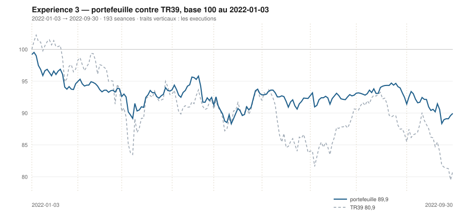

| | |
|---|---|
| Dotation initiale | 10 000,00 € au 2022-01-03 |
| Titres au 2022-09-30 | 4 686,81 € |
| Espèces | 4 307,14 € |
| **Total** | **8 993,95 €** |
| Base 100 | **89,94** |
| TR39, même base | 80,85 |
| Écart depuis janvier | **+9,09 pt** |

### Toutes les positions depuis le début de l'expérience

> Closes comme ouvertes. Une position encore ouverte laisse les deux dernières colonnes vides. Aucune séance postérieure au 2022-09-30 n'entre dans ce tableau.

| Société | Prix d'achat | Date d'achat | Prix de vente | Date de vente |
|---|---|---|---|---|
| `CAP.PA` Capgemini | 194,20 € | 2022-01-03 | 182,68 € | 2022-04-01 |
| `DSY.PA` Dassault Systèmes | 50,13 € | 2022-01-03 | 41,05 € | 2022-02-01 |
| `KER.PA` Kering | 558,25 € | 2022-03-01 | 454,99 € | 2022-06-01 |
| `HO.PA` Thales | 103,16 € | 2022-04-01 |  |  |
| `MT.AS` ArcelorMittal | 26,84 € | 2022-04-01 | 28,27 € | 2022-06-01 |
| `TTE.PA` TotalEnergies | 43,30 € | 2022-06-01 |  |  |
| `BN.PA` Danone | 46,97 € | 2022-08-01 | 45,67 € | 2022-09-01 |
| `RMS.PA` Hermès International | 1 226,95 € | 2022-09-01 |  |  |

*8 positions depuis le début, dont 3 encore ouvertes : les deux dernières colonnes restent vides.*

## 5. L'étude chartiste au 2022-08-31

> Notes rédigées sans aucune séance postérieure au 2022-08-31, par l'agent `chartiste`. Cinq lignes au plus par société, **chacune sous la figure de décision qui la justifie** — celle que la règle a lue ce jour-là, portant les cinq critères, les vetos et le verdict.

### 1. `HO.PA` — Thales

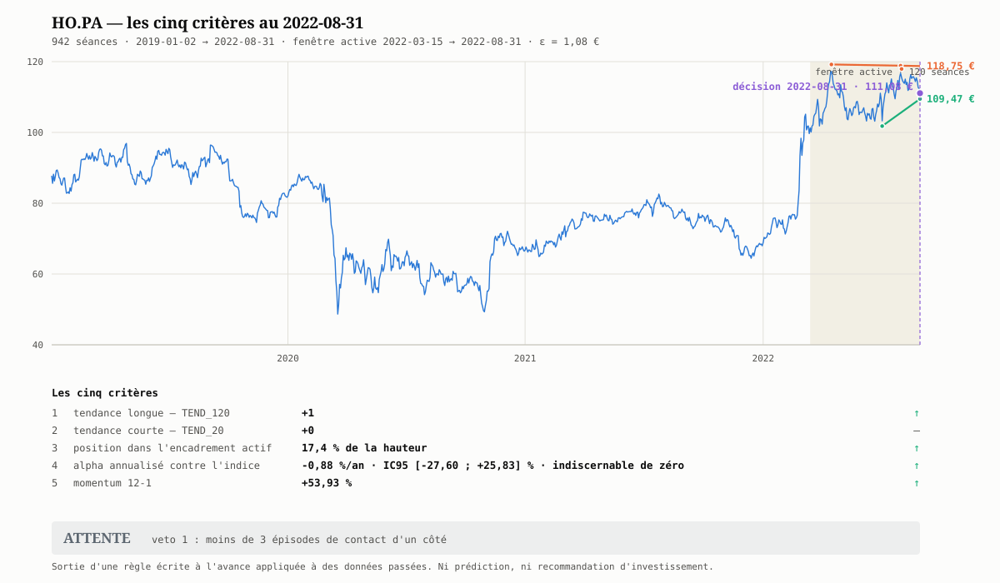

- Canal 109,47 – 118,75 €, clôture à 111,08 € à 17,4 %.
- Support +0,187 contre résistance −0,005 €/séance, τ de 48 séances.
- Deux contacts de chaque côté : veto 1 — les épisodes se sont raréfiés depuis juillet.
- **Momentum +53,9 %, le plus fort de la date** ; alpha −0,9 %/an.

### 2. `TTE.PA` — TotalEnergies

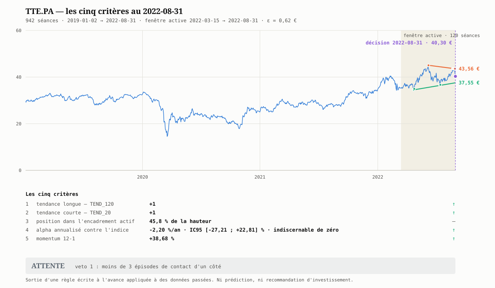

- Canal 37,55 – 43,56 €, clôture à 40,30 € à 45,8 % : le milieu.
- Pentes +0,033 et −0,025 €/séance, τ de 103 séances.
- Deux contacts de chaque côté : veto 1.
- Momentum +38,7 %, alpha −2,2 %/an.

### 3. `ENGI.PA` — Engie

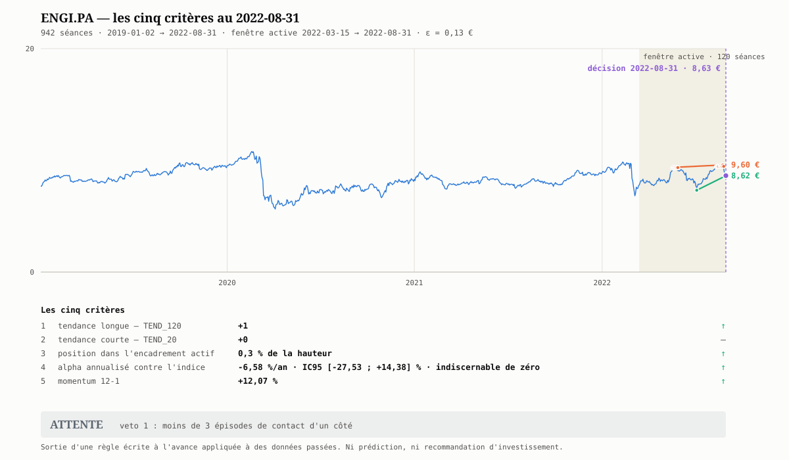

- Canal 8,62 – 9,60 €, clôture à 8,63 € à **0,3 % de la hauteur** : sur le support, au centime près.
- Support +0,033 contre résistance +0,003 €/séance, τ de 33 séances.
- Deux contacts de chaque côté : veto 1.
- Momentum +12,1 %, alpha −6,6 %/an. Meilleur score de la date, et sous veto.

### 4. `RMS.PA` — Hermès International

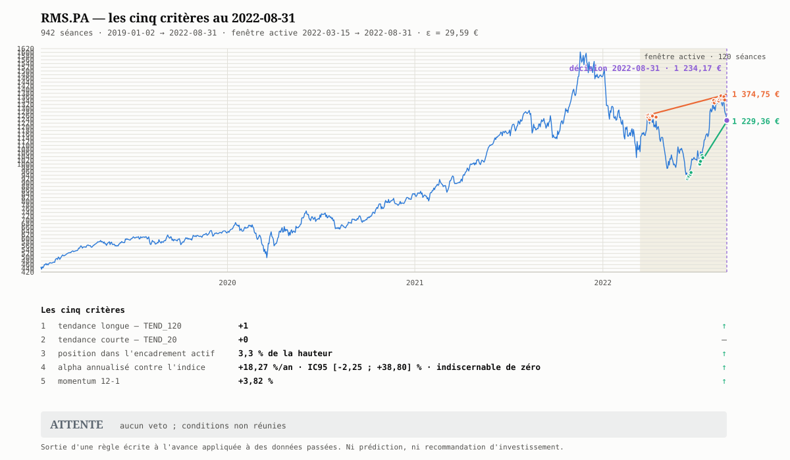

- Canal 1 229,36 – 1 374,75 €, clôture à 1 234,17 € à 3,3 % : sur le support.
- Support +6,203 contre résistance +1,033 €/séance : convergence rapide, τ de 28 séances.
- Trois contacts bas, quatre hauts : **aucun veto**.
- Momentum +3,8 %, alpha +18,3 %/an, IC95 de −2,2 à +38,8 — le plus proche de la significativité.

### 5. `MC.PA` — LVMH

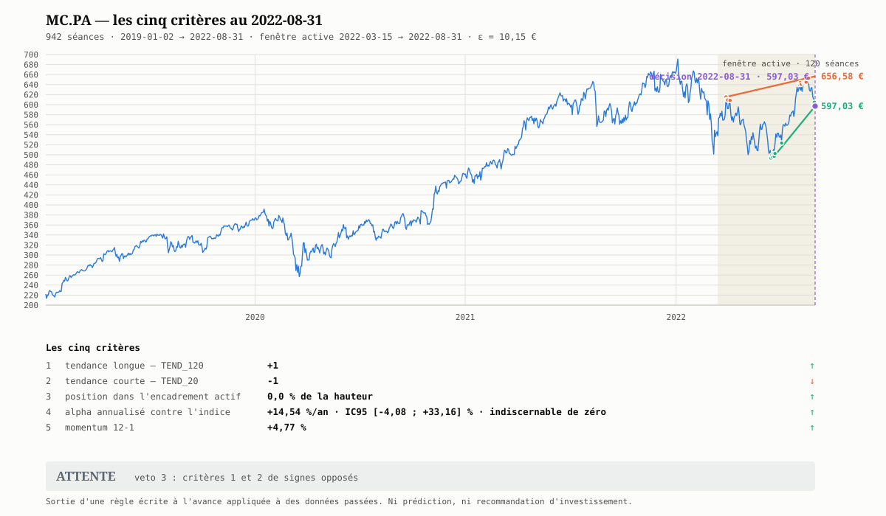

- Canal 597,03 – 656,58 €, clôture à 597,03 € : **exactement sur le support**, 0,0 %.
- Support +1,995 contre résistance +0,377 €/séance, τ de 37 séances.
- Trois contacts bas, quatre hauts : figure lisible ; seul le veto 3 mord.
- Momentum +4,8 %, alpha +14,5 %/an.

### 6. `RNO.PA` — Renault

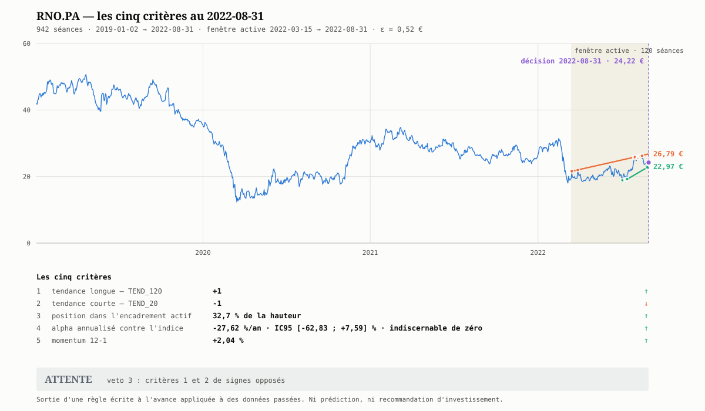

- Canal 22,97 – 26,79 €, clôture à 24,22 € à 32,7 % de la hauteur — sous le seuil bas.
- Pentes +0,115 et +0,044 €/séance, τ de 54 séances.
- Trois contacts bas, quatre hauts : figure lisible ; veto 3.
- Momentum +2,0 %, alpha −27,6 %/an, IC95 de −62,8 à +7,6.

### 7. `DG.PA` — Vinci

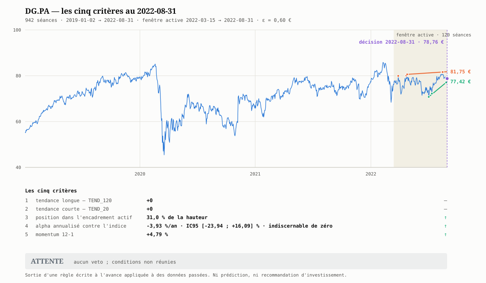

- Canal 77,42 – 81,75 €, clôture à 78,76 € à 31,0 %.
- Pentes +0,162 et +0,013 €/séance, τ de 29 séances.
- Trois contacts de chaque côté : **aucun veto**.
- Momentum +4,8 %, alpha −3,9 %/an ; la tendance longue est retombée à zéro.

### 8. `RI.PA` — Pernod Ricard

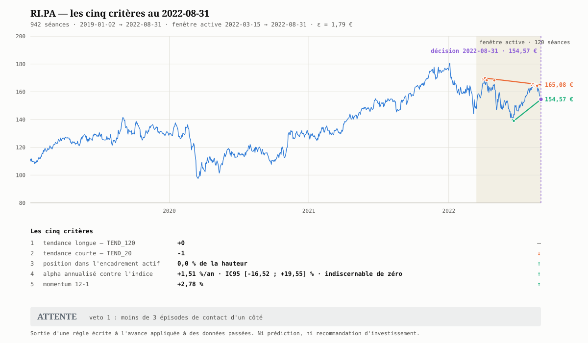

- Canal 154,57 – 165,08 €, clôture à 154,57 € : **exactement sur le support**, 0,0 %.
- Support +0,310 contre résistance −0,046 €/séance, τ de 30 séances.
- Deux contacts en support : veto 1.
- Momentum +2,8 %, alpha +1,5 %/an.

### 9. `SAF.PA` — Safran

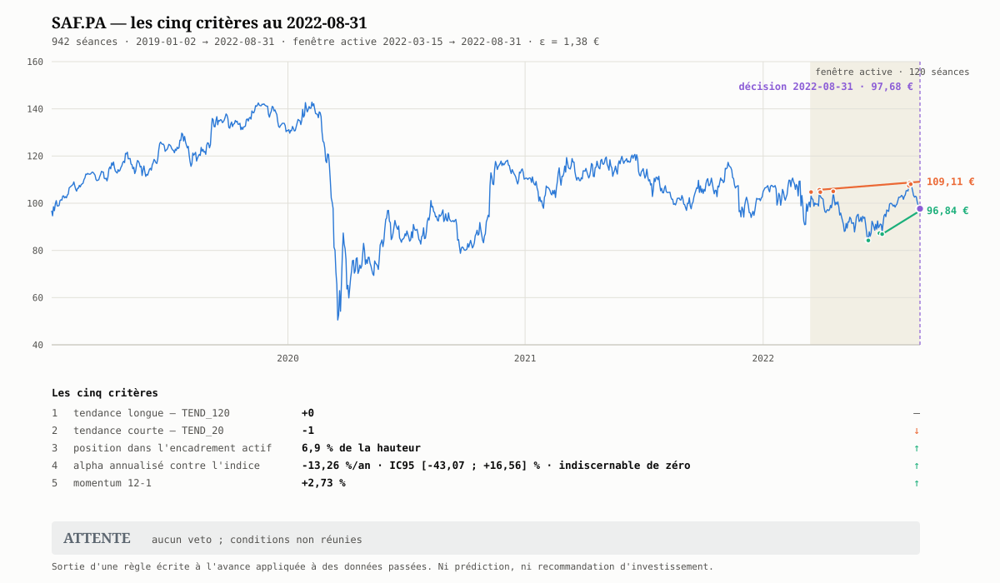

- Canal 96,84 – 109,11 €, clôture à 97,68 € à 6,9 % : contre le support.
- Pentes +0,242 et +0,032 €/séance, τ de 58 séances.
- Quatre contacts de chaque côté : **aucun veto**, figure bien étayée.
- Momentum +2,7 %, alpha −13,3 %/an.

### 10. `BN.PA` — Danone

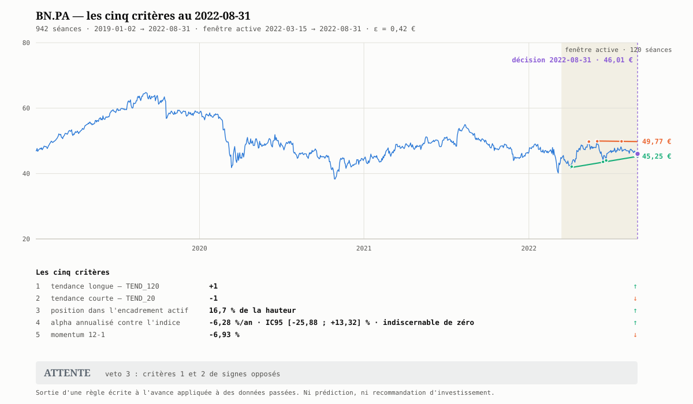

- Canal 45,25 – 49,77 €, clôture à 46,01 € à 16,7 % de la hauteur.
- Pentes +0,033 et −0,003 €/séance, τ de 127 séances.
- Quatre contacts bas, trois hauts : figure lisible ; seul le veto 3 mord.
- Momentum −6,9 %, alpha −6,3 %/an.

### 11. `SAN.PA` — Sanofi

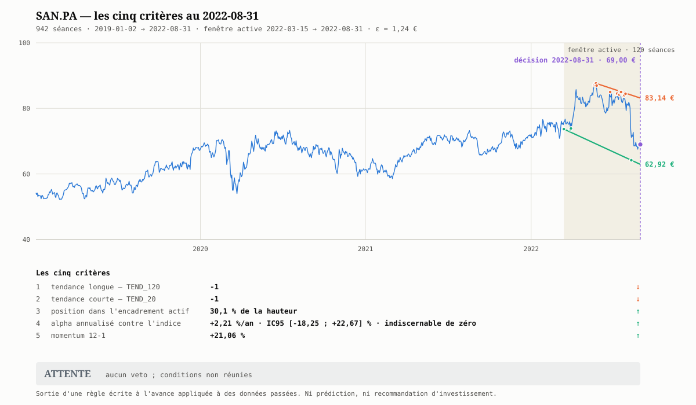

- Canal 62,92 – 83,14 €, large de 20,2 %, clôture à 69,00 € à 30,1 %.
- Pentes −0,090 et −0,065 €/séance : ouverture, τ infini.
- Trois contacts bas, cinq hauts : **aucun veto**.
- Momentum +21,1 %, alpha +2,2 %/an. La chute d'août a fait passer la tendance longue à −1.

### 12. `ALO.PA` — Alstom

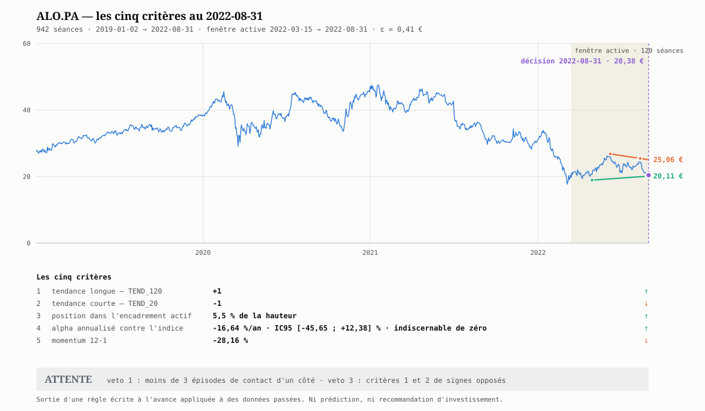

- Canal 20,11 – 25,06 €, clôture à 20,38 € à 5,5 % de la hauteur.
- Pentes +0,014 et −0,029 €/séance, τ de 115 séances.
- Deux contacts de chaque côté : veto 1 ; tendances opposées : veto 3.
- Momentum −28,2 %, alpha −16,6 %/an.

### 13. `ORA.PA` — Orange

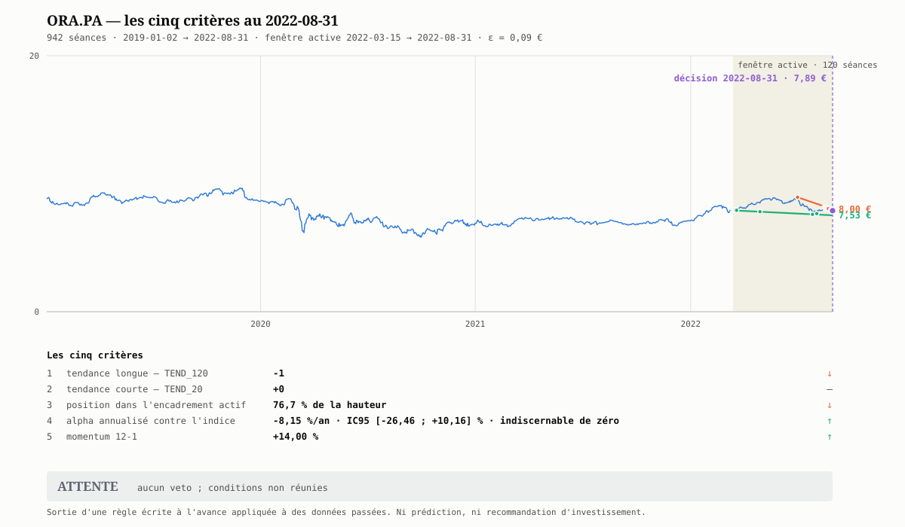

- Canal 7,53 – 8,00 €, d'une largeur de 0,5 %, clôture à 7,89 € à 76,7 %.
- Pentes −0,003 et −0,022 €/séance, τ de 25 séances.
- Quatre contacts bas, trois hauts : **aucun veto**.
- Momentum +14,0 %, alpha −8,2 %/an.

### 14. `STMPA.PA` — STMicroelectronics

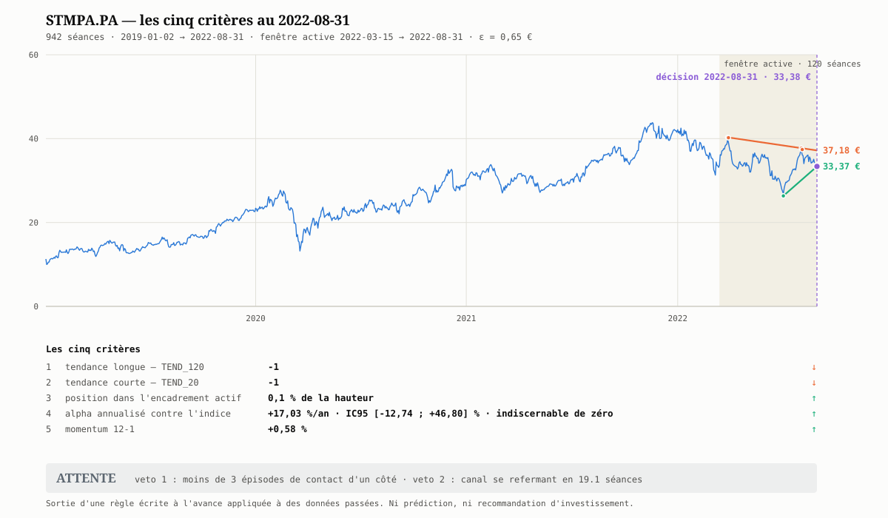

- Canal 33,37 – 37,18 €, clôture à 33,38 € à **0,1 %** : sur le support au centime.
- Support +0,172 contre résistance −0,029 €/séance : **le canal se referme en 19 séances**, veto 2.
- Deux contacts de chaque côté : veto 1 également.
- **Momentum +0,6 %**, quasi nul ; alpha +17,0 %/an.

### 15. `OR.PA` — L'Oréal

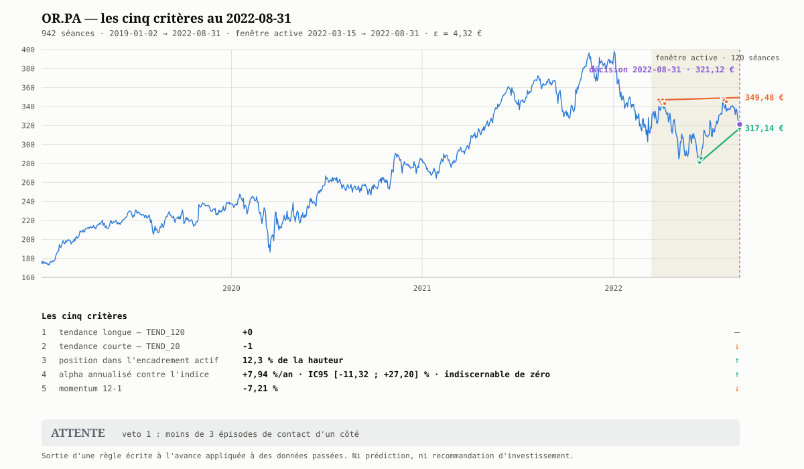

- Canal 317,14 – 349,48 €, clôture à 321,12 € à 12,3 % de la hauteur.
- Support +0,668 contre résistance +0,023 €/séance, τ de 50 séances.
- Deux contacts en support : veto 1.
- Momentum −7,2 %, alpha +7,9 %/an.

### 16. `STLAP.PA` — Stellantis

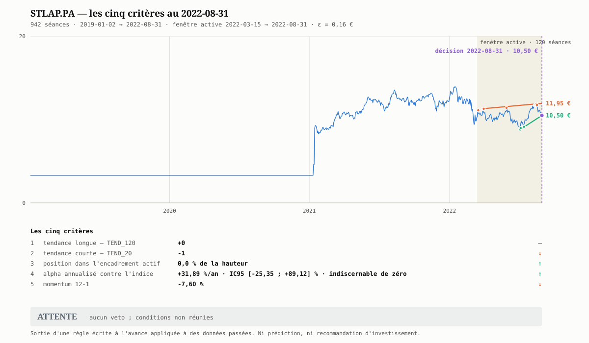

- Canal 10,50 – 11,95 €, clôture à 10,50 € : **exactement sur le support**, 0,0 %.
- Pentes +0,042 et +0,006 €/séance, τ de 40 séances.
- Trois contacts bas, quatre hauts : **aucun veto**.
- Momentum −7,6 %, alpha +31,9 %/an sur un IC95 de 115 points.

### 17. `WLN.PA` — Worldline

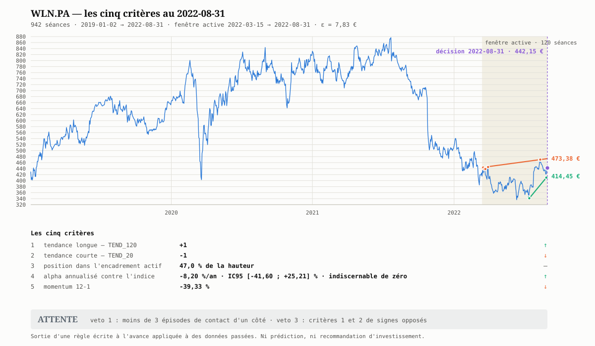

- Canal 414,45 – 473,38 €, clôture à 442,15 € à 47,0 % : le milieu.
- Support +2,217 contre résistance +0,249 €/séance, τ de 30 séances.
- Deux contacts en support : veto 1 ; tendances opposées : veto 3.
- **Momentum −39,3 %, le plus faible de la date** ; alpha −8,2 %/an. La tendance longue est repassée à +1.

### 18. `CA.PA` — Carrefour

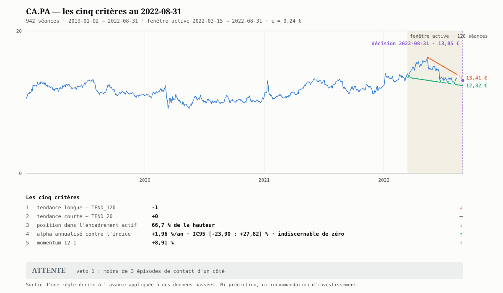

- Canal 12,32 – 13,41 €, clôture à 13,05 € à 66,7 % — juste au-dessus du seuil haut.
- Pentes −0,010 et −0,038 €/séance, τ de 38 séances.
- Quatre contacts bas, deux hauts : veto 1.
- Momentum +8,9 %, alpha +2,0 %/an.

### 19. `CS.PA` — AXA

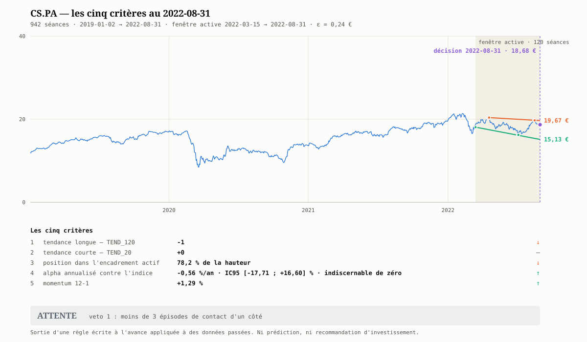

- Canal 15,13 – 19,67 €, clôture à 18,68 € à 78,2 % de la hauteur.
- Pentes −0,025 et −0,008 €/séance : ouverture, τ infini.
- Deux contacts de chaque côté : veto 1.
- Momentum +1,3 %, alpha −0,6 %/an.

### 20. `GLE.PA` — Société Générale

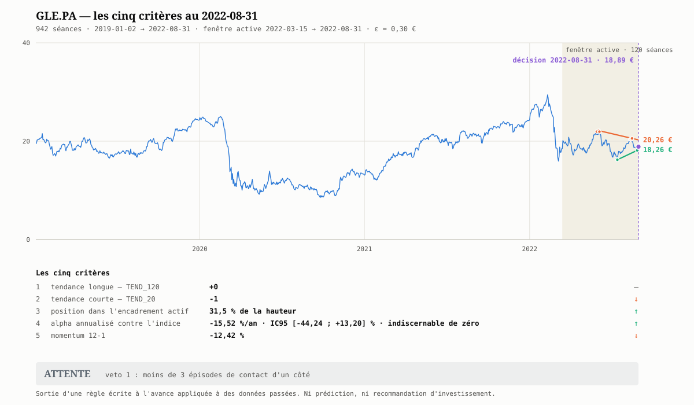

- Canal 18,26 – 20,26 €, clôture à 18,89 € à 31,5 %.
- Pentes +0,061 et −0,030 €/séance, τ de 22 séances.
- Deux contacts en support : veto 1.
- Momentum −12,4 %, alpha −15,5 %/an.

### 21. `KER.PA` — Kering

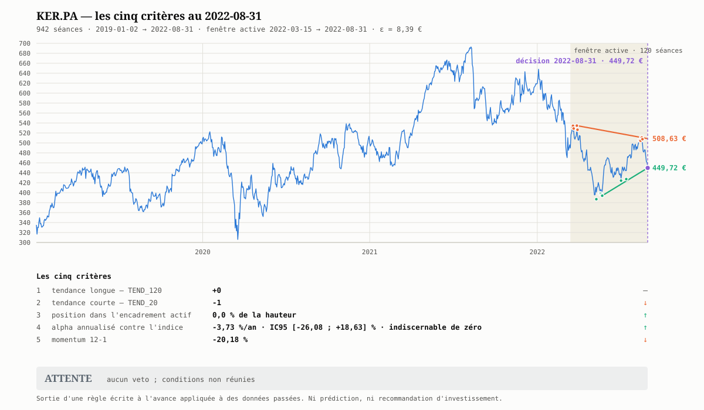

- Canal 449,72 – 508,63 €, clôture à 449,72 € : **exactement sur le support**, 0,0 %.
- Support +0,796 contre résistance −0,239 €/séance, τ de 57 séances.
- Cinq contacts bas, trois hauts : **aucun veto** — la figure la mieux étayée de la date.
- Momentum −20,2 %, alpha −3,7 %/an.

### 22. `CAP.PA` — Capgemini

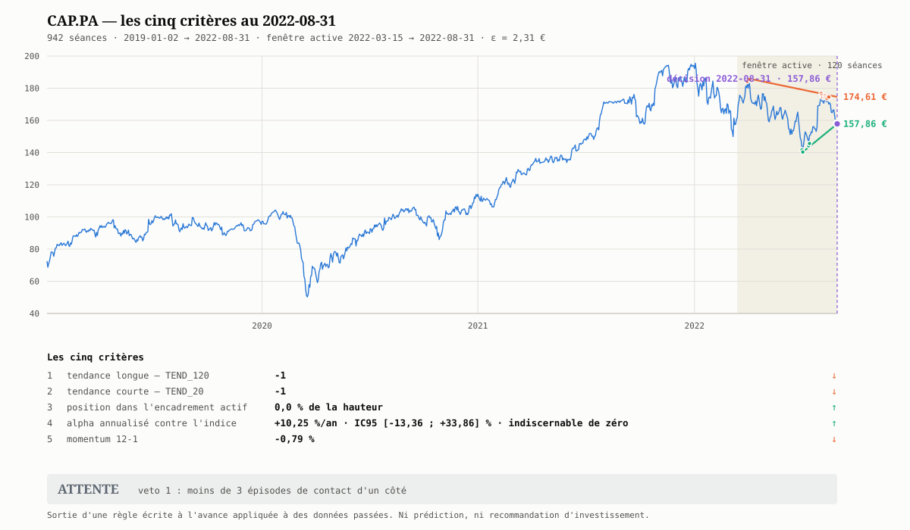

- Canal 157,86 – 174,61 €, clôture à 157,86 € : **sur le support**, 0,0 %.
- Support +0,427 contre résistance −0,108 €/séance, τ de 31 séances.
- Deux contacts en résistance : veto 1.
- **Momentum −0,8 %**, quasi nul ; alpha +10,2 %/an.

### 23. `AI.PA` — Air Liquide

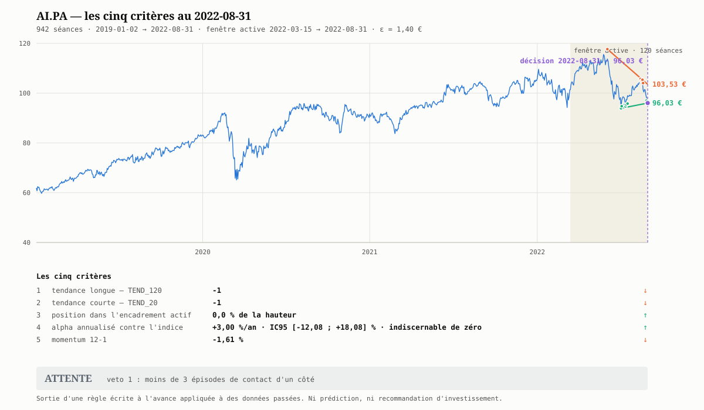

- Canal 96,03 – 103,53 €, clôture à 96,03 € : **sur le support**, 0,0 % de la hauteur.
- Support +0,052 contre résistance −0,228 €/séance, τ de 27 séances.
- Deux contacts en résistance : veto 1.
- **Momentum −1,6 %** ; alpha +3,0 %/an.

### 24. `BNP.PA` — BNP Paribas

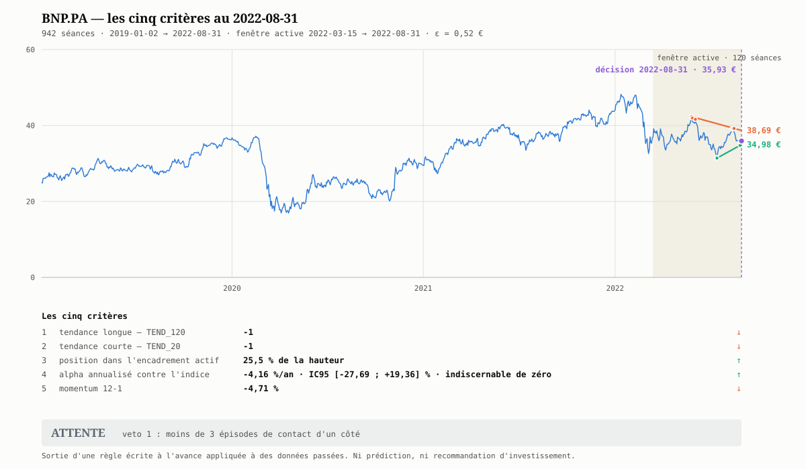

- Canal 34,98 – 38,69 €, clôture à 35,93 € à 25,5 % de la hauteur.
- Pentes +0,108 et −0,054 €/séance, τ de 23 séances.
- Deux contacts en support : veto 1.
- Momentum −4,7 %, alpha −4,2 %/an.

### 25. `PUB.PA` — Publicis

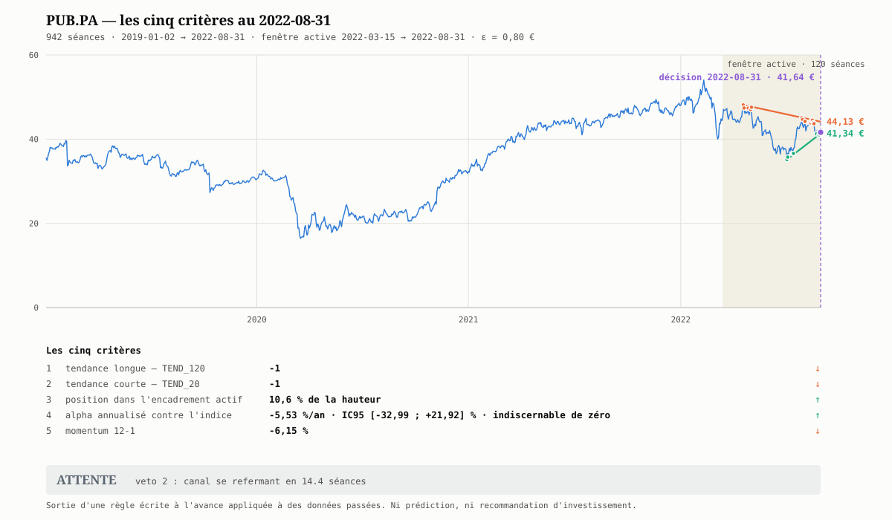

- Canal 41,34 – 44,13 €, clôture à 41,64 € à 10,6 %.
- Support +0,151 contre résistance −0,043 €/séance : **le canal se referme en 14 séances**, veto 2.
- Quatre contacts bas, six hauts : la figure est très bien étayée, et elle disparaît avant la décision suivante.
- Momentum −6,2 %, alpha −5,5 %/an.

### 26. `EL.PA` — EssilorLuxottica

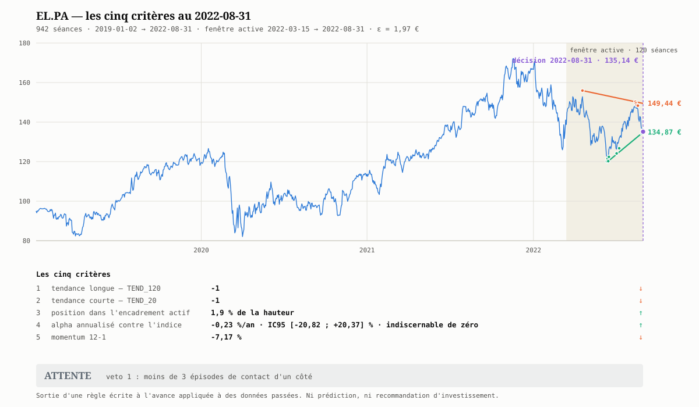

- Canal 134,87 – 149,44 €, clôture à 135,14 € à 1,9 % : sur le support.
- Pentes +0,271 et −0,069 €/séance, τ de 43 séances.
- Deux contacts en résistance : veto 1.
- Momentum −7,2 %, alpha −0,2 %/an.

### 27. `VIE.PA` — Veolia

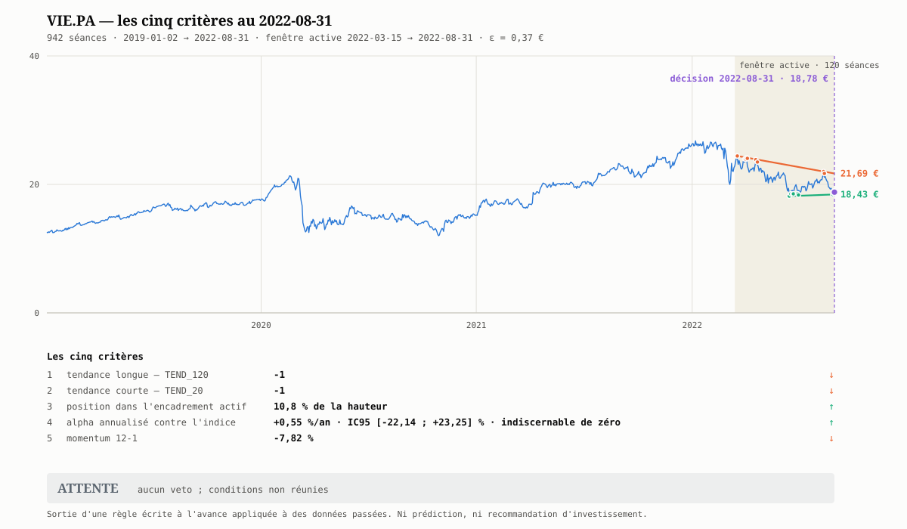

- Canal 18,43 – 21,69 €, clôture à 18,78 € à 10,8 % de la hauteur.
- Pentes +0,005 et −0,024 €/séance, τ de 115 séances.
- Trois contacts bas, quatre hauts : **aucun veto**.
- Momentum −7,8 %, alpha +0,6 %/an.

### 28. `AIR.PA` — Airbus

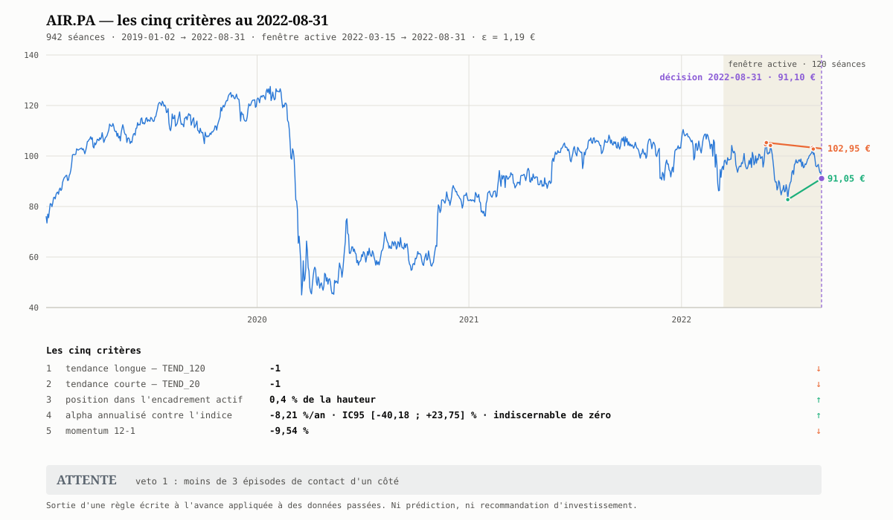

- Canal 91,05 – 102,95 €, clôture à 91,10 € à 0,4 % : sur le support.
- Pentes +0,203 et −0,035 €/séance, τ de 50 séances.
- Deux contacts en support : veto 1.
- Momentum −9,5 %, alpha −8,2 %/an.

### 29. `EN.PA` — Bouygues

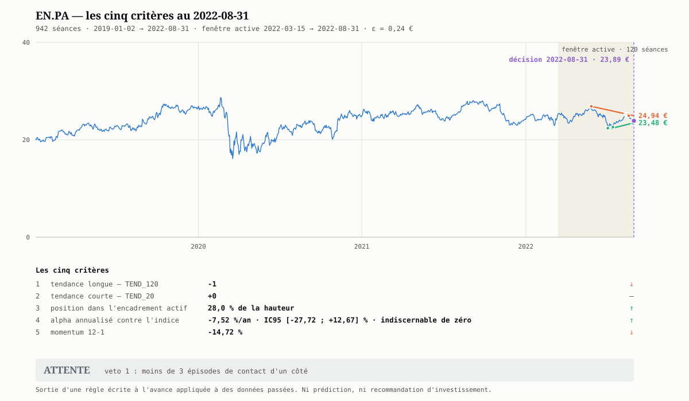

- Canal 23,48 – 24,94 €, large de 1,5 %, clôture à 23,89 € à 28,0 % de la hauteur.
- Pentes +0,033 et −0,029 €/séance, τ de 24 séances.
- Deux contacts en résistance : veto 1.
- Momentum −14,7 %, alpha −7,5 %/an.

### 30. `SU.PA` — Schneider Electric

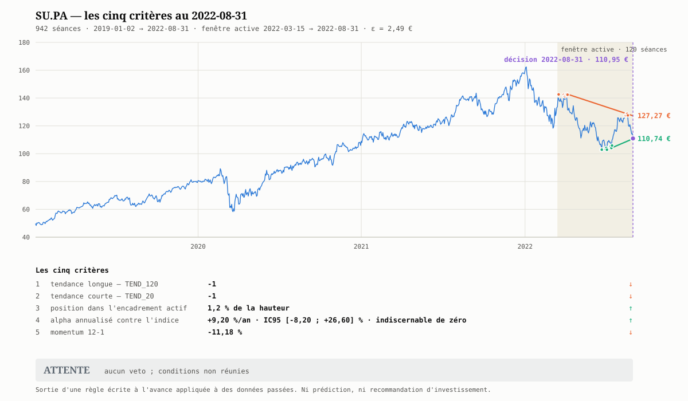

- Canal 110,74 – 127,27 €, clôture à 110,95 € à 1,2 % : sur le support.
- Pentes +0,195 et −0,150 €/séance, τ de 48 séances.
- Quatre contacts bas, trois hauts : **aucun veto**.
- Momentum −11,2 %, alpha +9,2 %/an.

### 31. `TEP.PA` — Teleperformance

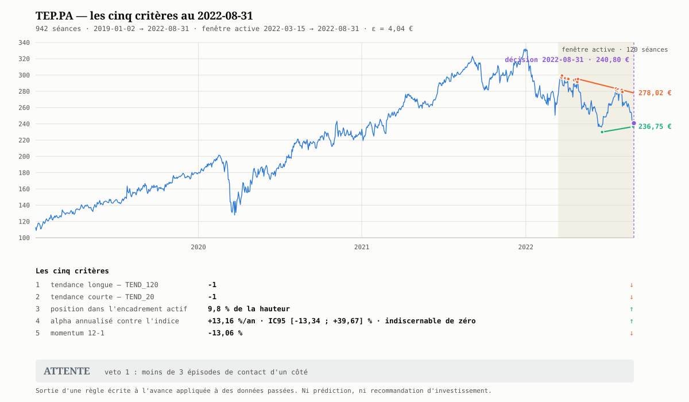

- Canal 236,75 – 278,02 €, clôture à 240,80 € à 9,8 % de la hauteur.
- Pentes +0,136 et −0,194 €/séance, τ de 125 séances.
- Deux contacts en support contre six en résistance : veto 1.
- Momentum −13,1 %, alpha +13,2 %/an.

### 32. `DSY.PA` — Dassault Systèmes

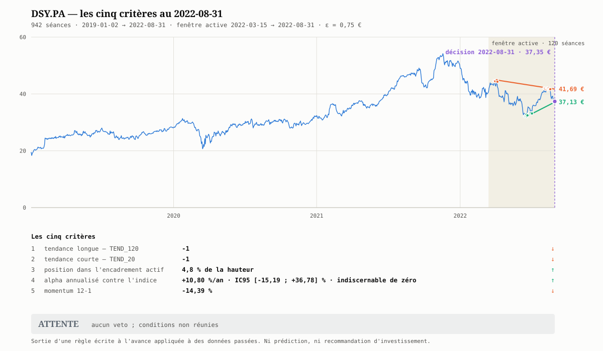

- Canal 37,13 – 41,69 €, clôture à 37,35 € à 4,8 % : contre le support.
- Pentes +0,100 et −0,031 €/séance, τ de 35 séances.
- Trois contacts de chaque côté : **aucun veto**.
- Momentum −14,4 %, alpha +10,8 %/an.

### 33. `LR.PA` — Legrand

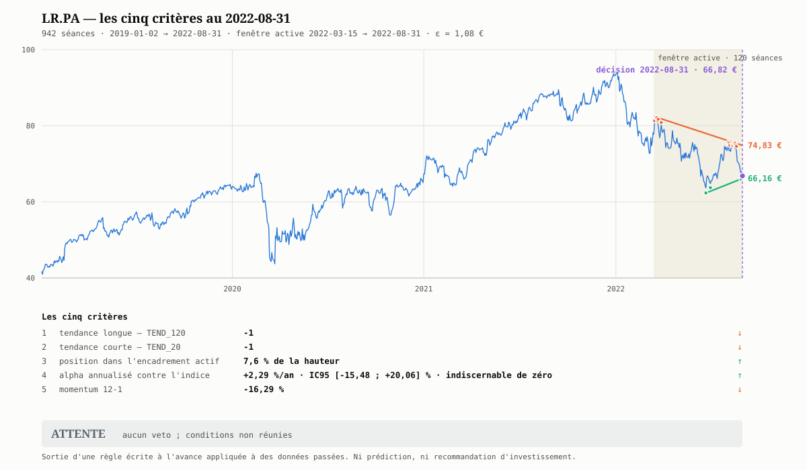

- Canal 66,16 – 74,83 €, clôture à 66,82 € à 7,6 % : contre le support.
- Pentes +0,078 et −0,064 €/séance, τ de 61 séances.
- Trois contacts bas, quatre hauts : **aucun veto**.
- Momentum −16,3 %, alpha +2,3 %/an.

### 34. `ACA.PA` — Crédit Agricole

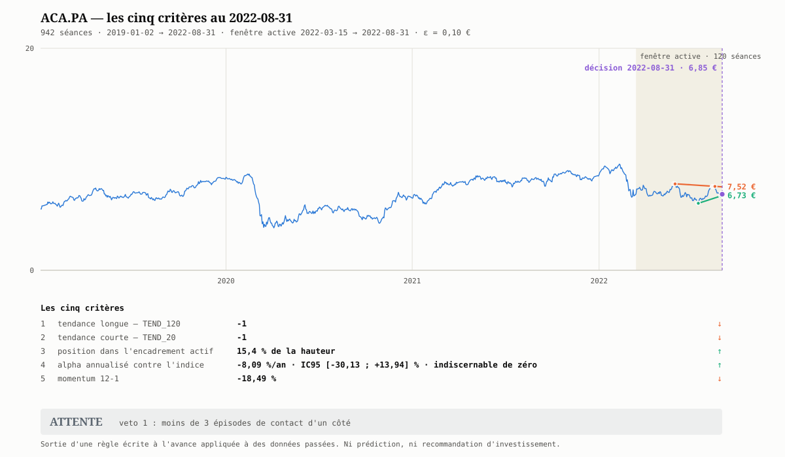

- Canal 6,73 – 7,52 €, large de 0,8 %, clôture à 6,85 € à 15,4 %.
- Pentes +0,021 et −0,004 €/séance, τ de 31 séances.
- Deux contacts de chaque côté : veto 1.
- Momentum −18,5 %, alpha −8,1 %/an.

### 35. `ML.PA` — Michelin

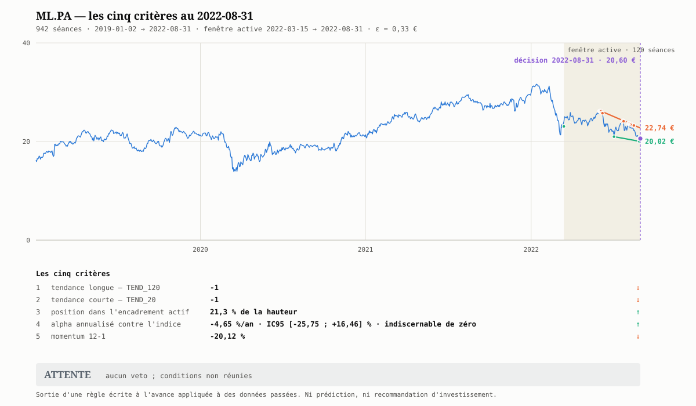

- Canal 20,02 – 22,74 €, clôture à 20,60 € à 21,3 % de la hauteur.
- Pentes −0,024 et −0,056 €/séance, τ de 85 séances.
- Trois contacts de chaque côté : **aucun veto**.
- Momentum −20,1 %, alpha −4,7 %/an.

### 36. `SGO.PA` — Saint-Gobain

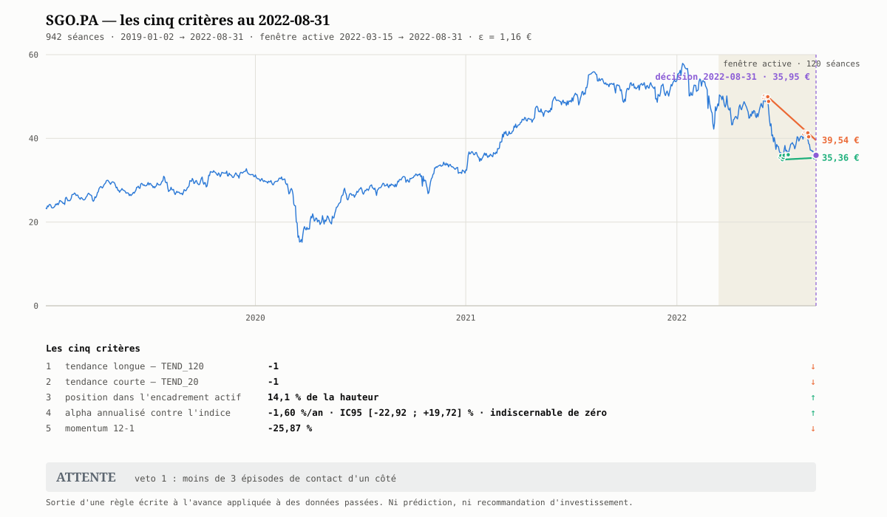

- Canal 35,36 – 39,54 €, clôture à 35,95 € à 14,1 %.
- Pentes +0,011 et −0,176 €/séance, τ de 22 séances.
- Deux contacts en résistance : veto 1.
- Momentum −25,9 %, alpha −1,6 %/an.

### 37. `ERF.PA` — Eurofins Scientific

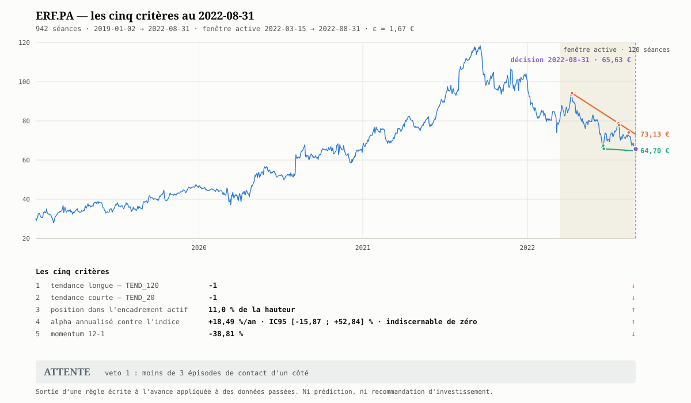

- Canal 64,70 – 73,13 €, clôture à 65,63 € à 11,0 % de la hauteur.
- Pentes −0,021 et −0,210 €/séance, τ de 44 séances.
- Deux contacts en support : veto 1.
- Momentum −38,8 %, **alpha +18,5 %/an**, le plus élevé de la date après Hermès.

### 38. `MT.AS` — ArcelorMittal

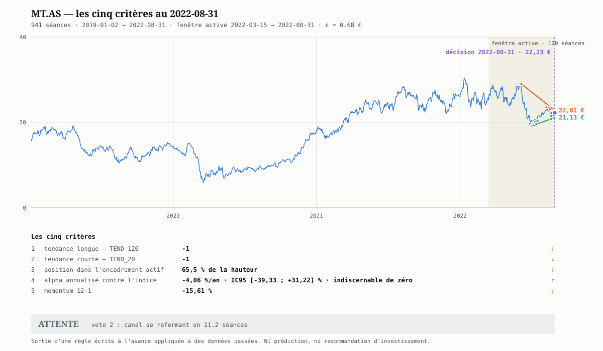

- Canal 21,13 – 22,81 €, large de 1,7 %, clôture à 22,23 € à 65,5 % — juste au-dessus du seuil haut.
- Support +0,047 contre résistance −0,103 €/séance : **le canal se referme en 11 séances**, veto 2.
- Quatre contacts de chaque côté : figure très étayée, géométrie périmée.
- Momentum −15,6 %, alpha −4,1 %/an. Score −6, le plus bas de la date.

### 39. `VIV.PA` — Vivendi

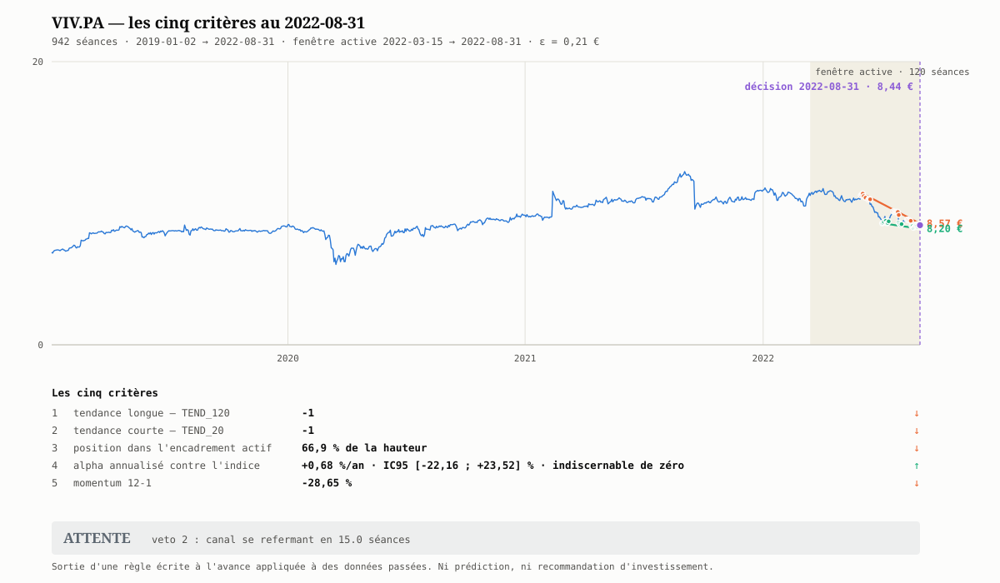

- Canal 8,20 – 8,57 €, d'une largeur de 0,4 % — la figure la plus mince de la date —, clôture à 8,44 € à 66,9 %.
- Pentes −0,009 et −0,034 €/séance : **le canal se referme en 15 séances**, veto 2.
- Trois contacts bas, cinq hauts : la figure est étayée, mais trente-sept centimes de haut ne mesurent rien.
- Momentum −28,6 %, alpha +0,7 %/an. Score −6.

## 6. Le classement au 2022-08-31

> De la valeur la plus intéressante à détenir à celle qu'il faut fuir. La colonne **τ** donne la date de péremption du canal en séances, la colonne **Vetos** les numéros déclenchés. Une valeur sous veto ne peut pas être achetée.

| Rang | Valeur | `s1` | `s2` | `s3` | `s4` | `s5` | Score | Position | Momentum | τ | Vetos |
|---|---|---|---|---|---|---|---|---|---|---|---|
| 1 | `HO.PA` Thales | +2 | +0 | +1 | +2 | +0 | **+5** | 17,4 % | +53,9 % | 48,4 | 1 |
| 2 | `TTE.PA` TotalEnergies | +2 | +1 | +0 | +2 | +0 | **+5** | 45,8 % | +38,7 % | 102,9 | 1 |
| 3 | `ENGI.PA` Engie | +2 | +0 | +1 | +2 | +0 | **+5** | 0,3 % | +12,1 % | 33,2 | 1 |
| 4 | `RMS.PA` Hermès International | +2 | +0 | +1 | +1 | +0 | **+4** | 3,3 % | +3,8 % | 28,1 | — |
| 5 | `MC.PA` LVMH | +2 | -1 | +1 | +1 | +0 | **+3** | 0,0 % | +4,8 % | 36,8 | 3 |
| 6 | `RNO.PA` Renault | +2 | -1 | +1 | +1 | +0 | **+3** | 32,7 % | +2,0 % | 54,1 | 3 |
| 7 | `DG.PA` Vinci | +0 | +0 | +1 | +1 | +0 | **+2** | 31,0 % | +4,8 % | 29,0 | — |
| 8 | `RI.PA` Pernod Ricard | +0 | -1 | +1 | +1 | +0 | **+1** | 0,0 % | +2,8 % | 29,5 | 1 |
| 9 | `SAF.PA` Safran | +0 | -1 | +1 | +1 | +0 | **+1** | 6,9 % | +2,7 % | 58,3 | — |
| 10 | `BN.PA` Danone | +2 | -1 | +1 | -1 | +0 | **+1** | 16,7 % | -6,9 % | 126,9 | 3 |
| 11 | `SAN.PA` Sanofi | -2 | -1 | +1 | +2 | +0 | **+0** | 30,1 % | +21,1 % | ∞ | — |
| 12 | `ALO.PA` Alstom | +2 | -1 | +1 | -2 | +0 | **+0** | 5,5 % | -28,2 % | 115,0 | 1 3 |
| 13 | `ORA.PA` Orange | -2 | +0 | -1 | +2 | +0 | **-1** | 76,7 % | +14,0 % | 25,0 | — |
| 14 | `STMPA.PA` STMicroelectronics | -2 | -1 | +1 | +1 | +0 | **-1** | 0,1 % | +0,6 % | 19,1 | 1 2 |
| 15 | `OR.PA` L'Oréal | +0 | -1 | +1 | -1 | +0 | **-1** | 12,3 % | -7,2 % | 50,1 | 1 |
| 16 | `STLAP.PA` Stellantis | +0 | -1 | +1 | -1 | +0 | **-1** | 0,0 % | -7,6 % | 39,9 | — |
| 17 | `WLN.PA` Worldline | +2 | -1 | +0 | -2 | +0 | **-1** | 47,0 % | -39,3 % | 29,9 | 1 3 |
| 18 | `CA.PA` Carrefour | -2 | +0 | -1 | +1 | +0 | **-2** | 66,7 % | +8,9 % | 38,1 | 1 |
| 19 | `CS.PA` AXA | -2 | +0 | -1 | +1 | +0 | **-2** | 78,2 % | +1,3 % | ∞ | 1 |
| 20 | `GLE.PA` Société Générale | +0 | -1 | +1 | -2 | +0 | **-2** | 31,5 % | -12,4 % | 21,8 | 1 |
| 21 | `KER.PA` Kering | +0 | -1 | +1 | -2 | +0 | **-2** | 0,0 % | -20,2 % | 56,9 | — |
| 22 | `CAP.PA` Capgemini | -2 | -1 | +1 | -1 | +0 | **-3** | 0,0 % | -0,8 % | 31,3 | 1 |
| 23 | `AI.PA` Air Liquide | -2 | -1 | +1 | -1 | +0 | **-3** | 0,0 % | -1,6 % | 26,8 | 1 |
| 24 | `BNP.PA` BNP Paribas | -2 | -1 | +1 | -1 | +0 | **-3** | 25,5 % | -4,7 % | 23,0 | 1 |
| 25 | `PUB.PA` Publicis | -2 | -1 | +1 | -1 | +0 | **-3** | 10,6 % | -6,2 % | 14,4 | 2 |
| 26 | `EL.PA` EssilorLuxottica | -2 | -1 | +1 | -1 | +0 | **-3** | 1,9 % | -7,2 % | 42,9 | 1 |
| 27 | `VIE.PA` Veolia | -2 | -1 | +1 | -1 | +0 | **-3** | 10,8 % | -7,8 % | 115,0 | — |
| 28 | `AIR.PA` Airbus | -2 | -1 | +1 | -1 | +0 | **-3** | 0,4 % | -9,5 % | 50,0 | 1 |
| 29 | `EN.PA` Bouygues | -2 | +0 | +1 | -2 | +0 | **-3** | 28,0 % | -14,7 % | 23,7 | 1 |
| 30 | `SU.PA` Schneider Electric | -2 | -1 | +1 | -2 | +0 | **-4** | 1,2 % | -11,2 % | 47,9 | — |
| 31 | `TEP.PA` Teleperformance | -2 | -1 | +1 | -2 | +0 | **-4** | 9,8 % | -13,1 % | 125,1 | 1 |
| 32 | `DSY.PA` Dassault Systèmes | -2 | -1 | +1 | -2 | +0 | **-4** | 4,8 % | -14,4 % | 34,9 | — |
| 33 | `LR.PA` Legrand | -2 | -1 | +1 | -2 | +0 | **-4** | 7,6 % | -16,3 % | 61,0 | — |
| 34 | `ACA.PA` Crédit Agricole | -2 | -1 | +1 | -2 | +0 | **-4** | 15,4 % | -18,5 % | 30,9 | 1 |
| 35 | `ML.PA` Michelin | -2 | -1 | +1 | -2 | +0 | **-4** | 21,3 % | -20,1 % | 84,8 | — |
| 36 | `SGO.PA` Saint-Gobain | -2 | -1 | +1 | -2 | +0 | **-4** | 14,1 % | -25,9 % | 22,3 | 1 |
| 37 | `ERF.PA` Eurofins Scientific | -2 | -1 | +1 | -2 | +0 | **-4** | 11,0 % | -38,8 % | 44,4 | 1 |
| 38 | `MT.AS` ArcelorMittal | -2 | -1 | -1 | -2 | +0 | **-6** | 65,5 % | -15,6 % | 11,2 | 2 |
| 39 | `VIV.PA` Vivendi | -2 | -1 | -1 | -2 | +0 | **-6** | 66,9 % | -28,6 % | 15,0 | 2 |

## 7. Les ordres exécutés au 2022-09-01

> À l'**ouverture** de la séance, jamais à la clôture du 2022-08-31.

| Sens | Valeur | Quantité | Prix d'exécution | Brut | Frais | Motif |
|---|---|---|---|---|---|---|
| **Vente** | `BN.PA` Danone | 39 | 45,67 € | 1 781,27 € | 2,05 € | rang 10 au-dela de 7 |
| **Achat** | `RMS.PA` Hermès International | 1 | 1 226,95 € | 1 226,95 € | 5,09 € | rang 4, score +4, aucun veto |

## 8. La lecture du mois

Sur le mois, la meilleure contribution vient de `BN.PA` (Danone) pour **-15,03 €**, la moins bonne de `HO.PA` (Thales) pour **-118,99 €**. Les 2 ordres du mois ont coûté **7,14 €** de frais, soit 0,071 % de la dotation initiale. Le portefeuille termine le mois **devant TR39** de 4,06 point. Sur les 45 thèses du mois précédent qui ont pu être tranchées, **28 sont confirmées** — 62,2 %.

## 9. Les thèses écrites au 2022-08-31

> Elles seront dépouillées à la prochaine date de décision, dans le fichier du mois suivant. Elles sont engendrées mécaniquement par les règles du [protocole](../README.md#le-registre-des-thèses-réfutables) — aucune n'est rédigée à la main.

| Valeur | Thèse | Énoncé, à dépouiller au mois suivant |
|---|---|---|
| `ACA.PA` | Canal | clôture entre 7,19 € et 7,43 € au 2022-09-30 |
| `ACA.PA` | Reflexive | RETOURNEMENT : écart contre TR39 au-dessous de −3,03 pt (0,5 σ̂), au 2022-09-30 |
| `AI.PA` | Canal | clôture entre 97,17 € et 98,52 € au 2022-09-30 |
| `AIR.PA` | Canal | clôture entre 95,51 € et 102,18 € au 2022-09-30 |
| `ALO.PA` | Canal | clôture entre 20,41 € et 24,41 € au 2022-09-30 |
| `ALO.PA` | Reflexive | AUCUNE SEQUENCE : écart contre TR39 dans ± 9,14 pt (σ̂), au 2022-09-30 |
| `BN.PA` | Canal | clôture entre 45,97 € et 49,71 € au 2022-09-30 |
| `BNP.PA` | Canal | clôture entre 37,35 € et 37,50 € au 2022-09-30 |
| `BNP.PA` | Reflexive | RETOURNEMENT : écart contre TR39 au-dessous de −3,73 pt (0,5 σ̂), au 2022-09-30 |
| `CA.PA` | Canal | clôture entre 12,10 € et 12,57 € au 2022-09-30 |
| `CAP.PA` | Canal | clôture entre 167,26 € et 172,24 € au 2022-09-30 |
| `CS.PA` | Canal | clôture entre 14,58 € et 19,50 € au 2022-09-30 |
| `CS.PA` | Reflexive | AUCUNE SEQUENCE : écart contre TR39 dans ± 5,74 pt (σ̂), au 2022-09-30 |
| `DG.PA` | Canal | clôture entre 80,98 € et 82,03 € au 2022-09-30 |
| `DSY.PA` | Canal | clôture entre 39,33 € et 41,02 € au 2022-09-30 |
| `EL.PA` | Canal | clôture entre 140,83 € et 147,92 € au 2022-09-30 |
| `EN.PA` | Canal | clôture entre 24,20 € et 24,31 € au 2022-09-30 |
| `ENGI.PA` | Canal | clôture entre 9,33 € et 9,67 € au 2022-09-30 |
| `ERF.PA` | Canal | clôture entre 64,25 € et 68,50 € au 2022-09-30 |
| `ERF.PA` | Reflexive | RETOURNEMENT : écart contre TR39 au-dessous de −4,78 pt (0,5 σ̂), au 2022-09-30 |
| `GLE.PA` | Canal | encadrement ferme avant le 2022-09-30 : les bornes prolongees se croisent, la thèse est inconfirmable à l'écriture |
| `GLE.PA` | Reflexive | AUCUNE SEQUENCE : écart contre TR39 dans ± 8,72 pt (σ̂), au 2022-09-30 |
| `HO.PA` | Canal | clôture entre 113,59 € et 118,65 € au 2022-09-30 |
| `KER.PA` | Canal | clôture entre 467,23 € et 503,37 € au 2022-09-30 |
| `LR.PA` | Canal | clôture entre 67,87 € et 73,42 € au 2022-09-30 |
| `MC.PA` | Canal | clôture entre 640,93 € et 664,87 € au 2022-09-30 |
| `ML.PA` | Canal | clôture entre 19,50 € et 21,51 € au 2022-09-30 |
| `MT.AS` | Canal | encadrement ferme avant le 2022-09-30 : les bornes prolongees se croisent, la thèse est inconfirmable à l'écriture |
| `MT.AS` | Reflexive | AUCUNE SEQUENCE : écart contre TR39 dans ± 9,84 pt (σ̂), au 2022-09-30 |
| `OR.PA` | Canal | clôture entre 331,83 € et 349,99 € au 2022-09-30 |
| `ORA.PA` | Canal | clôture entre 7,46 € et 7,51 € au 2022-09-30 |
| `PUB.PA` | Canal | encadrement ferme avant le 2022-09-30 : les bornes prolongees se croisent, la thèse est inconfirmable à l'écriture |
| `RI.PA` | Canal | clôture entre 161,40 € et 164,06 € au 2022-09-30 |
| `RMS.PA` | Canal | clôture entre 1 365,83 € et 1 397,47 € au 2022-09-30 |
| `RNO.PA` | Canal | clôture entre 25,49 € et 27,76 € au 2022-09-30 |
| `SAF.PA` | Canal | clôture entre 102,17 € et 109,81 € au 2022-09-30 |
| `SAN.PA` | Canal | clôture entre 60,93 € et 81,71 € au 2022-09-30 |
| `SGO.PA` | Canal | clôture entre 35,60 € et 35,67 € au 2022-09-30 |
| `STLAP.PA` | Canal | clôture entre 11,43 € et 12,08 € au 2022-09-30 |
| `STMPA.PA` | Canal | encadrement ferme avant le 2022-09-30 : les bornes prolongees se croisent, la thèse est inconfirmable à l'écriture |
| `SU.PA` | Canal | clôture entre 115,03 € et 123,96 € au 2022-09-30 |
| `TEP.PA` | Canal | clôture entre 239,74 € et 273,75 € au 2022-09-30 |
| `TEP.PA` | Reflexive | RETOURNEMENT : écart contre TR39 au-dessous de −2,99 pt (0,5 σ̂), au 2022-09-30 |
| `TTE.PA` | Canal | clôture entre 38,28 € et 43,01 € au 2022-09-30 |
| `VIE.PA` | Canal | clôture entre 18,54 € et 21,17 € au 2022-09-30 |
| `VIV.PA` | Canal | encadrement ferme avant le 2022-09-30 : les bornes prolongees se croisent, la thèse est inconfirmable à l'écriture |
| `VIV.PA` | Reflexive | AUCUNE SEQUENCE : écart contre TR39 dans ± 6,71 pt (σ̂), au 2022-09-30 |
| `WLN.PA` | Canal | clôture entre 463,22 € et 478,85 € au 2022-09-30 |
| `WLN.PA` | Reflexive | AUCUNE SEQUENCE : écart contre TR39 dans ± 10,89 pt (σ̂), au 2022-09-30 |

---

[← Août](2022-08.md) · [Protocole](../README.md) · [Octobre →](2022-10.md)
