# Octobre 2022

> Journal de l'[expérience 3](../README.md) · **décision au 2022-09-30** · **exécution au 2022-10-03**
> Portefeuille au 2022-10-31 : **9 575,55 €** (base 95,76) · TR39 88,42 · alpha du mois **-2,89 pt** · depuis janvier **+7,34 pt**

---

## 1. Les actualités du mois précédent

**Septembre 2022.** Un mois de capitulation. L'inflation américaine d'août,
publiée le 13 septembre, déçoit à nouveau et provoque la pire séance de Wall
Street depuis 2020. La Réserve fédérale relève ses taux de trois quarts de point
pour la troisième fois consécutive, la BCE de trois quarts de point également —
sa plus forte hausse depuis la création de l'euro.

Au Royaume-Uni, le budget non financé du gouvernement Truss provoque une crise
obligataire et l'intervention d'urgence de la Banque d'Angleterre. Nord Stream
est saboté le 26 septembre. Le CAC 40 touche son plus bas de l'année à la fin
du mois.

## 2. Le dépouillement des thèses écrites au 2022-08-31

> Piste **S4**. Ces énoncés ont été écrits le mois dernier, avant de connaître ce mois-ci. Aucun n'a été retouché ; le verdict est calculé.

| Valeur | Thèse | Énoncé | Constaté | Verdict |
|---|---|---|---|---|
| `ACA.PA` | Canal | clôture entre 7,19 € et 7,43 € au 2022-09-30 | 6,24 € | démentie |
| `ACA.PA` | Reflexive | RETOURNEMENT : écart contre TR39 au-dessous de −3,03 pt (0,5 σ̂), au 2022-09-30 | -2,20 pt | *zone morte* |
| `AI.PA` | Canal | clôture entre 97,17 € et 98,52 € au 2022-09-30 | 90,17 € | démentie |
| `AIR.PA` | Canal | clôture entre 95,51 € et 102,18 € au 2022-09-30 | 82,72 € | démentie |
| `ALO.PA` | Canal | clôture entre 20,41 € et 24,41 € au 2022-09-30 | 16,60 € | démentie |
| `ALO.PA` | Reflexive | AUCUNE SEQUENCE : écart contre TR39 dans ± 9,14 pt (σ̂), au 2022-09-30 | -11,77 pt | démentie |
| `BN.PA` | Canal | clôture entre 45,97 € et 49,71 € au 2022-09-30 | 42,55 € | démentie |
| `BNP.PA` | Canal | clôture entre 37,35 € et 37,50 € au 2022-09-30 | 33,70 € | démentie |
| `BNP.PA` | Reflexive | RETOURNEMENT : écart contre TR39 au-dessous de −3,73 pt (0,5 σ̂), au 2022-09-30 | 0,59 pt | *zone morte* |
| `CA.PA` | Canal | clôture entre 12,10 € et 12,57 € au 2022-09-30 | 11,14 € | démentie |
| `CAP.PA` | Canal | clôture entre 167,26 € et 172,24 € au 2022-09-30 | 151,01 € | démentie |
| `CS.PA` | Canal | clôture entre 14,58 € et 19,50 € au 2022-09-30 | 17,84 € | **confirmée** |
| `CS.PA` | Reflexive | AUCUNE SEQUENCE : écart contre TR39 dans ± 5,74 pt (σ̂), au 2022-09-30 | 2,32 pt | **confirmée** |
| `DG.PA` | Canal | clôture entre 80,98 € et 82,03 € au 2022-09-30 | 71,01 € | démentie |
| `DSY.PA` | Canal | clôture entre 39,33 € et 41,02 € au 2022-09-30 | 34,60 € | démentie |
| `EL.PA` | Canal | clôture entre 140,83 € et 147,92 € au 2022-09-30 | 127,09 € | démentie |
| `EN.PA` | Canal | clôture entre 24,20 € et 24,31 € au 2022-09-30 | 21,89 € | démentie |
| `ENGI.PA` | Canal | clôture entre 9,33 € et 9,67 € au 2022-09-30 | 8,61 € | démentie |
| `ERF.PA` | Canal | clôture entre 64,25 € et 68,50 € au 2022-09-30 | 58,05 € | démentie |
| `ERF.PA` | Reflexive | RETOURNEMENT : écart contre TR39 au-dessous de −4,78 pt (0,5 σ̂), au 2022-09-30 | -4,76 pt | *zone morte* |
| `GLE.PA` | Canal | encadrement ferme avant le 2022-09-30 : les bornes prolongees se croisent, la thèse est inconfirmable à l'écriture | 17,46 € | *inconfirmable à l'écriture* |
| `GLE.PA` | Reflexive | AUCUNE SEQUENCE : écart contre TR39 dans ± 8,72 pt (σ̂), au 2022-09-30 | -0,75 pt | **confirmée** |
| `HO.PA` | Canal | clôture entre 113,59 € et 118,65 € au 2022-09-30 | 104,47 € | démentie |
| `KER.PA` | Canal | clôture entre 467,23 € et 503,37 € au 2022-09-30 | 409,98 € | démentie |
| `LR.PA` | Canal | clôture entre 67,87 € et 73,42 € au 2022-09-30 | 61,62 € | démentie |
| `MC.PA` | Canal | clôture entre 640,93 € et 664,87 € au 2022-09-30 | 562,82 € | démentie |
| `ML.PA` | Canal | clôture entre 19,50 € et 21,51 € au 2022-09-30 | 19,62 € | **confirmée** |
| `MT.AS` | Canal | encadrement ferme avant le 2022-09-30 : les bornes prolongees se croisent, la thèse est inconfirmable à l'écriture | 19,34 € | *inconfirmable à l'écriture* |
| `MT.AS` | Reflexive | AUCUNE SEQUENCE : écart contre TR39 dans ± 9,84 pt (σ̂), au 2022-09-30 | -6,22 pt | **confirmée** |
| `OR.PA` | Canal | clôture entre 331,83 € et 349,99 € au 2022-09-30 | 308,96 € | démentie |
| `ORA.PA` | Canal | clôture entre 7,46 € et 7,51 € au 2022-09-30 | 7,23 € | démentie |
| `PUB.PA` | Canal | encadrement ferme avant le 2022-09-30 : les bornes prolongees se croisent, la thèse est inconfirmable à l'écriture | 41,76 € | *inconfirmable à l'écriture* |
| `RI.PA` | Canal | clôture entre 161,40 € et 164,06 € au 2022-09-30 | 159,03 € | démentie |
| `RMS.PA` | Canal | clôture entre 1 365,83 € et 1 397,47 € au 2022-09-30 | 1 171,14 € | démentie |
| `RNO.PA` | Canal | clôture entre 25,49 € et 27,76 € au 2022-09-30 | 23,68 € | démentie |
| `SAF.PA` | Canal | clôture entre 102,17 € et 109,81 € au 2022-09-30 | 90,12 € | démentie |
| `SAN.PA` | Canal | clôture entre 60,93 € et 81,71 € au 2022-09-30 | 65,83 € | **confirmée** |
| `SGO.PA` | Canal | clôture entre 35,60 € et 35,67 € au 2022-09-30 | 33,01 € | démentie |
| `STLAP.PA` | Canal | clôture entre 11,43 € et 12,08 € au 2022-09-30 | 9,66 € | démentie |
| `STMPA.PA` | Canal | encadrement ferme avant le 2022-09-30 : les bornes prolongees se croisent, la thèse est inconfirmable à l'écriture | 31,03 € | *inconfirmable à l'écriture* |
| `SU.PA` | Canal | clôture entre 115,03 € et 123,96 € au 2022-09-30 | 109,23 € | démentie |
| `TEP.PA` | Canal | clôture entre 239,74 € et 273,75 € au 2022-09-30 | 220,98 € | démentie |
| `TEP.PA` | Reflexive | RETOURNEMENT : écart contre TR39 au-dessous de −2,99 pt (0,5 σ̂), au 2022-09-30 | -1,44 pt | *zone morte* |
| `TTE.PA` | Canal | clôture entre 38,28 € et 43,01 € au 2022-09-30 | 38,93 € | **confirmée** |
| `VIE.PA` | Canal | clôture entre 18,54 € et 21,17 € au 2022-09-30 | 16,62 € | démentie |
| `VIV.PA` | Canal | encadrement ferme avant le 2022-09-30 : les bornes prolongees se croisent, la thèse est inconfirmable à l'écriture | 7,44 € | *inconfirmable à l'écriture* |
| `VIV.PA` | Reflexive | AUCUNE SEQUENCE : écart contre TR39 dans ± 6,71 pt (σ̂), au 2022-09-30 | -5,16 pt | **confirmée** |
| `WLN.PA` | Canal | clôture entre 463,22 € et 478,85 € au 2022-09-30 | 420,35 € | démentie |
| `WLN.PA` | Reflexive | AUCUNE SEQUENCE : écart contre TR39 dans ± 10,89 pt (σ̂), au 2022-09-30 | 1,86 pt | **confirmée** |

## 3. L'exposition héritée au 2022-09-30

| Valeur | Achetée le | Prix d'achat | +/− value | Alpha du mois | Alpha global |
|---|---|---|---|---|---|
| `HO.PA` Thales | 2022-04-01 | 103,16 € | **+1,27 %** | +0,84 pt | +14,32 pt |
| `RMS.PA` Hermès International | 2022-09-01 | 1 226,95 € | **-4,55 %** | +0,88 pt *(partiel)* | +0,88 pt |
| `TTE.PA` TotalEnergies | 2022-06-01 | 43,30 € | **-10,10 %** | +3,39 pt | +2,04 pt |

## 4. Le portefeuille depuis le 2022-01-03

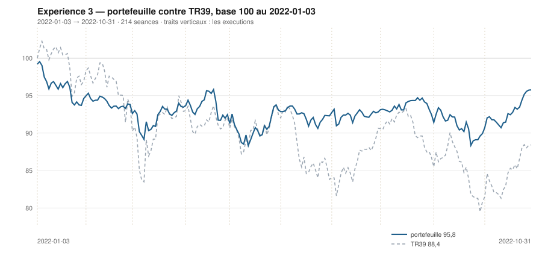

| | |
|---|---|
| Dotation initiale | 10 000,00 € au 2022-01-03 |
| Titres au 2022-10-31 | 5 268,40 € |
| Espèces | 4 307,14 € |
| **Total** | **9 575,55 €** |
| Base 100 | **95,76** |
| TR39, même base | 88,42 |
| Écart depuis janvier | **+7,34 pt** |

### Toutes les positions depuis le début de l'expérience

> Closes comme ouvertes. Une position encore ouverte laisse les deux dernières colonnes vides. Aucune séance postérieure au 2022-10-31 n'entre dans ce tableau.

| Société | Prix d'achat | Date d'achat | Prix de vente | Date de vente |
|---|---|---|---|---|
| `CAP.PA` Capgemini | 194,20 € | 2022-01-03 | 182,68 € | 2022-04-01 |
| `DSY.PA` Dassault Systèmes | 50,13 € | 2022-01-03 | 41,05 € | 2022-02-01 |
| `KER.PA` Kering | 558,25 € | 2022-03-01 | 454,99 € | 2022-06-01 |
| `HO.PA` Thales | 103,16 € | 2022-04-01 |  |  |
| `MT.AS` ArcelorMittal | 26,84 € | 2022-04-01 | 28,27 € | 2022-06-01 |
| `TTE.PA` TotalEnergies | 43,30 € | 2022-06-01 |  |  |
| `BN.PA` Danone | 46,97 € | 2022-08-01 | 45,67 € | 2022-09-01 |
| `RMS.PA` Hermès International | 1 226,95 € | 2022-09-01 |  |  |

*8 positions depuis le début, dont 3 encore ouvertes : les deux dernières colonnes restent vides.*

## 5. L'étude chartiste au 2022-09-30

> Notes rédigées sans aucune séance postérieure au 2022-09-30, par l'agent `chartiste`. Cinq lignes au plus par société, **chacune sous la figure de décision qui la justifie** — celle que la règle a lue ce jour-là, portant les cinq critères, les vetos et le verdict.

### 1. `ENGI.PA` — Engie

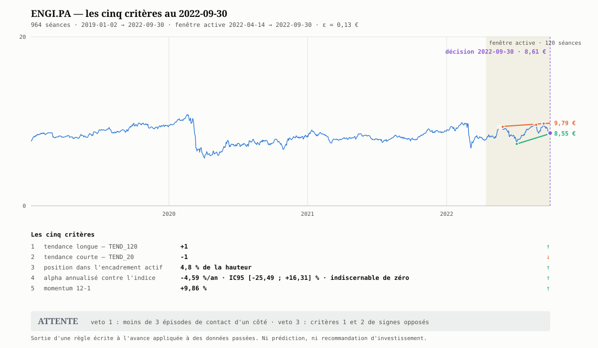

- Canal 8,55 – 9,79 €, clôture à 8,61 € à 4,8 % de la hauteur : sur le support.
- Support +0,020 contre résistance +0,004 €/séance, τ de 81 séances.
- Deux contacts en support : veto 1 ; tendances opposées : veto 3.
- Momentum +9,9 %, à un dixième du seuil de dix ; alpha −4,6 %/an. Meilleur score de la date.

### 2. `RMS.PA` — Hermès International

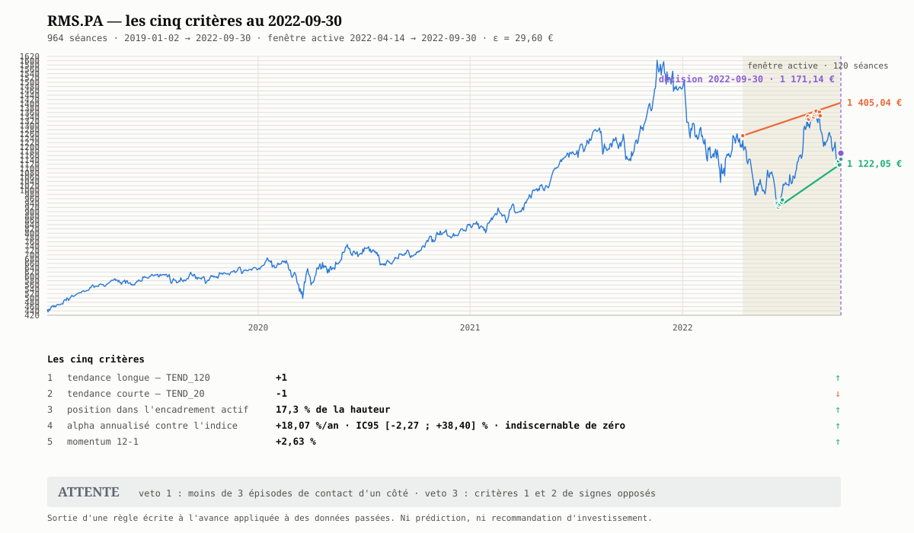

- Canal 1 122,05 – 1 405,04 €, d'une largeur de 283 €, clôture à 1 171,14 € à 17,3 % de la hauteur.
- Pentes +2,639 et +1,285 €/séance, τ de 209 séances.
- Deux contacts en support : veto 1 ; tendances opposées : veto 3.
- Momentum +2,6 %, **alpha +18,1 %/an**, le plus élevé de la date, IC95 de −2,3 à +38,4.

### 3. `MC.PA` — LVMH

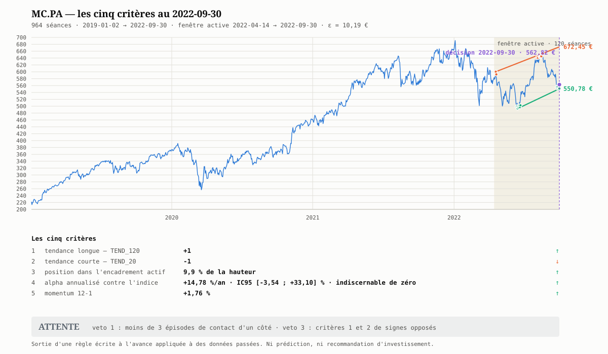

- Canal 550,78 – 672,45 €, large de 122 €, clôture à 562,82 € à 9,9 %.
- Pentes +0,756 et +0,622 €/séance, τ de 902 séances.
- Deux contacts en support : veto 1 ; tendances opposées : veto 3.
- Momentum +1,8 %, alpha +14,8 %/an.

### 4. `HO.PA` — Thales

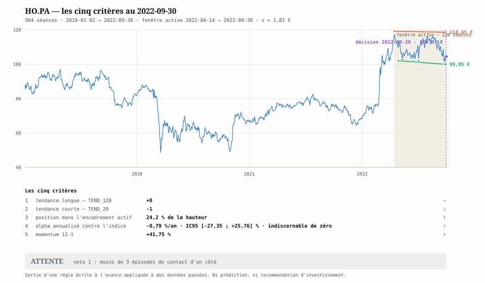

- Canal 99,95 – 118,65 €, clôture à 104,47 € à 24,2 %.
- Pentes −0,019 et −0,005 €/séance : ouverture imperceptible, τ infini.
- Cinq contacts bas, deux hauts : veto 1.
- **Momentum +41,8 %, le plus fort de la date** ; alpha −0,8 %/an.

### 5. `TTE.PA` — TotalEnergies

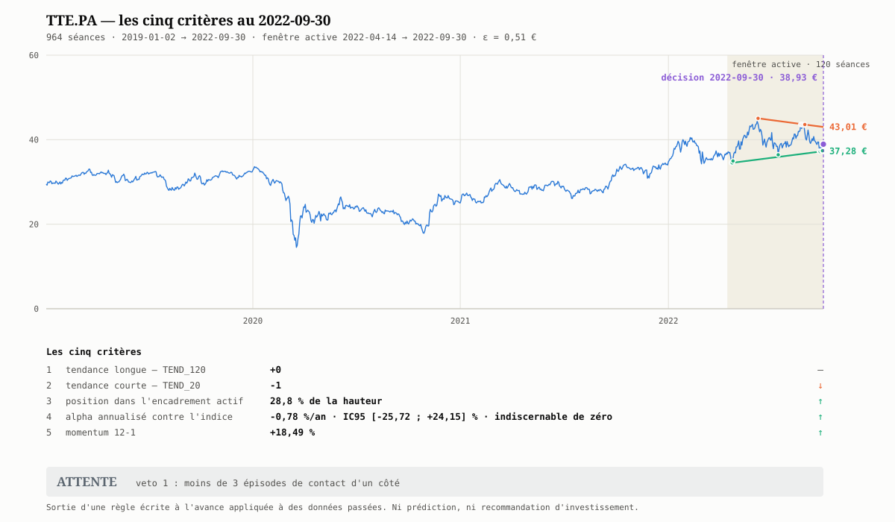

- Canal 37,28 – 43,01 €, clôture à 38,93 € à 28,8 % de la hauteur.
- Pentes +0,024 et −0,025 €/séance, τ de 116 séances.
- Deux contacts en résistance : veto 1.
- Momentum +18,5 %, alpha −0,8 %/an.

### 6. `DG.PA` — Vinci

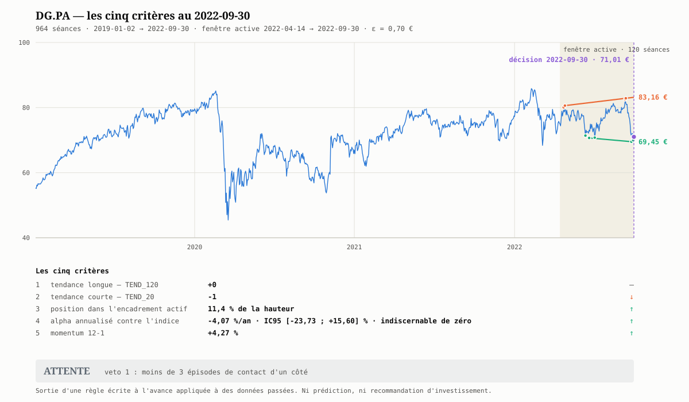

- Canal 69,45 – 83,16 €, clôture à 71,01 € à 11,4 % de la hauteur.
- Support −0,017 contre résistance +0,023 €/séance : ouverture, τ infini.
- Cinq contacts bas, deux hauts : veto 1.
- Momentum +4,3 %, alpha −4,1 %/an.

### 7. `CS.PA` — AXA

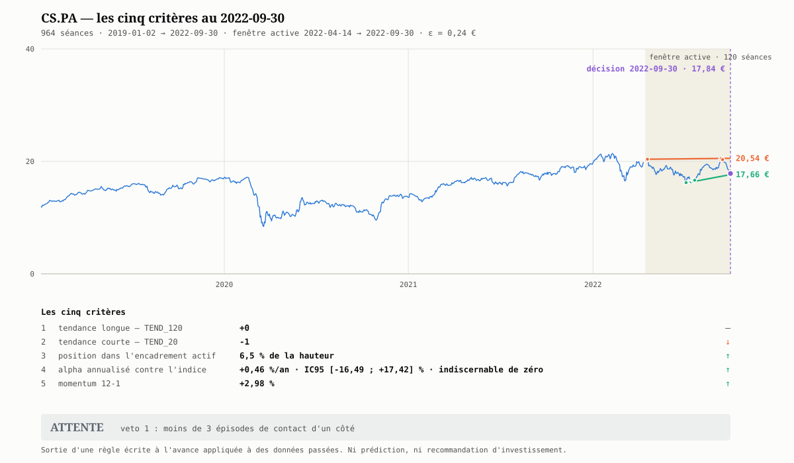

- Canal 17,66 – 20,54 €, clôture à 17,84 € à 6,5 % : contre le support.
- Pentes +0,024 et +0,001 €/séance, τ de 127 séances.
- Deux contacts en résistance : veto 1.
- Momentum +3,0 %, alpha +0,5 %/an.

### 8. `OR.PA` — L'Oréal

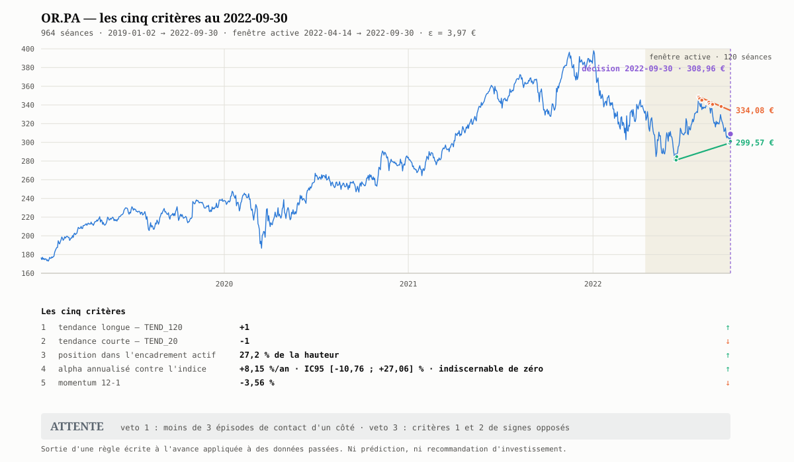

- Canal 299,57 – 334,08 €, clôture à 308,96 € à 27,2 %.
- Support +0,243 contre résistance −0,330 €/séance, τ de 60 séances.
- Deux contacts en support : veto 1 ; tendances opposées : veto 3.
- Momentum −3,6 %, alpha +8,2 %/an.

### 9. `RI.PA` — Pernod Ricard

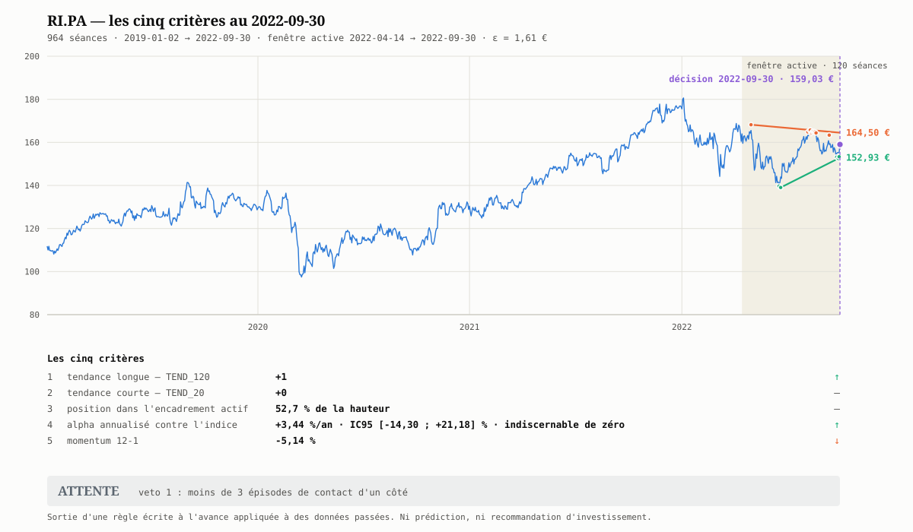

- Canal 152,93 – 164,50 €, clôture à 159,03 € à 52,7 % : le milieu.
- Pentes +0,193 et −0,034 €/séance, τ de 51 séances.
- Deux contacts en support : veto 1.
- Momentum −5,1 %, alpha +3,4 %/an.

### 10. `RNO.PA` — Renault

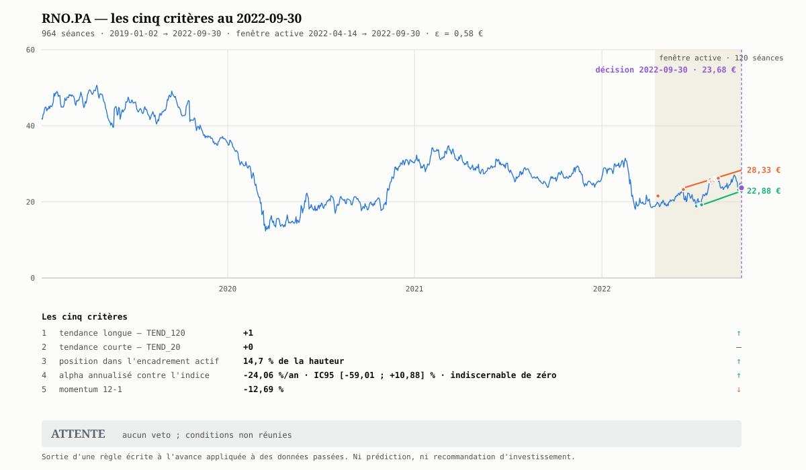

- Canal 22,88 – 28,33 €, clôture à 23,68 € à 14,7 % de la hauteur.
- Pentes +0,068 et +0,058 €/séance, τ de 571 séances.
- Quatre contacts bas, trois hauts : **aucun veto**.
- Momentum −12,7 %, alpha −24,1 %/an, IC95 de −59,0 à +10,9.

### 11. `ORA.PA` — Orange

- Canal 7,21 – 7,85 €, clôture à 7,23 € à 2,5 % : sur le support.
- Pentes −0,005 et −0,017 €/séance, τ de 56 séances.
- Deux contacts de chaque côté : veto 1.
- Momentum +14,9 %, alpha −9,3 %/an.

### 12. `SAF.PA` — Safran

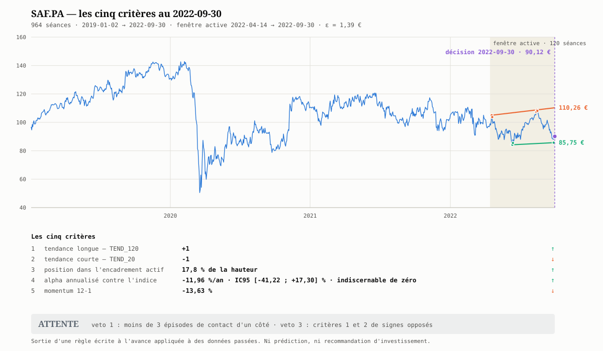

- Canal 85,75 – 110,26 €, large de 24,5 %, clôture à 90,12 € à 17,8 % de la hauteur.
- Pentes +0,020 et +0,045 €/séance : ouverture, τ infini.
- Deux contacts de chaque côté : veto 1 ; tendances opposées : veto 3.
- Momentum −13,6 %, alpha −12,0 %/an.

### 13. `KER.PA` — Kering

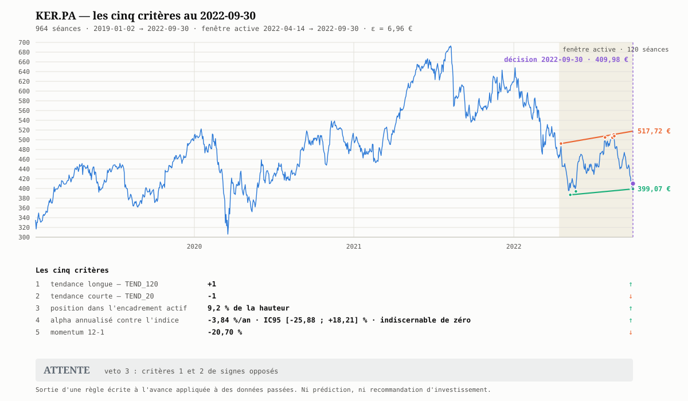

- Canal 399,07 – 517,72 €, large de 119 €, clôture à 409,98 € à 9,2 %.
- Pentes +0,120 et +0,220 €/séance : ouverture, τ infini.
- Trois contacts de chaque côté : figure lisible ; seul le veto 3 mord.
- Momentum −20,7 %, alpha −3,8 %/an.

### 14. `WLN.PA` — Worldline

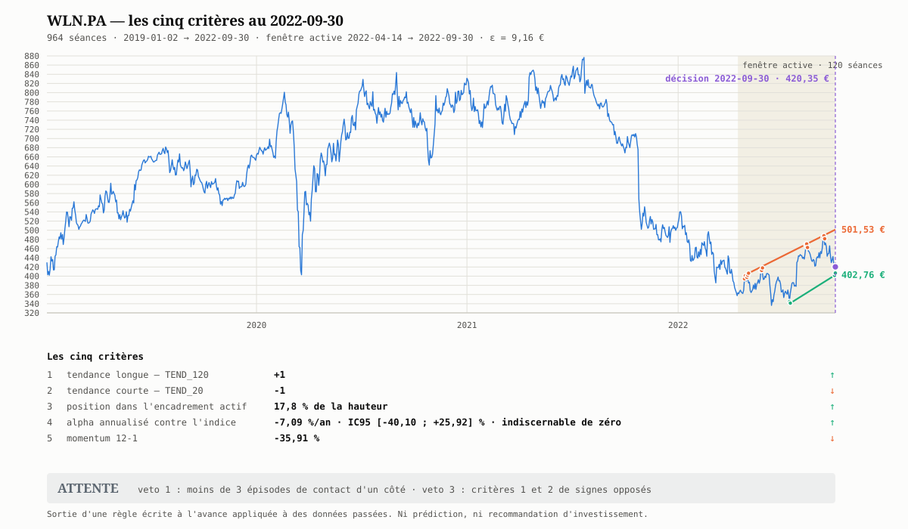

- Canal 402,76 – 501,53 €, clôture à 420,35 € à 17,8 %.
- Pentes +1,117 et +0,896 €/séance, τ de 447 séances.
- Deux contacts en support : veto 1 ; tendances opposées : veto 3.
- **Momentum −35,9 %**, le plus faible de la date ; alpha −7,1 %/an.

### 15. `CA.PA` — Carrefour

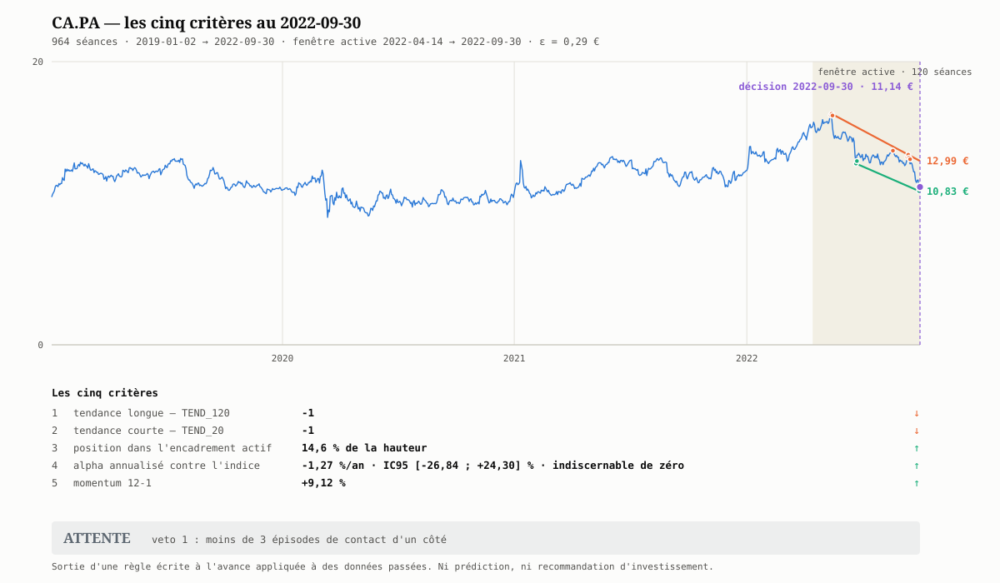

- Canal 10,83 – 12,99 €, clôture à 11,14 € à 14,6 %.
- Pentes −0,028 et −0,034 €/séance, τ de 350 séances.
- Deux contacts en support : veto 1.
- Momentum +9,1 %, alpha −1,3 %/an.

### 16. `AI.PA` — Air Liquide

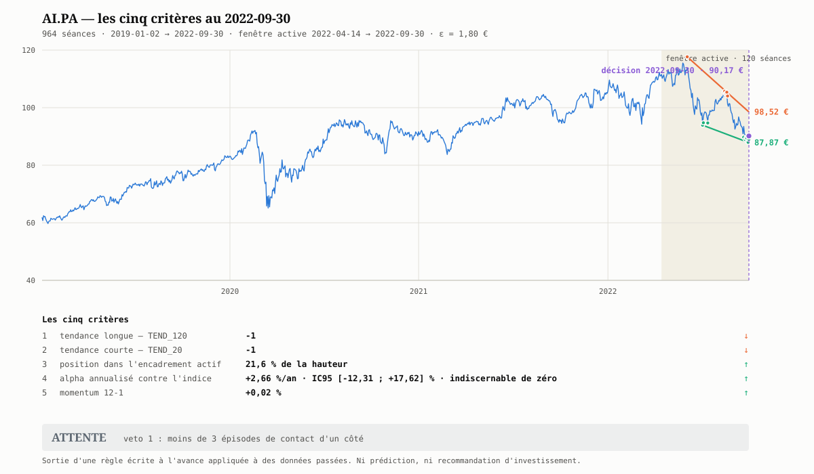

- Canal 87,87 – 98,52 €, clôture à 90,17 € à 21,6 % de la hauteur.
- Pentes −0,096 et −0,228 €/séance, τ de 81 séances.
- Deux contacts en résistance : veto 1.
- **Momentum +0,0 %**, rigoureusement nul ; alpha +2,7 %/an.

### 17. `STMPA.PA` — STMicroelectronics

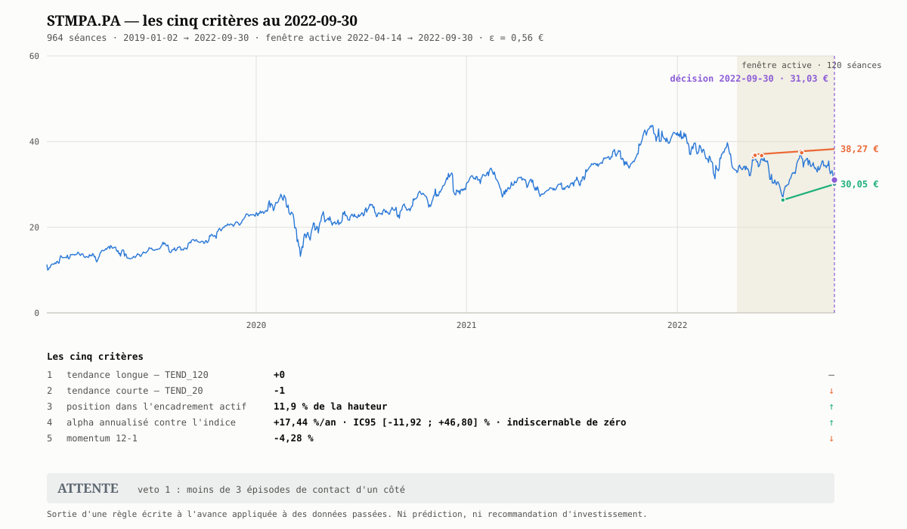

- Canal 30,05 – 38,27 €, clôture à 31,03 € à 11,9 %.
- Pentes +0,059 et +0,013 €/séance, τ de 180 séances.
- Deux contacts en support : veto 1.
- Momentum −4,3 %, alpha +17,4 %/an.

### 18. `EL.PA` — EssilorLuxottica

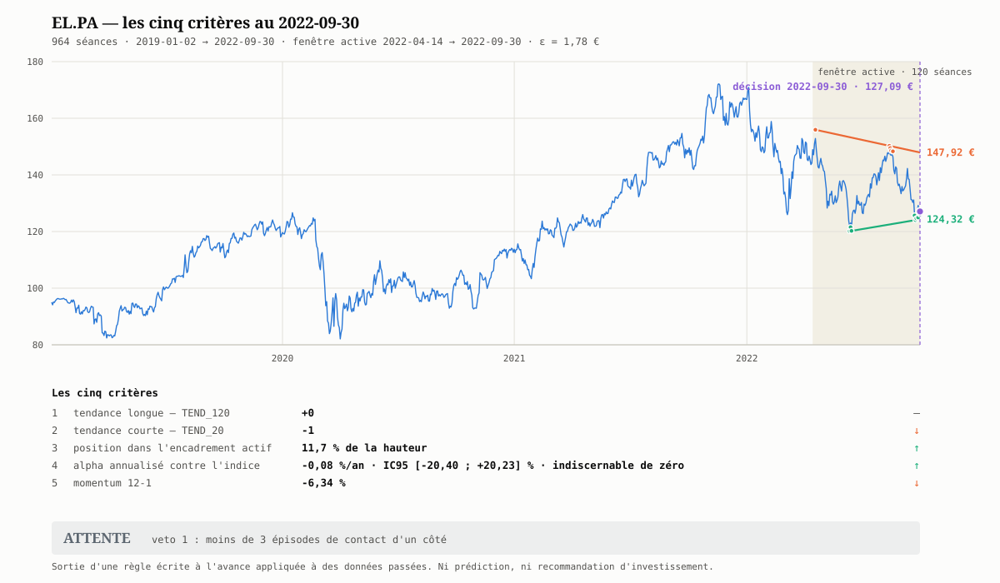

- Canal 124,32 – 147,92 €, clôture à 127,09 € à 11,7 % de la hauteur.
- Pentes +0,054 et −0,069 €/séance, τ de 192 séances.
- Deux contacts de chaque côté : veto 1.
- Momentum −6,3 %, alpha −0,1 %/an.

### 19. `PUB.PA` — Publicis

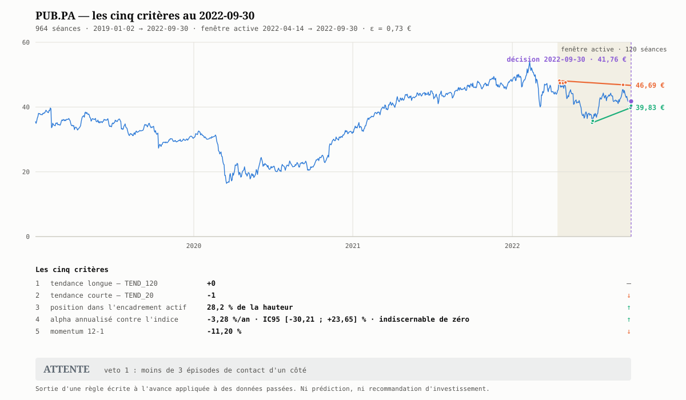

- Canal 39,83 – 46,69 €, clôture à 41,76 € à 28,2 % de la hauteur.
- Pentes +0,074 et −0,012 €/séance, τ de 79 séances.
- Deux contacts en support : veto 1.
- Momentum −11,2 %, alpha −3,3 %/an.

### 20. `DSY.PA` — Dassault Systèmes

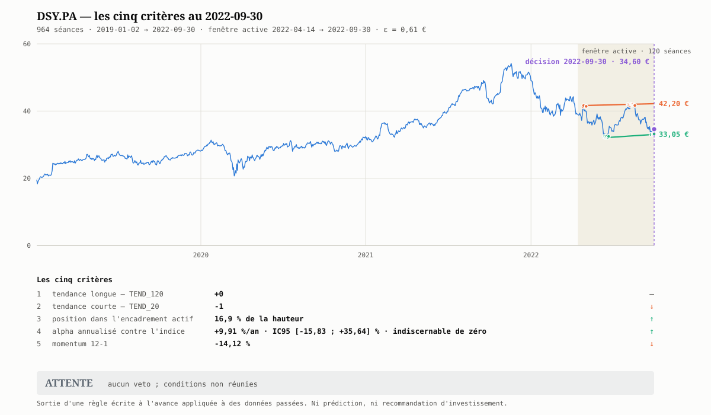

- Canal 33,05 – 42,20 €, clôture à 34,60 € à 16,9 %.
- Pentes +0,013 et +0,005 €/séance, τ de 1 154 séances.
- Trois contacts de chaque côté : **aucun veto**.
- Momentum −14,1 %, alpha +9,9 %/an.

### 21. `STLAP.PA` — Stellantis

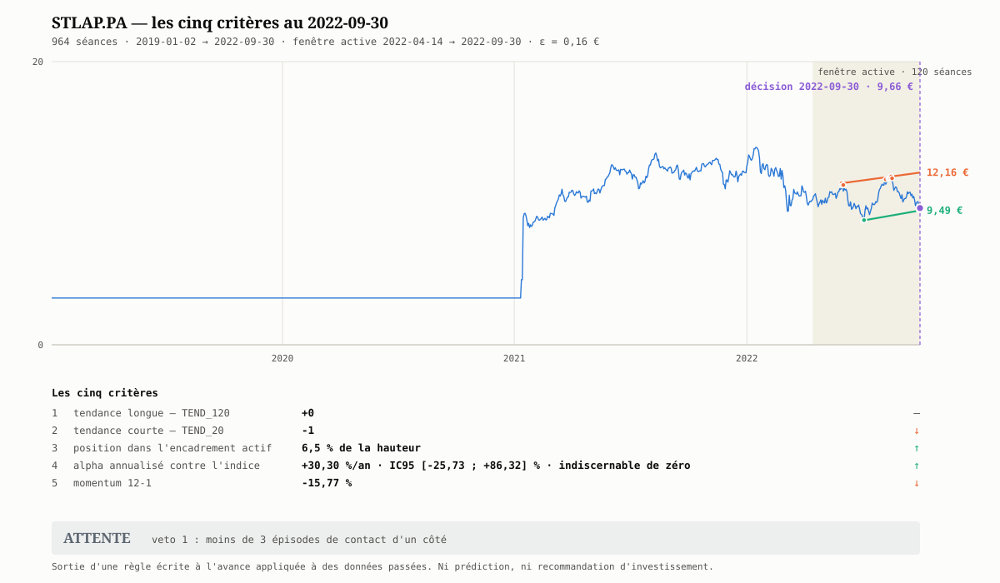

- Canal 9,49 – 12,16 €, clôture à 9,66 € à 6,5 % : contre le support.
- Pentes +0,011 et +0,009 €/séance, τ de 1 060 séances.
- Deux contacts en support : veto 1.
- Momentum −15,8 %, alpha +30,3 %/an sur un IC95 de 112 points.

### 22. `GLE.PA` — Société Générale

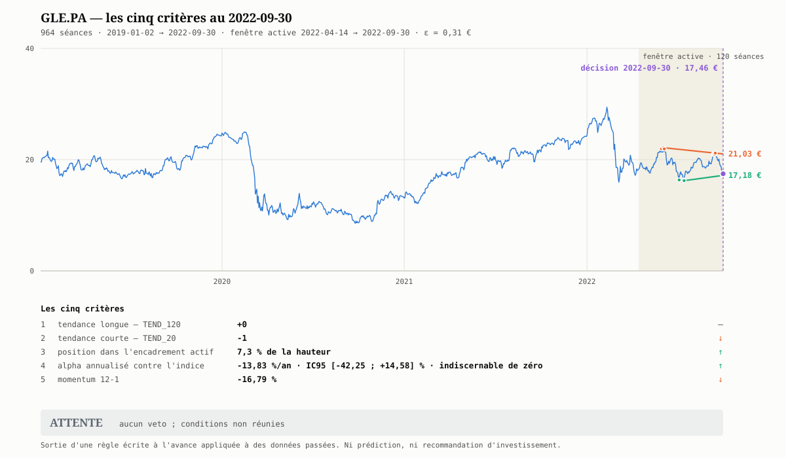

- Canal 17,18 – 21,03 €, clôture à 17,46 € à 7,3 % : contre le support.
- Pentes +0,017 et −0,013 €/séance, τ de 126 séances.
- Trois contacts de chaque côté : **aucun veto**.
- Momentum −16,8 %, alpha −13,8 %/an.

### 23. `ACA.PA` — Crédit Agricole

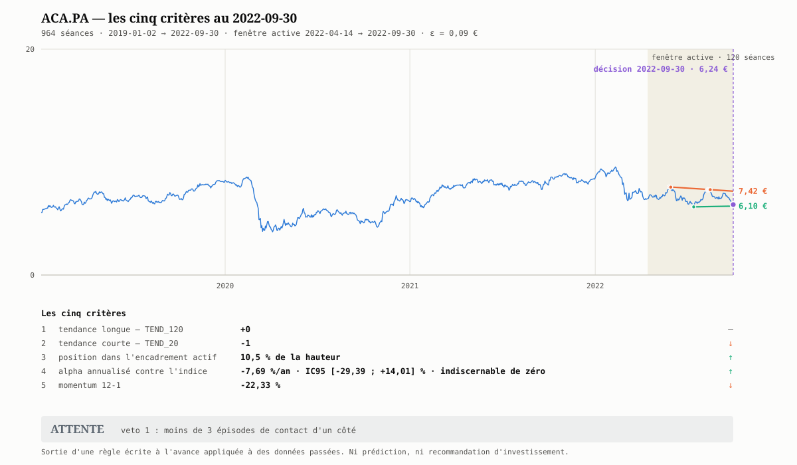

- Canal 6,10 – 7,42 €, clôture à 6,24 € à 10,5 % de la hauteur.
- Pentes +0,001 et −0,004 €/séance, quasi plates : τ de 249 séances.
- Deux contacts de chaque côté : veto 1.
- Momentum −22,3 %, alpha −7,7 %/an.

### 24. `CAP.PA` — Capgemini

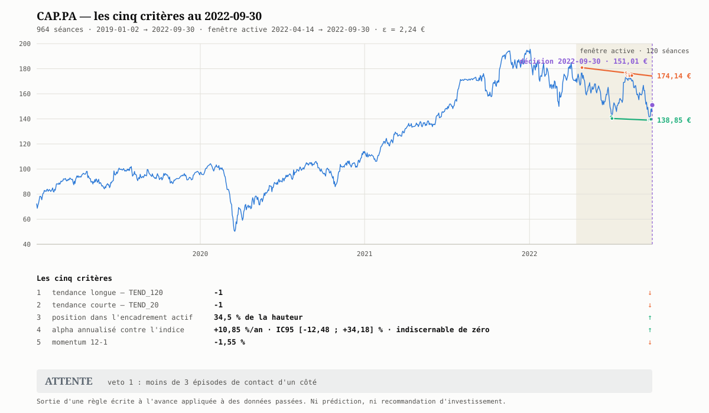

- Canal 138,85 – 174,14 €, clôture à 151,01 € à 34,5 % — à un demi-point du seuil bas.
- Pentes −0,024 et −0,061 €/séance, τ de 938 séances.
- Deux contacts en support : veto 1.
- Momentum −1,6 %, alpha +10,8 %/an.

### 25. `BN.PA` — Danone

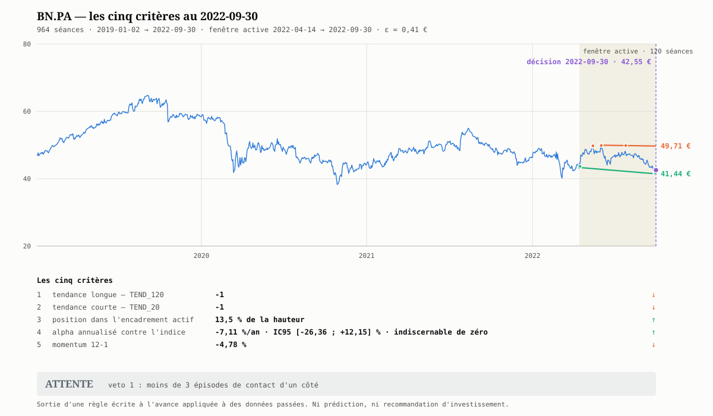

- Canal 41,44 – 49,71 €, clôture à 42,55 € à 13,5 % de la hauteur.
- Pentes −0,016 et −0,003 €/séance : ouverture, τ infini.
- Deux contacts en support : veto 1.
- Momentum −4,8 %, alpha −7,1 %/an.

### 26. `SAN.PA` — Sanofi

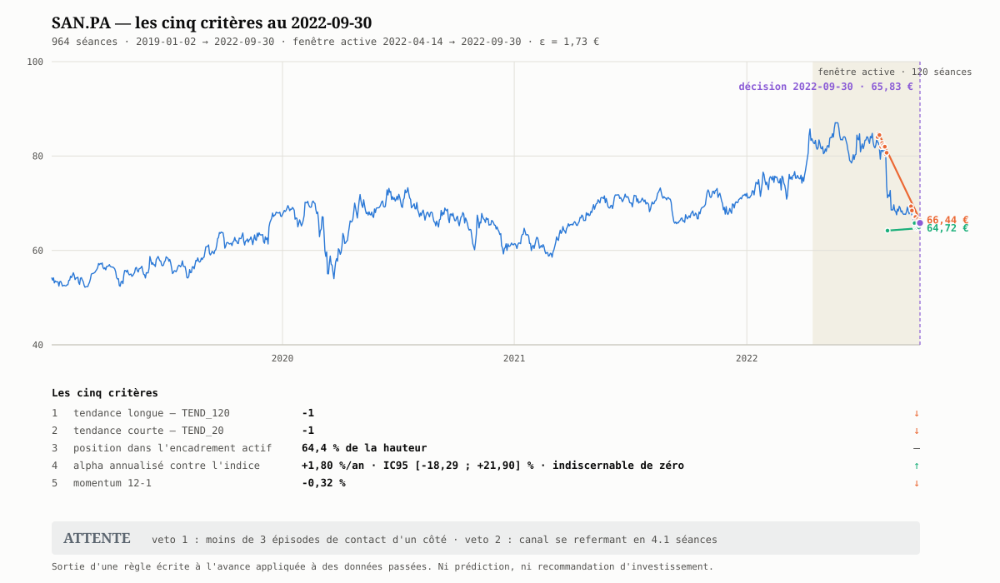

- Canal 64,72 – 66,44 €, d'une largeur de 1,7 %, clôture à 65,83 € à 64,4 % — un demi-point sous le seuil haut.
- Support +0,015 contre résistance −0,400 €/séance : **le canal se referme en 4 séances**, veto 2 — le plus court de la date.
- Deux contacts en support : veto 1 également.
- **Momentum −0,3 %**, quasi nul ; alpha +1,8 %/an.

### 27. `EN.PA` — Bouygues

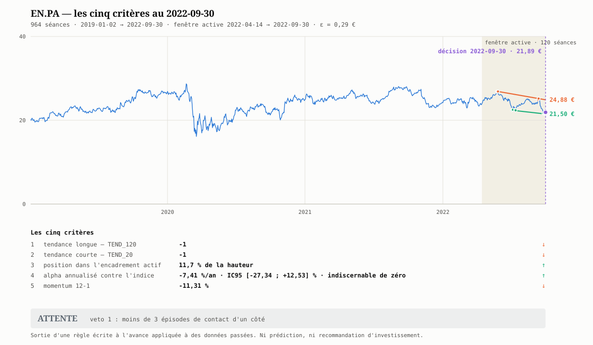

- Canal 21,50 – 24,88 €, clôture à 21,89 € à 11,7 %.
- Pentes −0,014 et −0,022 €/séance, τ de 415 séances.
- Deux contacts en résistance : veto 1.
- Momentum −11,3 %, alpha −7,4 %/an.

### 28. `SU.PA` — Schneider Electric

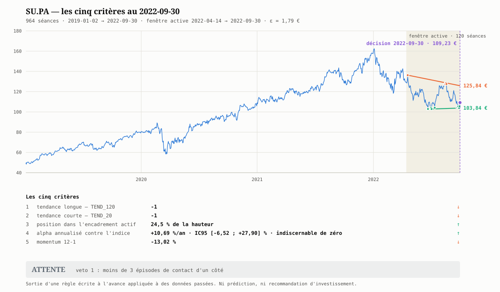

- Canal 103,84 – 125,84 €, clôture à 109,23 € à 24,5 % de la hauteur.
- Pentes +0,015 et −0,090 €/séance, τ de 209 séances.
- Deux contacts en résistance : veto 1.
- Momentum −13,0 %, alpha +10,7 %/an.

### 29. `VIE.PA` — Veolia

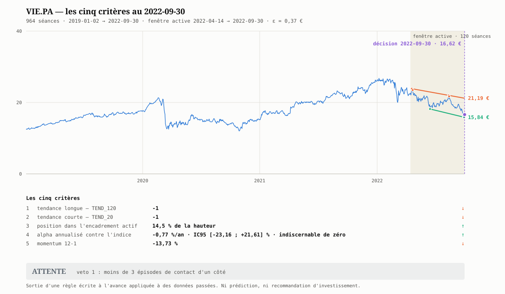

- Canal 15,84 – 21,19 €, clôture à 16,62 € à 14,5 % de la hauteur.
- Pentes −0,031 et −0,023 €/séance : ouverture, τ infini.
- Deux contacts de chaque côté : veto 1.
- Momentum −13,7 %, alpha −0,8 %/an.

### 30. `BNP.PA` — BNP Paribas

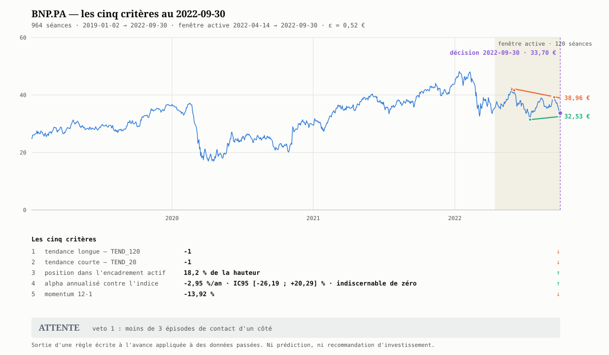

- Canal 32,53 – 38,96 €, clôture à 33,70 € à 18,2 % de la hauteur.
- Pentes +0,020 et −0,038 €/séance, τ de 111 séances.
- Deux contacts en support : veto 1.
- Momentum −13,9 %, alpha −3,0 %/an.

### 31. `TEP.PA` — Teleperformance

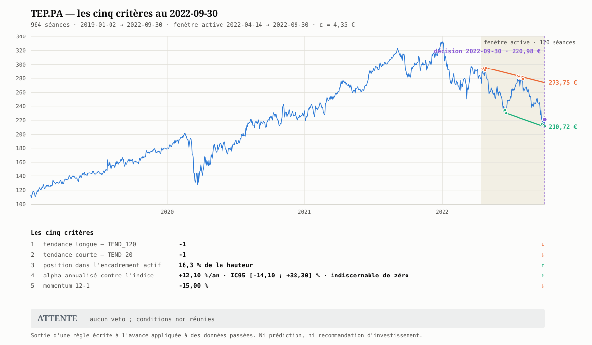

- Canal 210,72 – 273,75 €, large de 63,0 €, clôture à 220,98 € à 16,3 %.
- Pentes −0,267 et −0,194 €/séance : ouverture, τ infini.
- Trois contacts de chaque côté : **aucun veto**.
- Momentum −15,0 %, alpha +12,1 %/an.

### 32. `AIR.PA` — Airbus

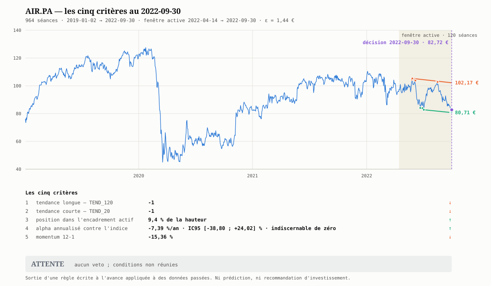

- Canal 80,71 – 102,17 €, clôture à 82,72 € à 9,4 % de la hauteur.
- Pentes −0,032 et −0,035 €/séance, quasi parallèles : τ de 7 058 séances.
- Quatre contacts bas, trois hauts : **aucun veto**.
- Momentum −15,4 %, alpha −7,4 %/an.

### 33. `LR.PA` — Legrand

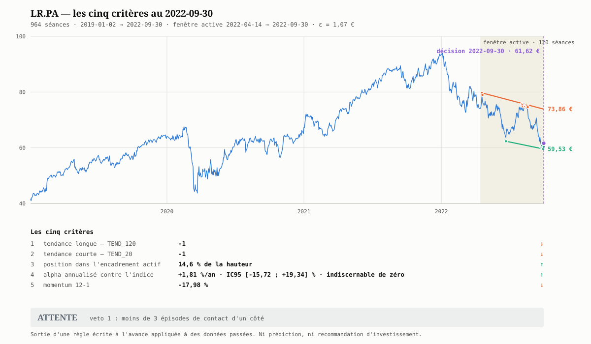

- Canal 59,53 – 73,86 €, clôture à 61,62 € à 14,6 %.
- Pentes −0,040 et −0,050 €/séance, τ de 1 337 séances.
- Deux contacts en support : veto 1.
- Momentum −18,0 %, alpha +1,8 %/an.

### 34. `VIV.PA` — Vivendi

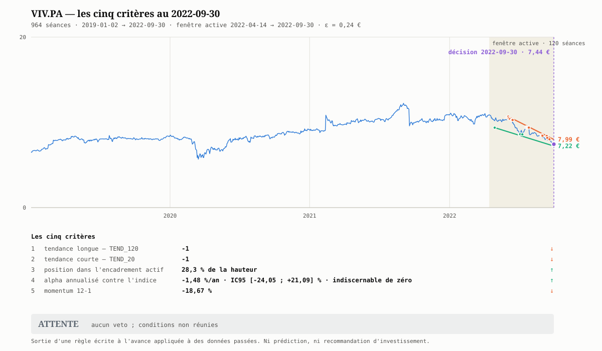

- Canal 7,22 – 7,99 €, clôture à 7,44 € à 28,3 %.
- Pentes −0,020 et −0,032 €/séance, τ de 63 séances.
- Quatre contacts bas, six hauts : **aucun veto**.
- Momentum −18,7 %, alpha −1,5 %/an.

### 35. `ML.PA` — Michelin

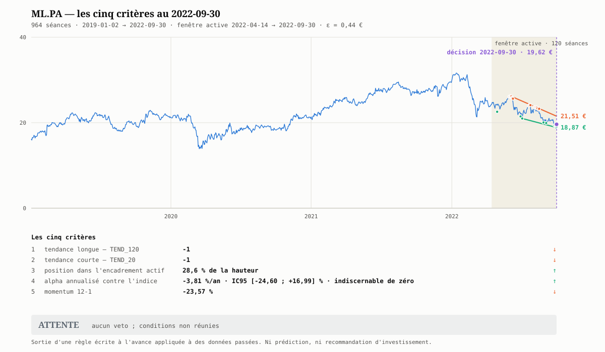

- Canal 18,87 – 21,51 €, clôture à 19,62 € à 28,6 % de la hauteur.
- Pentes −0,034 et −0,056 €/séance, τ de 119 séances.
- **Six contacts en support** et trois en résistance : **aucun veto**, la figure la mieux étayée de la date.
- Momentum −23,6 %, alpha −3,8 %/an.

### 36. `ALO.PA` — Alstom

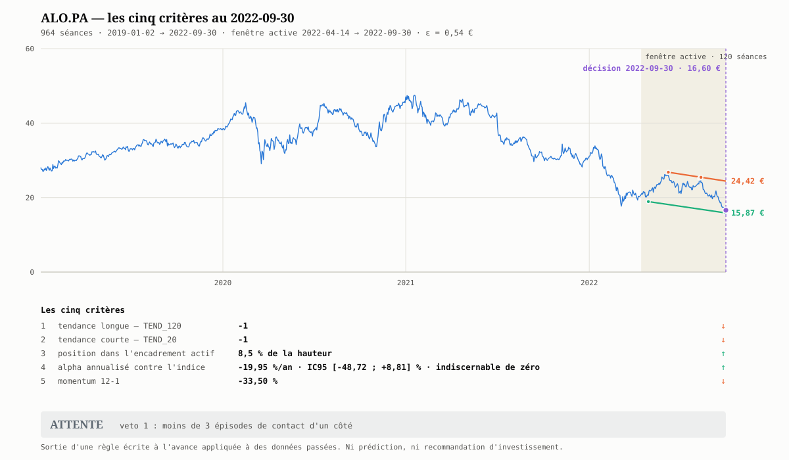

- Canal 15,87 – 24,42 €, clôture à 16,60 € à 8,5 %.
- Pentes −0,028 et −0,029 €/séance, presque identiques : τ de 6 039 séances.
- Deux contacts de chaque côté : veto 1.
- **Momentum −33,5 %** ; alpha −19,9 %/an.

### 37. `ERF.PA` — Eurofins Scientific

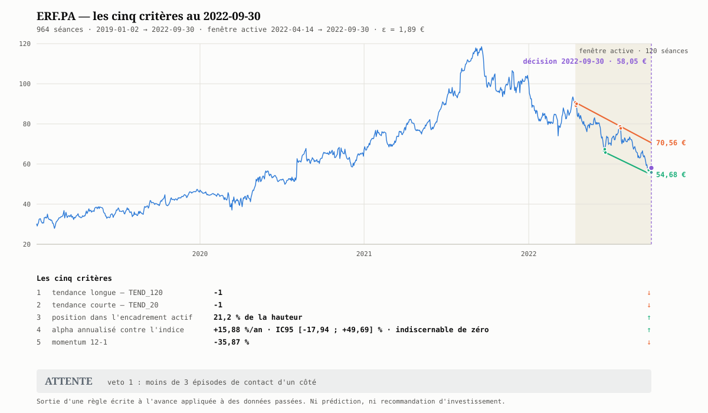

- Canal 54,68 – 70,56 €, clôture à 58,05 € à 21,2 % de la hauteur.
- Pentes −0,153 et −0,169 €/séance, τ de 1 008 séances.
- Deux contacts de chaque côté : veto 1.
- Momentum −35,9 %, **alpha +15,9 %/an**.

### 38. `MT.AS` — ArcelorMittal

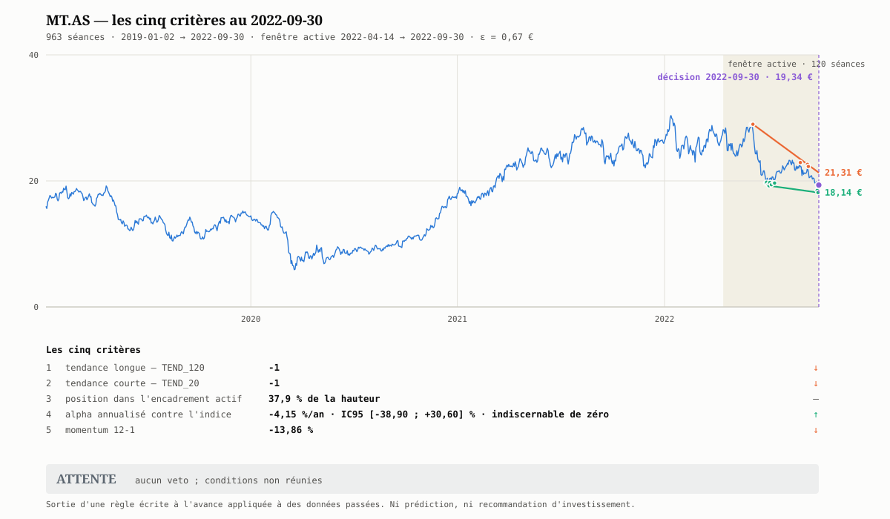

- Canal 18,14 – 21,31 €, clôture à 19,34 € à 37,9 % de la hauteur.
- Pentes −0,018 et −0,094 €/séance, τ de 42 séances.
- Trois contacts de chaque côté : **aucun veto**.
- Momentum −13,9 %, alpha −4,2 %/an. Score −5.

### 39. `SGO.PA` — Saint-Gobain

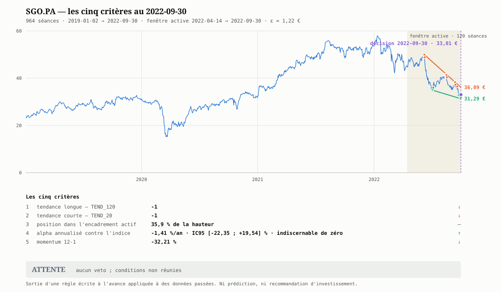

- Canal 31,29 – 36,09 €, clôture à 33,01 € à 35,9 % — à peine au-dessus du seuil bas.
- Pentes −0,058 et −0,171 €/séance, τ de 42 séances.
- Trois contacts bas, quatre hauts : **aucun veto**.
- Momentum −32,2 %, alpha −1,4 %/an. Score −5, le plus bas de la date avec ArcelorMittal.

## 6. Le classement au 2022-09-30

> De la valeur la plus intéressante à détenir à celle qu'il faut fuir. La colonne **τ** donne la date de péremption du canal en séances, la colonne **Vetos** les numéros déclenchés. Une valeur sous veto ne peut pas être achetée.

| Rang | Valeur | `s1` | `s2` | `s3` | `s4` | `s5` | Score | Position | Momentum | τ | Vetos |
|---|---|---|---|---|---|---|---|---|---|---|---|
| 1 | `ENGI.PA` Engie | +2 | -1 | +1 | +1 | +0 | **+3** | 4,8 % | +9,9 % | 80,5 | 1 3 |
| 2 | `RMS.PA` Hermès International | +2 | -1 | +1 | +1 | +0 | **+3** | 17,3 % | +2,6 % | 209,1 | 1 3 |
| 3 | `MC.PA` LVMH | +2 | -1 | +1 | +1 | +0 | **+3** | 9,9 % | +1,8 % | 902,0 | 1 3 |
| 4 | `HO.PA` Thales | +0 | -1 | +1 | +2 | +0 | **+2** | 24,2 % | +41,8 % | ∞ | 1 |
| 5 | `TTE.PA` TotalEnergies | +0 | -1 | +1 | +2 | +0 | **+2** | 28,8 % | +18,5 % | 115,5 | 1 |
| 6 | `DG.PA` Vinci | +0 | -1 | +1 | +1 | +0 | **+1** | 11,4 % | +4,3 % | ∞ | 1 |
| 7 | `CS.PA` AXA | +0 | -1 | +1 | +1 | +0 | **+1** | 6,5 % | +3,0 % | 126,6 | 1 |
| 8 | `OR.PA` L'Oréal | +2 | -1 | +1 | -1 | +0 | **+1** | 27,2 % | -3,6 % | 60,2 | 1 3 |
| 9 | `RI.PA` Pernod Ricard | +2 | +0 | +0 | -1 | +0 | **+1** | 52,7 % | -5,1 % | 51,0 | 1 |
| 10 | `RNO.PA` Renault | +2 | +0 | +1 | -2 | +0 | **+1** | 14,7 % | -12,7 % | 570,8 | — |
| 11 | `ORA.PA` Orange | -2 | -1 | +1 | +2 | +0 | **+0** | 2,5 % | +14,9 % | 55,5 | 1 |
| 12 | `SAF.PA` Safran | +2 | -1 | +1 | -2 | +0 | **+0** | 17,8 % | -13,6 % | ∞ | 1 3 |
| 13 | `KER.PA` Kering | +2 | -1 | +1 | -2 | +0 | **+0** | 9,2 % | -20,7 % | ∞ | 3 |
| 14 | `WLN.PA` Worldline | +2 | -1 | +1 | -2 | +0 | **+0** | 17,8 % | -35,9 % | 446,9 | 1 3 |
| 15 | `CA.PA` Carrefour | -2 | -1 | +1 | +1 | +0 | **-1** | 14,6 % | +9,1 % | 350,1 | 1 |
| 16 | `AI.PA` Air Liquide | -2 | -1 | +1 | +1 | +0 | **-1** | 21,6 % | +0,0 % | 80,7 | 1 |
| 17 | `STMPA.PA` STMicroelectronics | +0 | -1 | +1 | -1 | +0 | **-1** | 11,9 % | -4,3 % | 179,8 | 1 |
| 18 | `EL.PA` EssilorLuxottica | +0 | -1 | +1 | -1 | +0 | **-1** | 11,7 % | -6,3 % | 192,4 | 1 |
| 19 | `PUB.PA` Publicis | +0 | -1 | +1 | -2 | +0 | **-2** | 28,2 % | -11,2 % | 79,0 | 1 |
| 20 | `DSY.PA` Dassault Systèmes | +0 | -1 | +1 | -2 | +0 | **-2** | 16,9 % | -14,1 % | 1 154,0 | — |
| 21 | `STLAP.PA` Stellantis | +0 | -1 | +1 | -2 | +0 | **-2** | 6,5 % | -15,8 % | 1 060,1 | 1 |
| 22 | `GLE.PA` Société Générale | +0 | -1 | +1 | -2 | +0 | **-2** | 7,3 % | -16,8 % | 125,7 | — |
| 23 | `ACA.PA` Crédit Agricole | +0 | -1 | +1 | -2 | +0 | **-2** | 10,5 % | -22,3 % | 248,8 | 1 |
| 24 | `CAP.PA` Capgemini | -2 | -1 | +1 | -1 | +0 | **-3** | 34,5 % | -1,6 % | 938,3 | 1 |
| 25 | `BN.PA` Danone | -2 | -1 | +1 | -1 | +0 | **-3** | 13,5 % | -4,8 % | ∞ | 1 |
| 26 | `SAN.PA` Sanofi | -2 | -1 | +0 | -1 | +0 | **-4** | 64,4 % | -0,3 % | 4,1 | 1 2 |
| 27 | `EN.PA` Bouygues | -2 | -1 | +1 | -2 | +0 | **-4** | 11,7 % | -11,3 % | 415,3 | 1 |
| 28 | `SU.PA` Schneider Electric | -2 | -1 | +1 | -2 | +0 | **-4** | 24,5 % | -13,0 % | 209,0 | 1 |
| 29 | `VIE.PA` Veolia | -2 | -1 | +1 | -2 | +0 | **-4** | 14,5 % | -13,7 % | ∞ | 1 |
| 30 | `BNP.PA` BNP Paribas | -2 | -1 | +1 | -2 | +0 | **-4** | 18,2 % | -13,9 % | 111,2 | 1 |
| 31 | `TEP.PA` Teleperformance | -2 | -1 | +1 | -2 | +0 | **-4** | 16,3 % | -15,0 % | ∞ | — |
| 32 | `AIR.PA` Airbus | -2 | -1 | +1 | -2 | +0 | **-4** | 9,4 % | -15,4 % | 7 058,4 | — |
| 33 | `LR.PA` Legrand | -2 | -1 | +1 | -2 | +0 | **-4** | 14,6 % | -18,0 % | 1 337,4 | 1 |
| 34 | `VIV.PA` Vivendi | -2 | -1 | +1 | -2 | +0 | **-4** | 28,3 % | -18,7 % | 63,0 | — |
| 35 | `ML.PA` Michelin | -2 | -1 | +1 | -2 | +0 | **-4** | 28,6 % | -23,6 % | 119,3 | — |
| 36 | `ALO.PA` Alstom | -2 | -1 | +1 | -2 | +0 | **-4** | 8,5 % | -33,5 % | 6 038,6 | 1 |
| 37 | `ERF.PA` Eurofins Scientific | -2 | -1 | +1 | -2 | +0 | **-4** | 21,2 % | -35,9 % | 1 007,8 | 1 |
| 38 | `MT.AS` ArcelorMittal | -2 | -1 | +0 | -2 | +0 | **-5** | 37,9 % | -13,9 % | 41,8 | — |
| 39 | `SGO.PA` Saint-Gobain | -2 | -1 | +0 | -2 | +0 | **-5** | 35,9 % | -32,2 % | 42,4 | — |

## 7. Les ordres exécutés au 2022-10-03

> À l'**ouverture** de la séance, jamais à la clôture du 2022-09-30.

*Aucun ordre : le classement ne déclenche ni entrée ni sortie.*

## 8. La lecture du mois

Sur le mois, la meilleure contribution vient de `HO.PA` (Thales) pour **+260,44 €**, la moins bonne de `RMS.PA` (Hermès International) pour **+89,98 €**. Aucun ordre, donc aucun frais : le classement, l'hystérésis ou les vetos ont retenu le portefeuille en l'état. Le portefeuille termine le mois **derrière TR39** de 2,89 point. Sur les 40 thèses du mois précédent qui ont pu être tranchées, **9 sont confirmées** — 22,5 %.

## 9. Les thèses écrites au 2022-09-30

> Elles seront dépouillées à la prochaine date de décision, dans le fichier du mois suivant. Elles sont engendrées mécaniquement par les règles du [protocole](../README.md#le-registre-des-thèses-réfutables) — aucune n'est rédigée à la main.

| Valeur | Thèse | Énoncé, à dépouiller au mois suivant |
|---|---|---|
| `ACA.PA` | Canal | clôture entre 6,12 € et 7,33 € au 2022-10-31 |
| `ACA.PA` | Reflexive | AUCUNE SEQUENCE : écart contre TR39 dans ± 6,44 pt (σ̂), au 2022-10-31 |
| `AI.PA` | Canal | clôture entre 85,86 € et 93,74 € au 2022-10-31 |
| `AIR.PA` | Canal | clôture entre 80,03 € et 101,43 € au 2022-10-31 |
| `ALO.PA` | Canal | clôture entre 15,28 € et 23,80 € au 2022-10-31 |
| `ALO.PA` | Reflexive | RETOURNEMENT : écart contre TR39 au-dessous de −4,55 pt (0,5 σ̂), au 2022-10-31 |
| `BN.PA` | Canal | clôture entre 41,11 € et 49,65 € au 2022-10-31 |
| `BNP.PA` | Canal | clôture entre 32,95 € et 38,17 € au 2022-10-31 |
| `BNP.PA` | Reflexive | RETOURNEMENT : écart contre TR39 au-dessous de −3,79 pt (0,5 σ̂), au 2022-10-31 |
| `CA.PA` | Canal | clôture entre 10,25 € et 12,28 € au 2022-10-31 |
| `CAP.PA` | Canal | clôture entre 138,35 € et 172,85 € au 2022-10-31 |
| `CS.PA` | Canal | clôture entre 18,16 € et 20,57 € au 2022-10-31 |
| `CS.PA` | Reflexive | AUCUNE SEQUENCE : écart contre TR39 dans ± 6,05 pt (σ̂), au 2022-10-31 |
| `DG.PA` | Canal | clôture entre 69,10 € et 83,64 € au 2022-10-31 |
| `DSY.PA` | Canal | clôture entre 33,32 € et 42,30 € au 2022-10-31 |
| `EL.PA` | Canal | clôture entre 125,45 € et 146,47 € au 2022-10-31 |
| `EN.PA` | Canal | clôture entre 21,20 € et 24,41 € au 2022-10-31 |
| `ENGI.PA` | Canal | clôture entre 8,97 € et 9,88 € au 2022-10-31 |
| `ERF.PA` | Canal | clôture entre 51,46 € et 67,01 € au 2022-10-31 |
| `ERF.PA` | Reflexive | RETOURNEMENT : écart contre TR39 au-dessous de −3,87 pt (0,5 σ̂), au 2022-10-31 |
| `GLE.PA` | Canal | clôture entre 17,54 € et 20,75 € au 2022-10-31 |
| `GLE.PA` | Reflexive | AUCUNE SEQUENCE : écart contre TR39 dans ± 8,74 pt (σ̂), au 2022-10-31 |
| `HO.PA` | Canal | clôture entre 99,55 € et 118,55 € au 2022-10-31 |
| `KER.PA` | Canal | clôture entre 401,60 € et 522,33 € au 2022-10-31 |
| `LR.PA` | Canal | clôture entre 58,70 € et 72,80 € au 2022-10-31 |
| `MC.PA` | Canal | clôture entre 566,66 € et 685,50 € au 2022-10-31 |
| `ML.PA` | Canal | clôture entre 18,16 € et 20,34 € au 2022-10-31 |
| `MT.AS` | Canal | clôture entre 17,77 € et 19,34 € au 2022-10-31 |
| `MT.AS` | Reflexive | AUCUNE SEQUENCE : écart contre TR39 dans ± 9,74 pt (σ̂), au 2022-10-31 |
| `OR.PA` | Canal | clôture entre 304,68 € et 327,14 € au 2022-10-31 |
| `ORA.PA` | Canal | clôture entre 7,09 € et 7,49 € au 2022-10-31 |
| `PUB.PA` | Canal | clôture entre 41,39 € et 46,43 € au 2022-10-31 |
| `RI.PA` | Canal | clôture entre 156,98 € et 163,78 € au 2022-10-31 |
| `RMS.PA` | Canal | clôture entre 1 177,46 € et 1 432,02 € au 2022-10-31 |
| `RNO.PA` | Canal | clôture entre 24,31 € et 29,56 € au 2022-10-31 |
| `SAF.PA` | Canal | clôture entre 86,16 € et 111,21 € au 2022-10-31 |
| `SAN.PA` | Canal | encadrement ferme avant le 2022-10-31 : les bornes prolongees se croisent, la thèse est inconfirmable à l'écriture |
| `SGO.PA` | Canal | clôture entre 30,08 € et 32,50 € au 2022-10-31 |
| `STLAP.PA` | Canal | clôture entre 9,73 € et 12,34 € au 2022-10-31 |
| `STMPA.PA` | Canal | clôture entre 31,28 € et 38,55 € au 2022-10-31 |
| `SU.PA` | Canal | clôture entre 104,16 € et 123,95 € au 2022-10-31 |
| `TEP.PA` | Canal | clôture entre 205,11 € et 269,68 € au 2022-10-31 |
| `TEP.PA` | Reflexive | RETOURNEMENT : écart contre TR39 au-dessous de −3,18 pt (0,5 σ̂), au 2022-10-31 |
| `TTE.PA` | Canal | clôture entre 37,79 € et 42,48 € au 2022-10-31 |
| `VIE.PA` | Canal | clôture entre 15,20 € et 20,71 € au 2022-10-31 |
| `VIV.PA` | Canal | clôture entre 6,80 € et 7,32 € au 2022-10-31 |
| `VIV.PA` | Reflexive | RETOURNEMENT : écart contre TR39 au-dessous de −2,87 pt (0,5 σ̂), au 2022-10-31 |
| `WLN.PA` | Canal | clôture entre 426,23 € et 520,36 € au 2022-10-31 |
| `WLN.PA` | Reflexive | AUCUNE SEQUENCE : écart contre TR39 dans ± 11,06 pt (σ̂), au 2022-10-31 |

---

[← Septembre](2022-09.md) · [Protocole](../README.md) · [Novembre →](2022-11.md)
