# Novembre 2022

> Journal de l'[expérience 3](../README.md) · **décision au 2022-10-31** · **exécution au 2022-11-01**
> Portefeuille au 2022-11-30 : **9 867,10 €** (base 98,67) · TR39 93,61 · alpha du mois **-2,83 pt** · depuis janvier **+5,06 pt**

---

## 1. Les actualités du mois précédent

**Octobre 2022.** Renversement. Les indices européens signent l'un de leurs
meilleurs mois de la décennie, le CAC 40 reprenant environ 9 %. Deux raisons
avancées par le marché : des résultats trimestriels moins mauvais que craint, et
l'idée que le pic de resserrement monétaire approche.

Le gaz européen s'effondre par rapport à ses sommets d'août, les stockages
étant remplis plus vite que prévu et l'automne restant doux. Au Royaume-Uni, le
gouvernement Truss démissionne après quarante-cinq jours. La BCE relève encore
ses taux de trois quarts de point le 27 octobre. Teleperformance chute lourdement
après la révélation d'une enquête sur ses conditions de travail en Colombie.

## 2. Le dépouillement des thèses écrites au 2022-09-30

> Piste **S4**. Ces énoncés ont été écrits le mois dernier, avant de connaître ce mois-ci. Aucun n'a été retouché ; le verdict est calculé.

| Valeur | Thèse | Énoncé | Constaté | Verdict |
|---|---|---|---|---|
| `ACA.PA` | Canal | clôture entre 6,12 € et 7,33 € au 2022-10-31 | 6,85 € | **confirmée** |
| `ACA.PA` | Reflexive | AUCUNE SEQUENCE : écart contre TR39 dans ± 6,44 pt (σ̂), au 2022-10-31 | 0,47 pt | **confirmée** |
| `AI.PA` | Canal | clôture entre 85,86 € et 93,74 € au 2022-10-31 | 101,48 € | démentie |
| `AIR.PA` | Canal | clôture entre 80,03 € et 101,43 € au 2022-10-31 | 101,97 € | démentie |
| `ALO.PA` | Canal | clôture entre 15,28 € et 23,80 € au 2022-10-31 | 20,68 € | **confirmée** |
| `ALO.PA` | Reflexive | RETOURNEMENT : écart contre TR39 au-dessous de −4,55 pt (0,5 σ̂), au 2022-10-31 | 15,22 pt | démentie |
| `BN.PA` | Canal | clôture entre 41,11 € et 49,65 € au 2022-10-31 | 44,11 € | **confirmée** |
| `BNP.PA` | Canal | clôture entre 32,95 € et 38,17 € au 2022-10-31 | 36,71 € | **confirmée** |
| `BNP.PA` | Reflexive | RETOURNEMENT : écart contre TR39 au-dessous de −3,79 pt (0,5 σ̂), au 2022-10-31 | -0,43 pt | *zone morte* |
| `CA.PA` | Canal | clôture entre 10,25 € et 12,28 € au 2022-10-31 | 12,77 € | démentie |
| `CAP.PA` | Canal | clôture entre 138,35 € et 172,85 € au 2022-10-31 | 151,70 € | **confirmée** |
| `CS.PA` | Canal | clôture entre 18,16 € et 20,57 € au 2022-10-31 | 19,85 € | **confirmée** |
| `CS.PA` | Reflexive | AUCUNE SEQUENCE : écart contre TR39 dans ± 6,05 pt (σ̂), au 2022-10-31 | 1,88 pt | **confirmée** |
| `DG.PA` | Canal | clôture entre 69,10 € et 83,64 € au 2022-10-31 | 79,55 € | **confirmée** |
| `DSY.PA` | Canal | clôture entre 33,32 € et 42,30 € au 2022-10-31 | 32,87 € | démentie |
| `EL.PA` | Canal | clôture entre 125,45 € et 146,47 € au 2022-10-31 | 145,20 € | **confirmée** |
| `EN.PA` | Canal | clôture entre 21,20 € et 24,41 € au 2022-10-31 | 23,55 € | **confirmée** |
| `ENGI.PA` | Canal | clôture entre 8,97 € et 9,88 € au 2022-10-31 | 9,56 € | **confirmée** |
| `ERF.PA` | Canal | clôture entre 51,46 € et 67,01 € au 2022-10-31 | 61,53 € | **confirmée** |
| `ERF.PA` | Reflexive | RETOURNEMENT : écart contre TR39 au-dessous de −3,87 pt (0,5 σ̂), au 2022-10-31 | -3,37 pt | *zone morte* |
| `GLE.PA` | Canal | clôture entre 17,54 € et 20,75 € au 2022-10-31 | 19,86 € | **confirmée** |
| `GLE.PA` | Reflexive | AUCUNE SEQUENCE : écart contre TR39 dans ± 8,74 pt (σ̂), au 2022-10-31 | 4,41 pt | **confirmée** |
| `HO.PA` | Canal | clôture entre 99,55 € et 118,55 € au 2022-10-31 | 118,94 € | démentie |
| `KER.PA` | Canal | clôture entre 401,60 € et 522,33 € au 2022-10-31 | 414,58 € | **confirmée** |
| `LR.PA` | Canal | clôture entre 58,70 € et 72,80 € au 2022-10-31 | 71,31 € | **confirmée** |
| `MC.PA` | Canal | clôture entre 566,66 € et 685,50 € au 2022-10-31 | 589,19 € | **confirmée** |
| `ML.PA` | Canal | clôture entre 18,16 € et 20,34 € au 2022-10-31 | 21,87 € | démentie |
| `MT.AS` | Canal | clôture entre 17,77 € et 19,34 € au 2022-10-31 | 21,20 € | démentie |
| `MT.AS` | Reflexive | AUCUNE SEQUENCE : écart contre TR39 dans ± 9,74 pt (σ̂), au 2022-10-31 | 0,28 pt | **confirmée** |
| `OR.PA` | Canal | clôture entre 304,68 € et 327,14 € au 2022-10-31 | 297,59 € | démentie |
| `ORA.PA` | Canal | clôture entre 7,09 € et 7,49 € au 2022-10-31 | 7,53 € | démentie |
| `PUB.PA` | Canal | clôture entre 41,39 € et 46,43 € au 2022-10-31 | 48,46 € | démentie |
| `RI.PA` | Canal | clôture entre 156,98 € et 163,78 € au 2022-10-31 | 149,64 € | démentie |
| `RMS.PA` | Canal | clôture entre 1 177,46 € et 1 432,02 € au 2022-10-31 | 1 261,12 € | **confirmée** |
| `RNO.PA` | Canal | clôture entre 24,31 € et 29,56 € au 2022-10-31 | 26,39 € | **confirmée** |
| `SAF.PA` | Canal | clôture entre 86,16 € et 111,21 € au 2022-10-31 | 108,06 € | **confirmée** |
| `SAN.PA` | Canal | encadrement ferme avant le 2022-10-31 : les bornes prolongees se croisent, la thèse est inconfirmable à l'écriture | 73,32 € | *inconfirmable à l'écriture* |
| `SGO.PA` | Canal | clôture entre 30,08 € et 32,50 € au 2022-10-31 | 36,89 € | démentie |
| `STLAP.PA` | Canal | clôture entre 9,73 € et 12,34 € au 2022-10-31 | 10,74 € | **confirmée** |
| `STMPA.PA` | Canal | clôture entre 31,28 € et 38,55 € au 2022-10-31 | 30,41 € | démentie |
| `SU.PA` | Canal | clôture entre 104,16 € et 123,95 € au 2022-10-31 | 119,80 € | **confirmée** |
| `TEP.PA` | Canal | clôture entre 205,11 € et 269,68 € au 2022-10-31 | 229,79 € | **confirmée** |
| `TEP.PA` | Reflexive | RETOURNEMENT : écart contre TR39 au-dessous de −3,18 pt (0,5 σ̂), au 2022-10-31 | -5,37 pt | **confirmée** |
| `TTE.PA` | Canal | clôture entre 37,79 € et 42,48 € au 2022-10-31 | 44,44 € | démentie |
| `VIE.PA` | Canal | clôture entre 15,20 € et 20,71 € au 2022-10-31 | 19,05 € | **confirmée** |
| `VIV.PA` | Canal | clôture entre 6,80 € et 7,32 € au 2022-10-31 | 7,73 € | démentie |
| `VIV.PA` | Reflexive | RETOURNEMENT : écart contre TR39 au-dessous de −2,87 pt (0,5 σ̂), au 2022-10-31 | -5,44 pt | **confirmée** |
| `WLN.PA` | Canal | clôture entre 426,23 € et 520,36 € au 2022-10-31 | 457,96 € | **confirmée** |
| `WLN.PA` | Reflexive | AUCUNE SEQUENCE : écart contre TR39 dans ± 11,06 pt (σ̂), au 2022-10-31 | -0,41 pt | **confirmée** |

## 3. L'exposition héritée au 2022-10-31

| Valeur | Achetée le | Prix d'achat | +/− value | Alpha du mois | Alpha global |
|---|---|---|---|---|---|
| `HO.PA` Thales | 2022-04-01 | 103,16 € | **+15,30 %** | +4,50 pt | +20,22 pt |
| `RMS.PA` Hermès International | 2022-09-01 | 1 226,95 € | **+2,78 %** | -1,67 pt | -0,64 pt |
| `TTE.PA` TotalEnergies | 2022-06-01 | 43,30 € | **+2,61 %** | +4,78 pt | +6,53 pt |

## 4. Le portefeuille depuis le 2022-01-03

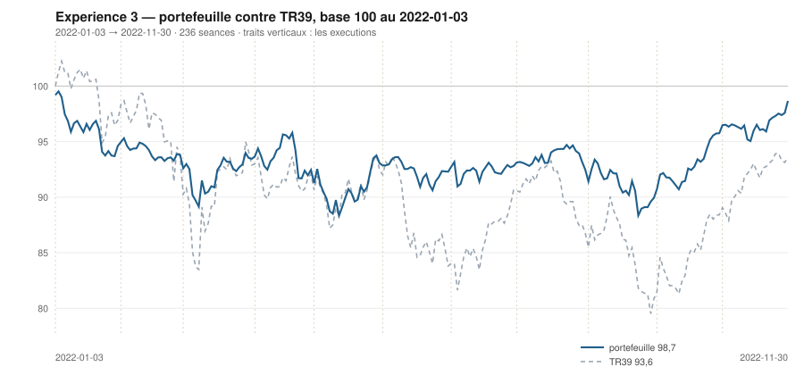

| | |
|---|---|
| Dotation initiale | 10 000,00 € au 2022-01-03 |
| Titres au 2022-11-30 | 5 559,96 € |
| Espèces | 4 307,14 € |
| **Total** | **9 867,10 €** |
| Base 100 | **98,67** |
| TR39, même base | 93,61 |
| Écart depuis janvier | **+5,06 pt** |

### Toutes les positions depuis le début de l'expérience

> Closes comme ouvertes. Une position encore ouverte laisse les deux dernières colonnes vides. Aucune séance postérieure au 2022-11-30 n'entre dans ce tableau.

| Société | Prix d'achat | Date d'achat | Prix de vente | Date de vente |
|---|---|---|---|---|
| `CAP.PA` Capgemini | 194,20 € | 2022-01-03 | 182,68 € | 2022-04-01 |
| `DSY.PA` Dassault Systèmes | 50,13 € | 2022-01-03 | 41,05 € | 2022-02-01 |
| `KER.PA` Kering | 558,25 € | 2022-03-01 | 454,99 € | 2022-06-01 |
| `HO.PA` Thales | 103,16 € | 2022-04-01 |  |  |
| `MT.AS` ArcelorMittal | 26,84 € | 2022-04-01 | 28,27 € | 2022-06-01 |
| `TTE.PA` TotalEnergies | 43,30 € | 2022-06-01 |  |  |
| `BN.PA` Danone | 46,97 € | 2022-08-01 | 45,67 € | 2022-09-01 |
| `RMS.PA` Hermès International | 1 226,95 € | 2022-09-01 |  |  |

*8 positions depuis le début, dont 3 encore ouvertes : les deux dernières colonnes restent vides.*

## 5. L'étude chartiste au 2022-10-31

> Notes rédigées sans aucune séance postérieure au 2022-10-31, par l'agent `chartiste`. Cinq lignes au plus par société, **chacune sous la figure de décision qui la justifie** — celle que la règle a lue ce jour-là, portant les cinq critères, les vetos et le verdict.

### 1. `ENGI.PA` — Engie

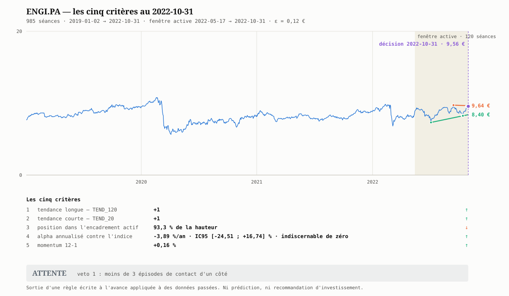

- Canal 8,40 – 9,64 €, clôture à 9,56 € à 93,3 % de la hauteur : sous le plafond.
- Pentes +0,013 et −0,003 €/séance, τ de 79 séances.
- Deux contacts de chaque côté : veto 1.
- **Momentum +0,2 %**, quasi nul ; alpha −3,9 %/an. Meilleur score de la date, et sous veto.

### 2. `HO.PA` — Thales

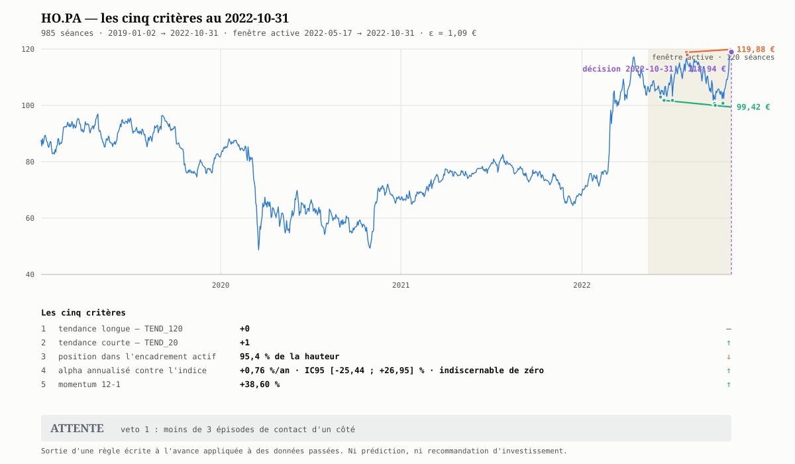

- Canal 99,42 – 119,88 €, clôture à 118,94 € à 95,4 %.
- Support −0,025 contre résistance +0,016 €/séance : ouverture, τ infini.
- Cinq contacts bas, deux hauts : veto 1.
- **Momentum +38,6 %, le plus fort de la date** ; alpha +0,8 %/an.

### 3. `TTE.PA` — TotalEnergies

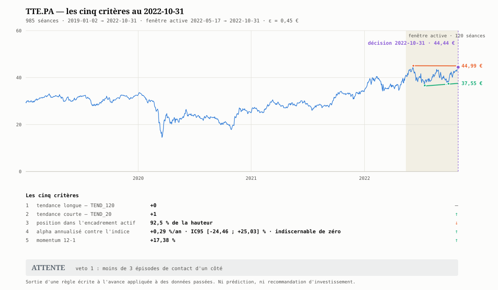

- Canal 37,55 – 44,99 €, clôture à 44,44 € à 92,5 % de la hauteur.
- Pentes +0,015 et −0,001 €/séance, τ de 489 séances.
- Deux contacts de chaque côté : veto 1.
- Momentum +17,4 %, alpha +0,3 %/an.

### 4. `CS.PA` — AXA

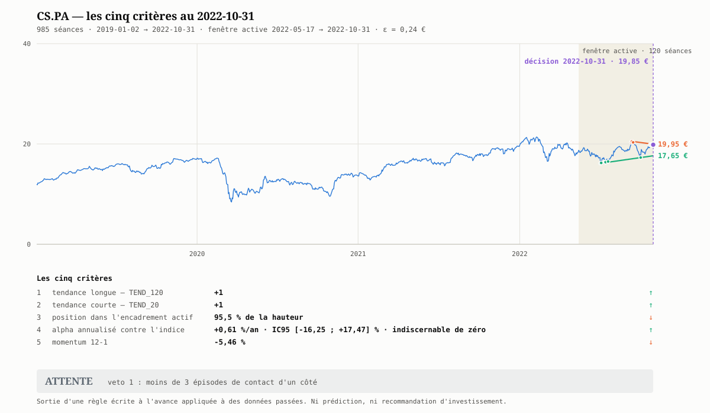

- Canal 17,65 – 19,95 €, clôture à 19,85 € à 95,5 % : contre le plafond.
- Pentes +0,018 et −0,017 €/séance, τ de 67 séances.
- Quatre contacts bas, deux hauts : veto 1.
- Momentum −5,5 %, alpha +0,6 %/an.

### 5. `RI.PA` — Pernod Ricard

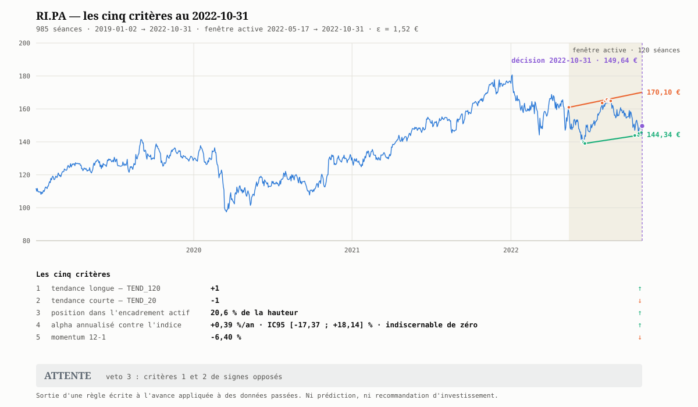

- Canal 144,34 – 170,10 €, clôture à 149,64 € à 20,6 %.
- Pentes +0,057 et +0,077 €/séance : ouverture, τ infini.
- Quatre contacts bas, trois hauts : figure lisible ; seul le veto 3 mord.
- Momentum −6,4 %, alpha +0,4 %/an.

### 6. `MC.PA` — LVMH

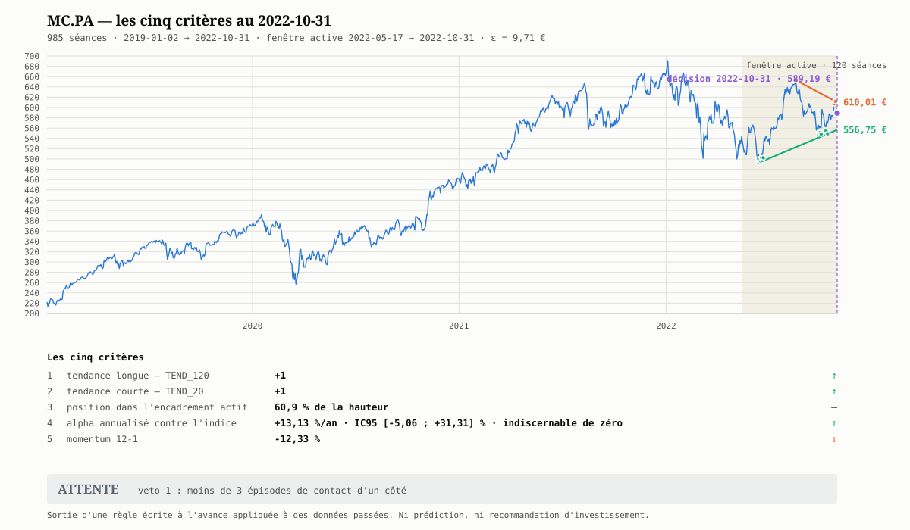

- Canal 556,75 – 610,01 €, clôture à 589,19 € à 60,9 % de la hauteur.
- Support +0,654 contre résistance −0,841 €/séance, τ de 36 séances.
- Trois contacts bas, deux hauts : veto 1.
- Momentum −12,3 %, alpha +13,1 %/an.

### 7. `RMS.PA` — Hermès International

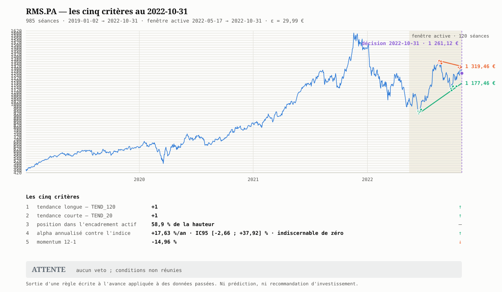

- Canal 1 177,46 – 1 319,46 €, clôture à 1 261,12 € à 58,9 % de la hauteur.
- Support +2,639 contre résistance −0,922 €/séance, τ de 40 séances.
- Trois contacts de chaque côté : **aucun veto**.
- Momentum −15,0 %, **alpha +17,6 %/an**, le plus élevé de la date, IC95 de −2,7 à +37,9.

### 8. `RNO.PA` — Renault

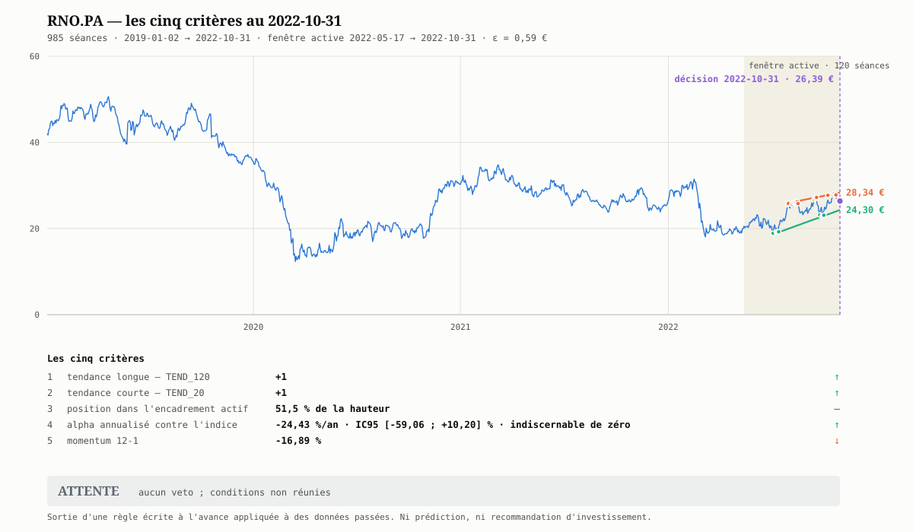

- Canal 24,30 – 28,34 €, clôture à 26,39 € à 51,5 % : le milieu.
- Pentes +0,068 et +0,038 €/séance, τ de 134 séances.
- Quatre contacts bas, cinq hauts : **aucun veto**.
- Momentum −16,9 %, alpha −24,4 %/an.

### 9. `PUB.PA` — Publicis

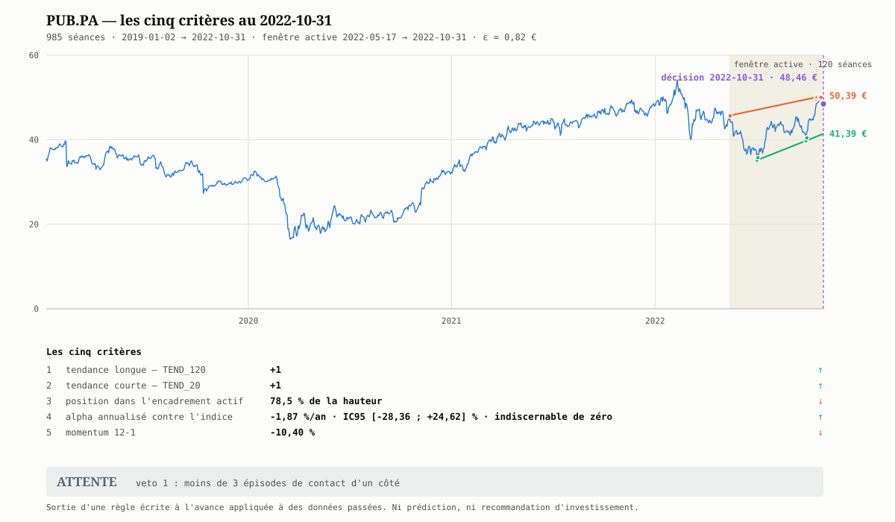

- Canal 41,39 – 50,39 €, clôture à 48,46 € à 78,5 %.
- Pentes +0,074 et +0,039 €/séance, τ de 257 séances.
- Deux contacts en support : veto 1.
- Momentum −10,4 %, alpha −1,9 %/an.

### 10. `WLN.PA` — Worldline

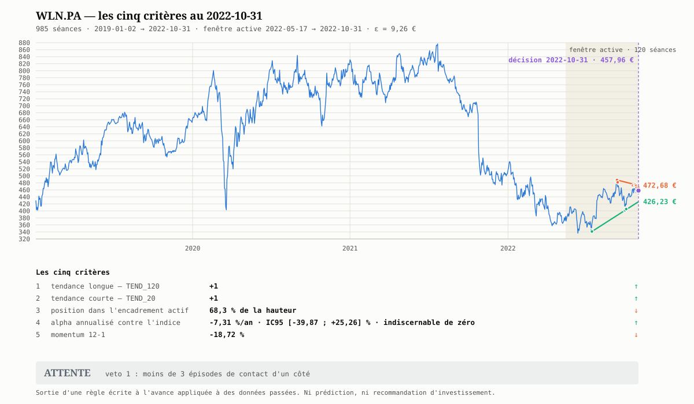

- Canal 426,23 – 472,68 €, clôture à 457,96 € à 68,3 %.
- Support +1,117 contre résistance −0,444 €/séance, τ de 30 séances.
- Deux contacts en support : veto 1.
- Momentum −18,7 %, alpha −7,3 %/an.

### 11. `SAF.PA` — Safran

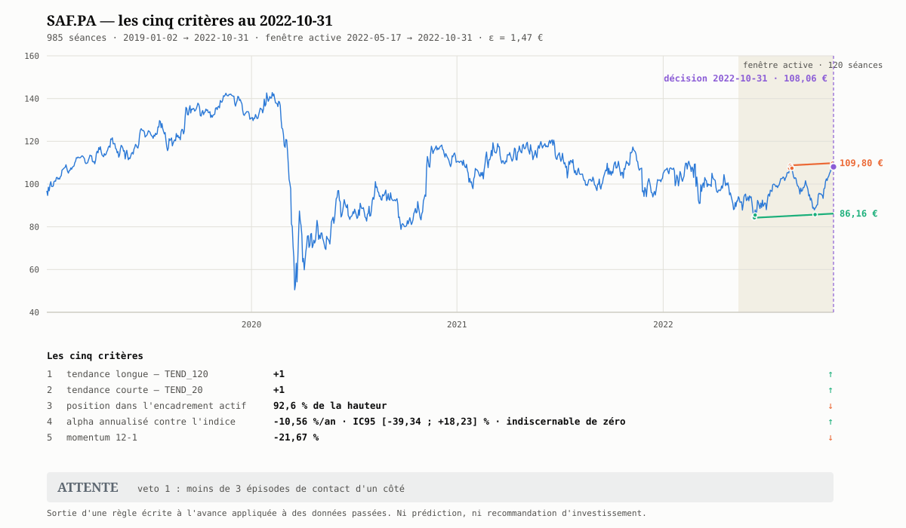

- Canal 86,16 – 109,80 €, clôture à 108,06 € à 92,6 % de la hauteur.
- Pentes +0,020 et +0,019 €/séance, quasi identiques : **τ de 46 839 séances** — deux siècles, autant dire un canal parallèle.
- Deux contacts de chaque côté : veto 1.
- Momentum −21,7 %, alpha −10,6 %/an.

### 12. `EL.PA` — EssilorLuxottica

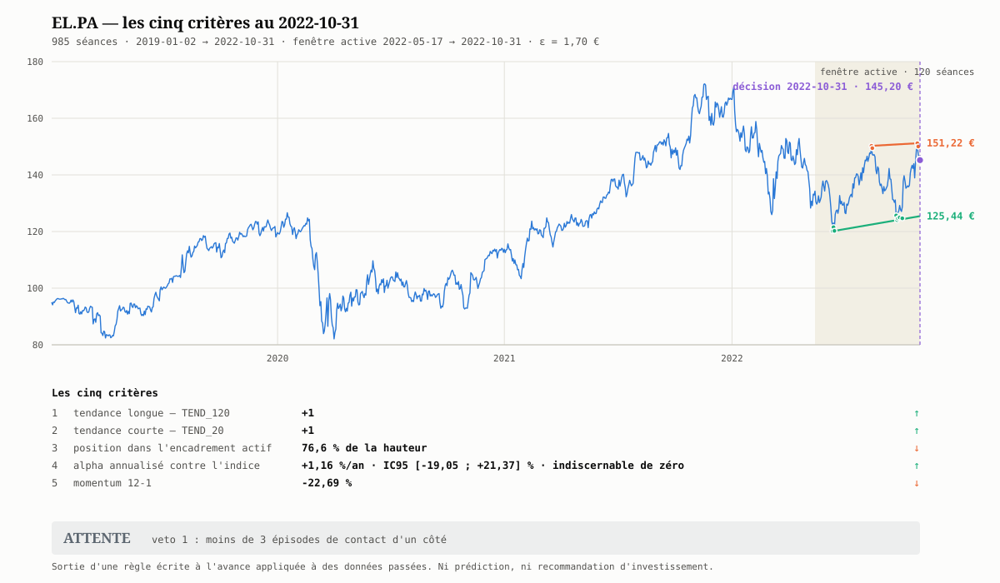

- Canal 125,44 – 151,22 €, clôture à 145,20 € à 76,6 % de la hauteur.
- Pentes +0,054 et +0,017 €/séance, τ de 713 séances.
- Deux contacts en résistance : veto 1.
- Momentum −22,7 %, alpha +1,2 %/an.

### 13. `ORA.PA` — Orange

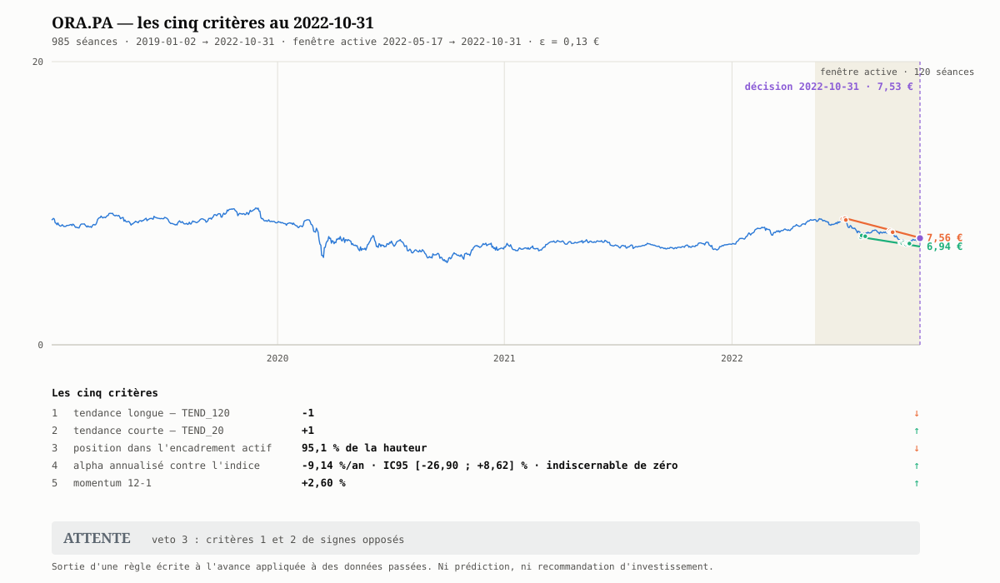

- Canal 6,94 – 7,56 €, clôture à 7,53 € à 95,1 %.
- Pentes −0,010 et −0,016 €/séance, τ de 98 séances.
- Trois contacts de chaque côté : figure lisible ; seul le veto 3 mord.
- Momentum +2,6 %, alpha −9,1 %/an.

### 14. `DG.PA` — Vinci

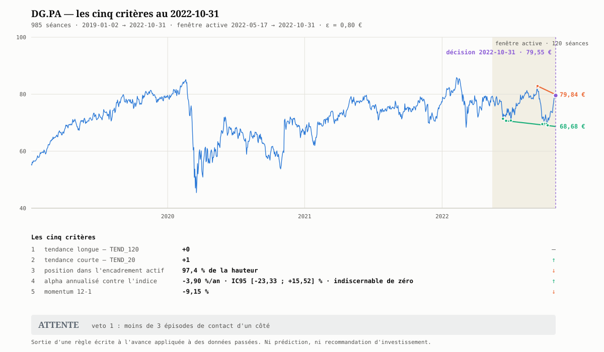

- Canal 68,68 – 79,84 €, clôture à 79,55 € à 97,4 % de la hauteur : contre le plafond.
- Pentes −0,021 et −0,089 €/séance, τ de 166 séances.
- **Six contacts en support** contre deux en résistance : veto 1.
- Momentum −9,2 %, alpha −3,9 %/an.

### 15. `STMPA.PA` — STMicroelectronics

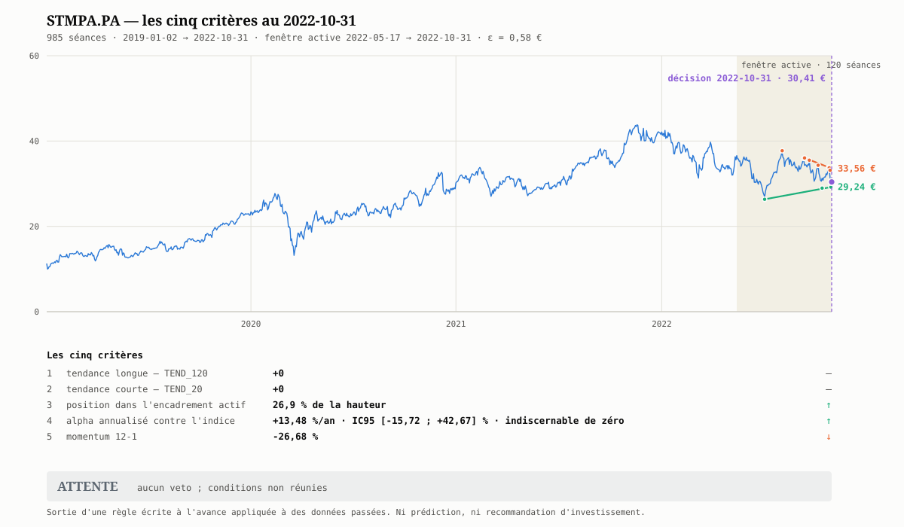

- Canal 29,24 – 33,56 €, clôture à 30,41 € à 26,9 % de la hauteur.
- Pentes +0,035 et −0,073 €/séance, τ de 40 séances.
- Trois contacts bas, cinq hauts : **aucun veto**.
- Momentum −26,7 %, alpha +13,5 %/an ; les deux tendances sont retombées à zéro.

### 16. `OR.PA` — L'Oréal

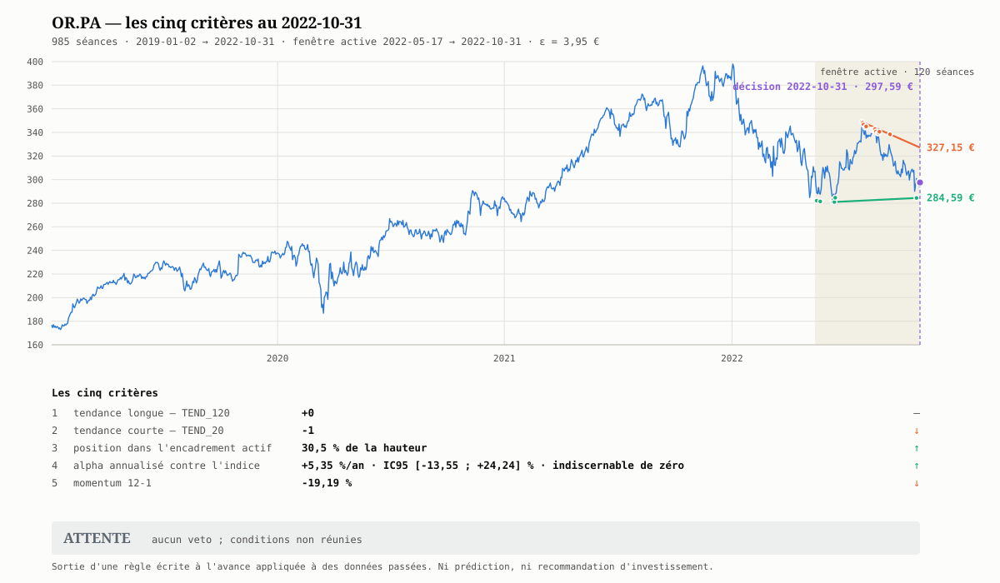

- Canal 284,59 – 327,15 €, clôture à 297,59 € à 30,5 %.
- Pentes +0,036 et −0,330 €/séance, τ de 116 séances.
- Quatre contacts bas, trois hauts : **aucun veto**.
- Momentum −19,2 %, alpha +5,3 %/an.

### 17. `SU.PA` — Schneider Electric

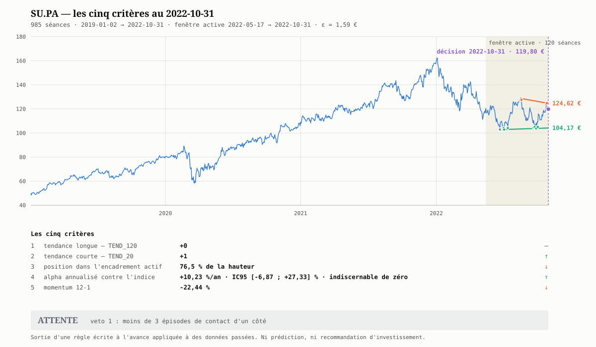

- Canal 104,17 – 124,62 €, clôture à 119,80 € à 76,5 %.
- Pentes +0,015 et −0,077 €/séance, τ de 221 séances.
- **Six contacts en support** contre deux en résistance : veto 1.
- Momentum −22,4 %, alpha +10,2 %/an.

### 18. `STLAP.PA` — Stellantis

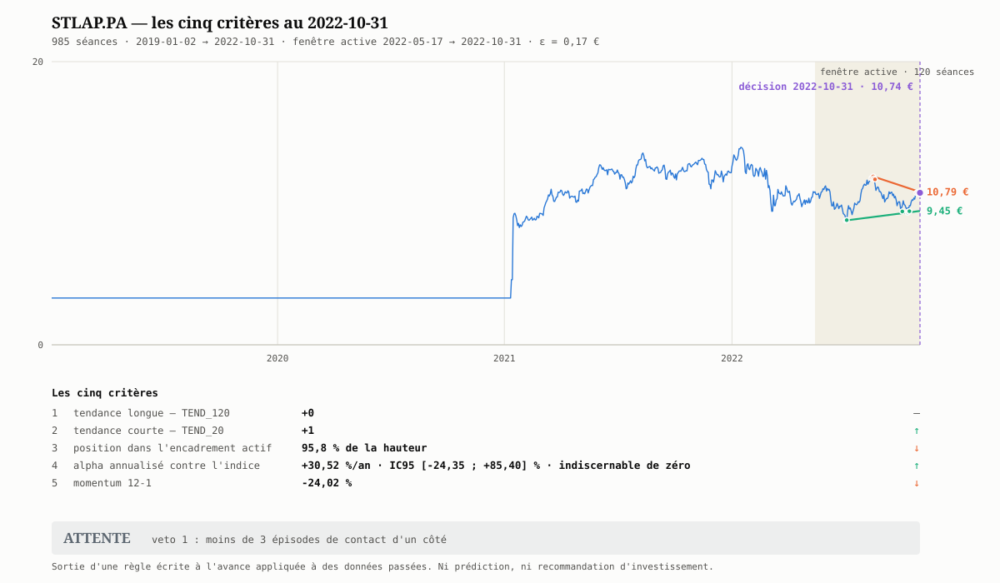

- Canal 9,45 – 10,79 €, clôture à 10,74 € à 95,8 % de la hauteur.
- Pentes +0,008 et −0,021 €/séance, τ de 47 séances.
- Deux contacts en résistance : veto 1.
- Momentum −24,0 %, alpha +30,5 %/an sur un IC95 de 110 points.

### 19. `CA.PA` — Carrefour

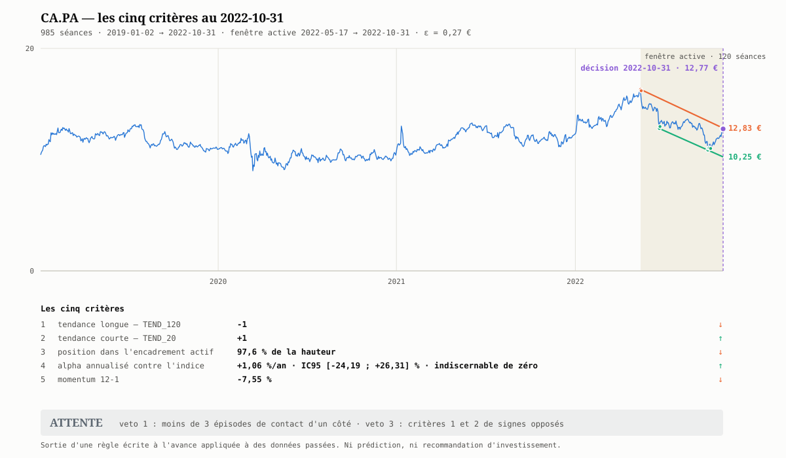

- Canal 10,25 – 12,83 €, clôture à 12,77 € à 97,6 % de la hauteur : contre le plafond.
- Pentes −0,028 et −0,029 €/séance, quasi identiques : τ de 1 761 séances.
- Deux contacts de chaque côté : veto 1 ; tendances opposées : veto 3.
- Momentum −7,5 %, alpha +1,1 %/an.

### 20. `SAN.PA` — Sanofi

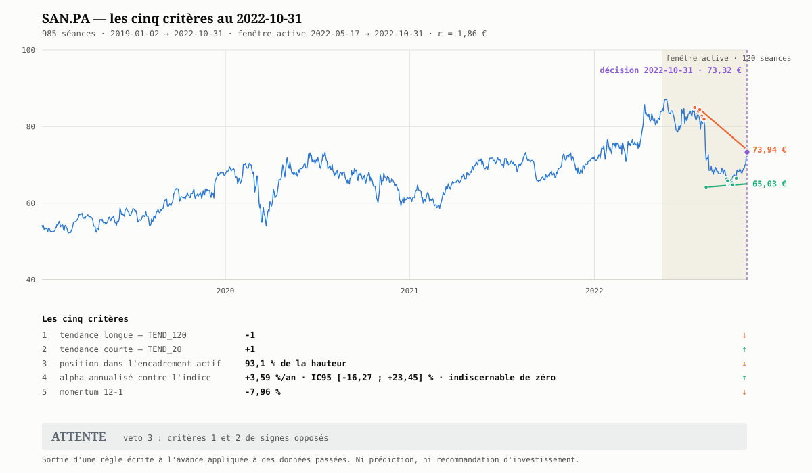

- Canal 65,03 – 73,94 €, clôture à 73,32 € à 93,1 %.
- Pentes +0,015 et −0,161 €/séance, τ de 51 séances.
- Trois contacts bas, quatre hauts : figure lisible ; veto 3 seul.
- Momentum −8,0 %, alpha +3,6 %/an.

### 21. `BN.PA` — Danone

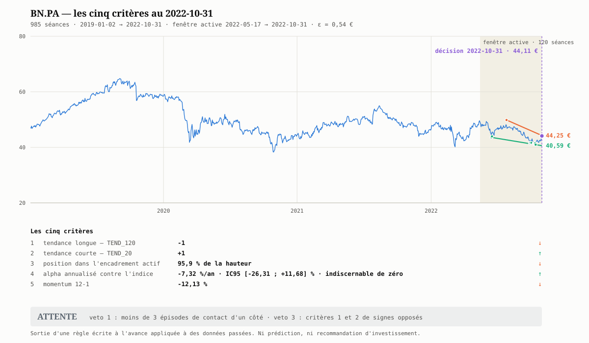

- Canal 40,59 – 44,25 €, clôture à 44,11 € à 95,9 %.
- Pentes −0,031 et −0,082 €/séance, τ de 71 séances.
- Trois contacts bas, deux hauts : veto 1 ; tendances opposées : veto 3.
- Momentum −12,1 %, alpha −7,3 %/an.

### 22. `AI.PA` — Air Liquide

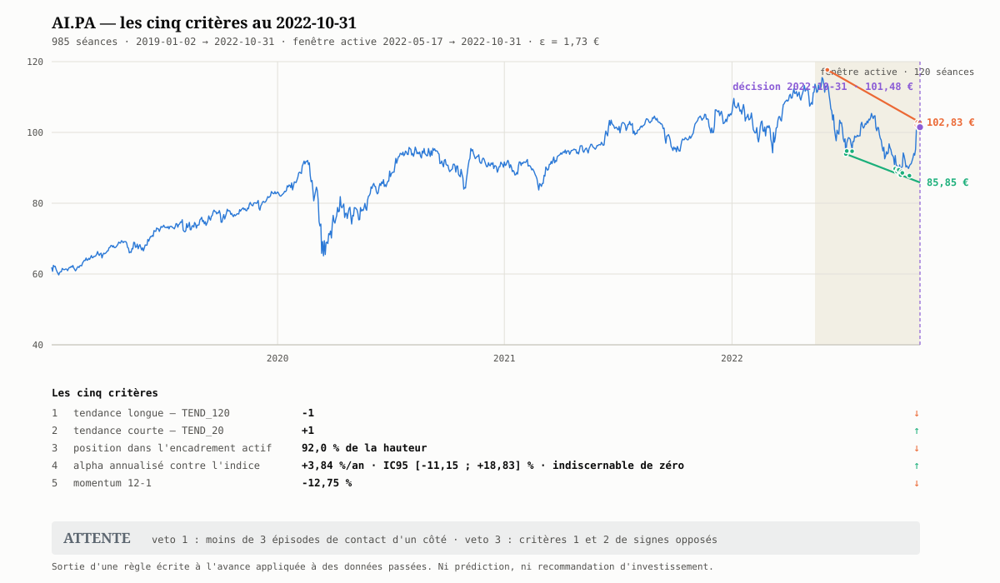

- Canal 85,85 – 102,83 €, clôture à 101,48 € à 92,0 %.
- Pentes −0,096 et −0,141 €/séance, τ de 373 séances.
- Deux contacts en résistance : veto 1 ; tendances opposées : veto 3.
- Momentum −12,8 %, alpha +3,8 %/an.

### 23. `EN.PA` — Bouygues

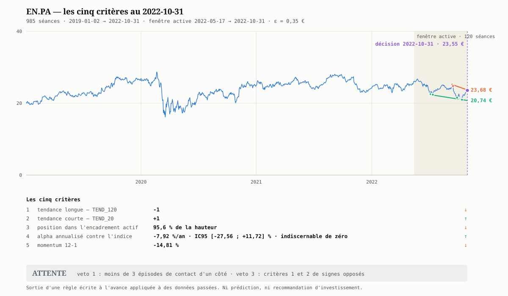

- Canal 20,74 – 23,68 €, clôture à 23,55 € à 95,6 % de la hauteur.
- Pentes −0,020 et −0,044 €/séance, τ de 121 séances.
- Quatre contacts bas, deux hauts : veto 1 ; tendances opposées : veto 3.
- Momentum −14,8 %, alpha −7,9 %/an.

### 24. `BNP.PA` — BNP Paribas

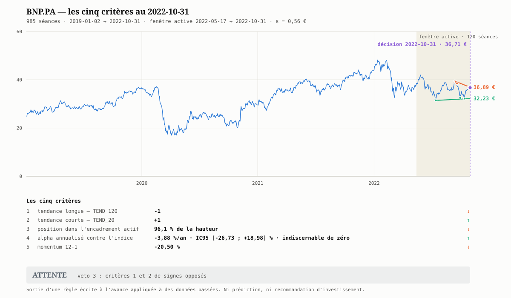

- Canal 32,23 – 36,89 €, clôture à 36,71 € à 96,1 % de la hauteur.
- Pentes +0,011 et −0,075 €/séance, τ de 54 séances.
- Trois contacts de chaque côté : figure lisible ; veto 3 seul.
- Momentum −20,5 %, alpha −3,9 %/an.

### 25. `CAP.PA` — Capgemini

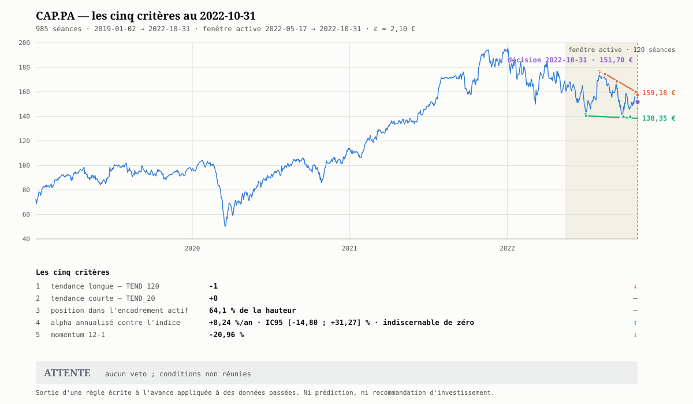

- Canal 138,35 – 159,18 €, clôture à 151,70 € à 64,1 % — un point sous le seuil haut.
- Pentes −0,024 et −0,290 €/séance, τ de 78 séances.
- Trois contacts bas, quatre hauts : **aucun veto**.
- Momentum −21,0 %, alpha +8,2 %/an.

### 26. `AIR.PA` — Airbus

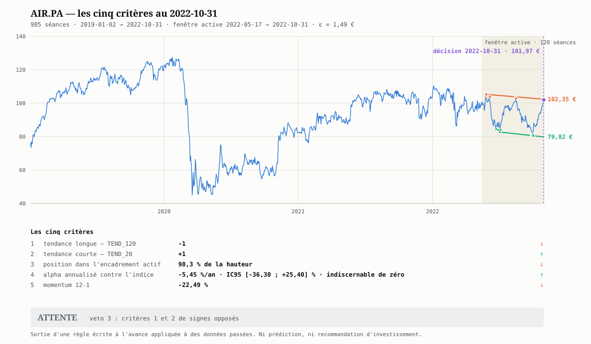

- Canal 79,82 – 102,35 €, clôture à 101,97 € à 98,3 % : à trente-huit centimes du plafond.
- Pentes −0,035 et −0,027 €/séance : ouverture, τ infini.
- Quatre contacts de chaque côté : figure bien étayée ; seul le veto 3 mord.
- Momentum −22,5 %, alpha −5,5 %/an.

### 27. `MT.AS` — ArcelorMittal

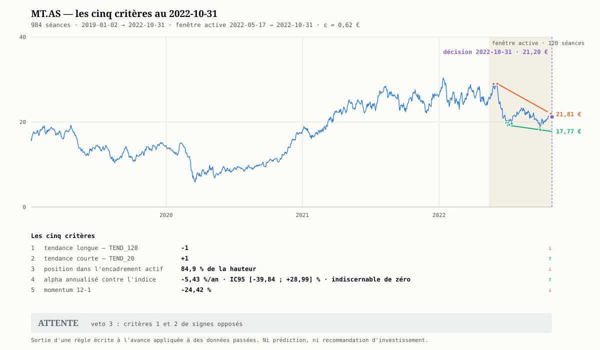

- Canal 17,77 – 21,81 €, clôture à 21,20 € à 84,9 %.
- Pentes −0,018 et −0,070 €/séance, τ de 78 séances.
- Trois contacts de chaque côté : figure lisible ; veto 3.
- Momentum −24,4 %, alpha −5,4 %/an.

### 28. `GLE.PA` — Société Générale

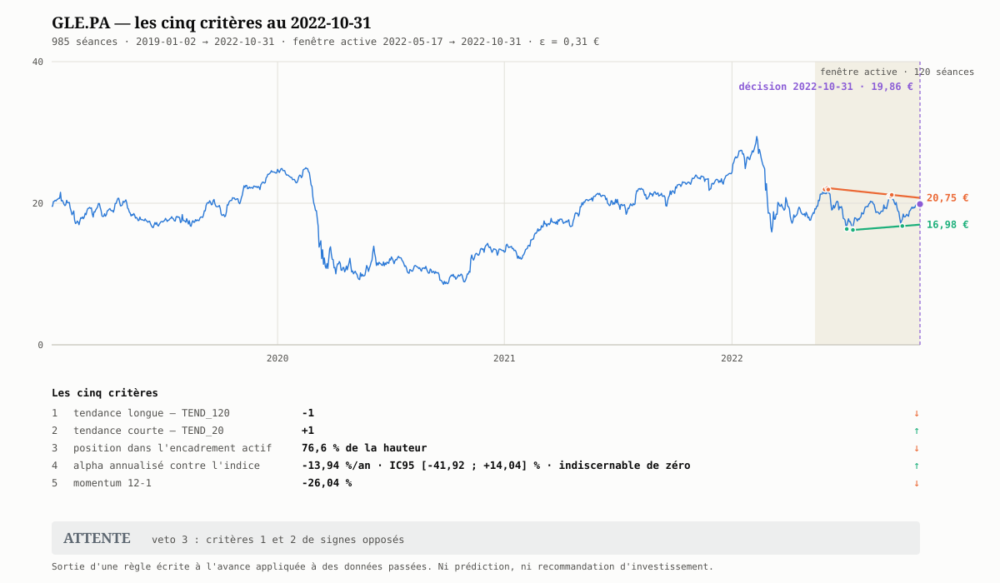

- Canal 16,98 – 20,75 €, clôture à 19,86 € à 76,6 % de la hauteur.
- Pentes +0,010 et −0,013 €/séance, τ de 163 séances.
- Trois contacts de chaque côté : figure lisible ; veto 3 seul.
- Momentum −26,0 %, alpha −13,9 %/an.

### 29. `TEP.PA` — Teleperformance

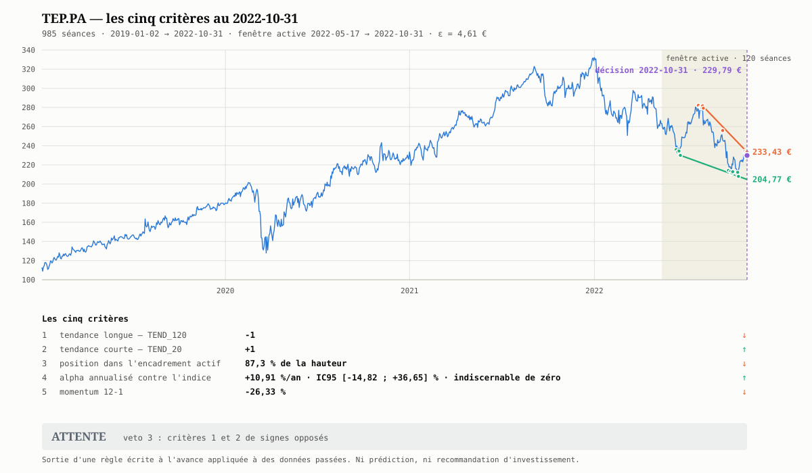

- Canal 204,77 – 233,43 €, clôture à 229,79 € à 87,3 %.
- Pentes −0,271 et −0,779 €/séance, τ de 56 séances.
- Quatre contacts de chaque côté : figure bien étayée ; seul le veto 3 mord.
- Momentum −26,3 %, alpha +10,9 %/an.

### 30. `LR.PA` — Legrand

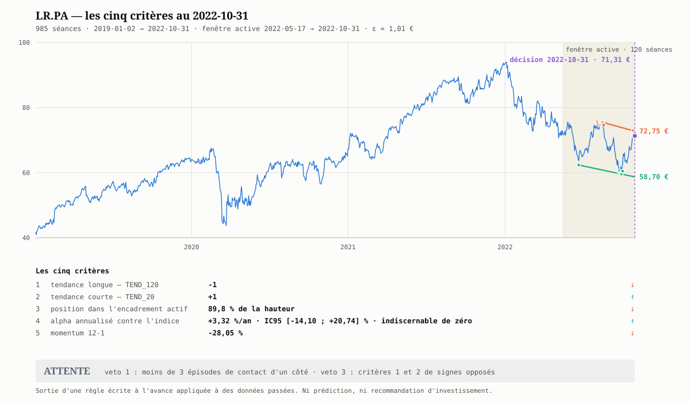

- Canal 58,70 – 72,75 €, clôture à 71,31 € à 89,8 %.
- Pentes −0,040 et −0,051 €/séance, τ de 1 193 séances.
- Deux contacts en support : veto 1 ; tendances opposées : veto 3.
- Momentum −28,1 %, alpha +3,3 %/an.

### 31. `ML.PA` — Michelin

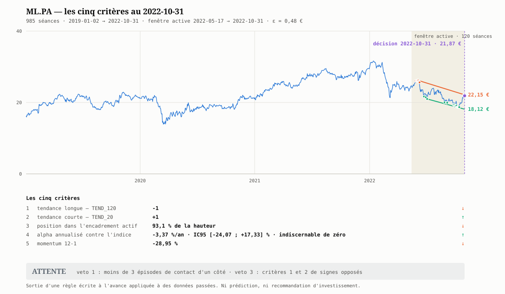

- Canal 18,12 – 22,15 €, clôture à 21,87 € à 93,1 % de la hauteur.
- Pentes −0,034 et −0,039 €/séance, τ de 914 séances.
- **Six contacts en support** contre deux en résistance : veto 1 ; tendances opposées : veto 3.
- Momentum −28,9 %, alpha −3,4 %/an.

### 32. `ACA.PA` — Crédit Agricole

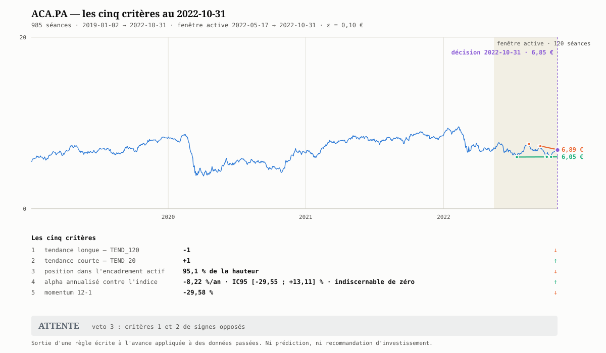

- Canal 6,05 – 6,89 €, large de 0,8 %, clôture à 6,85 € à 95,1 % de la hauteur.
- Pentes +0,000 et −0,013 €/séance, τ de 61 séances.
- Trois contacts de chaque côté : figure lisible ; veto 3.
- **Momentum −29,6 %**, le deuxième plus faible de la date ; alpha −8,2 %/an.

### 33. `VIE.PA` — Veolia

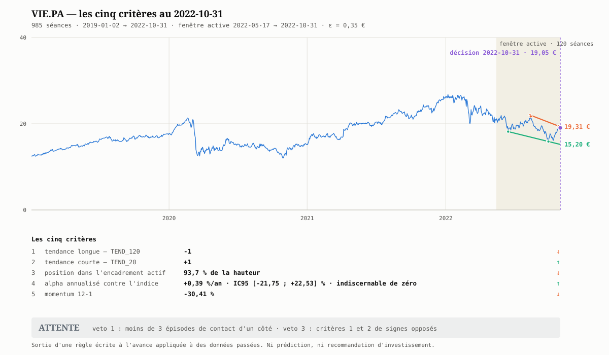

- Canal 15,20 – 19,31 €, clôture à 19,05 € à 93,7 % de la hauteur.
- Pentes −0,031 et −0,048 €/séance, τ de 237 séances.
- Deux contacts de chaque côté : veto 1 ; tendances opposées : veto 3.
- Momentum −30,4 %, alpha +0,4 %/an.

### 34. `DSY.PA` — Dassault Systèmes

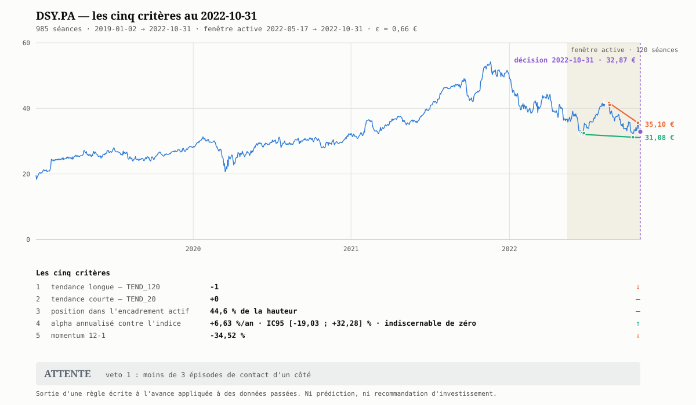

- Canal 31,08 – 35,10 €, clôture à 32,87 € à 44,6 % : le milieu.
- Pentes −0,011 et −0,129 €/séance, τ de 34 séances.
- Deux contacts de chaque côté : veto 1.
- Momentum −34,5 %, alpha +6,6 %/an.

### 35. `SGO.PA` — Saint-Gobain

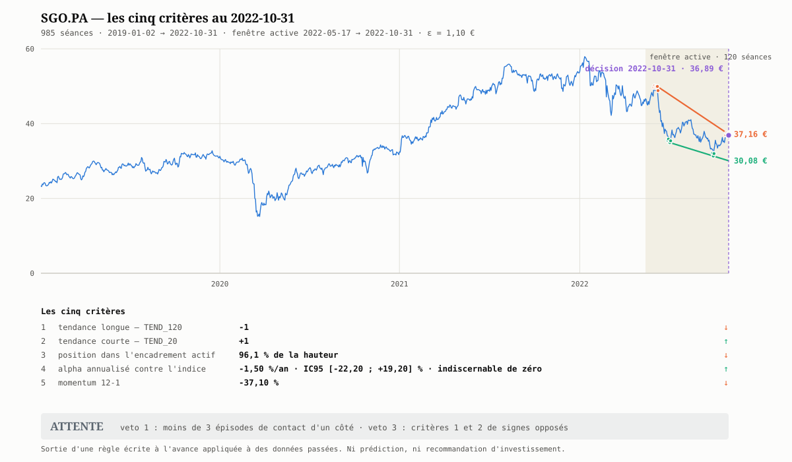

- Canal 30,08 – 37,16 €, clôture à 36,89 € à 96,1 % de la hauteur.
- Pentes −0,058 et −0,125 €/séance, τ de 105 séances.
- Deux contacts de chaque côté : veto 1 ; tendances opposées : veto 3.
- Momentum −37,1 %, alpha −1,5 %/an.

### 36. `ERF.PA` — Eurofins Scientific

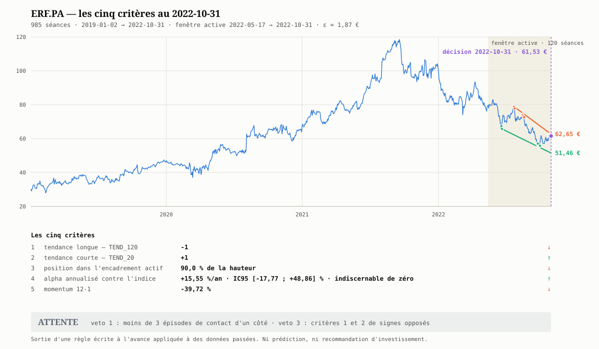

- Canal 51,46 – 62,65 €, clôture à 61,53 € à 90,0 %.
- Pentes −0,153 et −0,231 €/séance, τ de 145 séances.
- Deux contacts en support : veto 1 ; tendances opposées : veto 3.
- Momentum −39,7 %, **alpha +15,6 %/an**.

### 37. `ALO.PA` — Alstom

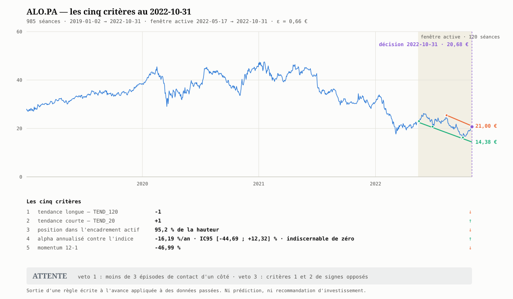

- Canal 14,38 – 21,00 €, clôture à 20,68 € à 95,2 % de la hauteur.
- Pentes −0,069 et −0,080 €/séance, τ de 627 séances.
- Deux contacts en résistance : veto 1 ; tendances opposées : veto 3.
- **Momentum −47,0 %**, le plus faible de la date ; alpha −16,2 %/an.

### 38. `VIV.PA` — Vivendi

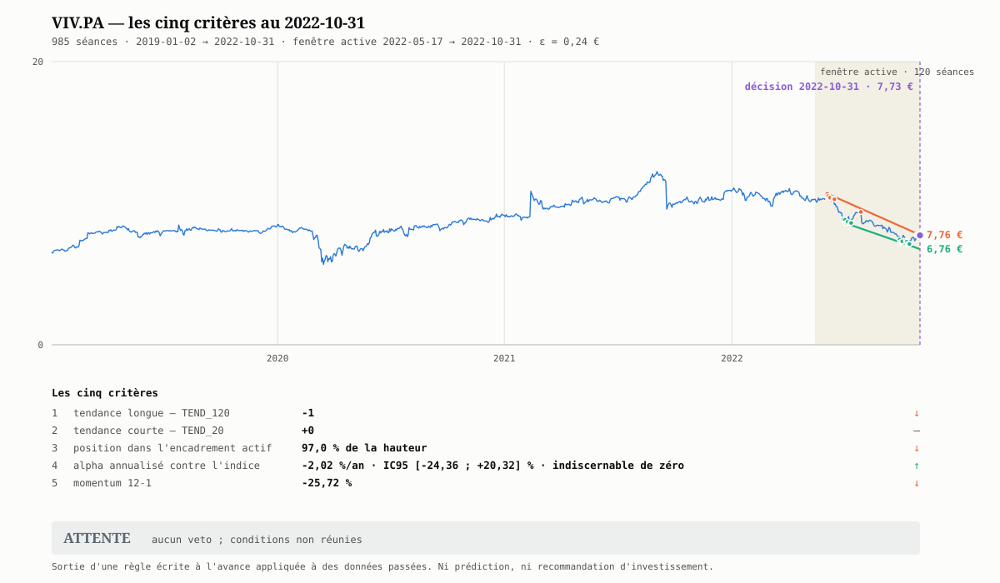

- Canal 6,76 – 7,76 €, clôture à 7,73 € à 97,0 % de la hauteur : contre le plafond.
- Pentes −0,022 et −0,028 €/séance, τ de 164 séances.
- Quatre contacts de chaque côté : **aucun veto** — figure bien étayée, et pourtant le score le plus bas de la date, −5.
- Momentum −25,7 %, alpha −2,0 %/an.

### 39. `KER.PA` — Kering

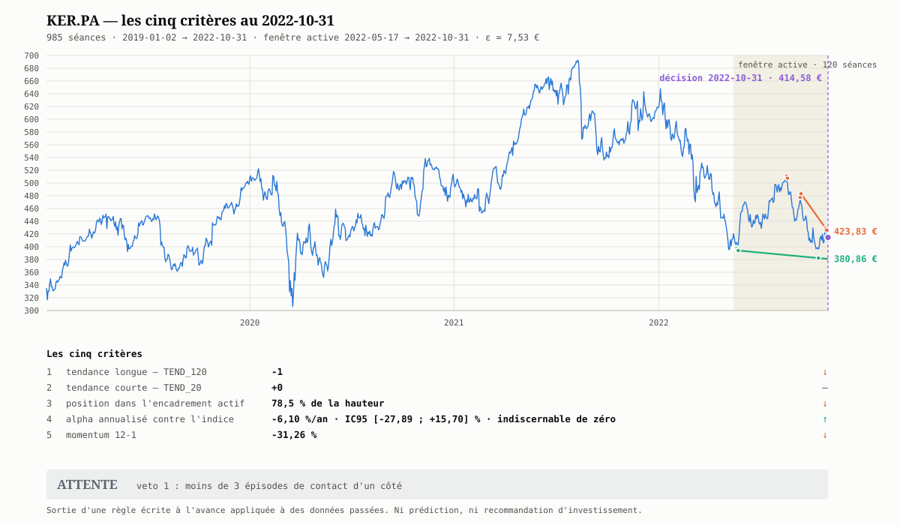

- Canal 380,86 – 423,83 €, clôture à 414,58 € à 78,5 %.
- Pentes −0,116 et −1,745 €/séance, τ de 26 séances.
- Deux contacts en support : veto 1.
- Momentum −31,3 %, alpha −6,1 %/an. Score −5.

## 6. Le classement au 2022-10-31

> De la valeur la plus intéressante à détenir à celle qu'il faut fuir. La colonne **τ** donne la date de péremption du canal en séances, la colonne **Vetos** les numéros déclenchés. Une valeur sous veto ne peut pas être achetée.

| Rang | Valeur | `s1` | `s2` | `s3` | `s4` | `s5` | Score | Position | Momentum | τ | Vetos |
|---|---|---|---|---|---|---|---|---|---|---|---|
| 1 | `ENGI.PA` Engie | +2 | +1 | -1 | +1 | +0 | **+3** | 93,3 % | +0,2 % | 79,4 | 1 |
| 2 | `HO.PA` Thales | +0 | +1 | -1 | +2 | +0 | **+2** | 95,4 % | +38,6 % | ∞ | 1 |
| 3 | `TTE.PA` TotalEnergies | +0 | +1 | -1 | +2 | +0 | **+2** | 92,5 % | +17,4 % | 489,3 | 1 |
| 4 | `CS.PA` AXA | +2 | +1 | -1 | -1 | +0 | **+1** | 95,5 % | -5,5 % | 66,7 | 1 |
| 5 | `RI.PA` Pernod Ricard | +2 | -1 | +1 | -1 | +0 | **+1** | 20,6 % | -6,4 % | ∞ | 3 |
| 6 | `MC.PA` LVMH | +2 | +1 | +0 | -2 | +0 | **+1** | 60,9 % | -12,3 % | 35,6 | 1 |
| 7 | `RMS.PA` Hermès International | +2 | +1 | +0 | -2 | +0 | **+1** | 58,9 % | -15,0 % | 39,9 | — |
| 8 | `RNO.PA` Renault | +2 | +1 | +0 | -2 | +0 | **+1** | 51,5 % | -16,9 % | 133,7 | — |
| 9 | `PUB.PA` Publicis | +2 | +1 | -1 | -2 | +0 | **+0** | 78,5 % | -10,4 % | 257,4 | 1 |
| 10 | `WLN.PA` Worldline | +2 | +1 | -1 | -2 | +0 | **+0** | 68,3 % | -18,7 % | 29,7 | 1 |
| 11 | `SAF.PA` Safran | +2 | +1 | -1 | -2 | +0 | **+0** | 92,6 % | -21,7 % | 46 839,0 | 1 |
| 12 | `EL.PA` EssilorLuxottica | +2 | +1 | -1 | -2 | +0 | **+0** | 76,6 % | -22,7 % | 713,1 | 1 |
| 13 | `ORA.PA` Orange | -2 | +1 | -1 | +1 | +0 | **-1** | 95,1 % | +2,6 % | 97,5 | 3 |
| 14 | `DG.PA` Vinci | +0 | +1 | -1 | -1 | +0 | **-1** | 97,4 % | -9,2 % | 166,1 | 1 |
| 15 | `STMPA.PA` STMicroelectronics | +0 | +0 | +1 | -2 | +0 | **-1** | 26,9 % | -26,7 % | 40,3 | — |
| 16 | `OR.PA` L'Oréal | +0 | -1 | +1 | -2 | +0 | **-2** | 30,5 % | -19,2 % | 116,1 | — |
| 17 | `SU.PA` Schneider Electric | +0 | +1 | -1 | -2 | +0 | **-2** | 76,5 % | -22,4 % | 220,7 | 1 |
| 18 | `STLAP.PA` Stellantis | +0 | +1 | -1 | -2 | +0 | **-2** | 95,8 % | -24,0 % | 47,0 | 1 |
| 19 | `CA.PA` Carrefour | -2 | +1 | -1 | -1 | +0 | **-3** | 97,6 % | -7,5 % | 1 761,0 | 1 3 |
| 20 | `SAN.PA` Sanofi | -2 | +1 | -1 | -1 | +0 | **-3** | 93,1 % | -8,0 % | 50,8 | 3 |
| 21 | `BN.PA` Danone | -2 | +1 | -1 | -2 | +0 | **-4** | 95,9 % | -12,1 % | 71,3 | 1 3 |
| 22 | `AI.PA` Air Liquide | -2 | +1 | -1 | -2 | +0 | **-4** | 92,0 % | -12,8 % | 372,8 | 1 3 |
| 23 | `EN.PA` Bouygues | -2 | +1 | -1 | -2 | +0 | **-4** | 95,6 % | -14,8 % | 120,8 | 1 3 |
| 24 | `BNP.PA` BNP Paribas | -2 | +1 | -1 | -2 | +0 | **-4** | 96,1 % | -20,5 % | 54,3 | 3 |
| 25 | `CAP.PA` Capgemini | -2 | +0 | +0 | -2 | +0 | **-4** | 64,1 % | -21,0 % | 78,1 | — |
| 26 | `AIR.PA` Airbus | -2 | +1 | -1 | -2 | +0 | **-4** | 98,3 % | -22,5 % | ∞ | 3 |
| 27 | `MT.AS` ArcelorMittal | -2 | +1 | -1 | -2 | +0 | **-4** | 84,9 % | -24,4 % | 77,9 | 3 |
| 28 | `GLE.PA` Société Générale | -2 | +1 | -1 | -2 | +0 | **-4** | 76,6 % | -26,0 % | 162,5 | 3 |
| 29 | `TEP.PA` Teleperformance | -2 | +1 | -1 | -2 | +0 | **-4** | 87,3 % | -26,3 % | 56,4 | 3 |
| 30 | `LR.PA` Legrand | -2 | +1 | -1 | -2 | +0 | **-4** | 89,8 % | -28,1 % | 1 192,5 | 1 3 |
| 31 | `ML.PA` Michelin | -2 | +1 | -1 | -2 | +0 | **-4** | 93,1 % | -28,9 % | 913,9 | 1 3 |
| 32 | `ACA.PA` Crédit Agricole | -2 | +1 | -1 | -2 | +0 | **-4** | 95,1 % | -29,6 % | 61,4 | 3 |
| 33 | `VIE.PA` Veolia | -2 | +1 | -1 | -2 | +0 | **-4** | 93,7 % | -30,4 % | 236,6 | 1 3 |
| 34 | `DSY.PA` Dassault Systèmes | -2 | +0 | +0 | -2 | +0 | **-4** | 44,6 % | -34,5 % | 34,0 | 1 |
| 35 | `SGO.PA` Saint-Gobain | -2 | +1 | -1 | -2 | +0 | **-4** | 96,1 % | -37,1 % | 104,9 | 1 3 |
| 36 | `ERF.PA` Eurofins Scientific | -2 | +1 | -1 | -2 | +0 | **-4** | 90,0 % | -39,7 % | 144,8 | 1 3 |
| 37 | `ALO.PA` Alstom | -2 | +1 | -1 | -2 | +0 | **-4** | 95,2 % | -47,0 % | 626,9 | 1 3 |
| 38 | `VIV.PA` Vivendi | -2 | +0 | -1 | -2 | +0 | **-5** | 97,0 % | -25,7 % | 164,1 | — |
| 39 | `KER.PA` Kering | -2 | +0 | -1 | -2 | +0 | **-5** | 78,5 % | -31,3 % | 26,4 | 1 |

## 7. Les ordres exécutés au 2022-11-01

> À l'**ouverture** de la séance, jamais à la clôture du 2022-10-31.

*Aucun ordre : le classement ne déclenche ni entrée ni sortie.*

## 8. La lecture du mois

Sur le mois, la meilleure contribution vient de `RMS.PA` (Hermès International) pour **+223,26 €**, la moins bonne de `HO.PA` (Thales) pour **-108,17 €**. Aucun ordre, donc aucun frais : le classement, l'hystérésis ou les vetos ont retenu le portefeuille en l'état. Le portefeuille termine le mois **derrière TR39** de 2,83 point. Sur les 46 thèses du mois précédent qui ont pu être tranchées, **30 sont confirmées** — 65,2 %.

## 9. Les thèses écrites au 2022-10-31

> Elles seront dépouillées à la prochaine date de décision, dans le fichier du mois suivant. Elles sont engendrées mécaniquement par les règles du [protocole](../README.md#le-registre-des-thèses-réfutables) — aucune n'est rédigée à la main.

| Valeur | Thèse | Énoncé, à dépouiller au mois suivant |
|---|---|---|
| `ACA.PA` | Canal | clôture entre 6,05 € et 6,60 € au 2022-11-30 |
| `ACA.PA` | Reflexive | AUCUNE SEQUENCE : écart contre TR39 dans ± 6,43 pt (σ̂), au 2022-11-30 |
| `AI.PA` | Canal | clôture entre 83,74 € et 99,72 € au 2022-11-30 |
| `AIR.PA` | Canal | clôture entre 79,05 € et 101,76 € au 2022-11-30 |
| `ALO.PA` | Canal | clôture entre 12,86 € et 19,25 € au 2022-11-30 |
| `ALO.PA` | Reflexive | AUCUNE SEQUENCE : écart contre TR39 dans ± 9,38 pt (σ̂), au 2022-11-30 |
| `BN.PA` | Canal | clôture entre 39,91 € et 42,44 € au 2022-11-30 |
| `BNP.PA` | Canal | clôture entre 32,46 € et 35,24 € au 2022-11-30 |
| `BNP.PA` | Reflexive | AUCUNE SEQUENCE : écart contre TR39 dans ± 7,09 pt (σ̂), au 2022-11-30 |
| `CA.PA` | Canal | clôture entre 9,64 € et 12,19 € au 2022-11-30 |
| `CAP.PA` | Canal | clôture entre 137,83 € et 152,80 € au 2022-11-30 |
| `CS.PA` | Canal | clôture entre 18,04 € et 19,58 € au 2022-11-30 |
| `CS.PA` | Reflexive | AUTO-RENFORCEMENT : écart contre TR39 au-dessus de +2,99 pt (0,5 σ̂), au 2022-11-30 |
| `DG.PA` | Canal | clôture entre 68,21 € et 77,89 € au 2022-11-30 |
| `DSY.PA` | Canal | clôture entre 30,85 € et 32,27 € au 2022-11-30 |
| `EL.PA` | Canal | clôture entre 126,62 € et 151,60 € au 2022-11-30 |
| `EN.PA` | Canal | clôture entre 20,31 € et 22,71 € au 2022-11-30 |
| `ENGI.PA` | Canal | clôture entre 8,69 € et 9,58 € au 2022-11-30 |
| `ERF.PA` | Canal | clôture entre 48,09 € et 57,58 € au 2022-11-30 |
| `ERF.PA` | Reflexive | AUCUNE SEQUENCE : écart contre TR39 dans ± 7,74 pt (σ̂), au 2022-11-30 |
| `GLE.PA` | Canal | clôture entre 17,20 € et 20,46 € au 2022-11-30 |
| `GLE.PA` | Reflexive | AUCUNE SEQUENCE : écart contre TR39 dans ± 8,60 pt (σ̂), au 2022-11-30 |
| `HO.PA` | Canal | clôture entre 98,88 € et 120,23 € au 2022-11-30 |
| `KER.PA` | Canal | clôture entre 378,30 € et 385,44 € au 2022-11-30 |
| `LR.PA` | Canal | clôture entre 57,83 € et 71,62 € au 2022-11-30 |
| `MC.PA` | Canal | clôture entre 571,14 € et 591,51 € au 2022-11-30 |
| `ML.PA` | Canal | clôture entre 17,37 € et 21,30 € au 2022-11-30 |
| `MT.AS` | Canal | clôture entre 17,38 € et 20,28 € au 2022-11-30 |
| `MT.AS` | Reflexive | AUCUNE SEQUENCE : écart contre TR39 dans ± 9,87 pt (σ̂), au 2022-11-30 |
| `OR.PA` | Canal | clôture entre 285,39 € et 319,88 € au 2022-11-30 |
| `ORA.PA` | Canal | clôture entre 6,72 € et 7,20 € au 2022-11-30 |
| `PUB.PA` | Canal | clôture entre 43,03 € et 51,26 € au 2022-11-30 |
| `RI.PA` | Canal | clôture entre 145,59 € et 171,79 € au 2022-11-30 |
| `RMS.PA` | Canal | clôture entre 1 235,51 € et 1 299,17 € au 2022-11-30 |
| `RNO.PA` | Canal | clôture entre 25,79 € et 29,17 € au 2022-11-30 |
| `SAF.PA` | Canal | clôture entre 86,59 € et 110,22 € au 2022-11-30 |
| `SAN.PA` | Canal | clôture entre 65,35 € et 70,40 € au 2022-11-30 |
| `SGO.PA` | Canal | clôture entre 28,81 € et 34,41 € au 2022-11-30 |
| `STLAP.PA` | Canal | clôture entre 9,63 € et 10,34 € au 2022-11-30 |
| `STMPA.PA` | Canal | clôture entre 30,00 € et 31,96 € au 2022-11-30 |
| `SU.PA` | Canal | clôture entre 104,51 € et 122,92 € au 2022-11-30 |
| `TEP.PA` | Canal | clôture entre 198,81 € et 216,30 € au 2022-11-30 |
| `TEP.PA` | Reflexive | AUCUNE SEQUENCE : écart contre TR39 dans ± 6,18 pt (σ̂), au 2022-11-30 |
| `TTE.PA` | Canal | clôture entre 37,87 € et 44,98 € au 2022-11-30 |
| `VIE.PA` | Canal | clôture entre 14,52 € et 18,25 € au 2022-11-30 |
| `VIV.PA` | Canal | clôture entre 6,28 € et 7,15 € au 2022-11-30 |
| `VIV.PA` | Reflexive | AUCUNE SEQUENCE : écart contre TR39 dans ± 4,78 pt (σ̂), au 2022-11-30 |
| `WLN.PA` | Canal | clôture entre 450,81 € et 462,91 € au 2022-11-30 |
| `WLN.PA` | Reflexive | AUTO-RENFORCEMENT : écart contre TR39 au-dessus de +5,49 pt (0,5 σ̂), au 2022-11-30 |

---

[← Octobre](2022-10.md) · [Protocole](../README.md) · [Décembre →](2022-12.md)
